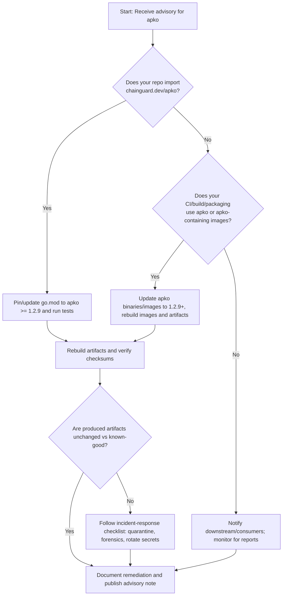

Executive summary

Fiber maintainers and operators: a high-severity supply-chain advisory (GHSA-fpg8-7664-jc5q / CVE-2026-54174) was published for the Go package chainguard.dev/apko on 2026-07-10. The advisory describes an incomplete package integrity verification in Apko that allowed substitution of package data content (the data section) while a signed control section still validated. The vulnerability is fixed in apko v1.2.9; vulnerable versions are < 1.2.9. See the advisory for details: https://github.com/advisories/GHSA-fpg8-7664-jc5q.

There is no explicit mention in the supplied Fiber repository metadata or latest release notes that Fiber (gofiber/fiber) depends on chainguard.dev/apko. Based solely on the provided repository README and metadata, we found no evidence that Fiber imports or ships apko. However, project maintainers and downstream consumers should still treat this as a supply-chain advisory: verify your build/CI toolchains, container images, packaging pipelines, and any transitive dependencies or developer tooling that may use apko. The remainder of this briefing separates facts from advisory guidance and gives verification and remediation steps.


Table of contents

- [Facts (what is known)](#facts-what-is-known)
- [Advisory summary (what the advisory says)](#advisory-summary-what-the-advisory-says)
- [Is Fiber directly affected? (explicit answer)](#is-fiber-directly-affected-explicit-answer)
- [Dependency-chain relevance and risk scenarios](#dependency-chain-relevance-and-risk-scenarios)
- [Verification commands (examples)](#verification-commands-examples)
- [Severity box and affected range table](#severity-box-and-affected-range-table)
- [Actions maintainers should take (practical checklist)](#actions-maintainers-should-take-practical-checklist)
- [Incident-response checklist (for suspected compromise)](#incident-response-checklist-for-suspected-compromise)
- [Decision checklist / Action checklist](#decision-checklist--action-checklist)
- [Evidence, assumptions, and limitations](#evidence-assumptions-and-limitations)
- [Mermaid decision flow](#mermaid-decision-flow)
- [FAQs](#faqs)
- [Sources](#sources)


## Table of contents

- [Facts (what is known)](#facts-what-is-known)
- [Advisory summary (what the advisory says)](#advisory-summary-what-the-advisory-says)
- [Is Fiber directly affected? (explicit answer)](#is-fiber-directly-affected-explicit-answer)
- [Dependency-chain relevance and risk scenarios](#dependency-chain-relevance-and-risk-scenarios)
- [Verification commands (examples only)](#verification-commands-examples-only)
- [Severity box and affected range table](#severity-box-and-affected-range-table)
- [Actions maintainers should take (practical checklist)](#actions-maintainers-should-take-practical-checklist)
- [Incident-response checklist (for suspected compromise)](#incident-response-checklist-for-suspected-compromise)
- [Decision checklist / Action checklist](#decision-checklist-action-checklist)
- [Evidence, assumptions, and limitations](#evidence-assumptions-and-limitations)
- [Mermaid decision flow](#mermaid-decision-flow)
- [Embedded evidence image](#embedded-evidence-image)
- [FAQs](#faqs)
- [Article metadata (SEO & schema)](#article-metadata-seo-schema)

## Facts (what is known)

- The GitHub Security Advisory GHSA-fpg8-7664-jc5q (CVE-2026-54174) affects the Go package chainguard.dev/apko. [GHSA-fpg8-7664-jc5q](https://github.com/advisories/GHSA-fpg8-7664-jc5q).
- The advisory summary (as published) states: "melange: Incomplete package integrity verification allows data section substitution" and describes that Apko verified control section hashes (for files like .PKGINFO) but did not verify the data section hash. This allowed an attacker who could compromise a mirror/cache/MITM to substitute arbitrary file contents while control hash checks passed. The advisory's text is included in the supplied metadata.
- The advisory was published on 2026-07-10 and the patched apko version is 1.2.9 (vulnerable range: < 1.2.9). See the advisory link above.
- The supplied Fiber repository metadata (gofiber/fiber) includes repository information and a latest release v3.4.0 published 2026-07-02. The README and topics supplied with the repository metadata do not mention chainguard.dev/apko or apko.

> [!NOTE]
> All facts above are taken from the supplied repository metadata and the supplied GitHub Security Advisory. This briefing does not include results from live network scans or repository checks beyond the supplied data.


## Advisory summary (what the advisory says)

- Vulnerable package: chainguard.dev/apko (ecosystem: go).
- Vulnerable range: versions earlier than 1.2.9.
- CVE: CVE-2026-54174.
- Advisory summary: Apko did not verify the data section hash of packages — only the control section was verified against the signed index. An attacker who could manipulate mirrors/caches or perform a MITM could substitute package file contents while passing control-section verification.
- Severity (as published in advisory metadata): high.

CITE: https://github.com/advisories/GHSA-fpg8-7664-jc5q


## Is Fiber directly affected? (explicit answer)

- Direct exposure: Based on the supplied project metadata and README content for gofiber/fiber, there is no explicit evidence in the provided data that Fiber directly imports or uses chainguard.dev/apko. Therefore, the advisory does not explicitly name Fiber as affected.

- Important distinction: "Not explicitly affected" is not the same as "no risk at all". Build tooling, CI pipelines, release packaging, or downstream consumers may use apko independently of Fiber's runtime code. Such indirect use is outside the code imports captured in a repository's go.mod but can still affect distributions or deployable artifacts.

> [!TIP]
> If your organization produces Alpine packages, container images, or uses apko in any packaging or CI step, treat this advisory as relevant until you confirm the absence of apko in those systems.


## Dependency-chain relevance and risk scenarios

This section describes the realistic ways apko's issue could matter to Fiber projects and users.

- Scenario A — direct import: If Fiber's source code or its official middleware imports chainguard.dev/apko, then a code-level update would be required. (Fact check: no evidence in provided metadata that Fiber imports apko.)

- Scenario B — build/packaging tool presence: Many projects use external tools to build distributable artifacts. If maintainers or downstream packagers use apko to produce Alpine packages, apko could be used to assemble packages that include substituted or tampered data files. This is a supply-chain risk even when the repository does not import apko.

- Scenario C — CI images and containers: The vulnerability matters if any build container images, base images, or developer tooling images in CI include apko (e.g., an image that contains apko binaries or scripts). An attacker who can manipulate package mirrors could deliver tampered files into those build artifacts.

- Scenario D — distribution mirrors and caches: The advisory explicitly mentions mirrors and caches. If any team or package mirror between an apko client and upstream can be compromised, package contents could be substituted.

Table: Example risk vectors (inferred from advisory text; label: inferred)

| Risk vector | Why it matters | Inferred from advisory? |
|---|---:|---:|
| Build-time packaging (apko used to produce Alpine packages) | Tampered package contents could be installed on production systems | Yes (inferred from advisory text about package substitution) |
| CI runner images containing apko | Build-time supply-chain compromise could taint release artifacts | Yes (general supply-chain inference) |
| Transitive import by a tool used in release scripts | If a tool your pipeline imports uses apko internally, the pipeline is at risk | Yes (inferred) |


## Verification commands (examples only)

Use these as safe, read-only checks in your repository and CI environment. They are examples and must be adapted to your environment. These commands are generic and non-invasive.

- Check for apko in Go module graph (run from project repo root):

```bash
# Example: will print apko if present in module graph
go list -m all | grep "chainguard.dev/apko" || true
```

- Search repo and local scripts for references to apko (safe, read-only):

```bash
# Search code, CI config, and scripts
git grep -n "apko" || true
grep -R "chainguard.dev/apko" .github CI scripts || true
```

- Inspect container images used by CI for apko binaries (example; adapt to your runner):

```bash
# List files in an image (requires docker; example only)
docker run --rm --entrypoint=sh my-ci-image -c 'which apko || true; apko --version 2>/dev/null || true'
```

- Search package manager caches or mirrors that you control for apko artifacts (example):

```bash
# Example checks for apko-related packages in alpine package caches
ls /var/cache/apk | grep apko || true
```

> [!NOTE]
> The commands above are provided as examples only. Tailor them to your environment and obtain appropriate approvals before running in CI or production.


## Severity box and affected range table

> [!WARNING]
> Severity: HIGH (as reported in the advisory metadata). The advisory explicitly lists apko versions < 1.2.9 as vulnerable and lists patched_versions as 1.2.9. See the official advisory for authoritative details.

Affected range table

| Component | Affected versions | Patched version | Advisory URL |
|---|---|---|---|
| chainguard.dev/apko | < 1.2.9 | 1.2.9 | https://github.com/advisories/GHSA-fpg8-7664-jc5q |

Notes: the advisory applies to the apko package itself. The supplied Fiber repository metadata does not list apko as a dependency.


## Actions maintainers should take (practical checklist)

This section gives prioritized, practical actions for Fiber maintainers, release engineers, and operators. Do not treat this as legal or compliance advice.

Top-level recommendations

1. Confirm whether apko is present anywhere in your organization’s toolchain (CI images, release scripts, packaging tools). If present, upgrade to apko v1.2.9 or later.
2. Audit the transitive dependency graph of any tools used during build and packaging steps (not just go.mod in the application code).
3. If you or downstream packagers use apko to produce Alpine packages, assume the risk is relevant and rebuild packages using patched apko; re-verify package contents.
4. If you find apko in any runner images or container images, rebuild those images from trusted sources after updating apko.

Recommended action table

| Priority | Target | Action | Rationale |
|---:|---|---|---|
| P0 | Build & release pipeline images | Inspect for apko, update apko to >= 1.2.9, rebuild images and pinned runners | Prevent tampered packages being introduced during build-time packaging (high risk) |
| P0 | Packaging steps (if you produce Alpine packages) | Recreate/publish packages using apko v1.2.9+; verify data checksums against known-good sources | Advisory shows data section not verified in earlier apko versions |
| P1 | Repository (code) | Run go list -m all and search repo for chainguard.dev/apko to confirm absence/presence | Quick confirmation whether the library is imported directly |
| P1 | CI configs (.github, GitLab, etc.) | Search for apko usage or apko-based scripts; update workflows to pin patched apko | CI scripts are common hidden vectors |
| P2 | Downstream projects & integrators | Notify integrators and package maintainers if you publish packages that could be created with apko | Reduce downstream exposure |

Patch / update guidance

- If you control the build pipelines that use apko: upgrade the apko binary/library to v1.2.9 and rebuild all artifacts produced with earlier apko versions.
- If you consume Alpine packages produced by third parties: request or verify that the producer rebuilt packages with apko >= 1.2.9 and provide checksums signed by a known-good key.


## Incident-response checklist (for suspected compromise)

If you have reason to suspect that an artifact was built with a vulnerable apko or that package contents may have been substituted, follow this checklist.

1. Quarantine affected artifacts: take the suspected package, container, or image out of distribution and mark it as potentially compromised.
2. Preserve logs and metadata: collect CI logs, package manifest files (.PKGINFO), published index files, timestamps, and mirror URLs used during the build.
3. Verify origin signatures and control section validity: compare signed control-section data from the published index with upstream signed indexes.
4. Reconstruct build: using a clean build environment with apko >= 1.2.9, rebuild artifacts and compare file-level checksums to the suspected artifact.
5. Rotate keys and credentials if you find evidence of tampering or compromise in your build environment or mirrors.
6. Notify downstream consumers and registries: publish a transparency notice describing artifact identifiers and the re-built replacements.
7. Run forensic analysis on CI runners and images to determine compromise scope; if a runner image contained apko and was compromised, rebuild all images and rotate secrets.
8. After remediation, perform a staged redeploy and monitor for anomalies (integrity checks, unusual connections, or suspicious logs).

> [!WARNING]
> If you confirm tampering of package contents produced by apko <1.2.9, treat affected hosts as potentially compromised and follow your incident-response escalation path.


## Decision checklist / Action checklist

Use this short checklist to decide next steps quickly.

- Do you use apko directly in any repository, packaging, or CI images? -> Yes: upgrade to 1.2.9 and rebuild artifacts. No: continue.
- Do your CI images or build runners include apko binaries? -> Yes: rebuild images after updating apko. No: continue.
- Do you produce Alpine packages or consume packages from a producer that may use apko? -> If yes, request proof of rebuild or re-verify artifacts.
- Are your mirrors or caches under your control? -> If yes, ensure mirror integrity and update any cached artifacts produced with vulnerable apko.


## Evidence, assumptions, and limitations

Evidence (from supplied data)

- Advisory: GHSA-fpg8-7664-jc5q / CVE-2026-54174 (published 2026-07-10). [https://github.com/advisories/GHSA-fpg8-7664-jc5q].
- Fiber repository metadata (gofiber/fiber) and latest release v3.4.0 (release published 2026-07-02). [https://github.com/gofiber/fiber] and [https://github.com/gofiber/fiber/releases/tag/v3.4.0].

Assumptions and inferred conclusions (explicitly labeled)

- Inference: That apko is relevant to a project only if it appears in the project's toolchain, CI images, packaging scripts, or transitive dependencies. This is an architectural conclusion inferred from the advisory description describing package creation and mirror/cache threats.
- Assumption: The provided repository metadata and README do not list apko; therefore, there is no direct evidence in the supplied data that Fiber's source code imports chainguard.dev/apko. This is a fact about the supplied metadata, not a claim about the whole project or its external pipelines.

Limitations

- We did not run live scans of your source code, CI runners, or build images. All statements about Fiber's exposure are drawn from the supplied repository metadata and the advisory.
- Supply-chain exposures can exist outside repository code (runner images, build host images, packaging tools). This briefing cannot detect those without access to your operational environment.

Generated / retrieval date

- This briefing was composed using supplied data and generated on 2026-07-13T01:55:41.810262+00:00 (the generation timestamp in the supplied editorial data).


## Mermaid decision flow




## Embedded evidence image


## FAQs

1. Q: Is Fiber (gofiber/fiber) explicitly vulnerable to CVE-2026-54174?
   A: No. The supplied advisory targets chainguard.dev/apko and does not name Fiber. The supplied Fiber repository metadata does not show a direct dependency on apko. You must, however, verify build and packaging toolchains because apko is a packaging/build-time tool.

2. Q: What versions of apko are vulnerable?
   A: The supplied advisory metadata lists vulnerable versions as < 1.2.9 and the patched version as 1.2.9. See the advisory: https://github.com/advisories/GHSA-fpg8-7664-jc5q.

3. Q: If I use Fiber but do not produce Alpine packages, do I need to act?
   A: Likely lower priority. If you do not package with apko and your CI/build images do not contain apko, direct exposure is unlikely. Still confirm your CI images and any packaging steps to be certain.

4. Q: How should I verify whether my CI images include apko?
   A: Inspect the Dockerfiles and images used by your runners for an apko binary or references to chainguard.dev/apko. Example commands are provided in the verification section above; adapt them to your environment.

5. Q: What if I find apko in images but cannot upgrade immediately?
   A: As an interim mitigation, restrict access to the runners/images, block untrusted mirrors, and avoid creating production releases from those runners until you can upgrade. Plan a rebuild of images with apko >= 1.2.9.

6. Q: Where can I read the official advisory?
   A: The advisory is available on GitHub: https://github.com/advisories/GHSA-fpg8-7664-jc5q.


## Sources

- Fiber canonical repository: https://github.com/gofiber/fiber
- Fiber latest GitHub release (v3.4.0): https://github.com/gofiber/fiber/releases/tag/v3.4.0
- GitHub Security Advisory GHSA-fpg8-7664-jc5q: https://github.com/advisories/GHSA-fpg8-7664-jc5q


## Article metadata (SEO & schema)

Canonical: https://madewithwhat.net/security/fiber-apko-cve-2026-54174

Open Graph:
- og:title: "Fiber (gofiber) security briefing: Apko CVE-2026-54174"
- og:description: "Security briefing: GHSA-fpg8-7664-jc5q (CVE-2026-54174) for apko — what Fiber maintainers need to know and steps to remediate."
- og:url: https://madewithwhat.net/security/fiber-apko-cve-2026-54174
- og:image: https://madewithwhat.net/assets/2026/01/16/security-alert-fiber-24-cover.jpg

JSON-LD article schema (minimal):

```json
{
  "@context": "https://schema.org",
  "@type": "Article",
  "headline": "Fiber (gofiber) security briefing: Apko CVE-2026-54174",
  "description": "Security briefing: GHSA-fpg8-7664-jc5q (CVE-2026-54174) for apko — what Fiber maintainers need to know, how to verify exposure, and recommended actions.",
  "url": "https://madewithwhat.net/security/fiber-apko-cve-2026-54174",
  "datePublished": "2026-01-16",
  "dateModified": "2026-07-13",
  "author": { "@type": "Organization", "name": "MadeWithWhat" }
}
```


End of briefing

If you want, we can produce a short, copy-ready advisory notice for your project README/CHANGELOG or a ready-to-send message for downstream package consumers and integrators.

## FAQ

### Is Fiber (gofiber/fiber) explicitly vulnerable to CVE-2026-54174?

No. The supplied advisory targets chainguard.dev/apko and does not name Fiber. The provided Fiber repository metadata does not show a direct dependency on apko. Maintain vigilance for indirect exposure via CI, packaging, or images.

### Which apko versions are vulnerable and which version fixes the issue?

The advisory lists vulnerable versions as any version earlier than 1.2.9. The patched release is apko v1.2.9. See the official advisory for details.

### What should I do if my CI images contain apko?

Rebuild CI images after updating apko to v1.2.9 or later, and avoid producing releases from runners that contain vulnerable apko until images are rebuilt and validated.

### How can I quickly check whether a repository references apko?

Run read-only checks such as 'go list -m all | grep "chainguard.dev/apko"' and 'git grep -n "apko"' from the repository root; adapt these examples to your environment.

### Do I need to rebuild artifacts created with apko <1.2.9?

Yes. If you used apko <1.2.9 to produce packages, rebuild them with apko >=1.2.9 and verify file-level checksums against known-good sources.

### Where is the official advisory published?

The advisory is on GitHub: https://github.com/advisories/GHSA-fpg8-7664-jc5q.
