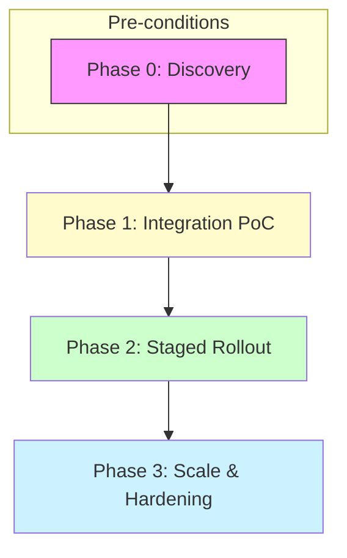

Executive summary

Haystack is an open-source AI orchestration framework focused on building modular, production-ready pipelines and agent workflows; vLLM is a high-throughput, memory-efficient inference and serving engine for LLMs. This guide helps engineering teams decide whether to adopt vLLM as the inference backend for Haystack-based applications and provides a phased, test-driven migration plan covering inventory, compatibility risks, API and data concerns, rollback gates, and cases where migration is not justified.

Use this guide when you control your model-serving layer (on-prem or cloud VMs/GPUs) and want a dedicated, high-throughput LLM execution engine behind Haystack's retrieval, routing, and generation orchestration. If you rely exclusively on third-party hosted model APIs (OpenAI, Azure OpenAI, etc.) or prefer managed model serving, the migration may not be warranted.

Table of contents

- [Decision context and target outcome](#decision-context-and-target-outcome)
- [Suitability assessment](#suitability-assessment)
- [Inventory & compatibility risks](#inventory--compatibility-risks)
  - [What to inventory](#what-to-inventory)
  - [Compatibility risk matrix](#compatibility-risk-matrix)
- [Phased migration plan (high level)](#phased-migration-plan-high-level)
  - [Phase 0: Discovery & smoke tests](#phase-0-discovery--smoke-tests)
  - [Phase 1: Integration PoC](#phase-1-integration-poc)
  - [Phase 2: Staged rollout](#phase-2-staged-rollout)
  - [Phase 3: Scale & hardening](#phase-3-scale--hardening)
- [Test strategy and acceptance criteria](#test-strategy-and-acceptance-criteria)
- [Data, model, and API concerns](#data-model-and-api-concerns)
- [Rollback gates and safety valves](#rollback-gates-and-safety-valves)
- [When migration is NOT justified](#when-migration-is-not-justified)
- [Decision checklist / Action checklist](#decision-checklist--action-checklist)
- [Evidence, assumptions, and limitations](#evidence-assumptions-and-limitations)
- [Sources](#sources)
- [FAQs](#faqs)

## Table of contents

- [Decision context and target outcome](#decision-context-and-target-outcome)
- [Suitability assessment](#suitability-assessment)
- [Inventory & compatibility risks](#inventory-compatibility-risks)
- [Phased migration plan (high level)](#phased-migration-plan-high-level)
- [Test strategy and acceptance criteria](#test-strategy-and-acceptance-criteria)
- [Data, model, and API concerns](#data-model-and-api-concerns)
- [Rollback gates and safety valves](#rollback-gates-and-safety-valves)
- [When migration is NOT justified](#when-migration-is-not-justified)
- [Migration mapping (components & tasks)](#migration-mapping-components-tasks)
- [Decision checklist / Action checklist](#decision-checklist-action-checklist)
- [Evidence, assumptions, and limitations](#evidence-assumptions-and-limitations)
- [Data image: example telemetry to collect during canary](#data-image-example-telemetry-to-collect-during-canary)
- [Two helpful tables (quick reference)](#two-helpful-tables-quick-reference)
- [FAQs](#faqs)

## Decision context and target outcome

Goal: replace or augment the current model execution layer used by Haystack pipelines with vLLM as the dedicated model server/runner. Expected outcomes include clearer separation between orchestration (Haystack) and execution (vLLM), predictable host-level control over GPU/CPU inference, and access to vLLM-specific execution features where applicable.

Constraints and facts used to prepare this guide: Haystack is an open orchestration framework focused on modular pipelines and agent workflows and is available from its canonical repository ([deepset-ai/haystack](https://github.com/deepset-ai/haystack)) and its v2.31.0 release notes describe a move toward modular integrations and deprecations relevant to generator/connector components. vLLM is an inference and serving engine described in its repository ([vllm-project/vllm](https://github.com/vllm-project/vllm)) and in the v0.25.0 release notes that emphasize engine-level performance and model support. Repository metadata used in this article is current as of 2026-07-13 (data generation date: 2026-07-13T02:01:27Z).

## Suitability assessment

Use the table below to decide whether vLLM is a suitable target for your project. This is a short checklist of technical fit, operations fit, and product fit.

| Criterion | When vLLM is suitable | When vLLM is not suitable |
|---|---:|---|
| Control over serving infra | You can host and manage GPU/CPU nodes and prefer a self-hosted inference engine | You rely exclusively on managed model APIs and cannot host inference nodes |
| Throughput & latency control | You need deterministic, high-throughput inference tuning (batching, quantization, GPU optimizations) | Your app is low-volume or latency is dominated by upstream calls, making engine-level optimizations irrelevant |
| Model compatibility | You need to host HF-compatible decoder-only or multimodal models that vLLM supports | You require models or features not supported by vLLM (check vLLM's supported-model list) |
| Integration style | You want Haystack orchestration to call a local/clustered model server (HTTP/gRPC/OpenAI-compatible API) | Your pipelines expect only vendor APIs with closed-source SLAs and cannot be replaced |

> [!NOTE]
> This suitability summary is drawn from the public project descriptions and release notes of Haystack and vLLM (sources cited in this article). Treat model compatibility as an explicit step in your inventory: vLLM advertises broad Hugging Face model compatibility, but you must verify the specific model, tokenizer, and quantization path you intend to use. See [vLLM repo](https://github.com/vllm-project/vllm) and [Haystack repo](https://github.com/deepset-ai/haystack) for authoritative lists.

## Inventory & compatibility risks

What to inventory

1. Haystack components in use: PromptBuilders, Generators (legacy vs ChatGenerators), Connectors, Custom components, and any deprecated components that the Haystack release notes mention will be moved to integration packages. The Haystack v2.31.0 release notes list deprecations and migration snippets for several components — use those to find components that need import changes or replacement ([Haystack v2.31.0 release notes](https://github.com/deepset-ai/haystack/releases/tag/v2.31.0)).

2. Model endpoints currently used: hosted vendor APIs (OpenAI/Azure/Bare-metal), local model binaries, or previous in-house serving engines.

3. Traffic profile: QPS, average tokens per request, burst characteristics, and concurrent sessions. (Collect from runtime metrics; do not invent values here.)

4. Data flow and privacy constraints: whether models process PII, regulated data, or require on-prem hosting.

5. Operational constraints: GPU types, cluster management, scaling, and monitoring integrations.

Compatibility risk matrix

| Risk area | Details | Mitigation |
|---|---|---|
| Protocol/API mismatch | Haystack expects LLM components (Generators/ChatGenerators) with certain input types (str or ChatMessage list). vLLM exposes OpenAI-compatible endpoints and other frontends but check exact request/response shapes. | Use Haystack's ChatGenerator components and/or local adapter code that converts Haystack pipeline outputs to vLLM API input. Run unit tests for message format transformations. See Haystack docs and move to ChatGenerators where indicated by release notes. ([Haystack v2.31.0 release notes](https://github.com/deepset-ai/haystack/releases/tag/v2.31.0)) |
| Model format & features | vLLM supports many HF-compatible models and a wide quantization palette, but not every exotic model or custom layer is guaranteed. | Verify the exact model family and tokenizer are supported by vLLM's supported-model list in the vLLM repo. Run local validation prefill and generation tests. ([vLLM repo](https://github.com/vllm-project/vllm)) |
| Tokenization / system prompt handling | Haystack's shift from legacy Generators to ChatGenerators changes how system prompts and ChatMessage dataclasses are represented. | Confirm pipeline edges convert str -> list[ChatMessage] or switch to ChatPromptBuilder. The Haystack release notes document these migration patterns. ([Haystack v2.31.0 release notes](https://github.com/deepset-ai/haystack/releases/tag/v2.31.0)) |
| Operational scaling & GPU resource mismatch | vLLM's throughput features rely on specific GPU features and kernel stacks. If your cluster lacks compatible GPUs or drivers, performance characteristics will vary. | Inventory hardware, drivers, and CUDA/HIP compatibility. Run scaled benchmarks in a test environment before production rollout. See vLLM release notes for supported hardware and kernel notes. ([vLLM v0.25.0 release notes](https://github.com/vllm-project/vllm/releases/tag/v0.25.0)) |
| Dependency & packaging drift | Haystack v2.x is moving heavy components to integration packages; imports may change. | Follow Haystack's deprecation notes and install required integration packages if you use components that moved out of core. ([Haystack v2.31.0 release notes](https://github.com/deepset-ai/haystack/releases/tag/v2.31.0)) |

> [!WARNING]
> Do not assume drop-in compatibility between your current generator clients and vLLM's API. Haystack's release notes explicitly document generator-to-chat migration patterns; treat this as required work during migration planning.

## Phased migration plan (high level)

Below is a recommended four-phase approach you can adapt to your team and risk tolerance.

Phase 0: Discovery & smoke tests

- Duration: 1–2 sprints (team-dependent).
- Tasks:
  - Inventory components, models, and traffic patterns (as above).
  - Confirm project constraints (legal, security, uptime SLA).
  - Stand up a dev vLLM instance (local or dev cluster) and run a smoke test with a small HF model known to be supported by vLLM.
  - Verify Haystack pipeline can call the vLLM endpoint through a thin adapter or via the OpenAI-compatible endpoint if available.

Phase 1: Integration PoC

- Duration: 2–4 weeks.
- Goals: Prove end-to-end pipeline through Haystack -> vLLM for representative request types (RAG query, chat session, tool-calling flow).
- Tasks:
  - Implement an adapter component in Haystack that encapsulates the vLLM API contract and performs necessary ChatMessage mapping. Prefer using Haystack ChatGenerators where possible per Haystack docs.
  - Test with the same prompts, system messages, and sample documents used in production.
  - Measure functional parity: identical (or acceptably similar) reply shapes, metadata, and reference handling.
  - Validate telemetry/observability (latency metrics, tokens, error rates).

Phase 2: Staged rollout

- Duration: multiple weeks; progressively increase production traffic share.
- Strategy: Traffic-splitting or canary rollout (10% -> 50% -> 100%), with automated A/B checks at each gate.
- Tasks:
  - Run comparative tests under load (synthetic traffic) to validate latency and resource utilization.
  - Validate failure modes (e.g., vLLM OOM, model decode errors) and that Haystack pipeline error-handling degrades gracefully.
  - Monitor business KPIs tied to answer quality and latency.

Phase 3: Scale & hardening

- Duration: ongoing.
- Tasks:
  - Add autoscaling, lifecycle management, and runbook updates.
  - Harden security posture (mTLS/ACLs for internal model endpoints).
  - Archive legacy serving code or keep as fallback depending on rollback needs.

## Test strategy and acceptance criteria

Define both functional and non-functional tests.

Functional tests (unit & integration)

- Message format: verify that string inputs and ChatMessage lists from Haystack map correctly to vLLM request payloads and that responses map back to Haystack's expected reply dataclasses.
- Prompt fidelity: ensure system prompts and templates generate expected tokens and reply structure.
- Tool calls and structured outputs: if your pipelines rely on structured response parsing, validate the structured outputs end-to-end.

Non-functional tests

- Stability: run sustained runs to detect memory leaks or OOM conditions in vLLM under your workload.
- Resource usage: monitor GPU/CPU, VRAM, and host memory under representative load.
- Latency & throughput: ensure the production SLOs are met at each rollout gate.

Acceptance gates (examples you can enforce)

- PoC gate: All functional tests pass for representative inputs; adapter component present in tree; dev vLLM instance reachable.
- Canary gate: Error rate on canary traffic ≤ baseline + tolerance; no severe regressions in user-facing metrics after 24–72 hours.
- Full rollout gate: Operational runbooks in place; autoscaling validated; rollback playbook rehearsed.

## Data, model, and API concerns

- Data residency and PII: If your data must remain on-prem, vLLM is self-hostable. Confirm that any telemetry or logging does not inadvertently send sensitive content to external services.

- Model weights and licensing: vLLM runs many Hugging Face models, but you must confirm license terms for model weights you plan to deploy.

- Tokenization differences: Confirm tokenizers used by your model in vLLM match the tokenization expected by any post-processing steps in Haystack (e.g., chunking, prefix/truncation behavior). Token offsets reported by vLLM endpoints may differ from other engines.

- API semantics: Haystack's migration notes recommend moving to ChatGenerators and mention automatic str -> list[ChatMessage] conversions at pipeline edges. Use ChatGenerators where feasible to reduce adapter complexity. See Haystack release notes for migration patterns and example code. ([Haystack v2.31.0 release notes](https://github.com/deepset-ai/haystack/releases/tag/v2.31.0))

## Rollback gates and safety valves

Plan explicit rollback criteria and mechanisms before production rollout.

Rollback triggers

- Error rate spike above threshold for more than X minutes.
- Latency breach beyond SLA for Y consecutive intervals.
- Functional regression on canonical QA tests exceeding allowed delta.

Rollback mechanisms

- Traffic split toggle (routing layer) to shift traffic back to previous backend.
- Kill switch in Haystack adapter to route requests to previous provider (e.g., vendor API or legacy model server).
- Immutable deployments for vLLM nodes to revert quickly to previously validated images/configs.

> [!TIP]
> Keep the legacy generator endpoint available as a warm fallback during rollout. Haystack's modular architecture means you can swap Generator components with minimal pipeline rewiring when planned in advance.

## When migration is NOT justified

- You cannot host or manage inference infrastructure due to policy, regulation, or cost constraints; your only option is vendor-managed APIs.
- Your application uses vendor-specific features (proprietary multimodal APIs, vendor toolchains) that are not reproducible with self-hosted models.
- Your traffic is tiny and the operational overhead of running vLLM outweighs any performance benefit.

## Migration mapping (components & tasks)

| Haystack component / concern | Migration task | Notes / source pointers |
|---|---|---|
| Legacy Generators (OpenAIGenerator, HuggingFaceAPIGenerator) | Migrate to ChatGenerators or adapter that converts PromptBuilder output to vLLM API | Haystack v2.31.0 notes describe migration to ChatGenerators and automatic str -> ChatMessage conversion at pipeline edges ([Haystack v2.31.0 release notes](https://github.com/deepset-ai/haystack/releases/tag/v2.31.0)). |
| PromptBuilder usage | Option A: keep PromptBuilder and rely on Haystack's auto-conversion; Option B: use ChatPromptBuilder for explicit ChatMessage pipelines | Release notes show examples for both migration paths. |
| Tracing / telemetry | Ensure vLLM telemetry and Haystack observability integrate with your monitoring | Haystack mentions deprecation/move of some tracers; plan for instrumentation accordingly. ([Haystack v2.31.0 release notes](https://github.com/deepset-ai/haystack/releases/tag/v2.31.0)) |
| Model deployment | Deploy model artifacts supported by vLLM and confirm quantization / precision options | vLLM docs and release notes describe supported models and quantization options; verify exact model support. ([vLLM v0.25.0 release notes](https://github.com/vllm-project/vllm/releases/tag/v0.25.0)) |

## Decision checklist / Action checklist

- [ ] Inventory Haystack components in active pipelines (generators, prompt builders, routers).
- [ ] Catalog models currently in use and check vLLM support for each model/checkpoint.
- [ ] Stand up dev vLLM instance and implement Haystack adapter (ChatGenerator or custom component).
- [ ] Run functional and non-functional tests (tokenization, structured output, latency, memory stability).
- [ ] Prepare rollback playbook and keep legacy backend available as fallback.
- [ ] Execute staged rollout with measurable gates.
- [ ] Update runbooks, monitoring, and on-call procedures for vLLM nodes.

## Evidence, assumptions, and limitations

Evidence used

- Haystack project description and v2.31.0 release notes (deprecations and migration guidance) from the Haystack canonical repository and release page. ([Haystack repo](https://github.com/deepset-ai/haystack), [Haystack v2.31.0 release](https://github.com/deepset-ai/haystack/releases/tag/v2.31.0)).
- vLLM project description and v0.25.0 release notes emphasizing model runner defaults, hardware and kernel notes, and supported model/method features. ([vLLM repo](https://github.com/vllm-project/vllm), [vLLM v0.25.0 release](https://github.com/vllm-project/vllm/releases/tag/v0.25.0)).

Assumptions (explicit)

- Inferred architectural role: I infer that Haystack is the orchestration layer and vLLM is a model-serving engine based on the projects' README and release content. This inference is explicitly labeled as such and should be validated in your environment. (Inference from repository descriptions.)
- You have the operational ability to host self-managed inference infrastructure (GPUs/VMs) and can control networking and access.

Limitations

- This guide does not provide vendor-specific CLI commands, container images, or exact orchestration manifests. Use the projects' official docs for installation and configuration artifacts.
- Performance and scaling behavior will depend on your hardware, models, and workload. The release notes describe capabilities but do not substitute for benchmark runs in your environment. See the vLLM release notes for engine features and hardware guidance; test before wide rollout. ([vLLM v0.25.0 release notes](https://github.com/vllm-project/vllm/releases/tag/v0.25.0)).

## Data image: example telemetry to collect during canary

## Two helpful tables (quick reference)

Table A — Quick feature fit (fact-backed)

| Capability | Haystack (role) | vLLM (role) | Source / Evidence |
|---|---|---|---|
| Orchestration of pipelines, retrieval, agents | Core orchestration framework, modular pipelines | N/A | Haystack repository description ([deepset-ai/haystack](https://github.com/deepset-ai/haystack)) |
| High-throughput inference, model runtime features | N/A | Inference/serving engine with Model Runner, quantization, speculative decoding | vLLM repository and v0.25.0 release notes ([vllm-project/vllm](https://github.com/vllm-project/vllm), [vLLM v0.25.0 release](https://github.com/vllm-project/vllm/releases/tag/v0.25.0)) |
| Generator migration path | Notes deprecating legacy Generators and recommending ChatGenerators | N/A | Haystack v2.31.0 release notes ([Haystack v2.31.0 release notes](https://github.com/deepset-ai/haystack/releases/tag/v2.31.0)) |

Table B — Minimum checklist mapping (technical)

| Item | Who owns it | Done? |
|---|---:|:---:|
| Verify model(s) supported by vLLM | ML engineer | [ ] |
| Build Haystack adapter component (ChatGenerator wrapper) | Backend dev | [ ] |
| Dev vLLM smoke tests (prefill + generate) | DevOps / SRE | [ ] |
| Canary deployment plan and rollback toggle | SRE / PM | [ ] |
| Update runbooks & monitoring alerts | SRE | [ ] |

## Sources

- Haystack canonical repository: https://github.com/deepset-ai/haystack
- Haystack latest GitHub release (v2.31.0): https://github.com/deepset-ai/haystack/releases/tag/v2.31.0
- vLLM canonical repository: https://github.com/vllm-project/vllm

## FAQs

Q: Can Haystack call vLLM directly with no adapter code?
A: Not always. Haystack's recent release notes show an explicit migration toward ChatGenerators and mention automatic conversions for str -> list[ChatMessage] at pipeline edges. You will typically implement a thin adapter or use Haystack ChatGenerator primitives and ensure payload shapes match the vLLM endpoint. See Haystack release notes for examples. ([Haystack v2.31.0 release notes](https://github.com/deepset-ai/haystack/releases/tag/v2.31.0))

Q: Do I have to change my prompts when moving from a vendor API to vLLM?
A: Not necessarily, but you should validate tokenization, system prompt behavior, and that any chat/message dataclass semantics are preserved. Haystack documents migration patterns from legacy Generators to ChatGenerators that clarify system prompt usage. ([Haystack v2.31.0 release notes](https://github.com/deepset-ai/haystack/releases/tag/v2.31.0))

Q: Will vLLM support the same models I run today?
A: vLLM advertises wide Hugging Face model compatibility and many execution features in its release notes. Verify the specific checkpoint and tokenizer for your model against vLLM's supported-model list before migration. ([vLLM v0.25.0 release notes](https://github.com/vllm-project/vllm/releases/tag/v0.25.0))

Q: Are there Haystack components being removed that affect migration?
A: Haystack v2.31.0 release notes list components being deprecated and moved to integration packages (e.g., some generators, embedders, extractors). If you use those components, install the corresponding integration package or update imports as recommended. ([Haystack v2.31.0 release notes](https://github.com/deepset-ai/haystack/releases/tag/v2.31.0))

Q: What are practical rollback mechanisms?
A: Keep a legacy backend live as a hot fallback, use traffic-splitting toggles, and implement an adapter-level switch in Haystack to route requests back to the previous provider. Also prepare immutable images for vLLM nodes to revert software-level regressions quickly.

Q: Where should I run performance validation tests?
A: Run them in a staging environment that mirrors production hardware (GPU type, driver, and kernel). vLLM's release notes detail hardware- and kernel-related execution behaviors, so reproduce the production hardware stack for meaningful results. ([vLLM v0.25.0 release notes](https://github.com/vllm-project/vllm/releases/tag/v0.25.0))

## FAQ

### Can Haystack call vLLM directly with no adapter code?

Not always. Haystack's release notes document migration to ChatGenerators and automatic conversions for str -> list[ChatMessage] at pipeline edges, but you will usually implement a thin adapter or use Haystack ChatGenerator primitives and verify payload shapes against the vLLM endpoint. See Haystack's v2.31.0 release notes.

### Do I have to change my prompts when moving from a vendor API to vLLM?

Not necessarily, but validate tokenization, system prompt handling, and chat/message semantics. Haystack's migration notes explain generator-to-chat patterns that affect how system prompts are passed.

### Will vLLM support the same models I run today?

vLLM documents broad Hugging Face model support and many execution features, but you must verify your exact model/checkpoint and tokenizer against vLLM's supported-model list before migrating.

### Are there Haystack components being removed that affect migration?

Haystack v2.31.0 lists deprecations and a migration path for many components, including generators and integrations. If you use deprecated components, install the corresponding integration packages or update imports as recommended.

### What are practical rollback mechanisms?

Maintain a legacy backend as a hot fallback, use traffic-splitting toggles, and implement an adapter-level switch in Haystack to route to the previous provider. Prepare immutable images for vLLM nodes to revert quickly.

### Where should I run performance validation tests?

Run them in a staging environment that matches production hardware, drivers, and kernel. vLLM's release notes include hardware-specific execution notes that affect performance and correctness.
