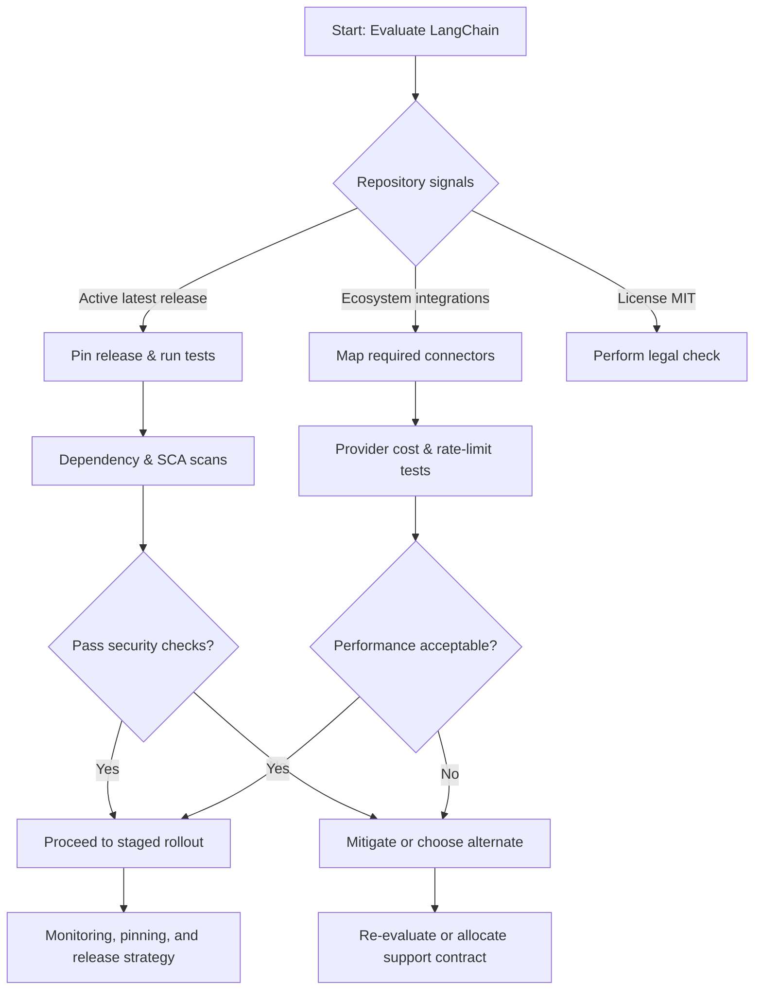

Executive answer

LangChain (repo: langchain-ai/langchain) shows clear signals of active maintenance and a broad ecosystem: the repository is public, licensed MIT, uses Python as its primary language, and had a non-prerelease release published on 2026-07-08 with a push as recently as 2026-07-12. These repository-level facts indicate a maintained open-source project with a documented ecosystem of integrations; however, GitHub stars are interest signals and do not equate to production usage or market share.

For teams evaluating LangChain for production use, the practical next steps are: (1) validate compatibility and stability with your stack via integration smoke tests, (2) collect objective usage and release metrics (PyPI download trends, package CVE data, dependency graph), (3) review operational requirements (observability, rate limits for model providers, required third-party services), and (4) perform a short security and supply-chain review. The rest of this report breaks down repository signals, what they mean, selection risks, recommended evidence-collection, and a decision checklist.

Table of contents

- [Repository snapshot — what the repository shows](#repository-snapshot--what-the-repository-shows)
- [Release and activity signals](#release-and-activity-signals)
- [Ecosystem and integration signals](#ecosystem-and-integration-signals)
- [License, governance, and contributor signals](#license-governance-and-contributor-signals)
- [Selection risks and mitigation](#selection-risks-and-mitigation)
- [Recommended additional evidence to collect](#recommended-additional-evidence-to-collect)
- [Decision checklist (actionable)](#decision-checklist-actionable)
- [Evidence, assumptions, and limitations](#evidence-assumptions-and-limitations)
- [Sources](#sources)
- [FAQs](#faqs)


## Table of contents

- [Repository snapshot — what the repository shows](#repository-snapshot-what-the-repository-shows)
- [Release and activity signals](#release-and-activity-signals)
- [Ecosystem and integration signals](#ecosystem-and-integration-signals)
- [License, governance, and contributor signals](#license-governance-and-contributor-signals)
- [Selection risks and mitigation](#selection-risks-and-mitigation)
- [Recommended additional evidence to collect](#recommended-additional-evidence-to-collect)
- [Decision checklist (actionable)](#decision-checklist-actionable)
- [Visual summary: decision flow](#visual-summary-decision-flow)
- [Evidence, assumptions, and limitations](#evidence-assumptions-and-limitations)
- [FAQs](#faqs)

## Repository snapshot — what the repository shows

This table summarizes repository metadata drawn from the canonical GitHub repository and the latest release. All numbers and dates are pulled from repository metadata and the latest release object.

| Field | Value |
|---|---:|
| Repository | [langchain-ai/langchain](https://github.com/langchain-ai/langchain) |
| Description (repo) | "The agent engineering platform." (paraphrased from repository description) |
| Primary language | Python |
| License | MIT |
| Stars (interest) | 141,608 |
| Forks | 23,547 |
| Watchers | 893 |
| Open issues (count) | 421 |
| Created at | 2022-10-17T02:58:36Z |
| Last pushed at (commit) | 2026-07-12T21:59:21Z |
| Repo updated at | 2026-07-13T01:20:36Z |
| Latest release | langchain-core==1.4.9 (published 2026-07-08T20:07:10Z) |

Sources: repository metadata and the 1.4.9 release object [LangChain canonical repository](https://github.com/langchain-ai/langchain), [LangChain latest GitHub release](https://github.com/langchain-ai/langchain/releases/tag/langchain-core%3D%3D1.4.9) (data as of 2026-07-13).

> [!NOTE]
> Stars and forks are interest signals and ecosystem indicators, not direct measures of production usage or market share. Use them to guide further investigation rather than as a proxy for adoption.


## Release and activity signals

Observed facts

- The repository had an official release tagged `langchain-core==1.4.9` published on 2026-07-08; the release notes list a mix of fixes and dependency bumps and identify the change set in human-readable bullet points. See the release page for the changelog text and links to merged PRs.
- The repository's last push was 2026-07-12, and the repo update timestamp is 2026-07-13, showing recent author activity.

Interpreting release and push signals

- Recent pushes and a recent non-prerelease release indicate active maintenance and a functioning release process. That suggests you can expect ongoing updates, but it does not guarantee semantic version stability or API stability in your specific usage pattern.

Actionable follow-ups

- Track the release notes for API compatibility notes and breaking-change warnings. Don't rely on headline release frequency; instead, inspect the scope of recent changes that affect the specific modules you intend to use.


## Ecosystem and integration signals

The repository README (and the docs referenced there) lists multiple ecosystem components and companion projects: Deep Agents, LangGraph, LangChain.js, LangSmith, and provider/integration libraries. The repository also advertises integrations for embeddings, models, retrievers, and vector stores.

Table: Ecosystem items listed in repo documentation (paraphrased)

| Ecosystem area | Evidence in repository or docs |
|---|---|
| Companion libraries / products | Deep Agents, LangGraph, LangChain.js, LangSmith (mentioned in README and docs links) |
| Integrations | Documented integrations for models, embeddings, retrievers, and vector stores (README and docs links) |
| Documentation hub | Explicit docs homepage: https://docs.langchain.com/langchain/ |

> [!TIP]
> Use the project's documented integrations list to map which of your required model providers, vector stores, and tool APIs are supported out of the box. That reduces initial integration effort.

Architectural conclusions inferred from README or repository structure

- The repository describes itself as a framework for building agents and LLM-powered applications and lists component types (models, embeddings, retrievers, vector stores). From this structure it is reasonable to infer that LangChain implements modular abstractions (models, chains, retrievers). This is an architectural inference based on README structure and topic tags, not a full code audit.


## License, governance, and contributor signals

Facts

- The repository license is MIT. The README and contributing docs link to community contribution guidance and a code of conduct.

What this means for selection

- MIT is a permissive license that simplifies commercial adoption from a licensing standpoint. However, permissive licensing does not eliminate other risks (API dependencies, third-party provider costs, or operational lock-in). Review corporate policies on third-party open-source usage even with permissive licenses.

Table: Governance signals and immediate implications

| Signal | What it implies | Recommended check |
|---|---|---|
| MIT license | Permissive use for commercial products | Confirm compatibility with your organization's OSS policy |
| Contributing guides & Code of Conduct | Project expects external contributions and community governance | Review maintainership and PR response times for sustained support needs |


## Selection risks and mitigation

Below are selection risks surfaced by repository signals and practical mitigations a team should plan for.

1) API and semantic stability

- Risk: Frequent releases can include behaviour changes; your integration surface may depend on APIs that evolve.
- Mitigation: Lock to a tested minor or patch release, pin package versions in CI, and add integration tests covering the LangChain modules you use.

2) Dependency and supply-chain risk

- Risk: LangChain depends on other packages and model providers; supply-chain issues can emerge via transitive dependencies or external services.
- Mitigation: Inventory runtime dependencies (pip freeze, or the project's requirements files), scan for known CVEs, and consider reproducible builds (lockfiles). Conduct a provenance review of critical wheels.

3) Operational and cost coupling to model providers

- Risk: LangChain is a framework that orchestrates LLM providers; production costs and rate limits come from the model providers rather than LangChain itself.
- Mitigation: Perform cost modeling and rate-limit tests against the provider mix you intend to use. Validate behavior under throttling and error conditions.

4) Community and maintainer bandwidth

- Risk: Open-source projects can change priorities; a flare in activity or maintainers moving on can affect response times.
- Mitigation: Review contributor/maintainer response patterns on issues and PRs, consider paid support or managed offerings for critical SLAs, and consider a fork-and-maintain strategy only if necessary.

5) Integration and feature coverage

- Risk: Your required connectors or integrations may rely on external packages or separate repositories (LangChain.js, LangGraph) and not be guaranteed to remain API-compatible.
- Mitigation: Map required integration points and run end-to-end tests with the exact versions of all companion libraries.

> [!WARNING]
> Open issue counts are an activity signal and not a defect tally. The presence of open issues (421 in this snapshot) does not equate to '421 defects' — they can be feature requests, discussion threads, or triage items.


## Recommended additional evidence to collect

Collecting more concrete, team-specific evidence helps convert interest signals into a confident selection.

Operational and usage evidence

- PyPI download trends and mirror counts (use PyPI and pePy endpoints) to see packaging adoption over time. (Do not infer usage from GitHub stars alone.)
- Package dependency graph (pipdeptree or similar) to see transitive dependencies and their licenses.
- CI/CD integration tests exercising the LangChain API surface you will use.

Security and supply-chain evidence

- CVE and GitHub Dependabot alerts for the repository and for transitive dependencies.
- Signed releases, or reproducible build artifacts, if your policy requires cryptographic provenance.

Performance and operational stress tests

- Latency and error-rate tests for key operations (embedding calls, chain execution, agent tool calls) using the provider mix you plan to use.
- Cost simulations using actual provider pricing and expected throughput.

Community and support evidence

- PR and issue response timelines for the files and modules you rely on.
- Activity in the project's community channels (forums, discussions, dedicated community Slack/X). Use those channels to validate the speed and quality of help available.

Legal and compliance evidence

- Confirm MIT license compatibility with your third-party license requirements and corporate policies.
- If you will process regulated data, confirm that executing in your environment with LangChain meets compliance requirements (data handling, encryption, provider contracts).

Table: Evidence to collect, why, and suggested methods

| Evidence | Why it matters | How to collect |
|---|---|---|
| PyPI / pePy download trends | Shows packaging adoption over time (not market share) | Query PyPI statistics endpoints and pePy; collect 6–12 month trend data |
| Dependency graph | Reveals transitive risk and license issues | Build dependency tree from the specific package version you plan to pin |
| Release notes & changelogs | Identify breaking changes and upgrade effort | Track releases for 3–6 months and audit changes to modules you use |
| Issue/PR response metrics | Maintainability and maintainer bandwidth | Sample issues and PRs relevant to your components and record time-to-merge/response |
| Security scan results | Vulnerabilities in dependencies or package | Run SCA tools on the package and your deployment bundle |
| Runtime cost and rate-limit tests | Operational feasibility and cost | Synthetic load tests against chosen providers with realistic payloads |


## Decision checklist (actionable)

- [ ] Pin a specific LangChain release to test against (e.g., langchain-core==1.4.9) and add it to CI.
- [ ] Run unit and integration tests that exercise the LangChain components you plan to use.
- [ ] Produce a dependency inventory and run SCA on the planned runtime bundle.
- [ ] Collect PyPI download trend data for the chosen release window (6–12 months) and compare with other candidate frameworks if needed.
- [ ] Simulate expected model-provider traffic and run cost/rate-limit experiments.
- [ ] Review the project's issue and PR activity for modules you depend on (sample 10–20 items).
- [ ] Confirm legal/OSS policy compatibility with MIT and any transitive licenses.
- [ ] Identify a fallback plan (alternative libraries or vendor support) in case of breaking changes or loss of maintainership.

> [!TIP]
> In your sandbox environment, create a tiny end-to-end example that uses the same provider credentials, datasets, and workflows you will use in production. This quickly reveals hidden integration and throttling issues.


## Visual summary: decision flow




## Evidence, assumptions, and limitations

Evidence used in this article

- Repository metadata and release notes were taken from the canonical GitHub repository [langchain-ai/langchain](https://github.com/langchain-ai/langchain) and the latest release object for `langchain-core==1.4.9` ([release link](https://github.com/langchain-ai/langchain/releases/tag/langchain-core%3D%3D1.4.9)). Data was retrieved/generated on 2026-07-13 (UTC). Use these links to verify the raw facts and navigate to changelogs and PRs for deeper inspection.

Assumptions

- This analysis treats GitHub stars and forks as interest/ecosystem signals and does not equate them with production usage or market share.
- Architectural conclusions labelled above are explicitly stated as inferences derived from the README, repository topics, and documentation structure, not from a source-code audit.

Limitations

- This article does not include internal telemetry from LangChain users, PyPI download time series, or CVE scans of transitive dependencies because those require fresh queries to external services beyond the supplied repository metadata.
- Behavioral and performance characteristics (latency, memory footprint, provider costs) depend heavily on the chosen model provider, hardware, and usage patterns; those must be measured by the adopting team.


## Sources

- LangChain canonical repository: [https://github.com/langchain-ai/langchain](https://github.com/langchain-ai/langchain)
- LangChain latest GitHub release (langchain-core==1.4.9): [https://github.com/langchain-ai/langchain/releases/tag/langchain-core%3D%3D1.4.9](https://github.com/langchain-ai/langchain/releases/tag/langchain-core%3D%3D1.4.9)


## FAQs

1. Q: Do GitHub stars equal adoption?
   A: No. Stars are interest and visibility signals. They do not measure production usage or market share; use them to prioritize further checks.

2. Q: Is the MIT license safe for commercial use?
   A: MIT is permissive and generally compatible with commercial use, but confirm with your legal/compliance team for organizational policies and review transitive licenses in dependencies.

3. Q: How worried should I be about the open issue count?
   A: Open-issue counts indicate activity and triage backlog but are not a defect count. Review the types of open issues (bugs vs. feature requests vs. discussions) relevant to your use case.

4. Q: Does a recent release mean stable APIs?
   A: A recent release shows active maintenance, not guaranteed API stability. Inspect release notes for breaking changes and pin versions for production stability.

5. Q: What concrete tests should my team run first?
   A: Start with pinned-version unit tests, integration tests calling your target providers, dependency SCA scans, and a small-scale cost and rate-limit simulation.

6. Q: Should I rely on LangChain for enterprise SLAs?
   A: The OSS project itself does not provide enterprise SLAs. If you need SLA-backed support, evaluate vendor or managed offerings and consider contractual support.


<!-- Open Graph / canonical metadata (for editorial systems) -->

<link rel="canonical" href="https://madewithwhat.net/langchain-adoption-analysis" />
<meta property="og:title" content="LangChain: Adoption analysis and engineering signals" />
<meta property="og:description" content="Evidence-focused adoption analysis of LangChain (langchain-ai/langchain). Repository snapshot, release activity, ecosystem signals, selection risks, and a practical checklist. Data as of 2026-07-13." />
<meta property="og:url" content="https://madewithwhat.net/langchain-adoption-analysis" />


<!-- Article schema (JSON-LD) -->

```json
{
  "@context": "https://schema.org",
  "@type": "Article",
  "headline": "LangChain: Adoption analysis and engineering signals",
  "description": "Evidence-focused adoption analysis of LangChain (langchain-ai/langchain). Repository snapshot, release activity, ecosystem signals, selection risks, and a practical checklist. Data as of 2026-07-13.",
  "url": "https://madewithwhat.net/langchain-adoption-analysis",
  "publisher": {
    "@type": "Organization",
    "name": "MadeWithWhat",
    "url": "https://madewithwhat.net"
  },
  "datePublished": "2026-01-17",
  "dateModified": "2026-07-13"
}
```

## FAQ

### Do GitHub stars measure LangChain's production usage?

No. GitHub stars are interest signals and can indicate visibility, but they do not quantify production usage or market share. Use stars alongside other evidence such as download trends, issue/PR activity, and integration tests.

### Is LangChain's MIT license safe for commercial projects?

MIT is a permissive license that generally permits commercial use. However, you should confirm compatibility with your organization's OSS policy and check transitive dependency licenses.

### How should I treat the open issue count (421)?

Treat open issues as an activity and triage signal, not a defect count. Inspect the issue types (bugs, enhancements, questions) and the response times for issues relevant to your use case.

### What initial tests should my team run when evaluating LangChain?

Pin a release (e.g., langchain-core==1.4.9), run unit and integration tests for the modules you need, perform dependency and SCA scans, and run small-scale provider cost and rate-limit simulations.

### Does a recent release guarantee API stability?

No. Recent releases indicate active maintenance but do not guarantee stability. Review changelogs and test the exact API surface used in your application before upgrading.

### Where can I verify the repository facts used in this article?

All repository facts are taken from the project's GitHub pages: the canonical repository at https://github.com/langchain-ai/langchain and the release page for langchain-core==1.4.9 at https://github.com/langchain-ai/langchain/releases/tag/langchain-core%3D%3D1.4.9 (data as of 2026-07-13).
