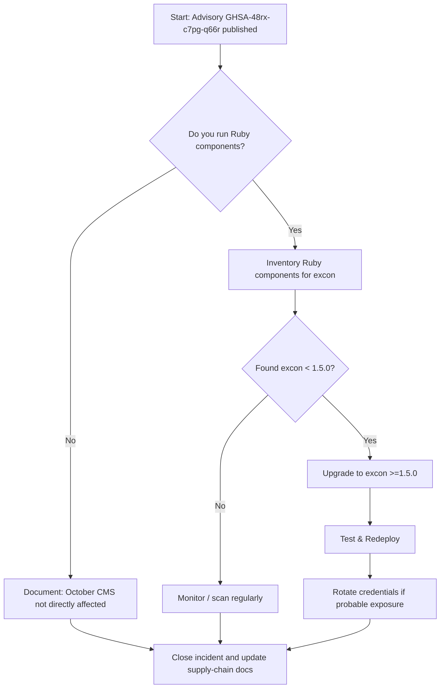

Executive summary

October CMS maintainers and operators: a medium-severity vulnerability affecting the Ruby gem Excon (CVE-2026-54171 / GHSA-48rx-c7pg-q66r) has been published. The issue concerns Excon's RedirectFollower middleware failing to strip certain headers when following HTTP redirects, which can cause sensitive header data to be sent to redirect targets. The advisory identifies the vulnerable range as versions earlier than 1.5.0, with a patch released in Excon v1.5.0. [GitHub advisory: GHSA-48rx-c7pg-q66r](https://github.com/advisories/GHSA-48rx-c7pg-q66r).

The advisory specifically targets the Excon Ruby library (ecosystem: rubygems) and does not name October CMS. Based on the supplied repository metadata, October CMS is a PHP-based CMS built on Laravel and the canonical October repository is not identified in the advisory as affected. That said, teams running mixed-language toolchains (for example Ruby-based build agents, integration tooling, third-party services, or developer machines that may interact with October CMS projects) should treat this as a dependency-chain risk: any environment or service that includes Excon <1.5.0 and performs HTTP redirects could inadvertently leak headers.

Metadata (for search engines and page consumers)

- Site: MadeWithWhat — https://madewithwhat.net
- Primary technology: October CMS (GitHub: octobercms/october)
- Advisory: GHSA-48rx-c7pg-q66r / CVE-2026-54171
- Advisory published: 2026-07-10T20:37:29Z (GHSA notice)
- Data retrieval / generation date: 2026-07-13T02:09:18Z

Open Graph and canonical URL

- canonical: https://madewithwhat.net/octobercms-excon-redirect-header-leak
- og:title: October CMS: Security Briefing — Excon Redirect Header Leak
- og:description: Medium-severity Excon bug may leak headers on redirect. Guidance for October CMS maintainers on dependency-chain relevance and mitigation.

Article schema (JSON-LD)

```json
{
  "@context": "https://schema.org",
  "@type": "Article",
  "headline": "October CMS: Security Briefing — Excon Redirect Header Leak",
  "author": {"@type": "Organization", "name": "MadeWithWhat"},
  "datePublished": "2026-01-18",
  "dateModified": "2026-07-13T02:09:18Z",
  "mainEntityOfPage": "https://madewithwhat.net/octobercms-excon-redirect-header-leak"
}
```


Table of contents

- [What changed (Advisory summary)](#what-changed-advisory-summary)
- [Is October CMS directly affected?](#is-october-cms-directly-affected)
- [Dependency-chain relevance and likely impact](#dependency-chain-relevance-and-likely-impact)
- [Affected range table and severity](#affected-range-table-and-severity)
- [Verification examples (generic, safe commands)](#verification-examples-generic-safe-commands)
- [Recommended actions for maintainers and operators](#recommended-actions-for-maintainers-and-operators)
- [Incident response checklist](#incident-response-checklist)
- [Decision checklist / Action checklist](#decision-checklist--action-checklist)
- [Evidence, assumptions, and limitations](#evidence-assumptions-and-limitations)
- [Sources](#sources)
- [FAQs](#faqs)


## Table of contents

- [What changed (Advisory summary)](#what-changed-advisory-summary)
- [Is October CMS directly affected?](#is-october-cms-directly-affected)
- [Dependency-chain relevance and likely impact](#dependency-chain-relevance-and-likely-impact)
- [Affected range table and severity](#affected-range-table-and-severity)
- [Verification examples (generic, safe commands)](#verification-examples-generic-safe-commands)
- [Recommended actions for maintainers and operators](#recommended-actions-for-maintainers-and-operators)
- [Incident response checklist](#incident-response-checklist)
- [Decision checklist / Action checklist](#decision-checklist-action-checklist)
- [Visual decision flow (Mermaid)](#visual-decision-flow-mermaid)
- [Evidence, assumptions, and limitations](#evidence-assumptions-and-limitations)
- [Embedded data image](#embedded-data-image)
- [FAQs](#faqs)

## What changed (Advisory summary)

Advisory: GHSA-48rx-c7pg-q66r (CVE-2026-54171). The published advisory states:

- Package: excon (Ruby gem) — ecosystem: rubygems. ([GHSA advisory](https://github.com/advisories/GHSA-48rx-c7pg-q66r))
- Summary: "Excon does not redact additional sensitive/risky headers when following redirects." The RedirectFollower middleware failed to strip a number of headers known to be sensitive and did not give callers a way to provide a custom list of headers to strip, which could lead to inadvertent leakage of sensitive header data during redirects.
- Vulnerable range: versions earlier than 1.5.0 (vulnerable_range: "< 1.5.0"). Patched: v1.5.0.
- Severity: medium (as reported by the advisory metadata).

Reference: GitHub Security Advisory page: [GHSA-48rx-c7pg-q66r](https://github.com/advisories/GHSA-48rx-c7pg-q66r).

> [!NOTE]
> What the advisory affects: the Excon Ruby library (redirect follower middleware). The advisory does not list October CMS or any PHP project.


## Is October CMS directly affected?

Short answer: No direct evidence in the supplied advisory indicates October CMS is affected.

- The advisory targets a Ruby gem (excon) distributed via rubygems and patched in excon v1.5.0. The supplied October CMS repository metadata identifies October CMS as a PHP project built on Laravel (this is stated in the repository README and repository language metadata). The advisory does not mention October CMS, the octobercms/october repository, nor any PHP packages.

- Therefore, based on the supplied evidence, October CMS itself is not directly named as vulnerable by the advisory. Do not act under the assumption that October's codebase contains the Excon gem unless you have specific evidence (for example a bundled Ruby dependency within an October deployment).

> [!TIP]
> If you maintain hybrid systems (e.g., a PHP app that integrates with Ruby-based services or CI tooling), treat language-ecosystem advisories as potential dependency-chain issues rather than direct product vulnerabilities.


## Dependency-chain relevance and likely impact

Even when a core project is not directly affected, dependencies in the operational ecosystem can create exposure. Use the table below to reason about where Excon could appear in relation to an October CMS deployment.

| Context | Could include Excon? | Why it matters for October CMS teams |
|---|---:|---|
| October CMS application codebase (PHP) | Unlikely | October CMS is PHP/Laravel; PHP projects do not normally include Ruby gems. (Repository metadata: language = PHP; README references Laravel.)
| Developer workstations / local dev tooling | Possible | Developers may run Ruby scripts, CLI tools, or local services that include Excon; those tools could leak headers when following redirects.
| CI/CD pipelines and build agents | Possible | CI runners or pipeline steps written in Ruby (or using Ruby-based CLI tools) that perform HTTP requests might include vulnerable Excon versions. This could cause header leakage from build systems that hold secrets.
| Third-party integrations / microservices | Possible | Any separate service (e.g., monitoring, deployment hooks, reverse proxies) written in Ruby and used alongside October CMS infrastructure might be affected.
| Hosted providers / platform add-ons | Possible | If a hosted service component uses Excon <1.5.0 internally and your workflows send sensitive headers to the service, redirection handling could leak headers.

All the above entries are conclusions drawn from the advisory and repository metadata; they do not assert October CMS contains the Excon gem.


## Affected range table and severity

| Advisory | Package | Ecosystem | Vulnerable range | Patched version | Severity |
|---|---|---:|---:|---:|---:|
| GHSA-48rx-c7pg-q66r / CVE-2026-54171 | excon | rubygems | < 1.5.0 | 1.5.0 | medium |

Notes:
- The advisory itself labels severity as medium. See: [GHSA-48rx-c7pg-q66r](https://github.com/advisories/GHSA-48rx-c7pg-q66r).
- The version ranges and patched version are taken from the advisory metadata provided in the sources.


## Verification examples (generic, safe commands)

The examples below are generic, illustrative commands for determining whether Excon is present in Ruby-based environments associated with your systems. Use them only in environments where you have appropriate permissions.

- Check locally installed gems for Excon:

```
gem list excon
```

- Check a Bundler-managed project's Gemfile.lock for Excon:

```
grep -n " excon (" Gemfile.lock || true
```

- Show Bundler information for a named gem (in project directory):

```
bundle info excon || bundle list | grep excon || true
```

- If you use platform-specific package auditing tools, run them against your build/CI images (examples: OS package scanners, SCA tools). These tools are environment-specific; consult your tooling documentation.

Caveat: these commands are examples only and assume a standard Ruby environment. They do not apply to PHP-only deployments unless Ruby-based components are present.


## Recommended actions for maintainers and operators

This section gives role-based recommendations. These are conservative operational steps drawn from the advisory facts.

Table: Recommended actions by role

| Role | Immediate action (within 24–72 hours) | Follow-up action (1–2 weeks) |
|---|---|---|
| October CMS maintainers (core repo) | Confirm the repository has no bundled Ruby runtime or vendorized Ruby gems. If none exist, document that October is not directly affected in your security notes. | Periodically scan repository for unexpected language/runtime files (e.g., Gemfile/Gemfile.lock). Maintain a third-party dependency inventory. |
| Site operators / DevOps | Search your infrastructure for Ruby runtimes, Gemfile.lock files, container images, or CI steps that might include Excon. Patch any Excon instances to >=1.5.0, or apply mitigations (see workarounds). | Review redirect-handling code and secrets-in-headers policies; restrict sensitive headers from being forwarded to external targets. |
| Developers / Integrators | Audit local toolchains and developer machines for vulnerable Excon gems. Update local gems and CI images. | Ensure tooling images are rebuilt with fixed gem versions and push to your image registry; update runbooks. |
| Third-party vendors / SaaS integrators | Request from vendors whether their services use Excon <1.5.0 and whether redirects could cause header leaks. | Get confirmation of patching schedule or mitigations. Document vendor responses. |

Concrete technical steps when you find Excon <1.5.0:

1. Update Excon to v1.5.0 or later in the affected Ruby environment (e.g., update Gemfile/Gemfile.lock and rebuild images).
2. If immediate update is not possible, backport the upstream fix to your local RedirectFollower middleware as suggested by the advisory (the advisory links to a specific commit: https://github.com/excon/excon/commit/ea89a35308a12f4b791b6c50f2cbd33f94889fa3). Note: backporting requires Ruby development and testing.
3. Avoid sending sensitive headers (Authorization, Cookie, X-Api-Key, etc.) on requests that may be redirected to untrusted domains. Implement application-level header sanitation before issuing requests that may redirect.

> [!WARNING]
> Do not assume a PHP project is safe solely because it is PHP; check all ancillary services (CI, infra, developer tools) for other languages.


## Incident response checklist

Follow this checklist if you discover an Excon <1.5.0 installation in your infrastructure.

- Identify and contain
  - Locate all hosts, containers, and CI jobs that include Excon <1.5.0.
  - If a running service is found making outgoing requests with sensitive headers and following redirects, isolate or pause that service if feasible.

- Eradicate / Mitigate
  - Upgrade the Excon gem to >=1.5.0 and redeploy affected services.
  - If upgrade is not possible immediately, apply the upstream fix to your local RedirectFollower implementation or remove sensitive headers before requests that may redirect.

- Assess impact
  - Check logs and proxy records for requests that may have followed redirects to third-party hosts during the exposure window (if logging exists). Focus on requests carrying Authorization, Cookie, or other sensitive headers.
  - If header leakage is suspected, perform a secrets rotation (API keys, tokens, credentials) for impacted services.

- Recover and validate
  - Rebuild images, redeploy services with patched dependencies.
  - Run validation tests to confirm redirect followers and header sanitation behave as expected.

- Post-incident
  - Document the incident and the remediation steps. Update dependency inventories and supply chain security policies to include cross-language checks.


## Decision checklist / Action checklist

- Do we have Ruby-based services in our stack (CI, agents, microservices)? If yes: check Excon versions.
- Have we found Excon <1.5.0 in any environment? If yes: prioritize upgrade or backport fix.
- Do any services send sensitive headers and perform cross-domain redirects? If yes: rotate impacted credentials if exposure is possible.
- Are third-party vendors or hosted services used that might run Excon? If yes: request vendor confirmation and remediation timelines.
- Is our incident logging sufficient to detect redirected requests that may have leaked headers? If not: improve request logging and auditing.


## Visual decision flow (Mermaid)




## Evidence, assumptions, and limitations

Evidence used (explicit facts from supplied materials):

- The GitHub security advisory GHSA-48rx-c7pg-q66r describes an Excon redirect follower header-redaction issue; vulnerable versions are <1.5.0 and a patch exists in 1.5.0. (Source: [GHSA advisory](https://github.com/advisories/GHSA-48rx-c7pg-q66r)).
- The October CMS repository metadata identifies the project as a PHP-based CMS using Laravel (repository: [octobercms/october](https://github.com/octobercms/october); README references Laravel; language = PHP). (Source: [October CMS canonical repository](https://github.com/octobercms/october)).
- The October repository metadata (stars, forks, languages, latest release) were supplied in the editorial data and used for context; the latest release noted in the metadata is v4.2.0 published 2026-03-30. (Source: [October CMS latest GitHub release](https://github.com/octobercms/october/releases/tag/v4.2.0)).

Assumptions and labeled inferences (explicitly flagged):

- Inference: October CMS is a PHP/Laravel platform. This is supported by the README and the repository language metadata; it is labeled here as an inference from the repository README and metadata. (See rule requiring that such inferences be explicitly labelled.)
- Assumption: Any exposure to the Excon vulnerability would arise via Ruby components in the broader stack (CI agents, developer tooling, microservices), not from October's PHP codebase. This is an operational inference based on the advisory's Ruby focus and October's PHP nature.

Limitations:

- We rely on the supplied advisory and repository metadata. If your environment contains vendor-supplied bundles, containers, or build images not reflected in the repository, those may include vulnerable Excon versions. This briefing does not scan your environment.
- The advisory describes the problem conceptually; operational impact depends on how services use Excon and which headers are present during redirect flows.
- Timing: advisory published 2026-07-10; this briefing uses data generated 2026-07-13. If you read this later, verify whether additional advisories, CVEs, or follow-ups have been released.


## Embedded data image


## Sources

- October CMS canonical repository: https://github.com/octobercms/october
- October CMS latest GitHub release (v4.2.0): https://github.com/octobercms/october/releases/tag/v4.2.0
- GitHub Security Advisory GHSA-48rx-c7pg-q66r (CVE-2026-54171): https://github.com/advisories/GHSA-48rx-c7pg-q66r


## FAQs

1. Q: Does this advisory mean October CMS is vulnerable?
   A: No. The advisory targets the Ruby gem Excon; it does not name October CMS. October CMS is a PHP/Laravel project per its repository metadata. You should, however, check ancillary Ruby-based tooling in your environment.

2. Q: What version fixes the vulnerability?
   A: The advisory lists the patched Excon version as 1.5.0. The vulnerable range is versions earlier than 1.5.0. (Source: GHSA advisory.)

3. Q: If I find Excon <1.5.0 in my CI, what should I do immediately?
   A: Patch to Excon >=1.5.0 in affected CI images, or apply the upstream fix to RedirectFollower middleware as a temporary measure. Also evaluate whether sensitive headers may have been leaked and rotate impacted secrets if necessary.

4. Q: Does this require rotating credentials used by October CMS sites?
   A: Only rotate credentials if you have evidence that vulnerable Ruby components performed redirects while sending sensitive headers to untrusted targets. If in doubt and an exposure window exists, rotate impacted keys as a precaution.

5. Q: Where can I find the fix referenced by the advisory?
   A: The advisory references a commit in the Excon repository (the advisory includes a link to the fix commit). See the advisory page: https://github.com/advisories/GHSA-48rx-c7pg-q66r.

6. Q: How should maintainers document this for October's users?
   A: Record that the GHSA-48rx advisory affects the Ruby Excon gem and does not list October CMS as affected. Provide guidance for operators to inspect their supporting Ruby-based services and CI tooling. Link to the advisory and to your own dependency inventory policies.

## FAQ

### Does this advisory mean October CMS is vulnerable?

No. The advisory targets the Ruby gem Excon and does not name October CMS. October CMS is a PHP/Laravel project per its repository metadata. Teams should, however, check any Ruby-based tooling or services they run alongside October CMS.

### Which Excon version contains the fix?

The advisory states the patched version is Excon v1.5.0; vulnerable versions are earlier than 1.5.0. See the GHSA advisory for details.

### If Excon <1.5.0 is found in CI, what should I do immediately?

Upgrade Excon to >=1.5.0 in affected CI images and rebuild. If you cannot upgrade immediately, consider backporting the upstream fix to your RedirectFollower implementation and avoid sending sensitive headers on requests that may redirect.

### Do I need to rotate credentials for my October CMS sites?

Rotate credentials only if you have evidence that a vulnerable Ruby component sent sensitive headers to redirected destinations. If exposure is plausible and you cannot rule it out, rotate affected secrets as a precaution.

### Where is the official advisory and fix?

The official advisory is on GitHub: https://github.com/advisories/GHSA-48rx-c7pg-q66r. The advisory and commit links there point to the fix in the Excon repository.

### How should I document this for my users?

Document that the issue affects the Excon Ruby gem and that October CMS (the PHP project) is not named as affected. Provide guidance to check Ruby-based CI, developer tooling, and third-party services, and reference the advisory and your dependency-inventory procedures.
