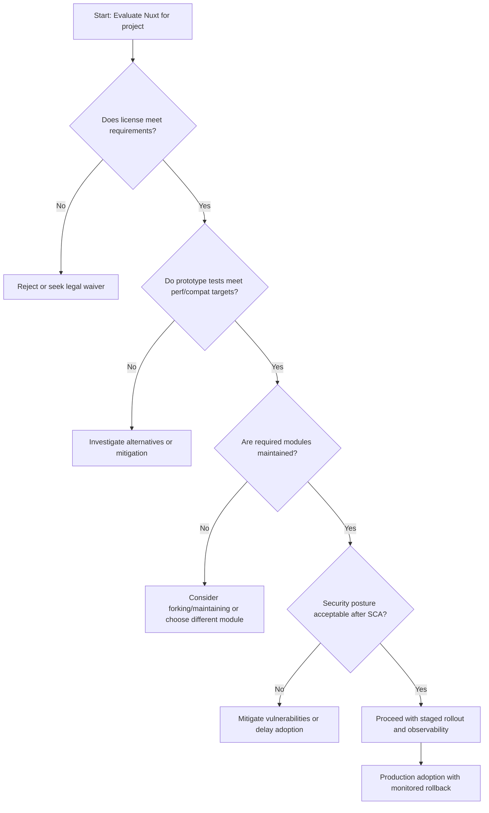

Executive summary

Nuxt's canonical GitHub repository (nuxt/nuxt) shows active maintenance, an MIT license, TypeScript source, and recent releases — facts that support shortlisting it for new Vue-based projects. Key objective signals from the repository: a recent push (2026-07-12), a published hotfix release (v4.4.8, 2026-06-08), and visible community touchpoints (project topics and modular ecosystem references). See the repository for source details [Nuxt canonical repository](https://github.com/nuxt/nuxt).

However, repository signals are partial evidence. GitHub stars (60,767) are interest indicators, not adoption or market-share measurements. Open issues (828) are workload signals, not direct defect counts. Before committing, teams should collect runtime telemetry, package download and registry data, real-world production references, security scan results, and compatibility tests against their existing stack. This article lists what the repo shows, what it does not, selection risks, and a compact action checklist for engineering teams.

Table of contents

- [Repository snapshot and freshness](#repository-snapshot-and-freshness)
- [Interpreting repository signals](#interpreting-repository-signals)
- [Release cadence and what the latest release tells us](#release-cadence-and-what-the-latest-release-tells-us)
- [Issue load, contribution activity, and community access points](#issue-load-contribution-activity-and-community-access-points)
- [License, language, and architecture inferences](#license-language-and-architecture-inferences)
- [Ecosystem signals and extension surface](#ecosystem-signals-and-extension-surface)
- [Selection risks and recommended additional evidence to collect](#selection-risks-and-recommended-additional-evidence-to-collect)
- [Decision checklist (actionable)](#decision-checklist-actionable)
- [Evidence, assumptions, and limitations](#evidence-assumptions-and-limitations)
- [FAQs](#faqs)
- [Sources](#sources)

---

## Table of contents

- [Repository snapshot and freshness](#repository-snapshot-and-freshness)
- [Interpreting repository signals](#interpreting-repository-signals)
- [Release cadence and what the latest release tells us](#release-cadence-and-what-the-latest-release-tells-us)
- [Issue load, contribution activity, and community access points](#issue-load-contribution-activity-and-community-access-points)
- [License, language, and architecture inferences](#license-language-and-architecture-inferences)
- [Ecosystem signals and extension surface](#ecosystem-signals-and-extension-surface)
- [Selection risks and recommended additional evidence to collect](#selection-risks-and-recommended-additional-evidence-to-collect)
- [Decision checklist (actionable)](#decision-checklist-actionable)
- [Evidence, assumptions, and limitations](#evidence-assumptions-and-limitations)
- [Mermaid: Decision flow for evaluating Nuxt adoption](#mermaid-decision-flow-for-evaluating-nuxt-adoption)
- [FAQs](#faqs)

## Repository snapshot and freshness

This table summarizes the repository metadata used as primary evidence. All values below come from the canonical repo metadata and the latest release data; the generation timestamp for repository observations is 2026-07-13T02:13:43Z.

| Field | Value |
|---|---:|
| Repository | [nuxt/nuxt](https://github.com/nuxt/nuxt) |
| Description | "the full-stack Vue framework" (repo description) |
| Stars | 60,767 |
| Forks | 5,844 |
| Watchers | 861 |
| Open issues | 828 |
| Primary language | TypeScript |
| License | MIT |
| Created at | 2016-10-26T11:18:47Z |
| Last pushed at | 2026-07-12T21:00:07Z |
| Repo updated at | 2026-07-13T00:50:26Z |
| Latest release tag | v4.4.8 |
| Latest release published | 2026-06-08T18:40:24Z |

> [!NOTE]
> The repository snapshot above was compiled from the project's GitHub metadata and the latest release information. Data generation timestamp: 2026-07-13T02:13:43Z.

## Interpreting repository signals

Repository signals are useful but limited. Below are common signals, what they actually mean, and how teams should interpret them.

| Signal | What it indicates | What it does NOT prove |
|---|---|---|
| Stars (60,767) | Public interest and discoverability; a large “bookmark” and social proof signal | Product usage, active deployments, or market share (explicitly not a usage metric) |
| Forks (5,844) | Developer experimentation and work forks; can indicate community engagement | Quality or whether forked versions are actively used in production |
| Watchers (861) | Number of users tracking repository activity | Support load or SLA guarantees |
| Open issues (828) | Current backlog of open tickets and feature requests; a surface for active triage | Direct defect counts — open issues include feature requests, questions, and stale tickets |
| Last push / updated timestamps | Recent maintenance activity and ongoing development | Release stability or regressions without further inspection |
| License (MIT) | Permissive license, typically favorable for commercial use | Warranty or indemnity guarantees; MIT does not provide them |

> [!WARNING]
> Treat star and fork counts as signals of interest. They are not robust proxies for production use, customer references, or reliability.

## Release cadence and what the latest release tells us

The most recent published release is v4.4.8 (published 2026-06-08) and is described as a hotfix release addressing a macOS dev-server issue. The release body includes a short changelog with fixes, documentation corrections, and dependency updates. The repository's last push was 2026-07-12, indicating ongoing development between the last release and the latest push.

Table: Release facts and immediate interpretations

| Field | Value | Interpretive note |
|---|---|---|
| Latest tag | v4.4.8 ([release link](https://github.com/nuxt/nuxt/releases/tag/v4.4.8)) | Hotfix semantics: minor release focused on platform/dev-tool fixes |
| Published at | 2026-06-08T18:40:24Z | Recent at time of data generation (2026-07-13) — shows maintenance cadence |
| Release content indicators | Fixes to dev server on macOS, documentation fixes, deps updated | Small incremental maintenance and documentation attention |

Observations grounded in the release data:
- The release is explicitly described as a hotfix addressing a dev-server macOS socket name issue and reversion of an internal dependency (per the release body). This indicates bugfix responsiveness for problems affecting developer workflows.

Architectural conclusion (inferred from the release notes and README): Nuxt maintains an approach supporting multiple rendering strategies (server rendering, static generation, hybrid/edge) and emphasizes TypeScript friendliness and extensibility via modules. This conclusion is inferred from the repository README and release contents and should be considered an inference, not a definitive architecture diagram.

## Issue load, contribution activity, and community access points

What the raw counts tell you:
- Open issues: 828. This is a backlog indicator; it combines bugs, feature requests, and questions. Open-issue counts are not defect counts and must be interpreted in context (triage status, issue age, labels).
- Activity indicators (pushed_at, updated_at): The repository shows recent pushes and updates as of July 2026, which supports an active-maintenance hypothesis.

What to validate before adopting:
- Issue age distribution: how many open issues are recent vs. multi-year stale items?
- Response SLAs: average response times from maintainers on issues and PRs for the last 90 days.
- PR merge rates and the number of active maintainers approving PRs.

> [!TIP]
> Use the repository's issue labels, closed-issue counts, and PR history to estimate maintainer responsiveness. Look for triage labels and recent merges to assess active governance.

## License, language, and architecture inferences

Facts from the repo metadata:
- Primary language: TypeScript. This signals codebase choices that will matter for type integration, tooling, and build chains.
- License: MIT (per repository metadata and linked LICENSE file).

Implications:
- MIT license is permissive and commonly used for frameworks; it permits commercial use and modification with minimal licensing friction.
- TypeScript as the repo language implies stronger typing support but also requires TypeScript-aware build tools if you plan to contribute or modify framework internals.

Architectural conclusions (explicitly labeled as inferred):
- Inferred from README and repo structure: Nuxt positions itself as a full-stack Vue framework providing SSR, SSG, hybrid rendering, and a module system. This inference derives from README feature lists and repository topics, not from runtime tests.

## Ecosystem signals and extension surface

The README (included in the repository metadata) references an ecosystem of modules and hosting/deployment options. The README mentions "300+ modules" via a modules page link and points to documentation and community channels. These are useful signals:
- A modules ecosystem reduces engineering lift if the integrations you need already exist.
- Community channels listed in the repo (Discord, documentation, and links) are useful for operational support and ramp-up.

Embed: data image showing repository activity snapshot


Table: Ecosystem signals and checks

| Signal observed in repo/README | Immediate implication | Action to validate |
|---|---|---|
| Claimed "300+ modules" (README link) | Large surface area of community/official extensions | Audit the modules list for the specific integrations your project needs and check maintenance status of each module |
| Links to docs, Discord, and community | Available support channels and documentation resources | Test response time in community, check docs for completeness on critical features (auth, data fetching, SSR) |
| Topics (ssg, ssr, server-rendering, edge) | Multi-modal rendering support signaled | Verify behavior via test projects for the specific rendering mode you need |

## Selection risks and recommended additional evidence to collect

Repository metadata provides a starting point but not a complete adoption decision. Below are common selection risks and precise evidence your team should collect before adoption.

Selection risks

- Compatibility surprises: runtime or build-time compatibility issues with your existing toolchain (specific Node.js versions, bundler versions, or cloud-edge runtimes).
- Hidden maintenance load: modules or integrations you plan to use might be sparsely maintained even if core is active.
- Security and supply chain exposure: repositories can have vulnerabilities in dependencies; manifest data alone doesn't reveal transitive risk.
- Operational unknowns: production observability, memory/CPU characteristics, and edge behavior vary with workloads and cannot be inferred solely from repo metadata.

Recommended evidence to collect (practical and testable)

1. Package registry metrics (npm/day or npm downloads) and CDNs for the specific versions you plan to use.
2. Runtime benchmarks and memory profiles using representative workloads (SSR pages, dynamic routes, large component trees).
3. Compatibility matrix: test matrix for your target Node.js versions, TypeScript versions, and build tools (Vite, Webpack if relevant).
4. Module health audit: for each required module, record last commit, open issues, and compatibility with the target Nuxt version.
5. Security posture: run SCA (Software Composition Analysis) on dependencies for the planned lockfile and check OpenSSF or similar scorecards.
6. Community responsiveness: time-to-first-response and average resolution time on issues and PRs related to high-impact areas.
7. Production references and case studies: where possible, collect names of production users (from public case studies or job posts) and, if appropriate, reach out for operational experience.
8. Upgrade path: test upgrading from your planned starting version to the next minor and major release in a staging environment and record migration pain points.

> [!NOTE]
> Do not rely on GitHub stars or open-issue counts as conclusive proof of reliability or security. Use them as part of a broader evidence set.

## Decision checklist (actionable)

- [ ] Confirm the project license (MIT) is compatible with your legal/commercial requirements.
- [ ] Verify the repository's last activity and recent releases (pushed_at: 2026-07-12; latest release v4.4.8 published 2026-06-08) against your release-stability needs.
- [ ] Run a small prototype that exercises your primary use case (SSR/SSG/edge) and measure performance and tooling integration.
- [ ] Audit the modules you plan to use for maintenance activity and compatibility.
- [ ] Run static and dynamic security scans of the exact dependency set you would deploy.
- [ ] Check community channels (Discord/docs) for answers to operational questions and estimate response times.
- [ ] Validate migration/upgrade steps for the major/minor versions you expect to encounter.
- [ ] Prepare a rollback plan and test it in staging.

> [!TIP]
> Start with a minimal prototype that mirrors your production routing, authentication pattern, and data-fetching strategy. This exposes compatibility and performance problems early.

## Evidence, assumptions, and limitations

Evidence used

- Repository metadata (stars, forks, watchers, open issues, language, license, created_at, updated_at, pushed_at) for nuxt/nuxt, retrieved from the canonical GitHub repository [Nuxt canonical repository](https://github.com/nuxt/nuxt).
- Latest release metadata (tag v4.4.8, published 2026-06-08) and release body from the GitHub releases page [Nuxt latest GitHub release](https://github.com/nuxt/nuxt/releases/tag/v4.4.8).
- README content included in the repository metadata (features, ecosystem references, and links).

Assumptions and limitations

- The analysis uses the GitHub repository as the primary public source of truth. It does not include metrics from external registries (npm download counts beyond the repository badges), private production telemetry, or third-party vulnerability databases unless exposed via the repo metadata.
- Architectural statements derived from the README or topics are explicitly labeled as inferences. These are not substitutes for reading the full documentation (https://nuxt.com/docs) or conducting runtime tests.
- Open-issue counts are treated as workload signals, not defect counts, per the editorial rules.
- GitHub stars are treated as interest signals and explicitly not treated as usage or market-share measurements.
- Security considerations are not exhaustive. If you have security concerns, run full SCA and dependency audits against the exact lockfile you will ship.

## Mermaid: Decision flow for evaluating Nuxt adoption



## FAQs

Q: Are GitHub stars a reliable measure of Nuxt production usage?

A: No. Stars are an interest signal and should not be treated as proof of production usage or market share.

Q: Does the repository license permit commercial use?

A: Yes. The repository is licensed under MIT, which is a permissive license allowing commercial use; validate with your legal team for specifics.

Q: Is the project actively maintained?

A: Repository metadata shows recent pushes (pushed_at 2026-07-12) and a recent hotfix release (v4.4.8, published 2026-06-08), which are indicators of active maintenance. Validate maintenance cadence relevant to your needs by inspecting PRs, issue response times, and release frequency over your required window.

Q: What does an open-issue count of 828 mean?

A: It indicates the current number of open tickets and requests; it is not a direct indicator of defects. Inspect issue ages, labels, and triage status for context.

Q: Does the README describe the architecture?

A: The README lists features (SSR, SSG, hybrid rendering, module system) and ecosystem links. Any architectural conclusions drawn from README content are explicitly treated as inferences and should be validated against documentation and runtime testing.

Q: What evidence should my team collect before committing?

A: Collect registry metrics, module health checks, runtime benchmarks for your workloads, SCA results on the exact dependency set, community responsiveness, and an upgrade/migration test.

## Sources

- Nuxt canonical repository: https://github.com/nuxt/nuxt
- Nuxt latest GitHub release (v4.4.8): https://github.com/nuxt/nuxt/releases/tag/v4.4.8


---

SEO & page metadata (for embedding into the publishing pipeline)

- canonical: https://madewithwhat.net/nuxt-adoption-analysis
- seo_title: "Nuxt adoption analysis: repository and ecosystem signals"
- meta_description: "Evidence-grounded adoption analysis of Nuxt's GitHub repo, release cadence, issue load, license, and ecosystem signals. What teams must verify before adopting."
- open_graph_title: "Nuxt adoption analysis"
- open_graph_description: "Repository-level adoption signals and a practical checklist for teams evaluating Nuxt (nuxt/nuxt)."

Article schema (JSON-LD)

```json
{
  "@context": "https://schema.org",
  "@type": "Article",
  "headline": "Nuxt adoption analysis: repository and ecosystem signals",
  "description": "Evidence-grounded adoption analysis of Nuxt's GitHub repo, release cadence, issue load, license, and ecosystem signals. What teams must verify before adopting.",
  "author": { "@type": "Organization", "name": "MadeWithWhat" },
  "publisher": { "@type": "Organization", "name": "MadeWithWhat", "url": "https://madewithwhat.net" },
  "datePublished": "2026-01-19",
  "dateModified": "2026-07-13T02:13:43Z",
  "mainEntityOfPage": { "@type": "WebPage", "@id": "https://madewithwhat.net/nuxt-adoption-analysis" },
  "image": ["https://madewithwhat.net/assets/2026/01/19/adoption-analysis-nuxt-38-cover.jpg"]
}
```

## FAQ

### Are GitHub stars a reliable measure of Nuxt production usage?

No. Stars are interest signals and should not be treated as proof of production usage or market share.

### Does the repository license permit commercial use?

Yes. The repository is licensed under MIT, which permits commercial use. Confirm specifics with your legal team.

### Is the project actively maintained?

Repository metadata shows recent pushes (pushed_at 2026-07-12) and a hotfix release v4.4.8 published 2026-06-08, which are indicators of active maintenance. Validate cadence for your needs by inspecting PR and issue activity.

### What does an open-issue count of 828 mean?

It represents the current count of open tickets and feature requests; it is not a defect count. Review issue labels, ages, and triage status for context.

### What should my team measure before adopting Nuxt?

Collect registry metrics, run runtime benchmarks for your workloads, audit required modules for maintenance, perform SCA on the planned dependency set, test upgrade paths, and check community responsiveness.

### Are architectural claims in this article definitive?

No. Any architectural conclusions inferred from the README or repository structure are explicitly labeled as inferences and should be validated with documentation and runtime tests.
