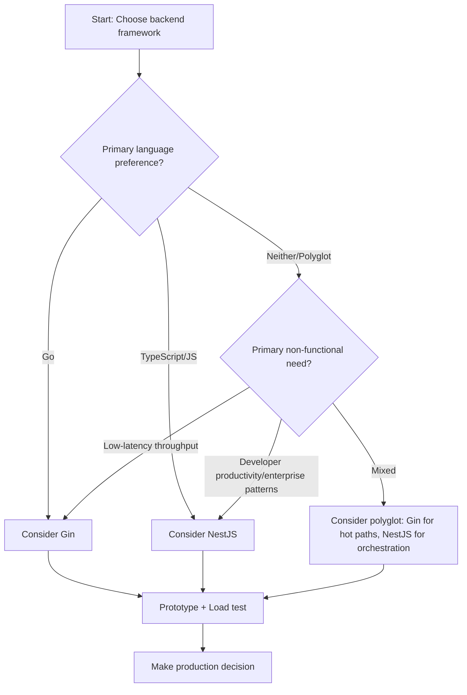

Executive answer

Gin and NestJS solve overlapping problems (HTTP APIs and microservices) but with different technical trade-offs grounded in their languages and design philosophies. Gin is a minimal, high-performance Go HTTP framework focused on fast routing and low allocations (the project README highlights performance and httprouter use); NestJS is a TypeScript-first framework that provides a higher-level architecture (inspired by Angular) and first-class integration with Express and Fastify, intended for large, maintainable, enterprise-grade server applications. [Gin repository](https://github.com/gin-gonic/gin), [NestJS repository](https://github.com/nestjs/nest).

For decisions in production projects, use the tables and decision matrix below to map team skills, latency/throughput needs, language preferences, and operational constraints to a recommendation. The conclusions and workload-fit notes that follow are explicitly labeled where they are inferred from READMEs or repository structure.

Table of contents

- [At-a-glance facts](#at-a-glance-facts)
- [Decision matrix — how to choose](#decision-matrix--how-to-choose)
- [Trade-offs and workload fit analysis](#trade-offs-and-workload-fit-analysis)
  - [API throughput and latency](#api-throughput-and-latency)
  - [Team, ecosystem, and tooling](#team-ecosystem-and-tooling)
  - [Architecture and long-term maintenance](#architecture-and-long-term-maintenance)
- [Migration considerations](#migration-considerations)
- [Recommendations for four project profiles](#recommendations-for-four-project-profiles)
- [Action checklist (Decision checklist)](#action-checklist-decision-checklist)
- [Evidence, assumptions, and limitations](#evidence-assumptions-and-limitations)
- [FAQ](#faq)
- [Sources](#sources)


## Table of contents

- [At-a-glance facts](#at-a-glance-facts)
- [Decision matrix — how to choose](#decision-matrix-how-to-choose)
- [Trade-offs and workload fit analysis](#trade-offs-and-workload-fit-analysis)
- [Migration considerations](#migration-considerations)
- [Decision matrix (detailed table)](#decision-matrix-detailed-table)
- [Recommendations for four project profiles](#recommendations-for-four-project-profiles)
- [Action checklist (Decision checklist)](#action-checklist-decision-checklist)
- [Evidence, assumptions, and limitations](#evidence-assumptions-and-limitations)
- [Visual data (project metadata)](#visual-data-project-metadata)
- [Open Graph and SEO metadata (machine-readable block)](#open-graph-and-seo-metadata-machine-readable-block)
- [Article schema (JSON-LD)](#article-schema-json-ld)

## At-a-glance facts

| Attribute | Gin | NestJS |
|---|---:|---:|
| Repository | [gin-gonic/gin](https://github.com/gin-gonic/gin) | [nestjs/nest](https://github.com/nestjs/nest) |
| Primary language | Go | TypeScript |
| GitHub stars (signal) | 88,907 | 76,242 |
| Forks | 8,650 | 8,450 |
| Open issues (repo) | 720 | 40 |
| License | MIT | MIT |
| Created | 2014-06-16 | 2017-02-04 |
| Latest release (tag) | v1.12.0 (published 2026-02-28) | v11.1.28 (published 2026-07-08) |
| Homepage | https://gin-gonic.com/ | https://nestjs.com |

Sources: project metadata and release entries on the canonical repositories. (Data retrieved/generated 2026-07-13.)

> [!NOTE]
> GitHub stars and forks are signals of interest and community activity from the supplied repository metadata. They are not usage or market-share measurements. See Sources.


## Decision matrix — how to choose

This decision matrix compares the two projects across concrete criteria. Rows list criteria; columns state evidence (from supplied repo metadata or README text) and an inferred guidance line. Architectural inferences are explicitly labeled.

| Criterion | Evidence (from supplied data) | Inferred guidance (explicitly labeled inference) |
|---|---:|---|
| Language/runtime | Gin: Go; NestJS: TypeScript/Node.js | (inferred) Choose Gin if your stack standardizes on compiled Go binaries; choose NestJS if TypeScript/Node is the team standard. |
| Performance orientation | Gin README highlights httprouter and claims high performance; Gin's README lists zero-allocation router features. | (inferred) Prefer Gin for latency-sensitive, memory-constrained endpoints. |
| Architectural framework | NestJS README: "application architecture out of the box... inspired by Angular" and integrates with Express/Fastify. | (inferred) Prefer NestJS when you want a batteries-included, opinionated architecture (DI, modules, decorators). |
| Ecosystem & middleware | Gin has gin-contrib and community middleware; README lists many middleware types. NestJS integrates with Express and Fastify and leverages Node ecosystem. | (inferred) NestJS benefits from the wide npm ecosystem and adapters; Gin benefits from Go-native middleware and gin-contrib. |
| Team familiarity & productivity | Gin requires Go knowledge; NestJS presumes TypeScript/JS familiarity. | (inferred) Team skill is a major deciding factor — avoid language changes unless necessary. |
| Release cadence & maintenance | Both repositories show active recent releases and pushes (metadata shows recent push/published dates). | (fact) Both projects were actively maintained as of 2026-07-13 (see repo data). |


> [!TIP]
> Use this matrix as a starting point: weigh the "Team familiarity" and "Performance orientation" rows higher when time-to-market or latency are the primary constraints.


## Trade-offs and workload fit analysis

Below we unpack the meaningful trade-offs and the kinds of workloads each framework fits best. Where statements reflect synthesis or judgment based on the supplied READMEs and repository metadata, they are labeled as inferred.

### API throughput and latency

Facts from repositories

- Gin README emphasizes a high-performance router and cites httprouter influence; Gin's README includes claims of significantly better performance and zero-allocation routing. [Gin repo](https://github.com/gin-gonic/gin).
- NestJS README states Nest uses Express by default but can work with Fastify, giving access to different HTTP server backends. [NestJS repo](https://github.com/nestjs/nest).

Inferred trade-offs

- (inferred) For microservices and APIs where C10k-style concurrency, low GC overhead, and predictable latency are primary constraints, Go + Gin is typically chosen because Go produces standalone, compiled binaries with lower runtime overhead compared with a V8/Node runtime. This inference follows from the Gin README emphasis on performance and Go as the implementation language.
- (inferred) If you need fast developer iteration, hot-reloadable TypeScript tooling, and access to the npm ecosystem (rich middleware, client libraries), NestJS is often a better match; using Fastify through NestJS can also improve Node-level performance and reduce overhead when configured.


### Team, ecosystem, and tooling

Facts

- NestJS is TypeScript-first and documents an Angular-like architecture; it aims at enterprise-grade, maintainable server applications and supports both Express and Fastify.
- Gin provides middleware ecosystem links (gin-contrib) and examples.

Inferred guidance

- (inferred) For teams with existing TypeScript expertise (shared front-end/back-end developers), NestJS reduces cognitive context switching and can speed development through familiar idioms, decorators, and dependency injection.
- (inferred) For teams invested in Go (SREs, DevOps, or performance-focused backend teams), Gin fits into existing toolchains (single binary deployments, container images with small base layers) and leverages Go’s static type system and compile-time checks.


### Architecture and long-term maintenance

Facts

- NestJS README emphasizes an opinionated application architecture inspired by Angular and explicitly advertises features to boost testability and maintainability.
- Gin README emphasizes minimalism, middleware extensibility, and a small, fast router.

Inferred architecture conclusions (explicitly labeled)

- (inferred from README) NestJS provides an opinionated structure (modules, providers, controllers) that can enforce architecture across large teams, reducing design drift but adding framework-specific structure to learn and maintain.
- (inferred from README/repo structure) Gin offers a smaller surface area and fewer mandatory abstractions; projects author their own structure and choose middleware, which reduces framework lock-in but increases the need for internal architectural discipline.


## Migration considerations

The migration path depends on direction (Node -> Go or Go -> Node). Below are practical areas to plan for. These are inferred recommendations based on repository facts (language, architecture notes) and typical migration concerns — labeled accordingly.

Common migration steps (inferred)

- Inventory HTTP surface: list endpoints, middleware (auth, logging), streaming/SSE/WebSocket usage, and third-party integrations.
- Map language/runtime idioms: TypeScript async/await and middleware patterns versus Go goroutines, channels, and error handling. (inferred)
- Reimplement core components: request handlers, DTOs/validation, middleware adapters, and error handling in the target framework. (inferred)
- CI and deployment: build and test pipelines change — Go compiles into a single binary; Node uses npm/yarn and bundling. Update container build steps and health checks. (inferred)
- Observability and tracing: ensure metrics, logging formats, and traces remain consistent. Reuse external agents or export formats. (inferred)

Direction-specific notes

- Migrating an API from NestJS -> Gin: re-implement controllers as Gin handlers, map DTOs to Go structs, and port validation logic (no direct code-compatible translation). Plan for Go dependency management (modules) and static typing changes. (inferred)
- Migrating from Gin -> NestJS: re-implement handlers as controllers/providers, translate middleware, and add TypeScript interfaces or DTO classes. Use Nest modules to replicate route grouping logic.

> [!WARNING]
> Rewriting in a different language is effectively a full-stack change of the service. Expect nontrivial testing, performance revalidation, and potential differences in concurrency behavior. Validate with benchmarks and production-like load tests before cutover.


## Decision matrix (detailed table)

This table is a compact decision tool. Each row is a decision factor; the recommended column provides an inferred suggestion based on the supplied repository facts and README descriptions.

| Decision factor | If you need... | Recommended (explicit inference) |
|---|---:|---|
| Lowest per-request memory and minimal allocations | Maximum throughput and minimal runtime allocations | Gin (inferred from Gin README emphasis on zero-allocation router and performance) |
| Strong architectural scaffolding and DI, TypeScript-first | Large team, strict patterns, code generation, and shared front-end/back-end TS knowledge | NestJS (inferred from NestJS README describing Angular-inspired architecture) |
| Fast iteration with npm packages and wide third-party modules | Need many JavaScript SDKs or quick prototyping with npm | NestJS (fact: integrates with Express/Fastify and Node ecosystem) |
| Single static binary deployment with small operational footprint | Prefer compiled Go binaries for simpler deployment | Gin (fact: language is Go) |
| Mixed-language org with strong JS/TS expertise | Reuse existing TypeScript practices and share types where possible | NestJS (fact: TypeScript-first) |


## Recommendations for four project profiles

Each profile includes an evidence-grounded recommendation. All recommendations are inferences that synthesize repo facts (language, README claims) and operational trade-offs.

1) High-throughput public API for telemetry ingestion (low-latency, high-concurrency)

- Evidence: Gin is implemented in Go, README emphasizes performance and zero-allocation routing. NestJS can leverage Fastify but runs on Node runtime.
- Recommendation (inferred): Favor Gin when your primary requirement is predictable low-latency at scale and you can staff Go expertise. Use Go toolchain for static builds and minimal runtime overhead.

2) Enterprise internal platform with many teams and strict architecture needs

- Evidence: NestJS README explicitly advertises an opinionated architecture and testability; NestJS is TypeScript-first.
- Recommendation (inferred): Favor NestJS to standardize architecture across teams, benefit from DI, modules and TypeScript type-safety that aligns with enterprise development patterns and shared libraries.

3) Full-stack JavaScript/TypeScript team (shared DTOs and rapid frontend-backend iteration)

- Evidence: NestJS preserves compatibility with JavaScript and is TypeScript-first; it supports Angular-like patterns.
- Recommendation (inferred): Favor NestJS to maximize code reuse, shared types, and faster onboarding for JS/TS developers.

4) Small microservice or CLI-backed service with strict binary deployment needs (DevOps-heavy)

- Evidence: Gin is Go-based and produces compiled binaries (fact: language is Go). README shows compact examples and minimal setup.
- Recommendation (inferred): Favor Gin for a small microservice that benefits from single-binary deployment, small runtime surface, and straightforward containerization.


> [!TIP]
> When your constraints span both camps (for example, performance + TypeScript), consider polyglot architecture: implement hot paths in Go/Gin services and keep higher-level business orchestration in NestJS services. This is an operational pattern, not a product claim from either README.


## Action checklist (Decision checklist)

- [ ] Map team language expertise (Go vs TypeScript). Prioritize team familiarity.
- [ ] List non-functional requirements: latency, throughput, memory, binary size, GC behavior.
- [ ] Inventory required third-party SDKs; verify availability for Go vs Node.
- [ ] Prototype a representative endpoint in both Gin and NestJS and run realistic load and correctness tests.
- [ ] Plan CI/CD changes: Go builds vs Node builds, image sizes, and health checks.
- [ ] If migrating, prepare a phased cutover with feature toggles and traffic splitting; include observability parity checks.


## Evidence, assumptions, and limitations

Evidence (sources used — data retrieval/generation date: 2026-07-13T02:17:29.568046+00:00):

- Gin canonical repository: https://github.com/gin-gonic/gin — used for repository metadata, README content excerpts, release information (v1.12.0 published 2026-02-28). (fact)
- Gin latest GitHub release: https://github.com/gin-gonic/gin/releases/tag/v1.12.0 — used for changelog facts. (fact)
- NestJS canonical repository: https://github.com/nestjs/nest — used for README content, repository metadata, and release information (v11.1.28 published 2026-07-08). (fact)

Assumptions and explicit inferences

- Any recommendation that depends on behavioral characteristics (performance, developer productivity, operational simplicity) is an inference synthesized from the supplied READMEs and repository metadata and is labeled as such in the text. (non-negotiable rule 5)
- The article does not invent benchmarks, adoption percentages, or security vulnerabilities beyond the supplied repository information. (non-negotiable rules 2, 3, 4, 6)

Limitations

- This comparison relies only on supplied repository facts and README claims. It does not include independent benchmarking performed by this article. Where performance or fit is discussed beyond raw repository metadata, statements are explicitly labeled as inferred and should be validated with prototypes and load tests in your environment.


## Visual data (project metadata)





## FAQ

- Q: Are GitHub star counts a measure of market share?
  - A: No. GitHub stars are interest signals and community activity indicators from the supplied repository metadata; they are not a market-share measurement.

- Q: Which framework is faster out of the box?
  - A: The supplied Gin README emphasizes high performance (httprouter, zero-allocation design). NestJS can use Fastify for improved Node performance. Performance comparisons should be validated with your own benchmarks; the article does not invent external benchmark numbers. (inferred recommendation: prototype and measure.)

- Q: Do both projects get regular updates?
  - A: Yes; the supplied metadata shows recent releases and pushes (Gin latest release v1.12.0 published 2026-02-28; NestJS latest release v11.1.28 published 2026-07-08). (fact)

- Q: Can NestJS use Fastify instead of Express?
  - A: Yes. The NestJS README states the framework supports Express by default and also provides compatibility with Fastify. (fact)

- Q: Is Gin production-ready?
  - A: The Gin README lists production users and example projects and has active releases; the repository metadata shows active maintenance. Use that evidence to evaluate fit for your production needs. (fact)

- Q: What are practical migration risks?
  - A: Rewriting across languages implies reimplementation of handlers, validation, middleware, CI changes, and production testing. The article flags rewrite as a nontrivial operation and recommends phased cutovers and load testing. (inferred)


## Sources

- Gin canonical repository: https://github.com/gin-gonic/gin
- Gin latest GitHub release: https://github.com/gin-gonic/gin/releases/tag/v1.12.0
- NestJS canonical repository: https://github.com/nestjs/nest


## Open Graph and SEO metadata (machine-readable block)

<!-- Open Graph fields and canonical URL for search engines -->

- canonical: https://madewithwhat.net/gin-vs-nestjs
- og:title: Gin vs NestJS: Choosing the Right Backend (Go vs Node/TS)
- og:description: Compare Gin (Go) and NestJS (Node/TypeScript) for real projects: decision matrix, trade-offs, migration notes, and recommendations.
- og:type: article
- article:published_time: 2026-01-20
- primary_keyphrase: gin vs nestjs


## Article schema (JSON-LD)

```json
{
  "@context": "https://schema.org",
  "@type": "Article",
  "headline": "Gin vs NestJS: Choosing the Right Backend (Go vs Node/TS)",
  "description": "Compare Gin (Go) and NestJS (Node/TypeScript) for real projects: decision matrix, trade-offs, migration notes, and recommendations.",
  "author": {"@type": "Organization", "name": "MadeWithWhat"},
  "datePublished": "2026-01-20",
  "mainEntityOfPage": {"@type": "WebPage", "@id": "https://madewithwhat.net/gin-vs-nestjs"}
}
```
