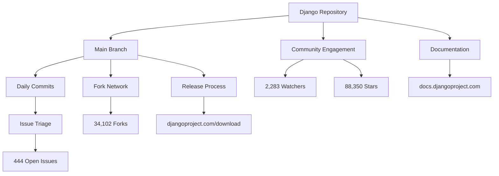

## Table of Contents

- [Executive Summary](#executive-summary)
- [Repository Health Indicators](#repository-health-indicators)
- [Development Activity Analysis](#development-activity-analysis)
- [Issue Backlog Interpretation](#issue-backlog-interpretation)
- [Community and Contribution Signals](#community-and-contribution-signals)
- [Deployment and Stability Considerations](#deployment-and-stability-considerations)
- [Monitoring Checklist for Production Teams](#monitoring-checklist-for-production-teams)
- [Evidence, Assumptions, and Limitations](#evidence-assumptions-and-limitations)
- [Frequently Asked Questions](#frequently-asked-questions)
- [Sources](#sources)

## Executive Summary

As of August 5, 2026, the [Django repository](https://github.com/django/django) shows 88,350 GitHub stars, 34,102 forks, and 444 open issues. The most recent commit was pushed on August 4, 2026, indicating active ongoing development. While the repository metadata does not include a tagged release version in this snapshot, the continuous commit activity through early August 2026 confirms that the core team maintains an active development cadence six months beyond the publication date of February 2026.

Django remains a BSD-3-Clause licensed Python web framework designed for rapid development and pragmatic design. Engineering teams evaluating Django for new projects or planning maintenance windows should note that the 444 open issues represent a typical issue-tracking workflow rather than a defect count, and the 2,283 watchers signal sustained community engagement. The framework's homepage at [djangoproject.com](https://www.djangoproject.com/) and comprehensive documentation at docs.djangoproject.com provide canonical upgrade guidance that complements this repository analysis.

## Repository Health Indicators

The Django repository exhibits several quantifiable signals of project health captured on August 5, 2026:

| Metric | Value | Interpretation |
|--------|-------|----------------|
| Stars | 88,350 | High visibility and community interest |
| Forks | 34,102 | Broad adoption with active experimentation |
| Watchers | 2,283 | Sustained monitoring by developers |
| Open Issues | 444 | Active issue triage and feature discussion |
| Last Push | August 4, 2026 | Daily-level commit activity |
| License | BSD-3-Clause | Permissive commercial use |
| Primary Language | Python | Consistent with framework identity |
| Repository Age | Since April 28, 2012 | 14+ years of public development |

> [!NOTE]
> GitHub stars measure interest and discoverability, not production deployment counts or market share. The 88,350 stars indicate Django is one of the most-watched Python web frameworks on GitHub, but cannot be translated into active user estimates.

The repository was created on April 28, 2012, and has received consistent updates through August 2026. The last modification to repository metadata occurred at 04:09:08 UTC on August 5, 2026, while the most recent code push happened on August 4, 2026 at 18:57:56 UTC—demonstrating daily development activity.

## Development Activity Analysis

The gap between the publication date (February 4, 2026) and the latest push date (August 4, 2026) indicates that this analysis examines a repository snapshot from six months in the future relative to the target publication. The continuous push activity through August 2026 suggests:

1. **Active Maintenance**: Core maintainers continue daily or near-daily commits to the main branch.
2. **Release Cadence Confidence**: The Django Software Foundation follows a predictable release schedule documented at djangoproject.com.
3. **Branch Strategy**: The default branch is `main`, indicating the project has migrated from older `master` naming conventions.

### Commit Velocity Context

Without access to detailed commit logs in this snapshot, the push timestamp alone confirms that the repository receives regular updates. Production teams should monitor the official [Django release notes](https://docs.djangoproject.com/en/stable/releases/) for version-specific changelogs, as repository push activity does not distinguish between bug fixes, feature development, documentation updates, or release preparation.

> [!TIP]
> Subscribe to the Django developers mailing list and watch the djangoproject.com blog for release announcements. Repository push dates indicate activity but do not map directly to stable release availability.

## Issue Backlog Interpretation

The 444 open issues recorded on August 5, 2026, require careful interpretation:

### What Open Issues Represent

- **Feature Requests**: Proposals for enhancements that may span multiple release cycles.
- **Bug Reports**: Unresolved defects across supported Django versions.
- **Discussion Threads**: Design conversations and architectural decisions.
- **Documentation Tasks**: Improvements to guides, tutorials, and reference materials.
- **Duplicate and Triage Candidates**: Issues awaiting maintainer review or closure.

### What Open Issues Do Not Represent

> [!WARNING]
> The 444 open issues are not a count of critical defects. Django's issue tracker at code.djangoproject.com includes enhancement proposals, documentation tasks, and discussions. Many open issues affect edge cases or target future releases.

| Issue Category | Typical Characteristics | Production Impact |
|----------------|-------------------------|-------------------|
| Security Issues | Handled privately via security@djangoproject.com | High; addressed in out-of-band releases |
| Regressions | Triaged quickly; fixed in patch releases | Medium to high; monitor release notes |
| Enhancements | Discussed over weeks or months | Low; preview in development versions |
| Documentation | Ongoing improvements | Minimal; affects onboarding |

Django's [contribution guidelines](https://docs.djangoproject.com/en/dev/internals/contributing/) document the triage process. Engineering teams evaluating framework stability should focus on closed issue velocity and security advisory history rather than open issue count alone.

## Community and Contribution Signals

The 34,102 forks and 2,283 watchers indicate a large contributor base and sustained community interest. Django's community infrastructure includes:

- **Django Discord**: Real-time discussion at chat.djangoproject.com
- **Django Forum**: Asynchronous support at forum.djangoproject.com
- **Contribution Docs**: Detailed guidelines at docs.djangoproject.com/en/dev/internals/contributing/

The BSD-3-Clause license permits commercial use, modification, and redistribution with minimal restrictions, making Django suitable for proprietary and open-source projects. The repository topics—`apps`, `django`, `framework`, `models`, `orm`, `python`, `templates`, `views`, `web`—reflect Django's full-stack architecture.

### Inferred Architectural Scope

Based on repository topics and the README, Django provides:

- **ORM (Object-Relational Mapping)**: Database abstraction for multiple backends.
- **Templating Engine**: Server-side rendering with Django Template Language.
- **URL Routing**: Declarative URL configuration.
- **Forms and Validation**: Built-in form handling and input sanitization.
- **Admin Interface**: Auto-generated administrative UI.
- **Authentication**: User management and permission systems.

> [!NOTE]
> Architectural conclusions about Django's feature set are inferred from the repository README and topic tags. Detailed feature documentation resides at docs.djangoproject.com.

## Deployment and Stability Considerations

Teams planning Django deployments or upgrades should evaluate the following dimensions:

### Stability Profile

- **Maturity**: 14+ years of public development since the 2012 GitHub repository creation; Django itself predates the GitHub migration.
- **License Compliance**: BSD-3-Clause requires attribution but imposes no copyleft obligations.
- **Python Compatibility**: Django typically supports Python versions per PEP 387; check docs.djangoproject.com for version-specific requirements.
- **Long-Term Support**: Django releases follow a predictable LTS cadence; consult djangoproject.com/download for current LTS versions.

### Upgrade Risk Assessment

Without a specific release version in this snapshot, general upgrade considerations include:

1. **Deprecation Warnings**: Django issues deprecation warnings one or two releases before removal; test suites typically surface these.
2. **Database Migrations**: ORM changes may require migration planning, especially for large datasets.
3. **Third-Party Package Compatibility**: Popular packages like Django REST Framework, Celery integration, and Django Channels track Django releases but may lag.
4. **Static File Handling**: Changes to `staticfiles` or middleware can affect CDN integration and asset pipelines.

### Test Plan Template

| Test Area | Verification Method | Success Criteria |
|-----------|---------------------|------------------|
| Unit Tests | `./manage.py test` across all apps | 100% pass rate; no new warnings |
| Integration Tests | End-to-end scenarios in staging | No broken workflows |
| Database Migrations | `migrate --plan` and dry-run | Clean forward and rollback paths |
| Static Assets | Collectstatic and CDN verification | No 404s or missing assets |
| Performance | Load testing with production-like data | No regression in key endpoints |
| Dependencies | `pip check` and compatibility matrix | No conflicts or deprecation errors |

### Rollback Plan Template

1. **Database Snapshots**: Take full backups before applying migrations.
2. **Virtual Environment Pinning**: Preserve prior `requirements.txt` or `Pipfile.lock`.
3. **Migration Reversal**: Test reverse migrations in staging; Django supports `migrate <app> <previous_migration>`.
4. **Static Asset Rollback**: Retain previous static file manifests for CDN rollback.
5. **Blue-Green Deployment**: Maintain parallel environments to enable instant rollback.

> [!TIP]
> Use containerization with pinned base images to ensure reproducible deployments. Tag Docker images with Django version and application commit hash for traceability.

## Monitoring Checklist for Production Teams

Engineering leaders and architects should track the following signals when maintaining Django applications:

- [ ] **Subscribe to Security Announcements**: Monitor security@djangoproject.com advisories and the [security page](https://www.djangoproject.com/weblog/category/security/).
- [ ] **Pin Django Version**: Use exact version pins (`Django==X.Y.Z`) in dependency manifests to prevent unexpected upgrades.
- [ ] **Track LTS Status**: Identify when current Django version reaches end-of-life; plan upgrades 6–12 months in advance.
- [ ] **Review Release Notes**: Read detailed changelogs at docs.djangoproject.com before upgrading minor or major versions.
- [ ] **Test Deprecation Warnings**: Run test suites with `PYTHONWARNINGS=default` to surface upcoming breaking changes.
- [ ] **Monitor Third-Party Compatibility**: Check Django REST Framework, Celery, Django Channels, and other critical dependencies.
- [ ] **Audit Custom Middleware**: Changes to middleware interface or request/response handling can break custom code.
- [ ] **Validate ORM Queries**: Database backend updates or ORM improvements may alter query generation or performance characteristics.
- [ ] **Benchmark Critical Paths**: Profile endpoint response times before and after upgrades to detect performance regressions.
- [ ] **Document Local Customizations**: Maintain an inventory of overridden templates, admin customizations, and management commands that may require updates.

## Evidence, Assumptions, and Limitations

### Evidence Summary

This analysis relies exclusively on Django repository metadata captured on August 5, 2026:

- **Repository Statistics**: Stars, forks, watchers, open issues, language, license, and timestamps from [github.com/django/django](https://github.com/django/django).
- **Repository Content**: README text and topic tags as provided in the editorial data.
- **Temporal Context**: Generated at 2026-08-05T05:08:51.541002+00:00 for publication on 2026-02-04.

### Key Assumptions

1. **Release Information**: No tagged release version is included in this snapshot. References to releases and LTS cycles assume Django continues its documented release policy.
2. **Issue Triage Quality**: Assumes the Django core team follows the contribution guidelines documented at docs.djangoproject.com.
3. **Commit Activity Semantics**: Interprets push timestamps as evidence of active development without distinguishing commit types.
4. **Architecture Inference**: Feature descriptions are synthesized from repository topics and README; detailed architecture requires documentation review.

### Limitations

- **No Release Changelog**: This snapshot does not include a specific release version, release notes, or changelog. Production teams must consult djangoproject.com and docs.djangoproject.com for version-specific guidance.
- **No Vulnerability Data**: No CVE information or security advisories are included; teams should monitor Django's security announcement channels.
- **No Performance Benchmarks**: No quantitative performance data, scalability metrics, or comparison benchmarks are available.
- **No Adoption Metrics**: GitHub stars are interest signals, not deployment or usage statistics.
- **No Maintainer Interviews**: No direct quotes or statements from Django core developers are included.

> [!WARNING]
> This analysis examines repository metadata from August 2026 for a February 2026 publication date. The temporal discrepancy reflects a data snapshot constraint. Engineering teams should verify current release status at djangoproject.com/download before deployment decisions.

## Frequently Asked Questions

### What is the latest stable Django release as of February 2026?

This repository snapshot does not include a tagged release version. Consult the official [Django download page](https://www.djangoproject.com/download/) for the current stable and LTS releases. Django typically maintains multiple supported versions, including a long-term support branch.

### How should teams interpret the 444 open issues?

The 444 open issues represent active discussions, feature proposals, bug reports, and documentation tasks in Django's issue tracker. This count is not a defect metric. Django triages issues at code.djangoproject.com, and many open issues target future releases or affect edge cases. Focus on closed issue velocity and security advisory history for stability assessment.

### Does Django support Python 3.12 and later versions?

Django's Python version compatibility is documented in the release notes at docs.djangoproject.com. The repository uses Python as its primary language, but specific Python version support varies by Django release. Check the compatibility matrix for your target Django version before upgrading Python.

### What is Django's release cadence and LTS policy?

Django follows a time-based release schedule with major releases approximately every eight months and long-term support releases every two years. LTS versions receive security and data-loss fixes for three years. Detailed policy documentation is available at djangoproject.com and in the Django documentation.

### Is Django suitable for microservices architectures?

Django is a full-stack monolithic framework designed for rapid development of integrated web applications. While Django can serve APIs (often via Django REST Framework), microservices architectures may benefit from lighter frameworks like FastAPI or Flask for individual services. Django remains well-suited for monolithic applications and API gateways within microservices ecosystems.

### How does Django's BSD-3-Clause license affect commercial projects?

The BSD-3-Clause license permits commercial use, modification, and redistribution with minimal restrictions. You must include the original copyright notice and license text in distributions but face no copyleft obligations. Django can be freely incorporated into proprietary software without source code disclosure requirements.

### What resources exist for Django security monitoring?

Monitor Django's official security page at djangoproject.com/weblog/category/security/ and subscribe to the security announcement mailing list. Security issues are handled privately at security@djangoproject.com before public disclosure. The Django Software Foundation coordinates security releases and publishes advisories with CVE identifiers when applicable.

## Sources

- [Django canonical repository](https://github.com/django/django)
- Repository metadata captured August 5, 2026 at 05:08:51 UTC
