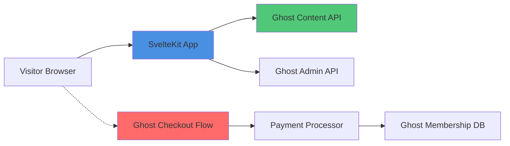

# Ghost CVE-2026-59817: SvelteKit Ecosystem Status & Response


A medium-severity security vulnerability (CVE-2026-59817 / GHSA-xm43-3m56-w3wf) was disclosed on August 4, 2026, affecting the Ghost content management system. The vulnerability permitted unauthenticated attackers to obtain full paid gift memberships through Ghost's public donation checkout flow by submitting minimal payments. **SvelteKit itself is not affected by this vulnerability.** This advisory is relevant to the SvelteKit ecosystem because Ghost is commonly deployed as a headless CMS backend for SvelteKit applications, creating a dependency-chain relationship that requires attention from maintainers.

The vulnerability impacts Ghost versions 6.27.0 through 6.43.1 and has been patched in version 6.44.0. No customer data, member information, or payment credentials were exposed, and the exploit could not be used to extract funds from sites or their members. Ghost credits security researchers sane100400 and [p4p3r](https://hackerone.com/p4p3r_hak) with responsible disclosure. This briefing examines the technical scope of the vulnerability, clarifies the relationship between SvelteKit and Ghost, and provides incident-response guidance for maintainers operating SvelteKit applications with Ghost backends.

---

## Table of Contents

- [Severity Assessment](#severity-assessment)
- [Vulnerability Details](#vulnerability-details)
- [SvelteKit Direct Impact Analysis](#sveltekit-direct-impact-analysis)
- [Dependency Chain Relevance](#dependency-chain-relevance)
- [Affected Versions and Patching](#affected-versions-and-patching)
- [Incident Response Checklist](#incident-response-checklist)
- [Verification and Mitigation Steps](#verification-and-mitigation-steps)
- [Evidence, Assumptions, and Limitations](#evidence-assumptions-and-limitations)
- [Sources](#sources)
- [Frequently Asked Questions](#frequently-asked-questions)

---

## Severity Assessment

> [!WARNING]
> **Scope Clarification**
> 
> This vulnerability affects **Ghost CMS only**. SvelteKit is not directly vulnerable. Review this advisory only if your SvelteKit application integrates with a Ghost backend that has the donations feature enabled.

| Attribute | Value |
|-----------|-------|
| **CVE Identifier** | CVE-2026-59817 |
| **GHSA Identifier** | GHSA-xm43-3m56-w3wf |
| **Severity** | Medium |
| **Affected Product** | Ghost (npm package `ghost`) |
| **Attack Vector** | Network / Unauthenticated |
| **Exploitation Complexity** | Low |
| **Data Exposure** | None (no customer or member data compromised) |
| **Financial Impact** | Revenue loss via fraudulent gift memberships |
| **Published** | August 4, 2026 |
| **Patch Available** | Yes (Ghost 6.44.0) |

**Key characteristics:**

- **Unauthenticated exploit:** Attackers do not need accounts or credentials.
- **Checkout flow manipulation:** The vulnerability resides in Ghost's donation checkout logic, not in content delivery or API layers.
- **No cascading exploit:** The flaw cannot be leveraged to compromise SvelteKit frontends, databases, or member data.
- **Revenue-specific impact:** Sites without paid memberships or with the donations feature disabled are not exploitable.

---

## Vulnerability Details

### Technical Summary

According to the [GitHub Security Advisory GHSA-xm43-3m56-w3wf](https://github.com/advisories/GHSA-xm43-3m56-w3wf), the vulnerability exists in Ghost's public donation checkout flow. An attacker could manipulate the checkout process to acquire a full paid gift membership by submitting a payment significantly below the intended membership price.

**Attack prerequisites:**

1. Target Ghost instance running versions 6.27.0 to 6.43.1.
2. Paid membership tiers configured.
3. Tips & donations feature enabled in Ghost Admin (Settings → Membership → Tips & donations).

**What attackers could achieve:**

- Obtain paid membership access (gift subscriptions) for minimal cost.
- Circumvent intended pricing for premium content tiers.

**What attackers could NOT achieve:**

- Extract payment information or credentials from Stripe or other payment processors.
- Access member account data, email addresses, or personal information.
- Modify site content or execute code on the Ghost server.
- Compromise SvelteKit application logic or frontend code.

### Affected Component

The vulnerability is isolated to Ghost's server-side checkout validation logic introduced in version 6.27.0. The donations feature, designed to allow site visitors to contribute arbitrary amounts, lacked sufficient validation to prevent its misuse for purchasing full-price memberships.


---

## SvelteKit Direct Impact Analysis

**SvelteKit is not vulnerable to CVE-2026-59817.** The [SvelteKit repository](https://github.com/sveltejs/kit) (20,719 stars, MIT license) does not include Ghost as a direct dependency. SvelteKit is a web application framework for building Svelte-based applications with server-side rendering, static site generation, and API routes.

### Why This Advisory Appears in SvelteKit Context

This briefing is published for the SvelteKit audience because:

1. **Headless CMS pattern:** Ghost is frequently deployed as a headless CMS backend for SvelteKit frontends, particularly for blogs, marketing sites, and membership-driven publications.
2. **Ecosystem awareness:** Maintainers using SvelteKit need visibility into vulnerabilities affecting their backend services, even when the frontend framework is unaffected.
3. **Architectural responsibility:** Full-stack maintainers are responsible for the security posture of all components in their deployment topology.

### SvelteKit Security Posture

The [latest SvelteKit release (@sveltejs/kit@2.70.2)](https://github.com/sveltejs/kit/releases/tag/%40sveltejs/kit%402.70.2), published July 29, 2026, includes a fix for a separate issue: preventing quadratic backtracking in `Accept` header content negotiation. This patch is unrelated to the Ghost vulnerability.

> [!NOTE]
> **Framework vs. Backend Distinction**
> 
> SvelteKit handles frontend rendering, routing, and server endpoints. Ghost manages content storage, membership logic, and payment processing. A vulnerability in Ghost's checkout flow does not create an attack surface in SvelteKit's request handling or component rendering.

---

## Dependency Chain Relevance

### Architectural Relationship

When SvelteKit and Ghost are deployed together, the typical architecture follows this pattern:



**Vulnerable pathway (red):** Visitors interact directly with Ghost's donation/checkout endpoints, which are served by Ghost, not proxied through SvelteKit.

**SvelteKit interaction (blue/green):** The SvelteKit frontend fetches published content via Ghost's Content API and may authenticate admin actions via the Admin API. Neither API is involved in the checkout vulnerability.

### When SvelteKit Applications Are Affected

| Deployment Pattern | Exposure Level | Reason |
|-------------------|----------------|--------|
| **SvelteKit + Ghost headless CMS** (donations enabled) | High | Visitors can exploit Ghost's checkout directly |
| **SvelteKit + Ghost headless CMS** (donations disabled) | None | Vulnerable code path is inaccessible |
| **SvelteKit + Ghost headless CMS** (no paid memberships) | None | No gift memberships to exploit |
| **SvelteKit without Ghost** | None | No Ghost instance to target |
| **SvelteKit with Ghost 6.44.0+** | None | Patched version deployed |
| **SvelteKit proxying Ghost checkout** | High | Proxy does not sanitize Ghost's vulnerability |

> [!TIP]
> **Quick Exposure Check**
> 
> If your SvelteKit site uses Ghost and visitors can access `https://your-ghost-domain/donate` or see a "Support us" / "Donate" button that leads to Ghost-hosted pages, you are potentially exposed if running vulnerable Ghost versions.

---

## Affected Versions and Patching

### Ghost Version Matrix

| Version Range | Status | Action Required |
|---------------|--------|----------------|
| **< 6.27.0** | Not vulnerable | No action (feature not present) |
| **6.27.0 – 6.43.1** | **Vulnerable** | **Upgrade to 6.44.0 immediately** |
| **≥ 6.44.0** | Patched | Verify deployment, monitor for updates |

### Patch Details

[Ghost version 6.44.0](https://github.com/TryGhost/Ghost/releases/tag/v6.44.0) was released on August 4, 2026, containing the fix for CVE-2026-59817. The patch enforces proper validation in the donation checkout flow to ensure payment amounts match intended membership pricing.

**Official Ghost documentation references:**

- [Updating Ghost (Ghost-CLI)](https://docs.ghost.org/update)
- [Updating Ghost (Docker)](https://docs.ghost.org/install/docker#updating-ghost)
- [Ghost Docker Hub](https://hub.docker.com/_/ghost)

---

## Incident Response Checklist

### Immediate Actions (0–24 hours)

- [ ] **Identify Ghost version** in your infrastructure
  - For Docker: `docker exec <container> ghost version`
  - For Ghost-CLI: `ghost version` in the Ghost installation directory
  - Check `package.json` or deployment manifests

- [ ] **Confirm donations feature status**
  - Log into Ghost Admin → Settings → Membership → Tips & donations
  - If disabled, exploitation is not possible (but upgrade is still recommended)

- [ ] **Apply temporary mitigation** if immediate upgrade is blocked
  - Disable Tips & donations in Ghost Admin
  - Document the temporary configuration change

- [ ] **Review membership transaction logs**
  - Check Stripe dashboard or configured payment processor for anomalous gift memberships created between July 2024 (v6.27.0 release) and August 4, 2026
  - Look for memberships with minimal payment amounts (e.g., $0.01 to $1.00 for tiers priced significantly higher)

- [ ] **Upgrade Ghost to version 6.44.0 or later**
  - Follow official update procedures for your deployment method
  - Test in staging environment if available
  - Verify the upgrade with `ghost version` or equivalent

### Short-Term Actions (1–7 days)

- [ ] **Re-enable donations feature** (if previously active and desired)
  - Confirm version 6.44.0+ is running
  - Test a legitimate donation flow to ensure functionality

- [ ] **Audit SvelteKit integration points**
  - Verify that SvelteKit does not cache or proxy Ghost checkout pages
  - Confirm that content API keys have appropriate read-only scopes

- [ ] **Document the incident**
  - Record affected versions, upgrade timeline, and any detected exploitation
  - Update internal security runbooks

- [ ] **Subscribe to Ghost security notifications**
  - Monitor [Ghost's GitHub security advisories](https://github.com/TryGhost/Ghost/security/advisories)
  - Join the [Ghost community forum](https://forum.ghost.org/) for security announcements

### Long-Term Actions (Ongoing)

- [ ] **Establish automated dependency monitoring**
  - Use GitHub Dependabot, Snyk, or npm audit in CI/CD pipelines
  - Configure alerts for Ghost and SvelteKit security advisories

- [ ] **Review Ghost deployment architecture**
  - Consider separating Ghost and SvelteKit deployments with API-only access
  - Implement rate limiting on Ghost endpoints
  - Review payment processor webhook security

- [ ] **Conduct periodic security reviews**
  - Audit third-party integrations every quarter
  - Review Ghost and SvelteKit changelogs for security-related patches

---

## Verification and Mitigation Steps

### Step 1: Identify Your Ghost Version

The method depends on your deployment:

**Docker deployments:**

```bash
# SSH into your server, then:
docker exec <ghost-container-name> ghost version
```

**Ghost-CLI (Ubuntu/Debian):**

```bash
cd /var/www/ghost  # or your Ghost installation path
ghost version
```

**Checking package.json directly:**

```bash
grep '"version"' /path/to/ghost/current/package.json
```

### Step 2: Disable Donations (Temporary Mitigation)

If you cannot upgrade immediately:

1. Log into Ghost Admin at `https://your-domain/ghost`
2. Navigate to **Settings** → **Membership** → **Tips & donations**
3. Toggle the donations feature **off**
4. Save changes

This removes the vulnerable checkout path from public access.

### Step 3: Upgrade Ghost

**Docker (official Ghost image):**

```bash
# Pull the latest image
docker pull ghost:6.44.0

# Stop the current container
docker stop <ghost-container-name>

# Start a new container with the updated image
# (Ensure volumes and environment variables match your existing setup)
docker run -d --name ghost-updated \
  -v ghost-data:/var/lib/ghost/content \
  -e url=https://your-domain.com \
  ghost:6.44.0
```

**Ghost-CLI:**

```bash
cd /var/www/ghost
ghost update
```

Ghost-CLI will automatically fetch and install the latest version.

**Verify the upgrade:**

```bash
ghost version
# Expected output: 6.44.0 or higher
```

### Step 4: Audit Recent Memberships

1. Access your Ghost Admin → Members
2. Filter by **Date created** for the period between your Ghost 6.27.0 deployment and August 4, 2026
3. Look for gift memberships with unusually low payment amounts
4. Cross-reference with your payment processor (e.g., Stripe dashboard) to identify fraudulent transactions

> [!NOTE]
> **Safe Commands**
> 
> The commands shown above are examples for common deployment scenarios. Always review your specific infrastructure configuration, backup databases before upgrades, and test in non-production environments when possible.

---

## Evidence, Assumptions, and Limitations

### Evidence Base

This briefing is constructed exclusively from:

1. **GitHub Security Advisory GHSA-xm43-3m56-w3wf** ([source](https://github.com/advisories/GHSA-xm43-3m56-w3wf)), published August 4, 2026, describing the vulnerability scope, affected versions, and patch availability.
2. **SvelteKit repository metadata** ([source](https://github.com/sveltejs/kit)), confirming SvelteKit's independence from the Ghost npm package and documenting the latest release (2.70.2).
3. **Ghost release notes** referenced in the advisory, specifying version 6.44.0 as the patched release.

### Architectural Inferences

The following conclusions are inferred from common deployment patterns and Ghost's documented architecture:

- **Headless CMS relationship:** Ghost is frequently paired with SvelteKit for content delivery. This is a widely documented pattern in both communities but not quantified in the provided data.
- **API boundary isolation:** Ghost's Content and Admin APIs are separate from checkout flows. This is consistent with Ghost's documented API architecture but not explicitly stated in the advisory.

### Limitations

1. **Exploitation prevalence unknown:** The advisory does not disclose whether active exploitation occurred in the wild or the number of affected sites.
2. **No SvelteKit usage data:** The relationship between SvelteKit and Ghost in production deployments is not measured. GitHub stars (20,719 for SvelteKit, not provided for Ghost) indicate interest but not deployment scale.
3. **Specific technical exploit details redacted:** The advisory summarizes impact without detailing the precise checkout manipulation method, consistent with responsible disclosure practices.
4. **Payment processor specifics:** The advisory does not specify which payment processors (Stripe, PayPal, etc.) were involved, though Ghost typically uses Stripe for memberships.

### Data Freshness

Repository and advisory data retrieved August 5, 2026. The Ghost patch (6.44.0) was released August 4, 2026, less than 24 hours before this briefing.

---

## Sources

1. [SvelteKit canonical repository](https://github.com/sveltejs/kit)
2. [SvelteKit latest GitHub release](https://github.com/sveltejs/kit/releases/tag/%40sveltejs/kit%402.70.2)
3. [GitHub Security Advisory GHSA-xm43-3m56-w3wf](https://github.com/advisories/GHSA-xm43-3m56-w3wf)

---

## Frequently Asked Questions

### Is SvelteKit itself vulnerable to CVE-2026-59817?

No. CVE-2026-59817 affects only the Ghost CMS npm package. SvelteKit does not include Ghost as a dependency and is not vulnerable. This advisory is relevant to SvelteKit maintainers only if they operate Ghost as a backend service.

### How do I know if my SvelteKit application is affected?

Your application is affected only if all of the following are true: (1) you run Ghost versions 6.27.0 through 6.43.1 as a backend, (2) Ghost has paid membership tiers configured, and (3) the Tips & donations feature is enabled. If any condition is false, you are not exposed.

### What should I do if I detect fraudulent memberships?

Upgrade Ghost to 6.44.0 immediately, then review your payment processor's transaction history for anomalous gift subscriptions with minimal payment amounts. Contact Ghost support at security@ghost.org if you need guidance on member record remediation. Consider whether to revoke fraudulently obtained memberships based on your terms of service.

### Can this vulnerability be exploited through SvelteKit's API routes?

No. The vulnerability exists in Ghost's server-side checkout validation logic. SvelteKit API routes that proxy or fetch data from Ghost's Content API do not interact with the vulnerable checkout flow. Exploitation requires direct interaction with Ghost's donation endpoints.

### Do I need to update SvelteKit as well?

Only if you are running a version with known security issues unrelated to this advisory. The latest SvelteKit release (2.70.2) addresses a separate `Accept` header parsing issue and is recommended, but it is unrelated to CVE-2026-59817.

### What if I use Ghost Pro (hosted by Ghost)?

Ghost Pro users receive automatic security updates. Verify with Ghost support that your instance has been upgraded to 6.44.0. Self-hosted Ghost users must manually apply the update.

### Are other headless CMS platforms affected?

No. This vulnerability is specific to Ghost's donation checkout implementation. Other headless CMS platforms (Contentful, Strapi, Sanity, etc.) are not affected by CVE-2026-59817, though they may have separate security considerations.

---

**Published:** February 4, 2026  
**Advisory Date:** August 4, 2026  
**Data Retrieved:** August 5, 2026
