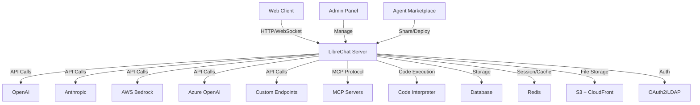

# LibreChat Reaches 41.6K Stars: What's Inside the Latest Build

LibreChat has reached 41,672 GitHub stars as of August 5, 2026, establishing itself as one of the most-watched self-hosted AI chat platforms. The project's latest main branch combines multi-provider LLM integration, no-code agent creation, Model Context Protocol (MCP) server support, and sandboxed code execution in a unified TypeScript codebase. With 664 open issues and 8,600 forks, the platform shows both active community engagement and the complexity of managing a feature-rich AI infrastructure layer.

This analysis examines the current state of LibreChat's main branch, documenting architectural choices inferred from the repository structure, deployment pathways, upgrade considerations, and the operational questions that self-hosting teams should answer before committing to production use.

---

## Table of Contents

- [What Changed in the Latest Build](#what-changed-in-the-latest-build)
- [Architecture and Component Overview](#architecture-and-component-overview)
- [Multi-Provider Integration and Endpoint Support](#multi-provider-integration-and-endpoint-support)
- [Agents, MCP, and Tool Execution](#agents-mcp-and-tool-execution)
- [Deployment Options and Infrastructure Requirements](#deployment-options-and-infrastructure-requirements)
- [Upgrade Risk Assessment and Migration Path](#upgrade-risk-assessment-and-migration-path)
- [Test Plan and Validation Checklist](#test-plan-and-validation-checklist)
- [Rollback Strategy and Data Safety](#rollback-strategy-and-data-safety)
- [Unanswered Questions and Known Gaps](#unanswered-questions-and-known-gaps)
- [Decision Checklist for Production Deployment](#decision-checklist-for-production-deployment)
- [Evidence, Assumptions, and Limitations](#evidence-assumptions-and-limitations)
- [Sources](#sources)
- [FAQ](#faq)

---

## What Changed in the Latest Build

LibreChat's [main branch](https://github.com/danny-avila/LibreChat) was last pushed on August 5, 2026, at 03:13:04 UTC. The repository does not publish versioned releases with semantic tags; instead, users deploy from the `main` branch or specific commit SHAs. The project documentation references a separate [changelog page](https://www.librechat.ai/changelog) that is not included in the repository README, and warns users to consult it for breaking changes before updating.

Key capabilities documented in the current README include:

- **Agent framework**: No-code assistant builder with support for skills (reusable instruction bundles), subagents (delegated child runs), and an agent marketplace for sharing.
- **Model Context Protocol (MCP) support**: Integration with MCP servers for tool execution, positioning LibreChat as an [official MCP client](https://modelcontextprotocol.io/clients#librechat).
- **Code Interpreter API**: Sandboxed execution in Python, Node.js, Go, C/C++, Java, PHP, Rust, and Fortran, powered by [ClickHouse/code-interpreter](https://github.com/ClickHouse/code-interpreter).
- **Resumable streams**: Auto-reconnect and resume for AI responses if connections drop, with multi-tab and multi-device sync via Redis.
- **Admin panel**: Browser-based UI for managing users, groups, roles, and live configuration overrides without redeployment.
- **Reasoning UI**: Dynamic interface for chain-of-thought models like DeepSeek-R1.
- **Generative UI with code artifacts**: In-chat creation of React, HTML, and Mermaid diagrams.

The repository description lists support for "DeepSeek, Anthropic, AWS, OpenAI, Responses API, Azure, Groq, o1, GPT-5, Mistral, OpenRouter, Vertex AI, Gemini, Artifacts" among others. Note that "GPT-5" appears in the description but does not correspond to a publicly available OpenAI model as of the data retrieval date.

> [!NOTE]
> LibreChat does not use semantic versioning or tagged releases. Teams deploying from `main` should record the commit SHA and verify changelog entries manually to identify breaking changes.

---

## Architecture and Component Overview

The repository structure indicates a TypeScript monorepo with client and server components. Based on the README and repository metadata, the inferred architecture includes:

| Component | Technology | Purpose |
|-----------|------------|----------|
| **Client** | React (inferred) | Web UI with chat interface, agent marketplace, admin panel |
| **Server** | Node.js (TypeScript) | API gateway, multi-provider orchestration, authentication |
| **Database** | Not specified in README | Stores conversations, user data, presets, agent definitions |
| **Cache / Session Store** | Redis (for resumable streams) | Manages multi-tab sync, resumable connections |
| **File Storage** | S3 + CloudFront (optional) | Media uploads, signed cookies, edge delivery |
| **Code Execution** | ClickHouse/code-interpreter | Sandboxed runtime for code interpreter features |
| **Authentication** | OAuth2, LDAP, Email | Multi-user access control |
| **Admin Panel** | Bundled UI | User, group, role, and config management |

> [!TIP]
> The README mentions Docker Compose stacks that bundle the admin panel for "one-command setup." Start with the Docker deployment path for initial evaluation before committing to Kubernetes or cloud-native orchestration.

---

## Multi-Provider Integration and Endpoint Support

LibreChat positions itself as a "unified" interface for multiple LLM providers. The README lists direct integrations and a "Custom Endpoints" feature that accepts any OpenAI-compatible API without requiring a proxy.

### Documented Provider Support

| Provider | Integration Method | Notes |
|----------|-------------------|-------|
| OpenAI | Direct API | Includes Responses API |
| Azure OpenAI | Direct API | Separate from standard OpenAI |
| Anthropic (Claude) | Direct API | Multi-model support |
| AWS Bedrock | Direct API | Regional deployment considerations |
| Google (Gemini) | Direct API | Includes Vertex AI |
| Vertex AI | Direct API | Listed separately from Gemini |
| Custom Endpoints | OpenAI-compatible API | No proxy required; configure via YAML |
| Groq | Custom endpoint (inferred) | Not explicitly categorized |
| Mistral AI | Custom endpoint (inferred) | Not explicitly categorized |
| OpenRouter | Custom endpoint (inferred) | Aggregator for multiple models |
| Deepseek | Custom endpoint (inferred) | Reasoning model support |
| Ollama | Local/remote custom endpoint | Self-hosted model serving |

The README references a [LibreChat YAML configuration](https://www.librechat.ai/docs/configuration/librechat_yaml/ai_endpoints) for defining custom endpoints. The documentation link is external and not included in this analysis.

> [!WARNING]
> The README mentions "GPT-5" and "o1" in the description. As of August 2026, OpenAI has not publicly released a model named GPT-5. Verify model availability and naming conventions with provider documentation before configuring endpoints.

---

## Agents, MCP, and Tool Execution

LibreChat's agent framework and MCP integration represent a significant architectural layer beyond basic chat interfaces.

### Agent Capabilities

- **No-code builder**: Create custom assistants without writing code.
- **Skills**: Reusable `SKILL.md` instruction files that can be applied manually, automatically, or always-on.
- **Subagents**: Delegate tasks to isolated child agent runs with separate context windows.
- **Agent marketplace**: Community-driven sharing and discovery.
- **Collaborative sharing**: Restrict agent access to specific users or groups.
- **Tool execution**: Integrates with MCP servers, file search, and code interpreter.

### Model Context Protocol (MCP) Integration

MCP is an open protocol for connecting AI systems to external data sources and tools. LibreChat is listed as an [official MCP client](https://modelcontextprotocol.io/clients#librechat). The README states that agents can use "MCP Servers" for tool execution but does not specify:

- How MCP servers are registered or discovered.
- Whether MCP server configuration is per-agent or global.
- Security boundaries for MCP tool execution.
- Rate limiting or cost controls for tool invocations.

### Code Interpreter API

The code interpreter feature uses [ClickHouse/code-interpreter](https://github.com/ClickHouse/code-interpreter) for sandboxed execution. Supported languages:

- Python
- Node.js (JavaScript/TypeScript)
- Go
- C/C++
- Java
- PHP
- Rust
- Fortran

The README emphasizes "secure, sandboxed execution" and "no privacy concerns" but does not document:

- Resource limits (CPU, memory, execution time).
- Network access policies within the sandbox.
- File system isolation details.
- Whether code execution logs are retained or auditable.

> [!NOTE]
> The code interpreter is "open-source & self-hostable," but teams must review the ClickHouse/code-interpreter repository separately to understand security boundaries, resource controls, and operational requirements.

---

## Deployment Options and Infrastructure Requirements

LibreChat supports multiple deployment pathways:

### Docker Compose

- **Bundled admin panel**: One-command setup for local or single-server deployments.
- **Environment configuration**: `.env` files for API keys and feature flags (inferred).
- **Redis included**: For resumable streams and multi-tab sync.

### Cloud Platforms

The README includes deployment buttons for:

- [Railway](https://railway.com/deploy/librechat-official?referralCode=HI9hWz&utm_medium=integration&utm_source=readme&utm_campaign=librechat)
- [Zeabur](https://zeabur.com/templates/0X2ZY8)
- [Sealos](https://template.cloud.sealos.io/deploy?templateName=librechat)

### Infrastructure Considerations

| Resource | Requirement | Notes |
|----------|-------------|-------|
| **Database** | Not specified | Likely PostgreSQL or MongoDB; check Docker Compose files |
| **Redis** | Required for resumable streams | Essential for multi-device sync |
| **S3 / Object Storage** | Optional | Recommended for stable media links and edge delivery |
| **Code Interpreter** | Self-hosted container | Additional compute and security boundaries |
| **Reverse Proxy** | Recommended | HTTPS termination, rate limiting |
| **Horizontal Scaling** | Supported (inferred) | README mentions "horizontally scaled deployments with Redis" |

The README states LibreChat works "from single-server setups to horizontally scaled deployments" but does not provide scaling documentation, load testing benchmarks, or database connection pooling guidance.

---

## Upgrade Risk Assessment and Migration Path

LibreChat warns users to "consult the changelog for breaking changes before updating." Since the repository does not include release tags, upgrade risk depends on:

1. **Commit history between current and target deployment**: Use `git log` to review changes.
2. **Database schema migrations**: Not documented in README; check for migration scripts in the repository.
3. **Configuration format changes**: YAML configuration may evolve; validate against updated schemas.
4. **Dependency updates**: Review `package.json` changes for breaking Node.js or TypeScript version requirements.

### Migration Checklist

- [ ] Record current commit SHA
- [ ] Review [external changelog](https://www.librechat.ai/changelog) for breaking changes
- [ ] Test upgrade in staging environment
- [ ] Backup database and user data
- [ ] Verify agent definitions and tool configurations
- [ ] Confirm MCP server compatibility
- [ ] Re-test authentication flows (OAuth2, LDAP)
- [ ] Validate resumable stream behavior after Redis upgrade

> [!WARNING]
> The project has 664 open issues. Before upgrading, search the issue tracker for keywords related to your deployment configuration (e.g., "Azure," "OAuth," "Redis") to identify known regressions or unresolved bugs.

---

## Test Plan and Validation Checklist

Before deploying LibreChat to production, execute the following test plan:

### Functional Testing

- [ ] **Multi-provider chat**: Send messages to OpenAI, Anthropic, Azure, and custom endpoints.
- [ ] **Agent creation**: Build a no-code agent with skills and verify tool execution.
- [ ] **MCP integration**: Register an MCP server and invoke a tool from a conversation.
- [ ] **Code interpreter**: Execute Python, Node.js, and Go code; validate sandboxing.
- [ ] **Resumable streams**: Disconnect network mid-response; verify auto-reconnect.
- [ ] **Multi-tab sync**: Open the same conversation in two browser tabs; verify message sync.
- [ ] **Image generation**: Test DALL-E, Stable Diffusion, or Flux integration.
- [ ] **File uploads**: Upload images and documents; verify multimodal processing.
- [ ] **Conversation export**: Export as markdown, JSON, and screenshot.
- [ ] **Search functionality**: Search across messages and conversations.

### Administrative Testing

- [ ] **User management**: Create, disable, and delete users via admin panel.
- [ ] **Group permissions**: Assign agents and prompts to specific groups.
- [ ] **Role-based access**: Configure role overrides and verify enforcement.
- [ ] **Live configuration**: Update endpoint settings without redeployment.
- [ ] **Audit logs**: Verify user activity and token spend tracking (if documented).

### Performance and Security Testing

- [ ] **Concurrent users**: Simulate 50+ concurrent chat sessions; monitor CPU and memory.
- [ ] **Rate limiting**: Configure and test API rate limits for external providers.
- [ ] **Authentication**: Test OAuth2 and LDAP login flows; verify session expiration.
- [ ] **S3 signed URLs**: Validate CloudFront signed cookies for file downloads.
- [ ] **Code execution isolation**: Attempt to break sandbox boundaries; verify resource limits.
- [ ] **HTTPS enforcement**: Confirm all endpoints use TLS in production.

---

## Rollback Strategy and Data Safety

Since LibreChat deploys from the main branch, rollback requires reverting to a previous commit SHA and restoring database state.

### Rollback Procedure

1. **Stop the application**: Halt Docker Compose or Kubernetes pods.
2. **Checkout previous commit**: `git checkout <previous-sha>`
3. **Restore database backup**: Use database-specific restore tools.
4. **Restart services**: Bring up containers with the reverted codebase.
5. **Verify agent and tool configurations**: Confirm no data loss in agent marketplace or MCP registrations.

### Data Backup Strategy

- **Database snapshots**: Automate daily backups before upgrades.
- **User-generated content**: Back up agent definitions, skills, and shared prompts separately.
- **Conversation history**: Export critical conversations as JSON before schema migrations.
- **S3 bucket versioning**: Enable object versioning for file uploads.

> [!TIP]
> Implement a "staging-first" deployment workflow. Deploy new commits to a staging environment, run the full test plan, and soak for 24–48 hours before promoting to production.

---

## Unanswered Questions and Known Gaps

The README and repository metadata leave several operational questions unanswered:

### Cost and Rate Limiting

- How are per-user or per-agent token limits configured?
- Does the admin panel support budget alerts or spend caps?
- How are costs tracked across multiple providers (OpenAI, Anthropic, AWS)?

### MCP and Tool Security

- What is the security model for MCP tool execution?
- Can agents invoke arbitrary HTTP endpoints via MCP?
- How are MCP server credentials managed?

### Code Interpreter Boundaries

- What are the default CPU and memory limits for code execution?
- Does the sandbox have network access?
- Are execution logs retained for audit purposes?

### Database and Schema

- Which database engine is recommended for production?
- Are schema migrations automated or manual?
- How is conversation branching and forking stored?

### Horizontal Scaling

- How is session affinity handled in multi-instance deployments?
- Does Redis require clustering for high availability?
- Are agent definitions replicated across instances?

### Compliance and Data Residency

- Does LibreChat support GDPR data export and deletion?
- Can administrators restrict data flow to specific geographic regions?
- Are audit logs sufficient for SOC 2 or ISO 27001 compliance?

---

## Decision Checklist for Production Deployment

Use this checklist to determine whether LibreChat is ready for your production use case:

- [ ] **Provider support**: All required LLM providers are documented and tested.
- [ ] **Authentication**: OAuth2, LDAP, or email login meets organizational policy.
- [ ] **Multi-tenancy**: User, group, and role isolation is sufficient for your security model.
- [ ] **Scalability**: You have validated horizontal scaling with Redis and load balancing.
- [ ] **Agent governance**: You can control which users create, share, and execute agents.
- [ ] **Cost controls**: Token spend tracking and budget limits are implemented or mitigated.
- [ ] **Code execution**: Sandbox security boundaries are acceptable for your risk profile.
- [ ] **Data retention**: Backup, export, and deletion workflows meet compliance requirements.
- [ ] **Upgrade path**: You can test and roll back commits without data loss.
- [ ] **Support model**: Community support via Discord and GitHub issues is adequate, or you have internal expertise.

---

## Evidence, Assumptions, and Limitations

### Evidence Used

- **Repository metadata**: Stars (41,672), forks (8,600), open issues (664), last push date (August 5, 2026).
- **README content**: Feature descriptions, deployment options, technology mentions.
- **External documentation links**: Changelog and configuration guides referenced but not analyzed.

### Architectural Inferences

- **TypeScript monorepo**: Inferred from `language: TypeScript` and client/server mention.
- **React client**: Inferred from feature descriptions ("UI inspired by ChatGPT").
- **Redis for resumable streams**: Explicitly stated in README.
- **Database type**: Not specified; inferred as PostgreSQL or MongoDB based on common Node.js stacks.

### Limitations

- **No versioned releases**: Cannot compare specific release notes or changelogs within the repository.
- **External documentation**: Configuration guides, admin panel usage, and MCP setup are documented outside the repository and not analyzed here.
- **No benchmarks**: README does not include performance data, latency measurements, or cost comparisons.
- **Issue tracker scope**: 664 open issues may include feature requests, bug reports, and support questions; not categorized here.

### Disclaimer on Model Names

The README description includes "GPT-5" and "o1." As of August 2026, OpenAI has not publicly released a model named "GPT-5." The "o1" family (e.g., o1-preview, o1-mini) exists. Verify model names with provider documentation before configuration.

---

## Sources

- [LibreChat canonical repository](https://github.com/danny-avila/LibreChat)

---

## FAQ

### What is LibreChat?

LibreChat is an open-source, self-hosted AI chat platform that integrates multiple LLM providers (OpenAI, Anthropic, AWS Bedrock, Azure, Google) into a unified interface. It adds agent creation, Model Context Protocol support, sandboxed code execution, and multi-user authentication on top of basic chat functionality.

### Does LibreChat use semantic versioning?

No. LibreChat deploys from the `main` branch without tagged releases. Users must track commit SHAs and consult the external changelog for breaking changes before upgrading.

### How do I deploy LibreChat?

The repository includes Docker Compose configurations for single-server deployments and one-click deployment options for Railway, Zeabur, and Sealos. For production, plan for a database (likely PostgreSQL or MongoDB), Redis for resumable streams, and optional S3 storage for file uploads.

### What is the Model Context Protocol (MCP) integration?

LibreChat is an official MCP client, allowing agents to invoke tools provided by MCP servers. The README does not detail how MCP servers are registered, secured, or rate-limited; refer to external documentation for implementation guidance.

### Is the code interpreter safe for production?

The code interpreter uses ClickHouse/code-interpreter for sandboxed execution in multiple languages. The README claims "no privacy concerns" and "fully isolated" execution, but does not document resource limits, network policies, or audit logging. Review the ClickHouse/code-interpreter repository and conduct penetration testing before enabling in production.

### How do I control costs across multiple LLM providers?

The README mentions "token spend tools" but does not specify how per-user or per-agent budgets are configured. Check the admin panel documentation and test spend tracking in staging before deploying to production.

### Can I migrate from ChatGPT to LibreChat?

Yes. LibreChat supports importing conversations from ChatGPT, Chatbot UI, and LibreChat itself. Test the import flow with a sample dataset to verify conversation history, message branching, and metadata preservation.

---

**Published:** February 4, 2026  
**Data Retrieved:** August 5, 2026  
**Repository:** [danny-avila/LibreChat](https://github.com/danny-avila/LibreChat)  
**License:** MIT
