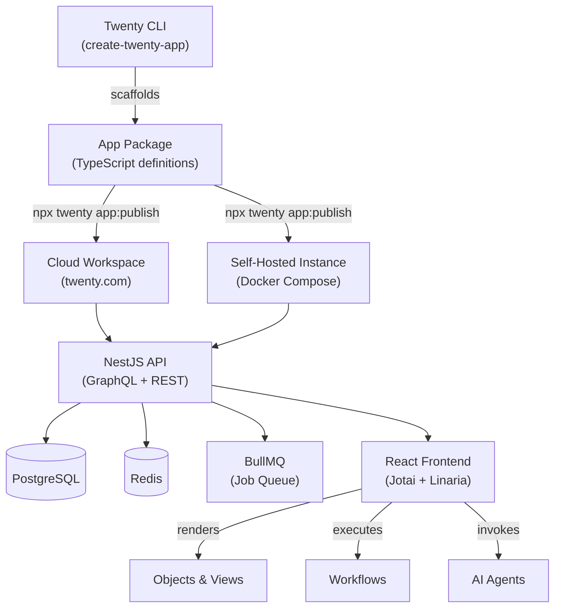

Twenty positions itself as "the open alternative to Salesforce, designed for AI"—a code-first CRM that technical teams define, version, and deploy as part of their application stack. Rather than configuring forms through a web UI, teams scaffold "apps" using a CLI, define objects and fields in TypeScript, and publish versioned packages to cloud or self-hosted workspaces. As of February 2026, the [Twenty repository](https://github.com/twentyhq/twenty) has attracted 54,286 stars, 8,349 forks, and 147 open issues, signaling strong developer interest in a programmable alternative to legacy SaaS CRM platforms.

This guide maps the Twenty ecosystem: the monorepo layout, app development primitives, extension patterns (objects, views, workflows, agents), deployment architectures (cloud, Docker Compose, local development), and integration considerations. We synthesize evidence from the official README, release notes (v2.27.0, published August 4, 2026), and repository metadata to help architects, engineering leaders, and technical founders evaluate fit, understand the stack, and navigate contribution or self-hosting workflows.


---

## Table of Contents

- [Repository profile and maintenance signals](#repository-profile-and-maintenance-signals)
- [Monorepo architecture and stack](#monorepo-architecture-and-stack)
- [App development model](#app-development-model)
- [Extension primitives](#extension-primitives)
- [Deployment and hosting options](#deployment-and-hosting-options)
- [Integration patterns and connection lifecycle](#integration-patterns-and-connection-lifecycle)
- [Licensing and contribution pathways](#licensing-and-contribution-pathways)
- [Decision checklist](#decision-checklist)
- [Evidence, assumptions, and limitations](#evidence-assumptions-and-limitations)
- [Sources](#sources)
- [Frequently Asked Questions](#frequently-asked-questions)

---

## Repository profile and maintenance signals

The [twentyhq/twenty](https://github.com/twentyhq/twenty) repository was created December 1, 2022, and received its most recent push on August 4, 2026. The default branch is `main`, and the project homepage links to [twenty.com](https://twenty.com). GitHub reports the primary language as TypeScript and lists 17 topics including `crm`, `crm-system`, `graphql`, `nestjs`, `postgresql`, `react`, and `monorepo`.

| Metric                | Value         | Interpretation                                                                 |
|-----------------------|---------------|-------------------------------------------------------------------------------|
| Stars                 | 54,286        | High interest signal; not a proxy for production usage                        |
| Forks                 | 8,349         | Significant downstream experimentation and potential contributions            |
| Watchers              | 214           | Core community tracking releases and discussions                              |
| Open issues           | 147           | Active issue tracker; not a defect count                                      |
| Latest release        | v2.27.0       | Published August 4, 2026; 77 PRs merged                                        |
| License               | NOASSERTION   | GitHub metadata returns no standard SPDX identifier; verify LICENSE file      |

> [!NOTE]
> The repository metadata field `license: NOASSERTION` indicates GitHub could not detect a standard SPDX license. Teams evaluating Twenty for commercial use should inspect the `LICENSE` file in the repository root and consult legal counsel before integration.

Release cadence inferred from the v2.27.0 tag (August 2026) and repository creation date (December 2022) suggests approximately 27 versioned releases over ~44 months, averaging roughly one minor release every 1.6 months. The latest release notes describe 77 pull requests spanning new features (5), improvements and UX enhancements (33), bug fixes (7), developer/API changes (2), and internal refactoring (5), indicating active, multi-faceted development.

---

## Monorepo architecture and stack

Twenty uses an [Nx](https://nx.dev/)-managed monorepo to house frontend, backend, CLI tools, and documentation in a single repository. Inferred from the README stack section and repository topics, the architecture comprises:

- **Frontend**: [React](https://reactjs.org/) with [Jotai](https://jotai.org/) for state management, [Linaria](https://linaria.dev/) for CSS-in-JS, and [Lingui](https://lingui.dev/) for internationalization  
- **Backend**: [NestJS](https://nestjs.com/) orchestrating [PostgreSQL](https://www.postgresql.org/) (primary data store), [Redis](https://redis.io/) (caching and sessions), and [BullMQ](https://bullmq.io/) (job queue)  
- **API layer**: GraphQL endpoint inferred from the `graphql` topic  
- **Build tooling**: Nx for task orchestration, dependency graph management, and incremental builds  
- **Language**: TypeScript throughout



> [!TIP]
> The monorepo structure centralizes frontend and backend in `packages/`. Contributors can run `nx graph` to visualize package dependencies and affected projects, accelerating local development and CI optimization.

---

## App development model

Twenty introduces a code-first paradigm for CRM customization. Instead of point-and-click configuration, teams:

1. **Scaffold** a new app: `npx create-twenty-app my-app`  
2. **Define objects and fields** as TypeScript modules using the `twenty-sdk/define` package  
3. **Publish** to a workspace: `npx twenty app:publish --private`

The README provides this illustrative snippet:

```ts
import { defineObject, FieldType } from 'twenty-sdk/define';

export default defineObject({
  nameSingular: 'deal',
  namePlural: 'deals',
  labelSingular: 'Deal',
  labelPlural: 'Deals',
  fields: [
    { name: 'name', label: 'Name', type: FieldType.TEXT },
    { name: 'amount', label: 'Amount', type: FieldType.CURRENCY },
    { name: 'closeDate', label: 'Close Date', type: FieldType.DATE_TIME },
  ],
});
```

This declarative schema is compiled into database migrations, GraphQL schema extensions, and UI components at publish time. The [app development guide](https://docs.twenty.com/developers/extend/apps/getting-started) (referenced in the README) details the full lifecycle, including views, agents, and logic functions.

### Version control and diffing

Release notes for v2.27.0 mention "Make page layout tab layoutMode diffable" ([#23596](https://github.com/twentyhq/twenty/pull/23596)), indicating that Twenty stores UI layout configuration as diff-friendly artifacts. The README emphasizes "version like the rest of your stack," suggesting schema and layout changes are committed to version control and promoted through CI/CD pipelines.


---

## Extension primitives

Twenty's extensibility surface comprises four core primitives:

| Primitive       | Purpose                                                      | Configuration surface                          |
|-----------------|--------------------------------------------------------------|------------------------------------------------|
| **Objects**     | Custom entities (e.g., `deal`, `project`, `ticket`)          | TypeScript schema via `defineObject`           |
| **Views**       | Tabular, Kanban, or calendar layouts                         | Index view fields, filters, sorts, groupings   |
| **Workflows**   | Multi-step automation (triggers, actions, conditionals)      | Workflow editor; variable pickers (v2.27.0)    |
| **Agents**      | AI-powered assistants with tool access                       | Role-based skills; LLM model catalog           |

### Objects and fields

Each object definition produces:

- A PostgreSQL table with typed columns  
- GraphQL queries and mutations (`findManyDeals`, `createOneDeal`, etc.)  
- UI components: list view, detail view, inline editors  
- Audit trail and permission rules inherited from workspace settings

Available field types (inferred from `FieldType` enum in the snippet) include `TEXT`, `CURRENCY`, `DATE_TIME`, and likely others such as `RELATION`, `SELECT`, `MULTI_SELECT`, `PHONE`, `EMAIL`.

### Views

Views control how object records are displayed. The v2.27.0 release includes a fix for "reload record board groups when view groups change" ([#23637](https://github.com/twentyhq/twenty/pull/23637)), indicating that Kanban board columns are dynamically bound to view group definitions. The "Fix calendar field picker state handling" ([#23595](https://github.com/twentyhq/twenty/pull/23595)) PR suggests calendar views require field selection for start/end timestamps.

### Workflows

The v2.27.0 feature "variable pickers for Search Records limit, offset and date filters" ([#23696](https://github.com/twentyhq/twenty/pull/23696)) demonstrates that workflows support:

- **Triggers**: Time-based, record-based, or webhook-driven  
- **Actions**: Search, create, update records; call external APIs  
- **Conditionals**: If/Else branching ("clear nextStepIds when converting a step to If/Else" per [#23714](https://github.com/twentyhq/twenty/pull/23714))  
- **Variables**: Dynamic inputs from prior steps

### Agents

The README and release notes reference AI agents with "role management tools" ([#23613](https://github.com/twentyhq/twenty/pull/23613)) and a "roles standard skill" ([#23636](https://github.com/twentyhq/twenty/pull/23636)). Agents appear to execute workflows, query records, and interact with users via a chat interface. The note "Use the fast model for the onboarding setup chat" ([#23586](https://github.com/twentyhq/twenty/pull/23586)) implies a catalog of LLM backends selectable by speed/cost trade-offs.

> [!WARNING]
> AI agent features are under active development. Production deployments should evaluate model accuracy, cost, and rate-limit behavior before exposing agents to end users or external data sources.

---

## Deployment and hosting options

Twenty offers three deployment pathways:

### 1. Cloud (twenty.com)

Managed SaaS hosted by Twenty HQ. Teams sign up at [twenty.com](https://twenty.com), create a workspace, and publish apps via the CLI targeting the cloud endpoint. The README describes this as "no infrastructure to manage and always up to date."

### 2. Self-hosting with Docker Compose

The [Docker Compose guide](https://docs.twenty.com/developers/self-host/capabilities/docker-compose) (linked in the README) provides orchestration for NestJS, PostgreSQL, Redis, and the frontend. This option suits teams requiring:

- Data residency compliance  
- Network isolation (VPC, private subnets)  
- Custom infrastructure hooks (observability, backup policies)  
- License or pricing flexibility

### 3. Local development setup

The [local setup guide](https://docs.twenty.com/developers/contribute/capabilities/local-setup) walks contributors through cloning the monorepo, installing dependencies, and running Nx tasks for incremental builds. This path is primarily for contributors, plugin authors, or teams evaluating extensive customization.

**Deployment comparison**

| Aspect                | Cloud (twenty.com)       | Docker Compose           | Local development        |
|-----------------------|--------------------------|--------------------------|---------------------------|
| Time to first app     | < 5 minutes              | ~30 minutes              | 1–2 hours (dependencies) |
| Infrastructure        | Managed                  | Self-managed             | Developer laptop         |
| Data sovereignty      | Twenty HQ (check ToS)    | Your infrastructure      | Local filesystem         |
| Upgrade cadence       | Automatic (v2.x stream)  | Manual pull + restart    | Git pull + Nx rebuild    |
| SSL/TLS               | Included                 | Requires cert provisioning| Not applicable           |
| Suitable for          | Rapid prototyping, MVPs  | Production, compliance   | Core contribution, R&D   |

---

## Integration patterns and connection lifecycle

Twenty's v2.27.0 release introduces an `onDisconnect` lifecycle hook for connection providers ([#23538](https://github.com/twentyhq/twenty/pull/23538)), suggesting a formal integration API. Additional evidence:

- **Slack integration**: "Implement channel welcome message functionality" ([#23699](https://github.com/twentyhq/twenty/pull/23699)) and "Update slack app naming" ([#23650](https://github.com/twentyhq/twenty/pull/23650))  
- **Microsoft integration**: Documentation updated per [#23671](https://github.com/twentyhq/twenty/pull/23671)  
- **Fireflies call sync**: "Harden Fireflies call synchronization lifecycle" ([#23610](https://github.com/twentyhq/twenty/pull/23610))  
- **Recall.ai**: "Classify Recall no-capture sub codes as NOT_RECORDED in call-recorder app" ([#23693](https://github.com/twentyhq/twenty/pull/23693))

### OAuth and webhook management

Release notes describe:

- **Per-user OAuth application authorizations** ([#23678](https://github.com/twentyhq/twenty/pull/23678))  
- **Webhook renewal filtering** to exclude failed authentication accounts ([#23694](https://github.com/twentyhq/twenty/pull/23694))  
- **Webhook subscription lifecycle metrics** ([#23710](https://github.com/twentyhq/twenty/pull/23710))  
- **Refresh error classification by reason** instead of HTTP status ([#23705](https://github.com/twentyhq/twenty/pull/23705))

This indicates Twenty maintains OAuth tokens per connected account, automatically renews webhook subscriptions, and provides observability into refresh failures.

### Integration checklist

- [ ] Identify external systems (email, calendar, messaging, telephony)  
- [ ] Review available connection providers in the workspace integrations panel  
- [ ] Implement `onDisconnect` hook if building a custom provider  
- [ ] Monitor webhook subscription health via Twenty's metrics (if self-hosting)  
- [ ] Test OAuth refresh flows under token expiry scenarios  
- [ ] Configure rate limits and throttling for outbound API calls

> [!TIP]
> The `onDisconnect` hook allows graceful cleanup when a user revokes an integration. Use it to delete orphaned records, cancel pending jobs, or log audit events for compliance workflows.

---

## Licensing and contribution pathways

GitHub's license field returns `NOASSERTION`, meaning no standard SPDX identifier was detected. The README does not quote a license inline. Teams must inspect the `LICENSE` file in the repository root before forking, self-hosting, or embedding Twenty code.

The README invites contributions via:

- [GitHub Discussions](https://github.com/twentyhq/twenty/discussions) for feature requests  
- [Discord](https://discord.gg/cx5n4Jzs57) for real-time community support  
- [Crowdin](https://twenty.crowdin.com/twenty) for translations  
- [GitHub Contribute page](https://github.com/twentyhq/twenty/contribute) for good-first-issue guidance

Twenty acknowledges [Greptile](https://greptile.com) (code review), [Sentry](https://sentry.io/) (error tracking), and [Crowdin](https://crowdin.com/) (localization) as service partners.

**Contribution pathways**

| Pathway           | Entry point                                                                 | Suitable for                          |
|-------------------|-----------------------------------------------------------------------------|---------------------------------------|
| Bug reports       | [GitHub Issues](https://github.com/twentyhq/twenty/issues)                  | Developers encountering defects       |
| Feature requests  | [GitHub Discussions](https://github.com/twentyhq/twenty/discussions)        | Users proposing enhancements          |
| Code contributions| `good-first-issue` label; Hacktoberfest participation                       | Open-source contributors              |
| Translations      | [Crowdin project](https://twenty.crowdin.com/twenty)                        | Multilingual community members        |
| Real-time help    | [Discord](https://discord.gg/cx5n4Jzs57)                                    | Teams troubleshooting or onboarding   |

---

## Decision checklist

Use this checklist to determine whether Twenty fits your organization's CRM requirements:

- [ ] **Team skill set**: Does your team have TypeScript and React expertise?  
- [ ] **Customization depth**: Do you need object schemas, workflows, or UI layouts under version control?  
- [ ] **AI requirements**: Are AI agents with LLM integration a core use case?  
- [ ] **Deployment preference**: Cloud SaaS acceptable, or must you self-host for compliance?  
- [ ] **Integration landscape**: Are Slack, Microsoft, Fireflies, or Recall.ai connectors sufficient, or do you need custom OAuth providers?  
- [ ] **License clarity**: Have you reviewed the repository LICENSE file and obtained legal clearance?  
- [ ] **Community support**: Are you comfortable relying on Discord and GitHub Discussions for troubleshooting?  
- [ ] **Release cadence**: Can your team absorb monthly minor releases, or do you require LTS guarantees?  
- [ ] **Data model complexity**: Do you have 10+ custom objects with multi-level relationships?  
- [ ] **Security posture**: Can you manage OAuth token lifecycles, webhook subscriptions, and TOTP tolerance windows?

---

## Evidence, assumptions, and limitations

### What we know

- **Repository metadata**: 54,286 stars, 8,349 forks, 147 open issues as of August 5, 2026  
- **Stack**: TypeScript, Nx, NestJS, PostgreSQL, Redis, React, GraphQL  
- **Latest release**: v2.27.0 published August 4, 2026; 77 PRs merged  
- **Deployment options**: Cloud (twenty.com), Docker Compose, local development  
- **Extension primitives**: Objects, views, workflows, agents (AI-powered)  
- **Integrations**: Slack, Microsoft, Fireflies, Recall.ai confirmed via release notes  
- **Lifecycle hooks**: `onDisconnect` for connection providers (v2.27.0)  
- **OAuth management**: Per-user authorizations, automatic webhook renewal, refresh error classification

### What we inferred

- **License**: `NOASSERTION` in GitHub metadata implies a non-standard or missing SPDX identifier; manual LICENSE file inspection required  
- **Monorepo packages**: Likely split into `packages/twenty-front`, `packages/twenty-server`, `packages/twenty-cli` based on typical Nx conventions  
- **GraphQL schema generation**: TypeScript object definitions compile to GraphQL types and database migrations at publish time  
- **AI agent architecture**: Agents appear to execute workflows and query records via a chat interface, with selectable LLM backends

### Limitations

- **No benchmark data**: No performance metrics (queries/sec, latency, concurrency) provided  
- **No adoption statistics**: Star count is an interest signal, not a production usage metric  
- **No vulnerability disclosure**: No CVEs or security advisories included in editorial data  
- **No compatibility matrix**: PostgreSQL and Node.js version requirements not specified in README excerpt  
- **License ambiguity**: Cannot confirm OSI-approved open-source status without inspecting LICENSE file  
- **Plugin ecosystem size**: No count of third-party apps or community-maintained connectors

> [!NOTE]
> This guide synthesizes public repository data and release notes. For production deployment, consult the [official documentation](https://docs.twenty.com), LICENSE file, and Twenty support channels for up-to-date configuration, security, and compliance guidance.

---

## Sources

- [Twenty canonical repository](https://github.com/twentyhq/twenty)  
- [Twenty latest GitHub release](https://github.com/twentyhq/twenty/releases/tag/twenty/v2.27.0)

---

## Frequently Asked Questions

### What is Twenty and how does it differ from traditional CRMs?

Twenty is an open-source CRM that treats customization as code. Instead of configuring entities through a web UI, teams define objects, fields, and workflows in TypeScript, version them in Git, and publish to cloud or self-hosted workspaces. This code-first approach suits technical teams requiring deep customization, CI/CD integration, and audit trails for schema changes.

### Can I self-host Twenty on my own infrastructure?

Yes. Twenty provides a [Docker Compose configuration](https://docs.twenty.com/developers/self-host/capabilities/docker-compose) for running NestJS, PostgreSQL, Redis, and the React frontend on private infrastructure. Self-hosting is appropriate for teams with data residency requirements, compliance mandates, or custom observability needs.

### What programming languages and frameworks does Twenty use?

Twenty's monorepo is TypeScript throughout. The backend uses NestJS (Node.js framework), PostgreSQL (relational database), Redis (caching), and BullMQ (job queue). The frontend is React with Jotai for state management and Linaria for CSS-in-JS. The build system is Nx for monorepo orchestration.

### How do integrations work with Slack, Microsoft, and other platforms?

Twenty implements OAuth-based connection providers with lifecycle hooks (including `onDisconnect` as of v2.27.0). Integrations with Slack, Microsoft, Fireflies, and Recall.ai are confirmed in release notes. Teams can build custom providers by implementing the connection provider interface and publishing them as apps.

### What license does Twenty use?

GitHub's metadata reports `NOASSERTION`, meaning no standard SPDX license identifier was detected. Teams evaluating Twenty for commercial use must inspect the `LICENSE` file in the [repository root](https://github.com/twentyhq/twenty) and consult legal counsel before deployment or redistribution.

### How stable is Twenty for production use?

Twenty reached v2.27.0 in August 2026, indicating over two years of active development and approximately 27 minor releases. The repository shows consistent commit activity (last push August 4, 2026) and an engaged community (54,286 stars, 8,349 forks). However, production readiness depends on your specific workload, required integrations, and tolerance for monthly minor releases. Evaluate the issue tracker and release notes for breaking changes.

### Can I extend Twenty with custom AI agents or workflows?

Yes. Twenty provides workflow primitives (triggers, actions, conditionals, variables) and AI agents with role-based skills. The v2.27.0 release added variable pickers for workflow steps and role management tools for agents. Agents can invoke workflows, query objects, and interact via chat interfaces. Custom logic is defined in TypeScript and published as part of app packages.
