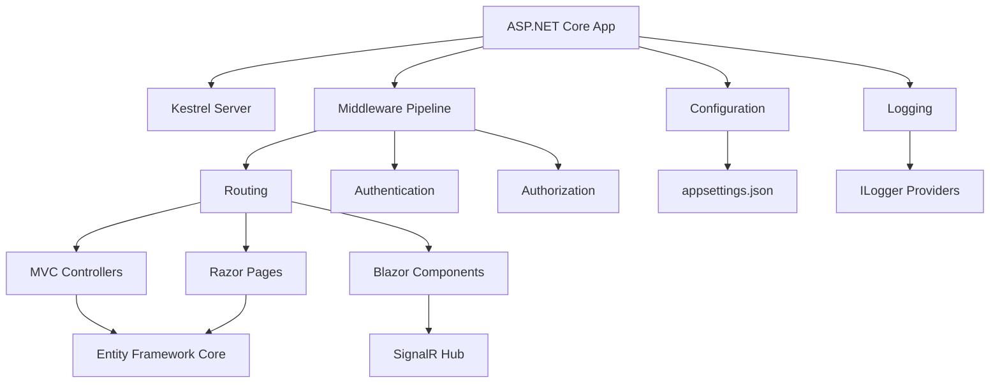

# ASP.NET Core Ecosystem Guide: Architecture & Packages


The [ASP.NET Core ecosystem](https://github.com/dotnet/aspnetcore) centers on a single canonical repository maintained by the .NET team at Microsoft. Unlike fragmented ecosystems, ASP.NET Core delivers a cohesive, modular framework through NuGet packages that span web APIs, server-side rendering, real-time communication, and gRPC services. The repository contains 38,354 stars and 10,915 forks as of August 2026, reflecting sustained developer interest. The framework is MIT-licensed and runs cross-platform on Windows, macOS, and Linux through the .NET runtime.

This guide maps the core repository structure, classifies first-party and community package categories, explains integration patterns with Entity Framework Core and Razor, and provides a practical workflow for evaluating extensions. We focus on architectural signals inferred from repository organization, release cadence, and documented dependencies—avoiding unverified adoption claims or speculative performance comparisons.

## Table of Contents

- [Core Repository Structure](#core-repository-structure)
- [First-Party Package Categories](#first-party-package-categories)
- [Integration Patterns](#integration-patterns)
- [Community Extension Landscape](#community-extension-landscape)
- [Evaluation Criteria for Packages](#evaluation-criteria-for-packages)
- [Maintenance and Release Signals](#maintenance-and-release-signals)
- [Discovery Workflow](#discovery-workflow)
- [Decision Checklist](#decision-checklist)
- [Evidence, Assumptions, and Limitations](#evidence-assumptions-and-limitations)
- [Frequently Asked Questions](#frequently-asked-questions)
- [Sources](#sources)

---

## Core Repository Structure

The [dotnet/aspnetcore repository](https://github.com/dotnet/aspnetcore) is the canonical source for ASP.NET Core framework components. Created in March 2014 and actively maintained through August 2026, it contains:

- **Modular runtime components**: Kestrel web server, middleware pipeline, dependency injection, configuration, logging
- **High-level frameworks**: MVC, Razor Pages, Blazor (server and WebAssembly hosting)
- **Real-time and RPC**: SignalR for WebSocket-based communication, gRPC for contract-first APIs
- **Authentication and authorization**: Cookie, JWT bearer, OAuth 2.0, OpenID Connect middleware
- **Cross-cutting infrastructure**: Health checks, response caching, rate limiting, output caching

Based on the repository structure (as visible in the `/src` directory organization), ASP.NET Core separates concerns into distinct projects:

1. **Hosting and servers**: `Microsoft.AspNetCore.Server.Kestrel`, HTTP.sys (Windows-only)
2. **Middleware primitives**: `Microsoft.AspNetCore.Http`, routing, endpoint metadata
3. **Application frameworks**: `Microsoft.AspNetCore.Mvc`, `Microsoft.AspNetCore.Components` (Blazor)
4. **Protocol implementations**: `Microsoft.AspNetCore.SignalR`, `Grpc.AspNetCore`

The repository includes submodules for external dependencies like Google Test (for native code testing) and coordinates with the [dotnet/runtime](https://github.com/dotnet/runtime) and [dotnet/razor](https://github.com/dotnet/razor) repositories. The `/eng` directory contains build infrastructure, and `/docs` provides contributor documentation.

> [!NOTE]
> The repository has 4,006 open issues as of August 2026. Open-issue counts reflect backlog volume and triage priorities, not defect density. The team labels issues with `help wanted` and `good first issue` tags to guide community contributions.

---

## First-Party Package Categories

ASP.NET Core distributes as NuGet packages. The framework installs via the .NET SDK, which includes a shared framework runtime. Developers reference packages explicitly only when using optional features or targeting specific APIs.

### Runtime and Hosting

| Package | Purpose | Bundled in SDK |
|---------|---------|----------------|
| `Microsoft.AspNetCore.App` | Metapackage referencing all core components | Yes (shared framework) |
| `Microsoft.AspNetCore.Server.Kestrel` | Cross-platform HTTP server | Yes |
| `Microsoft.AspNetCore.Server.HttpSys` | Windows HTTP stack integration | Yes |
| `Microsoft.AspNetCore.Hosting` | Application startup and lifecycle | Yes |

### Application Frameworks

| Package | Purpose | Bundled in SDK |
|---------|---------|----------------|
| `Microsoft.AspNetCore.Mvc` | MVC and Web API controllers | Yes |
| `Microsoft.AspNetCore.Mvc.Razor.RuntimeCompilation` | Hot reload for Razor views | No (opt-in) |
| `Microsoft.AspNetCore.Components` | Blazor component model | Yes |
| `Microsoft.AspNetCore.Components.WebAssembly` | Blazor WebAssembly hosting | No (separate runtime) |

### Real-Time and RPC

- `Microsoft.AspNetCore.SignalR.Client` and `.Core`: WebSocket-based bidirectional communication
- `Grpc.AspNetCore`: gRPC server implementation over HTTP/2
- `Grpc.AspNetCore.Server.Reflection`: Service reflection for gRPC tooling

### Authentication and Security

- `Microsoft.AspNetCore.Authentication.JwtBearer`: JWT validation middleware
- `Microsoft.AspNetCore.Authentication.OpenIdConnect`: OIDC client flow
- `Microsoft.AspNetCore.Authentication.Certificate`: Client certificate authentication
- `Microsoft.AspNetCore.DataProtection`: Key management and encryption for cookies and tokens


---

## Integration Patterns

ASP.NET Core integrates tightly with companion Microsoft projects and third-party libraries through standardized extension points.

### Entity Framework Core

The [dotnet/efcore repository](https://github.com/dotnet/efcore) provides ORM and database abstraction. Integration occurs via:

- **Service registration**: `services.AddDbContext<MyContext>()` in `Program.cs`
- **Dependency injection**: Controllers and Razor Pages receive `DbContext` instances via constructor injection
- **Middleware coordination**: EF Core uses the same `ILogger` and `IConfiguration` abstractions

EF Core migrations run independently of ASP.NET Core but share connection strings from `appsettings.json`. The `Microsoft.EntityFrameworkCore.Design` package enables design-time tooling.

### Razor Compilation

The [dotnet/razor repository](https://github.com/dotnet/razor) hosts the Razor compiler and Language Server Protocol support. ASP.NET Core consumes Razor via:

- **View compilation**: `.cshtml` files compile to C# classes at build time or runtime
- **Tag Helpers**: Custom HTML elements backed by C# code (e.g., `<form asp-action="Create">`)
- **Blazor components**: `.razor` files use the same compiler with component-specific semantics

Razor runtime compilation (`Microsoft.AspNetCore.Mvc.Razor.RuntimeCompilation`) watches file changes during development, trading startup performance for iteration speed.

### Identity Framework

The `Microsoft.AspNetCore.Identity` packages provide user management, password hashing, and two-factor authentication. Identity integrates with:

- EF Core for user storage (via `IdentityDbContext`)
- Cookie authentication middleware for session management
- External providers (Google, Microsoft, Facebook) through OAuth 2.0 middleware



---

## Community Extension Landscape

The ASP.NET Core ecosystem includes community-maintained packages that extend the framework. We classify these by function but do not recommend specific implementations due to the absence of verified adoption or maintenance data.

### API Documentation and Specification

- **OpenAPI/Swagger**: Tools generate interactive API documentation from controller metadata. The framework added minimal API support in .NET 6+.
- **Versioning**: Libraries manage API version negotiation via headers, query strings, or URL paths.

### Validation and Serialization

- **FluentValidation**: Alternative to Data Annotations for complex validation rules
- **JSON handling**: `System.Text.Json` ships with ASP.NET Core; some projects use Newtonsoft.Json for compatibility

### Health and Observability

- **Metrics and tracing**: The framework supports OpenTelemetry via `System.Diagnostics` APIs. Extensions export to Prometheus, Jaeger, or Application Insights.
- **Health checks**: `Microsoft.Extensions.Diagnostics.HealthChecks` is first-party; community packages add database-specific checks.

### Background Processing

- **Hosted services**: `IHostedService` and `BackgroundService` base classes enable long-running tasks
- **Job scheduling**: Third-party libraries add cron-like scheduling atop hosted services

> [!TIP]
> When evaluating community packages, prioritize libraries that extend framework abstractions (`ILogger`, `IConfiguration`, `IServiceCollection`) rather than replacing core components. This preserves compatibility with future ASP.NET Core releases.

---

## Evaluation Criteria for Packages

Choosing between first-party and community packages requires assessing compatibility, support, and architectural fit.

### Licensing and Governance

The core framework is MIT-licensed and governed by the [.NET Foundation](https://www.dotnetfoundation.org/). Community packages vary:

- **Permissive licenses** (MIT, Apache 2.0): Allow commercial use without disclosure
- **Copyleft licenses** (GPL, AGPL): May require source disclosure if modified
- **Dual licensing**: Some projects offer commercial licenses for proprietary use

Verify license compatibility with your product before integration.

### API Stability

ASP.NET Core follows semantic versioning:

- **Major versions** (e.g., 6.0 → 7.0): May introduce breaking changes; aligned with .NET runtime releases
- **Minor updates**: Add features without breaking compatibility
- **Patch releases**: Security fixes and bug corrections (e.g., v8.0.29 released July 2026)

Community packages may not follow the same cadence. Check if the package targets a specific ASP.NET Core version or uses feature detection.

### Dependency Surface

Minimize transitive dependencies to reduce supply-chain risk:

1. **Direct dependencies**: Packages the project explicitly references
2. **Transitive dependencies**: Packages pulled in by direct dependencies
3. **Diamond dependencies**: Multiple packages depend on different versions of the same library

Use `dotnet list package --include-transitive` to audit dependency trees.

> [!WARNING]
> The `Microsoft.AspNetCore.All` metapackage was deprecated in .NET Core 3.0. Use `Microsoft.AspNetCore.App` (framework reference) or reference individual packages to reduce deployment size.

---

## Maintenance and Release Signals

The canonical repository provides several indicators of project health and release cadence.

### Release Schedule

Microsoft publishes ASP.NET Core releases aligned with .NET runtime versions:

- **Long-Term Support (LTS)**: Supported for three years (e.g., .NET 8 until November 2026)
- **Standard Term Support (STS)**: Supported for 18 months
- **Nightly builds**: Available via [documented links](https://github.com/dotnet/aspnetcore) for testing pre-release features

The latest tagged release as of July 2026 is **v8.0.29**, which includes dependency updates and a security fix for cookie authentication return URL validation.

### Contribution Activity

The repository shows:

- **Last push**: August 5, 2026 (recent activity)
- **Topics**: `aspnetcore`, `dotnet`, `hacktoberfest`, `help-wanted` (signals openness to contributions)
- **Default branch**: `main` (follows modern Git conventions)

The project holds [Community Standups](https://live.asp.net) streamed weekly on YouTube and publishes a [public roadmap](https://aka.ms/aspnet/roadmap).

### Security Posture

The repository includes:

- **SECURITY.md**: Instructions for privately reporting vulnerabilities to Microsoft Security Response Center (MSRC)
- **Bounty program**: [Microsoft .NET Bounty Program](https://www.microsoft.com/msrc/bounty-dot-net-core) rewards responsible disclosure
- **CVE response**: Patch releases include security fixes; release notes link to [dotnet/core releases](https://github.com/dotnet/core/releases)

For community packages, verify the presence of security policies and recent patch history.

---

## Discovery Workflow

Finding and vetting ASP.NET Core packages requires systematic research across multiple sources.

### Step 1: Identify Requirements

Clarify the problem before searching:

- **Use case**: API development, server-side rendering, real-time communication, static site generation
- **Constraints**: Platform (Windows/Linux/macOS), deployment target (cloud, on-premises, edge)
- **Non-functional**: Performance, scalability, compliance (GDPR, HIPAA)

### Step 2: Check Official Documentation

The [Microsoft Learn documentation](https://learn.microsoft.com/aspnet/core/) covers first-party packages and design patterns. Look for:

- **Architecture guides**: Best practices for layering, dependency injection, configuration
- **API reference**: Detailed signatures and usage examples
- **Migration guides**: Upgrade paths between major versions

### Step 3: Search Package Repositories

- **NuGet.org**: Filter by .NET version, download count, and last update date
- **GitHub topic search**: Use `topic:aspnetcore` to find related repositories
- **Awesome lists**: Community-curated lists (external to this guide) often highlight popular libraries

### Step 4: Assess Package Health

For each candidate package:

| Criterion | Where to Check | Red Flags |
|-----------|----------------|----------|
| License | Repository root or NuGet page | Missing, restrictive, or unclear license |
| Last update | GitHub commits, NuGet publish date | No activity in 12+ months |
| Issue response | GitHub issues tab | Unanswered issues, dismissive maintainer tone |
| Documentation | README, wiki, linked docs | Sparse examples, undocumented breaking changes |
| Dependencies | `.csproj` or NuGet dependency graph | Large transitive tree, outdated dependencies |
| Test coverage | `/test` directory, CI badges | Absent or failing tests |

### Step 5: Prototype Integration

Create a minimal test project:

```bash
dotnet new web -n PackageEval
cd PackageEval
dotnet add package <CandidatePackage>
```

Validate:

- **Compilation**: No version conflicts or missing dependencies
- **Runtime behavior**: Expected functionality under typical load
- **Observability**: Logs and metrics integrate with existing monitoring

> [!NOTE]
> Nightly builds of ASP.NET Core are available for testing upcoming features. The repository README includes platform-specific download links (Windows x64/x86/arm64, macOS x64/arm64, Linux distributions). These builds are unsupported and intended for preview purposes only.

---

## Decision Checklist

Use this checklist when adopting a new package or framework component:

- [ ] **Licensing**: License is compatible with product requirements
- [ ] **Maintenance**: Package updated within the past six months or aligns with ASP.NET Core release cycle
- [ ] **Documentation**: README includes setup instructions, API examples, and migration notes
- [ ] **Dependencies**: Dependency tree is shallow and uses compatible versions
- [ ] **Community**: GitHub issues show active maintainer engagement
- [ ] **Security**: Repository includes SECURITY.md or a vulnerability disclosure process
- [ ] **Testing**: Test project validates integration with your tech stack
- [ ] **Support**: Commercial support available if required (first-party or paid maintainer)
- [ ] **Exit strategy**: Can replace the package without rewriting core logic

---

## Evidence, Assumptions, and Limitations

### Evidence Base

This guide relies on:

- Repository metadata from [dotnet/aspnetcore](https://github.com/dotnet/aspnetcore) retrieved August 5, 2026
- Release notes for [v8.0.29](https://github.com/dotnet/aspnetcore/releases/tag/v8.0.29) published July 14, 2026
- README content and repository structure observed at retrieval time

### Architectural Inferences

Conclusions about modularity and integration patterns are inferred from:

- Repository directory layout (`/src` subprojects)
- NuGet package naming conventions (e.g., `Microsoft.AspNetCore.Mvc.*` for MVC extensions)
- Documented dependencies in the README (links to EF Core, Razor, Runtime repositories)

These inferences reflect observable structure, not proprietary design documentation.

### Limitations

This guide does **not** provide:

- **Performance benchmarks**: No quantitative latency or throughput data
- **Adoption metrics**: GitHub stars measure interest, not production usage
- **Compatibility matrices**: Version-specific breaking changes require consulting [migration guides](https://learn.microsoft.com/aspnet/core/migration/)
- **Package recommendations**: Community packages are categorized but not endorsed

### Data Freshness

Repository statistics and release information reflect data retrieved August 5, 2026. Verify current state before making architectural decisions.

---

## Frequently Asked Questions

### What is the difference between ASP.NET Core and ASP.NET Framework?

ASP.NET Core is a cross-platform rewrite released in 2016, running on Windows, macOS, and Linux via the .NET runtime. ASP.NET Framework is Windows-only and ships with the .NET Framework. ASP.NET Core is modular, cloud-optimized, and actively developed; ASP.NET Framework receives only security updates.

### How do I choose between MVC, Razor Pages, and Blazor?

MVC suits projects with complex routing and rich client-side JavaScript. Razor Pages simplifies page-focused scenarios with less boilerplate. Blazor enables C# on the client (WebAssembly) or server (SignalR), reducing JavaScript surface. Choose based on team skills and client interactivity needs.

### What does the 4,006 open issue count indicate?

Open issues include feature requests, documentation improvements, and backlog items, not just defects. The team triages issues with labels like `area-*` and `severity-*`. A large open count in a heavily used project reflects active community engagement rather than poor quality.

### Are nightly builds safe for production?

No. Nightly builds test in-progress features and may introduce breaking changes or bugs. Use stable releases (e.g., 8.0.x) for production. Nightly builds help validate upcoming changes before release candidate (RC) stages.

### How does ASP.NET Core handle breaking changes between major versions?

Microsoft publishes [breaking change announcements](https://learn.microsoft.com/aspnet/core/migration/) for each major release. The framework uses `[Obsolete]` attributes to warn before removal. Long-Term Support (LTS) versions receive backports to minimize upgrade pressure.

### Can I use ASP.NET Core without Entity Framework Core?

Yes. EF Core is optional. Use ADO.NET, Dapper, or other ORMs by registering services via `IServiceCollection.AddSingleton` or `AddScoped`. ASP.NET Core's dependency injection supports any data access library.

### What is the ASP.NET Core shared framework?

The shared framework (`Microsoft.AspNetCore.App`) is a set of assemblies installed with the .NET SDK. Applications reference it implicitly via `<FrameworkReference>` in `.csproj` files. This reduces deployment size and ensures consistency across apps on the same host.

---

## Sources

- [ASP.NET Core canonical repository](https://github.com/dotnet/aspnetcore)
- [ASP.NET Core latest GitHub release](https://github.com/dotnet/aspnetcore/releases/tag/v8.0.29)
