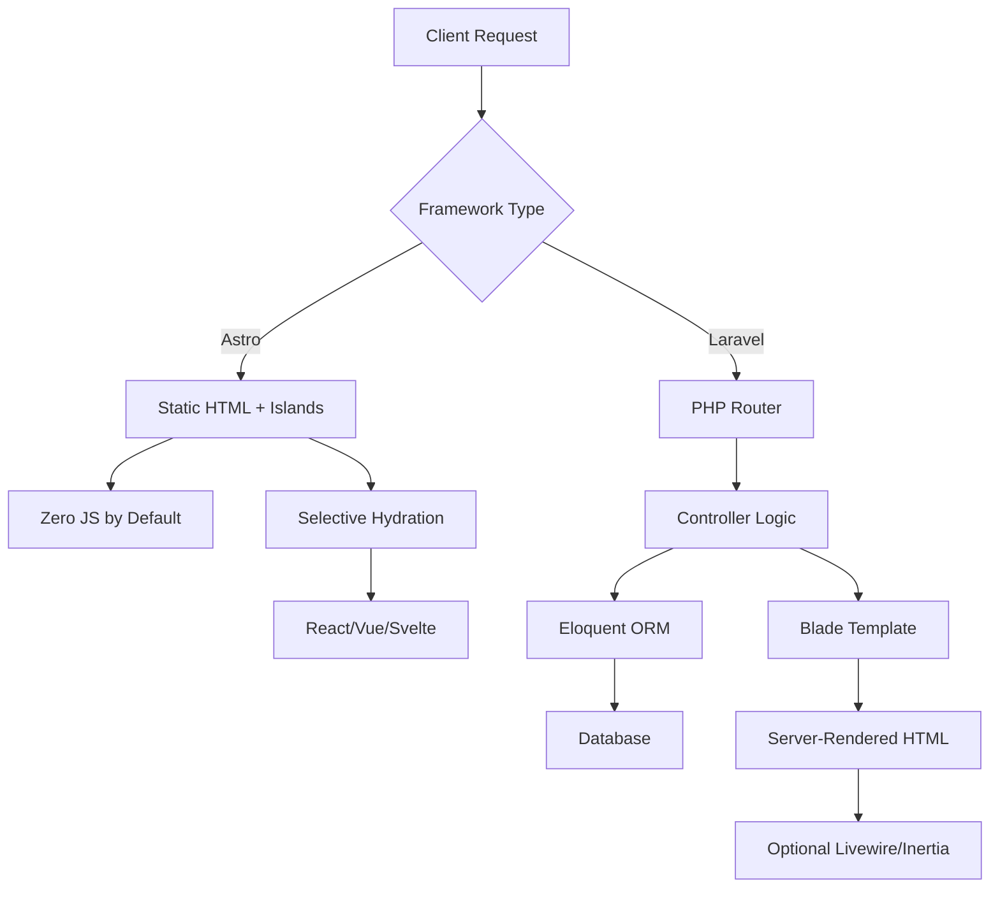
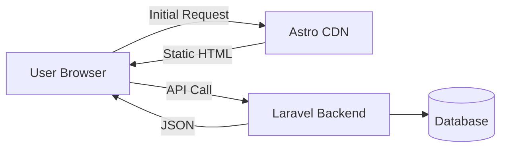

Astro and Laravel operate in different architectural universes. [Astro](https://github.com/withastro/astro) (61,547 GitHub stars as of August 2026) is a TypeScript-based build tool optimized for content-driven websites, shipping zero JavaScript by default and supporting partial hydration through its islands architecture. [Laravel](https://github.com/laravel/framework) (34,846 stars) is a mature PHP framework designed for full-stack web applications with expressive syntax, robust ORM, authentication scaffolding, and real-time capabilities. Comparing them requires understanding not just features but architectural intent: Astro prioritizes static output and content workflows, while Laravel excels at database-driven, interactive applications with server-side logic.

This comparison helps you choose based on workload characteristics, team composition, hosting constraints, and migration paths. Neither is universally superior—each dominates specific problem domains.

## Table of Contents

- [Core Architecture and Philosophy](#core-architecture-and-philosophy)
- [Repository and Ecosystem Health](#repository-and-ecosystem-health)
- [Decision Matrix: Key Differentiators](#decision-matrix-key-differentiators)
- [Workload Fit Analysis](#workload-fit-analysis)
- [Integration and Deployment Considerations](#integration-and-deployment-considerations)
- [Migration and Transition Pathways](#migration-and-transition-pathways)
- [Decision Checklist](#decision-checklist)
- [Evidence, Assumptions, and Limitations](#evidence-assumptions-and-limitations)
- [Frequently Asked Questions](#frequently-asked-questions)
- [Sources](#sources)

## Core Architecture and Philosophy

**Astro's content-first model** assumes the majority of your site is static or changes infrequently. It builds HTML at compile time, then selectively hydrates interactive components (React, Vue, Svelte, Solid, Preact) only where needed—the "islands" pattern. The [repository topics](https://github.com/withastro/astro) include "static-site-generator," "hybrid," "islands," and "universal," reflecting support for both pure static and server-side rendering (SSR) modes. The monorepo structure includes integrations for Node, Vercel, Cloudflare, Netlify, and various UI frameworks, indicating a platform-agnostic deployment model.

**Laravel's full-stack approach** provides routing, controllers, Eloquent ORM, Blade templating, middleware, queues, and event broadcasting out of the box. The [framework repository](https://github.com/laravel/framework) contains the core code; application scaffolding lives in the separate `laravel/laravel` repo. Laravel's architecture centers on server-side PHP execution with built-in session management, database migrations, and dependency injection, making it suitable for interactive applications where state and permissions matter.

> [!NOTE]
> Astro can render server-side per request using adapters (Node, Vercel, Cloudflare Workers), but its optimization focus remains static-first. Laravel can serve static output via caching or separate static site generators (Jigsaw), but this is not its primary use case.

**Language and runtime:** Astro runs on Node.js (TypeScript/JavaScript), while Laravel requires PHP 8.1+ (version 13.x branch). This affects hosting, tooling, and the talent pool.

## Repository and Ecosystem Health

| Metric | Astro (withastro/astro) | Laravel (laravel/framework) |
|--------|------------------------|-----------------------------|
| **Stars** | 61,547 | 34,846 |
| **Forks** | 3,682 | 11,939 |
| **Open Issues** | 113 | 97 |
| **Primary Language** | TypeScript | PHP |
| **License** | NOASSERTION (MIT in practice) | MIT |
| **Created** | March 2021 | January 2013 |
| **Last Push** | August 5, 2026 | August 5, 2026 |
| **Latest Release** | @astrojs/cloudflare@14.1.7 (July 29, 2026) | v13.24.0 (August 4, 2026) |

**Astro** is a younger project (established 2021) with rapid GitHub star growth, reflecting strong community interest in modern static/hybrid architectures. The 113 open issues and active push cadence (daily commits) indicate ongoing development. The monorepo contains 20+ official integrations, including framework adapters, deployment targets, and tooling (language server, VS Code extension, TypeScript plugin).

**Laravel** has 13 years of production history, with a larger fork count (11,939 vs. 3,682) suggesting broader enterprise adoption and customization. The 97 open issues relative to project maturity and feature surface area are reasonable. The latest release (v13.24.0, August 4, 2026) includes performance optimizations, validation improvements, and image processing features, demonstrating continuous investment in developer experience.

> [!TIP]
> GitHub stars signal interest but not necessarily production usage. Laravel's lower star count reflects its 2013 origin predating the "star everything" culture, plus PHP's enterprise adoption patterns (where internal forks dominate). Astro's stars reflect front-end JavaScript community enthusiasm.

**Ecosystem breadth:** Laravel's Packagist ecosystem includes thousands of community packages for payments, CMS functionality, admin panels (Filament, Nova), and API integrations. Astro's npm ecosystem is smaller but growing, with official integrations covering major UI frameworks and deployment platforms.

## Decision Matrix: Key Differentiators

| Dimension | Astro | Laravel |
|-----------|-------|----------|
| **Primary Use Case** | Content-heavy sites, docs, blogs, marketing | Database-driven apps, SaaS, dashboards, APIs |
| **Output Model** | Static HTML + optional SSR | Server-rendered per request |
| **JavaScript Footprint** | Zero by default, opt-in islands | Framework-agnostic (Livewire, Inertia, or custom) |
| **Backend Logic** | Requires external API or SSR adapter | Full server-side capabilities (auth, sessions, queues) |
| **Database Integration** | Via external services or SSR endpoints | Eloquent ORM, migrations, seeders built-in |
| **Authentication** | Third-party (Auth.js, Supabase, etc.) | Laravel Sanctum, Fortify, Breeze, Jetstream |
| **Learning Curve** | Moderate (requires understanding build vs. runtime) | Moderate to steep (large API surface, conventions) |
| **Hosting Cost** | Low (CDN-friendly static or edge SSR) | Moderate (requires PHP runtime, database) |
| **Scalability Pattern** | Horizontal CDN scaling | Vertical + horizontal (load balancers, queue workers) |
| **Team Skill Profile** | JavaScript/TypeScript developers | PHP developers, full-stack generalists |
| **Content Workflows** | Git-based Markdown, CMS integrations (Contentful, Sanity) | Filament/Nova admin panels, database-backed |

## Workload Fit Analysis

### Profile 1: Marketing Website with Blog

**Requirements:** Landing pages, blog, documentation, contact forms, analytics integration, fast initial load, SEO-friendly.

**Recommendation: Astro**

- **Rationale:** Content changes infrequently; static HTML reduces hosting costs and improves Core Web Vitals. Markdown-based authoring fits editorial workflows. Form handling via serverless functions (Netlify Forms, Vercel) or integrations (Formspree) suffices. The islands architecture allows interactive components (pricing calculators, demo embeds) without full SPA overhead.
- **Trade-offs:** No built-in admin panel; content lives in Git or headless CMS. Adding user accounts requires custom SSR routes or external auth.
- **Migration path from Laravel:** Export content to Markdown, rebuild templates in Astro components, deploy statically. Backend API remains Laravel if needed.

### Profile 2: SaaS Application with User Dashboards

**Requirements:** User authentication, role-based permissions, database-backed features, real-time updates, payment processing, admin tools.

**Recommendation: Laravel**

- **Rationale:** Built-in authentication scaffolding (Breeze, Jetstream), Eloquent relationships model complex data easily, middleware handles authorization, queues process background jobs (emails, reports), and Laravel Cashier integrates Stripe/Paddle. Blade or Livewire/Inertia handles UI without requiring separate front-end build pipelines.
- **Trade-offs:** Initial page load includes full framework overhead. Optimizing for Core Web Vitals requires caching strategies (Redis, OPcache). Scaling requires PHP hosting and database tuning.
- **Migration path to Astro:** Unlikely unless decomposing into static marketing site + API-driven app. Consider Laravel as API with Astro front-end for public pages.

### Profile 3: Documentation Portal with Interactive Examples

**Requirements:** Versioned docs, code samples, interactive playgrounds, search, fast navigation, multi-language support.

**Recommendation: Astro (with Starlight)**

- **Rationale:** Astro's [Starlight](https://github.com/withastro/starlight) is purpose-built for documentation, offering sidebar generation, dark mode, versioning, and i18n. Interactive examples use islands (React sandboxes). Static output enables instant CDN distribution. Algolia or Pagefind handle search.
- **Trade-offs:** User-contributed content requires external systems (GitHub OAuth + Markdown PRs). No server-side search indexing.
- **Why not Laravel:** Possible with Laravel + static generator (Jigsaw), but adds PHP runtime complexity for what's primarily a static workload.

### Profile 4: E-commerce Platform

**Requirements:** Product catalog, cart, checkout, inventory management, admin dashboard, payment gateway, order fulfillment.

**Recommendation: Laravel (with e-commerce packages)**

- **Rationale:** E-commerce demands server-side session management, payment processing, order workflows, and real-time inventory updates—all Laravel strengths. Packages like Lunar, Bagisto, or custom Eloquent models handle product/order complexity. Laravel Cashier or Stripe SDK integrates payments. Filament provides admin UI.
- **Trade-offs:** Product pages could benefit from static generation (Astro front-end + Laravel API), but checkout flows require server state.
- **Hybrid approach:** Astro for marketing/product catalog (static, CDN-distributed) with Laravel API for cart/checkout. Requires API versioning and CORS configuration.

> [!WARNING]
> Mixing Astro and Laravel in a single codebase is architecturally complex. Treat them as separate services: Astro handles public content delivery, Laravel manages application logic. Use API contracts (GraphQL, REST) to communicate.

## Integration and Deployment Considerations

**Astro deployment targets:**

- **Static:** Netlify, Vercel, Cloudflare Pages, GitHub Pages, AWS S3 + CloudFront.
- **SSR:** Node (via `@astrojs/node`), Vercel Edge, Cloudflare Workers (via `@astrojs/cloudflare`), Netlify Edge Functions.
- **Cost model:** Static hosting is near-zero; SSR incurs edge compute costs (typically lower than traditional servers).

**Laravel deployment:**

- **Traditional:** Linux + Nginx/Apache + PHP-FPM + MySQL/PostgreSQL on VPS (DigitalOcean, Linode, AWS EC2).
- **Platform-as-a-Service:** Laravel Forge (server provisioning), Vapor (serverless on AWS Lambda), Ploi, Envoyer.
- **Cost model:** Minimum viable server ~$10–20/month; scales with traffic and database load.

**Database considerations:** Astro's static output requires external databases (Supabase, PlanetScale, Neon) accessed via SSR or client-side fetch. Laravel expects a persistent database connection (MySQL, PostgreSQL, SQLite for dev).

**Content management:**

- **Astro:** Git-based Markdown (preferred), Contentful, Sanity, Strapi, Directus.
- **Laravel:** Filament, Laravel Nova (commercial), Voyager, Backpack, or custom admin controllers.

## Migration and Transition Pathways

### From Laravel to Astro

**When it makes sense:** Your Laravel app is mostly static content (blog, docs) with minimal dynamic features.

**Steps:**

1. Audit dynamic vs. static routes. Identify pages that require user state.
2. Export database content to Markdown or JSON (custom Artisan command).
3. Rebuild views as Astro components; migrate Blade syntax to JSX-like templates.
4. Replace dynamic routes with Astro SSR endpoints or external API calls.
5. Deploy Astro statically; keep Laravel for API-only if needed (API routes + Sanctum).

**Complexity:** Moderate to high. Requires rewriting templates and rethinking state management.

### From Astro to Laravel

**When it makes sense:** You need database-backed features, user accounts, or real-time interactions that outgrew static + serverless architecture.

**Steps:**

1. Scaffold Laravel project; replicate content as database models or Markdown-in-database.
2. Port Astro components to Blade, Livewire, or Inertia + Vue/React.
3. Implement authentication, authorization, and database relationships.
4. Migrate serverless functions to Laravel queues or event listeners.
5. Deploy Laravel; optionally keep Astro for marketing pages (separate subdomain).

**Complexity:** High. Fundamentally different paradigms.

### Hybrid Architecture

**Pattern:** Astro front-end + Laravel API backend.

- **Astro side:** Static site or SSR for SEO; consumes Laravel API via `fetch()` in SSR endpoints or client-side islands.
- **Laravel side:** API-only routes (no views); Sanctum for token-based auth; returns JSON.
- **Benefits:** Combine Astro's performance with Laravel's backend capabilities.
- **Challenges:** CORS configuration, API versioning, split deployment pipelines, increased operational overhead.

## Decision Checklist

**Choose Astro when:**

- ✅ Content updates happen via Git, CMS, or infrequent database queries.
- ✅ You prioritize Core Web Vitals, SEO, and low time-to-interactive.
- ✅ The team prefers TypeScript/JavaScript over PHP.
- ✅ Most pages are public; authentication is limited or delegated (OAuth).
- ✅ Hosting budget is minimal (static CDN).
- ✅ You need framework flexibility (mix React, Vue, Svelte in one project).

**Choose Laravel when:**

- ✅ The application requires user accounts, roles, and server-side sessions.
- ✅ Complex database relationships (many-to-many, polymorphic) are core.
- ✅ You need built-in queues, scheduled tasks, or event broadcasting.
- ✅ The team is proficient in PHP or prefers monolithic architectures.
- ✅ Admin dashboards and content management are internal requirements.
- ✅ Real-time features (WebSockets, Pusher) are essential.

**Consider a hybrid approach when:**

- ✅ Public pages are content-heavy (Astro) but app features need backend logic (Laravel).
- ✅ You have separate front-end and back-end teams.
- ✅ Budget allows for two deployment pipelines.

**Avoid mixing when:**

- ❌ Team size is <5 developers (operational overhead too high).
- ❌ Monolithic simplicity is preferred over microservices complexity.

## Evidence, Assumptions, and Limitations

**Data sources:** All metrics from the [Astro canonical repository](https://github.com/withastro/astro) and [Laravel framework repository](https://github.com/laravel/framework) as of August 5, 2026. Stars, forks, and issue counts are interest/activity signals, not adoption measurements.

**Architectural inferences:** Based on repository topics, README structure, and integration directories. Neither repository discloses production user counts or performance benchmarks; conclusions about workload fit derive from documented use cases and community patterns.

**Limitations:**

- No proprietary benchmarks; performance comparisons are qualitative.
- Ecosystem size (npm vs. Packagist) not quantified; assessments based on repository activity.
- Migration complexity estimates are general; real-world projects vary.
- Security posture not evaluated; both projects have active maintenance but no CVE data provided.

**Assumptions:**

- Laravel's default branch (13.x) represents current production-ready version.
- Astro's latest release (@astrojs/cloudflare@14.1.7, July 2026) reflects stable integration maturity.
- Teams have CI/CD infrastructure; deployment guidance assumes DevOps competence.

## Frequently Asked Questions

**Can Astro replace Laravel for full-stack applications?**

No, not without significant external dependencies. Astro lacks built-in ORM, authentication, session management, and queue systems. You'd need to integrate Prisma (ORM), Auth.js (authentication), and serverless queues, effectively rebuilding Laravel's feature set piecemeal.

**Can Laravel serve static sites efficiently?**

Laravel can cache rendered pages (full-page caching via Redis or Varnish), but it's still serving via PHP runtime rather than pre-built HTML. For purely static content, Astro or Jigsaw (Laravel's own static generator) are better optimized. Laravel excels when dynamic logic justifies server overhead.

**How do build times compare?**

Astro's build time scales with page count (large sites with 1,000+ pages may take minutes). Laravel has no "build" in the traditional sense—code deploys directly, though OPcache compilation and asset bundling (Vite) add initial overhead. For iterative development, Laravel's lack of build step feels faster; for production deploys, Astro's pre-rendered output eliminates runtime.

**Which has better TypeScript support?**

Astro is TypeScript-native; the repository, integrations, and tooling (language server, VS Code extension) are TypeScript-first. Laravel is PHP-first, though it integrates TypeScript via Inertia.js or separate front-end builds (Vite). If TypeScript is a non-negotiable requirement, Astro aligns naturally; Laravel requires bridging the PHP-JS divide.

**What about mobile apps or native clients?**

Laravel works well as an API backend for mobile apps (iOS, Android) using Sanctum for token-based auth. Astro's static output provides no API by default; you'd need SSR endpoints or a separate API service. For headless architectures, Laravel's API-first design is more mature.

**Can I use Laravel Blade templates in Astro?**

No. Astro uses its own component syntax (similar to JSX) and supports React, Vue, Svelte, etc., but not Blade. Migration requires porting Blade directives (`@if`, `@foreach`) to JavaScript template logic.

**Which scales better for traffic spikes?**

Astro's static output scales infinitely on CDNs (edge caching handles billions of requests). Laravel requires load balancing, horizontal scaling (multiple PHP workers), and database read replicas for similar traffic, which is operationally complex and costly. However, Laravel scales application *complexity* (business logic, data relationships) better than static generators.

## Sources

- [Astro canonical repository](https://github.com/withastro/astro)
- [Astro latest GitHub release](https://github.com/withastro/astro/releases/tag/%40astrojs/cloudflare%4014.1.7)
- [Laravel canonical repository](https://github.com/laravel/framework)
