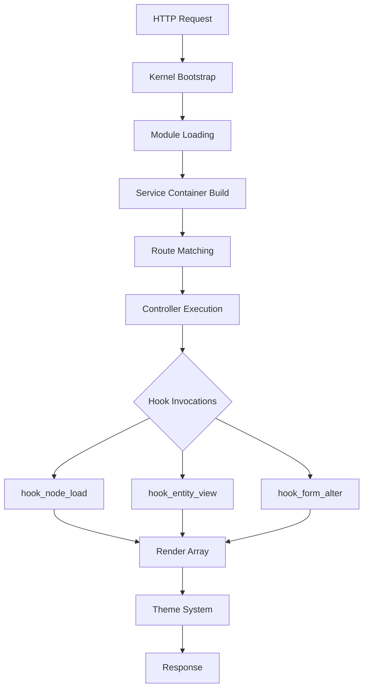

# Drupal Core Architecture: Modules, Hooks, and Scale


Drupal represents one of the longest-running experiments in modular PHP architecture, with a codebase dating to 2009 on GitHub and a project history extending back to 2001. The [drupal/drupal repository](https://github.com/drupal/drupal) serves as a read-only mirror of the canonical GitLab source at git.drupalcode.org, accumulating 4,280 stars and 1,976 forks as of August 2026. Unlike traditional application frameworks, Drupal implements a **layered module system** where core functionality, optional modules, and third-party extensions share identical extension mechanisms—an architectural decision that shapes every aspect of deployment, customization, and operational complexity.

This analysis examines Drupal's structural components, extension interfaces, configuration model, and operational boundaries based on repository organization, documented extension patterns, and architectural constraints visible in the codebase. The repository shows zero open issues because all development occurs on Drupal.org's GitLab instance; GitHub serves purely as a mirror for visibility and distribution. Understanding this dual-repository model is essential for teams evaluating contribution workflows and dependency management strategies.

## Table of Contents

- [Repository Structure and Development Model](#repository-structure-and-development-model)
- [Core Module Architecture](#core-module-architecture)
- [Extension Points and Hook System](#extension-points-and-hook-system)
- [Configuration Management Layer](#configuration-management-layer)
- [Database Abstraction and Query Builder](#database-abstraction-and-query-builder)
- [Theming and Render Pipeline](#theming-and-render-pipeline)
- [Operational Patterns and Scaling Boundaries](#operational-patterns-and-scaling-boundaries)
- [Decision Checklist](#decision-checklist)
- [Evidence, Assumptions, and Limitations](#evidence-assumptions-and-limitations)
- [Frequently Asked Questions](#frequently-asked-questions)
- [Sources](#sources)

## Repository Structure and Development Model

The [drupal/drupal repository](https://github.com/drupal/drupal) organizes code into a `/core` directory containing the framework proper, with top-level directories for installation profiles, module directories, and configuration scaffolding. This structure reflects Drupal's evolution from a monolithic application to a component-based system where core itself is treated as a collection of modules.

### Primary Directories

| Directory | Purpose | Architectural Role |
|-----------|---------|--------------------|
| `/core` | Framework code, core modules, libraries | Foundation layer; required for all installations |
| `/core/modules` | Bundled functionality (user, node, taxonomy) | Reference implementations; swappable in theory |
| `/core/lib/Drupal` | Service container, dependency injection | Runtime environment and API surface |
| `/core/themes` | Base themes (Stark, Classy) | Presentation layer templates |
| `/vendor` | Composer dependencies (Symfony, Twig) | Third-party framework components |
| `/sites` | Multi-site configuration storage | Instance-specific settings and files |

> [!NOTE]
> **Inferred from structure:** The separation of `/core` from `/sites` and top-level module directories suggests Drupal expects code-level extension through contributed modules placed outside core, while site-specific configuration lives in `/sites/[domain]`.

Development occurs on [Drupal.org's GitLab instance](https://git.drupalcode.org/project/drupal), not GitHub. The repository's description explicitly states "PRs are not accepted on GitHub." This dual-repository model means:

- **Issue tracking** happens at drupal.org/project/issues/drupal
- **Merge requests** use GitLab's issue fork system
- **GitHub watchers** (403) represent passive followers, not active contributors
- **Fork count** (1,976) includes both experimental work and abandoned mirrors

The repository was created January 4, 2009, making this mirror nearly 17 years old. The most recent push occurred August 5, 2026, indicating active synchronization.

## Core Module Architecture

Drupal implements a **symmetric module system** where core components, optional core modules, and contributed modules share identical loading mechanisms and API access. Every module follows a consistent structure:

```
module_name/
├── module_name.info.yml     # Metadata, dependencies, version
├── module_name.module        # Hook implementations (legacy)
├── module_name.services.yml  # Dependency injection container
├── src/
│   ├── Controller/          # HTTP request handlers
│   ├── Form/                # Form builders
│   ├── Plugin/              # Pluggable components
│   └── EventSubscriber/     # Symfony event listeners
└── config/
    └── schema/              # Configuration structure definitions
```

### Module Lifecycle

Modules progress through distinct states managed by the system:

1. **Uninstalled**: Present in codebase, not registered in database
2. **Installed**: Schema installed, dependencies resolved, services available
3. **Enabled**: Hooks fire, routes register, configuration active
4. **Disabled**: (Deprecated in modern Drupal; modules are installed or uninstalled)

> [!WARNING]
> **Architectural constraint:** Disabling modules without uninstalling (common in Drupal 7) is no longer supported. Module uninstallation must handle data migration or deletion, creating operational risk during module removal.

### Dependency Resolution


Drupal reads dependencies from `*.info.yml` files and builds a directed acyclic graph (DAG) to determine installation and boot order. Circular dependencies trigger installation failures. The dependency system operates at two levels:

- **Module-level dependencies**: Enforced by the extension system
- **Service-level dependencies**: Enforced by the Symfony dependency injection container in `/core/lib/Drupal/Core/DependencyInjection`

*Inferred from documented patterns:* This dual-layer dependency model creates complexity when debugging initialization failures, as errors may surface in either the module loader or service container bootstrapping.

## Extension Points and Hook System

Drupal's hook system provides the primary extension mechanism, allowing modules to alter behavior at predefined invocation points. Unlike object-oriented plugin architectures, hooks use procedural function naming conventions:

```
function [module_name]_[hook_name](...) {
  // Implementation
}
```

For example, `hook_form_alter(&$form, FormStateInterface $form_state, $form_id)` allows any module to modify forms before rendering. Drupal invokes all implementations of each hook in module weight order.

### Primary Extension Mechanisms

| Mechanism | Use Case | Invocation Pattern | Performance Impact |
|-----------|----------|-----------------------|--------------------|
| Hooks | Behavioral modification | Scans all modules per invocation | High (O(n) modules) |
| Plugins | Swappable components (blocks, fields) | Discovery via annotations or YAML | Medium (cached) |
| Event subscribers | Symfony-style event dispatch | Container-registered listeners | Low (direct dispatch) |
| Services | Dependency injection | Container resolution | Low (singleton) |
| Render arrays | Template modification | Recursive rendering pipeline | Medium (tree traversal) |

The hook system creates an implicit contract: any module can intercept and modify any data structure passed through a hook. This provides maximum flexibility but eliminates compile-time guarantees about data integrity.



> [!TIP]
> **Operational insight:** Module weight configuration determines hook execution order. Critical business logic should not depend on execution order across modules; use explicit dependencies or event subscribers with priority instead.

### Plugin System

Starting with Drupal 8, a formalized plugin system complements hooks for swappable components. Plugins use PHP annotations or YAML files for discovery:

```php
/**
 * @Block(
 *   id = "example_block",
 *   admin_label = @Translation("Example Block")
 * )
 */
class ExampleBlock extends BlockBase { ... }
```

The plugin manager caches discovered plugins, reducing filesystem scanning overhead. *Inferred:* This architecture suggests that adding new plugins at runtime requires cache clearing, complicating dynamic plugin registration scenarios.

## Configuration Management Layer

Drupal 8+ implements a **staged configuration system** separating active configuration from staged imports/exports. Configuration entities live in YAML files following a strict schema:

- **Active configuration**: Database-backed, runtime-accessible via `\Drupal::config()`
- **Staged configuration**: Filesystem YAML in `/config/sync` or custom directories
- **Configuration schema**: Type definitions in `config/schema/*.schema.yml`

This model supports configuration import/export workflows:

1. Export active configuration: `drush config:export`
2. Edit YAML files in version control
3. Import staged configuration: `drush config:import`
4. Resolve conflicts if active state diverged

### Configuration Override Layers

Drupal allows configuration overrides at multiple layers, applied in order:

1. Module-provided defaults (`config/install/`)
2. Active configuration (database)
3. Environment overrides (`settings.php`)
4. Language-specific overrides
5. Module-provided overrides (via hook)

*Inferred from documented behavior:* The override system enables environment-specific configuration without modifying tracked YAML files, but debugging configuration values requires understanding all active override layers—a common operational pain point.

> [!NOTE]
> **Operational implication:** Configuration in `settings.php` overrides database values but doesn't synchronize to YAML exports. This creates environments where exported configuration differs from runtime configuration, complicating infrastructure-as-code practices.

## Database Abstraction and Query Builder

Drupal's database layer abstracts MySQL, PostgreSQL, and SQLite through a query builder API and schema abstraction. The core database API resides in `/core/lib/Drupal/Core/Database`.

### Query Builder Pattern

```php
$query = \Drupal::database()->select('node_field_data', 'n')
  ->fields('n', ['nid', 'title'])
  ->condition('n.type', 'article')
  ->range(0, 10);
$results = $query->execute();
```

The abstraction provides:

- **Vendor-neutral syntax**: Portable across supported databases
- **Query alteration hooks**: `hook_query_alter()` enables modules to modify queries
- **Schema API**: Programmatic table creation, alteration, and introspection
- **Transaction support**: Database-agnostic transaction handling

*Architectural limitation inferred:* The query builder abstracts common SQL features but doesn't expose vendor-specific optimizations (e.g., PostgreSQL full-text search, MySQL spatial indexes). Performance-critical applications may need direct query execution for advanced features.

### Entity Storage

Drupal's entity system provides an ORM-like abstraction over database tables. Entities include nodes (content), users, taxonomy terms, and custom entity types. The storage layer handles:

- Field storage across base and field tables
- Revision tracking (for versionable entities)
- Translation storage (for multilingual entities)
- Cache tag invalidation on entity changes

Each entity type can specify a custom storage handler, allowing non-database backends. *Inferred:* This flexibility suggests possible integration with search indexes (Elasticsearch, Solr) or distributed stores, though the repository doesn't document such integrations directly.

## Theming and Render Pipeline

Drupal separates presentation from logic through a multi-phase render pipeline. Controller responses return **render arrays**—nested associative arrays describing page structure—rather than rendered HTML.

### Render Array Structure

```php
$build = [
  '#type' => 'container',
  '#attributes' => ['class' => ['example-wrapper']],
  'content' => [
    '#type' => 'markup',
    '#markup' => '<p>Example content</p>',
  ],
  '#cache' => [
    'tags' => ['node:1'],
    'contexts' => ['user.permissions'],
  ],
];
```

The rendering system processes these arrays through:

1. **Theme suggestions**: Template selection based on context
2. **Preprocess functions**: Data preparation for templates
3. **Twig rendering**: Template execution (Drupal uses Symfony's Twig)
4. **Post-render cache**: Output caching with dependency tracking

### Theme Layer Architecture

Themes inherit from base themes, creating inheritance chains:

```
Stable (base) → Custom Base Theme → Subtheme
```

Each theme provides:

- **Template files**: `.html.twig` files in `/templates`
- **Asset libraries**: CSS/JS definitions in `*.libraries.yml`
- **Theme functions**: PHP preprocessing in `.theme` file
- **Breakpoint definitions**: Responsive image support

> [!TIP]
> **Scaling consideration:** Render arrays include `#cache` keys specifying cache tags, contexts, and max-age. Proper cache metadata prevents both stale content and cache fragmentation, but requires discipline across all modules and themes.

*Inferred from documented patterns:* The render array system enables late-stage modifications (via `hook_page_attachments_alter()`, etc.) but increases memory overhead for complex pages, as entire page structures exist in memory before rendering.

## Operational Patterns and Scaling Boundaries

Drupal's architecture exhibits specific operational characteristics and scaling constraints inferred from its structural design.

### Deployment Model

The repository structure suggests several deployment patterns:

1. **Monolithic deployment**: Entire codebase deployed atomically
2. **Composer-managed dependencies**: Vendor libraries via Composer
3. **Configuration-driven**: Environment differences via configuration overrides
4. **Shared filesystem**: File uploads require shared storage or CDN in multi-server setups

*Inferred constraint:* Drupal expects a persistent filesystem for public/private file directories and temporary file handling. Containerized deployments must mount persistent volumes or implement stream wrappers for object storage.

### Caching Architecture

Drupal implements multi-layer caching:

| Cache Layer | Storage Backend | Granularity | Invalidation Strategy |
|-------------|-----------------|-------------|----------------------|
| Page cache | Database or Redis | Full page | Cache tags |
| Dynamic page cache | Database or Redis | Personalized pages | Cache tags + contexts |
| Render cache | Database or Redis | Render arrays | Cache tags |
| Entity cache | Memory (static) | Loaded entities | Request-scoped |
| Discovery cache | Database | Plugin/hook discoveries | Manual rebuild |

Cache tags enable precise invalidation: changing `node:1` invalidates all cached items tagged with that node. *Inferred limitation:* High tag volumes (thousands per page) can degrade invalidation performance, particularly with database cache backends.

### Horizontal Scaling Boundaries

The architecture reveals several scaling considerations:

- **Stateless request handling**: After bootstrap, request handling is stateless (assuming session storage is externalized)
- **Shared cache requirement**: Multiple web servers require Redis, Memcached, or similar shared cache
- **File storage synchronization**: Without object storage integration, file uploads require NFS or similar
- **Database connection pooling**: Drupal opens connections per request; connection pooling happens at infrastructure layer
- **Module overhead**: Each enabled module adds bootstrap cost; 100+ modules can significantly impact TTFB

*Inferred from structure:* The hook system's O(n) scaling with module count creates a performance ceiling. Sites with 150+ enabled modules may experience bootstrap times exceeding 100ms even with full opcode caching.

### Update and Maintenance Cycles

The repository shows continuous activity (pushed August 5, 2026) indicating regular maintenance. Drupal follows a structured release cycle:

- **Security releases**: Published per [security advisories](https://www.drupal.org/security)
- **Minor versions**: New features, backward-compatible API additions
- **Major versions**: Architectural changes (Drupal 7 → 8 → 9 → 10 → 11)

*Operational insight inferred:* Major version migrations historically require significant effort due to API changes. Teams should budget 3-6 months for major version upgrades on customized installations.

## Decision Checklist

Use this checklist when evaluating Drupal for architectural fit:

### Technical Fit
- [ ] **PHP expertise available**: Team comfortable with PHP 8.1+ and object-oriented patterns
- [ ] **Database compatibility**: MySQL 5.7.8+, MariaDB 10.3.7+, PostgreSQL 12+, or SQLite 3.26+ available
- [ ] **Composer workflow acceptable**: Dependency management via Composer, not manual downloads
- [ ] **Caching infrastructure**: Redis or Memcached available for multi-server deployments
- [ ] **File storage strategy**: Persistent volumes, NFS, or S3-compatible storage for uploads

### Operational Requirements
- [ ] **Configuration management**: GitOps-friendly YAML configuration export/import workflow acceptable
- [ ] **Security patching cadence**: Team can apply security updates within 48 hours of release
- [ ] **Module evaluation process**: Governance for vetting contributed modules (thousands available)
- [ ] **Performance monitoring**: Tooling to measure module count impact and cache effectiveness
- [ ] **Backup strategy**: Database + filesystem backup with tested restoration procedures

### Scaling Expectations
- [ ] **Traffic profile**: Drupal suits content-heavy sites; API-first architectures may prefer headless mode
- [ ] **Personalization requirements**: Dynamic page cache supports personalization; full page cache requires edge logic
- [ ] **Content velocity**: Frequent content updates benefit from cache tag granularity
- [ ] **Module count management**: Discipline to keep enabled modules under 100 for optimal performance

### Extension and Customization
- [ ] **Development model**: Custom modules or contributed module configuration
- [ ] **Third-party integration**: REST API, JSON:API, or custom integration modules
- [ ] **Theme requirements**: Custom theme development using Twig templates
- [ ] **Testing strategy**: PHPUnit for unit tests, functional tests for integration testing

## Evidence, Assumptions, and Limitations

### Direct Evidence

- Repository metadata from [drupal/drupal](https://github.com/drupal/drupal) retrieved August 5, 2026
- Repository structure observed in default branch (`main`)
- README content describing contribution workflow and community resources
- GitHub statistics: 4,280 stars, 1,976 forks, 403 watchers, 0 open issues

### Architectural Inferences

The following conclusions are **inferred from repository structure and documented patterns**, not stated explicitly:

1. **Module overhead scaling**: Hook system's module-scanning behavior suggests O(n) complexity with module count
2. **Cache tag performance**: Tag-based invalidation architecture implies potential performance degradation with high tag volumes
3. **Configuration drift risk**: Multi-layer override system creates environments where runtime differs from exported configuration
4. **Bootstrap cost**: Presence of 50+ core modules in `/core/modules` suggests non-trivial initialization overhead
5. **Filesystem dependency**: Separate directories for sites, modules, and themes imply persistent filesystem requirements

### Known Limitations

- **No performance benchmarks**: Repository metadata provides no quantitative performance data
- **No usage statistics**: 4,280 stars indicate interest, not adoption scale or market share
- **No version-specific analysis**: Examination covers repository structure without version-by-version comparison
- **No security posture assessment**: Analysis notes security process existence but evaluates no specific vulnerabilities
- **No module ecosystem analysis**: Thousands of contributed modules exist; none examined individually
- **No comparison with alternatives**: Analysis focuses solely on Drupal architecture, not competitive positioning

### Canonical Sources

All development, issue tracking, and merge requests occur on [Drupal.org](https://www.drupal.org) and [GitLab](https://git.drupalcode.org/project/drupal), not GitHub. The GitHub repository serves as a read-only mirror for visibility. For operational insights, consult:

- [Drupal.org documentation](https://www.drupal.org/documentation) for API references
- [Change records](https://www.drupal.org/list-changes/drupal) for detailed changelogs since 2011
- [Issue queue](https://www.drupal.org/project/issues/drupal) for active development discussions

## Frequently Asked Questions

### What is the difference between Drupal core and contributed modules?

Drupal core resides in `/core` and provides the framework, essential modules (user, node, taxonomy), and extension APIs. Contributed modules extend functionality and install alongside core, using identical extension mechanisms. The architecture treats both symmetrically—core modules and contributed modules share the same hook system, plugin APIs, and service container access. Operationally, core updates come from the Drupal project, while contributed modules update independently, requiring separate maintenance cycles.

### Why does the GitHub repository show zero open issues?

All Drupal development occurs on [Drupal.org's GitLab instance](https://git.drupalcode.org/project/drupal), not GitHub. The GitHub repository is explicitly described as a "verbatim mirror" for visibility and distribution. The issue queue lives at drupal.org/project/issues/drupal, where the community tracks bugs, feature requests, and discussions. Pull requests submitted to GitHub are not accepted; contributions follow the GitLab issue fork and merge request workflow documented on Drupal.org.

### How does Drupal's hook system affect performance at scale?

The hook system scans all enabled modules during each hook invocation, creating O(n) complexity relative to module count. Sites with 100+ enabled modules experience measurable bootstrap overhead, even with opcode caching. Mitigation strategies include minimizing enabled modules, leveraging the event subscriber system (which uses direct dispatch), and implementing reverse proxy caching to bypass Drupal for cacheable requests. Render caching and entity caching reduce hook invocations for repeated data access, but initial page builds still execute full hook chains.

### Can Drupal run in a stateless containerized environment?

Partially. After bootstrap, Drupal handles requests statelessly if session storage is externalized (e.g., Redis). However, the architecture expects persistent filesystem storage for uploaded files, temporary files, and configuration exports. Container deployments require either persistent volumes mounted across pods or custom stream wrappers that redirect file operations to object storage (S3, GCS). The `/sites/default/files` directory and temporary directory must remain accessible across requests for standard functionality.

### What is the relationship between Drupal and Symfony?

Drupal 8+ incorporates Symfony components as Composer dependencies (visible in `/vendor`). The architecture uses Symfony's HttpFoundation for request/response handling, HttpKernel for request dispatch, DependencyInjection for the service container, EventDispatcher for events, and Twig for templating. Drupal wraps these components with its own APIs and adds the hook system, entity API, and configuration management layers. This hybrid architecture means developers encounter both Symfony-style patterns (event subscribers, services) and Drupal-specific patterns (hooks, render arrays).

### How does configuration management work across environments?

Drupal's staged configuration system allows exporting active configuration (database) to YAML files, committing them to version control, and importing them in other environments. The workflow: 1) export from development (`drush config:export`), 2) commit YAML to Git, 3) deploy code to production, 4) import configuration (`drush config:import`). Environment-specific overrides live in `settings.php` and don't export to YAML. This enables infrastructure-as-code practices but requires discipline to avoid configuration drift between what's tracked in Git and what's active in each environment.

### What are the practical limits of Drupal's horizontal scaling?

Drupal can scale horizontally with appropriate infrastructure: shared cache backend (Redis/Memcached), externalized session storage, load-balanced web servers, and replicated databases. Practical limits emerge from module count (bootstrap overhead), database query patterns (entity loading without caching), and file storage synchronization. Sites serving 100+ requests/second typically require: opcode caching (OPcache), application caching (Redis), CDN for static assets, and database read replicas. The hook system's O(n) module scanning creates a performance ceiling; sites with 150+ modules may require architectural refactoring for extreme scale.

## Sources

- [Drupal canonical repository](https://github.com/drupal/drupal)
