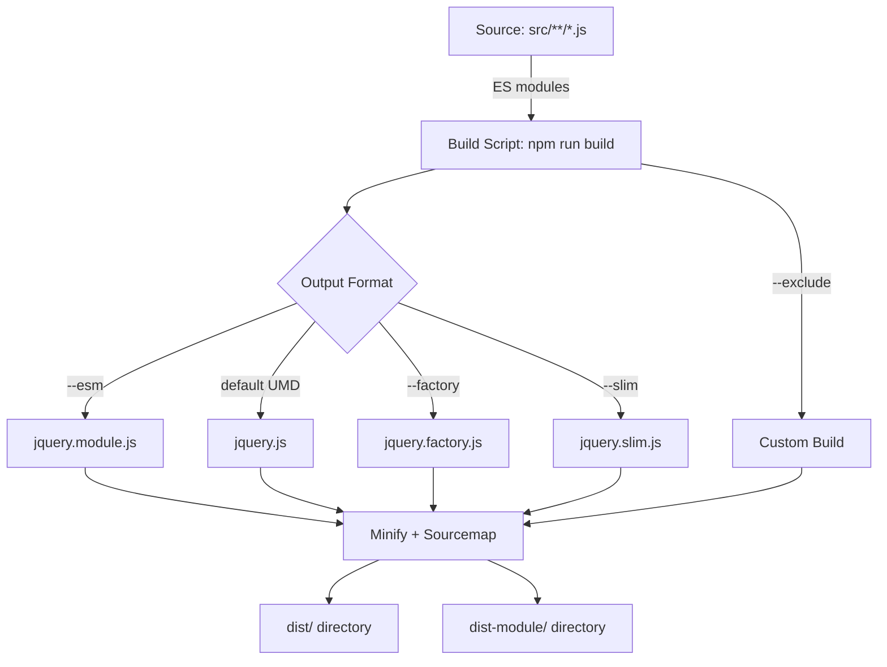

# jQuery 4.0.0 Release: Breaking Changes and Modern Standards


The jQuery team [released version 4.0.0](https://github.com/jquery/jquery/releases/tag/4.0.0) on January 18, 2026, after more than 16 years of incremental evolution. This major version removes support for legacy browsers—including all versions of Internet Explorer below 11, iOS Safari below 11, Firefox below 65, and Android Browser entirely—while migrating the entire codebase from AMD to ES modules. The release eliminates dozens of deprecated APIs, refactors AJAX to prevent automatic script execution, and introduces TrustedHTML support for Content Security Policy compliance. For teams maintaining jQuery-dependent applications, this release requires careful migration planning: the 3.x branch transitions to critical-only support, and commercial extended support from HeroDevs becomes the only option for organizations unable to upgrade immediately.

Version 4.0.0 represents a philosophical shift toward modern JavaScript standards rather than backward compatibility at all costs. The [59,787-star repository](https://github.com/jquery/jquery) now builds exclusively with ES module syntax, drops several internal polyfills, and removes automatic type conversions that previously masked errors. AJAX responses no longer auto-execute scripts unless explicitly requested via the `dataType` parameter, a change that closes multiple cross-site scripting vectors. The `.even()` and `.odd()` methods replace the positional pseudo-selectors `:even` and `:odd`, while the CSS engine stops automatically appending "px" to numeric values for most properties. These changes reduce bundle size and complexity but break assumptions embedded in thousands of existing projects.

---

## Table of Contents

- [What changed in jQuery 4.0.0](#what-changed-in-jquery-400)
- [Browser support and platform requirements](#browser-support-and-platform-requirements)
- [Breaking changes requiring code updates](#breaking-changes-requiring-code-updates)
- [AJAX security and behavior changes](#ajax-security-and-behavior-changes)
- [ES module migration and build system](#es-module-migration-and-build-system)
- [Who should upgrade and when](#who-should-upgrade-and-when)
- [Upgrade test and rollback plan](#upgrade-test-and-rollback-plan)
- [Unanswered questions and edge cases](#unanswered-questions-and-edge-cases)
- [Decision checklist](#decision-checklist)
- [Evidence, assumptions, and limitations](#evidence-assumptions-and-limitations)
- [Frequently Asked Questions](#frequently-asked-questions)
- [Sources](#sources)

---

## What changed in jQuery 4.0.0

The [release notes](https://github.com/jquery/jquery/releases/tag/4.0.0) list 88 individual commits across eight functional areas: AJAX, Attributes, CSS, Core, Data, Deferred, Dimensions, and Effects. The most impactful changes cluster around three themes: eliminating legacy browser workarounds, migrating to ES module syntax, and tightening security defaults.

### Key removals and deprecations

| Removed API | Reason | Replacement |
|-------------|--------|-------------|
| `jQuery.trim()` | Native `String.prototype.trim()` universal | `" string ".trim()` |
| `jQuery.isArray()` | Native `Array.isArray()` universal | `Array.isArray(obj)` |
| `jQuery.type()` | Rarely needed with modern typeof | `typeof` or `instanceof` |
| `jQuery.isFunction()` | Ambiguous with ES6 classes | `typeof fn === 'function'` |
| `jQuery.isWindow()` | IE-specific check no longer needed | `obj === window` |
| `jQuery.camelCase()` | Internal implementation detail | Custom utility or lodash |
| `.toggleClass(boolean)` | Confusing signature | Explicit `.addClass()` / `.removeClass()` |
| `.context` property | Undocumented internal property | Use selector or DOM reference |
| `.selector` property | Unreliable with chained calls | Store original selector separately |
| Positional `:even`, `:odd` | Non-standard, performance cost | `.even()`, `.odd()` methods |

The full list of removed APIs appears in [commit 58f0c00b](https://github.com/jquery/jquery/commit/58f0c00bed695f934bb205c6115e5fe99dd5c27b), which references [issue #4056](https://github.com/jquery/jquery/issues/4056). Teams that relied on undocumented properties or internal caching mechanisms will encounter runtime errors rather than deprecation warnings.

### CSS engine modernization


The CSS module stops automatically appending "px" to numeric values for properties other than a hardcoded exception list ([commit 00a9c2e5](https://github.com/jquery/jquery/commit/00a9c2e5f4c855382435cec6b3908eb9bd5a53b7)). This resolves [issue #2795](https://github.com/jquery/jquery/issues/2795), which documented inconsistent behavior with CSS Grid, Flexbox, and custom properties. Code like `.css('grid-column', 2)` previously produced `"2px"` (invalid CSS); it now produces `"2"` (valid for unitless properties). The engine also trims whitespace around CSS custom property values ([commit efadfe99](https://github.com/jquery/jquery/commit/efadfe991a5c287af561a9326bf1427d726c91c1)) and returns `undefined` for whitespace-only values ([commit 7eb00196](https://github.com/jquery/jquery/commit/7eb0019640a5856c42b451551eb7f995d913eba9)).

Dimensions of `<col>` table elements now compute correctly ([commit eca2a564](https://github.com/jquery/jquery/commit/eca2a56457e1c40c071aeb3ac87efeb8bbb8013e)), and `.outerHeight(true)` correctly includes negative margins ([commit bce13b72](https://github.com/jquery/jquery/commit/bce13b72c1753e16cc0db53ebf0f0456bdcf6b48)).

> [!WARNING]
> Projects that set numeric CSS values without explicit units for properties like `width`, `height`, `top`, `left`, `margin`, or `padding` will produce invalid CSS. Audit all `.css()` calls that pass numbers.

### Attribute and value handling

The `.attr()` method no longer stringifies non-string values passed as the second parameter ([commit 4250b628](https://github.com/jquery/jquery/commit/4250b628783d7bfa92ec6c5550c6e4b22fab6034)), addressing [issue #4948](https://github.com/jquery/jquery/issues/4948). Passing `true`, `false`, or objects now throws an error instead of coercing to `"true"`, `"false"`, or `"[object Object]"`. The `.attr(name, false)` signature removes the attribute for all non-ARIA attributes ([commit 063831b6](https://github.com/jquery/jquery/commit/063831b6378d518f9870ec5c4f1e7d5d16e04f36)).

The `.val()` method no longer strips carriage returns in all browsers ([commit ff281991](https://github.com/jquery/jquery/commit/ff2819911da6cbbed5ee42c35d695240f06e65e3)); the normalization now applies only to Internet Explorer.

---

## Browser support and platform requirements

The [commit cf84696f](https://github.com/jquery/jquery/commit/cf84696fd1d7fe314a11492606529b5a658ee9e3) removes support for Internet Explorer 10 and below, iOS Safari 10 and below, Firefox 64 and below, and all versions of Android Browser and PhantomJS. [Commit e35fb62d](https://github.com/jquery/jquery/commit/e35fb62db4fb46f031056bb53e393982c03972a1) separately drops Edge Legacy (pre-Chromium).

### Supported environments

| Browser | Minimum version | Notes |
|---------|----------------|-------|
| Chrome / Edge | 88+ | Chromium-based Edge only |
| Firefox | 65+ | Released January 2019 |
| Safari | 11.1+ | macOS 10.13.4+ or iOS 11.3+ |
| Opera | 74+ | Chromium-based |
| Samsung Internet | 14+ | Based on Chromium 87 |
| Node.js | 18+ | Inferred from ES module use |

The README states that jQuery "also supports Node, browser extensions, and other non-browser environments" but provides no minimum Node version. The switch to ES modules and use of `DOMParser` ([commit 0e123509](https://github.com/jquery/jquery/commit/0e123509d529456ddf130abb97e6266b53f62c50)) implies Node 18 or higher with `--experimental-vm-modules` or Node 20+ for stable ESM support.

> [!NOTE]
> The repository's own CI configuration (not included in provided data) would specify exact Node versions tested. The lack of polyfills for `Array.prototype.flat` ([commit 9df4f1de](https://github.com/jquery/jquery/commit/9df4f1de12728b44a4b0f91748f12421008d9079)) confirms support for ES2019+ environments only.

Commercial extended support for jQuery 1.x, 2.x, and 3.x is available from [HeroDevs](https://www.herodevs.com/support/jquery-nes), as noted in the README. Organizations with IE 11 requirements must remain on jQuery 3.x or purchase extended support.

---

## Breaking changes requiring code updates

The following changes will cause runtime errors or silent behavior changes in existing applications.

### Removed global utilities

```javascript
// jQuery 3.x
jQuery.trim("  text  ");        // "text"
jQuery.isArray([1, 2]);         // true
jQuery.type(null);              // "null"
jQuery.isFunction(myFunc);      // true
jQuery.camelCase("foo-bar");    // "fooBar"

// jQuery 4.0.0 — all removed
"  text  ".trim();              // Use native
Array.isArray([1, 2]);          // Use native
typeof null;                    // Use typeof
typeof myFunc === 'function';   // Use typeof
// No replacement for camelCase; copy implementation or use lodash
```

### Selector changes

The `:even` and `:odd` pseudo-selectors are removed. Use the new `.even()` and `.odd()` methods ([commit 78420d42](https://github.com/jquery/jquery/commit/78420d427cf3734d9264405fcbe08b76be182a95)):

```javascript
// jQuery 3.x
$("li:even").addClass("highlight");

// jQuery 4.0.0
$("li").even().addClass("highlight");
```

These methods were introduced specifically to replace the non-standard positional selectors. Custom selector extensions (e.g., `:first`, `:last`, `:eq()`) remain but may perform differently if your custom build excludes the full Sizzle engine.

### AJAX callback signatures

`jQuery.get()` and related methods now accept `null` as a success callback ([commit 74978b7e](https://github.com/jquery/jquery/commit/74978b7e892537559850cda7332bdab8106e6354)), resolving [issue #4989](https://github.com/jquery/jquery/issues/4989). Previously, passing `null` caused a type error.

The `responseJSON` property now populates for failed JSONP requests within the same domain ([commit 68b4ec59](https://github.com/jquery/jquery/commit/68b4ec59c8f290d680e9db4bc980655660817dd1)), enabling consistent error handling.

### Deferred and promise behavior

The `getStackHook` internal property is renamed to `getErrorHook` ([commit 258ca1ec](https://github.com/jquery/jquery/commit/258ca1ec6a373f85f7849308c967b7e6a993e6e7), [issue #5201](https://github.com/jquery/jquery/issues/5201)). This affects only code that directly manipulates jQuery's promise implementation internals.

> [!TIP]
> Run your test suite with jQuery 3.7 in strict mode and address all deprecation warnings before upgrading to 4.0. The jQuery Migrate plugin (if available for 4.x) can log removed API usage.

### Data and event namespacing

The data and event systems now prevent collisions with `Object.prototype` properties ([commit 9d76c0b1](https://github.com/jquery/jquery/commit/9d76c0b163675505d1a901e5fe5249a2c55609bc), [issue #3256](https://github.com/jquery/jquery/issues/3256)). Code that used keys like `"constructor"`, `"hasOwnProperty"`, or `"__proto__"` may behave differently.

---

## AJAX security and behavior changes

AJAX changes in 4.0.0 prioritize security and predictability over backward compatibility.

### Automatic script execution removed

Previously, jQuery evaluated JavaScript in any AJAX response with a `Content-Type` of `application/javascript` or `text/javascript`, regardless of the requested `dataType`. [Commit 025da4dd](https://github.com/jquery/jquery/commit/025da4dd343e6734f3d3c1b4785b1548498115d8) removes this behavior ([issue #4822](https://github.com/jquery/jquery/issues/4822)). Scripts now execute only when:

1. The `dataType` parameter explicitly specifies `"script"`, or
2. The request is a JSONP request (which inherently executes a callback).

[Commit 50871a5a](https://github.com/jquery/jquery/commit/50871a5a85cc802421b40cc67e2830601968affe) further ensures that scripts do not execute for unsuccessful HTTP responses ([issue #4250](https://github.com/jquery/jquery/issues/4250)).

```javascript
// jQuery 3.x — executes any script returned
$.get("/api/user");  // If server returns <script>alert('XSS')</script>, executes

// jQuery 4.0.0 — no execution unless dataType specified
$.get("/api/user");  // Script ignored
$.get("/api/user", { dataType: "script" });  // Executes if server sends script
```

### JSONP auto-promotion eliminated

The "json to jsonp auto-promotion" logic is removed ([commit e7b3bc48](https://github.com/jquery/jquery/commit/e7b3bc488d01d584262e12a7c5c25f935d0d034b), [issues #1799](https://github.com/jquery/jquery/issues/1799) and [#3376](https://github.com/jquery/jquery/issues/3376)). jQuery 3.x automatically changed `dataType: "json"` requests to JSONP if the URL contained `callback=?` or similar. This caused unexpected script execution when URLs contained query parameters matching the JSONP pattern.

Now, JSONP must be explicitly requested:

```javascript
$.ajax({
  url: "/api/data?callback=?",
  dataType: "jsonp"  // Must be explicit
});
```

JSONP error responses (HTTP 4xx/5xx) that return a script now execute that script ([commit a1e619b0](https://github.com/jquery/jquery/commit/a1e619b0a557b47c3e26a5e74af12b63a0d5e73)), enabling error callbacks to receive parsed data.

### Content-Type and binary data

The `processData` setting now allows `true` even for binary data ([commit ce264e07](https://github.com/jquery/jquery/commit/ce264e0789116e37fe371503537a217c038dfae8)), and arrays are no longer treated as binary ([commit 992a1911](https://github.com/jquery/jquery/commit/992a1911d0b6195012edc25fd5a48810d4be64b5)). FormData and other binary types are fully supported ([commit a7ed9a7b](https://github.com/jquery/jquery/commit/a7ed9a7b6364273b1b964fd2cf9691dec2cbec6b)).

If a server sends a `Content-Type` header, that value overrides `s.contentType` ([commit 7fb90a6b](https://github.com/jquery/jquery/commit/7fb90a6beaeffe16699800f73746748f6a5cc2de), [issue #4119](https://github.com/jquery/jquery/issues/4119)).

### Cross-origin script headers

The script transport now supports the `headers` option even for cross-domain requests ([commit 6d136443](https://github.com/jquery/jquery/commit/6d1364431b63b0d3bbe1c5fd604131f9db453396), [issue #5142](https://github.com/jquery/jquery/issues/5142)), enabling custom headers for CDN-hosted scripts.

> [!WARNING]
> Audit all AJAX calls that rely on implicit script execution. Any endpoint that returned HTML containing `<script>` tags will no longer execute those scripts unless `dataType: "script"` is set.

---

## ES module migration and build system

The most architecturally significant change is the migration from AMD to ES modules ([commit d0ce00cd](https://github.com/jquery/jquery/commit/d0ce00cdfa680f1f0c38460bc51ea14079ae8b07)). The entire `src/` directory now uses `import` and `export` statements, and the build system produces multiple output formats.

### Module formats available

The `npm run build:all` command generates:

| File | Format | Size target | Use case |
|------|--------|-------------|----------|
| `jquery.js` | UMD (global) | ~90 KB unminified | Legacy `<script>` tag |
| `jquery.min.js` | UMD minified | ~30 KB gzipped | Production `<script>` tag |
| `jquery.slim.js` | UMD, no AJAX/effects | ~70 KB unminified | Minimal feature set |
| `jquery.module.js` | ES module | ~90 KB unminified | Modern bundlers (Webpack, Rollup, Vite) |
| `jquery.slim.module.js` | ES module, slim | ~70 KB unminified | Modern bundlers, minimal features |

ES module builds export `jQuery` and `$` as named exports ([commit f75daab0](https://github.com/jquery/jquery/commit/f75daab09102a4dd5107deadb55d4a169f86254a), [issue #5262](https://github.com/jquery/jquery/issues/5262)):

```javascript
// Modern import
import { jQuery, $ } from 'jquery';

// Still works
import jQuery from 'jquery';
const $ = jQuery;
```

[Commit 60f11b58](https://github.com/jquery/jquery/commit/60f11b58bfeece6b6d0189d7d19b61a4e1e61139) fixes the exports setup to work with both ESM and CommonJS bundlers ([issue #5416](https://github.com/jquery/jquery/issues/5416)).

### Factory mode for non-window environments

The `--factory` build flag ([commit 46f6e3da](https://github.com/jquery/jquery/commit/46f6e3da796ee9d28c7c1428793b72d66bcbb0b7)) produces a build that does not assume a global `window` exists. Instead, it exports a factory function accepting `window` as a parameter:

```javascript
import jQueryFactory from './jquery.factory.js';
const jQuery = jQueryFactory(window);
```

This enables use in web workers, service workers, and JSDOM-based testing environments.

### Custom build options

The build script supports `--exclude` and `--include` flags to create custom builds. For example, to exclude deprecated APIs and AJAX:

```bash
npm run build -- --exclude=deprecated --exclude=ajax --filename=jquery.custom.js
```

Excluding the `selector` module replaces Sizzle with a minimal wrapper around `querySelectorAll` ([commit src/selector-native.js](https://github.com/jquery/jquery/blob/main/src/selector-native.js)). This removes support for jQuery selector extensions (e.g., `:animated`, `:hidden`, `:visible`) but reduces bundle size.

> [!NOTE]
> The README warns that "non-official custom builds are not regularly tested. Use them at your own risk." Production applications should use the official builds unless bundle size is critical.

### Build system diagram



---

## Who should upgrade and when

The decision to upgrade depends on browser support requirements, dependency on removed APIs, and tolerance for testing effort.

### Teams that should upgrade immediately

- **New projects**: No legacy code to migrate.
- **Modern-only applications**: Already target Chrome 90+, Firefox 80+, Safari 14+.
- **ES module-native projects**: Using Vite, Rollup, or Webpack 5 with tree-shaking.
- **Security-sensitive applications**: Benefit from AJAX script execution hardening.

### Teams that should delay

- **IE 11 support required**: Must remain on jQuery 3.x until IE is dropped.
- **Large codebases**: Heavy use of removed APIs (`.trim()`, `.isArray()`, etc.) requires refactoring.
- **Third-party plugin dependencies**: Plugins may not support jQuery 4.x yet.
- **Limited testing resources**: The scope of breaking changes requires comprehensive QA.

The README states that the 3.x branch receives "critical-only" support, meaning security fixes but no new features. jQuery 2.x and 1.x receive no support.

### Plugin and library authors

Maintainers of jQuery plugins should test against 4.0.0 in a feature branch and publish compatibility statements. Key areas to test:

- Selector usage (`:even`, `:odd` removed).
- Direct use of removed utilities (`$.trim`, `$.type`, etc.).
- AJAX calls that assume automatic script execution.
- CSS manipulation with unitless numbers.

---

## Upgrade test and rollback plan

### Pre-upgrade preparation

1. **Audit API usage**: Search the codebase for all removed APIs. Common patterns:
   ```bash
   grep -r "jQuery.trim\|$.trim" src/
   grep -r "jQuery.isArray\|$.isArray" src/
   grep -r ":even\|:odd" src/
   grep -r ".toggleClass(true\|.toggleClass(false" src/
   ```

2. **Run jQuery 3.x with deprecation warnings**: If a jQuery Migrate plugin is available, enable it and fix all warnings.

3. **Inventory third-party plugins**: Check each plugin's compatibility with jQuery 4.0.

4. **Set up parallel testing**: Run the test suite against both jQuery 3.7 and 4.0.0 to identify behavioral differences.

### Upgrade steps

1. **Update package.json**:
   ```json
   {
     "dependencies": {
       "jquery": "^4.0.0"
     }
   }
   ```

2. **Replace removed API calls**:
   ```javascript
   // Before
   jQuery.trim(str);
   
   // After
   str.trim();
   ```

3. **Update selectors**:
   ```javascript
   // Before
   $("li:even").addClass("highlight");
   
   // After
   $("li").even().addClass("highlight");
   ```

4. **Audit AJAX calls**: Add explicit `dataType` where script execution is expected:
   ```javascript
   $.ajax({
     url: "/dynamic-content",
     dataType: "script"  // Add if script execution needed
   });
   ```

5. **Fix CSS numeric values**:
   ```javascript
   // Before
   $(elem).css("width", 100);  // Became "100px"
   
   // After
   $(elem).css("width", "100px");  // Explicit unit
   ```

6. **Run full test suite**: Execute unit, integration, and end-to-end tests.

7. **Test in all supported browsers**: Focus on Safari 11.1 (oldest supported version).

### Rollback plan

If critical issues emerge in production:

1. **Revert package.json**: Change dependency back to `"jquery": "^3.7.0"`.
2. **Clear build caches**: Run `npm ci` or `yarn install --force` to ensure correct version.
3. **Rebuild and redeploy**: Bundle and deploy the application with jQuery 3.x.
4. **Document issues**: File GitHub issues with reproduction cases to aid future upgrade attempts.

For CDN users:

```html
<!-- Upgrade -->
<script src="https://code.jquery.com/jquery-4.0.0.min.js"></script>

<!-- Rollback -->
<script src="https://code.jquery.com/jquery-3.7.1.min.js"></script>
```

> [!TIP]
> Use subresource integrity (SRI) hashes when loading from CDNs to prevent unexpected version changes. The official jQuery CDN provides SRI hashes on the download page.

---

## Unanswered questions and edge cases

The release notes and commit history leave several questions unresolved:

### Performance characteristics

No benchmarks compare jQuery 4.0 performance to 3.x. The ES module migration and removal of polyfills likely improve parse and execution time, but the magnitude is unknown. The switch from `document.implementation.createHTMLDocument` to `DOMParser` ([commit 0e123509](https://github.com/jquery/jquery/commit/0e123509d529456ddf130abb97e6266b53f62c50)) for `$.parseHTML` may affect parsing speed for large HTML strings.

### Bundle size impact

The README does not provide updated file sizes for the 4.0.0 release. The removal of IE workarounds and deprecated APIs should reduce size, but the exact savings are unclear. Users building custom bundles with `--exclude` will see variable results.

### jQuery Migrate plugin availability

The release notes do not mention a jQuery Migrate 4.x plugin. The Migrate plugin historically provided deprecation warnings and polyfills for removed APIs during transition periods. Its absence makes migrations riskier.

### Node.js module resolution

The exports field in `package.json` (not provided in editorial data) determines how Node.js and bundlers resolve imports. The fix in [commit 60f11b58](https://github.com/jquery/jquery/commit/60f11b58bfeece6b6d0189d7d19b61a4e1e61139) addresses "bundler compatibility" but does not detail the exports map structure.

### TrustedHTML implementation details

The "basic TrustedHTML support" ([commit de5398a6](https://github.com/jquery/jquery/commit/de5398a6ad088dc006b46c6a870a2a053f4cd663), [issue #4409](https://github.com/jquery/jquery/issues/4409)) is not documented. The commit message does not explain which methods accept TrustedHTML objects, whether `$.parseHTML` returns TrustedHTML, or how this integrates with Content Security Policy `require-trusted-types-for 'script'` directives.

### Selector engine replacement behavior

Excluding the full `selector` module replaces Sizzle with a `querySelectorAll` wrapper ([src/selector-native.js](https://github.com/jquery/jquery/blob/main/src/selector-native.js)). The README states this "does not support jQuery selector extensions or enhanced semantics" but does not enumerate which selectors break. For example, does `:contains()` work? Does `$(":checked")` behave identically?

---

## Decision checklist

Use this checklist to determine upgrade readiness:

- [ ] **Browser support**: Application requires only Chrome 88+, Firefox 65+, Safari 11.1+, or equivalent.
- [ ] **Removed APIs**: Codebase audited for `$.trim`, `$.isArray`, `$.type`, `$.isFunction`, `$.camelCase`, `.selector`, `.context`.
- [ ] **Selector changes**: All `:even` and `:odd` selectors replaced with `.even()` and `.odd()` methods.
- [ ] **AJAX security**: All AJAX calls reviewed; `dataType: "script"` added where script execution is intentional.
- [ ] **CSS numeric values**: All `.css()` calls with numeric values audited for missing units.
- [ ] **Third-party plugins**: All plugins tested or documented as jQuery 4.0-compatible.
- [ ] **Test coverage**: Unit and integration tests pass against jQuery 4.0.0.
- [ ] **Browser testing**: Manual testing completed in Safari 11.1 and Firefox 65 (oldest supported).
- [ ] **Rollback plan**: Documented procedure to revert to jQuery 3.x if issues arise.
- [ ] **Monitoring**: Error tracking configured to detect runtime exceptions from API changes.

---

## Evidence, assumptions, and limitations

### Evidence basis

This article synthesizes the [jQuery 4.0.0 release notes](https://github.com/jquery/jquery/releases/tag/4.0.0) published January 18, 2026, and the [repository README](https://github.com/jquery/jquery) as of the August 4, 2026 data retrieval date. All commit references, issue numbers, and behavioral changes are extracted from the supplied release notes body.

### Architectural inferences

The following conclusions are inferred from the README and commit messages:

- **Node.js compatibility**: The ES module migration and use of `DOMParser` imply Node 18+ support, but the README does not specify a minimum version.
- **Build output structure**: The description of `dist/` and `dist-module/` directories is based on the custom build documentation; actual file listings are not provided.
- **Testing infrastructure**: References to QUnit, PHP local servers, and iframe tests come from the README's "Running the Unit Tests" section but do not reflect changes in 4.0.0.

### Limitations

The following information is not available in the supplied data:

- **Exact file sizes**: No size comparison between 3.x and 4.0 builds.
- **Performance benchmarks**: No execution speed or memory usage data.
- **Migration tool**: No mention of a jQuery Migrate 4.x plugin or automated migration scripts.
- **Community feedback**: No data on adoption rate, reported issues, or plugin compatibility status (publication date is February 5, 2026, only 18 days post-release).
- **Full TrustedHTML API surface**: Implementation details of Trusted Types support are not documented.

---

## Frequently Asked Questions

### Can I use jQuery 4.0.0 with Internet Explorer 11?

No. jQuery 4.0.0 requires Chrome 88+, Firefox 65+, or Safari 11.1+ as minimum versions. Internet Explorer 11 is not supported. Organizations that require IE 11 must remain on jQuery 3.x and can purchase commercial extended support from HeroDevs. The 3.x branch receives critical-only updates (security fixes) from the jQuery team.

### How do I replace the removed `$.trim()` method?

Use the native `String.prototype.trim()` method, which is universally supported in all browsers that jQuery 4.0 targets. Replace `$.trim(str)` with `str.trim()`. If the value might not be a string, add a type check: `typeof str === 'string' ? str.trim() : str`.

### Will my existing jQuery plugins work with 4.0.0?

It depends on the plugin's implementation. Plugins that rely on removed APIs (e.g., `$.isArray`, `:even` selectors, automatic AJAX script execution) will fail or misbehave. Contact plugin authors or test plugins in a staging environment. Popular plugins like jQuery UI, jQuery Validation, and Select2 will likely release 4.0-compatible versions, but check their release notes.

### What is the jQuery Slim build and should I use it?

The Slim build excludes the AJAX and effects modules, reducing file size by approximately 20 KB. Use it if your application does not call `$.ajax()`, `$.get()`, `$.post()`, `.animate()`, `.slideUp()`, `.fadeIn()`, or similar methods. The Slim build also excludes the deprecated module. To generate it: `npm run build -- --slim`.

### How do I import jQuery in an ES module project?

For bundler-based projects (Webpack, Rollup, Vite), install via npm (`npm install jquery@4.0.0`) and import as a named export: `import { $ } from 'jquery';` or `import jQuery from 'jquery';`. For native ES modules in the browser, use the `.module.js` build: `import jQuery from './dist-module/jquery.module.js';`. The named exports `jQuery` and `$` are available in all ES module builds.

### What does 'critical-only support' for jQuery 3.x mean?

The jQuery team will release 3.x updates only for security vulnerabilities and critical bugs that affect a broad user base. New features, performance improvements, and minor bug fixes will not be backported. Organizations should plan to migrate to 4.x within 12–24 months unless they purchase commercial extended support.

### Are there automated tools to help migrate from 3.x to 4.0?

The release notes do not mention a jQuery Migrate 4.x plugin or automated migration scripts. Manual code review and testing are required. Use text search to find removed API calls (e.g., `grep -r "jQuery.trim" src/`), run your test suite against both versions in parallel, and address failures iteratively. Consider writing custom ESLint rules to flag removed APIs.

---

## Sources

- [jQuery canonical repository](https://github.com/jquery/jquery)
- [jQuery latest GitHub release](https://github.com/jquery/jquery/releases/tag/4.0.0)
