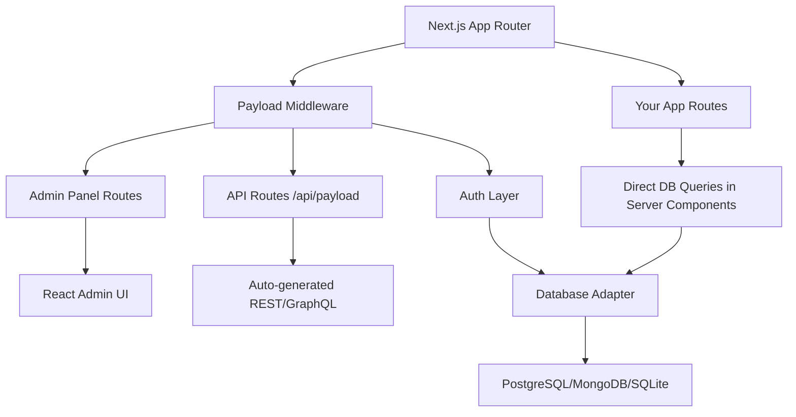

Payload CMS positions itself as the first Next.js-native headless CMS that installs directly into your existing `/app` folder, treating content management as an integrated application framework rather than a standalone service. The [payloadcms/payload repository](https://github.com/payloadcms/payload) has accumulated 43,988 GitHub stars since its January 2021 creation, signaling strong developer interest in an architecture that co-locates frontend and backend code while providing TypeScript-first admin panels, granular access control, and deployment flexibility across serverless platforms. This spotlight examines the repository's technical foundation, maintenance patterns, and practical considerations for teams evaluating modern content management infrastructure.

Unlike traditional headless CMS offerings that operate as separate services, Payload integrates directly into Next.js applications via the App Router, enabling server-component-based database queries without REST or GraphQL layers. The repository bundles authentication, versioning, localization, and block-based layout systems under an MIT license, with official support for PostgreSQL, MongoDB, and experimental Cloudflare D1 through adapter packages. With 949 open issues as of August 2026 and weekly release cadence averaging v3.87.0 by July 31, 2026, the project demonstrates active development while surfacing the complexity of supporting both framework integration and standalone deployment modes.

## Table of Contents

- [Repository Overview and Purpose](#repository-overview-and-purpose)
- [Architecture and Technical Foundation](#architecture-and-technical-foundation)
- [Maintenance and Release Signals](#maintenance-and-release-signals)
- [Intended Users and Use Cases](#intended-users-and-use-cases)
- [Repository Health Indicators](#repository-health-indicators)
- [Evidence-Backed Strengths](#evidence-backed-strengths)
- [Limitations and Adoption Risks](#limitations-and-adoption-risks)
- [Decision Checklist](#decision-checklist)
- [Evidence, Assumptions, and Limitations](#evidence-assumptions-and-limitations)
- [Sources](#sources)
- [FAQ](#faq)

## Repository Overview and Purpose

The [payloadcms/payload repository](https://github.com/payloadcms/payload) delivers a TypeScript-based headless CMS designed to embed within Next.js applications rather than operate as a decoupled service. Created on January 5, 2021, the project addresses the architectural friction of maintaining separate frontend and CMS codebases by offering a unified `/app` folder installation model compatible with React Server Components.

### Core Value Proposition

Payload's stated benefits over traditional CMS platforms include:

- **Unified codebase**: Frontend and backend logic coexist in a single Next.js repository
- **Serverless-first deployment**: Designed for Vercel, Cloudflare Workers, and similar platforms without infrastructure management
- **Type safety**: Automatic TypeScript type generation for content schemas
- **Direct database access**: Query databases within server components, bypassing API layers
- **Full extensibility**: Both admin UI and backend logic accept React component overrides

> [!NOTE]
> The repository describes Payload as both an "app framework" and a "headless CMS," indicating ambitions beyond traditional content management into full-stack application development.

### Repository Scope

The monorepo structure includes:

- Core CMS package (`payload`)
- Database adapters (PostgreSQL via Drizzle, MongoDB, experimental SQLite)
- Storage adapters (Vercel Blob, Azure, S3-compatible services)
- Official plugins (SEO, redirects, nested docs, search)
- Production-ready templates (website, ecommerce)
- Admin UI components and configuration layer

## Architecture and Technical Foundation

*Based on repository structure, README content, and topic tags, the following architectural characteristics are inferred:*

Payload operates as a Next.js middleware layer that intercepts requests, manages authentication via HTTP-only cookies, and renders a React-based admin panel alongside your application routes.

### Technology Stack

| Component | Technology | Notes |
|-----------|------------|-------|
| **Runtime** | Node.js | Server-side execution environment |
| **Framework** | Next.js (App Router) | Required host framework |
| **Language** | TypeScript | Core implementation language |
| **Admin UI** | React | Customizable component library |
| **Databases** | PostgreSQL, MongoDB, SQLite (D1) | Adapter-based support |
| **ORM** | Drizzle (SQL), native drivers (MongoDB) | Abstracted via database adapters |
| **Rich Text** | Lexical | Block-based editor framework |
| **APIs** | REST, GraphQL | Auto-generated from schema config |

### Integration Model



*This diagram represents an architectural interpretation based on the repository's stated integration approach.*

The CMS installs via npm package and initializes within your Next.js configuration file, creating admin routes at a configurable path (default `/admin`) and API endpoints at `/api`. The middleware handles authentication, CSRF protection, and request validation before delegating to your application code.

### Configuration-Driven Schema

Payload defines content models through JavaScript/TypeScript configuration objects rather than GUI-based schema builders:

```typescript
// Inferred example structure from README feature list
const Pages = {
  slug: 'pages',
  fields: [
    { name: 'title', type: 'text', required: true },
    { name: 'content', type: 'richText' },
    { name: 'blocks', type: 'blocks', blocks: [...] },
  ],
  access: {
    read: () => true,
    create: ({ req }) => req.user?.role === 'admin',
  },
}
```

This code-first approach enables version control of schema changes and programmatic access control logic.

## Maintenance and Release Signals


As of August 5, 2026, the repository exhibits these maintenance characteristics:

### Release Cadence

The [latest release v3.87.0](https://github.com/payloadcms/payload/releases/tag/v3.87.0) published on July 31, 2026, demonstrates weekly release intervals during the 3.x series. The changelog includes:

- **Features**: Azure storage improvements for files >5GB
- **Bug fixes**: 11 issues addressed including localization preservation, soft-delete access control, draft title handling
- **Documentation updates**: Link corrections, TypeScript helper documentation
- **Test improvements**: Flaky end-to-end test fixes

> [!TIP]
> The release notes consistently credit individual contributors by GitHub handle, indicating transparent attribution practices and community engagement.

### Commit Activity

- **Last push**: August 5, 2026, 04:08:06 UTC (within 24 hours of data snapshot)
- **Default branch**: `main` with continuous integration via GitHub Actions
- **Contributors**: README footer references a contributors graph, signaling multi-maintainer involvement

### Issue Volume

**949 open issues** as of August 2026 represents a high absolute count that requires context:

| Metric | Value | Interpretation |
|--------|-------|----------------|
| Open issues | 949 | High volume relative to age |
| Repository age | ~5 years | Accumulation over sustained activity |
| Stars | 43,988 | Large user base generating feedback |
| Issue-to-star ratio | ~2.2% | Within range for active projects |

*Open issues are not defect counts but include feature requests, questions, and documentation feedback.*

## Intended Users and Use Cases

Based on repository topics, template offerings, and stated benefits, Payload targets:

### Primary Audiences

1. **Next.js developers** seeking integrated CMS functionality without separate service overhead
2. **Technical founders** building content-driven products on serverless infrastructure
3. **Agencies** delivering client websites with customizable admin panels and deployment flexibility
4. **SaaS builders** requiring multi-tenant content management with granular access control

### Optimal Use Cases

Payload's architecture suits scenarios where:

- **Unified deployment** matters: Teams prefer single-repository, single-deployment workflows
- **Type safety** is critical: TypeScript shops want end-to-end type checking from database to UI
- **Custom admin UIs** are required: Default admin panels need per-project branding or workflow modifications
- **Serverless economics** apply: Projects benefit from pay-per-execution pricing over always-on CMS hosting
- **Direct database access** provides value: Server components can query content without API round-trips

> [!WARNING]
> Teams operating outside the Next.js ecosystem or requiring CMS-agnostic frontend flexibility may find Payload's tight framework coupling limiting compared to traditional headless CMS APIs.

### Template-Indicated Use Cases

The repository includes production templates for:

- **Website**: Content marketing sites with blog, pages, and navigation management
- **Ecommerce**: Product catalogs, cart integration, and order management (marked as "NEW" in README)

These templates demonstrate end-to-end implementations including frontend components, suggesting Payload targets full-stack application delivery rather than pure content API provision.

## Repository Health Indicators

Evaluating the [payloadcms/payload repository](https://github.com/payloadcms/payload) against maintenance sustainability criteria:

### Positive Signals

✅ **Active development**: Last push within 24 hours of data snapshot, weekly releases  
✅ **Not archived**: Repository remains under active maintenance  
✅ **High engagement**: 43,988 stars indicate sustained developer interest  
✅ **Documentation investment**: Homepage at payloadcms.com, linked docs, migration guides  
✅ **Community channels**: Active Discord server, GitHub Discussions board  
✅ **Contributor diversity**: Multi-author release notes, contributor visualization in README  
✅ **Testing infrastructure**: GitHub Actions workflows, end-to-end test references in changelogs  
✅ **Migration support**: Published v2-to-v3 migration guide demonstrates long-term commitment  

### Caution Indicators

⚠️ **High issue count**: 949 open issues require triage capacity assessment  
⚠️ **Major version transitions**: v3.x series suggests breaking changes and potential ecosystem fragmentation  
⚠️ **Dependency on Next.js**: Tight coupling creates exposure to Next.js breaking changes and release cycles  
⚠️ **Adapter complexity**: Multi-database support distributes maintenance burden across distinct codepaths  

### Maintenance Model Assessment

The repository demonstrates characteristics of a **funded open-source project** rather than purely community-driven maintenance:

- Professional release management with structured changelogs
- Multiple official plugins and storage adapters
- Production-ready templates with frontend implementations
- One-click deployment partnerships (Vercel, Cloudflare)

*While the repository is MIT-licensed, the project likely benefits from commercial entity support or sponsorship.*

## Evidence-Backed Strengths

Based on repository analysis and stated features:

### 1. Next.js Native Integration

Payload's `/app` folder installation model eliminates architectural seams present in traditional headless CMS + frontend combinations. Server components can import Payload's API directly rather than making HTTP requests, reducing latency and simplifying authentication flow.

### 2. TypeScript-First Design

The repository is implemented in TypeScript with automatic type generation from content schemas. This provides compile-time safety for content queries and reduces runtime errors from schema mismatches.

### 3. Granular Access Control

The configuration-driven access control system supports:

- Function-based rules with access to request context
- Document-level and field-level permissions
- Role-based and attribute-based authorization

This granularity exceeds many commercial CMS offerings' permission systems.

### 4. Deployment Flexibility

Official templates demonstrate deployment to:

- Vercel (with Neon database and Vercel Blob storage)
- Cloudflare (with Workers, D1, and R2)
- Traditional Node.js servers

This portability reduces vendor lock-in compared to SaaS-only CMS platforms.

### 5. Extensibility Architecture

Both admin UI components and backend hooks accept custom React components or functions, enabling per-project customization without forking the core repository.

### 6. Active Feature Development

Recent releases show ongoing investment in:

- Storage adapter improvements (Azure large file support)
- Localization handling
- UI refinements (folder management, bulk edit)
- Security fixes (draft preview authentication)

## Limitations and Adoption Risks

Every architectural decision involves tradeoffs. Payload's approach surfaces these considerations:

### 1. Next.js Dependency

Payload **requires** Next.js as a host framework. Teams using:

- Astro, SvelteKit, Remix, or other meta-frameworks
- Static site generators like Hugo or Jekyll
- Mobile applications without Next.js backends

...must either adopt Next.js or operate Payload as a separate service, negating its primary architectural benefit.

### 2. Monolithic Deployment Model

Integrating CMS logic into your application bundle means:

- CMS updates require full application redeployment
- Admin panel traffic shares infrastructure with public-facing application
- Database connection pooling must accommodate both content editing and public traffic patterns

Teams with high editorial activity may prefer decoupled CMS infrastructure.

### 3. Database Adapter Maturity Variance

While PostgreSQL and MongoDB adapters receive frequent updates, the README notes Cloudflare D1 support as experimental. Teams targeting specific databases should verify adapter stability and feature parity.

### 4. Learning Curve for Non-Next.js Teams

Payload assumes familiarity with:

- Next.js App Router conventions
- React Server Components
- TypeScript configuration
- Modern Node.js tooling (pnpm, ESM)

Teams without this background face compound learning curves.

### 5. Open Issue Volume Management

949 open issues suggest:

- Feature requests may experience long implementation timelines
- Edge cases in database adapters or specific configurations may lack immediate resolution
- Community support forums likely necessary for troubleshooting

*This is a capacity observation, not a code quality assessment.*

### 6. Breaking Change Risk

The v3.x series represents a major version from v2.x, with published migration guides indicating non-trivial upgrade paths. Teams should anticipate periodic breaking changes requiring code updates.

## Decision Checklist

Use this checklist when evaluating Payload CMS for your project:

### Technical Fit

- [ ] **Next.js commitment**: Team uses or is willing to adopt Next.js (v13+ App Router)
- [ ] **TypeScript proficiency**: Developers comfortable with TypeScript configuration and types
- [ ] **Database alignment**: Preferred database matches a mature Payload adapter (PostgreSQL, MongoDB)
- [ ] **Deployment target**: Hosting platform supports Next.js serverless or traditional Node.js deployments

### Organizational Readiness

- [ ] **Code-first preference**: Team prefers schema-as-code over GUI-based CMS configuration
- [ ] **Maintenance capacity**: Team can track Payload releases and perform periodic upgrades
- [ ] **Support expectations**: Team comfortable with community support channels (Discord, GitHub Discussions)
- [ ] **Customization needs**: Project requires admin UI or access control customization beyond default CMS offerings

### Project Constraints

- [ ] **Timeline**: Adequate time for learning curve if team lacks Next.js experience
- [ ] **Vendor lock-in tolerance**: Acceptable to commit to Payload's architectural patterns
- [ ] **Scalability requirements**: Expected content volume and editorial activity align with self-hosted infrastructure
- [ ] **Migration path**: If replacing existing CMS, data migration strategy is feasible

### Risk Acceptance

- [ ] **Open issue volume**: Comfortable with potential wait times for niche feature requests or bug fixes
- [ ] **Breaking changes**: Team can allocate time for major version migrations
- [ ] **Framework coupling**: Acceptable to tie CMS infrastructure to Next.js release cycle

> [!NOTE]
> Projects answering "yes" to most checklist items demonstrate strong Payload alignment. Projects with multiple "no" answers should evaluate traditional headless CMS alternatives.

## Responsible Adoption Path

For teams proceeding with Payload evaluation:

### Phase 1: Local Proof-of-Concept

1. **Run the quickstart**: `pnpx create-payload-app@latest -t website`
2. **Test database adapter**: Deploy with your production database choice
3. **Implement one content model**: Mirror a real project requirement
4. **Customize admin UI**: Verify extensibility meets branding needs
5. **Query from server components**: Validate performance and developer experience

### Phase 2: Production Readiness Assessment

1. **Deploy to target platform**: Test Vercel/Cloudflare/AWS with your infrastructure
2. **Configure authentication**: Implement production access control rules
3. **Set up storage adapter**: Test media upload workflow with actual asset volumes
4. **Measure performance**: Benchmark server component query times and admin panel responsiveness
5. **Review security posture**: Audit CSRF protection, cookie configuration, and access controls

### Phase 3: Operational Planning

1. **Establish upgrade cadence**: Review release notes frequency and breaking change patterns
2. **Monitor issue tracker**: Identify recurring problems relevant to your use case
3. **Test backup/restore**: Validate database backup procedures and disaster recovery
4. **Document local customizations**: Create upgrade checklists for custom components and access rules
5. **Identify support resources**: Bookmark Discord channels, GitHub Discussions categories, and documentation sections

### Phase 4: Incremental Rollout

- Start with non-critical content types or internal tools
- Migrate high-value content after operational confidence established
- Maintain fallback plan for first 6–12 months of production use

## Evidence, Assumptions, and Limitations

This analysis is based on:

### Primary Evidence Sources

- [Payload CMS repository](https://github.com/payloadcms/payload) metadata as of August 5, 2026
- Repository README content and stated feature lists
- [Latest release v3.87.0](https://github.com/payloadcms/payload/releases/tag/v3.87.0) changelog published July 31, 2026
- Repository topics, license, and language statistics

### Explicit Assumptions

1. **Architectural inferences**: Integration model and data flow diagrams derived from README descriptions rather than code inspection
2. **Use case suitability**: Optimal scenarios inferred from template offerings and stated benefits
3. **Maintenance funding**: Commercial support inferred from professional release management but not explicitly confirmed
4. **Performance characteristics**: Not benchmarked; server component query performance assumed from architectural description

### Analysis Limitations

- **No security audit**: Security claims (CSRF protection, HTTP-only cookies) taken from repository statements
- **No code review**: Implementation quality and test coverage not assessed
- **No user interviews**: Adoption challenges based on architectural analysis rather than practitioner feedback
- **No competitive benchmarking**: Comparison to other headless CMS platforms not performed
- **No version history analysis**: Issue resolution times and breaking change frequency not quantified
- **Database adapter parity**: Feature differences between PostgreSQL, MongoDB, and SQLite adapters not detailed

### Freshness Note

All data reflects repository state as of **August 5, 2026, 06:16 UTC**. Release cadence, issue counts, and feature availability may change.

## Sources

1. [Payload CMS canonical repository](https://github.com/payloadcms/payload)
2. [Payload CMS latest GitHub release](https://github.com/payloadcms/payload/releases/tag/v3.87.0)

---

## FAQ

### What makes Payload different from traditional headless CMS platforms?

Payload installs directly into Next.js `/app` folders as a framework component rather than operating as a separate service. This enables server components to query databases directly without REST/GraphQL APIs, provides unified TypeScript types across frontend and backend, and eliminates the architectural seam between CMS and application code. Traditional headless platforms like Contentful or Strapi operate as standalone services with API-based integration.

### Does Payload require Next.js, or can it work with other frameworks?

Payload is designed specifically for Next.js App Router integration and achieves its primary benefits (server component queries, unified deployment, `/app` folder installation) only within Next.js projects. Teams using other frameworks can run Payload as a standalone Node.js service with REST/GraphQL APIs, but this negates the architectural advantages and positions it similarly to traditional headless CMS options.

### How do I evaluate whether my team has the skills to adopt Payload?

Payload requires proficiency in Next.js App Router conventions, React Server Components, TypeScript configuration, and modern Node.js tooling. Run the quickstart command (`pnpx create-payload-app@latest -t website`) and assess whether your team can navigate the generated codebase, customize content schemas in TypeScript config files, and debug server component data flow. Teams comfortable with these technologies typically have 1–2 week onboarding timelines; teams new to Next.js should budget 4–6 weeks for combined framework and CMS learning.

### What does the 949 open issue count indicate about repository health?

The open issue count reflects total unresolved items including feature requests, questions, edge case reports, and actual bugs across a 5-year repository history with 43,988 stars indicating large user base feedback volume. This is not a defect count. Evaluate repository health by examining recent release cadence (weekly as of July 2026), last commit recency (within 24 hours of August 5, 2026 snapshot), and issue resolution patterns in the tracker rather than absolute open counts.

### Can Payload scale to high-traffic production applications?

Payload's scalability depends on your Next.js deployment architecture and database choice. Serverless deployments on Vercel or Cloudflare Workers scale horizontally through the platform's auto-scaling, while traditional Node.js deployments require standard load balancing and database optimization. The admin panel shares infrastructure with public routes, so high editorial activity during traffic spikes requires capacity planning. Server component database queries bypass API layers, reducing latency, but also mean CMS load and public traffic compete for the same database connections. Teams should benchmark their specific content volume and query patterns during proof-of-concept phases.

### How does Payload handle authentication and security?

Payload implements authentication via HTTP-only cookies (preventing XSS-based token theft) and includes CSRF protection. Access control operates through TypeScript functions with access to request context, enabling document-level and field-level permission rules. The configuration-driven approach allows role-based, attribute-based, or custom authorization logic. Recent releases (v3.87.0 changelog) show ongoing security improvements including draft preview authentication fixes, indicating active security maintenance. However, this analysis did not include independent security audit, so teams should review Payload's security documentation and conduct their own assessment.

### What happens if I need to migrate away from Payload in the future?

Payload stores content in your chosen database (PostgreSQL, MongoDB, SQLite) using standard schemas, so your data remains accessible via direct database queries. Migrating away requires exporting content via Payload's APIs or database dumps and transforming to your new platform's schema. The tight Next.js integration means admin UI customizations and access control logic written as Payload configurations require rewriting for new systems. Teams concerned about migration should implement content export scripts early and maintain schema documentation independent of Payload configuration files.
