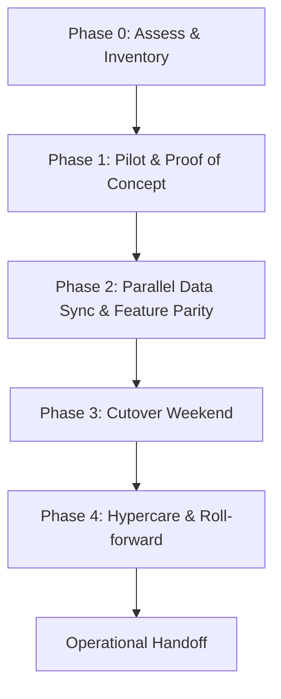

Executive summary

This guide helps engineering leaders decide whether to migrate from Dolibarr to Odoo and, if they proceed, how to execute the migration safely. It compares the two codebases and operational models using canonical repository signals, outlines an inventory-driven phased migration plan, lists the major compatibility risks you must validate, and provides a concrete test and rollback strategy suitable for production-critical ERP/CRM systems.

Use this document when you have an existing installation of Dolibarr (see the Dolibarr canonical repository) and are evaluating Odoo (see the Odoo canonical repository) as a target. The guidance below is grounded only in the repositories and release metadata supplied in the Sources and inferences drawn from their READMEs and repository metadata; where conclusions are inferred from README or repo structure they are explicitly labeled.

Table of contents

- [When to consider migrating](#when-to-consider-migrating)
- [Suitability assessment: quick comparison](#suitability-assessment-quick-comparison)
- [Inventory and discovery checklist](#inventory-and-discovery-checklist)
- [Compatibility risks and mapping matrix](#compatibility-risks-and-mapping-matrix)
- [Phased migration plan (execution)](#phased-migration-plan-execution)
  - [Phase 0: Decision gates](#phase-0-decision-gates)
  - [Phase 1–4 overview](#phase-1-4-overview)
- [Test strategy and validation matrix](#test-strategy-and-validation-matrix)
- [Data and API migration concerns](#data-and-api-migration-concerns)
- [Rollback gates and safety exits](#rollback-gates-and-safety-exits)
- [Cases where migration is not justified](#cases-where-migration-is-not-justified)
- [Decision / Action checklist](#decision--action-checklist)
- [Evidence, assumptions, and limitations](#evidence-assumptions-and-limitations)
- [Sources](#sources)
- [FAQs](#faqs)

## Table of contents

- [When to consider migrating](#when-to-consider-migrating)
- [Suitability assessment: quick comparison](#suitability-assessment-quick-comparison)
- [Inventory and discovery checklist](#inventory-and-discovery-checklist)
- [Compatibility risks and mapping matrix](#compatibility-risks-and-mapping-matrix)
- [Phased migration plan (execution)](#phased-migration-plan-execution)
- [Test strategy and validation matrix](#test-strategy-and-validation-matrix)
- [Data and API migration concerns](#data-and-api-migration-concerns)
- [Rollback gates and safety exits](#rollback-gates-and-safety-exits)
- [Cases where migration is not justified](#cases-where-migration-is-not-justified)
- [Decision / Action checklist](#decision-action-checklist)
- [Evidence, assumptions, and limitations](#evidence-assumptions-and-limitations)
- [FAQs](#faqs)

## When to consider migrating

Consider migration when your evaluation criteria align with business objectives that cannot be met by incremental changes to the current Dolibarr instance and when the organization is ready for the operational and technical changes a new platform implies.

Typical drivers (to validate in your context):
- Need for specific Odoo apps or ecosystem connectors that Dolibarr cannot supply out-of-the-box.
- Desire to standardize stacks across multiple subsidiaries where Odoo is already used.
- Requirement for features or integrations documented in Odoo's app ecosystem.

Do not decide solely on repository popularity or star counts. The technical comparison below uses repository metadata and README-described features to surface the areas you must evaluate; it does not assume one product is automatically better than the other.

## Suitability assessment: quick comparison

This table summarizes repository-level signals and README-declared characteristics you must treat as decision inputs. All fields cite the supplied repositories.

| Attribute | Dolibarr (source) | Odoo (source) | Notes / Decision implication |
|---|---:|---:|---|
| Primary language | PHP (Dolibarr README + repo metadata) | Python (Odoo repo metadata) | Different runtime stacks; plan for new runtime, packaging, and ops model |
| License | GPL-3.0 (Dolibarr repo metadata) | NOASSERTION (Odoo repo metadata) | Review Odoo licensing before commercial deployments |
| Repo signals (stars / forks / open issues) | 7,405 stars • 3,456 forks • 1,092 open issues (as supplied) | 52,968 stars • 33,090 forks • 10,068 open issues (as supplied) | Stars/forks are interest signals; open issues are not defect counts (see rules) |
| Extensibility model | Modules / hooks; PHP modules and marketplace (README) | Apps ecosystem and modular architecture (README) | Both are modular but imply different extension languages and marketplaces |
| DB support | MySQL / MariaDB / PostgreSQL mentioned in README | (Odoo README does not list DB here) | Confirm target DB compatibility; Dolibarr explicitly lists supported DBs |
| Official deployment formats | Docker image & packaged OS installers mentioned (README) | Odoo provides docs and runbot badges (README) | Operational differences: packaging, upgrade workflow, and vendor tools |

Sources: Dolibarr [repository and README](https://github.com/Dolibarr/dolibarr) and Odoo [repository](https://github.com/odoo/odoo).

> [!NOTE]
> This table uses repository metadata and README summaries supplied in Sources. Architectural conclusions that are inferred from the READMEs or repository structure are explicitly labelled in subsequent sections.

## Inventory and discovery checklist

Before any technical work, produce an inventory of the existing Dolibarr deployment. The migration scope must be driven by a line-item inventory.

Inventory table (minimum required items):

| Item | Why capture it | Example source of truth |
|---|---|---|
| Dolibarr version and install type | Upgrade/compatibility constraints, module compatibility | Application "About" page, file headers, or git tag used for deploy |
| Database engine and version | Schema translation strategy | DB admin (mysqld, mariadb, postgresql) |
| Enabled modules (core + third-party) | Functional parity mapping and custom code surface | Dolibarr admin / modules list |
| Custom modules or patches | Migration effort; rewrite vs adapt | Git repo of custom code, site plugins directory |
| Number and type of documents (invoices, attachments) | Data volume and migration throughput | File storage location, DB table counts |
| Integrations (payment gateways, email, LDAP, telephony) | Rebuild vs adapt integration points | Integration config files, webhook endpoints |
| Authentication model | User migration and SSO strategy | Local accounts, LDAP, OAuth providers |
| Reporting and accounting frameworks | Reconciliation and compliance mapping | Report templates, account mappings |
| Backup status and last successful restore | Rollback readiness | Backup server logs or retention policy |

Document each item and attach an owner, a small effort score (T-shirt: S/M/L), and a business criticality rating. These are organizationally specific—capture them early.

> [!TIP]
> If you run Dolibarr in Docker (the README mentions a Docker image), include the Dockerfile, image tags, and volume mappings in the inventory—these simplify rebuild or rollback operations.

## Compatibility risks and mapping matrix

Migration risk arises from mismatch in data model, business logic embedded in extensions, runtime differences (PHP → Python), and integrations.

Compatibility mapping matrix (sample fields to validate):

| Domain | Dolibarr source detail (evidence) | Odoo equivalent to validate | Risk level (guide) |
|---|---|---|---|
| Contacts / Third parties | Dolibarr core module (README lists third-party management) | Odoo Contacts / res.partner model | High if custom fields used |
| Products / catalog | Product, stock, BOM mentioned in Dolibarr README | Odoo product.product, mrp, inventory | High for variant and BOM mapping |
| Accounting / Invoices | Invoicing and accounting features listed in Dolibarr README | Odoo Accounting module | High due to regulatory fields and ledger mapping |
| Document attachments | Flexible PDF & ODT generation and documents storage (README) | Odoo attachments and filestore | Medium—file path and ACL differences |
| APIs | Dolibarr README mentions REST, SOAP APIs | Odoo has XML-RPC / JSON-RPC APIs (inferred from Odoo ecosystem docs; confirm in target) | Medium—protocol adaptation required |
| Custom modules | Hook/trigger architecture in Dolibarr README | Odoo addons in Python | High—custom PHP code needs porting or replacement |

Labelled inference: The Dolibarr README explicitly states PHP, modules, APIs and supported DBs. Odoo repo metadata shows Python; specific API endpoints are not listed in the supplied Odoo README, so any API mapping must be validated against Odoo documentation.

## Phased migration plan (execution)

This section gives a practical 0–4 phase plan you can adapt. Each phase ends with a decision gate.

### Phase 0: Decision gates

Do not start a full migration until:
- Inventory complete and owners assigned.
- Regulatory fields identified and mapped (VAT, ledger codes, regional taxes mentioned in Dolibarr README).
- A clear business case and sponsorship exist.

Gate: If too many custom PHP modules with tight coupling to Dolibarr internals exist, prefer rewriting only parts or keep Dolibarr.

### Phase 1: Pilot & Proof of Concept (PoC)

Objectives:
- Stand up an Odoo instance (test/dev) and recreate 2–3 critical workflows (e.g., customer create → invoice → payment) using small datasets.
- Validate authentication and an example integration (e.g., email or payment gateway found in Dolibarr config).
- Estimate work to reimplement custom Dolibarr modules as Odoo addons or find marketplace equivalents.

Gate: Proceed only if PoC demonstrates basic SKU, contact, invoice flows and integration adapters can be implemented.

### Phase 2: Parallel Data Sync & Feature Parity

Objectives:
- Implement data migration scripts for master data (partners, products, accounts). Use idempotent transformations.
- Run incremental sync from Dolibarr to Odoo for live testing; do not switch production yet.
- Implement reconciliation reports to compare balances, counts, and CRCs between systems.

Gate: Stop if reconciliation fails for critical datasets or if latency/throughput of migration is unacceptable for the cutover window.

### Phase 3: Cutover Weekend

Objectives:
- Final freeze on writes to Dolibarr at a scheduled time.
- Full export and final import of transactional data produced since sync began.
- Run automated validation suites and manual spot checks.
- Switch DNS/load balancer to point to Odoo and monitor.

Gate: Abort and rollback to Dolibarr if critical validations (e.g., opening balances, unpaid invoices, or tax calculation) do not match within agreed tolerances.

### Phase 4: Hypercare & Roll-forward

Objectives:
- 72 hours of elevated support for reconciliations and bug fixes.
- Finalize remaining integrations and migrate non-critical reports.
- Plan post-migration training and decommissioning of Dolibarr.

Gate: Continue to roll forward while tracking residual parity items in a backlog with owners.

## Test strategy and validation matrix

A practical test strategy must combine automated checks with business sign-offs.

Testing table (recommended checks):

| Test category | What to verify | Pass criteria |
|---|---|---|
| Schema and row counts | Table counts for core tables (partners, products, invoices) | Counts match or explainable differences (archived/soft-deleted) |
| Financial reconciliation | Trial balance, customer outstanding sums, VAT totals | Sums match within rounding and currency rules |
| Business workflows | Create-to-pay: quote → order → invoice → payment | End-to-end flows succeed in Odoo as they did in Dolibarr |
| Attachment integrity | Open sample PDFs and ODT documents after migration | Documents accessible and intact |
| Integrations | Webhooks and external connectors (email, payment) operate | External systems receive expected payloads |
| Performance | API latency for typical queries | Meets SLA for operational use (define your target) |

Automate as much as possible. Use data-driven tests where a migration transformation step can be validated by running the same business operation against both systems and comparing outputs.

> [!WARNING]
> Financial and compliance fields are high-risk. Do not cut over until accounting reconciliations are validated by finance stakeholders.

## Data and API migration concerns

Key technical considerations:
- Data model translation: Dolibarr and Odoo use different schemas; canonical mappings (partner → res.partner, product → product.product) must be defined and version-controlled.
- Referential integrity: Preserve original IDs where business processes or external integrations rely on them, or maintain a reliable ID mapping table.
- Attachments and filestore: Migrate filesystem documents into Odoo filestore or an external document store; verify ACL and path differences.
- API surface: Dolibarr exposes REST/SOAP (README). Odoo typically exposes RPC/JSON APIs (confirm in Odoo docs). Build adapters or ETL that can push/pull data reliably.
- Incremental sync: Implement CDC (change data capture) or incremental export to avoid long downtime windows.

Data migration examples (operational items to prepare):
- Master data first: partners, products, tax codes, chart of accounts.
- Historical transactions next within agreed retention (invoices, payments, stock movements).
- Archive-only data later (old logs, non-financial history).

> [!TIP]
> Maintain a migration ledger: a table that records source ID, target ID, timestamp, transformation version, and operator. This simplifies audits and rollbacks.

## Rollback gates and safety exits

Your cutover plan must define explicit rollback gates with measurable criteria.

Rollback gate examples:
- Validation failure: If account balances mismatch above a defined threshold (e.g., >0.5% or a fixed amount — define by finance team), rollback.
- Critical functional failure: If critical workflows (invoicing or payment capture) fail beyond a timebox, rollback.
- Performance regression: If response times cause operational outages for users, rollback.

Rollback procedure (high level):
1. Repoint traffic to Dolibarr (DNS or load balancer). Ensure a tested network path for fast switch.
2. Restore any modified Dolibarr config or temp migration-only flags.
3. Reopen data entry in Dolibarr and capture new transactions since cutover attempt.
4. Re-plan a cutover window with fixes and additional validation.

Maintain backups and tested restore procedures for both DB and file storage. The Dolibarr README specifically calls out backup and upgrade guidance; use the documented backup steps as part of pre-cutover validation.

## Cases where migration is not justified

Consider deferring or cancelling migration when one or more of the following apply:
- The Dolibarr installation relies heavily on bespoke PHP modules that implement core business logic and cannot be cleanly replaced or reimplemented in Odoo within acceptable cost.
- The operating team has no capacity to operate a new runtime (Python) and cannot secure support or staff upskilling.
- Regulatory or accounting constraints require data representations or workflows present only in Dolibarr and not available in Odoo without expensive customization.
- The total cost of migration (development, testing, data reconciliation, lost productivity) exceeds the expected benefit within the planning horizon.

If any of these apply, it is often better to invest in incremental improvements or pay for commercial extensions/support for Dolibarr rather than migrate the whole platform.

## Decision / Action checklist

- [ ] Complete full inventory (owners assigned)
- [ ] Produce mapping for partners, products, accounts, tax codes
- [ ] Identify and catalogue custom modules and their owners
- [ ] Run a PoC in a sandbox Odoo instance and validate 2–3 critical workflows
- [ ] Implement and run automated reconciliation scripts for finance data
- [ ] Prepare final cutover runbook with rollback gates and contact list
- [ ] Schedule cutover with a freeze window agreed by business teams
- [ ] Run cutover and monitor with dedicated response team for 72 hours

## Evidence, assumptions, and limitations

Evidence used (retrieval/generation date):
- Dolibarr repository metadata and README content from the supplied canonical repository: https://github.com/Dolibarr/dolibarr (data retrieved and supplied in Editorial Data). Generated at 2026-07-13T01:49:05.920271+00:00.
- Dolibarr latest release notes (23.0.3) as supplied: https://github.com/Dolibarr/dolibarr/releases/tag/23.0.3 (published 2026-05-17; included in Editorial Data).
- Odoo repository metadata from the supplied canonical repository: https://github.com/odoo/odoo (data retrieved and supplied in Editorial Data).

Assumptions and limitations:
- Inferred architecture: Where I state architectural items (language, DB support, extensibility), these are inferred from the supplied README and repo metadata and are explicitly called out as such. For example, Dolibarr is explicitly described as PHP with DB options listed in its README; Odoo is recorded as Python at repo metadata level in the supplied Editorial Data.
- No external documentation or product roadmaps beyond the supplied repositories were consulted; consequently, any API details for Odoo must be validated against Odoo's live documentation.
- Star/fork/open-issue counts are repository signals supplied in Editorial Data and are not used as measures of production usage or quality.

## Sources

- Dolibarr canonical repository: https://github.com/Dolibarr/dolibarr
- Dolibarr latest GitHub release (23.0.3): https://github.com/Dolibarr/dolibarr/releases/tag/23.0.3
- Odoo canonical repository: https://github.com/odoo/odoo

## FAQs

1. Q: Do I need to rewrite Dolibarr custom modules in Python to run on Odoo?
   A: If a module contains business logic tied to Dolibarr internals, it must either be reimplemented as an Odoo addon (Python) or replaced by an available Odoo app. Evaluate each custom module in the inventory phase.

2. Q: Can I preserve Dolibarr IDs in Odoo?
   A: You can preserve source IDs by maintaining an ID mapping table during migration. This is commonly used when external systems reference source IDs, but it requires careful planning for uniqueness and referential integrity.

3. Q: How long should the cutover freeze be?
   A: Freeze duration depends on data volume and migration throughput; plan a conservative window, validate with a full-dress rehearsal, and prefer incremental sync to minimize freeze time. Exact timing must be measured in your PoC.

4. Q: Are there built-in tools to migrate from Dolibarr to Odoo?
   A: The supplied sources do not list a dedicated migration tool. Prepare ETL scripts or middleware adapters tailored to your data model and volume.

5. Q: Will users notice downtime after cutover?
   A: If the cutover and data reconciliation are successful, user-visible downtime can be minimal. Plan communications, a support rota, and training to reduce perceived disruption.

6. Q: What are the biggest technical risks?
   A: Finance/accounting data, custom business logic in PHP modules, and external integrations are the highest technical risks. Validate these early in the PoC and maintain rollback gates.

<!-- SEO & metadata -->

<!-- Canonical URL -->

Canonical: https://madewithwhat.net/dolibarr-to-odoo-migration-guide

<!-- Open Graph -->

og:title: Migrating from Dolibarr to Odoo: Decision & Execution Guide
og:description: A practical migration decision and execution guide from Dolibarr to Odoo covering suitability, inventory, risks, phased plan, tests, data/API concerns, rollback gates, and no-go cases.
og:image: https://madewithwhat.net/assets/2026/07/10/migration-guide-dolibarr-odoo-19-cover.jpg
og:url: https://madewithwhat.net/dolibarr-to-odoo-migration-guide

<!-- Article schema (minimal) -->

## FAQ

### Do I need to rewrite Dolibarr custom modules in Python to run on Odoo?

If a module contains business logic tied to Dolibarr internals, it must either be reimplemented as an Odoo addon (Python) or replaced by an available Odoo app. Evaluate each custom module during inventory.

### Can I preserve Dolibarr IDs in Odoo?

You can preserve source IDs by keeping an ID mapping table during migration, which helps with external references but requires careful planning to ensure uniqueness and referential integrity.

### How long should the cutover freeze be?

Freeze duration depends on data volume and migration throughput and should be measured during a PoC and full-dress rehearsal. Use incremental sync to reduce the freeze window.

### Are there built-in tools to migrate from Dolibarr to Odoo?

The supplied sources do not list a dedicated migration tool. Prepare ETL scripts or middleware adapters tailored to your specific data model and volume.

### What are the biggest technical risks?

Finance/accounting data, bespoke PHP modules implementing core logic, and external integrations are the highest technical risks and should be validated early with reconciliation scripts.

### What evidence did this guide use?

This guide is grounded in the supplied Dolibarr and Odoo repository metadata and the Dolibarr release notes provided in the Sources. Retrieval/generation timestamp: 2026-07-13T01:49:05.920271+00:00.
