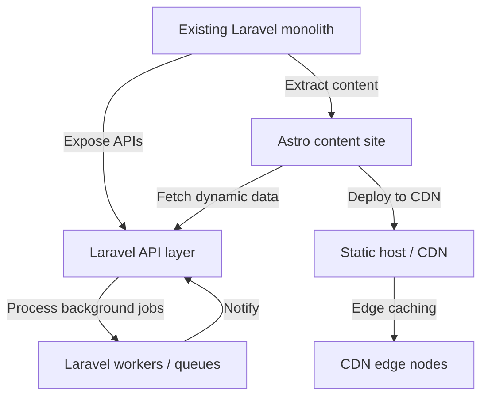

# Astro vs Laravel — Which framework fits your project?

Executive summary

Astro and Laravel target different problem spaces and development models. Astro (TypeScript) is oriented toward content-driven websites, static output, and component-driven front-end integration; the GitHub repository describes it as a website build tool focused on lightweight output and developer experience and lists topics such as "static-site-generator", "islands", and "components" ([Astro repo](https://github.com/withastro/astro)). Laravel (PHP) is a full-stack web application framework emphasizing routing, dependency injection, queues, migrations and server-side features suitable for data-driven, transactional applications ([Laravel repo](https://github.com/laravel/framework)).

Use this comparison to decide which fits a real project. Below you'll find a decision matrix, trade-off table, workload-fit analysis, migration guidance, and explicit recommendations for four project profiles. Repository facts, release notes, and repo metadata cited here are accurate as of data retrieval: 2026-07-13T01:52:19Z.

Table of contents

- [Quick facts snapshot](#quick-facts-snapshot)
- [Decision matrix (side-by-side)](#decision-matrix-side-by-side)
- [Trade-offs and architecture implications](#trade-offs-and-architecture-implications)
- [Workload-fit analysis and project profiles](#workload-fit-analysis-and-project-profiles)
  - [Profile recommendations (4 projects)](#profile-recommendations-4-projects)
- [Migration considerations and integration patterns](#migration-considerations-and-integration-patterns)
- [Operational considerations — hosting, CI/CD, and releases](#operational-considerations--hosting-ci-cd-and-releases)
- [Decision checklist / Action checklist](#decision-checklist--action-checklist)
- [Evidence, assumptions, and limitations](#evidence-assumptions-and-limitations)
- [Sources](#sources)
- [FAQs](#faqs)

## Table of contents

- [Quick facts snapshot](#quick-facts-snapshot)
- [Decision matrix (side-by-side)](#decision-matrix-side-by-side)
- [Trade-offs and architecture implications](#trade-offs-and-architecture-implications)
- [Workload-fit analysis and project profiles](#workload-fit-analysis-and-project-profiles)
- [Migration considerations and integration patterns](#migration-considerations-and-integration-patterns)
- [Operational considerations — hosting, CI/CD, and releases](#operational-considerations-hosting-ci-cd-and-releases)
- [Decision checklist / Action checklist](#decision-checklist-action-checklist)
- [Evidence, assumptions, and limitations](#evidence-assumptions-and-limitations)
- [Visual data (supporting image)](#visual-data-supporting-image)
- [FAQs](#faqs)

## Quick facts snapshot

This section lists repository and release facts drawn from the projects' canonical repositories and latest releases.

| Attribute | Astro | Laravel |
|---|---:|---:|
| Repository | [withastro/astro](https://github.com/withastro/astro) | [laravel/framework](https://github.com/laravel/framework) |
| Primary language | TypeScript | PHP |
| Category (from editorial data) | Frameworks — content-driven websites | Frameworks — web applications |
| GitHub stars (repo metadata) | 60,968 | 34,795 |
| Forks | 3,624 | 11,916 |
| Open issues (at retrieval) | 118 | 121 |
| Latest release (tag) | astro@7.0.7 (published 2026-07-08) | v13.19.0 (published 2026-07-07) |
| Homepage | https://astro.build | https://laravel.com |

Sources for the table above: the Astro repo and release pages and the Laravel repo and release notes as linked in Sources below. Data retrieval/generation date: 2026-07-13T01:52:19Z.

> [!NOTE]
> Stars, forks, and open issues are repository metadata used as interest signals. They are not direct measures of project suitability, maintenance health, or production usage.

## Decision matrix (side-by-side)

This matrix focuses on explicit repository facts and topics from the projects' metadata. Where a conclusion is derived from repository topics, documentation or README structure it is labeled as "Inferred from repo".

| Decision criterion | Astro (facts / inferred) | Laravel (facts / inferred) |
|---|---|---|
| Primary target scenarios | Content-driven websites, lightweight output (repo description) | Full web applications with routing, DI, queues, migrations (README summary) |
| Language & ecosystem | TypeScript / JavaScript ecosystem (fact) | PHP ecosystem (fact) |
| Rendering model | Static-first, builds/site generation emphasized (Inferred from topics: "static-site-generator", "static") | Server-side rendering / runtime PHP (Inferred from docs: routing, server features) |
| Component model | Multi-framework components supported via official integrations (topics list shows React, Vue, Svelte integrations) (fact) | Blade templating + server-side components (Inferred from Laravel docs summarized in README) |
| Integrations & adapters | Multiple official integrations (React, Vue, Svelte, Node, adapters) (fact) | Framework core includes routing, queues, caching; ecosystem via Composer packages (fact) |
| Typical hosting targets | Static hosts, CDNs, serverless adapters (Inferred from integrations and static focus) | PHP-capable servers, platform-as-a-service, containerized environments (Inferred from language/runtime) |
| Release cadence (recent) | Latest patch release astro@7.0.7 (2026-07-08) (fact) | Latest v13.19.0 (2026-07-07) (fact) |

## Trade-offs and architecture implications

This section translates repository facts and README themes into practical trade-offs. Architectural conclusions drawn from READMEs, topics or repository structure are explicitly labeled.

| Area | Trade-off (what you give up) | Outcome (what you gain) |
|---|---|---|
| Output size & client JS | Choosing Astro (static-first) may reduce runtime JS shipped to clients — you trade client-side interactivity by default for smaller payloads (Inferred from "lightweight output" and "islands") | Smaller default payloads for content sites and flexible per-component hydration where needed (Inferred) |
| Backend features | Choosing Laravel means more built-in server-side features (queues, migrations, DI) but you trade the simplicity of static hosting and JS-centric toolchains (fact: Laravel focuses on server features) | Full server capabilities, robust backend primitives, and a mature PHP ecosystem (fact) |
| Developer language & tooling | Astro locks you into JavaScript/TypeScript tooling (npm, Vite, etc. inferred from repo) while Laravel uses PHP & Composer workflows | Aligns with team skills: use Astro if team is JS-first; Laravel if team is PHP-first (inferred) |
| Integration flexibility | Astro supports multiple front-end component frameworks via official integrations (fact) but is not a replacement for a general server app framework | Ability to combine front-end frameworks with static content; not intended for heavy transactional backend logic (inferred) |

> [!TIP]
> If your product needs both content performance and transactional server logic, consider a hybrid approach: use Astro for the public content footprint and Laravel for the authenticated, data-heavy API/services. See the migration section for integration patterns.

### Inferred architectural notes (explicit)

- Inferred from Astro repository topics and README structure: Astro emphasizes static-site generation, component islands, and integrations with multiple front-end frameworks. That suggests an architecture where server-side rendering is optional and client JS is minimized.
- Inferred from Laravel README: Laravel provides routing, DI container, migrations, queues and broadcasting — a typical monolithic server-side application architecture serving HTML and JSON endpoints.

These inferences are derived from repo metadata and README summaries; they are not runtime benchmarks or usage claims.

## Workload-fit analysis and project profiles

Below are four concrete project profiles and tailored recommendations grounded in repository facts and the documented focuses of each project. Each recommendation explains the primary reasons and migration/integration implications.

Profiles:
1. Content marketing site / documentation site
2. E-commerce store with payments and admin
3. SaaS dashboard with authenticated users, background jobs
4. Blog with editorial workflows and high SEO needs

### Profile recommendations (4 projects)

1) Content marketing site / documentation site
- Recommendation: Astro
- Why (facts/inference): Astro's repo describes it as a website build tool for content-driven websites and lists topics such as "static-site-generator" and "content" ([Astro repo](https://github.com/withastro/astro)). These are direct signals that Astro is designed for static output and content projects.
- Migration/Workload fit: Use Astro's content collections and MD/MDX integrations (inferred from integrations list). Host on static/CDN platforms to benefit from small payloads.

2) E-commerce store with payments and admin
- Recommendation: Laravel (with possible Astro front-end)
- Why: Laravel's README highlights server-side concerns — routing, DI, sessions, cache, queues and migrations — all of which are central to transactional systems and backend workflows ([Laravel repo](https://github.com/laravel/framework)). For secure payment flows, server-side control of transactions and background job processing (queues) is a requirement.
- Migration/Workload fit: Build the transactional APIs, order processing, authentication, and admin in Laravel. Use Astro for the product catalog and marketing pages if you want separate fast, content-focused storefront pages.

3) SaaS dashboard with authenticated users and background jobs
- Recommendation: Laravel
- Why: Laravel explicitly lists background job processing (queues), session and cache backends, and a DI container in its README — patterns commonly needed by SaaS backends. These are repository-stated features ([Laravel repo](https://github.com/laravel/framework)).
- Migration/Workload fit: Laravel provides the server primitives; you can progressively add a SPA or component-based front end (React/Vue) inside Laravel, or split the UI into Astro for public docs and Laravel for authenticated endpoints.

4) Blog with editorial workflows and high SEO needs
- Recommendation: Astro
- Why: Astro's focus on content-driven sites and integrations like MDX and sitemap support (listed among integrations/topics) indicate strong fit for blogs and SEO-optimized content. Astro's static-first outputs help SEO via pre-rendered HTML (inferred from topics and project description) ([Astro repo](https://github.com/withastro/astro)).
- Migration/Workload fit: Migrate content into Astro content collections; use SSR adapters only when dynamic server-side preview is necessary.

> [!WARNING]
> Choosing a front-end tool for a data-rich, transactional application without planning a server-side backend will lead to architectural rework. Astro is not a drop-in replacement for backend frameworks: if you need server-side features such as job queues or database migrations, you should plan for a backend like Laravel.

## Migration considerations and integration patterns

If your current stack is moving toward a static content-first experience or consolidating a PHP backend, here are practical paths.

Migration patterns (high level):

- Front-end split (preferred for gradual migration): Keep Laravel as the API and admin backend; migrate public content to Astro. Use API endpoints in Laravel for dynamic features (cart, user data) and serve static marketing pages from Astro on a CDN.
- Monolith modernization: If you have a Laravel monolith and want to reduce client JS on marketing pages, progressively replace public blade templates with prebuilt Astro pages that call the same Laravel APIs where needed.
- Hybrid SSR: Use Astro for static pages; use server adapters (Astro supports server adapters — inferred from integrations list) for pages that require server-side rendering. For APIs and jobs, keep Laravel.

Mermaid migration flow

Steps and considerations:
- Authentication: If Astro pages require authenticated sessions, implement token-based auth calling the Laravel API; preserve secure cookie flows on Laravel where APIs are same-origin or proxied.
- Data contracts: Introduce stable API endpoints in Laravel and version them before migrating front-end consumers.
- CI/CD: Treat Astro builds as part of the front-end pipeline with static artifacts; treat Laravel as backend service builds/deployments.

## Operational considerations — hosting, CI/CD, and releases

Facts and inferred hosting patterns:
- Astro: Given its static-site and adapter topics (Inferred from repo topics and integrations), typical deployments are to static hosts, CDNs, or serverless adapters. Astro releases are maintained and recently updated (astro@7.0.7 published 2026-07-08) ([Astro release](https://github.com/withastro/astro/releases/tag/astro%407.0.7)).
- Laravel: Being PHP-based, Laravel applications typically run on PHP-capable platforms or containers; its release v13.19.0 was published 2026-07-07 ([Laravel release](https://github.com/laravel/framework/releases/tag/v13.19.0)).

CI/CD notes (inferred):
- Astro builds are typically run during the front-end artifact stage (npm install + build), producing static assets. Integrations and Vite-based toolchains are suggested by repository tooling references (Inferred).
- Laravel requires Composer dependency installs and can benefit from build steps like configuration caching, migrations, and worker orchestration in CI/CD.

Release timing facts:
- Both projects had non-prerelease updates in early July 2026 per the repositories' latest-release metadata linked in Sources. Use the releases as signals for maintenance cadence, but map to your own release windows.

## Decision checklist / Action checklist

- [ ] Confirm primary runtime preference: TypeScript/Node (Astro) or PHP (Laravel).
- [ ] Audit functional requirements: Do you need server-side queues, migrations, persistent sessions? If yes, favor Laravel.
- [ ] For content-heavy public pages: prototype in Astro and measure page weight and build complexity.
- [ ] If mixing stacks: design stable API contracts in Laravel before migrating front-end to Astro.
- [ ] Plan CI/CD: Astro static builds in a front-end pipeline; Laravel in a server/service pipeline with migration steps.
- [ ] Validate integrations: confirm that Astro integrations cover your chosen front-end framework (React/Vue/Svelte) by checking the Astro integrations list ([Astro repo](https://github.com/withastro/astro)).

## Evidence, assumptions, and limitations

Evidence used
- Repository metadata and latest release notes for Astro: [withastro/astro](https://github.com/withastro/astro) and its release tag astro@7.0.7 ([release](https://github.com/withastro/astro/releases/tag/astro%407.0.7)).
- Repository metadata and latest release notes for Laravel: [laravel/framework](https://github.com/laravel/framework) and its release v13.19.0.
- Data retrieval/generation timestamp: 2026-07-13T01:52:19Z. All repository facts (stars, forks, open issues, languages, release dates) reflect values available at retrieval.

Assumptions and explicit inferences
- Where I describe Astro as "static-first" or reference "islands" and integrations, these are inferred from the project's README content, topics list, and integrations referenced in the repository. Those architectural conclusions are explicitly labelled earlier in the article.
- I assume typical hosting and CI/CD patterns based on language/runtime and repository topics; those are inferred and not direct claims from the codebase.

Limitations
- This article does not contain performance benchmarks, market adoption percentages, or security vulnerability claims beyond repo-provided release notes. Those would require independent measurement or external data sources not provided with this brief.
- The article relies only on the supplied canonical repositories and their release notes. External ecosystem tools, third-party libraries, or platform-specific behavior are not referenced.

## Sources

- Astro canonical repository: https://github.com/withastro/astro
- Astro latest GitHub release (astro@7.0.7): https://github.com/withastro/astro/releases/tag/astro%407.0.7
- Laravel canonical repository: https://github.com/laravel/framework

## Visual data (supporting image)

## FAQs

Q: Are Astro and Laravel competing frameworks?
A: They overlap in the broad sense of "web frameworks" but target different layers: Astro is centered on content-driven, static-first front ends (TypeScript/JS ecosystem), while Laravel is a full-stack PHP backend framework. The repositories and READMEs indicate different primary use cases ([Astro repo](https://github.com/withastro/astro), [Laravel repo](https://github.com/laravel/framework)).

Q: Can I use Astro with a Laravel backend?
A: Yes. A common pattern is to host public content in Astro and use Laravel as an API/backend for transactional features. This hybrid approach separates static artifacts from dynamic server responsibilities (inferred integration pattern).

Q: Does Astro replace server-side features like queues and migrations?
A: No. Astro focuses on front-end/content output. Server-side primitives like job queues and database migrations are explicit features of Laravel's framework ([Laravel repo](https://github.com/laravel/framework)).

Q: Which language ecosystems do I need to staff for each option?
A: Astro requires JavaScript/TypeScript skills and associated tooling (npm, Vite-style toolchains inferred from repo topics). Laravel requires PHP expertise and Composer-based workflows. Choose based on team strengths.

Q: Are the release cadences comparable?
A: Both projects had patch releases in early July 2026 (Astro astro@7.0.7 on 2026-07-08; Laravel v13.19.0 on 2026-07-07), indicating active maintenance. Use repo releases as signals but validate against your CI/CD schedule.

Q: Where can I find official documentation?
A: Astro's homepage/documentation is https://astro.build (referenced from repo metadata). Laravel's docs and learning resources are at https://laravel.com (referenced from repo metadata).

---

Article metadata (for site use):

Canonical URL: https://madewithwhat.net/astro-vs-laravel
Open Graph title: "Astro vs Laravel — Which framework fits your project?"
Open Graph description: "Compare Astro and Laravel for real projects with decision matrix, trade-offs, migration notes and recommendations. Data as of 2026-07-13."
Open Graph image: /assets/2026/07/13/comparison-astro-laravel-21-cover.jpg

Article schema (JSON-LD minimal):

{
  "@context": "https://schema.org",
  "@type": "TechArticle",
  "headline": "Astro vs Laravel — Which framework fits your project?",
  "datePublished": "2026-07-13",
  "dateModified": "2026-07-13",
  "publisher": { "@type": "Organization", "name": "MadeWithWhat", "url": "https://madewithwhat.net" }
}

## FAQ

### Are Astro and Laravel competing frameworks?

They overlap in the broad sense of "web frameworks" but target different layers: Astro is centered on content-driven, static-first front ends (TypeScript/JS ecosystem), while Laravel is a full-stack PHP backend framework. The repositories and READMEs indicate different primary use cases.

### Can I use Astro with a Laravel backend?

Yes. A common pattern is to host public content in Astro and use Laravel as an API/backend for transactional features. This hybrid approach separates static artifacts from dynamic server responsibilities (integration pattern inferred from project focuses).

### Does Astro replace server-side features like queues and migrations?

No. Astro focuses on front-end/content output. Server-side primitives like job queues and database migrations are explicit features of Laravel's framework.

### Which language ecosystems do I need to staff for each option?

Astro requires JavaScript/TypeScript skills and associated tooling. Laravel requires PHP expertise and Composer-based workflows. Choose the stack that best matches your team's skills.

### Are the release cadences comparable?

Both projects had recent non-prerelease updates in early July 2026 (Astro astro@7.0.7 on 2026-07-08; Laravel v13.19.0 on 2026-07-07), indicating active maintenance. Use release history as one signal of activity, but align with your own deployment schedule.

### Where can I find official documentation?

Astro's documentation is available via its homepage: https://astro.build (linked in the Astro repository). Laravel's documentation and learning resources are at https://laravel.com (linked in the Laravel repository).
