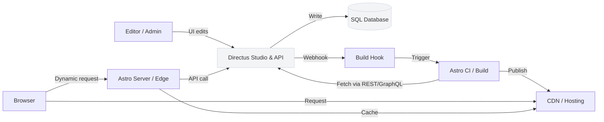

Executive summary

Directus acts as a SQL-backed headless CMS that exposes REST and GraphQL APIs and a visual Studio, while Astro is a content-first web framework optimized for fast, content-driven frontends. Combining them yields a clear separation: Directus owns content, authentication, and API surface; Astro consumes that API to render static pages, incremental server-side pages, or client-enabled islands. See the Directus and Astro repositories for canonical details: [directus/directus](https://github.com/directus/directus) and [withastro/astro](https://github.com/withastro/astro).

This guide explains a practical architecture, request and data flow, integration boundaries, deployment topology, observability and security boundaries, and a staged implementation plan suitable for teams evaluating or implementing Directus + Astro. Data in this article (repository metadata and release notes) is current as of 2026-07-13T01:56:52.787648+00:00 and the sources listed at the end.

Table of contents

- [Why pair Directus and Astro?](#why-pair-directus-and-astro)
- [Architecture overview](#architecture-overview)
- [Request and data flow](#request-and-data-flow)
- [Integration boundaries and contracts](#integration-boundaries-and-contracts)
- [Deployment topology and options](#deployment-topology-and-options)
- [Observability and operational considerations](#observability-and-operational-considerations)
- [Security boundaries and access control](#security-boundaries-and-access-control)
- [Staged implementation plan](#staged-implementation-plan)
- [Decision checklist](#decision-checklist)
- [Action checklist (recommended next steps)](#action-checklist-recommended-next-steps)
- [Evidence, assumptions, and limitations](#evidence-assumptions-and-limitations)
- [FAQ](#faq)
- [Sources](#sources)


## Table of contents

- [Why pair Directus and Astro?](#why-pair-directus-and-astro)
- [Architecture overview](#architecture-overview)
- [Request and data flow](#request-and-data-flow)
- [Integration boundaries and contracts](#integration-boundaries-and-contracts)
- [Deployment topology and options](#deployment-topology-and-options)
- [Observability and operational considerations](#observability-and-operational-considerations)
- [Security boundaries and access control](#security-boundaries-and-access-control)
- [Staged implementation plan](#staged-implementation-plan)
- [Decision checklist](#decision-checklist)
- [Action checklist (recommended next steps)](#action-checklist-recommended-next-steps)
- [Evidence, assumptions, and limitations](#evidence-assumptions-and-limitations)

## Why pair Directus and Astro?

Directus provides instant REST and GraphQL APIs on top of a SQL database, a visual management Studio, and policy-based access control; these capabilities are described in the project's repository README and release notes [directus/directus](https://github.com/directus/directus). Astro is positioned as a web framework for content-driven sites that prioritizes lightweight output and integrates with multiple component frameworks and hosting targets [withastro/astro](https://github.com/withastro/astro).

Together, Directus is the canonical source of content and data models; Astro is the delivery layer for web presentation. This pairing is well-suited to projects that want a managed content studio and schema-driven API, plus a fast, modern frontend build pipeline that can render static pages, server-rendered routes, or hybrid pages with client-side islands.


## Architecture overview

Key components and responsibilities

| Component | Responsibility | Source / Fact |
|---|---:|---|
| Directus (backend) | Hosts the CMS Studio, exposes REST & GraphQL APIs, applies role & field-level policies, and connects to a SQL database. | See [directus/directus README](https://github.com/directus/directus) (REST & GraphQL, Studio, policy-based access). |
| SQL database | Stores application data (Directus connects to Postgres, MySQL, MariaDB, MSSQL, SQLite, etc.) | Listed in Directus README topics. |
| Astro (frontend) | Builds and serves the website: static pages, server endpoints, and optional client JS islands. | See [withastro/astro README](https://github.com/withastro/astro). |
| CDN / Edge | Serves static assets and cached pages produced by Astro builds or server-rendered endpoints. | Inferred by common Astro hosting integrations (see repository). [INFERENCE: from Astro repo integration list] |
| Optional API layer / Edge functions | Optional server-side layer for caching, personalization, or secure token exchange between Astro and Directus. | [INFERENCE: recommended architecture pattern]. |

> [!NOTE]
> The Directus README explicitly states automatic REST and GraphQL APIs and a visual Studio that connects to any SQL database. See the Directus repo for exact wording: [directus/directus](https://github.com/directus/directus).

Architectural inference labeling

- [INFERENCE] The recommended runtime for Astro frontends is flexible (static hosting, serverless, or edge platforms) because the Astro repository includes integrations for Vercel, Cloudflare, Netlify, and others. This is inferred from the repo integration list in the Astro README: [withastro/astro](https://github.com/withastro/astro).

- [INFERENCE] A typical production topology places Directus near the database (same VPC or private network) and exposes a public API endpoint for the frontend (or for edge functions) because Directus is a backend service that wraps an SQL database and provides APIs and a management Studio.


## Request and data flow

High-level request flow (browser-driven, static site with preview):

1. During authoring, editors log into the Directus Studio and update content. Directus writes changes directly to the SQL database and enforces permissions.
2. A webhook from Directus (or scheduled job) triggers a build hook for the Astro site, or an incremental rebuild if your hosting supports it.
3. The Astro build pulls content from Directus via REST or GraphQL APIs and produces static pages and assets.
4. Built pages and assets are published to a CDN; end users request content from the CDN.
5. For dynamic pages or personalization, Astro can call Directus APIs at request time from server-rendered endpoints or edge functions.

Mermaid diagram: request & data flow



Embedded data image: schema & content preview


API contracts and patterns

| Workstream | Typical API | Purpose / When to use |
|---|---|---|
| Build-time content fetch | Directus REST or GraphQL endpoints | Pull canonical content for static or incremental builds. See Directus README for API availability. |
| Preview & live editing | Directus Studio + signed preview tokens (Directus manages auth) | Editors preview unpublished content in the frontend. Implementation details depend on Directus tokens and hosting. |
| Runtime dynamic data | Server-rendered Astro endpoints or edge functions calling Directus | Use for auth-protected user data, personalization, or pages that can't be prebuilt. |

> [!TIP]
> For speed and reduced backend load, prefer build-time fetches for pages that don't require per-user personalization. Use server/edge calls only where runtime data is essential.


## Integration boundaries and contracts

Clear integration boundaries are important to keep each system focused and to simplify scaling, security, and operations.

- Directus responsibility (canonical): data storage, schema management, APIs (REST/GraphQL), Studio for editorial workflows, role- and field-level access control. Evidence: Directus README and release notes ([directus/directus](https://github.com/directus/directus)).
- Astro responsibility (presentation): site generation, routes, build pipeline, static assets, optional server endpoints or edge runtime for dynamic features. Evidence: Astro README and integrations list ([withastro/astro](https://github.com/withastro/astro)).

Integration contract checklist (examples of concrete artifacts to define):

- API endpoints (REST routes and/or GraphQL operations) that Astro will call during build or at runtime.
- Authentication flows: how Astro obtains access tokens for preview builds or runtime calls.
- Webhook semantics: Directus to Astro CI build triggers (payload format, retry behavior).
- Schema migration rules: how schema changes in Directus propagate to the Astro build pipeline to avoid broken builds.

> [!WARNING]
> Do not assume schema changes are backward compatible. Define a migration and preview plan so a schema change in Directus does not break Astro builds or published pages.


## Deployment topology and options

Directus can be self-hosted or used via Directus Cloud; Astro can be hosted to static/CDN or server/edge providers. The following table summarizes common options and where each component typically runs.

| Component | Common deployment options (facts/inferences) | Notes / Evidence |
|---|---|---|
| Directus | Self-host (Docker, Kubernetes), or Directus Cloud (managed) | Directus README references self-host and Directus Cloud: [directus/directus](https://github.com/directus/directus). |
| SQL Database | Managed Postgres, MySQL, MariaDB, MSSQL, SQLite or self-managed | Supported DBs described in Directus topics. |
| Astro site | Static site published to CDN (Netlify, Vercel, Cloudflare) or serverless/edge runtime | Astro README includes integrations and hosting-focused packages: [withastro/astro](https://github.com/withastro/astro). |
| CDN | Any CDN in front of static assets or edge runtime | Inferred from Astro hosting integrations. [INFERENCE] |
| Optional edge functions | Vercel/Cloudflare Workers / Netlify Edge (for server-side API calls) | Astro supports server/edge targets via integrations. |

Two tables with practical deployment mappings

Table A — Directus deployment matrix

| Mode | Where it runs | Pros (inferred) | Evidence |
|---|---|---|---|
| Directus Cloud | Directus-managed service | Fast provisioning, built-in database & storage (noted in README) | [directus/directus](https://github.com/directus/directus) mentions Directus Cloud. |
| Self-host (Docker/K8s) | Your infra (VPC, private network) | Full control, integrate with internal DB | Directus README indicates self-host capability. [INFERENCE: common from repo and deployment docs]. |

Table B — Astro hosting choices

| Mode | Where it runs | Build/deploy pattern | Evidence |
|---|---|---|---|
| Static + CDN | CDN provider (Netlify, Vercel static, Cloudflare Pages) | Build produces static assets, uploaded to CDN | Astro repo lists many integrations and static hosting targets. |
| Server/Edge | Vercel, Cloudflare Workers, Netlify Edge | Server-side or edge rendering at request time | Astro repo contains integrations that enable server/edge runtimes. |


## Observability and operational considerations

What to monitor and why (inferred responsibilities)

- Directus: API availability, response latency, authentication failures, webhook delivery health, database connectivity, and Studio availability. (Directus exposes APIs and Studio per its README.)
- Database: connection pool exhaustion, query latency, replication lag (if applicable).
- Astro (build & runtime): CI build success/failure, build times, asset publish success, server/edge endpoint error rates and latencies, CDN cache hit/miss rates.

Tooling guidance (platform-agnostic, implementation-level advice)

- Use health checks for Directus API endpoints and configure alerting on 5xx/error-rate thresholds.
- Instrument API request latency and error rates with application monitoring (APM) and expose metrics from your hosting/infra.
- Monitor webhook delivery from Directus to your CI: record success, transient errors, and retries.

> [!TIP]
> If you use Directus Cloud, check the provider's dashboard for project-level metrics and logs. If you self-host, forward logs to a centralized logging system and capture structured API access logs.


## Security boundaries and access control

Facts from Directus README:

- Directus provides policy-based access control and granular permissions down to field level. See the Directus repository README for policy and permission references: [directus/directus](https://github.com/directus/directus).

Security recommendations (do not overstate Directus behavior; these are practical controls to implement):

- Network: place Directus and your database in the same private network or VPC when self-hosted. Restrict DB access to Directus only.
- API keys & secrets: create separate API keys for build-time fetches, preview tokens, and runtime calls. Limit privileges to the least privilege necessary.
- Preview flows: decide whether preview tokens and Studio sessions are proxied through an auth layer or issued directly by Directus; document token TTL and refresh behavior.
- CORS & rate-limiting: configure CORS on Directus to only allow expected origins (e.g., your Astro site domain) and add rate-limiting for public endpoints if needed.

> [!WARNING]
> When self-hosting Directus, do not expose your database directly to the public internet. Keep DB connections private and firewall Directus to only necessary public endpoints.


## Staged implementation plan

This plan is intentionally incremental. Each stage produces a working artifact and reduces risk before the next stage.

Stage 0 — Discovery

- Review the Directus and Astro repository READMEs and relevant docs: [directus/directus](https://github.com/directus/directus) and [withastro/astro](https://github.com/withastro/astro).
- Decide hosting model for Directus (Cloud vs self-host) and Astro (static CDN vs edge). Document network and security constraints.

Stage 1 — Minimal viable authoring + static site

- Provision a Directus project (Directus Cloud or local instance) and connect it to a test SQL database.
- Create a minimal content model in Directus (collections, fields) and populate seed content via the Studio.
- Scaffold an Astro site (command from Astro README: npm create astro@latest) that fetches content at build time from Directus REST or GraphQL and renders a few pages.
- Configure a build hook in Astro hosting to allow Directus webhooks to trigger rebuilds.

Stage 2 — Previews, auth, and incremental builds

- Implement preview tokens or a signed preview flow so editors can preview unpublished content in Astro.
- Hook Directus webhooks to your CI or incremental build pipeline.
- Add caching headers and CDN deployment for static assets.

Stage 3 — Dynamic pages and personalization

- Add server/edge routes in Astro for pages requiring runtime data. Those routes call Directus APIs with appropriately scoped credentials.
- Harden auth for runtime API calls (rotate keys, use short-lived tokens, or a service account pattern).

Stage 4 — Hardening and scale

- Add monitoring: uptime checks for Directus endpoints, API latency, build success rates, and CDN metrics.
- Create runbooks for schema migrations to avoid breaking Astro builds when content models change.
- Perform an audit of permissions in Directus (roles, field-level rules).

Stage 5 — Production cutover

- Switch domain and CDN to production artifacts.
- Run a smoke test suite for content read flows and Studio authoring flows.
- Establish backup and restore procedures for the database and Directus project settings.


## Decision checklist

- Will Directus be self-hosted or will you use Directus Cloud? (Consider control vs provisioning speed.)
- Does your content require frequent runtime personalization, or can it be built statically? (Impacts Astro hosting model.)
- Do you require preview tokens and editor preview flows? (Impacts authentication design.)
- Which SQL database will Directus use? (Directus supports many SQL backends; pick one that matches ops skillset.)
- Will you use GraphQL or REST for build-time and runtime calls? (Pick one and standardize queries.)


## Action checklist (recommended next steps)

- [ ] Read the Directus README and decide Cloud vs self-host: https://github.com/directus/directus
- [ ] Scaffold an Astro project (use npm create astro@latest per Astro README): https://github.com/withastro/astro
- [ ] Create a minimal content model in Directus and seed content.
- [ ] Implement a build-time fetch in Astro that consumes Directus REST or GraphQL.
- [ ] Add a webhook in Directus to trigger your Astro build pipeline.
- [ ] Define a schema-change migration and preview plan to avoid breaking builds.


## Evidence, assumptions, and limitations

Evidence (sourced):

- Directus provides REST & GraphQL APIs and a visual Studio, and lists supported SQL databases and Directus Cloud in its README: [directus/directus](https://github.com/directus/directus). The repository metadata used in this article (stars, forks, releases) is taken from the provided editorial data and release information; repository data and release notes are current as of 2026-07-13T01:56:52.787648+00:00.
- Astro is a web framework focused on content-driven sites and includes integrations for multiple hosting targets and component frameworks; this is documented in the Astro repository README: [withastro/astro](https://github.com/withastro/astro).

Assumptions (explicit):

- Where the guide recommends architectural patterns (CDN in front of static assets, or edge functions for dynamic requests), those are recommended patterns inferred from the integration lists and typical usage of the tools. These are labeled as [INFERENCE] where derived from repository structure or README content.
- The guide assumes you will implement standard CI/CD, secret management, and monitoring mechanisms appropriate to your platform; exact tooling choices (SaaS vs on-prem) are out of scope.

Limitations

- This article does not reproduce full API schemas, token formats, or CLI commands beyond those present in the supplied READMEs. For implementation-level details (for example, exact Directus token endpoints or Astro adaptor configuration), consult the official product docs and repo READMEs linked in Sources.
- No third-party benchmarks, market adoption numbers, or unverifiable usage claims are included. Repository statistics quoted are those in the editorial data and release notes snapshot provided.


## FAQ

### How does Astro fetch content from Directus during build?
Astro can fetch content during its build process by calling Directus REST or GraphQL endpoints. Directus exposes both API styles per its README; choose the one that fits your build tooling and caching strategy. See the Directus repository for API details: [directus/directus](https://github.com/directus/directus).

### Can I use Directus Cloud instead of self-hosting?
Yes. The Directus README mentions Directus Cloud as a provisioning option that sets up a project quickly. Evaluate Directus Cloud against your compliance and network requirements: [directus/directus](https://github.com/directus/directus).

### Should I use GraphQL or REST between Astro and Directus?
Both are supported by Directus. REST is straightforward and commonly used for static builds; GraphQL can reduce over-fetching for complex pages. Choose based on your data shapes and team familiarity. Source: Directus README.

### Will schema changes in Directus break my Astro site?
If you change the schema (rename fields, remove collections) without updating the Astro queries/templates, builds can fail or render incorrectly. Implement migration steps and a preview environment so editors can validate changes before production. This is a practical risk; plan schema migrations accordingly.

### Where do I run server-side personalization calls?
Prefer server-side or edge functions (Astro server endpoints or hosted edge functions) to keep secrets off the browser and to apply server-side caching and rate-limiting. Astro supports server/edge adaptors via integrations in its repository.

### Are there built-in observability features in Directus or Astro?
Directus provides a Studio and API surfaced by the project; specific observability integrations depend on hosting and deployment. Astro includes telemetry-related packages noted in its repo. For production monitoring, instrument API endpoints and CI builds with your chosen observability stack.


## Sources

- Directus canonical repository: https://github.com/directus/directus
- Directus latest GitHub release (v12.1.1): https://github.com/directus/directus/releases/tag/v12.1.1
- Astro canonical repository: https://github.com/withastro/astro


---

Meta

- canonical_url: https://madewithwhat.net/stack-guides/directus-astro-stack-guide
- open_graph_title: "Directus + Astro: Headless CMS to Fast Frontend"
- open_graph_description: "Architecture, data flow, deployment, observability and a staged plan for Directus + Astro."
- search_intent: informational

Article schema (JSON-LD) — minimal

```json
{
  "@context": "https://schema.org",
  "@type": "Article",
  "headline": "Directus + Astro: Headless CMS to Fast Frontend",
  "description": "How to pair Directus (SQL-backed headless CMS) with Astro (content-first web framework): architecture, data flow, integration boundaries, deployment, observability, and a staged plan.",
  "author": { "@type": "Organization", "name": "MadeWithWhat" },
  "publisher": { "@type": "Organization", "name": "MadeWithWhat", "url": "https://madewithwhat.net" },
  "datePublished": "2026-07-14",
  "mainEntityOfPage": "https://madewithwhat.net/stack-guides/directus-astro-stack-guide"
}
```
