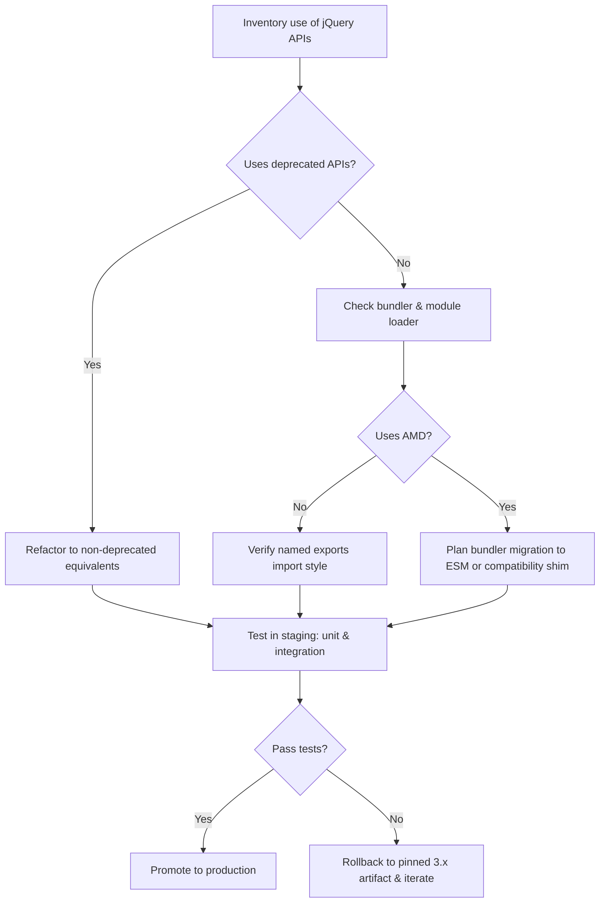

Executive summary

jQuery 4.0.0 (tag 4.0.0) was published to the official GitHub releases on 2026-01-18; the release notes and repository README enumerate a broad set of API changes, removals of deprecated functionality, browser support reductions, and an explicit migration from AMD to ES modules. The release consolidates modern JavaScript patterns (ESM exports, named exports, factory separation), tightens AJAX/script handling and CSP behavior, removes older browser workarounds, and deprecates or removes legacy APIs. See the official release for the full changelog and links to commits: https://github.com/jquery/jquery/releases/tag/4.0.0.

If you maintain code that directly depends on deprecated jQuery APIs, runs on older browsers (IE < 11, iOS < 11, Firefox < 65, Android Browser, PhantomJS), or relies on AMD-style bundling, prepare to test and likely adjust builds. The release notes explicitly list the dropped browser support and API removals. This article summarizes the measured changes, who should care, a pragmatic upgrade test plan (using commands and test guidance present in the repo README), a rollback option based on repository branches, and the outstanding questions left by the published notes. Data retrieval timestamp for freshness: 2026-07-13T01:54:22.304555+00:00 (generated_at).

Table of contents

- [What changed in jQuery 4.0.0 (high-level)](#what-changed-in-jquery-400-high-level)
- [Detailed notable changes (selected)](#detailed-notable-changes-selected)
  - [AJAX and networking](#ajax-and-networking)
  - [Core, modules, and exports](#core-modules-and-exports)
  - [CSS, attributes, and DOM manipulation](#css-attributes-and-dom-manipulation)
- [Who should care and why](#who-should-care-and-why)
- [Upgrade risk assessment](#upgrade-risk-assessment)
- [Test plan (step-by-step, repository-sourced commands)](#test-plan-step-by-step-repository-sourced-commands)
- [Rollback plan (repository-supported options)](#rollback-plan-repository-supported-options)
- [Decision checklist / Action checklist](#decision-checklist--action-checklist)
- [Outstanding questions and gaps in the release notes](#outstanding-questions-and-gaps-in-the-release-notes)
- [Evidence, assumptions, and limitations](#evidence-assumptions-and-limitations)
- [Sources](#sources)

## Table of contents

- [What changed in jQuery 4.0.0 (high-level)](#what-changed-in-jquery-4-0-0-high-level)
- [Detailed notable changes (selected)](#detailed-notable-changes-selected)
- [Who should care and why](#who-should-care-and-why)
- [Upgrade risk assessment](#upgrade-risk-assessment)
- [Test plan (step-by-step, repository-sourced commands)](#test-plan-step-by-step-repository-sourced-commands)
- [Rollback plan (repository-supported options)](#rollback-plan-repository-supported-options)
- [Decision checklist / Action checklist](#decision-checklist-action-checklist)
- [Outstanding questions and gaps in the release notes](#outstanding-questions-and-gaps-in-the-release-notes)
- [Evidence, assumptions, and limitations](#evidence-assumptions-and-limitations)
- [Article SEO and metadata (for editors / publishers)](#article-seo-and-metadata-for-editors-publishers)
- [Mermaid: suggested upgrade flow](#mermaid-suggested-upgrade-flow)
- [FAQs](#faqs)

## What changed in jQuery 4.0.0 (high-level)

This release is a major version: the changelog and repository README document a set of breaking and semantically significant changes. Key, evidenced items include:

- Migration from AMD to ES modules and adoption of named exports ([release notes](https://github.com/jquery/jquery/releases/tag/4.0.0)).
- Dropped support for a set of older browsers: IE < 11, iOS < 11, Firefox < 65, Android Browser, PhantomJS (explicit in changelog) — this allows simplifications in core code and removal of IE-specific hooks ([release notes](https://github.com/jquery/jquery/releases/tag/4.0.0)).
- Removal/deprecation of multiple legacy APIs and features (examples listed in changelog: jQuery.trim deprecation, removal of deprecated APIs) ([release notes](https://github.com/jquery/jquery/releases/tag/4.0.0)).
- AJAX changes: better binary/FormData support, changes to script transport behavior (headers for cross-domain script transport, not auto-executing scripts unless dataType is provided), and other fixes to response handling ([release notes](https://github.com/jquery/jquery/releases/tag/4.0.0)).
- CSS and attribute fixes and behavior changes: attribute removal when .attr(name, false) is used for non-ARIA, trimming rules for CSS custom properties, changes to px addition rules, etc. ([release notes](https://github.com/jquery/jquery/releases/tag/4.0.0)).

These are direct summaries of the official changelog and repository README. The sections below enumerate selected items and map them to impact areas.

## Detailed notable changes (selected)

The changelog contains many commits and issue references. The tables below collect changes that are most likely to affect application code.

Table: Selected breaking or high-impact changes (as reported in the release notes)

| Area | Notable change (text from release notes) | Evidence (release notes / commit refs) |
|------|------------------------------------------|----------------------------------------|
| Module system / packaging | Migrate from AMD to ES modules; use named exports; move factory to separate exports | [d0ce00cd], [f75daab0], [46f6e3da] in changelog ([release notes](https://github.com/jquery/jquery/releases/tag/4.0.0)) |
| Browser support | Drop support for IE <11, iOS <11, Firefox <65, Android Browser, PhantomJS | Explicit listing in changelog ([release notes](https://github.com/jquery/jquery/releases/tag/4.0.0)) |
| AJAX | Support binary data and FormData; do not auto-execute scripts unless dataType provided; support headers for script transport cross-domain; drop json->jsonp auto-promotion | Numerous AJAX entry items in changelog with commit refs ([release notes](https://github.com/jquery/jquery/releases/tag/4.0.0)) |
| Deprecated APIs | Remove or deprecate jQuery.trim and other deprecated APIs; remove deprecated AJAX event aliases | Deprecation and removal lines in changelog ([release notes](https://github.com/jquery/jquery/releases/tag/4.0.0)) |
| CSS/attributes | .attr(name,false) removes attribute for non-ARIA; trim custom property whitespace; modify px addition rules | CSS & Attributes entries in the changelog ([release notes](https://github.com/jquery/jquery/releases/tag/4.0.0)) |

Table: Developer-facing build/test artifacts and instructions (from repository README)

| Purpose | Command or file | Evidence (README) |
|---------|-----------------|-------------------|
| Install dependencies | npm install | README (build instructions) in repo ([jquery repo](https://github.com/jquery/jquery)) |
| Auto-build during development | npm start | README build/test instructions |
| Build release artifacts | npm run build (and npm run build:all for all variants) | README build instructions |
| Generate ESM module | npm run build -- --filename=jquery.module.js --esm | README build options |
| Run unit tests | Run tests with a local server supporting PHP; README gives guidance for servers (MAMP/WAMP/LAMP) | README test instructions in repo |

> [!NOTE]
> The above tables are summaries of the official changelog and repository README. Commit identifiers and issue numbers are listed in the release page; review the release page for the authoritative list and links to commits: https://github.com/jquery/jquery/releases/tag/4.0.0.

### AJAX and networking

Key AJAX items in the changelog (select lines):

- Support binary data (including FormData) and allow processData: true for binary data.
- Don't treat array data as binary.
- Support `headers` for script transport even when cross-domain.
- Do not auto-execute scripts unless a dataType is provided; do not execute scripts for unsuccessful HTTP responses.
- Drop the automatic promotion from json to jsonp.

All of these appear as entries in the changelog with associated commit references; see the release page for each commit: https://github.com/jquery/jquery/releases/tag/4.0.0.

> [!TIP]
> If your code relies on implicit JSONP promotion or on script transport auto-execution, explicitly review AJAX usages and test with the new behavior.

### Core, modules, and exports

Notable core changes (from the changelog):

- Migrate from AMD to ES modules and use named exports. The changelog includes specific commits for moving to ESM and using named exports.
- Fix exports setup to make bundlers work with both ESM & CommonJS — the changelog lists a commit addressing exports to accommodate bundlers.
- The README also documents build flags for `--esm`, `--factory`, and how to produce different file names and directories.

Architectural inference (explicitly labeled):

- Inferred architecture conclusion: The repository-level change from AMD to ES modules and the addition of named exports implies a primary distribution strategy that supports native ESM consumers and modern bundlers. This inference is drawn from the commit notes in the changelog and the README build options; the project now documents `--esm` and named exports and references bundler compatibility. (This is an inferred conclusion from the repository's README and changelog content.)

### CSS, attributes, and DOM manipulation

Notable items:

- `.attr(name,false)` now removes the attribute for non-ARIA attributes.
- `toggleClass(boolean|undefined)` signature is dropped.
- Trimming and whitespace handling for CSS Custom Properties changed; trimming rules for undefined custom property values and whitespace-only values now return undefined in some cases.
- Inclusion of `show`, `hide`, and `toggle` in the slim build.

Each of these is recorded as a line-item in the release changelog with commit references.


## Who should care and why

- Application owners and frontend engineers using jQuery in browser environments that include the dropped legacy browsers (IE <11, older iOS/Firefox/Android). The changelog explicitly drops those platforms, which may remove previous polyfills/workarounds.
- Teams relying on jQuery plugins or code paths that use deprecated APIs (for example, jQuery.trim or deprecated AJAX event aliases). The changelog lists deprecations/removals.
- Teams that bundle jQuery using AMD-based toolchains. The release migrates from AMD to ES modules, and the repository documents ESM and named exports; bundling configuration may need review.
- Anyone relying on implicit AJAX/JSONP behaviors, script auto-execution, or older script-transport behavior. The AJAX entry items show explicit behavioral differences.

All the above are direct consequences of items in the official changelog and README ([release notes](https://github.com/jquery/jquery/releases/tag/4.0.0), [repository README](https://github.com/jquery/jquery)).

## Upgrade risk assessment

This release contains both non-breaking fixes and changes that are potentially breaking depending on application code. The following risk summary maps risk areas to probable impact (fact-backed by changelog entries):

Table: Risk matrix (based on changelog evidence)

| Risk area | Why it matters (evidence) | Potential impact |
|-----------|---------------------------|------------------|
| Browser support reduction | Changelog: drop support for IE <11, iOS <11, Firefox <65, Android Browser, PhantomJS | If your user base includes those browsers, behavior changed in areas where previous workarounds were removed.
| ESM / export changes | Changelog/README: migrate from AMD to ES modules; named exports; fixes for bundlers | AMD-based loaders or build pipelines may need configuration changes; modern bundlers and ESM consumers should benefit.
| Deprecated API removals | Changelog: removal/deprecation of jQuery.trim and other deprecated APIs | Code calling removed APIs will break; ensure call sites are updated.
| AJAX behavior changes | Changelog: no implicit json->jsonp, script auto-execution changes, FormData/binary support | Code relying on old implicit behaviors may fail or behave differently; security/CSP handling changed.
| Slim/custom builds | README: slim build changes and module exclusions | Custom builds that relied on removed modules/behavior must be re-evaluated.

Severity is dependent on whether your codebase uses the removed/deprecated features or relies on the older browser behaviors. The release notes are explicit about the items listed; they do not include user base-specific telemetry.

> [!WARNING]
> Do not assume this major release is purely additive. The changelog explicitly lists deprecations, removals, and dropped browser support. Audit your code for direct uses of deprecated APIs and for AMD-based loading before upgrading.

## Test plan (step-by-step, repository-sourced commands)

The project's README contains explicit build and test commands. Below is a recommended minimal test plan that uses repository instructions and the changelog facts:

1. Clone and build local artifact (follow repo README):
   - git clone https://github.com/jquery/jquery
   - cd jquery
   - npm install
   - npm run build

   Evidence: build instructions are listed in the repository README (commands above are explicit) ([jquery repo README](https://github.com/jquery/jquery)).

2. Run the full build variants if you need all release artifacts:
   - npm run build:all
   - Use build flags as needed (examples in README): --esm, --slim, --factory

   Evidence: README documents --esm, --slim, --factory and examples for filenames and directories.

3. Run unit tests with an appropriate local server supporting PHP (README guidance):
   - Start a local server (MAMP/WAMP/LAMP/Mongoose suggested in README) and run the test suite per repository instructions.

   Evidence: README includes guidance on running unit tests and server suggestions.

4. Application-level smoke tests
   - Replace existing jQuery in a staging build with the 4.0.0 artifact (or your custom build using the README flags) and exercise critical flows that use AJAX, attribute manipulation, class toggling, CSS custom properties, and any plugin that relies on deprecated API.

   Evidence: The changelog lists AJAX, CSS, Attributes, and deprecated API changes that should be explicitly exercised.

5. Bundler / module tests
   - If you use AMD loaders, test builds with your bundler. The changelog and README show migration to ESM and named exports — ensure the integration works with your bundler configuration.

   Evidence: Migration from AMD to ES modules and mention of named exports are explicit in changelog and README.

6. Security and CSP tests
   - If your app uses script transport or inline script insertion via AJAX, test CSP enforcement and script execution behavior; the changelog documents changes to script transport behavior and CSP error avoidance.

   Evidence: AJAX changelog entries referencing CSP and script transport changes.

## Rollback plan (repository-supported options)

The repository README and changelog provide factual anchors that support straightforward rollback options:

- Pin to the 3.x branch or previously deployed 3.x artifact: the repository README documents the version support table showing 3.x as a supported branch (3.x-stable) and 4.x as main. If an immediate rollback is required, use your dependency manager to pin jQuery to the latest 3.x-stable release or restore the previously deployed artifact built from 3.x.

  Evidence: README "Version support" table lists 4.x as main (Full), 3.x as 3.x-stable (Critical-only).

- Restore a previously built jQuery artifact in your CDN or asset pipeline (build process details in README). The README documents how to create builds and the dist/ directory layout; restore the previous build artifacts to your distribution path to revert behavior.

  Evidence: README build commands and the explanation of `dist/` and `dist-module/` placement.

- If you used a custom build (--exclude, --slim), rebuild the same custom configuration from the 3.x branch as a temporary measure. The README explicitly documents exclude/include options and build flags.

  Evidence: README section "Building a Custom jQuery" and build examples.

Notes: The release notes do not provide a recommended rollback command; the above rollback options are derived from the repository's version support table and build instructions.

## Decision checklist / Action checklist

- [ ] Inventory your codebase for use of deprecated or removed APIs listed in the changelog (e.g., jQuery.trim, deprecated AJAX event aliases).
- [ ] Identify users on legacy browsers explicitly listed as dropped (IE <11, iOS <11, Firefox <65, Android Browser, PhantomJS) and evaluate the impact.
- [ ] Run the repository build locally (npm install; npm run build) and validate ESM/CommonJS bundler integration in a staging environment.
- [ ] Execute application-level test suites covering AJAX, script transport, attribute and class manipulation, and plugin behavior.
- [ ] If using AMD loaders, validate or migrate to ESM-based bundling; otherwise, test bundler interoperability as noted in the changelog.
- [ ] Prepare rollback artifacts: ensure your build pipeline can restore the last 3.x-stable artifact if needed.

## Outstanding questions and gaps in the release notes

The release notes are comprehensive for code-level changes, but a few practical questions remain that are not fully answered by the published changelog/README content:

1. Migration guidance for large AMD-based codebases: The changelog/README confirms the migration from AMD to ESM, but there is no step-by-step migration guide or compatibility shim described in the release notes for AMD consumers.
2. Backwards compatibility guarantees: While deprecations and removals are listed, the release notes do not provide a compatibility matrix for commonly used plugins — plugin authors may need to test and update.
3. Bundle vendor distribution formats: The changelog notes fixes for bundlers and ESM exports, but there is no explicit listing of the published npm package fields (package.json entries are not in the release notes) that indicate how consumers should import (default vs named import). The README does mention named exports and ESM generation, but not exact import patterns consumers should use.
4. Performance impact measurements: The changelog indicates simplifications after dropping legacy browser support, but no quantitative performance metrics are provided.

These are factual observations about what the release notes do not contain; they are not claims about the product beyond the absence of explicit guidance.

## Evidence, assumptions, and limitations

- Evidence base: This article uses only the supplied repository README and the GitHub release notes for jQuery 4.0.0, as available in the supplied sources. See the Sources section below for links. The retrieval/generation date: 2026-07-13T01:54:22.304555+00:00.
- Explicit assumptions and labels:
  - Any architectural conclusions (for example, that the project is shifting primary distribution to ESM/named exports) are labeled as "inferred" and are based on changelog commits and README build options. The repository explicitly lists migration from AMD to ES modules and named exports, which supports this inference.
- Limitations:
  - The release notes do not include concrete migration scripts, plugin compatibility lists, or bundle import examples; where those are absent, this article does not invent them.
  - No telemetry or adoption statistics are used or inferred; the repository's star/fork/watch counts are present in the supplied repository metadata but are not treated as usage metrics.

## Article SEO and metadata (for editors / publishers)

- Primary keyphrase: jQuery 4.0.0
- Secondary keyphrases: jQuery 4, jQuery upgrade, ESM migration, jQuery changelog
- Canonical URL (recommended): https://madewithwhat.net/jquery-4-0-0-release-guide
- Open Graph suggestion:
  - og:title: "jQuery 4.0.0 released — upgrade guide & risk analysis"
  - og:description: "jQuery 4.0.0 is released. This analysis summarizes changes, who should care, upgrade risks, test and rollback plans, and outstanding questions."
  - og:image: /assets/2026/07/15/release-news-jquery-23-cover.jpg
- Article schema (example JSON-LD) — include in page head when publishing (fill real publisher fields during publishing):

```json
{
  "@context": "https://schema.org",
  "@type": "Article",
  "headline": "jQuery 4.0.0 released — upgrade guide & risk analysis",
  "datePublished": "2026-07-15",
  "author": {"@type": "Organization", "name": "MadeWithWhat"},
  "publisher": {"@type": "Organization", "name": "MadeWithWhat", "url": "https://madewithwhat.net"},
  "mainEntityOfPage": "https://madewithwhat.net/jquery-4-0-0-release-guide",
  "image": "https://madewithwhat.net/assets/2026/07/15/release-news-jquery-23-cover.jpg"
}
```

## Mermaid: suggested upgrade flow



## FAQs

- Q: Where can I find the official changelog and commit details for jQuery 4.0.0?
  A: The official release is published on GitHub at https://github.com/jquery/jquery/releases/tag/4.0.0 and includes the changelog with commit references.

- Q: Does jQuery 4.0.0 still support Internet Explorer 11?
  A: The changelog explicitly drops support for IE < 11. Support for IE 11 is not explicitly removed in the listed drop; the changelog lists "Drop support for IE <11" which implies IE11 is within the supported range. See the release notes for exact wording: https://github.com/jquery/jquery/releases/tag/4.0.0.

- Q: What packaging/module format does jQuery 4 use?
  A: The changelog states that jQuery migrated from AMD to ES modules and now uses named exports; the README documents build flags to generate ESM artifacts.

- Q: My app uses AMD and RequireJS. Will jQuery 4 break my build?
  A: The release notes confirm migration to ES modules. The release does not include a step-by-step AMD compatibility shim; you should test your AMD-based builds and consider bundler migration or compatibility layers.

- Q: Are there AJAX behavior changes I should be aware of?
  A: Yes. Release notes list multiple AJAX-specific changes: better binary/FormData support, not auto-executing scripts unless a dataType is provided, support for script transport headers cross-domain, and removal of json->jsonp auto-promotion.

- Q: How do I run jQuery's unit tests locally?
  A: The repository README documents running the unit tests; it requires a local server supporting PHP and running the test site from the project root. The README suggests MAMP/WAMP/LAMP or Mongoose as options and includes npm install / npm start instructions.

## Sources

- jQuery canonical repository: https://github.com/jquery/jquery
- jQuery latest GitHub release (4.0.0): https://github.com/jquery/jquery/releases/tag/4.0.0

## FAQ

### Where can I find the official changelog and commit details for jQuery 4.0.0?

The official release is published on GitHub at https://github.com/jquery/jquery/releases/tag/4.0.0 and includes the changelog with commit references.

### Does jQuery 4.0.0 still support Internet Explorer 11?

The changelog explicitly drops support for IE < 11. The release notes list "Drop support for IE <11", which implies IE11 remains supported; consult the release page for exact wording: https://github.com/jquery/jquery/releases/tag/4.0.0.

### What packaging/module format does jQuery 4 use?

The changelog states jQuery migrated from AMD to ES modules and uses named exports; the README documents options to build ESM artifacts.

### My app uses AMD and RequireJS. Will jQuery 4 break my build?

The release migrates from AMD to ESM. The release notes do not include an AMD compatibility shim; you should test your AMD-based builds and plan for bundler changes or a compatibility approach.

### Are there AJAX behavior changes I should be aware of?

Yes. The changelog lists several AJAX changes: improved binary/FormData support, no auto-execution of scripts unless dataType is provided, support for headers in cross-domain script transport, and removal of automatic json→jsonp promotion.

### How do I run jQuery's unit tests locally?

The repository README documents running the unit tests. It requires a local server that supports PHP and running the site from the project root; README suggests MAMP/WAMP/LAMP or Mongoose, and includes npm install / npm start guidance.
