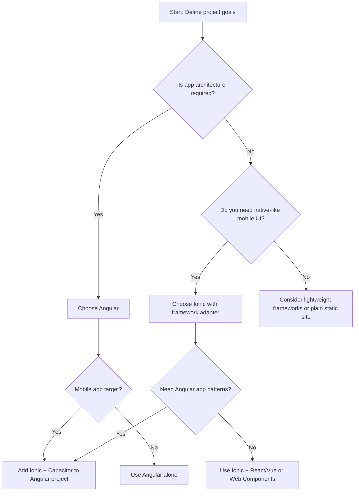

Executive answer

Angular and Ionic address related but distinct problems. Angular is a full-featured web application platform and framework with TypeScript-first tooling and a command-line workflow; its canonical repository is angular/angular and the project publishes releases (e.g. v22.0.6) with compiler, router, and migration fixes [Angular repo and release][angular-repo]. Ionic is a cross-platform UI toolkit built on Web Components with first-class integrations for frameworks such as Angular, React, and Vue; its canonical repository is ionic-team/ionic-framework and it publishes component-focused releases (e.g. v8.8.13) with UI bug fixes [Ionic repo and release][ionic-repo].

For real project decisions: choose Angular when you need a cohesive framework (routing, DI, compiler, strong TypeScript patterns and CLI-driven scaffolding). Choose Ionic when you need native-like UI components and cross-platform presentation that can sit on top of multiple frameworks (including Angular). Both can be used together: Ionic provides UI components and native wrappers while Angular supplies the application architecture. Below you’ll find a decision matrix, trade-off tables, workload-fit analysis, migration considerations, and actionable recommendations for four concrete project profiles.

Table of contents

- [Quick reference: repository facts](#quick-reference-repository-facts)
- [How Angular and Ionic differ (core roles)](#how-angular-and-ionic-differ-core-roles)
- [Decision matrix and trade-offs](#decision-matrix-and-trade-offs)
- [Workload fit analysis (types of projects)](#workload-fit-analysis-types-of-projects)
- [Migration considerations and compatibility notes](#migration-considerations-and-compatibility-notes)
- [Recommendations for four project profiles](#recommendations-for-four-project-profiles)
- [Decision checklist / Action checklist](#decision-checklist--action-checklist)
- [Architecture inference (explicitly labeled)](#architecture-inference-explicitly-labeled)
- [Evidence, assumptions, and limitations](#evidence-assumptions-and-limitations)
- [Sources](#sources)
- [FAQs](#faqs)

## Table of contents

- [Quick reference: repository facts](#quick-reference-repository-facts)
- [How Angular and Ionic differ (core roles)](#how-angular-and-ionic-differ-core-roles)
- [Decision matrix and trade-offs](#decision-matrix-and-trade-offs)
- [Workload fit analysis (types of projects)](#workload-fit-analysis-types-of-projects)
- [Migration considerations and compatibility notes](#migration-considerations-and-compatibility-notes)
- [Recommendations for four project profiles](#recommendations-for-four-project-profiles)
- [Decision matrix (compact actionable view)](#decision-matrix-compact-actionable-view)
- [Migration and workload-fit checklist](#migration-and-workload-fit-checklist)
- [Architecture inference (explicitly labeled)](#architecture-inference-explicitly-labeled)
- [Example selection flow](#example-selection-flow)
- [Evidence, assumptions, and limitations](#evidence-assumptions-and-limitations)
- [FAQs](#faqs)

## Quick reference: repository facts

This section lists only repository metadata and releases supplied in the editorial data (facts only). Data retrieval/generation date: 2026-07-13T02:04:49.676070+00:00.

| Project | Repository | Stars | Primary language | License | Latest release (tag) | Latest release date |
|---|---:|---:|---|---|---|---:|
| Angular | [angular/angular][angular-repo] | 100,623 | TypeScript | MIT | v22.0.6 (compiler/router/forms fixes) | 2026-07-08 |
| Ionic | [ionic-team/ionic-framework][ionic-repo] | 52,578 | TypeScript | MIT | v8.8.13 (UI bug fixes) | 2026-07-01 |

Additional repo facts (selected):

- angular/angular: default branch main, updated/pushed in July 2026, includes docs that show CLI commands (e.g. npm install -g @angular/cli; ng new; ng serve) and links to angular.dev [angular-repo].
- ionic-framework: lists packages such as @ionic/core and adapters for Angular/React/Vue, explains that Ionic is based on Web Components and provides migration guides and component packages [ionic-repo].

> [!NOTE]
> The repository facts above are taken directly from the supplied editorial data. Stars, open issues and release notes are interest and maintenance signals—do not treat stars as market share or open-issue counts as defect counts.

## How Angular and Ionic differ (core roles)

Short summary:

- Angular: a platform and framework for building web applications using TypeScript, with its own compiler, CLI, DI system, router, and official documentation site (angular.dev). The project has frequent releases that cover compiler, router, forms, and migration tooling [angular-repo], [angular-release].

- Ionic: a UI toolkit built with Web Components that targets cross-platform user interfaces and provides packages for Angular, React, and Vue; its repository centers on components, themes, and platform integrations, and it publishes component-focused point releases that fix UI behaviors [ionic-repo], [ionic-release].

Both are TypeScript-based projects and can be used together: Angular can be the application platform, Ionic the UI layer.

## Decision matrix and trade-offs

The table below frames core technical trade-offs you should weigh when choosing between Angular-only, Ionic-only (with another framework), or Angular+Ionic.

| Concern | Angular (framework) | Ionic (UI toolkit) | When to combine Angular + Ionic |
|---|---|---|---|
| Application architecture | Provides DI, module system, compiler, router, CLI scaffolding (documented in repo) [angular-repo] | No architecture layer; focuses on components and design system for multiple frameworks [ionic-repo] | Use Angular for app structure and Ionic for native-quality UI and cross-platform components
| UI consistency & native look | You supply UI or use libraries (Angular Material is linked from Angular docs) [angular-repo] | Offers platform-adaptive components and theming as Web Components that emulate native controls [ionic-repo] | Best if you want Angular architecture with out-of-the-box native-like UI across platforms
| Cross-platform mobile support | Web-first; SSR/SSG options referenced in Angular docs (SSR) [angular-repo] | Designed for PWA and native wrappers (Capacitor/cordova via topics), supports mobile look & feel [ionic-repo] | Combine to get Angular's SSR/architecture and Ionic's mobile UI + Capacitor for native packaging
| Framework lock-in | Framework-focused; application code follows Angular patterns | Framework-agnostic components (Web Components) usable with Angular/React/Vue [ionic-repo] | Combining increases coupling to Angular while maintaining reuse of Ionic components across projects
| Tooling & CLI | Official CLI (ng) and upgrade/migration guides documented [angular-repo] | Focus on component packages and adapters; docs include migration guides between Ionic major versions [ionic-repo] | CLI workflows intersect: use ng CLI with @ionic/angular adapter packages

> [!TIP]
> If you need scaffolded application architecture (routing, DI, build pipeline) choose Angular first. If you need a consistent native-like UI surface for mobile and PWA, evaluate Ionic components (they work with Angular and other frameworks) [ionic-repo].

## Workload fit analysis (types of projects)

This table maps common workload types to a recommended stack choice and rationale. Recommendations are prescriptive guidance based on the repositories' stated scopes (see Evidence section).

| Workload type | Recommended stack | Rationale (evidence-grounded) |
|---|---|---|
| Large enterprise web SPA with complex state and DI needs | Angular | Angular's repo describes a development platform and includes compiler, CLI, and architecture docs suitable for large apps [angular-repo]. (See Architecture inference below.) |
| Mobile-first app needing native look & device APIs | Ionic + framework (e.g., Ionic + Angular) | Ionic's repo states it provides cross-platform UI components and adapters for Angular/React/Vue and references native packaging and PWA targets [ionic-repo]. |
| Multi-framework component library or design system | Ionic (as Web Components) | Ionic is based on Web Components enabling use with multiple frameworks per its README topics [ionic-repo]. |
| Lightweight marketing site or static content | Angular (minimal) or other frameworks; Ionic only if you require mobile UI behavior | Angular supports SSR/SSG routes per docs; Ionic focuses on UI components rather than app architecture [angular-repo], [ionic-repo]. |

> [!WARNING]
> Choose stacks based on functional fit. Do not assume stars or open-issue counts imply suitability for your organizational constraints—those are signals, not guarantees.

## Migration considerations and compatibility notes

Facts from the supplied release notes and readmes:

- Angular's latest provided release (v22.0.6, 2026-07-08) includes fixes in compiler, compiler-cli, forms/signals compatibility shims, migrations, and router [angular-release]. This indicates active maintenance across the compiler and migration tooling.

- Ionic's release (v8.8.13, 2026-07-01) lists UI bug fixes for components like button and datetime etc., which indicates ongoing maintenance focused on component behavior [ionic-release].

Migration guidance (evidence-grounded, not exhaustive):

- Upgrading Angular: the angular repository and docs contain an explicit upgrade guide and migration tooling references (see readme links to upgrade guide) [angular-repo]. Use the official Angular update guide referenced in the repo for guided migrations.

- Migrating Ionic versions: the Ionic repo lists migration guides for major version jumps (v5→v6→v7→v8, referenced in readme) [ionic-repo]. Follow the published migration guides for breaking changes.

Interoperability notes:

- Ionic provides framework adapters (packages such as @ionic/angular) as visible in the Ionic repo package table; this is factual evidence that Ionic supports an Angular integration path [ionic-repo].

- If you start with a plain Angular app and later add Ionic components, you will integrate Ionic's component packages (e.g., @ionic/angular). If you start with Ionic and choose Angular as the framework adapter, your app will follow Angular application patterns while rendering Ionic Web Components.

## Recommendations for four project profiles

Below are concrete recommendations and migration notes for four different project profiles. Each recommendation is a pragmatic combination of evidence from the repos and architecture-inference labeled statements.

Profile A — Enterprise dashboard web app (complex forms, role-based modules)

- Recommendation: Angular (core) with Angular Material or design system; optionally add Ionic only if you need mobile-style components or packaged mobile apps.
- Rationale: Angular's repo documents compiler, forms, and migration tooling, indicating it is positioned for structured, large-scale applications [angular-repo], [angular-release].
- Migration note: follow Angular's upgrade guide for major versions; rely on compiler/migration fixes shown in recent releases for safer upgrades [angular-release].

Profile B — Cross-platform consumer mobile app with native look, offline support

- Recommendation: Ionic + Angular (use @ionic/angular adapter) and Capacitor for native packaging.
- Rationale: Ionic's README emphasizes Web Components and adapter packages for Angular/React/Vue; combining Ionic's components with Angular's architecture gives a single-codebase mobile app [ionic-repo].
- Migration note: track Ionic's migration guides (v7→v8 etc.) in the repo; align Angular and Ionic major version updates deliberately to avoid adapter incompatibilities [ionic-repo], [angular-repo].

Profile C — Multi-framework design system consumed by Angular and React projects

- Recommendation: Build the component library as Web Components (Ionic core or similar) and publish packages consumable by both frameworks.
- Rationale (inferred from Ionic README): Ionic is explicitly based on Web Components and lists support for Angular/React/Vue, making it suitable as the cross-framework UI surface [ionic-repo].
- Migration note: version Web Components semantically and provide adapters/wrapper packages for each framework; use Ionic-core packages if they match your design needs.

Profile D — Small PWA or marketing site that may later expand

- Recommendation: Start with Angular if you want application structure and SSR/SSG; add Ionic components only if/when mobile UI parity is required.
- Rationale: Angular repos mention SSR and application tooling; Ionic is UI-focused and can be added later if native-like UI is needed [angular-repo], [ionic-repo].

## Decision matrix (compact actionable view)

| Question | Choose Angular | Choose Ionic | Combine (Angular + Ionic) |
|---|---:|---:|---:|
| Need opinionated app architecture, DI, CLI scaffolding? | Yes | No | Yes (Angular supplies architecture) |
| Primary goal: native-like mobile UI + PWA + single codebase for mobile? | Possibly (need extra UI libs) | Yes | Yes (best for mobile with Angular architecture) |
| Must support multiple front-end frameworks from same component set? | No | Yes (Web Components) | Possible but increases coupling to Angular for app code |
| Want minimal framework lock-in for UI components? | No | Yes | Partially (Ionic components remain reusable) |

## Migration and workload-fit checklist

Decision checklist (short):

- Does your project need an application framework (DI, routing, CLI)? If yes: Angular.
- Does your project need cross-framework, native-like UI components? If yes: Ionic.
- Are you building a mobile-first app that must access native APIs? If yes: consider Ionic + Capacitor + Angular.
- Do you need a design system consumable by multiple front-end frameworks? If yes: create Web Components (Ionic core is an implementation example).

Action checklist (step-by-step):

1. Define core non-functional requirements: mobile vs web-first, offline, performance, team skill (TypeScript/Angular experience).
2. If Angular is selected, use the official CLI commands documented in the Angular README to scaffold [angular-repo].
3. If Ionic UI is required, add the appropriate Ionic adapter package (e.g. @ionic/angular) as described in Ionic docs [ionic-repo].
4. Lock down major versions and follow the respective migration guides in each repo when upgrading [angular-repo], [ionic-repo].
5. Run integration tests for component behavior across platforms when combining stacks; pay attention to CSS and platform-specific quirks.

## Architecture inference (explicitly labeled)

The following architectural conclusions are inferred from the projects' READMEs and repository structure. These are inferences, not direct quotes, and are explicitly labeled:

- Inference: Angular functions as a cohesive application platform that promotes TypeScript-first architecture, provides a CLI, and ships compiler and migration tooling. Evidence: the Angular README references angular.dev, the CLI commands (npm install -g @angular/cli; ng new; ng serve), and an upgrade guide; the latest release includes compiler and migration fixes [angular-repo], [angular-release].

- Inference: Ionic's architecture centers on Web Components as a UI layer designed to be framework-agnostic; the repo exposes core component packages and adapters for Angular/React/Vue. Evidence: the Ionic README states it is based on Web Components and lists packages such as @ionic/core and @ionic/angular, plus migration docs and component-focused releases [ionic-repo], [ionic-release].

- Inference: Integrating Ionic with Angular is a supported and common path because Ionic provides @ionic/angular packages that wrap Web Components for Angular consumption. Evidence: Ionic's packages table explicitly lists @ionic/angular in repo readme [ionic-repo].

## Example selection flow

## Evidence, assumptions, and limitations

Evidence (supplied sources and dates):

- Repository metadata and README excerpts for Angular and Ionic are taken from the supplied editorial data and respective canonical repos: [Angular canonical repository][angular-repo] and [Ionic canonical repository][ionic-repo]. Latest release notes are taken from the supplied releases: Angular v22.0.6 (2026-07-08) and Ionic v8.8.13 (2026-07-01). Data retrieval/generation date is 2026-07-13T02:04:49.676070+00:00.

Assumptions and allowed inferences:

- Where I recommend a stack for a workload, the recommendation is an evidence-grounded inference derived from the README statements about project scope (Angular described as a development platform; Ionic as a Web Components-based UI toolkit). These are explicitly labeled as inferences in the Architecture inference section.

Limitations:

- This article uses only the supplied repository metadata and release notes; it does not include external adoption statistics, performance benchmarks, vulnerability reports, or community usage metrics beyond the provided star/fork/watch/open_issue fields.
- Stars, forks and open issues are included as repository facts from the editorial data but are not interpreted as adoption or defect counts per the non-negotiable rules.
- The recommendations prioritize technical fit inferred from readmes and release content and do not consider organizational constraints (budget, existing CI/CD pipelines, licensing policies beyond MIT license statements in repos) unless explicitly stated in the editorial data.

## Sources

- [Angular canonical repository][angular-repo]
- [Angular latest GitHub release (v22.0.6)][angular-release]
- [Ionic canonical repository][ionic-repo]
- [Ionic latest GitHub release (v8.8.13)][ionic-release]

## FAQs

1. Q: Can I use Ionic without Angular?
   A: Yes. The Ionic README states Ionic is based on Web Components and lists adapters for React and Vue as well as Angular, so you can use Ionic components without Angular [ionic-repo].

2. Q: Does Angular include UI components like Ionic?
   A: Angular is a platform and framework; its README links to ecosystem projects (e.g., Angular Material) but Angular itself focuses on application architecture, compiler and tooling rather than a cross-framework UI component library [angular-repo].

3. Q: Are the release notes recent and maintained?
   A: The supplied release entries show recent maintenance: Angular v22.0.6 published 2026-07-08 with compiler and migration fixes; Ionic v8.8.13 published 2026-07-01 with component bug fixes [angular-release], [ionic-release].

4. Q: Will combining Angular and Ionic lock me into a single framework?
   A: Combining makes your application code follow Angular patterns, while the UI components (Ionic) remain Web Components that could be reused elsewhere. This is an architectural trade-off described in the repositories [ionic-repo], [angular-repo].

5. Q: Where do I find upgrade/migration help?
   A: Both repos include migration/upgrade guidance in their documentation/readmes; Angular links to an upgrade guide and Ionic provides migration guides between major versions in the repo [angular-repo], [ionic-repo].

6. Q: Should I pick Ionic for a desktop-first web app?
   A: Ionic focuses on cross-platform UI and mobile look-and-feel. If desktop-first behavior and app architecture are primary, Angular alone (with a desktop-oriented design system) may be a better starting point; you can later add Ionic components if mobile parity becomes necessary [angular-repo], [ionic-repo].

[angular-repo]: https://github.com/angular/angular
[angular-release]: https://github.com/angular/angular/releases/tag/v22.0.6
[ionic-repo]: https://github.com/ionic-team/ionic-framework
[ionic-release]: https://github.com/ionic-team/ionic-framework/releases/tag/v8.8.13

## FAQ

### Can I use Ionic without Angular?

Yes. Ionic is based on Web Components and provides adapters for React and Vue as well as Angular, per the Ionic repository readme, so you can use Ionic components with other frameworks.

### Does Angular include a UI component library like Ionic?

Angular is a full application platform focusing on compiler, DI, router and CLI; it links to ecosystem UI libraries (for example Angular Material) but doesn't position itself as a cross-framework UI component toolkit like Ionic.

### Are both projects actively maintained?

The supplied release notes show recent maintenance: Angular v22.0.6 (2026-07-08) with compiler and migration fixes and Ionic v8.8.13 (2026-07-01) with component bug fixes, indicating ongoing maintenance in each repo.

### Will combining Angular and Ionic create vendor lock-in?

Combining makes your application structure follow Angular patterns while using Ionic's Web Components for UI. The UI components remain reusable as Web Components, but the application code will be coupled to Angular conventions.

### Where are migration guides for major version upgrades?

Both repositories include documentation for migration: Angular provides an upgrade guide and migration tooling references in its docs, and Ionic's README lists version migration guides; follow those guides when upgrading major versions.

### Which stack should I pick for a mobile-first app with native features?

Ionic with a framework adapter (such as Ionic + Angular) is designed for cross-platform mobile UIs and pairs with native packaging tools; combine with Angular if you need structured app architecture.
