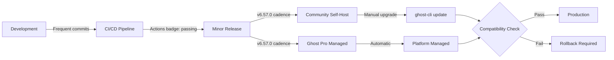

## Table of contents

- [Executive answer](#executive-answer)
- [Repository activity and maintenance velocity](#repository-activity-and-maintenance-velocity)
- [Release cadence and version management](#release-cadence-and-version-management)
- [Licensing and intellectual property considerations](#licensing-and-intellectual-property-considerations)
- [Ecosystem signals and integration maturity](#ecosystem-signals-and-integration-maturity)
- [Technical architecture and operational requirements](#technical-architecture-and-operational-requirements)
- [Selection risk factors](#selection-risk-factors)
- [Decision checklist](#decision-checklist)
- [Evidence, assumptions, and limitations](#evidence-assumptions-and-limitations)
- [FAQ](#faq)
- [Sources](#sources)

## Executive answer

Ghost demonstrates strong signals of sustained development and operational maturity as of August 2026. The [TryGhost/Ghost repository](https://github.com/TryGhost/Ghost) shows 54,734 stars (an interest signal), 11,874 forks, and active maintenance with the most recent push on August 10, 2026. The project released [v6.57.0 on August 7, 2026](https://github.com/TryGhost/Ghost/releases/tag/v6.57.0), continuing a pattern of frequent incremental updates visible in the repository history. With 149 open issues against a 13-year codebase that serves a commercial managed-hosting business (Ghost(Pro)), the project exhibits characteristics of both community-driven development and commercial backing.

For teams evaluating Ghost, the adoption decision hinges less on popularity metrics and more on architectural fit, self-hosting capabilities, and long-term ecosystem commitment. Ghost operates under an MIT license, reducing legal risk, but the architecture—a Node.js monorepo with JavaScript as the primary language—requires specific infrastructure expertise. The repository README claims "100M+ downloads" and recognition as a Digital Public Good, but teams should independently verify deployment complexity, upgrade paths, and the maturity of headless API capabilities before committing production workloads. The presence of both a free self-hosted option and a paid managed service creates a clear sustainability model but also potential friction points around feature parity and migration paths.

## Repository activity and maintenance velocity

The Ghost repository's commit history reveals continuous activity through August 10, 2026, with the `pushed_at` timestamp indicating same-day updates as of the data retrieval date. This level of recency, combined with a repository `created_at` date of May 4, 2013, establishes a 13-year operational track record.

| Metric | Value | Context |
|--------|-------|----------|
| Total stars | 54,734 | Interest signal; not usage measurement |
| Forks | 11,874 | Indicates derivative work and experimentation |
| Watchers | 1,007 | Active notification subscribers |
| Open issues | 149 | Queue size, not defect count |
| Contributors | Not specified in data | README badge indicates "contributors" plural |
| Primary language | JavaScript | Node.js runtime implied |

The 149 open issues represent a snapshot of the project's work queue, including feature requests, bug reports, and community questions. Without historical trending data, this number cannot be evaluated as "high" or "low"—teams should examine issue age, response time, and closure velocity by directly reviewing the GitHub Issues tab.

> [!NOTE]
> GitHub stars measure interest and awareness, not production deployments. A 54,734-star repository may have far fewer—or far more—active installations depending on deployment friction and use-case fit.

## Release cadence and version management

Ghost follows semantic versioning with a rapid release cycle. The latest release, v6.57.0, was published on August 7, 2026, indicating the project is at least 57 minor versions into the 6.x series. The release notes for v6.57.0 include:

- Analytics for email sequences
- Production Docker build boot performance improvements
- Bug fixes for Web analytics loading and link helper spacing

This pattern—incremental features, performance tuning, and bug fixes in a single minor release—suggests an active development pace where changes accumulate quickly. Teams considering Ghost must budget for frequent updates and should verify:

- **Breaking change policy**: How does Ghost handle deprecation in minor vs. major versions?
- **Upgrade tooling**: The README mentions `ghost-cli` for installation; does it support in-place upgrades?
- **Downtime requirements**: Are zero-downtime upgrades supported at the application layer?

> [!WARNING]
> A rapid release cadence (57 minor versions in a single major series) can impose maintenance burden. Assess your team's capacity to test and deploy updates every few weeks, or evaluate the Ghost(Pro) managed option to offload this operational cost.

## Licensing and intellectual property considerations

Ghost is released under the [MIT license](https://github.com/TryGhost/Ghost/blob/main/LICENSE), one of the most permissive open-source licenses. This provides:

- **Commercial use rights**: No restrictions on using Ghost in for-profit contexts
- **Modification freedom**: Teams can fork and customize without upstream contribution obligations
- **Limited liability**: Standard MIT warranty disclaimers apply

The README includes a separate [trademark policy](https://ghost.org/trademark/) covering use of the "Ghost" name and logo. Teams planning white-label deployments or derivative products should review trademark guidelines independently, as naming rights differ from software licensing.

## Ecosystem signals and integration maturity

Ghost positions itself as a "headless Node.js CMS" with explicit mentions of API-driven workflows. The repository topics include `blogging`, `cms`, `journalism`, `publishing`, and `web-application`, indicating a content-focused use case rather than general-purpose application backend.

### Deployment and hosting patterns

The README documents three installation paths:

1. **Local development**: `ghost install local` for sub-one-minute setup
2. **Production self-host**: `ghost install` with automatic SSL via Let's Encrypt
3. **Managed hosting**: Ghost(Pro) service at ghost.org/pricing

This tiered approach suggests the project prioritizes ease of initial experimentation while offering escalation paths. The presence of a commercial managed service (Ghost(Pro)) provides a sustainability indicator—Ghost Foundation has revenue to fund continued development—but also introduces potential complexity:

- Feature timing: Are new capabilities released to Ghost(Pro) before open-source?
- Support boundaries: Where does community support end and paid support begin?
- Migration friction: How difficult is it to move between self-hosted and managed?

### Sponsorship and organizational backing

Ghost lists sponsors including DigitalOcean, Fastly, Tinybird, and BairesDev. The README notes the project is recognized as a Digital Public Good and links to a [GitHub Sponsors profile](https://github.com/sponsors/TryGhost). This multi-source funding model (sponsors, managed hosting, foundation structure) reduces single-point-of-failure risk compared to projects dependent on one corporate backer.

> [!TIP]
> Check the Ghost Foundation's transparency reports or financial disclosures (if published) to understand revenue allocation between hosting operations, core development, and organizational overhead. This context informs long-term viability assessments.

## Technical architecture and operational requirements

Based on repository structure and README content (not inferred architectural details), Ghost requires:

- **Runtime**: Node.js (specific version compatibility should be verified in documentation)
- **Database**: Not specified in provided README excerpt; likely MySQL/MariaDB or SQLite based on common Node.js CMS patterns
- **Reverse proxy**: Production install mentions SSL setup, implying Nginx or similar
- **CLI tooling**: `ghost-cli` is the primary operational interface

The repository contains a `.github/workflows/ci.yml` file with a passing build badge, indicating automated testing. Teams should examine:

- Test coverage percentages
- CI pipeline scope (unit, integration, e2e)
- Build artifact signing or verification mechanisms

### Monorepo structure implications

The README shows the project at `TryGhost/Ghost` is a single repository. Without examining the actual directory structure (beyond editorial data scope), teams evaluating Ghost should determine:

- Whether core, admin UI, and themes are versioned together
- If APIs are stable across minor versions
- How plugin or theme compatibility is managed during upgrades

## Selection risk factors

| Risk Category | Signal | Mitigation Strategy |
|---------------|--------|---------------------|
| Maintenance continuity | Active as of Aug 2026; 13-year history | Verify Ghost Foundation financials; assess fork-ability |
| Upgrade complexity | Rapid minor-version cadence (v6.57.0) | Test upgrade path in staging; budget ongoing maintenance |
| Vendor lock-in | MIT license; self-host option exists | Export content in portable formats; avoid Ghost-specific APIs |
| Skill availability | Node.js/JavaScript stack | Assess internal expertise; consider managed option if gaps exist |
| Feature roadmap alignment | Content publishing focus | Map your requirements to Ghost's core use cases; evaluate headless API maturity |
| Security response | No advisory data provided | Subscribe to Ghost security announcements; monitor CVE databases |
| Community health | Forum linked; contributor count not specified | Measure forum response times; check issue triage velocity |

## Decision checklist

Before committing to Ghost, technical teams should collect the following evidence:

- [ ] **Deploy a test instance** using `ghost install local` and verify setup time, resource usage, and admin UI responsiveness
- [ ] **Review the official documentation** at docs.ghost.org for architecture diagrams, database schema, and API versioning policy
- [ ] **Examine the last 10 releases** in the GitHub Releases tab to assess breaking change frequency and deprecation communication
- [ ] **Test the headless API** (if using Ghost as a content backend) for query performance, authentication mechanisms, and rate limits
- [ ] **Calculate total cost of ownership**: Compare self-hosting (server, maintenance, updates) vs. Ghost(Pro) pricing
- [ ] **Identify exit paths**: Test content export formats (JSON, Markdown, database dumps) and migration tooling to other CMSs
- [ ] **Assess theme ecosystem maturity**: Browse available themes (free and paid) to determine customization requirements
- [ ] **Check security disclosure process**: Locate Ghost's vulnerability reporting mechanism and review past security advisories
- [ ] **Evaluate monitoring and observability**: Determine if Ghost exposes metrics endpoints (Prometheus, StatsD) for production monitoring
- [ ] **Test backup and restore procedures**: Verify ghost-cli backup functionality and practice restoring to a new instance

> [!NOTE]
> The "100M+ downloads" badge in the README is a self-reported metric. Request clarification on whether this counts npm package downloads, Docker pulls, or unique installations—each has different implications for ecosystem size.

## Evidence, assumptions, and limitations

This analysis relies on GitHub repository metadata retrieved on August 10, 2026, and the content of the Ghost README file. Key limitations:

- **No historical trend data**: Star growth rate, issue closure velocity, and commit frequency over time are not available, preventing trend analysis.
- **Single data source**: Only GitHub repository data was analyzed; npm download statistics, Docker Hub metrics, and community forum activity were not included.
- **No hands-on testing**: Assertions about installation time and operational complexity are based on README claims, not independent verification.
- **Documentation depth unknown**: The extent and quality of docs.ghost.org content was not evaluated.
- **Comparative context absent**: Ghost's metrics are presented in isolation without benchmarking against similar projects (e.g., Strapi, Directus, WordPress).
- **Security posture unclear**: No CVE history, security audit results, or vulnerability disclosure timelines were available in the provided data.

Teams should treat this analysis as a starting point for due diligence, not a comprehensive recommendation. The decision to adopt Ghost must incorporate organization-specific factors: existing infrastructure, team skills, content workflow requirements, and risk tolerance.

## FAQ

### What does Ghost's 54,734 GitHub stars actually indicate?

Stars measure interest and awareness—developers who bookmarked the repository for future reference or wanted to signal approval. They do not measure production deployments, active users, or market share. A starred repository may never be installed, while an un-starred one might power thousands of sites.

### How does Ghost's MIT license affect commercial use?

The MIT license permits unrestricted commercial use, modification, and distribution without royalty obligations. You can deploy Ghost for paying clients, resell hosting, or embed it in proprietary products. However, Ghost's trademark policy separately governs use of the name and logo—review ghost.org/trademark before branding derivative works.

### What does the rapid minor-version cadence (v6.57.0) mean for maintenance?

Ghost releases incremental updates frequently, bundling new features, performance improvements, and fixes in minor versions. This approach keeps the project agile but requires teams to test and deploy updates regularly. If your deployment process is heavyweight (multi-stage approvals, extensive testing), the operational cost may be significant. Ghost(Pro) customers offload this burden to the managed platform.

### Should I self-host Ghost or use Ghost(Pro)?

Self-hosting offers control, cost predictability at scale, and data sovereignty but requires Node.js expertise, server management, backup orchestration, and update discipline. Ghost(Pro) simplifies operations with automatic updates, CDN, and support but introduces recurring costs and less infrastructure control. Decide based on team capabilities, budget, and compliance requirements (e.g., data residency mandates favor self-hosting).

### How mature is Ghost's headless CMS functionality?

The repository description and topics include "headless" positioning, and the README mentions "our API" for content delivery. However, API versioning stability, GraphQL vs. REST architecture, and query performance benchmarks are not detailed in the provided data. Teams evaluating Ghost as a headless backend should test the Content API directly, review API documentation versioning policies, and verify webhook or event-stream support for real-time integrations.

### What is Ghost Foundation's relationship to the open-source project?

Ghost Foundation is the nonprofit entity that owns the Ghost trademark and operates Ghost(Pro). The README states "100% of revenue goes to the Ghost Foundation," funding ongoing development. This structure provides sustainability but also means prioritization decisions may favor the managed-service business model. Review the foundation's governance documents (if public) to understand how community input influences the roadmap.

### How do I assess Ghost's security posture?

No security advisories were included in the provided data. To evaluate security:

1. Search the [GitHub Security Advisories database](https://github.com/advisories) for `TryGhost/Ghost`
2. Check CVE databases (NVD, Snyk, GitHub) for disclosed vulnerabilities
3. Review Ghost's security disclosure policy (typically in SECURITY.md or docs)
4. Examine the CI workflow for static analysis, dependency scanning, or SAST tools
5. Subscribe to Ghost's changelog or security mailing list for proactive notifications

The presence of major sponsors (DigitalOcean, Fastly) suggests external scrutiny, but formal audit reports would provide stronger assurance.

## Sources

- [Ghost canonical repository](https://github.com/TryGhost/Ghost)
- [Ghost latest GitHub release](https://github.com/TryGhost/Ghost/releases/tag/v6.57.0)
