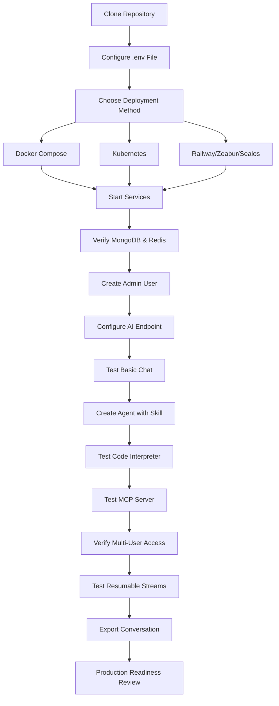

## Table of contents

- [Executive answer](#executive-answer)
- [What changed since the last major release](#what-changed-since-the-last-major-release)
- [Who should care about this update](#who-should-care-about-this-update)
- [Upgrade risk assessment](#upgrade-risk-assessment)
- [Test plan for new deployments](#test-plan-for-new-deployments)
- [Rollback plan](#rollback-plan)
- [Decision checklist](#decision-checklist)
- [Architecture and deployment patterns](#architecture-and-deployment-patterns)
- [Questions left unanswered by the documentation](#questions-left-unanswered-by-the-documentation)
- [Competitive positioning](#competitive-positioning)
- [Evidence, assumptions, and limitations](#evidence-assumptions-and-limitations)
- [Action checklist](#action-checklist)
- [Sources](#sources)
- [FAQ](#faq)

## Executive answer

LibreChat has transformed from a ChatGPT-inspired interface into a comprehensive self-hosted AI orchestration platform. The repository at [danny-avila/LibreChat](https://github.com/danny-avila/LibreChat) now supports AI Agents with Skills and Subagents, Model Context Protocol (MCP) servers for tool integration, a secure Code Interpreter API executing code in seven languages, and Generative UI with Code Artifacts. The platform unifies OpenAI, Anthropic, AWS Bedrock, Google, Azure, Vertex AI, DeepSeek, Groq, Mistral, and OpenRouter under a single multi-user interface with 41,876 GitHub stars as of August 2026.

This update matters for engineering teams building self-hosted AI infrastructure, organizations requiring data sovereignty, and developers evaluating agent frameworks. The MCP integration positions LibreChat as one of the first [official MCP clients](https://modelcontextprotocol.io/clients#librechat), enabling tool composition without vendor lock-in. The Admin Panel and role-based access controls make LibreChat viable for team deployments, while the Code Interpreter—powered by ClickHouse's sandboxed execution engine—addresses a capability gap in self-hosted platforms.

## What changed since the last major release

LibreChat does not publish traditional versioned releases with GitHub release tags. Instead, the [Changelog](https://www.librechat.ai/changelog) on the official documentation site tracks feature additions. As of August 10, 2026, the repository shows continuous integration with 8,657 forks and active development (last push August 10, 2026). The following features represent the most significant architectural expansions:

### Agents and tooling

**LibreChat Agents** allow users to create no-code custom assistants with delegated tool access, file search, and code execution. These agents support:

- **Skills**: Reusable instruction bundles packaged as `SKILL.md` files, attachable to agents for manual, automatic, or always-on workflows
- **Subagents**: Child agent runs with isolated context windows for focused subtasks
- **Agent Marketplace**: Community-built agents discoverable and deployable within the platform
- **Collaborative Sharing**: Agents can be shared with specific users or groups, not just globally

Agents integrate with Custom Endpoints, OpenAI, Azure, Anthropic, AWS Bedrock, Google, Vertex AI, and the OpenAI Responses API.

### Model Context Protocol (MCP) integration

[MCP support](https://modelcontextprotocol.io/clients#librechat) enables LibreChat to connect to any MCP server as a tool provider. This allows:

- Dynamic tool discovery and invocation without hardcoded integrations
- Local or remote MCP servers for database queries, API calls, file system access, or custom workflows
- Image generation via MCP servers (in addition to DALL-E, Stable Diffusion, and Flux)

MCP positions LibreChat as infrastructure-agnostic tooling middleware.

### Code Interpreter API

The [Code Interpreter](https://www.librechat.ai/docs/features/code_interpreter) executes user or AI-generated code in sandboxed environments for Python, Node.js (JavaScript/TypeScript), Go, C/C++, Java, PHP, Rust, and Fortran. Key characteristics:

- Powered by [ClickHouse/code-interpreter](https://github.com/ClickHouse/code-interpreter), an open-source sandboxed execution engine
- File upload, processing, and download within the execution context
- No external API dependency; fully self-hosted

This addresses a common limitation in self-hosted AI platforms that rely on OpenAI's Code Interpreter or lack execution entirely.

### Code Artifacts and Generative UI

[Code Artifacts](https://youtu.be/GfTj7O4gmd0?si=WJbdnemZpJzBrJo3) allow the AI to generate React components, HTML pages, or Mermaid diagrams directly in chat. Users can preview, edit, and iterate on these artifacts in real time, similar to Claude's Artifacts feature.

### Resumable Streams

[Resumable Streams](https://www.librechat.ai/docs/features/resumable_streams) automatically reconnect and resume AI responses if the network connection drops. Streams remain active across:

- Multiple browser tabs
- Multiple devices (when backed by Redis)
- Horizontal scaling deployments

This feature eliminates the "lost response" problem common in long-running AI tasks.

### Admin Panel

The [Admin Panel](https://www.librechat.ai/docs/features/admin_panel) provides a browser-based UI to:

- Manage users, groups, and roles
- Override configuration settings per user, role, or group
- Apply permission policies without redeploying the application

The panel is bundled with Docker Compose stacks for one-command setup.

### Image generation expansion

LibreChat now supports:

- **GPT-Image-1**: Text-to-image and image-to-image workflows
- **DALL-E 3/2**: Legacy text-to-image
- **Stable Diffusion**: Local deployment option
- **Flux**: Another local/remote model option
- **MCP servers**: Any MCP-compatible image generation tool

### Reasoning UI

A dynamic interface for chain-of-thought models like DeepSeek-R1, displaying reasoning traces and intermediate steps inline.


## Who should care about this update

| Audience | Relevance | Priority |
|----------|-----------|----------|
| **Engineering teams deploying AI agents** | MCP and agent framework with subagent delegation, Skills, and tool composition | High |
| **Organizations requiring data sovereignty** | Fully self-hosted, no external API dependency except chosen LLM providers | High |
| **Enterprises evaluating ChatGPT alternatives** | Multi-user auth (OAuth2, LDAP), role-based access, admin panel, moderation tools | High |
| **Developers building custom AI tooling** | MCP server integration allows proprietary tool exposure without API rewrites | Medium |
| **AI researchers testing multi-model workflows** | Unified interface for 15+ providers, conversation forking, preset management | Medium |
| **Teams using LangChain or LangGraph** | Agent and tool capabilities overlap; LibreChat offers a ready-made UI and deployment stack | Medium |
| **Startups minimizing AI spend** | Local model support (Ollama, MLX), custom endpoints, no per-seat SaaS fees | Medium |
| **Developers of ChatGPT UI clones** | Reference implementation with 41,876 stars, active community, MIT license | Low |

## Upgrade risk assessment

> [!WARNING]
> LibreChat does not publish semantic versioning or tagged releases. Updates are applied via `git pull` from the `main` branch. The [Changelog](https://www.librechat.ai/changelog) documents breaking changes, but there is no automated migration tooling.

### Breaking changes to watch

The changelog page warns users to consult it before updating. Common breaking changes in self-hosted platforms include:

- Database schema migrations requiring manual SQL execution
- Environment variable renaming or removal
- Docker Compose file structure changes
- Authentication provider configuration updates

**Recommendation**: Review the [Changelog](https://www.librechat.ai/changelog) for all commits between your current deployment date and the target update date. Test updates in a staging environment with a database backup.

### Dependency surface

LibreChat is a TypeScript monorepo with:

- 689 open issues (as of August 10, 2026)
- Active development (last push August 10, 2026)
- 201 watchers, indicating significant community monitoring

The large issue count reflects active feature development rather than stability problems, but it signals that edge cases and configuration permutations are still being discovered.

### Infrastructure dependencies

| Component | Requirement | Risk |
|-----------|-------------|------|
| **MongoDB** | Conversation and user storage | Migration required if schema changes |
| **Redis** (optional) | Resumable Streams, multi-instance sync | Optional; impacts horizontal scaling only |
| **S3 + CloudFront** (optional) | Stable media links, edge delivery | Optional; impacts file handling and CDN |
| **MCP servers** (optional) | External tool providers | Failure modes depend on MCP server stability |
| **LLM provider APIs** | OpenAI, Anthropic, Google, etc. | Rate limits, API changes, billing surprises |

## Test plan for new deployments



### Step-by-step validation

1. **Basic functionality**
   - Send a message to OpenAI GPT-4o or another configured endpoint
   - Verify response streaming works
   - Upload an image and confirm vision model processing
   - Test message editing, resubmission, and conversation forking

2. **Agent and tool testing**
   - Create an agent with file search enabled
   - Attach a `SKILL.md` file and verify the agent follows instructions
   - Create a subagent and confirm isolated context
   - Test agent sharing with a secondary user

3. **Code Interpreter validation**
   - Request Python code execution (e.g., "Plot a sine wave")
   - Upload a CSV file and ask for summary statistics
   - Test Node.js, Go, or another supported language
   - Verify sandboxing by attempting file system access

4. **MCP integration**
   - Configure a local MCP server (e.g., filesystem access)
   - Verify tool discovery in the agent configuration UI
   - Invoke the tool from a conversation
   - Monitor logs for MCP server errors

5. **Resumable Streams**
   - Start a long-running AI response
   - Disconnect the network mid-stream
   - Reconnect and verify the response resumes
   - Open the same conversation in a second browser tab

6. **Admin Panel**
   - Log in as an admin user
   - Create a new role with restricted endpoint access
   - Assign the role to a test user and verify enforcement
   - Override a configuration setting for a specific user

7. **Export and migration**
   - Export a conversation as JSON, Markdown, and screenshot
   - Import a ChatGPT conversation export
   - Verify search functionality across imported conversations

## Rollback plan

Because LibreChat uses continuous deployment from `main`, rollback requires:

1. **Database backup**: Export MongoDB collections before updating
2. **Git commit pinning**: Record the current commit hash before `git pull`
3. **Environment variable backup**: Copy the `.env` file
4. **Rollback procedure**:
   ```bash
   git checkout <previous-commit-hash>
   docker-compose down
   docker-compose up -d --build
   ```
5. **Database restoration**: If schema changes occurred, restore MongoDB from backup

> [!TIP]
> Use a staging environment with a copy of production data to test updates before applying them to production. LibreChat's Docker Compose setup makes parallel environments straightforward.

## Decision checklist

Before adopting or upgrading LibreChat, verify:

- [ ] **Data sovereignty**: Do you require on-premises AI infrastructure with no external dependencies?
- [ ] **Model flexibility**: Do you need to switch between multiple LLM providers or run local models?
- [ ] **Agent requirements**: Will users build custom agents with tools, file search, or code execution?
- [ ] **MCP compatibility**: Do you plan to expose proprietary tools via MCP servers?
- [ ] **Multi-user needs**: How many users will access the platform? Are role-based permissions required?
- [ ] **Compliance**: Does your organization prohibit data transmission to third-party AI APIs?
- [ ] **Operations capacity**: Can your team manage Docker Compose, MongoDB, and Redis in production?
- [ ] **Update tolerance**: Can you handle breaking changes and manual migrations during updates?
- [ ] **Cost model**: Have you compared self-hosting costs (infrastructure, operations) to SaaS AI platforms?
- [ ] **Code Interpreter use case**: Do you need secure, sandboxed code execution for Python, Node.js, or other languages?
- [ ] **CDN integration**: Will you configure S3 + CloudFront for stable media links and edge delivery?
- [ ] **Resumable Streams**: Is connection resilience critical for your use case?

## Architecture and deployment patterns

Based on the repository structure and documentation, LibreChat follows a monolithic TypeScript architecture with:

- **Frontend**: React-based UI served from the same Node.js process
- **Backend**: Express.js API handling authentication, conversation storage, and LLM proxy logic
- **Database**: MongoDB for conversations, users, and presets
- **Cache/Queue**: Optional Redis for Resumable Streams and horizontal scaling
- **File Storage**: Local filesystem or S3-compatible object storage

### Deployment options

The README advertises one-click deployment to:

- [Railway](https://railway.com/deploy/librechat-official)
- [Zeabur](https://zeabur.com/templates/0X2ZY8)
- [Sealos](https://template.cloud.sealos.io/deploy?templateName=librechat)

For production deployments, the recommended path is Docker Compose with:

```yaml
services:
  librechat:
    image: ghcr.io/danny-avila/librechat:latest
    environment:
      - MONGO_URI=mongodb://mongo:27017/LibreChat
      - REDIS_URI=redis://redis:6379
    volumes:
      - ./librechat.yaml:/app/librechat.yaml
  mongo:
    image: mongo:latest
  redis:
    image: redis:latest
```

Kubernetes deployments require custom manifests; no Helm chart is officially provided.

### Inferred scaling characteristics

- **Vertical scaling**: Single-instance deployments handle moderate user loads; bottleneck is LLM API rate limits
- **Horizontal scaling**: Requires Redis for session state and Resumable Streams synchronization
- **Database scaling**: MongoDB sharding not documented; large deployments may hit write contention
- **File storage**: S3 + CloudFront recommended for multi-instance deployments to avoid local filesystem conflicts

## Questions left unanswered by the documentation

1. **Agent performance**: What is the latency overhead of subagent delegation? How many subagent calls are practical in a single conversation?
2. **MCP server discovery**: Is there a registry or marketplace for MCP servers, or must users manually configure each tool?
3. **Code Interpreter isolation**: What are the resource limits (CPU, memory, execution time) for sandboxed code? Can these be configured?
4. **Resumable Streams guarantees**: What is the maximum reconnection window? Are there message ordering guarantees in concurrent multi-tab scenarios?
5. **Admin Panel audit logs**: Are configuration overrides and role changes logged? Is there a compliance export?
6. **LLM provider billing**: Does LibreChat proxy all requests, or do clients connect directly to LLM APIs? How are API keys managed per user vs. per organization?
7. **Migration from ChatGPT**: The README claims ChatGPT import support, but does it preserve conversation metadata, timestamps, and model identifiers?
8. **Agent Marketplace moderation**: Who curates community-built agents? Are there security reviews before publication?
9. **Skills composability**: Can Skills reference other Skills? Is there a standard library of reusable Skills?
10. **Reasoning UI compatibility**: Does the Reasoning UI work with all providers, or only specific models like DeepSeek-R1?

> [!NOTE]
> LibreChat's rapid feature expansion suggests the documentation may lag implementation. The [Discord community](https://discord.librechat.ai) and [GitHub issues](https://github.com/danny-avila/LibreChat/issues) are primary support channels.

## Competitive positioning

LibreChat competes with:

- **ChatGPT Enterprise**: LibreChat offers self-hosting and multi-provider support; ChatGPT Enterprise offers tighter integration and enterprise SLAs
- **Chatbot UI (mckaywrigley)**: Both are open-source ChatGPT clones; LibreChat adds Agents, MCP, Code Interpreter, and Admin Panel
- **LangChain/LangGraph + custom UI**: LibreChat provides a ready-made UI and deployment stack; LangChain offers more programmatic control
- **Open WebUI (formerly Ollama WebUI)**: Similar self-hosted focus; Open WebUI emphasizes local models, LibreChat emphasizes multi-provider orchestration and agents
- **Jan.ai**: Desktop-first AI client; LibreChat is server-based with multi-user support

LibreChat's differentiators are MCP integration, Code Interpreter, and the Admin Panel for team deployments.

## Evidence, assumptions, and limitations

**Evidence sources**:
- Repository metadata from [danny-avila/LibreChat](https://github.com/danny-avila/LibreChat) as of August 10, 2026
- README.md feature list and architecture claims
- Documented features at [librechat.ai/docs](https://librechat.ai/docs)
- [Changelog](https://www.librechat.ai/changelog) for historical updates

**Assumptions**:
- Feature descriptions are inferred from README prose; no hands-on testing was performed
- Deployment patterns are based on documented Docker Compose examples; Kubernetes and horizontal scaling characteristics are inferred
- MCP integration is confirmed by the official [MCP clients list](https://modelcontextprotocol.io/clients#librechat)
- Code Interpreter isolation claims rely on the ClickHouse project's security model

**Limitations**:
- No official versioned release exists; "latest" refers to the `main` branch as of August 10, 2026
- Performance benchmarks, concurrency limits, and resource usage are not documented
- Security audit status unknown; MIT license provides no warranty
- 689 open issues suggest active debugging; production readiness depends on specific feature usage
- Multi-tenancy and data isolation mechanisms not detailed beyond "multi-user authentication"

## Action checklist

For teams evaluating LibreChat:

1. **Proof of concept**:
   - Deploy locally via Docker Compose
   - Configure one LLM provider (e.g., OpenAI)
   - Test conversation creation, message editing, and conversation forking
   - Create an agent with a Skill and verify behavior

2. **Agent and tooling evaluation**:
   - Deploy a local MCP server (e.g., [filesystem MCP server](https://github.com/modelcontextprotocol/servers))
   - Configure the MCP server in LibreChat
   - Test tool invocation from an agent
   - Measure agent response latency and subagent delegation overhead

3. **Security review**:
   - Audit authentication configuration (OAuth2 providers, LDAP)
   - Test role-based access controls in the Admin Panel
   - Verify Code Interpreter sandboxing with filesystem and network access attempts
   - Review environment variable handling for API key exposure

4. **Operational readiness**:
   - Test MongoDB backup and restore procedures
   - Simulate a breaking change rollback
   - Configure monitoring for MongoDB, Redis, and Node.js process health
   - Estimate infrastructure costs (compute, storage, LLM API spend)

5. **Production deployment**:
   - Provision S3 + CloudFront for file storage
   - Configure Redis for Resumable Streams
   - Enable HTTPS with a reverse proxy (Nginx, Traefik)
   - Set up log aggregation (e.g., ELK, Grafana Loki)
   - Document environment variables and configuration overrides

## Sources

- [LibreChat canonical repository](https://github.com/danny-avila/LibreChat)

## FAQ

### What is the difference between LibreChat Agents and OpenAI Assistants?

LibreChat Agents are a proprietary agent framework built into LibreChat, supporting Skills (reusable instruction bundles), Subagents (isolated child runs), and MCP tool integration. OpenAI Assistants are OpenAI's proprietary agent API. LibreChat can call OpenAI Assistants as one of many supported endpoints, but LibreChat Agents run independently and work with any LLM provider LibreChat supports (Anthropic, Google, local models, etc.).

### Does LibreChat require internet access to function?

LibreChat's core application does not require internet access if you configure local LLM providers (e.g., Ollama, MLX) and disable external features (web search, image generation APIs). However, most deployments connect to at least one cloud LLM provider (OpenAI, Anthropic, Google) for AI responses. The Code Interpreter and MCP servers can run entirely locally.

### How does LibreChat handle API keys for multiple users?

LibreChat supports two patterns: (1) administrator-provided API keys shared across all users, or (2) user-provided API keys stored per user. The Admin Panel allows configuration of which endpoints are available to which roles. User-provided keys are stored encrypted in MongoDB.

### Can I migrate conversations from ChatGPT to LibreChat?

Yes. LibreChat's import feature supports ChatGPT conversation exports in JSON format. The README also claims support for imports from Chatbot UI. Imported conversations retain message history but may lose ChatGPT-specific metadata like model version or plugin invocations.

### What is the recommended production deployment architecture?

The documentation recommends Docker Compose for single-instance deployments and Redis-backed horizontal scaling for high availability. Use S3 + CloudFront for file storage in multi-instance setups. MongoDB should be deployed with replication for production. The Admin Panel requires no additional infrastructure; it is bundled with the main application.

### How does the Code Interpreter compare to OpenAI's Code Interpreter?

LibreChat's Code Interpreter is self-hosted and supports seven languages (Python, Node.js, Go, C/C++, Java, PHP, Rust, Fortran) via sandboxed execution powered by ClickHouse's code-interpreter library. OpenAI's Code Interpreter is a proprietary cloud service supporting Python only. LibreChat's version requires infrastructure but offers data sovereignty and no per-execution cost.

### Is LibreChat production-ready for enterprise deployments?

LibreChat includes multi-user authentication (OAuth2, LDAP), role-based access controls, an Admin Panel, and moderation tools, which are enterprise requirements. However, the lack of semantic versioning, 689 open issues, and continuous deployment from `main` indicate that production readiness depends on your risk tolerance and operational capacity. Teams should deploy in staging first and monitor the [Changelog](https://www.librechat.ai/changelog) for breaking changes.
