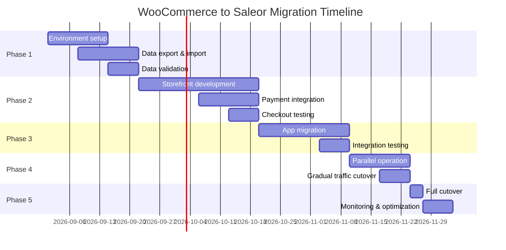

## Table of contents

- [Executive answer](#executive-answer)
- [Architectural differences and implications](#architectural-differences-and-implications)
- [Suitability assessment](#suitability-assessment)
- [Pre-migration inventory and audit](#pre-migration-inventory-and-audit)
- [Compatibility risks and breaking changes](#compatibility-risks-and-breaking-changes)
- [Phased migration plan](#phased-migration-plan)
- [Test strategy and validation](#test-strategy-and-validation)
- [Rollback strategy and gates](#rollback-strategy-and-gates)
- [Decision checklist](#decision-checklist)
- [Evidence, assumptions, and limitations](#evidence-assumptions-and-limitations)
- [Sources](#sources)
- [FAQ](#faq)

## Executive answer

Migrating from [WooCommerce](https://github.com/woocommerce/woocommerce) (PHP/WordPress monolith, 10,455 stars) to [Saleor](https://github.com/saleor/saleor) (Python/GraphQL headless API, 23,209 stars) represents a fundamental architectural shift from a plugin-based, coupled commerce system to an API-first, technology-agnostic platform. This migration is justified when you need independent frontend deployment, multi-channel commerce with per-channel configuration, technology stack flexibility beyond PHP/WordPress, or when plugin conflicts and WordPress coupling limit scalability. It is *not* justified for small catalogs with simple requirements, teams without API/GraphQL expertise, or organizations heavily invested in WordPress-specific plugins with no Saleor app equivalents.

The migration requires full data export from WooCommerce (products, customers, orders, media), transformation into Saleor's GraphQL schema, frontend decoupling from WordPress themes, and integration of payment/fulfillment providers via Saleor's webhook-based app architecture. Expect 3–6 months for a phased migration with parallel operation, comprehensive API testing, and gradual traffic cutover. Rollback gates must include database snapshots, DNS-level switching capability, and order reconciliation procedures. Data as of August 10, 2026 shows WooCommerce at version 11.0.0 (released August 4, 2026) and Saleor at 3.23.26 (released August 10, 2026).

## Architectural differences and implications

WooCommerce and Saleor represent divergent architectural philosophies that directly impact migration complexity.

**WooCommerce architecture** (inferred from [repository structure](https://github.com/woocommerce/woocommerce)): A monolithic PHP plugin tightly coupled to WordPress, relying on WordPress hooks, database schema extensions, and server-side rendering via PHP templates. The repository is organized as a monorepo (PNPM workspaces) containing plugins, packages (PHP and JavaScript), and tools. Extensibility occurs through WordPress plugins that share the same runtime, database, and often the same request lifecycle. As stated in the README, it requires PHP 7.4+, Composer, and Node.js/PNPM for development.

**Saleor architecture** (inferred from [repository structure](https://github.com/saleor/saleor)): A Python-based, API-only backend exposing GraphQL exclusively. According to the README, it is "GraphQL native, API-only platform for scalable composable commerce" with "Headless and API only" design. Extensibility occurs via webhooks, apps (deployed independently), metadata, subscription queries, and API extensions—all decoupled from the core runtime. The frontend is completely separate (e.g., [React Storefront](https://github.com/saleor/storefront)), and the [Dashboard](https://github.com/saleor/saleor-dashboard) is a standalone React application.

### Key implications for migration

| Dimension | WooCommerce | Saleor | Migration impact |
|-----------|-------------|--------|------------------|
| **Language/runtime** | PHP 7.4+, WordPress | Python 3.x, Django | Complete backend rewrite; no code portability |
| **API paradigm** | REST (WC API), WordPress hooks | GraphQL only | All integrations require GraphQL client rewrites |
| **Data layer** | WordPress MySQL schema + WC extensions | PostgreSQL with Django ORM | Schema mapping, data transformation, type conversion |
| **Frontend coupling** | PHP templates, WordPress themes | Fully decoupled, any frontend framework | Theme replacement with headless storefront |
| **Extension model** | WordPress plugins (shared runtime) | Apps via webhooks (independent services) | Plugin logic → webhook/app services |
| **Deployment unit** | Monolith (WordPress + WooCommerce) | Core + independent apps | Infrastructure redesign for service-oriented architecture |

> [!WARNING]
> WooCommerce plugins that modify the WordPress admin UI, hook into `wp_query`, or extend the MySQL schema cannot be directly ported. Each must be reimplemented as a Saleor app using webhooks or as frontend customizations in the decoupled storefront.

## Suitability assessment

### Migration is justified when

1. **Frontend technology flexibility is critical**: You need React, Vue, mobile apps, or multiple storefronts sharing one backend without WordPress theme constraints.
2. **Multi-channel complexity exists**: Per-channel pricing, currencies, stock, and catalog variations exceed WooCommerce's capabilities (Saleor offers [native multichannel](https://docs.saleor.io/developer/channels/overview)).
3. **Plugin conflicts block progress**: WordPress plugin incompatibilities, update breakage, or performance degradation from shared runtime.
4. **API-first integrations dominate**: Extensive integrations with ERP, PIM, OMS, or marketing automation favor GraphQL's type safety and introspection.
5. **Independent deployment cadence needed**: Marketing, backend, and operations teams require separate release cycles.
6. **Scalability and uptime are non-negotiable**: Service-oriented architecture allows scaling components independently and reduces downtime during updates.

### Migration is *not* justified when

1. **Catalog is small and stable** (< 500 SKUs, infrequent changes): WooCommerce's simplicity outweighs Saleor's architectural benefits.
2. **Team lacks GraphQL/Python expertise**: Learning curve and hiring costs exceed migration ROI.
3. **WordPress ecosystem is a strategic asset**: Heavy reliance on WordPress SEO plugins (Yoast, Rank Math), content marketing workflows, or multisite setups that integrate deeply with WooCommerce.
4. **Budget or timeline is constrained**: Migration typically costs 3–6 developer-months plus infrastructure changes.
5. **Custom WooCommerce plugins are extensive and undocumented**: Reverse-engineering and reimplementation risk is prohibitive.


## Pre-migration inventory and audit

Before planning migration phases, catalog all dependencies and customizations.

### WooCommerce inventory checklist

- [ ] **Product catalog**: Count of simple products, variations, grouped products, virtual/downloadable items, custom product types
- [ ] **Attributes and taxonomies**: Custom product attributes, categories, tags, global attributes
- [ ] **Customer data**: User accounts, roles, customer meta fields, guest checkout history
- [ ] **Order history**: Order count, order meta, refunds, partial shipments, custom order statuses
- [ ] **Media assets**: Product images, galleries, downloadable files, file storage locations (local, S3, CDN)
- [ ] **Installed plugins**: Payment gateways, shipping providers, subscriptions, memberships, custom extensions
- [ ] **Theme customizations**: Template overrides, custom shortcodes, WordPress widgets used in commerce flows
- [ ] **Integrations**: CRM, email marketing, analytics, ERP, inventory management, accounting
- [ ] **Custom code**: Functions.php modifications, custom REST endpoints, AJAX handlers, custom admin pages
- [ ] **Webhooks and automations**: Zapier, Make.com, or custom webhooks triggered by WooCommerce events

### Saleor capability mapping

For each WooCommerce feature, identify the Saleor equivalent:

| WooCommerce feature | Saleor equivalent | Migration strategy |
|---------------------|-------------------|--------------------|
| Product variations | Variants with attributes | Direct mapping via GraphQL `productVariantBulkCreate` |
| Custom product meta | Metadata (key-value on products) | Export meta_data, import via `updateMetadata` mutation |
| WooCommerce Subscriptions plugin | Build via Saleor app + webhooks | Custom subscription app listening to `ORDER_CREATED` |
| Payment gateway plugins | Saleor payment apps or Adyen integration | Use official Saleor payment apps or build custom via `PAYMENT_AUTHORIZE` webhook |
| Shipping zones/classes | Saleor shipping methods per channel | Map zones → channels, configure shipping via dashboard or API |
| Coupons/discounts | Vouchers, sales, promotion rules | Export coupon data, create via `voucherCreate`, `saleCreate` mutations |
| WordPress users/roles | Saleor customers + permission groups | Migrate users via `customerBulkCreate`, map roles to Saleor permission groups |

> [!NOTE]
> Saleor's [app framework](https://docs.saleor.io/developer/extending/apps/overview) supports webhook-based extensions and dashboard iframes. Complex WooCommerce plugin logic (e.g., subscriptions, booking systems) typically requires a custom Saleor app deployed as an independent service.

## Compatibility risks and breaking changes

### Data model incompatibilities

1. **Hierarchical categories**: WooCommerce supports unlimited category nesting; Saleor uses a flat category structure with collections for merchandising. Deep category trees must be flattened or reorganized.
2. **Order line-item meta**: WooCommerce stores arbitrary meta on order items; Saleor uses structured product variants and metadata. Custom order item data requires schema design in Saleor.
3. **Guest checkout**: WooCommerce permits true guest checkout with no account; Saleor creates temporary customer records. Post-migration, guest order lookup requires email-based search.
4. **Tax calculation**: WooCommerce uses WordPress-based tax classes and rates; Saleor integrates with TaxJar, Avalara, or custom tax apps. Tax logic may require reconfiguration.
5. **Downloadable products**: WooCommerce manages file downloads and access control; Saleor requires a custom app or integration with digital asset delivery services.

### API incompatibilities

WooCommerce exposes a [REST API](https://woocommerce.github.io/woocommerce-rest-api-docs/); Saleor exposes only GraphQL. All client applications, mobile apps, and third-party integrations must migrate from REST to GraphQL queries/mutations.

**Example: Fetch product list**

WooCommerce REST:
```
GET /wp-json/wc/v3/products?per_page=10
```

Saleor GraphQL:
```graphql
query {
  products(first: 10, channel: "default-channel") {
    edges {
      node {
        id
        name
        slug
      }
    }
  }
}
```

### Infrastructure incompatibilities

- **Database**: MySQL/MariaDB (WooCommerce) → PostgreSQL (Saleor). Full database export, transformation, and import required.
- **File storage**: WordPress media library → configurable storage (local, S3, GCS). Media URLs change unless custom CDN mapping is implemented.
- **Caching**: WordPress object cache, transients → Redis/Memcached at application level. Caching strategies differ.
- **Search**: WooCommerce search via WordPress query → Saleor integrates with Elasticsearch or Algolia. Search index must be rebuilt.

> [!TIP]
> Run Saleor and WooCommerce in parallel during migration. Use feature flags or DNS routing to test Saleor with a subset of traffic while keeping WooCommerce as the fallback.

## Phased migration plan

### Phase 1: Environment setup and read-only testing (2–4 weeks)

**Objective**: Deploy Saleor, import product catalog in read-only mode, test data integrity.

1. **Deploy Saleor infrastructure**:
   - PostgreSQL database
   - Redis for caching and Celery (background tasks)
   - S3 or equivalent for media storage
   - Saleor Core (Python/Django)
   - Saleor Dashboard (React app)
   - Optional: Storefront (e.g., [React Storefront](https://github.com/saleor/storefront))

2. **Export WooCommerce data**:
   - Use WooCommerce REST API or direct database queries
   - Export products, variations, categories, attributes, media URLs
   - Export customers (email, name, metadata)
   - Export historical orders (for reporting; do not migrate to live order processing)

3. **Transform and import into Saleor**:
   - Write scripts using Saleor GraphQL mutations (`productCreate`, `productVariantBulkCreate`, `categoryCreate`, `customerBulkCreate`)
   - Map WooCommerce categories → Saleor categories + collections
   - Map WooCommerce attributes → Saleor attributes
   - Import media: download from WooCommerce, upload to S3, associate with products via `productMediaCreate`

4. **Validate data**:
   - Compare product counts, SKU uniqueness, pricing, inventory
   - Verify category/collection assignments
   - Test search and filtering in Saleor Dashboard

**Rollback gate**: If data integrity issues exceed 5% of catalog, halt and revise transformation scripts.

### Phase 2: Frontend decoupling and integration (4–8 weeks)

**Objective**: Build or configure headless storefront, integrate payment/shipping, test checkout flow.

1. **Storefront selection**:
   - Use Saleor's [React Storefront](https://github.com/saleor/storefront) as a starting point, or
   - Build custom frontend with Next.js, Gatsby, or Vue using Saleor GraphQL API

2. **Implement core commerce flows**:
   - Product listing and detail pages
   - Cart management (`checkoutCreate`, `checkoutLinesAdd`, `checkoutComplete` mutations)
   - Customer authentication (`tokenCreate`, `accountRegister`)
   - Checkout and payment

3. **Payment gateway integration**:
   - Install Saleor payment apps (e.g., Stripe, Adyen) or build custom via `PAYMENT_AUTHORIZE` webhook
   - Test authorization, capture, refund flows

4. **Shipping integration**:
   - Configure shipping methods per channel in Saleor
   - Integrate live rates (e.g., via custom shipping app webhook) if needed

5. **Testing**:
   - End-to-end checkout tests with test payment credentials
   - Load testing with expected traffic
   - Accessibility and responsive design validation

**Rollback gate**: If checkout completion rate in staging < 95% of WooCommerce baseline, do not proceed.

### Phase 3: App migration and custom logic (4–6 weeks)

**Objective**: Reimplement WooCommerce plugins as Saleor apps or external services.

1. **Identify plugin replacements**:
   - Subscription logic → custom Saleor app listening to `ORDER_CREATED`, `ORDER_FULFILLED` webhooks
   - Loyalty/points → custom app with metadata storage and checkout discount webhooks
   - Inventory sync → app listening to `PRODUCT_UPDATED` webhook, pushing to ERP

2. **Build Saleor apps**:
   - Use Saleor App Template or build from scratch
   - Deploy as independent services (Node.js, Python, Go, etc.)
   - Register webhooks via Saleor Dashboard or `webhookCreate` mutation
   - Test webhook delivery, retries, and idempotency

3. **CRM/marketing integrations**:
   - Migrate email marketing integrations (Mailchimp, Klaviyo) to use Saleor webhooks (`CUSTOMER_CREATED`, `ORDER_CREATED`)
   - Update analytics tracking (Google Analytics, Facebook Pixel) in headless storefront

**Rollback gate**: All critical integrations (payment, shipping, inventory sync) must pass end-to-end testing.

### Phase 4: Parallel operation and gradual cutover (2–4 weeks)

**Objective**: Run both systems in parallel, route subset of traffic to Saleor, monitor metrics.

1. **Dual-write setup** (optional for real-time sync):
   - Write orders to both WooCommerce and Saleor during transition
   - Or: route read-only traffic to Saleor, keep WooCommerce as system of record for orders

2. **Traffic routing**:
   - Use DNS-based routing, CDN rules, or load balancer to send 10% → 50% → 100% of traffic to Saleor storefront
   - Segment by geography, customer cohort, or product category for gradual rollout

3. **Monitoring**:
   - Compare conversion rates, average order value, checkout abandonment between WooCommerce and Saleor
   - Monitor API response times, error rates, webhook delivery success
   - Set alerts for order discrepancies

4. **Order reconciliation**:
   - Daily batch comparison of orders between systems
   - Resolve discrepancies (refunds, partial shipments) manually or via scripts

**Rollback gate**: If Saleor conversion rate < 95% of WooCommerce or critical errors occur, revert traffic to WooCommerce via DNS/load balancer.

### Phase 5: Full cutover and decommissioning (1–2 weeks)

**Objective**: Route 100% traffic to Saleor, maintain WooCommerce as read-only archive.

1. **DNS cutover**: Point primary domain to Saleor storefront
2. **Disable WooCommerce checkout**: Mark WooCommerce site as read-only or take offline
3. **Historical order access**: Keep WooCommerce/WordPress running in read-only mode for customer order history lookup, or export all historical orders into Saleor for unified view
4. **SEO transition**: Implement 301 redirects from old WordPress URLs to Saleor storefront URLs
5. **Post-launch monitoring**: 24/7 on-call for first week, daily metrics review for first month



## Test strategy and validation

### Data migration testing

| Test type | Method | Acceptance criteria |
|-----------|--------|---------------------|
| **Product count** | Compare WooCommerce product count vs. Saleor `products { totalCount }` | 100% match |
| **SKU uniqueness** | Query for duplicate SKUs in Saleor | Zero duplicates |
| **Pricing accuracy** | Sample 100 random products, compare prices | 100% match |
| **Inventory** | Compare stock levels for all variants | ≤ 1% discrepancy (account for sales during migration) |
| **Media URLs** | Validate all product images load, no 404s | 100% accessible |
| **Customer accounts** | Compare customer email counts | 100% match |
| **Order history** | Sample 50 recent orders, compare line items, totals | 100% match |

### Functional testing

- **Checkout flow**: Place test orders for all payment methods, shipping methods, and discount scenarios
- **Inventory deduction**: Verify stock decrements on order placement, increments on cancellation
- **Webhook delivery**: Simulate `ORDER_CREATED`, `ORDER_FULFILLED`, `CUSTOMER_CREATED` events; verify external apps receive data
- **Tax calculation**: Compare tax amounts for sample orders across jurisdictions
- **Multi-channel**: Verify per-channel pricing, currency, and availability rules

### Performance testing

- **Load testing**: Simulate peak traffic (e.g., Black Friday levels) using tools like k6 or Locust
- **GraphQL query performance**: Measure response times for product listing, search, checkout mutations
- **Database query optimization**: Use Django Debug Toolbar or `EXPLAIN ANALYZE` to identify slow queries

> [!NOTE]
> Saleor's GraphQL API supports query complexity analysis and depth limiting to prevent abuse. Configure these in production to match expected client query patterns.

## Rollback strategy and gates

### Rollback mechanisms

1. **DNS/load balancer revert**: Fastest rollback—switch traffic back to WooCommerce within minutes
2. **Database snapshots**: Maintain hourly PostgreSQL snapshots during cutover; restore if data corruption occurs
3. **Parallel operation**: Keep WooCommerce running during Phase 4; can reactivate checkout if Saleor fails
4. **Media fallback**: Preserve WooCommerce media URLs; use CDN rewrites to serve from old storage if Saleor media import fails

### Go/no-go gates

**Phase 1 → Phase 2**
- [ ] Product data accuracy ≥ 99%
- [ ] Customer data imported and validated
- [ ] Media assets accessible

**Phase 2 → Phase 3**
- [ ] Checkout completion rate in staging ≥ 95% of WooCommerce
- [ ] Payment gateway authorization successful
- [ ] Shipping rate calculation matches WooCommerce

**Phase 3 → Phase 4**
- [ ] All critical apps pass end-to-end tests
- [ ] Webhook delivery success rate > 99%
- [ ] Third-party integrations (CRM, analytics) validated

**Phase 4 → Phase 5**
- [ ] Saleor conversion rate ≥ 95% of WooCommerce baseline
- [ ] Error rate < 0.1%
- [ ] Order reconciliation discrepancies < 0.5%

## Decision checklist

Use this checklist to determine migration readiness.

- [ ] **Strategic alignment**: Headless architecture aligns with 3-year technology roadmap
- [ ] **Team capability**: In-house or contracted expertise in Python, GraphQL, React, and API integration
- [ ] **Budget**: 3–6 developer-months allocated, plus infrastructure costs (PostgreSQL, Redis, increased hosting)
- [ ] **Timeline**: At least 4 months before critical sales periods (Black Friday, product launches)
- [ ] **Catalog complexity**: Product count, variation count, and attribute complexity assessed and deemed manageable
- [ ] **Plugin inventory**: All WooCommerce plugins have identified Saleor equivalents or custom app plans
- [ ] **Integration dependencies**: CRM, ERP, PIM, OMS vendors support GraphQL or webhooks
- [ ] **Stakeholder buy-in**: Marketing, operations, and customer service teams trained on Saleor Dashboard
- [ ] **Rollback plan**: DNS revert, database snapshots, and parallel operation validated
- [ ] **SEO continuity**: URL structure planned, 301 redirects mapped, sitemap migration ready
- [ ] **Customer communication**: Plan to notify customers of storefront changes, explain any UX differences

## Evidence, assumptions, and limitations

### Evidence basis

This guide is based on:

- [WooCommerce canonical repository](https://github.com/woocommerce/woocommerce) README and repository structure (accessed August 10, 2026)
- [Saleor canonical repository](https://github.com/saleor/saleor) README and repository structure (accessed August 10, 2026)
- [WooCommerce latest GitHub release](https://github.com/woocommerce/woocommerce/releases/tag/11.0.0) (version 11.0.0, released August 4, 2026)
- Saleor latest release 3.23.26 (released August 10, 2026)

GitHub star counts (WooCommerce: 10,455; Saleor: 23,209) reflect developer interest, not market share or production usage. Open issue counts (WooCommerce: 1,924; Saleor: 245) are not defect counts; they include feature requests, questions, and stale issues.

### Architectural conclusions

Conclusions about WooCommerce's monolithic architecture, plugin-based extensibility, and WordPress coupling are inferred from the repository structure (monorepo with plugins and packages), README prerequisites (PHP, WordPress), and the description "open-source ecommerce platform built on WordPress."

Conclusions about Saleor's headless, API-first architecture are inferred from the README statements ("GraphQL native, API-only," "Headless and API only"), repository topics ("headless," "headless-commerce," "graphql"), and the presence of separate storefront and dashboard repositories.

### Limitations

1. **No version-specific migration scripts provided**: Data transformation logic depends on WooCommerce version, installed plugins, and custom schema modifications.
2. **No performance benchmarks**: Migration timeline assumes a medium-sized catalog (1,000–10,000 SKUs). Larger catalogs require proportionally more time.
3. **No security advisory data**: This guide does not address security vulnerabilities in either platform.
4. **No plugin compatibility matrix**: WooCommerce ecosystem includes thousands of plugins; this guide provides a framework, not an exhaustive plugin-by-plugin migration map.
5. **No cost estimates**: Infrastructure and developer costs vary by region, team size, and hosting provider.

## Sources

- [WooCommerce canonical repository](https://github.com/woocommerce/woocommerce)
- [WooCommerce latest GitHub release](https://github.com/woocommerce/woocommerce/releases/tag/11.0.0)
- [Saleor canonical repository](https://github.com/saleor/saleor)

## FAQ

### Can I migrate WooCommerce product data without downtime?

Yes, using a phased approach. Export and import product data into Saleor while WooCommerce remains live, then run both systems in parallel (Phase 4). Route traffic gradually to Saleor, keeping WooCommerce as the order system of record until validation completes. This requires order reconciliation scripts but avoids storefront downtime.

### How do I handle WooCommerce plugins with no Saleor equivalent?

Reimplement the functionality as a Saleor app using webhooks and the GraphQL API. For example, WooCommerce Subscriptions logic can be built as a custom app listening to `ORDER_CREATED` webhooks, storing subscription state in app metadata, and creating recurring orders via the `draftOrderCreate` mutation. Budget 2–6 weeks per complex plugin.

### What happens to my WordPress content (blog, pages)?

Saleor replaces only the commerce backend; it does not include CMS functionality. Keep WordPress running for blog/content, or migrate content to a headless CMS (Contentful, Strapi, Sanity). Many teams run WordPress for content and Saleor for commerce, integrating via the headless storefront.

### Do I need to rewrite my mobile app?

Yes, if it uses the WooCommerce REST API. Migrate to Saleor's GraphQL API. GraphQL clients (Apollo, Relay, URQL) provide type safety and code generation, which can simplify mobile development long-term. Budget 4–8 weeks for mobile app API migration and testing.

### How do I maintain SEO rankings during migration?

Implement 301 redirects from old WooCommerce URLs (`/product/slug/`) to new Saleor storefront URLs. Preserve URL slugs where possible. Submit updated XML sitemap to Google Search Console. Use structured data (JSON-LD) in the headless storefront for product, breadcrumb, and review markup. Monitor Google Search Console for crawl errors post-launch.

### Can I roll back after full cutover?

Yes, if you maintain WooCommerce in read-only mode and have DNS revert capability. However, any orders placed in Saleor after cutover must be manually reconciled or migrated back to WooCommerce. Rollback becomes progressively harder as time passes; plan to maintain rollback capability for 30 days post-cutover, then decommission WooCommerce.

### What are the ongoing infrastructure costs compared to WooCommerce?

Saleor requires PostgreSQL, Redis, Python/Django hosting, and optionally Elasticsearch. If you currently use shared WordPress hosting, costs will increase (estimate $200–$1,000/month for small-to-medium traffic). However, if you already use dedicated WooCommerce hosting or WP Engine, costs may be comparable or lower, especially with containerized Saleor deployment (Docker, Kubernetes). Saleor Cloud offers managed hosting as an alternative to self-hosting.
