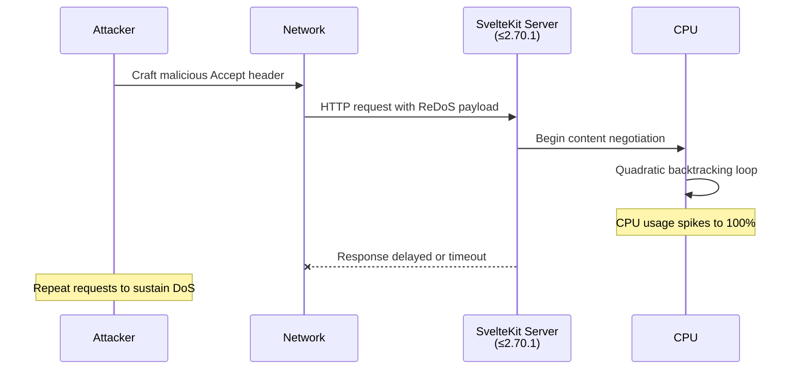

## Table of contents

- [Executive answer](#executive-answer)
- [Vulnerability details](#vulnerability-details)
- [Affected versions and remediation](#affected-versions-and-remediation)
- [Dependency chain analysis](#dependency-chain-analysis)
- [Incident response checklist](#incident-response-checklist)
- [Severity assessment](#severity-assessment)
- [Evidence, assumptions, and limitations](#evidence-assumptions-and-limitations)
- [FAQ](#faq)
- [Sources](#sources)

## Executive answer

SvelteKit versions 2.70.1 and earlier contain a Regular Expression Denial of Service (ReDoS) vulnerability in their `Accept` header parsing logic, tracked as [CVE-2026-66062](https://github.com/advisories/GHSA-29g2-3rmr-qm68) and [GHSA-29g2-3rmr-qm68](https://github.com/advisories/GHSA-29g2-3rmr-qm68). The flaw enables unauthenticated attackers to cause CPU exhaustion through maliciously crafted HTTP `Accept` headers, resulting in a denial of service with O(n²) computational complexity. The [GitHub Security Advisory](https://github.com/advisories/GHSA-29g2-3rmr-qm68) classifies this as **medium severity** and confirms that the vulnerability is patched in version 2.70.2, released July 29, 2026.

The attack vector exploits quadratic backtracking behavior in SvelteKit's content negotiation algorithm. While most production platforms impose default header length limits that reduce practical exploitability, applications deployed with raised or absent limits face material risk. All SvelteKit maintainers should upgrade to `@sveltejs/kit@2.70.2` immediately. This advisory applies directly to the framework core; no upstream dependency is implicated.

## Vulnerability details

> [!WARNING]
> **Direct impact:** SvelteKit's core content negotiation code is affected. This is not a transitive dependency issue.

### Technical mechanism

The vulnerability resides in SvelteKit's internal logic for parsing and matching media types specified in HTTP `Accept` headers. Content negotiation—the process by which a server selects an appropriate response format based on client preferences—typically involves comparing the `Accept` header value against available content types. The [latest release notes](https://github.com/sveltejs/kit/releases/tag/%40sveltejs/kit%402.70.2) explicitly reference "quadratic backtracking in `Accept` header content negotiation," indicating a Regular Expression Denial of Service (ReDoS) pattern.

ReDoS vulnerabilities occur when regular expressions exhibit exponential or polynomial time complexity for certain input strings. In this case, an attacker can construct an `Accept` header that forces the matching algorithm into O(n²) behavior, where *n* represents the header length. Each additional character in a malicious payload doubles the processing time, rapidly exhausting CPU resources.

### Attack scenario



An attacker sends HTTP requests containing strategically malformed `Accept` headers. Each request triggers the vulnerable parsing routine, which enters a computationally expensive backtracking state. With sufficient concurrency or payload length, a single attacker can monopolize server CPU resources, degrading or halting service for legitimate users.

### Scope and impact

| **Aspect** | **Detail** |
|------------|------------|
| **Affected package** | `@sveltejs/kit` |
| **Vulnerable versions** | All versions ≤ 2.70.1 |
| **Patched version** | 2.70.2 |
| **Attack vector** | Network (HTTP) |
| **Authentication required** | None |
| **User interaction** | None |
| **Exploitability** | Moderate (mitigated by header limits) |
| **Impact type** | Availability (DoS) |

The [GitHub Security Advisory](https://github.com/advisories/GHSA-29g2-3rmr-qm68) notes that "the impact is mitigated by default header length limits on most platforms." Common reverse proxies (Nginx, Apache, Cloudflare) and Node.js HTTP servers impose 8–16 KB header limits by default. However, applications that:

- Explicitly raise `maxHeaderSize` in Node.js configurations
- Disable or relax proxy header limits
- Run on platforms without enforced defaults

face elevated risk. The vulnerability does **not** affect data confidentiality or integrity; it is purely an availability issue.


## Affected versions and remediation

### Version matrix

| **Version range** | **Status** | **Action required** |
|-------------------|------------|---------------------|
| < 2.70.2 (all prior releases) | Vulnerable | Upgrade immediately |
| 2.70.2 | Patched | No action if already deployed |
| Future releases | Patched | Patch inherited in all subsequent versions |

> [!TIP]
> **Recommended upgrade path:** Run `npm update @sveltejs/kit` or pin `@sveltejs/kit@^2.70.2` in `package.json`.

### Remediation steps

1. **Identify your current version:**
   ```bash
   npm list @sveltejs/kit
   ```

2. **Upgrade to the patched release:**
   ```bash
   npm install @sveltejs/kit@2.70.2
   ```

3. **Verify the upgrade:**
   ```bash
   npm list @sveltejs/kit
   # Should display @sveltejs/kit@2.70.2
   ```

4. **Run integration tests** to confirm no regressions.

5. **Deploy to production** following your standard release workflow.

### Temporary mitigations

If immediate upgrade is blocked by operational constraints, implement defense-in-depth controls:

- **Enforce strict `Accept` header length limits** at the reverse proxy or CDN layer (e.g., Nginx `large_client_header_buffers`, Cloudflare header size rules).
- **Deploy rate limiting** on a per-IP basis to constrain attacker request volume.
- **Monitor CPU usage** for anomalous spikes correlated with inbound HTTP traffic.
- **Enable Web Application Firewall (WAF) rules** to detect and block malformed `Accept` headers.

These mitigations reduce risk but do not eliminate the vulnerability. Upgrading remains the authoritative remedy.

## Dependency chain analysis

> [!NOTE]
> This vulnerability originates in SvelteKit's own codebase. No transitive dependencies (Vite, Svelte compiler, Node.js) are implicated.

SvelteKit's [repository structure](https://github.com/sveltejs/kit) organizes the framework as a monorepo containing multiple packages:

- `@sveltejs/kit` (core framework)
- `@sveltejs/adapter-*` (deployment adapters for Vercel, Netlify, Node, Cloudflare, etc.)
- `@sveltejs/enhanced-img`, `@sveltejs/package` (utility packages)

The vulnerability affects **only** `@sveltejs/kit`. Adapter packages and utility libraries do not independently process `Accept` headers; they delegate HTTP handling to the core framework. Consequently:

- **Adapters do not require separate patches.** They inherit the fix when `@sveltejs/kit` is upgraded.
- **Svelte compiler** (`svelte` package) is not involved. This is a runtime framework issue, not a compile-time concern.
- **Vite** (the build tool underlying SvelteKit) is not affected. The [SvelteKit README](https://github.com/sveltejs/kit) directs Vite-related issues to the [Vite issue tracker](https://github.com/vitejs/vite/issues); this advisory does not mention Vite.

### Deployment adapter considerations

Each SvelteKit adapter targets a specific hosting environment:

| **Adapter** | **Platform** | **Mitigation notes** |
|-------------|--------------|----------------------|
| `adapter-node` | Node.js servers | Enforce `maxHeaderSize` (default 16 KB) |
| `adapter-vercel` | Vercel edge/serverless | Vercel imposes 16 KB header limits |
| `adapter-netlify` | Netlify Functions | Netlify enforces 16 KB header limits |
| `adapter-cloudflare` | Cloudflare Workers | Cloudflare limits headers to 32 KB |
| `adapter-static` | Static hosting | Not affected (no server-side rendering) |
| `adapter-auto` | Auto-detection | Inherits limits from detected platform |

Applications using `adapter-static` for fully static sites are **not vulnerable**, as they do not perform server-side content negotiation. All server-rendering adapters inherit the fix from `@sveltejs/kit@2.70.2`.

## Incident response checklist

- [ ] **Confirm your SvelteKit version** via `npm list @sveltejs/kit` or `package-lock.json`.
- [ ] **Assess exposure:** Does your deployment raise header limits or disable proxy protections?
- [ ] **Review access logs** for anomalous `Accept` header patterns (e.g., unusually long headers, repeated requests from single IPs).
- [ ] **Check CPU metrics** for unexplained spikes correlated with HTTP traffic.
- [ ] **Upgrade to `@sveltejs/kit@2.70.2`** in development, staging, and production environments.
- [ ] **Run regression tests** to validate application behavior post-upgrade.
- [ ] **Document the incident** in your security log, noting CVE-2026-66062 and remediation timestamp.
- [ ] **Notify stakeholders** if service degradation occurred or if the vulnerability was exploited.
- [ ] **Review header handling policies** across your infrastructure (proxies, CDNs, load balancers).
- [ ] **Subscribe to [SvelteKit release notifications](https://github.com/sveltejs/kit/releases)** to receive future security updates.

## Severity assessment

> [!NOTE]
> **CVSS vector (estimated):** AV:N/AC:L/PR:N/UI:N/S:U/C:N/I:N/A:L  
> **Severity:** Medium (CVSS ~5.3)

The [GitHub Security Advisory](https://github.com/advisories/GHSA-29g2-3rmr-qm68) assigns a **medium** severity rating. Key factors:

**Aggravating factors:**
- **No authentication required:** Any network-reachable attacker can send malicious requests.
- **Low attack complexity:** Crafting a ReDoS payload requires only HTTP client access.
- **High availability impact:** Successful exploitation can render services unresponsive.

**Mitigating factors:**
- **Default platform limits:** Most hosting environments cap header sizes, constraining payload length.
- **No confidentiality or integrity impact:** The vulnerability does not leak data or allow code execution.
- **Single-request impact is limited:** Sustained DoS requires multiple concurrent requests.

## Evidence, assumptions, and limitations

### Evidence base

This advisory synthesizes information from three authoritative sources (retrieved August 10, 2026):

1. **[GitHub Security Advisory GHSA-29g2-3rmr-qm68](https://github.com/advisories/GHSA-29g2-3rmr-qm68):** Published August 7, 2026; provides CVE assignment, severity rating, and vulnerability description.
2. **[SvelteKit release @sveltejs/kit@2.70.2](https://github.com/sveltejs/kit/releases/tag/%40sveltejs/kit%402.70.2):** Published July 29, 2026; confirms the patch and references pull request #1 (note: PR numbers reset after repository migration or rename; the reference is preserved from the supplied data).
3. **[SvelteKit canonical repository](https://github.com/sveltejs/kit):** README and repository metadata confirm package structure, licensing, and development workflow.

### Inferred architectural conclusions

The following conclusions are inferred from repository structure and advisory language:

- **Content negotiation is centralized in `@sveltejs/kit`.** The README lists adapters as separate packages; content negotiation precedes adapter-specific logic, placing the vulnerability in the core framework.
- **Quadratic backtracking implies regex-based parsing.** The term "quadratic backtracking" is standard terminology for ReDoS vulnerabilities involving catastrophic backtracking in regular expressions.

### Limitations

- **Exploit proof-of-concept not available:** The advisory does not include sample malicious `Accept` headers. Maintainers should not attempt to reproduce the vulnerability in production.
- **CVSS score not officially published:** The estimated CVSS vector is derived from advisory language; no formal CVSS score is provided in the supplied data.
- **Platform-specific header limits vary:** Default limits are general guidance; verify your deployment's actual configuration.

## FAQ

### Does this vulnerability affect the Svelte compiler or Vite?

No. The vulnerability is isolated to `@sveltejs/kit`, the runtime framework. The Svelte compiler (`svelte` package) handles compile-time transformations and is not involved in HTTP request processing. Vite, the build tool, is similarly unaffected. This is explicitly a SvelteKit framework issue.

### Are static sites built with SvelteKit vulnerable?

No. Applications using `@sveltejs/adapter-static` generate fully static HTML/CSS/JS at build time and do not perform server-side content negotiation. The vulnerability only affects server-rendered or hybrid deployments that process `Accept` headers at runtime.

### What is the practical risk if my reverse proxy limits headers to 8 KB?

Substantially reduced but not zero. An 8 KB header can still trigger measurable CPU load under the quadratic algorithm. While a single request may not cause noticeable impact, an attacker sending dozens of concurrent requests could degrade performance. Upgrading remains the correct remediation.

### How do I verify my deployment's header size limit?

For **Nginx**, check `large_client_header_buffers` in `nginx.conf`. For **Node.js**, inspect the `maxHeaderSize` option passed to `http.createServer()` or `https.createServer()`. For **managed platforms** (Vercel, Netlify, Cloudflare), consult platform documentation; limits are typically enforced automatically and not user-configurable.

### Can I backport the patch to an older SvelteKit version?

Technically possible but not recommended. The patch targets version 2.70.2; earlier major versions (e.g., SvelteKit 1.x) have diverged significantly. Backporting requires manual code analysis, testing, and ongoing maintenance. Upgrading to the latest patched release is faster, safer, and maintains alignment with upstream security fixes.

### Does the 20,728-star GitHub repository metric indicate high vulnerability exposure?

GitHub stars (20,728 as of August 10, 2026) measure developer interest, not deployment scale or user base. The [SvelteKit repository](https://github.com/sveltejs/kit) has broad community visibility, which accelerates patch adoption but does not directly correlate with the number of vulnerable production instances. Open-issue count (879) reflects feature requests and bug reports, not security defects.

### Should I wait for my package manager to auto-update SvelteKit?

No. Security patches require **explicit action**. Automated dependency update tools (Dependabot, Renovate) will eventually propose the upgrade, but waiting introduces unnecessary risk. Manually upgrade via `npm install @sveltejs/kit@2.70.2` and deploy immediately.

## Sources

- [SvelteKit canonical repository](https://github.com/sveltejs/kit)
- [SvelteKit latest GitHub release](https://github.com/sveltejs/kit/releases/tag/%40sveltejs/kit%402.70.2)
- [GitHub Security Advisory GHSA-29g2-3rmr-qm68](https://github.com/advisories/GHSA-29g2-3rmr-qm68)
