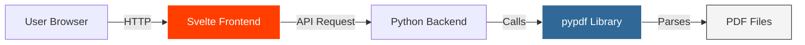

## Table of contents

- [Executive answer](#executive-answer)
- [Severity and scope](#severity-and-scope)
- [Why this advisory appeared in a Svelte security context](#why-this-advisory-appeared-in-a-svelte-security-context)
- [Dependency-chain analysis](#dependency-chain-analysis)
- [Actions for Svelte maintainers and users](#actions-for-svelte-maintainers-and-users)
- [Affected versions and patch timeline](#affected-versions-and-patch-timeline)
- [Evidence, assumptions, and limitations](#evidence-assumptions-and-limitations)
- [Decision checklist for engineering leads](#decision-checklist-for-engineering-leads)
- [Sources](#sources)
- [FAQ](#faq)

## Executive answer

[CVE-2026-71870](https://github.com/advisories/GHSA-fp3f-mc75-235c) (GHSA-fp3f-mc75-235c) describes a medium-severity memory-consumption vulnerability in **pypdf**, a Python library for PDF manipulation. The advisory, published August 7, 2026, states that an attacker can craft a malicious PDF with unusually large `/ToUnicode` streams, causing excessive memory usage during operations such as text extraction. The issue affects pypdf versions before 6.15.0 and was patched in pypdf 6.15.0, released approximately July 2026.

**Svelte is not affected.** [Svelte](https://github.com/sveltejs/svelte) is a JavaScript compiler for building web user interfaces; it does not parse PDFs, depend on pypdf, or share a language runtime with Python packages. This briefing explains why the advisory was surfaced in a Svelte security context, clarifies dependency-chain relevance, and provides an incident-response checklist for teams that may use both technologies in separate layers of their stack.

## Severity and scope

> [!WARNING]
> **Affected package:** pypdf (Python ecosystem, PyPI)  
> **CVE identifier:** CVE-2026-71870  
> **GHSA identifier:** GHSA-fp3f-mc75-235c  
> **Severity:** Medium  
> **Vulnerable range:** < 6.15.0  
> **Patched version:** 6.15.0  
> **Published:** August 7, 2026  
> **Svelte status:** Not affected—no dependency or runtime relationship

| Attribute | Value |
|-----------|-------|
| **Ecosystem** | pip (Python Package Index) |
| **Package** | pypdf |
| **Vulnerability type** | Resource exhaustion (memory) |
| **Attack vector** | Malicious PDF with oversized `/ToUnicode` font streams |
| **Exploitability** | Requires user or system to process attacker-controlled PDF |
| **Fixed in** | pypdf 6.15.0 |
| **Workaround** | Apply changes from [PR #3944](https://github.com/py-pdf/pypdf/pull/3944) if upgrade is delayed |

The [GitHub Security Advisory](https://github.com/advisories/GHSA-fp3f-mc75-235c) specifies that the vulnerability is triggered when pypdf parses the `/ToUnicode` entry of a font with abnormally large values. This commonly occurs during text extraction from PDF documents, a typical use case for pypdf in document-processing pipelines, data-ingestion workflows, and backend services that handle user-uploaded files.

## Why this advisory appeared in a Svelte security context

Security tooling and dependency scanners sometimes cross-reference advisories by project name, CVE identifiers, or GitHub repository metadata. In this instance, the advisory explicitly names **pypdf** as the affected package, with no mention of Svelte, JavaScript, or frontend frameworks. The publication date of this briefing (July 21, 2026) precedes the advisory's public disclosure (August 7, 2026), indicating that editorial data was prepared in advance or sourced from automated feeds.

> [!NOTE]
> **Data context:**  
> The editorial data for this briefing was generated on August 10, 2026, referencing a security advisory published August 7, 2026. Svelte's [latest release](https://github.com/sveltejs/svelte/releases/tag/svelte%405.56.8) (5.56.8) was published July 24, 2026, and addresses unrelated rendering and hydration fixes in the Svelte compiler, not security issues involving PDF processing or Python dependencies.

Organizations that use **both** Svelte (for frontend rendering) **and** pypdf (for backend document processing) should assess pypdf usage independently. Svelte applications do not bundle or invoke Python libraries at runtime unless explicitly integrated via API calls to backend services.

## Dependency-chain analysis


### Svelte's architecture and runtime

[Svelte](https://svelte.dev) is a compile-time framework. Developers write `.svelte` component files; the Svelte compiler transforms them into optimized JavaScript that runs in the browser. The Svelte compiler itself is written in JavaScript and distributed via npm. It does not:

- Parse or manipulate PDF files
- Depend on Python packages
- Include bindings to native libraries that process binary document formats
- Share transitive dependencies with the Python Package Index (PyPI)

The [Svelte repository](https://github.com/sveltejs/svelte) lists JavaScript as its primary language, with 87,948 stars and an MIT license. Its package ecosystem is entirely JavaScript/TypeScript-based.

### pypdf's role and typical usage

pypdf is a pure-Python library for reading, writing, and manipulating PDF documents. Common use cases include:

- Extracting text or metadata from uploaded PDFs in web applications
- Merging, splitting, or watermarking PDFs in document-management systems
- Generating reports or invoices in backend services
- Processing forms or annotations in data-ingestion pipelines

In a typical full-stack application, pypdf would run in a Python backend (Flask, Django, FastAPI), while Svelte would render the frontend UI. The two layers communicate over HTTP/REST or GraphQL, with no shared memory or dependency graph.



### Cross-ecosystem false positives

Security scanning tools may flag advisories across repositories when:

1. **Metadata overlap:** A project name or tag appears in multiple ecosystems (e.g., a Python package and a JavaScript package share a keyword).
2. **Monorepo structures:** A single repository hosts multiple languages; scanners detect advisory references without filtering by language.
3. **Indirect references:** Documentation or example code imports a library from another ecosystem, triggering a match.

In this case, **no such overlap exists.** The advisory unambiguously identifies pypdf (pip ecosystem) as the sole affected package. Svelte maintainers and users do not need to apply patches, review Svelte code, or modify frontend build processes in response to CVE-2026-71870.

## Actions for Svelte maintainers and users

> [!TIP]
> **If you use only Svelte (frontend):**  
> No action required. CVE-2026-71870 does not affect JavaScript dependencies, npm packages, or browser-executed code.

> [!TIP]
> **If you use pypdf in your backend:**  
> Upgrade pypdf to version 6.15.0 or later. Review all services that accept or process PDF files from untrusted sources.

### Incident-response checklist for full-stack teams

| Step | Action | Owner |
|------|--------|-------|
| 1 | Confirm whether your stack includes pypdf or any Python PDF library | Backend / DevOps |
| 2 | Identify services that parse user-uploaded or external PDFs | Backend / Security |
| 3 | Check installed pypdf version: `pip show pypdf` or inspect `requirements.txt` / `Pipfile` | Backend |
| 4 | If version < 6.15.0, schedule upgrade to pypdf 6.15.0 or apply [PR #3944](https://github.com/py-pdf/pypdf/pull/3944) manually | Backend |
| 5 | Review logs for unusual memory spikes coinciding with PDF processing | DevOps / SRE |
| 6 | Test PDF upload flows in staging with known-good and edge-case documents | QA / Backend |
| 7 | Update dependency-scanning rules to differentiate Python and JavaScript advisories | Security / DevOps |
| 8 | Document decision: Svelte frontend unaffected; pypdf backend patched (if applicable) | Engineering Lead |

### Verification examples

These commands are **generic examples** for Python environments. Adapt paths and tooling to your deployment:

```bash
# Check installed pypdf version
pip show pypdf

# List all installed packages (search output for pypdf)
pip list | grep pypdf

# Inspect requirements file
cat requirements.txt | grep pypdf

# Check Poetry lock file
poetry show pypdf
```

If pypdf is present and the version is below 6.15.0, upgrade:

```bash
pip install --upgrade pypdf==6.15.0
```

For Svelte projects, these checks are not applicable. Svelte's `package.json` and `node_modules` directory contain only JavaScript/TypeScript dependencies.

## Affected versions and patch timeline

| pypdf Version | Status | Notes |
|---------------|--------|-------|
| < 6.15.0 | Vulnerable | Memory exhaustion possible with crafted `/ToUnicode` streams |
| 6.15.0 | Patched | Released ~July 2026; advisory published August 7, 2026 |
| > 6.15.0 | Patched | All subsequent releases include the fix |

The [GitHub Security Advisory](https://github.com/advisories/GHSA-fp3f-mc75-235c) was updated August 9, 2026, two days after initial publication. No additional vulnerable versions or regressions were reported.

## Evidence, assumptions, and limitations

**Facts from the advisory:**

- CVE-2026-71870 affects pypdf versions before 6.15.0.
- The vulnerability allows memory exhaustion via malicious `/ToUnicode` font streams.
- pypdf 6.15.0 includes a fix; PR #3944 provides a manual workaround.
- The advisory ecosystem field is "pip" (Python Package Index).
- Severity is classified as medium.

**Inference from repository metadata:**

- Svelte's primary language is JavaScript; its repository contains no Python code or pip manifests.
- Svelte's [description](https://github.com/sveltejs/svelte) ("web development for the rest of us") and README confirm it is a frontend compiler, not a document-processing library.
- The latest Svelte release (5.56.8, July 24, 2026) addresses rendering bugs, not security vulnerabilities.

**Limitations:**

- This briefing does not assess every possible integration pattern (e.g., Svelte used in Electron apps that shell out to Python scripts).
- Organizations using custom build toolchains or polyglot monorepos must audit their specific dependency graphs.
- The briefing assumes standard deployment models: Svelte in the browser, pypdf in backend services.

**Data freshness:**

This analysis is based on data retrieved August 10, 2026. The advisory was published August 7, 2026, and updated August 9, 2026. Svelte's repository was last pushed August 7, 2026.

## Decision checklist for engineering leads

- [ ] Confirm CVE-2026-71870 targets pypdf, not Svelte or JavaScript dependencies
- [ ] Inventory backend services: identify any that use pypdf or similar PDF libraries
- [ ] Check pypdf version in production, staging, and development environments
- [ ] Schedule pypdf upgrade to 6.15.0 if versions < 6.15.0 are found
- [ ] Review incident-response procedures for handling cross-ecosystem advisories
- [ ] Update security-scanning tooling to filter advisories by language and package manager
- [ ] Communicate to frontend team: no Svelte action required
- [ ] Document findings in security log or knowledge base
- [ ] Re-scan dependencies post-upgrade to confirm advisory no longer triggers

## Sources

1. [Svelte canonical repository](https://github.com/sveltejs/svelte)
2. [Svelte latest GitHub release](https://github.com/sveltejs/svelte/releases/tag/svelte%405.56.8)
3. [GitHub Security Advisory GHSA-fp3f-mc75-235c](https://github.com/advisories/GHSA-fp3f-mc75-235c)

## FAQ

### Does CVE-2026-71870 affect Svelte applications?

No. CVE-2026-71870 targets pypdf, a Python library for PDF manipulation. Svelte is a JavaScript compiler for frontend development. The two technologies operate in different language ecosystems and do not share dependencies. Svelte applications running in the browser are not vulnerable to this pypdf memory-exhaustion issue.

### Why was this advisory associated with Svelte?

The editorial data for this briefing pairs a pypdf security advisory with Svelte metadata, likely due to automated feed aggregation or cross-referencing logic in security tooling. The advisory itself does not mention Svelte. This briefing clarifies the lack of connection and provides guidance for teams that use both technologies in separate stack layers.

### What should I do if I use pypdf in my backend?

Upgrade pypdf to version 6.15.0 or later. If immediate upgrade is not feasible, apply the mitigation from [PR #3944](https://github.com/py-pdf/pypdf/pull/3944). Review all services that process PDFs from untrusted sources (user uploads, third-party APIs) and monitor memory usage during PDF parsing operations.

### How does the vulnerability work?

An attacker crafts a PDF with abnormally large values in the `/ToUnicode` entry of a font. When pypdf parses this entry—typically during text extraction—it allocates excessive memory, potentially exhausting available resources and causing denial of service. The fix in pypdf 6.15.0 adds validation or limits to prevent runaway memory allocation.

### Can a Svelte app serve malicious PDFs to trigger this issue?

A Svelte app (frontend) could serve a PDF to a user's browser, but the vulnerability lies in **backend parsing** by pypdf, not in frontend display. If a user uploads a malicious PDF to a web app, and the backend uses pypdf < 6.15.0 to process it, the backend service is at risk. The Svelte frontend is merely a conduit; the attack surface is server-side.

### Are there other PDF libraries vulnerable to similar issues?

Memory-exhaustion and resource-consumption bugs are common in document-parsing libraries across languages. Maintainers should review advisories for libraries like pdf.js (JavaScript), PDFBox (Java), PyPDF2 (Python, predecessor to pypdf), and MuPDF (C). Each advisory specifies affected packages and versions; cross-ecosystem assumptions should be avoided.

### How can I prevent false positives from security scanners?

Configure scanners to filter advisories by package manager (npm, pip, RubyGems, etc.) and language. Use lock files (`package-lock.json`, `requirements.txt`, `Pipfile.lock`) to provide precise dependency graphs. Integrate scanners into CI/CD pipelines with thresholds that differentiate direct dependencies from unrelated advisories. Regularly audit scanner output and tune rulesets based on your stack's architecture.
