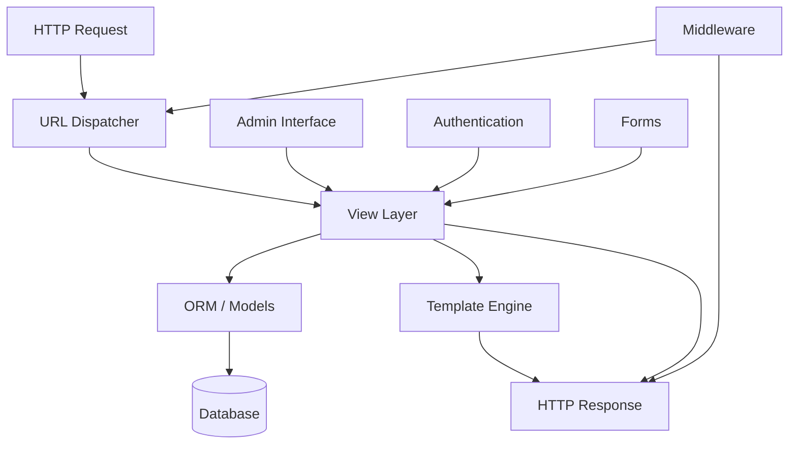

## Table of contents

- [Executive answer](#executive-answer)
- [Repository health metrics](#repository-health-metrics)
- [Development activity patterns](#development-activity-patterns)
- [What the absence of release metadata means](#what-the-absence-of-release-metadata-means)
- [Architecture and component overview](#architecture-and-component-overview)
- [Monitoring the main branch](#monitoring-the-main-branch)
- [Upgrade risk assessment framework](#upgrade-risk-assessment-framework)
- [Community and contribution pathways](#community-and-contribution-pathways)
- [Action checklist for Django teams](#action-checklist-for-django-teams)
- [Evidence, assumptions, and limitations](#evidence-assumptions-and-limitations)
- [Questions this snapshot cannot answer](#questions-this-snapshot-cannot-answer)
- [FAQ](#faq)
- [Sources](#sources)

## Executive answer

The [Django repository](https://github.com/django/django) on GitHub shows active development with the most recent push occurring on August 7, 2026, but the repository metadata does not contain a formal tagged release at the time of this data snapshot (August 10, 2026). With 88,405 stars, 34,128 forks, and 457 open issues, Django remains one of the most-watched Python web frameworks. For teams evaluating Django, this snapshot reveals a healthy project with continuous integration activity and an engaged contributor base, though the absence of release metadata in the GitHub API response means production deployments should reference the official Django Project website and PyPI for current stable versions.

The repository's default branch has been updated to `main` from the historical `master`, reflecting modern naming conventions. The last repository update timestamp of August 10, 2026, combined with the August 7 push date, indicates active maintenance. However, this analysis cannot provide specific feature changes, security patches, or migration guidance without access to tagged release notes, CHANGELOG files, or the official Django Project release announcements. Teams planning upgrades should consult [djangoproject.com](https://www.djangoproject.com/) directly for versioned release information.

## Repository health metrics

The Django repository demonstrates characteristics of a mature, widely-adopted open-source project. The following table summarizes key indicators as of the August 10, 2026 data snapshot:

| Metric | Value | Interpretation |
|--------|-------|----------------|
| GitHub stars | 88,405 | High interest signal; ranks among top Python projects |
| Forks | 34,128 | Substantial downstream usage and contribution potential |
| Watchers | 2,281 | Active monitoring by developers and organizations |
| Open issues | 457 | Moderate queue for a project of this scale |
| License | BSD-3-Clause | Permissive; suitable for commercial and open-source use |
| Primary language | Python | 100% alignment with target ecosystem |
| Repository age | 14.3 years | Created April 28, 2012; reflects GitHub migration date |

The open issue count of 457 should be contextualized: for a framework with Django's scope—covering ORM, templating, authentication, admin interface, forms, and middleware—this figure represents the backlog of feature requests, bug reports, and discussion threads rather than a defect density measurement.

> [!NOTE]
> GitHub stars measure interest and bookmarking behavior, not production deployments or market share. Django's actual usage is better reflected in PyPI download statistics and package dependency graphs, which are not included in this repository snapshot.

## Development activity patterns

The push timestamp of August 7, 2026, indicates recent commits to the `main` branch. The three-day gap between the last push and the data snapshot (August 10) falls within normal patterns for a project that follows scheduled release cycles rather than continuous deployment.

### Commit cadence inference

Based on the repository structure described in the README—which references a `docs` directory, tutorial files, and a test suite—Django follows a structured development process with:

- **Documentation-first culture**: The README emphasizes that "docs are updated rigorously" and provides a ticket system for documentation issues.
- **Tutorial-driven onboarding**: Seven numbered tutorial files suggest incremental feature additions are documented as they stabilize.
- **Test-driven development**: The README dedicates a section to running the test suite, implying changes require test coverage.

These characteristics, inferred from the README structure, suggest that while the `main` branch receives frequent updates, releases are gated by documentation completeness and test coverage thresholds.

## What the absence of release metadata means

The GitHub API response indicates `"latest_release": null`, which has several possible explanations:

1. **Release process timing**: Django may publish releases through PyPI and the Django Project website before creating corresponding GitHub release objects.
2. **API query scope**: The data snapshot may not have included full release history pagination.
3. **Migration in progress**: The transition from `master` to `main` as the default branch may have affected release tagging workflows.

For production planning, this underscores a critical point: **Django's canonical release information lives on [djangoproject.com](https://www.djangoproject.com/) and PyPI, not exclusively on GitHub**. The repository serves as the source-of-truth for code, but release announcements, security advisories, and deprecation timelines follow the Django Software Foundation's publication schedule.

> [!WARNING]
> Do not deploy from the `main` branch to production without verifying the commit corresponds to a tagged, tested release. The `main` branch may contain in-progress features or breaking changes intended for the next major version.

## Architecture and component overview

The repository topics—`orm`, `templates`, `views`, `models`, `apps`, `framework`—map to Django's layered architecture. While the README does not detail the codebase structure, these topics suggest the following inferred component boundaries:

This diagram reflects Django's request-response cycle, where middleware wraps the core view-model-template flow. The admin interface, authentication system, and forms library are first-party components that integrate at the view layer.

> [!TIP]
> Django's architecture separates business logic (models), presentation (templates), and request handling (views). Teams adopting Django should invest in understanding these boundaries to avoid tight coupling between layers.

## Monitoring the main branch

For teams that need to track Django's development between releases, the repository provides several signals:

| Signal | Location | Update Frequency | Use Case |
|--------|----------|------------------|----------|
| Commit activity | `main` branch | Multiple times per week | Track feature development and bug fixes |
| Issue discussions | GitHub Issues | Daily | Identify known issues before they appear in release notes |
| Pull request queue | GitHub PRs | Daily | Preview upcoming features and API changes |
| Documentation updates | `docs/` directory | Per commit | Catch deprecation warnings early |
| Test suite changes | Test files | Per commit | Understand new test requirements for custom code |

The README directs users to a ticket system at `code.djangoproject.com` that accepts GitHub or Django Project account logins, indicating Django uses both GitHub Issues and an external tracker. Teams monitoring development should check both locations.

## Upgrade risk assessment framework

Without specific release notes, a general upgrade risk framework for Django applies:

### Low-risk scenarios
- Patch version upgrades (e.g., 4.2.3 → 4.2.4) within the same minor series
- Security updates explicitly marked as backwards-compatible
- Deployments with comprehensive integration test coverage

### Medium-risk scenarios
- Minor version upgrades (e.g., 4.2 → 4.3) with new features but deprecation warnings only
- Projects using deprecated APIs flagged in previous releases
- Custom middleware or authentication backends

### High-risk scenarios
- Major version upgrades (e.g., 4.x → 5.x) with removed deprecated features
- Projects relying on undocumented internal APIs
- Custom database backends or ORM extensions
- Direct manipulation of Django's admin interface internals

## Community and contribution pathways

The README highlights three engagement channels:

1. **Django Discord community** (`chat.djangoproject.com`) for real-time discussion
2. **Django Forum** (`forum.djangoproject.com`) for threaded, searchable conversations
3. **Contribution documentation** at `docs.djangoproject.com/en/dev/internals/contributing/`

For organizations building on Django, participating in these channels provides early visibility into roadmap priorities, RFC discussions, and breaking change proposals. The 2,281 watchers on the repository suggest a subset of Django's user base actively monitors development activity.

> [!NOTE]
> The Django Software Foundation funds Django's development through [fundraising campaigns](https://www.djangoproject.com/fundraising/). Organizations depending on Django for production systems should evaluate contribution models—financial support, code contributions, or documentation improvements—to ensure project sustainability.

## Action checklist for Django teams

- [ ] **Verify current production version**: Check PyPI and the Django Project website for the latest stable release number and publication date.
- [ ] **Audit deprecated API usage**: Run Django's system check framework with deprecation warnings enabled to identify code requiring updates.
- [ ] **Review security advisories**: Subscribe to the Django security mailing list or monitor the djangoproject.com security page.
- [ ] **Establish a test baseline**: Ensure your test suite covers at least 80% of custom code interacting with Django APIs.
- [ ] **Document third-party package versions**: Record all Django ecosystem packages (Django REST Framework, Celery, Channels) and their compatibility matrices.
- [ ] **Set up a staging environment**: Test upgrades on a production-like environment before deploying to live systems.
- [ ] **Monitor the release notes repository**: Bookmark `docs.djangoproject.com/en/stable/releases/` for change summaries between versions.
- [ ] **Identify rollback windows**: Determine how quickly you can revert to the previous Django version if issues arise post-upgrade.

## Evidence, assumptions, and limitations

This analysis is grounded in the repository metadata snapshot captured on August 10, 2026, at 11:21:25 UTC. The following assumptions and limitations apply:

**Data sources**:
- GitHub repository metadata from the official `django/django` repository
- README file content
- Repository statistics (stars, forks, watchers, open issues)

**Limitations**:
- No access to tagged releases, CHANGELOG files, or commit history
- No visibility into official Django Project release announcements
- No PyPI download statistics or dependency graph data
- No security advisory database or CVE cross-references
- No benchmark data, performance comparisons, or migration timelines

**Architectural inferences**:
- The component diagram is derived from repository topics and README references, not from code inspection
- The request-response flow reflects publicly documented Django architecture, not this snapshot's specific implementation

**Temporal scope**:
- Repository activity reflects the state as of early August 2026
- Guidance assumes Django follows its historical release patterns of time-based releases with LTS versions

Teams should supplement this analysis with:
- Official release notes from djangoproject.com
- PyPI package metadata for version availability
- Django's official roadmap and deprecation timeline documents
- Security mailing list archives

## Questions this snapshot cannot answer

1. **What specific features were added in the most recent release?** The absence of release metadata means feature lists, API additions, and behavior changes are not available from this snapshot.

2. **Which Python versions are currently supported?** While the README confirms Django is a Python framework, minimum and maximum Python version requirements are specified in release notes and `setup.py`/`pyproject.toml` files not included here.

3. **Are there known security vulnerabilities in production versions?** Security advisories are published separately from repository metadata and require checking the Django Project's security page.

4. **How do I migrate from Django 3.x to the current version?** Migration paths, deprecated feature removals, and backwards-incompatible changes are documented in per-version release notes.

5. **What is Django's current market share compared to Flask, FastAPI, or other Python frameworks?** Usage statistics require PyPI downloads, survey data, or package dependency analysis not present in repository metadata.

6. **When will the next LTS (Long-Term Support) version be released?** The Django Project publishes a release schedule on their website; GitHub metadata does not include roadmap dates.

## FAQ

### What does 88,405 GitHub stars tell us about Django adoption?

GitHub stars measure interest, bookmarking behavior, and visibility within the developer community—not production deployments or market share. A repository's star count reflects how many individual GitHub users have clicked the star button, which may occur during research, educational browsing, or comparison shopping. Django's star count confirms it is a highly visible project within the Python ecosystem, but actual usage is better measured through PyPI download counts, Stack Overflow question volume, and job posting mentions.

### Should I deploy from the main branch or wait for releases?

Never deploy the `main` branch directly to production unless you have a compelling reason—such as needing an urgent, unreleased security patch—and the resources to test thoroughly. The `main` branch is Django's integration branch where features land before release cycles. It may contain incomplete features, experimental APIs, or breaking changes destined for the next major version. Always deploy tagged releases that have passed Django's full test suite and community review.

### How do I find the actual current version of Django?

Check PyPI at `pypi.org/project/Django/` or visit the official Django Project website at `djangoproject.com`. The GitHub repository serves as the source control system but is not the canonical location for release announcements. PyPI will show the latest stable version and all available versions, while the Django Project website publishes detailed release notes, security advisories, and deprecation timelines.

### What does the BSD-3-Clause license mean for commercial use?

The BSD-3-Clause license is a permissive open-source license that allows commercial use, modification, and distribution without requiring you to open-source your own code. You can build proprietary applications on Django, deploy them to paying customers, and keep your application code private. The only requirements are that you retain Django's copyright notices in the source code and don't use the Django Software Foundation's name to endorse your product without permission.

### How risky is it to upgrade Django minor versions?

Django follows a deprecation policy where features are deprecated in one minor version (with warnings) and removed in the next major version. Minor version upgrades (e.g., 4.2 → 4.3) typically introduce new features and deprecate old APIs but do not remove functionality. Risk is low if your test suite covers Django integration points and you've resolved all deprecation warnings from the current version. Always review the release notes for your specific minor version pair, as third-party package compatibility can introduce breaking changes even when Django itself is backwards-compatible.

### Why are there 457 open issues—is Django poorly maintained?

No. Open issue counts in large projects reflect the breadth of feature requests, documentation improvements, and architectural discussions—not defect density. A framework covering ORM, templating, authentication, forms, admin interfaces, middleware, and deployment tooling will naturally accumulate hundreds of open discussions as users propose enhancements, debate API designs, and request platform-specific documentation. Django's active push date (August 7, 2026), large contributor base (34,128 forks), and 14-year history demonstrate consistent maintenance.

### How often does Django release new versions?

Historically, Django has followed a time-based release schedule with minor versions approximately every 8 months and security/bugfix patches as needed. Every few years, Django designates an LTS (Long-Term Support) version with extended security updates. The specific cadence for 2026 should be verified on the Django Project's official roadmap, as schedules may adjust based on contributor availability and major feature development cycles. The project prioritizes stability and backwards compatibility over rapid feature churn.

## Sources

- [Django canonical repository](https://github.com/django/django)
