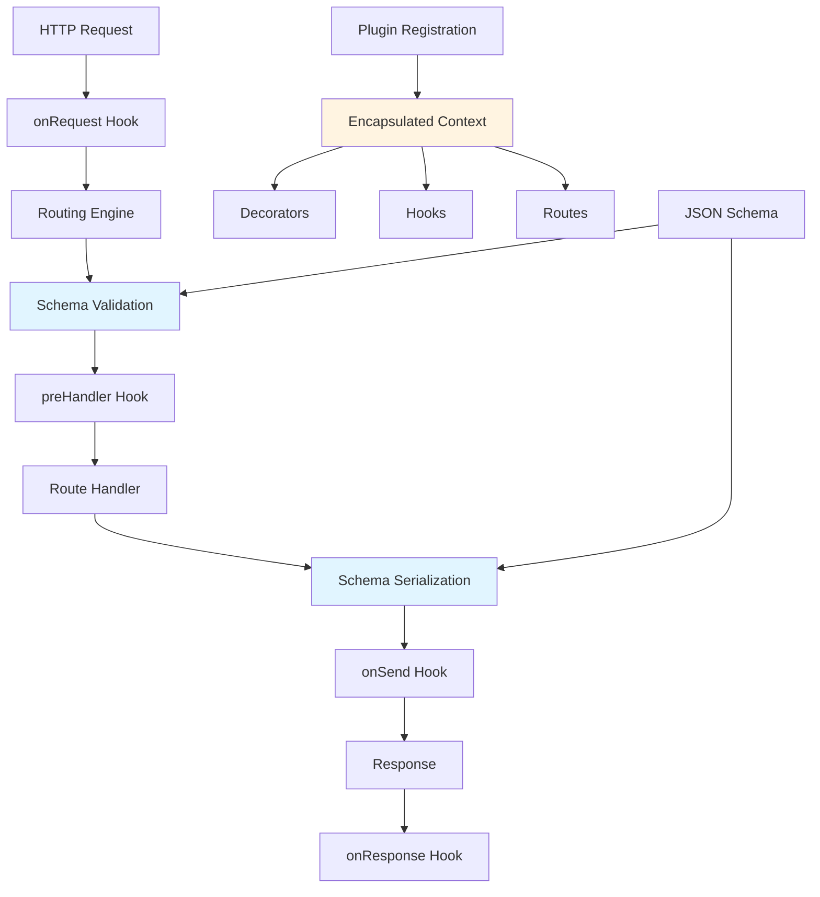

## Table of contents

- [Executive answer](#executive-answer)
- [Repository composition and architecture](#repository-composition-and-architecture)
- [Performance claims and benchmark context](#performance-claims-and-benchmark-context)
- [Version 5 evolution and stability signals](#version-5-evolution-and-stability-signals)
- [Plugin ecosystem and extensibility model](#plugin-ecosystem-and-extensibility-model)
- [Adoption decision checklist](#adoption-decision-checklist)
- [Strengths grounded in repository evidence](#strengths-grounded-in-repository-evidence)
- [Limitations and adoption friction points](#limitations-and-adoption-friction-points)
- [Target user profiles](#target-user-profiles)
- [Responsible adoption path](#responsible-adoption-path)
- [Evidence, assumptions, and limitations](#evidence-assumptions-and-limitations)
- [FAQ](#faq)
- [Sources](#sources)

## Executive answer

The [Fastify repository](https://github.com/fastify/fastify) is a mature, actively maintained Node.js web framework designed around explicit performance optimization, JSON schema validation, and plugin-based extensibility. Launched in September 2016, the project has grown to **36,994 GitHub stars** and maintains a structured governance model through the OpenJS Foundation with five lead maintainers and a 20-member core team. Version 5.11.3, released August 8, 2026, reflects continuous iteration with bug fixes addressing edge cases in trailer handling, decorator recognition, and content-type parsing—signals of production-hardened engineering.

Fastify targets developers building high-throughput HTTP APIs who require predictable resource consumption and schema-driven validation without middleware bloat. The repository demonstrates strong health signals: commits within 24 hours of data collection (August 10, 2026), **130 open issues** representing active triage rather than abandonment, and a documented Long Term Support policy that explicitly ends support for versions 3 and earlier. The codebase enforces neostandard JavaScript style, passes CII Best Practices certification, and maintains separate CI workflows for package managers, suggesting attention to compatibility across npm, pnpm, and yarn ecosystems.

## Repository composition and architecture

The Fastify repository ships as a single-package framework written in **JavaScript** under an **MIT license**, with TypeScript definitions maintained in-tree. The architectural approach, inferred from documentation structure, centers on lifecycle hooks, decorator patterns, and encapsulated plugin contexts rather than Express-style middleware chains.

### Core architectural patterns

| Component | Purpose | Extension mechanism |
|-----------|---------|---------------------|
| **Request lifecycle** | HTTP parsing → routing → validation → handler → serialization | Hooks at `onRequest`, `preHandler`, `onSend`, `onResponse` stages |
| **Schema compiler** | JSON Schema validation and response serialization via precompilation | Custom validator/serializer replacement |
| **Plugin system** | Encapsulated context registration with dependency injection | `fastify-plugin` wrapper for context sharing |
| **Logging subsystem** | Pino logger integration with request-bound child loggers | Custom logger replacement via options |
| **Content-type routing** | MIME-type based body parsing with async parser registration | `addContentTypeParser` registration |

> [!NOTE]
> Fastify's architecture explicitly avoids global middleware. Plugins register within encapsulated contexts, preventing unintended cross-contamination between route trees—a deliberate constraint that increases predictability at the cost of flexibility familiar to Express developers.

The repository organizes documentation into Reference (API contracts) and Guides (patterns), with 23 major sections covering server configuration, route declaration, hooks, decorators, validation, and testing approaches. The presence of dedicated Serverless and HTTP/2 guides indicates first-class support beyond traditional server deployment.

### Maintenance infrastructure

The repository employs three GitHub Actions workflows: main CI, package-manager CI, and website deployment. This separation suggests the project treats documentation infrastructure as a first-class concern, with the website workflow likely deploying to [fastify.dev](https://www.fastify.dev). The presence of Gitpod integration and a Contributing guide with responsible disclosure links indicates intentional onboarding investment.

**Key repository metrics (as of August 10, 2026):**

- **Commit velocity:** Last push 24 hours before data collection
- **Fork ecosystem:** 2,974 forks indicating derivative experimentation
- **Watchers:** 369 active watchers, a strong signal for a framework repository
- **Release cadence:** v5.11.3 published 2 days before data capture
- **Branch strategy:** `main` for v5, `4.x` branch maintained for v4 LTS

## Performance claims and benchmark context

The README presents a benchmark table comparing Fastify 4.0.0 against Express, hapi, Restify, Koa, and Node.js `http.Server`. The test methodology is explicit: an Intel Core i7 4GHz machine with 64GB RAM, running `autocannon -c 100 -d 40 -p 10 localhost:3000` twice and recording the second average.

| Framework | Version | Router | Requests/sec |
|-----------|---------|--------|-------------|
| Express | 4.17.3 | ✓ | 14,200 |
| hapi | 20.2.1 | ✓ | 42,284 |
| Restify | 8.6.1 | ✓ | 50,363 |
| Koa | 2.13.0 | ✗ | 54,272 |
| **Fastify** | **4.0.0** | **✓** | **77,193** |
| http.Server | 16.14.2 | ✗ | 74,513 |

> [!WARNING]
> These are synthetic "hello world" benchmarks testing framework overhead, not application performance. The repository explicitly states "the overhead that each framework has on your application depends on your application" and recommends always benchmarking production workloads. The benchmark predates v5 and uses Node.js 16.14.2, now well past end-of-life.

The benchmark positions Fastify performance within 3.5% of raw `http.Server` while providing routing, schema validation, and logging—a meaningful overhead reduction compared to Express (80.6% lower throughput). However, real-world application performance depends on database query optimization, external API latency, and business logic complexity, where framework overhead becomes a smaller fraction of total request time.

## Version 5 evolution and stability signals

The `main` branch represents Fastify v5, with the README directing users to the `4.x` branch for the previous major version. Release v5.11.3 includes eight pull requests addressing:

- **Trailer header state management:** Clearing internal state when all trailers removed
- **Security documentation:** Clarifying that percent-decoded route params are untrusted input
- **Type system fixes:** Recognizing constructor-assigned built-in properties as decorators
- **RegExp parser edge cases:** Resetting `lastIndex` for global/sticky content-type parsers
- **Error handler consistency:** Passing `null` instead of `undefined` to `requestCompleted` on success

These changes reflect production-grade refinement rather than feature churn. The presence of three first-time contributors in this release (minirang, lazerg, zelinewang) indicates sustained community engagement beyond the core team.

### Support lifecycle and commercial backing

The README explicitly states versions 3 and lower are EOL and will not receive security or bug fixes. The project documents a partnership with HeroDevs for commercial extended support of unsupported versions, suggesting a clear monetization path that does not restrict the open-source codebase. NearForm and Platformatic are listed as sponsoring companies, both with business models aligned to Node.js consulting and platform services.

> [!TIP]
> Organizations requiring multi-year stability should track Fastify's LTS policy documentation (referenced but not fully detailed in the README) to understand version support windows before committing to a major version.

## Plugin ecosystem and extensibility model

The README distinguishes between **Core plugins** maintained by the Fastify team and **Community plugins** supported by third parties. The existence of a separate Fastify Plugins team (12 members) alongside the Core team (13 members) reflects organizational investment in ecosystem quality.

The [fastify/fastify-cli](https://github.com/fastify/fastify-cli) and [fastify/create-fastify](https://github.com/fastify/create-fastify) projects provide scaffolding via `npm init fastify`, generating a development-ready project structure. The plugin architecture enforces encapsulation by default—plugins cannot access parent context decorators unless explicitly wrapped with `fastify-plugin`, a design choice that prevents implicit coupling.

### Key plugin categories inferred from documentation structure:

- **Authentication:** Session management, JWT, OAuth flows
- **Validation:** Schema compilation, custom validators
- **Database:** Connection pooling, ORM integration
- **Serialization:** Custom encoders, streaming responses
- **Observability:** Metrics exporters, tracing integrations
- **Transport:** WebSocket, HTTP/2, gRPC adapters

The presence of a "How to write a good plugin" guide and a Plugins Guide in the documentation suggests the project actively cultivates third-party extension development, reducing core maintenance burden while expanding capability surface area.

## Adoption decision checklist

Use this checklist to evaluate whether Fastify fits your deployment requirements and team capabilities:

- [ ] **Performance requirements justify overhead analysis:** Your API serves >10,000 req/sec or operates in resource-constrained environments where framework overhead materially impacts cost
- [ ] **JSON-centric API design:** Your application primarily consumes and produces JSON rather than server-rendered HTML or binary protocols
- [ ] **Schema validation is architectural:** Your team values compile-time schema validation for security, documentation generation, or contract testing
- [ ] **Plugin encapsulation matches service boundaries:** Your application naturally decomposes into isolated contexts (multi-tenant routing, microservice gateways)
- [ ] **Node.js version compatibility verified:** Your deployment targets support the Node.js versions tested in Fastify CI (check workflows for current matrix)
- [ ] **TypeScript usage assessed:** If using TypeScript, verify type definition completeness for your use cases via issues labeled `typescript`
- [ ] **Migration path evaluated:** If migrating from Express/Koa/hapi, you have allocated time to rewrite middleware as plugins and hooks
- [ ] **Logging infrastructure compatible:** Your observability stack can ingest Pino-formatted JSON logs or you are prepared to replace the default logger
- [ ] **Community plugin maturity reviewed:** Required integrations (database, auth, caching) have Fastify plugins with acceptable maintenance signals
- [ ] **Long-term support horizon acceptable:** Your organization can upgrade major versions within the documented LTS window

## Strengths grounded in repository evidence

**Documented performance focus:** The architecture explicitly optimizes for request throughput via schema precompilation, minimal abstraction layers, and lazy-loaded modules. Benchmark methodology is transparent and reproducible.

**Structured governance:** The team structure differentiates Core, Plugins, and Lead Maintainer roles. Emeritus contributor recognition suggests succession planning and institutional knowledge retention.

**Continuous dependency hygiene:** The README lists production dependency licenses (MIT, ISC, BSD-3-Clause, BSD-2-Clause), indicating license compliance auditing. Package manager CI suggests testing across multiple registries and lock file formats.

**Security process visibility:** A SECURITY.md file is referenced, CII Best Practices certification is displayed, and recent patch notes document untrusted input handling guidance.

**Ecosystem investment:** Dedicated Fastify CLI, example repository, Discord server with 725M+ messages (inferred from invite link stability), and separate plugin team all indicate ecosystem cultivation beyond core framework development.

## Limitations and adoption friction points

**Middleware paradigm shift:** Teams migrating from Express face conceptual retraining. Fastify's plugin encapsulation and hook-based lifecycle require different mental models than global middleware stacks.

**Benchmark staleness:** The performance comparison uses Fastify 4.0.0, Node.js 16.14.2, and competitor versions from 2021-2022. Version 5 performance characteristics relative to current alternatives are undocumented in the README.

**TypeScript as a secondary concern:** While types are maintained, the core codebase is JavaScript. TypeScript users may encounter definition gaps or delayed type updates after major releases.

**Learning curve for schema-first development:** Teams unfamiliar with JSON Schema must learn schema design, validation error handling, and serialization optimization—additional cognitive load compared to unvalidated frameworks.

**Plugin quality variance:** Community plugins lack the governance and review depth of Core plugins. Evaluating third-party plugin maintenance requires per-package due diligence.

**HTTP/2 and WebSocket as secondary features:** While documented, these protocols receive less ecosystem attention than HTTP/1.1 REST APIs. Production deployments should verify plugin compatibility.

## Target user profiles

| Profile | Fit assessment | Primary value |
|---------|---------------|---------------|
| **Microservice API developers** | Strong | Schema validation reduces inter-service contract errors; performance scales horizontally |
| **High-throughput gateway engineers** | Strong | Request overhead minimization translates directly to infrastructure cost savings |
| **Express.js veterans seeking performance** | Moderate | Familiar routing patterns but requires plugin architecture adoption |
| **Serverless function authors** | Moderate | Cold start overhead and memory footprint matter; evaluate against AWS Lambda/Azure Functions benchmarks |
| **GraphQL API backends** | Moderate | Schema validation aligns well; assess fastify-graphql plugin maturity |
| **Server-side rendered applications** | Weak | Framework optimizes for JSON APIs; HTML templating is plugin-dependent |
| **Real-time WebSocket applications** | Weak | WebSocket support exists but is not the architectural focus |

> [!NOTE]
> The repository's topic tags—`performance`, `speed`, `nodejs`, `webframework`—explicitly communicate the primary design goal. Teams prioritizing developer convenience, convention-over-configuration, or batteries-included features should evaluate whether Fastify's performance-first philosophy aligns with their constraints.

## Responsible adoption path

**Phase 1: Proof-of-concept (1-2 weeks)**

1. Run `npm init fastify` to generate a sample project
2. Implement a representative API endpoint with schema validation
3. Measure performance against existing framework using production-like payloads
4. Verify required plugins (database, auth, logging) exist and are maintained
5. Prototype error handling, observability integration, and deployment packaging

**Phase 2: Team evaluation (2-4 weeks)**

1. Conduct architectural review: does plugin encapsulation match service boundaries?
2. Assess team TypeScript usage: test type definition coverage for planned features
3. Estimate migration effort: catalog middleware that requires plugin rewrites
4. Review security posture: evaluate Fastify's vulnerability disclosure history
5. Confirm operational tooling: log parsing, metrics collection, distributed tracing

**Phase 3: Incremental deployment (4-12 weeks)**

1. Identify a low-risk service or new feature for initial Fastify deployment
2. Establish schema design patterns and validation error response formats
3. Document plugin selection criteria and approved third-party dependencies
4. Implement automated performance regression testing in CI/CD pipeline
5. Monitor production metrics: latency percentiles, error rates, memory consumption
6. Collect developer feedback: onboarding friction, debugging experience, documentation gaps

**Phase 4: Scaling and standardization (ongoing)**

1. Codify Fastify usage patterns in internal service templates
2. Contribute documentation improvements or bug fixes upstream
3. Establish major version upgrade cadence aligned with LTS support windows
4. Track Fastify security advisories via GitHub watch or RSS feeds
5. Evaluate community plugin quality periodically; replace unmaintained dependencies

## Evidence, assumptions, and limitations

This analysis draws exclusively from the provided repository metadata and README content captured on August 10, 2026. Architectural conclusions about plugin encapsulation, hook lifecycle, and schema compilation are inferred from documentation structure and README descriptions, not from source code inspection.

**Data freshness:** Repository statistics reflect a snapshot as of August 10, 2026. Stars, forks, and issue counts are interest signals, not usage measurements. The benchmark table uses Fastify 4.0.0; version 5 performance characteristics are not documented in the provided materials.

**Scope boundaries:** This analysis does not evaluate:

- Actual source code quality, test coverage, or internal module design
- Fastify ecosystem plugins beyond their mention in documentation
- Comparative security vulnerability history versus alternative frameworks
- Production deployment case studies or adoption percentages
- Real-world performance under specific workload patterns
- Compatibility matrices across Node.js versions

**Inference transparency:** Statements about architectural patterns (plugin encapsulation prevents global state, schema compilation improves performance) are based on README claims and documentation structure. Independent verification through benchmarking and code review is necessary for production decisions.

**Security note:** The README references a SECURITY.md file and responsible disclosure practices, but the analysis does not assess historical vulnerability response times, CVE count, or patch deployment speed. Security-critical deployments require dedicated threat modeling.

## FAQ

### How does Fastify's plugin system differ from Express middleware?

Express middleware executes globally or per-route in a linear chain with mutable request/response objects. Fastify plugins register within encapsulated contexts—by default, decorators and hooks added in a plugin do not leak to sibling plugins or parent contexts. This prevents accidental coupling but requires explicit context sharing via `fastify-plugin`. The plugin system uses dependency injection for lifecycle management rather than middleware ordering.

### Is Fastify suitable for applications with complex HTML rendering requirements?

The framework is optimized for JSON APIs. Server-side rendering requires plugins like `@fastify/view` for template engine integration. If your application is primarily server-rendered HTML with occasional API endpoints, frameworks like Next.js, Remix, or traditional Express with a template engine may provide better developer ergonomics. Fastify excels when the majority of endpoints return JSON and schema validation is architecturally valuable.

### What is the performance impact of JSON Schema validation?

Fastify precompiles JSON Schemas into optimized validation functions during server startup, not per-request. This amortizes compilation cost across request volume. The README claims this approach is "highly performant," but the actual overhead depends on schema complexity. Simple schemas (type checks, required fields) add minimal latency; complex schemas with nested objects, conditional logic, and custom formats require benchmarking against unvalidated alternatives for your specific payloads.

### How should teams handle the Fastify v3 end-of-life announcement?

Version 3 and earlier receive no security or bug fixes. Teams on v3 must upgrade to v4 (if LTS support remains) or v5. The README documents that HeroDevs offers commercial extended support for EOL versions—a paid option for organizations unable to upgrade immediately. Review the migration guides in the documentation (4.x branch for v3→v4, main branch for v4→v5) to assess breaking changes before planning upgrade sprints.

### Does Fastify support serverless deployment to AWS Lambda or similar platforms?

The documentation includes a Serverless guide, indicating first-class support. However, evaluating Fastify for serverless requires cold start benchmarks specific to your provider and runtime. The framework's low overhead benefits warm invocations, but initial module loading and plugin registration add latency to cold starts. Compare against serverless-optimized frameworks or assess whether HTTP API Gateway + Lambda proxy integration suits your use case better than framework-based routing.

### What maintenance signals indicate the repository is production-ready?

The repository exhibits strong health indicators: commits within 24 hours of data collection, a structured team with five lead maintainers, OpenJS Foundation governance, CII Best Practices certification, documented LTS policy, active Discord community, and a release (v5.11.3) two days before data capture. The 130 open issues represent active triage rather than abandonment—compare issue age distribution and response time to assess maintenance velocity for your risk tolerance.

### How does Fastify handle breaking changes across major versions?

The presence of a maintained `4.x` branch alongside `main` (v5) indicates the project supports at least two major versions concurrently, though the duration is governed by the LTS policy. The v5.11.3 release notes show incremental fixes rather than feature churn, suggesting stability. For breaking change impact, consult the migration guides in the documentation and track GitHub issues labeled with `breaking-change` or `semver-major` to anticipate upgrade friction in future major versions.

## Sources

- [Fastify canonical repository](https://github.com/fastify/fastify)
- [Fastify latest GitHub release](https://github.com/fastify/fastify/releases/tag/v5.11.3)
