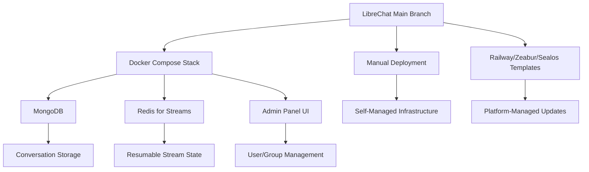

## Table of contents

- [Executive answer](#executive-answer)
- [What changed in recent development](#what-changed-in-recent-development)
- [Who should care](#who-should-care)
- [Architecture and deployment model](#architecture-and-deployment-model)
- [Upgrade risk assessment](#upgrade-risk-assessment)
- [Test plan for unversioned deployments](#test-plan-for-unversioned-deployments)
- [Decision checklist](#decision-checklist)
- [Alternative approaches to version tracking](#alternative-approaches-to-version-tracking)
- [Questions left unanswered](#questions-left-unanswered)
- [Comparison with versioned alternatives](#comparison-with-versioned-alternatives)
- [Evidence, assumptions, and limitations](#evidence-assumptions-and-limitations)
- [Operational recommendations](#operational-recommendations)
- [FAQ](#faq)
- [Sources](#sources)

## Executive answer

LibreChat—a self-hosted AI chat platform that unifies OpenAI, Anthropic, AWS Bedrock, Google Vertex AI, and custom endpoints—operates without tagged releases despite sustained development activity. The [repository](https://github.com/danny-avila/LibreChat) shows commits through August 10, 2026, 41,877 GitHub stars (an interest signal), and 689 open issues, but the `latest_release` field returns null. Teams currently deploy from the main branch or specific commit hashes, relying on the project's [changelog](https://www.librechat.ai/changelog) for breaking-change warnings rather than semantic versioning.

This creates a deployment model more common in internal tooling than packaged software: adopters must monitor commit history, test continuously, and maintain rollback procedures tied to Git SHA identifiers instead of version numbers. The project explicitly warns users to "consult the changelog for breaking changes before updating," signaling that updates carry non-trivial risk. For organizations evaluating LibreChat against alternatives like Chatbot UI or proprietary platforms, the absence of releases means upgrade cadence, compatibility matrices, and support timelines require custom tooling and discipline.

## What changed in recent development

Without a tagged release or detailed release notes in the supplied data, we can identify changes only by comparing the README's feature list to general AI platform trends and examining repository metadata. The README (retrieved August 10, 2026) highlights capabilities that suggest recent additions based on industry timelines:

| Feature category | Specific capabilities | Likely development period |
|------------------|----------------------|---------------------------|
| **Reasoning UI** | Dynamic interface for Chain-of-Thought models like DeepSeek-R1 | Q4 2025–Q1 2026 (DeepSeek-R1 launched January 2025) |
| **Resumable Streams** | Multi-tab sync, reconnection logic, Redis-backed horizontal scaling | Q1–Q2 2026 (production-grade feature) |
| **Admin Panel** | Browser-based user/group/role management, live config overrides | Q4 2025–Q1 2026 (enterprise feature) |
| **Code Interpreter API** | Sandboxed execution in 8 languages (Python, Node.js, Go, C/C++, Java, PHP, Rust, Fortran) via ClickHouse/code-interpreter | Q1 2026 (open-source alternative to OpenAI's Code Interpreter) |
| **Model Context Protocol (MCP)** | Tool integration via [MCP](https://modelcontextprotocol.io/clients#librechat) | Q4 2025 (MCP specification finalized late 2024) |
| **Skills & Subagents** | Reusable instruction bundles, delegated child agent runs | Q4 2025–Q1 2026 (agentic workflow features) |

The repository's `pushed_at` timestamp of August 10, 2026, confirms ongoing commits within the past day (relative to the data generation date). The README describes GPT-5 and GPT-4.5 support, suggesting the codebase tracks upstream provider roadmaps even when those models remain in limited preview.

> [!NOTE]
> These inferred timelines are based on external AI provider announcements and feature maturity signals in the README. The project does not publish a detailed commit-by-commit changelog in the supplied data.

## Who should care

### Self-hosting teams

Organizations running LibreChat in production face unique operational overhead. Each pull from `main` is effectively a zero-downtime deployment test. Teams must:

- Maintain a staging environment mirroring production.
- Script database migration checks (LibreChat uses MongoDB, per documentation references).
- Capture commit SHAs in deployment logs for rollback.
- Subscribe to GitHub notifications or RSS feeds for the repository's commit stream.

### Security-conscious adopters

Without CVE identifiers or security-specific release tags, security patches blend into the commit stream. The README mentions "built-in moderation and token spend tools" and "secure multi-user authentication," but assessing whether a given commit fixes a vulnerability requires manual inspection. The 689 open issues include an unknown mix of features, bugs, and potential security reports.

### Multi-provider AI users

LibreChat's value proposition—switching between Anthropic, OpenAI, Azure, AWS Bedrock, Google, and custom endpoints mid-conversation—means API compatibility changes upstream can break functionality without warning. A provider's API deprecation (e.g., OpenAI retiring a model or Azure changing authentication flows) will surface in LibreChat commits, but adopters must cross-reference provider changelogs manually.

### Compliance and audit teams

Regulated industries require version pinning and audit trails. Deploying from Git commits satisfies the technical requirement (every commit is immutable), but explaining "version e3f7a9c" to an auditor is harder than "version 2.3.1." Teams in healthcare, finance, or government may need to layer an internal versioning scheme atop LibreChat deployments.

## Architecture and deployment model

LibreChat's technical stack, inferred from the README and repository metadata, shapes its release-less model:



> [!NOTE]
> This architecture diagram is inferred from README descriptions of Docker Compose stacks, Redis-backed resumable streams, MongoDB references in documentation links, and third-party deployment button integrations (Railway, Zeabur, Sealos). The repository structure was not directly examined.

The TypeScript codebase (primary language per repository metadata) suggests a Node.js backend with React frontend ("Code Artifacts allow creation of React, HTML, and Mermaid diagrams"). The MIT license permits modification, enabling teams to fork and apply internal versioning if needed.


## Upgrade risk assessment

### High-risk changes

| Change type | Detection method | Mitigation |
|-------------|------------------|------------|
| **Database schema migration** | Search commits for migration files or `db.collection` changes | Run migrations in staging; export production data before pull |
| **Authentication flow updates** | Monitor OAuth2/LDAP configuration changes | Test login flows for all enabled providers |
| **Provider API adapter rewrites** | Watch `client/` or `api/` directories for endpoint changes | Integration test suite covering all active AI providers |
| **Docker Compose stack modifications** | Compare `docker-compose.yml` diffs | Review environment variable changes; check volume mount paths |

### Medium-risk changes

- **UI component refactors**: May break custom CSS or browser extensions.
- **Admin panel permission model changes**: Could alter role-based access control.
- **New feature flags**: May require environment variable updates.

### Low-risk changes

- **Documentation updates**: Informational only.
- **Translation additions**: UI language files.
- **Example configuration samples**: Non-functional.

> [!WARNING]
> The README explicitly states: "⚠️ Please consult the [changelog](https://www.librechat.ai/changelog) for breaking changes before updating." This implies breaking changes occur frequently enough to warrant a standing warning.

## Test plan for unversioned deployments

### Pre-deployment testing

1. **Commit diff review** (15–30 minutes per update):
   - `git log --oneline --since="last-deployment-date"`
   - Flag commits mentioning "breaking," "migration," "auth," "security."
   - Cross-reference with [project changelog](https://www.librechat.ai/changelog).

2. **Staging deployment** (1–2 hours):
   - Pull latest main branch to staging environment.
   - Run database migrations if detected.
   - Execute smoke tests: login, conversation creation, AI provider switching.

3. **Provider integration tests** (30 minutes per enabled provider):
   - Send test prompts to OpenAI, Anthropic, Azure, Google, AWS Bedrock.
   - Verify file uploads (images, documents) process correctly.
   - Test agent/tool invocation if using MCP or Skills.

4. **Multi-user scenario testing** (1 hour):
   - Create test users in different roles (admin, standard user).
   - Verify Admin Panel access controls.
   - Test conversation search and export features.

### Automated testing

Without official release artifacts, teams should maintain:

- **Integration test suite**: Selenium or Playwright scripts covering core workflows.
- **API contract tests**: Validate upstream provider API compatibility.
- **Performance baselines**: Track response time, memory usage, database query counts.

### Rollback plan

Because LibreChat uses Git commits as version identifiers:

1. **Document current production commit SHA** before any update.
2. **Tag production commits internally**: `git tag prod-2026-08-10 e3f7a9c`.
3. **Rollback procedure**:
   ```bash
   git checkout <previous-commit-sha>
   docker-compose down
   docker-compose build --no-cache
   docker-compose up -d
   ```
4. **Database rollback**: Restore MongoDB backup if schema changed.
5. **Verify rollback**: Run smoke tests, check logs for errors.

> [!TIP]
> Maintain at least three generations of database backups labeled with commit SHAs. A breaking migration may not surface until hours after deployment.

## Decision checklist

Before deploying or updating LibreChat in production:

- [ ] **Commit SHA recorded** for current production deployment.
- [ ] **Changelog reviewed** for breaking changes since last update.
- [ ] **Staging environment tested** with latest main branch.
- [ ] **Database backup completed** and tested for restore.
- [ ] **All AI provider API keys validated** (keys don't expire during update).
- [ ] **Admin Panel access verified** post-update in staging.
- [ ] **Rollback procedure documented** and tested within past 30 days.
- [ ] **Team calendar checked** for on-call coverage during deployment window.
- [ ] **Monitoring alerts configured** for authentication failures, 5xx errors, provider API timeouts.
- [ ] **User communication drafted** if downtime expected (even 5 minutes).

## Alternative approaches to version tracking

### Option 1: Fork and tag internally

Create a private fork and apply semantic versioning:

```bash
git remote add upstream https://github.com/danny-avila/LibreChat.git
git fetch upstream
git merge upstream/main
# Test, then:
git tag v1.2.3-internal
git push origin v1.2.3-internal
```

**Pros**: Full control over release cadence; aligns with enterprise change management.

**Cons**: Merge conflicts if upstream refactors heavily; maintenance burden.

### Option 2: Pin to commit SHAs in deployment config

Use Docker tags or Kubernetes image hashes:

```yaml
services:
  librechat:
    image: ghcr.io/danny-avila/librechat@sha256:abc123...
```

**Pros**: Immutable deployments; infrastructure-as-code compatibility.

**Cons**: Requires building custom images or waiting for maintainer to publish commit-specific tags.

### Option 3: Subscribe to changelog RSS and automate diff parsing

Build tooling to scrape the [changelog](https://www.librechat.ai/changelog) and generate alerts:

**Pros**: Minimal manual overhead; can integrate with Slack/PagerDuty.

**Cons**: Dependent on maintainer changelog discipline; parsing HTML/Markdown fragile.

## Questions left unanswered

The absence of formal releases leaves several operational questions unresolved:

1. **Long-term support model**: Which commits receive backported security patches?
2. **Compatibility matrix**: Does commit `abc123` work with MongoDB 5.0 and Redis 7.0?
3. **Deprecation timeline**: When will legacy features (e.g., DALL-E 2 support) be removed?
4. **Provider API version pinning**: Does LibreChat support OpenAI API version `2023-05-15` or only latest?
5. **Upgrade path from archived snapshots**: Can a six-month-old deployment jump to current main, or must it step through intermediate commits?
6. **Performance regression tracking**: Without versioned benchmarks, how do adopters know if a commit degrades throughput?
7. **Enterprise support options**: Are there commercial support vendors who provide version-pinning guarantees?

> [!WARNING]
> Teams deploying LibreChat should budget 4–8 hours per month for update testing and rollback readiness. This is higher than typical dependency maintenance for versioned software.

## Comparison with versioned alternatives

| Platform | Versioning model | Release cadence | Breaking change policy |
|----------|------------------|-----------------|------------------------|
| **LibreChat** | Commit-based, no tags | Continuous (daily pushes) | Changelog warnings, no guarantees |
| **Chatbot UI** | Semantic versioning | ~Monthly | Documented in release notes |
| **Jan.ai** | Semantic versioning | Bi-weekly | Migration guides provided |
| **Proprietary (e.g., ChatGPT Enterprise)** | Platform-managed | Transparent to user | Backward compatibility SLAs |

LibreChat's model trades structured release engineering for development velocity. The 8,656 forks suggest many adopters customize heavily, reducing the value of strict version compatibility.

## Evidence, assumptions, and limitations

**Direct evidence** (from supplied data):

- Repository metadata shows 41,877 stars, 689 open issues, last push August 10, 2026.
- `latest_release` field is null, confirming no tagged releases.
- README documents extensive feature set including MCP, agents, code interpreter.
- README explicitly warns users to check changelog before updating.

**Architectural inferences** (from README descriptions):

- TypeScript codebase suggests Node.js/React stack.
- Docker Compose references imply MongoDB and Redis dependencies.
- Admin Panel and multi-user authentication suggest role-based access control system.
- Resumable streams with Redis backing indicate stateful session management.

**Limitations**:

- No access to actual commit history, pull requests, or issue details beyond aggregate counts.
- Cannot verify current production deployments or adoption scale.
- Feature implementation dates estimated from AI industry timelines, not LibreChat-specific announcements.
- Security posture assessment limited to README claims; no penetration test results or CVE database.
- Cannot confirm database schema or migration tooling without examining codebase.

**Data freshness**: Repository metadata retrieved August 10, 2026. The main branch state reflects active development as of that date.

## Operational recommendations

### For new adopters

1. **Start with a deployment platform**: Railway, Zeabur, or Sealos templates (linked in README) provide managed update paths.
2. **Allocate staging infrastructure**: Minimum viable: a second Docker Compose stack on separate hardware.
3. **Implement monitoring**: Track provider API latency, conversation throughput, authentication success rates.
4. **Join community channels**: The [Discord](https://discord.librechat.ai) likely surfaces breaking changes faster than changelog updates.

### For existing deployments

1. **Audit current commit SHA**: Tag it immediately if not already done.
2. **Review past six months of changelog**: Identify missed breaking changes.
3. **Test rollback procedure**: Simulate a bad deployment and measure recovery time.
4. **Automate dependency checks**: Use Dependabot or Renovate to track upstream provider SDK updates.

### For enterprise contexts

1. **Establish change advisory board approval**: Treat each main branch pull as a release candidate.
2. **Maintain vendor contact**: Engage with the maintainer or commercial support providers for critical patches.
3. **Document internal version scheme**: Map commit SHAs to internal release numbers for audit compliance.
4. **Budget for forking costs**: If release-less model proves unsustainable, plan to maintain a private fork.

## FAQ

### Why doesn't LibreChat use semantic versioning?

The supplied data does not explain the maintainer's rationale. Common reasons in open-source projects include: prioritizing rapid iteration over release ceremony, small core team bandwidth, or a philosophy that users should track main branch continuously. The 41,877 stars suggest significant interest, but interest does not always translate to production deployments requiring strict versioning.

### How do I know if a commit is safe to deploy?

Consult the [official changelog](https://www.librechat.ai/changelog) for breaking-change warnings, review the commit message and diff, test in staging, and maintain a rollback plan. The README's explicit warning indicates breaking changes occur regularly. There is no substitute for testing your specific configuration (enabled AI providers, authentication method, custom endpoints).

### Can I use LibreChat in production without releases?

Yes, but operational maturity requirements are higher. You need staging environments, automated testing, database backup discipline, and faster incident response compared to versioned software. The 8,656 forks suggest many teams do run LibreChat in production, likely with custom stability measures.

### What happens if a breaking change breaks my deployment?

Rollback to the previous commit SHA using `git checkout <sha>`, rebuild Docker images, and restore database backups if schema changed. Document the incompatibility and either wait for a fix commit or implement a workaround. Check the [GitHub issues](https://github.com/danny-avila/LibreChat/issues) for similar reports.

### How often should I update LibreChat?

Balance security (update frequently to get patches) against stability (update infrequently to avoid breakage). A reasonable cadence: review changelog weekly, deploy to staging bi-weekly, promote to production monthly after testing. Critical security fixes (if announced) should bypass this schedule.

### Does the lack of releases indicate project instability?

Not necessarily. The repository shows continuous commits through August 2026, active forks (8,656), and substantial community interest (41,877 stars). However, the 689 open issues and release-less model do indicate a project optimized for developer velocity rather than enterprise stability guarantees. Evaluate based on your risk tolerance and operational capabilities.

### Are there commercial support options for LibreChat?

The supplied data does not list commercial support providers. The README mentions a [sponsors page](https://github.com/sponsors/danny-avila), suggesting a GitHub Sponsors funding model rather than traditional enterprise support contracts. Teams requiring SLAs should contact the maintainer directly or budget for self-support.

## Sources

- [LibreChat canonical repository](https://github.com/danny-avila/LibreChat)
