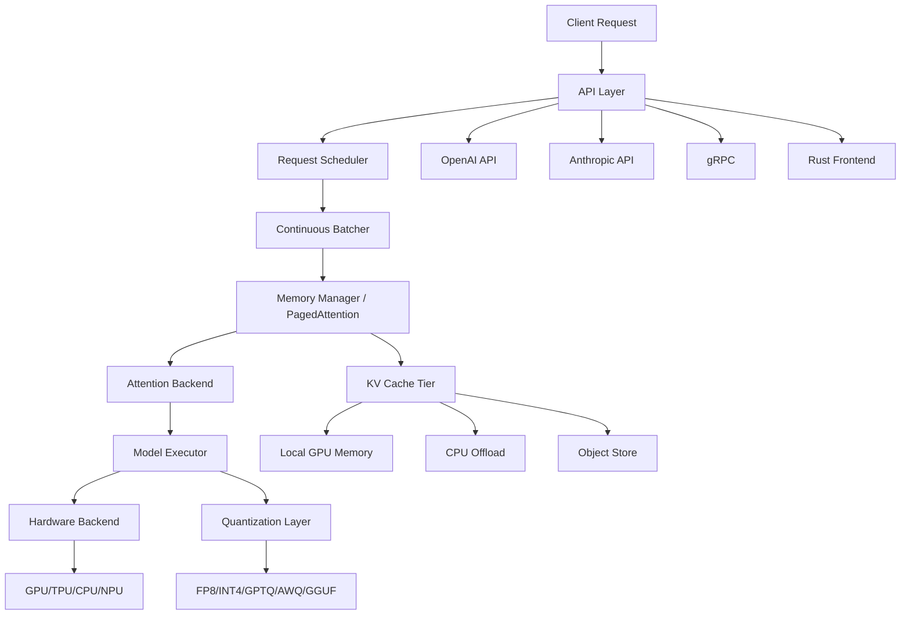

## Table of contents

- [Executive answer](#executive-answer)
- [Core architecture and components](#core-architecture-and-components)
- [Model architecture support categories](#model-architecture-support-categories)
- [Hardware backend ecosystem](#hardware-backend-ecosystem)
- [Quantization and compression methods](#quantization-and-compression-methods)
- [Distributed serving and disaggregation patterns](#distributed-serving-and-disaggregation-patterns)
- [API compatibility and integration layers](#api-compatibility-and-integration-layers)
- [Speculative decoding and acceleration techniques](#speculative-decoding-and-acceleration-techniques)
- [Maintenance and community health signals](#maintenance-and-community-health-signals)
- [Discovery workflow for integration projects](#discovery-workflow-for-integration-projects)
- [Decision checklist](#decision-checklist)
- [Licensing and contribution considerations](#licensing-and-contribution-considerations)
- [Evidence, assumptions, and limitations](#evidence-assumptions-and-limitations)
- [Sources](#sources)
- [FAQ](#faq)

## Executive answer

[vLLM](https://github.com/vllm-project/vllm) is a high-throughput inference and serving engine for large language models, built around the PagedAttention algorithm for efficient key-value cache management. Originally developed at UC Berkeley's Sky Computing Lab, the project has grown into one of the most active open-source AI repositories with 88,652 stars, 20,500 forks, and contributions from over 2,000 developers across academic institutions and companies as of August 2026. The ecosystem spans five major categories: model architecture support (200+ Hugging Face architectures), hardware backends (NVIDIA CUDA, AMD ROCm, Intel XPU/Gaudi, Google TPU, Apple Silicon, and specialized NPUs), quantization frameworks, distributed serving patterns, and API compatibility layers.

The core value proposition centers on memory efficiency through paged attention, continuous batching, and flexible parallelism strategies (tensor, pipeline, data, expert, and context parallelism). The ecosystem is licensed under Apache-2.0, with active development cadence visible in the v0.26.0 release (July 2026) featuring 411 commits from 212 contributors. Integration points include OpenAI-compatible REST APIs, Anthropic Messages API, gRPC endpoints, and native Python libraries. The repository signals strong maintenance health with daily commits, though 6,414 open issues (as of August 2026) indicate substantial community engagement and diverse deployment scenarios requiring support.

## Core architecture and components

vLLM's architecture separates into five primary subsystems inferred from the repository structure and release notes:

**Inference engine core** manages request scheduling, memory allocation via PagedAttention, and continuous batching. The engine supports chunked prefill, prefix caching with partial hit support for hybrid models, and automatic CUDA graph generation through `torch.compile`. Memory profiling results can persist across restarts (opt-in) to reduce cold-start overhead.

**Attention backend layer** provides pluggable kernels including FlashAttention, FlashInfer, TRTLLM-GEN, FlashMLA, and Triton. As of v0.26.0, attention backends can be selected per KV-cache group, enabling hybrid models that mix sliding-window and full attention patterns within a single request.

**Model executor subsystem** handles model loading, weight distribution across devices, and execution. It supports InstantTensor loading for faster startup, automatic fallback to ViT data parallelism when tensor parallelism is unavailable for vision encoders, and flexible `head_dtype` configuration (e.g., fp32 `lm_head` for generation models).

**KV-cache management** implements tiered storage with CPU offloading, object-store secondary tiers supporting workload identity, and data-parallel replica-aware tiering. Offloading metrics expose read/write cache usage and tiering-lookup latency split into synchronous and asynchronous histograms.

**Serving frontend** offers OpenAI-compatible REST endpoints, Anthropic Messages API, gRPC, and a native Rust frontend. The Rust layer added multimodal video/audio support and native benchmarking tools in v0.26.0.

## Model architecture support categories

vLLM documentation claims support for 200+ model architectures on Hugging Face. The repository topics and v0.26.0 release notes identify six major categories:

| Category | Supported Families | Integration Notes |
|----------|-------------------|-------------------|
| **Decoder-only LLMs** | Llama, Qwen, Gemma, Mistral, DeepSeek-V3/V4, GPT-OSS, Olmo/Olmo2 | Core use case; Olmo/Olmo2 migrated to Transformers backend in v0.26.0 |
| **Mixture-of-Experts** | Mixtral, DeepSeek-V3/V4, Qwen-MoE, GPT-OSS, MiniMax-M3 | Specialized routing kernels for DeepSeek-V4 (+2.94% TPOT); FlashInfer MoE LoRA for BF16 |
| **Hybrid attention/state-space** | Mamba, Qwen3.5, models with sliding-window + full attention | Sliding-window now explicit backend capability; DFlash hybrid drafters |
| **Multi-modal** | LLaVA, Qwen-VL, Pixtral, HunyuanVL, LlavaNextVideo, Cosmos3 | Automatic ViT data-parallel fallback; LoRA support for vision towers/connectors |
| **Embedding/retrieval** | E5-Mistral, GTE, ColBERT | Preprocessing-computation overlap for pooling models in offline inference |
| **Reward/classification** | Qwen-Math, BertForMaskedLM, RobertaForTokenClassification | Added BertForMaskedLM and token-classification models in v0.26.0 |

The "Inkling" model family introduced in v0.26.0 demonstrates full-stack support: base modeling, piecewise CUDA graph, Hopper FlashAttention 4 relative attention, speculative decoding (MTP=1), LoRA, and NVFP4 quantization.

> [!NOTE]
> Model support signals are derived from repository topics, release notes, and documentation references. Actual compatibility depends on specific model configurations, precision, and hardware backend. The project maintains a [supported models list](https://docs.vllm.ai/en/latest/models/supported_models.html) in the documentation.

## Hardware backend ecosystem

vLLM supports seven major hardware platforms with varying maturity levels inferred from release activity:

**NVIDIA CUDA** (primary platform): Full feature set including Blackwell (SM10x/SM110) support, CUTLASS and CuTeDSL optimized kernels, FlashAttention 3 (pinned to torch stable-ABI commit), and TensorRT-LLM GEN kernels. v0.26.0 added specialized DeepSeek-V4 routing kernels, FP32 router GEMV, and BF16x3 router GEMM.

**AMD ROCm**: Production-grade support with DeepSeek-V4 two-stage compressor kernel for HCA prefill, sparse decode/prefill optimizations, MXFP8 GEMM for MiniMax-M3, and HybridW4A16 linear kernel. ROCm-specific optimizations include MLA KV-split heuristics for DeepSeek-V3.2 and AITER sparse paged attention.

**Intel XPU/Gaudi**: Batch-invariant kernels, HND KV layout support, DSpark speculative decoding for DeepSeek-V4, INT2 weight-only quantization. Nightly and release images published as of v0.26.0.

**Google TPU**: Supported via tpu-inference v0.24.0 dependency. Repository topics list "tpu" but release notes contain limited TPU-specific optimization detail.

**Apple Silicon / x86 CPU**: Native macOS arm64 CPU wheel builds, s390x NUMA topology support, IBM Power VSX math function optimization, and Docker builds for IBM Power using prebuilt wheels. DFlash speculative decoding for GDN models on CPU.

**Specialized NPUs**: Repository README mentions Huawei Ascend, Rebellions NPU, IBM Spyre, and MetaX GPU through "diverse hardware plugins." Integration depth varies; no detailed release-note coverage in v0.26.0.

> [!TIP]
> Hardware backend selection impacts available features. CUDA offers the broadest quantization and optimization support; ROCm provides strong MoE and sparse-attention capabilities; CPU/Apple Silicon backends are suitable for development and edge deployment but lack advanced batching optimizations.

## Quantization and compression methods

vLLM implements quantization through a pluggable layer supporting multiple frameworks:

| Method | Precision | Maturity Signal | Hardware Scope |
|--------|-----------|-----------------|----------------|
| **NVFP4/MXFP4** | 4-bit floating-point | Online MoE quantization (v0.26.0); CuTe-DSL FlashInfer integration | NVIDIA (Hopper+) |
| **FP8** | 8-bit floating-point | Core production feature; MXFP8 GEMM for AMD | NVIDIA, AMD |
| **INT8/INT4** | Integer quantization | XPU weight-only INT2 (v0.26.0); emulation MoE backend INT4 | Cross-platform |
| **GPTQ/AWQ** | Weight-only | Long-standing support; integrated via Transformers | NVIDIA-primary |
| **GGUF** | Llama.cpp format | Import support | CPU, cross-platform |
| **ModelOpt** | NVIDIA toolkit | Standard stack for Inkling NVFP4 | NVIDIA |
| **TorchAO** | PyTorch native | Listed in core features | Cross-platform |
| **compressed-tensors** | Humming w[2-7]a[4,8] | Added in v0.26.0 for weight-only inference | NVIDIA |

Performance improvements in v0.26.0 include bounded peak memory when repacking FP4 MoE weights for Marlin and NVFP4 MoE weight loading. The `kv_cache_dtype` can be configured separately for speculative decoding as of v0.26.0, and MLA models support `kv_cache_dtype_skip_layers` to selectively apply quantization.

> [!WARNING]
> Quantization method compatibility varies by model architecture, hardware backend, and parallelism strategy. FP4 formats show best support on NVIDIA Hopper; AMD ROCm offers strong FP8/MXFP8 paths. Always validate accuracy on your target workload after enabling quantization.

## Distributed serving and disaggregation patterns

vLLM supports five parallelism strategies and multiple disaggregation modes:

**Parallelism strategies**:
- **Tensor parallelism**: Splits model layers across devices within a node; primary scaling method for large models.
- **Pipeline parallelism**: Partitions layers across devices/nodes; NIXL 1.3.1 enables pipeline-parallel prefill in push mode (NIXL pipeline as of v0.26.0).
- **Data parallelism**: Replicates model across devices; used for throughput scaling; tiered KV storage is DP-replica-aware.
- **Expert parallelism**: Distributes MoE experts; FlashInfer MoE LoRA support added for BF16.
- **Context parallelism (Decode Context Parallel, DCP)**: Splits sequence dimension; hybrid attention support and DCP + Eagle for Tokenspeed MLA backends added in v0.26.0.

**Disaggregation modes**:
- **Prefill-decode separation**: Disaggregated prefill and decode workers share KV cache.
- **Encoder-cache connectors**: Transfer parameters and CPU-offloading connector for encoder outputs (v0.26.0).
- **Tiered KV storage**: Primary GPU memory, CPU offload tier, and object-store tier with workload identity and S3-compatible backends.

P2P communication for KV offloading gained default host/port environment variables in v0.26.0. The prefill-decode disaggregation pattern is listed in core features but lacks detailed v0.26.0 release coverage.

## API compatibility and integration layers

vLLM offers four primary API surfaces:

**OpenAI-compatible REST API**: `/v1/completions`, `/v1/chat/completions`, `/v1/embeddings`. v0.26.0 added `bad_words` parameter support in completions, exposed `logprob_token_ids` on Python endpoints, and populated `num_cache_creation_tokens` on responses. The `include_reasoning` parameter extends to non-Harmony models.

**Anthropic Messages API**: Compatible with Claude client SDKs; listed in core features.

**gRPC endpoints**: High-performance binary protocol; endpoint plugins framework introduced in v0.26.0.

**Rust native frontend**: Multimodal video and audio support, Seed-OSS tool parser, native `vllm-bench` benchmarking tool, and `continue_final_message` handling with renderer sentinel (all v0.26.0).

The RLHF development API includes `/abort_requests` and stateful trainer-send abstractions. An endpoint plugins framework in v0.26.0 enables custom serving logic without forking the core.

## Speculative decoding and acceleration techniques

vLLM implements multiple speculative decoding strategies:

- **n-gram matching**: LongCat-Flash-Lite n-gram embedding support.
- **Suffix matching**: Listed in core features.
- **EAGLE**: Tokenspeed MLA backend integration with DCP.
- **DFlash**: Hybrid (sliding-window + full attention) drafters; GDN model support on CPU.
- **DSpark**: Gemma4-12B drafts, DeepSeek-V4 on AMD ROCm and Intel XPU.

Runtime draft weight updates were added in v0.26.0, allowing dynamic model switching. Separate `kv_cache_dtype` configuration for `speculative_config` enables mixed-precision drafting. Optimizations for thinking-budget TPOT when combined with speculative decoding improve reasoning-model performance.

## Maintenance and community health signals

As of August 10, 2026:

- **Commit activity**: Last push August 10, 2026; 411 commits in v0.26.0 (released July 27, 2026).
- **Contributor growth**: 212 contributors in v0.26.0 (61 new), over 2,000 cumulative.
- **Issue volume**: 6,414 open issues. This is not a defect count but indicates high community engagement across diverse deployment scenarios.
- **Release cadence**: v0.26.0 released July 27, 2026. Release body shows structured feature categorization.
- **Stars/forks**: 88,652 stars, 20,500 forks; interest signals, not usage metrics.
- **Licensing**: Apache-2.0; commercial-friendly.
- **Governance**: Originally UC Berkeley, now community-maintained. README lists contact channels (GitHub Issues, forum, Slack, security advisories).

The repository is not archived. Security practices include replacing diskcache to eliminate pickle deserialization, resource-bounds validation, and file-path sanitization.

> [!NOTE]
> High open-issue counts in active inference projects often reflect feature requests, hardware-specific questions, and model-compatibility inquiries rather than critical defects. Review issue labels and recent close rates for deeper assessment.

## Discovery workflow for integration projects

**Step 1: Determine hardware compatibility**
- Identify your deployment hardware (NVIDIA, AMD, Intel, TPU, CPU).
- Cross-reference the [installation documentation](https://docs.vllm.ai/en/latest/getting_started/installation.html) for backend-specific build instructions.
- Check v0.26.0 release notes for recent backend optimizations relevant to your hardware.

**Step 2: Validate model architecture support**
- Consult the [supported models list](https://docs.vllm.ai/en/latest/models/supported_models.html).
- For models not explicitly listed, review recent issues and pull requests mentioning the architecture name.
- Test with a small model first; architecture support does not guarantee all features (LoRA, quantization) work identically.

**Step 3: Assess quantization requirements**
- Choose quantization method based on hardware (NVFP4 for Hopper, FP8 for AMD/NVIDIA, INT4 for CPU).
- Review [quantization documentation](https://docs.vllm.ai/en/latest/features/quantization/index.html) for format compatibility.
- Validate accuracy on a held-out set; quantization impacts vary by model family.

**Step 4: Select parallelism strategy**
- Single GPU: No parallelism configuration needed.
- Multi-GPU single node: Tensor parallelism first; data parallelism if throughput-limited.
- Multi-node: Combine tensor, pipeline, and data parallelism; review KV-cache tiering if memory-constrained.
- Long-context or disaggregated: Evaluate context parallelism and prefill-decode separation.

**Step 5: Choose API layer**
- Python library: Offline inference or custom scheduling.
- OpenAI-compatible REST: Drop-in replacement for OpenAI SDK.
- Rust frontend: Multimodal workloads, custom tooling, or native performance requirements.
- gRPC: Low-latency, high-throughput microservice integration.

**Step 6: Monitor and tune**
- Enable offloading metrics (`--enable-metrics`) to track cache usage.
- Use prefix-cache metrics in full report mode.
- Profile with CUDA graphs enabled; disable for debugging.
- Review FlashInfer/FlashAttention backend selection per KV-cache group for hybrid models.

## Decision checklist

- [ ] Hardware platform is in the supported backend list (CUDA, ROCm, XPU, TPU, CPU).
- [ ] Model architecture appears in the supported models list or has recent issue/PR coverage.
- [ ] Quantization method is compatible with target hardware and model family.
- [ ] Parallelism strategy matches deployment topology (single GPU, multi-GPU, multi-node).
- [ ] API surface aligns with client requirements (OpenAI REST, Anthropic, gRPC, Python, Rust).
- [ ] License (Apache-2.0) is compatible with your project.
- [ ] You have reviewed recent security advisories and applied mitigations.
- [ ] Monitoring infrastructure can ingest offloading metrics and latency histograms.
- [ ] Team has capacity to track vLLM release cadence (frequent minor releases).
- [ ] Fallback plan exists if model or hardware compatibility gaps emerge.

## Licensing and contribution considerations

vLLM is licensed under Apache-2.0, permitting commercial use, modification, and distribution with attribution. The [contributing guide](https://docs.vllm.ai/en/latest/contributing/index.html) outlines development setup. Key policies inferred from release notes:

- Model architecture contributions require test coverage and documentation.
- Hardware backend plugins should include CI coverage and maintainer contact.
- Security issues must use GitHub Security Advisories, not public issues.
- The project maintains media kit assets for logo usage; see the [media kit repo](https://github.com/vllm-project/media-kit).

The project removed TeleChat, Persimmon, and Fuyu models in v0.26.0, signaling willingness to prune architectures lacking active maintenance or adoption.

## Evidence, assumptions, and limitations

**Evidence base**: This guide synthesizes the vLLM repository README, v0.26.0 release notes (411 commits, 212 contributors), repository metadata (stars, forks, issues, topics), and documentation references. All feature claims and architectural descriptions derive from these sources.

**Architectural inferences**: The five-subsystem breakdown (inference engine, attention backend, model executor, KV-cache, serving frontend) is inferred from release-note structure, repository topics, and README organization. The official architecture may differ.

**Limitations**:
- Performance claims (e.g., "2.94% E2E TPOT improvement") are copied from release notes; we have not reproduced benchmarks.
- Model support for "200+ architectures" is a project claim; the supported-models documentation link is provided but not enumerated here.
- Hardware backend maturity is inferred from release-note coverage density; less-discussed backends (TPU, specialized NPUs) may have production deployments not reflected in public release notes.
- Open-issue count (6,414) is a snapshot from August 2026; it reflects engagement volume, not defect severity.
- Quantization accuracy impacts are workload-dependent; stated compatibility does not guarantee acceptable quality for your use case.

**Data retrieval date**: August 10, 2026.

## Sources

- [vLLM canonical repository](https://github.com/vllm-project/vllm)
- [vLLM latest GitHub release (v0.26.0)](https://github.com/vllm-project/vllm/releases/tag/v0.26.0)

## FAQ

### What is PagedAttention and why does it matter?

PagedAttention is a memory-management algorithm that stores attention key-value (KV) caches in non-contiguous "pages" rather than contiguous tensors. This reduces fragmentation, enables dynamic memory allocation per request, and allows KV-cache sharing across sequences (prefix caching). The technique is detailed in the [2023 SOSP paper](https://arxiv.org/abs/2309.06180) cited in the repository. It matters because KV-cache memory is often the bottleneck in LLM serving; paged allocation increases effective batch size and throughput.

### Can vLLM replace OpenAI API servers without code changes?

vLLM provides OpenAI-compatible `/v1/completions` and `/v1/chat/completions` endpoints. Many OpenAI SDK calls work unchanged, but not all features match exactly (e.g., `bad_words` was added in v0.26.0). Test your specific SDK usage pattern; gaps may require workarounds or feature requests.

### Which hardware backend should I choose for production?

NVIDIA CUDA offers the broadest feature set, optimization depth, and community support. AMD ROCm is production-ready for MoE and sparse-attention workloads (DeepSeek, MiniMax families). Intel XPU is suitable if you have Gaudi accelerators and can validate model compatibility. TPU and CPU backends are viable for specific cost or edge-deployment constraints. Apple Silicon and specialized NPUs remain niche; verify recent release coverage before committing.

### How do I estimate memory requirements for a model?

vLLM includes a memory profiler that runs before serving. Enable `--enable-memory-profiling` and optionally `--memory-profile-cache-path` to persist results. Memory needs depend on model size, batch size, sequence length, KV-cache dtype, and quantization. For rough estimates: model weights + (batch_size × max_seq_len × hidden_dim × num_layers × 2 bytes/element for FP16 KV cache). Use tiered storage (CPU offload, object store) if GPU memory is constrained.

### What does 6,414 open issues indicate about project health?

Open-issue counts in large inference projects reflect community size, deployment diversity, and feature-request velocity, not defect density. vLLM supports 200+ model architectures across seven hardware backends; each combination generates unique questions. Review recent issue close rates, maintainer response times, and issue labels (bug vs. feature vs. question) for a clearer picture. High engagement is typical for active infrastructure projects.

### Can I use vLLM for fine-tuning or only inference?

vLLM is an inference and serving engine, not a training framework. However, it supports multi-LoRA inference (loading multiple LoRA adapters on a base model), LoRA towers/connectors for multimodal models, and RLHF stateful trainer-send abstractions introduced in v0.26.0. For training, use frameworks like PyTorch FSDP, DeepSpeed, or Megatron-LM, then serve the resulting model with vLLM.

### How stable is the API between releases?

vLLM follows semantic versioning for major/minor/patch releases. The v0.26.0 release removed three model families (TeleChat, Persimmon, Fuyu), indicating willingness to break compatibility for maintenance reasons. The OpenAI-compatible API surface is more stable; internal Python APIs may shift. Pin versions in production and review release notes before upgrading. The FlashAttention 3 dependency is pinned to a stable-ABI commit, reducing breakage risk for attention backends.
