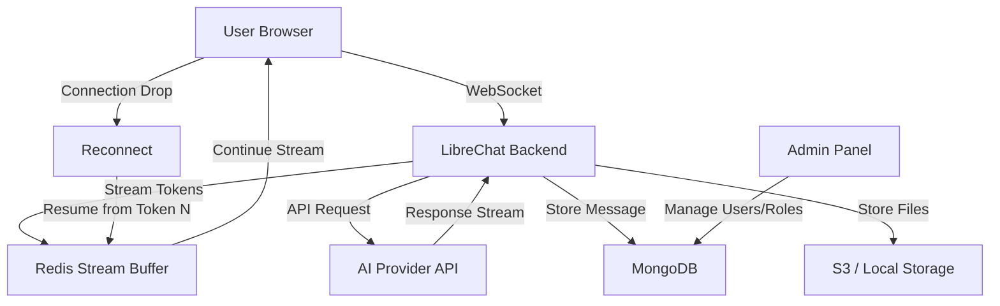

## Table of contents

- [Executive answer](#executive-answer)
- [What changed in the repository](#what-changed-in-the-repository)
- [Who should care](#who-should-care)
- [Core capabilities and architecture](#core-capabilities-and-architecture)
- [Deployment and infrastructure considerations](#deployment-and-infrastructure-considerations)
- [Upgrade risk assessment](#upgrade-risk-assessment)
- [Test plan](#test-plan)
- [Rollback plan](#rollback-plan)
- [Unanswered questions from documentation](#unanswered-questions-from-documentation)
- [Decision checklist](#decision-checklist)
- [Evidence, assumptions, and limitations](#evidence-assumptions-and-limitations)
- [FAQ](#faq)
- [Sources](#sources)

## Executive answer

LibreChat has reached 41,878 GitHub stars as of August 10, 2026, positioning it as a widely-watched self-hosted AI chat platform. The MIT-licensed TypeScript project unifies multiple AI providers—including OpenAI, Anthropic, AWS Bedrock, Google Vertex AI, Azure, and custom endpoints—behind a single web interface with multi-user authentication, agent workflows, Model Context Protocol (MCP) support, and a Code Interpreter API. The repository currently lists 690 open issues, reflecting active feature requests and bug reports from a community of 8,656 forks.

Teams evaluating LibreChat should weigh its broad provider compatibility and enterprise-ready admin panel against the operational complexity of self-hosting a TypeScript/Node.js application with authentication, file storage (local or S3/CloudFront), and optional Redis for stream resumption. The platform targets organizations that require on-premises AI infrastructure, granular role-based access control, and the ability to switch models mid-conversation. This analysis examines the repository's current state, deployment trade-offs, and unanswered questions about release cadence and production hardening.

## What changed in the repository

No discrete release identifier or tag is available in the supplied data; the most recent push to the main branch occurred on August 10, 2026 at 05:28 UTC. The repository description highlights features added over the project's lifetime since February 2023, including:

- **Agent and MCP integration**: LibreChat Agents support no-code assistant creation, an agent marketplace, Skills (reusable instruction bundles), Subagents (isolated child runs), and MCP server connections for tools.
- **Code Interpreter API**: Sandboxed execution in Python, Node.js, Go, C/C++, Java, PHP, Rust, and Fortran, powered by ClickHouse's open-source code-interpreter.
- **Resumable Streams**: Automatic reconnection and multi-tab/multi-device sync for AI responses, compatible with Redis-backed horizontal scaling.
- **Generative UI**: Code Artifacts allow inline creation of React components, HTML, and Mermaid diagrams.
- **Web Search**: Combines search providers, content scrapers, and Jina reranking with configurable API endpoints.
- **Admin Panel**: Browser-based management for users, groups, roles, and per-role configuration overrides without redeployment.
- **Reasoning UI**: Dynamic interface for chain-of-thought models like DeepSeek-R1.

The README does not specify a semantic version number or tag for the current state; users must consult the [official changelog](https://www.librechat.ai/changelog) for breaking changes before updating.

## Who should care

| Stakeholder | Reason to evaluate |
|-------------|--------------------|
| **Platform teams** | Need unified AI chat interface across OpenAI, Anthropic, AWS Bedrock, Google, Azure without vendor lock-in |
| **Compliance officers** | Require on-premises hosting, audit trails, and role-based access control for AI usage |
| **AI product managers** | Want to test agent workflows, MCP tool integration, and multi-model conversations before committing to a cloud service |
| **DevOps engineers** | Must deploy and scale a Node.js application with MongoDB, Redis (optional), and S3-compatible storage |
| **Cost-conscious teams** | Seek to avoid per-seat SaaS fees by self-hosting and paying only API costs to model providers |
| **Researchers** | Value the ability to compare responses from multiple models in a single conversation thread |

> [!NOTE]
> LibreChat's 41,878 stars indicate community interest but do not measure production adoption or stability. The 690 open issues reflect active development and user feedback, not a count of critical defects.

## Core capabilities and architecture

### Multi-provider model switching

LibreChat abstracts over provider-specific APIs through a unified configuration layer. Administrators define endpoints in `librechat.yaml`, mapping each to an OpenAI-compatible interface or a native SDK wrapper. Users select models from a dropdown during or between messages, and the platform routes requests accordingly. Supported providers include:

- OpenAI (GPT-4.5, GPT-4o, o1), Azure OpenAI, OpenAI Responses API
- Anthropic (Claude), AWS Bedrock
- Google (Gemini), Vertex AI
- Custom endpoints (Ollama, groq, Cohere, Mistral AI, OpenRouter, Perplexity, DeepSeek, Qwen, together.ai, koboldcpp)

This architecture, inferred from the README's provider list, suggests a request-routing layer that normalizes input/output formats and manages API keys per user or per group.

### Agent workflows and MCP integration

LibreChat Agents are defined as "no-code custom assistants" that combine:

- **Tools**: Functions exposed via MCP servers or built-in actions (file search, code execution).
- **Skills**: Markdown instruction files (`SKILL.md`) that inject prompts into agent context, triggerable manually, automatically, or always-on.
- **Subagents**: Isolated child agent runs with separate context windows, enabling hierarchical task delegation.

The agent marketplace allows users to discover and share agent configurations within their organization or publicly. MCP support means teams can integrate tools from any MCP-compliant server without writing custom LibreChat plugins.

### Code Interpreter API

The platform embeds a secure sandboxed execution environment for:

- Python, Node.js (JavaScript/TypeScript), Go, C/C++, Java, PHP, Rust, Fortran
- File upload, processing, and download within the conversation context
- Isolated execution with no external network access

This feature is powered by [ClickHouse/code-interpreter](https://github.com/ClickHouse/code-interpreter), an open-source project. Users upload data files or code snippets, and the AI can request execution, returning results inline.

### Resumable Streams

A distinguishing feature is automatic reconnection of streaming responses. If a user's network connection drops or they switch tabs/devices, LibreChat resumes the response from the last received token. The implementation supports:

- Single-server deployments (in-memory or file-based state)
- Horizontally scaled clusters with Redis as the shared state store

This addresses a common pain point in long-running AI responses, particularly for mobile or unstable connections.

### Admin Panel

The browser-based admin interface provides:

- User, group, and role management
- Per-role or per-group configuration overrides (model access, token limits, feature flags)
- Live edits without container restarts

The panel is bundled with Docker Compose stacks, enabling one-command setup for evaluation.

## Deployment and infrastructure considerations

### Docker Compose and cloud deployment

LibreChat's README references Docker and multiple one-click deployment options:

- Railway, Zeabur, Sealos (PaaS providers)
- Self-hosted Docker Compose stacks
- S3 with CloudFront for media delivery, signed cookies, and edge caching

The Docker Compose approach typically includes:

- MongoDB container (conversation history, user data)
- Redis container (optional, for Resumable Streams and session caching)
- LibreChat backend (Node.js/Express)
- LibreChat frontend (React SPA served by Nginx or the backend)

### Authentication and multi-tenancy

The platform supports:

- OAuth2 (Google, GitHub, custom providers)
- LDAP/Active Directory
- Email/password with email verification

Multi-user isolation is enforced at the database and API layer, with role-based permissions controlling model access, file upload limits, and feature availability.

### Scaling and performance

Key operational questions:

| Concern | Consideration |
|---------|---------------|
| **Horizontal scaling** | Redis required for Resumable Streams; session affinity or shared state needed for WebSocket connections |
| **Database load** | MongoDB stores all messages and files; large deployments may need replica sets or sharding |
| **File storage** | Local disk suitable for small teams; S3 + CloudFront recommended for distributed teams or large media uploads |
| **API rate limits** | Per-provider rate limits apply; LibreChat does not proxy or pool requests across users' API keys |
| **Token tracking** | Admin panel shows token spend per user/model; requires correct configuration of provider billing APIs |

> [!WARNING]
> The repository lists 690 open issues as of August 10, 2026. Review the issue tracker for known bugs affecting your target deployment environment (Docker, Kubernetes, bare metal) before production use.

## Upgrade risk assessment

Because no specific release version is provided in the supplied data, the following risks apply to any update from an older commit:

### Breaking changes

The README explicitly states: "Please consult the [changelog](https://www.librechat.ai/changelog) for breaking changes before updating." Common breaking changes in similar platforms include:

- Environment variable renames or removals
- Database schema migrations requiring manual steps
- Changes to `librechat.yaml` configuration format
- Deprecated authentication methods

### Dependency updates

TypeScript projects frequently update major dependencies (React, Node.js, MongoDB driver). Review the commit log or changelog for:

- Node.js version bumps (may require Docker image rebuild)
- npm package vulnerabilities fixed
- New peer dependencies

### Feature flag rollout

New features like MCP support, Reasoning UI, or Admin Panel overrides may default to enabled, changing user experience. Check release notes for feature flags and their defaults.

## Test plan

### Pre-deployment validation

1. **Configuration review**: Compare `librechat.yaml` against the latest [documentation](https://librechat.ai/docs) for new required fields.
2. **Environment variables**: Audit `.env` file for deprecated keys; test OAuth2 and LDAP integrations in a staging environment.
3. **Database migration**: Back up MongoDB; run migration scripts if documented; verify schema changes.
4. **API key rotation**: Test provider API keys (OpenAI, Anthropic, etc.) in a sandbox conversation.

### Functional testing

| Test case | Objective |
|-----------|----------|
| **Model switching** | Start a conversation with GPT-4o, switch to Claude 3 Sonnet mid-thread, verify context continuity |
| **Agent execution** | Create an agent with file search and code execution; upload a CSV; request analysis |
| **Resumable Streams** | Initiate a long response, disconnect network, reconnect, verify stream resumes |
| **Admin Panel** | Create a new role with restricted model access; assign to test user; confirm enforcement |
| **MCP tool** | Connect an MCP server (e.g., filesystem, web scraper); invoke tool from agent; verify result |
| **Code Interpreter** | Upload a Python script; request execution; download output file |
| **Web Search** | Enable web search; ask a current-event question; verify sources cited |
| **Multimodal input** | Upload an image; request OCR or description from Claude 3 or GPT-4o |

### Performance and scale testing

- Load test with 50 concurrent users streaming responses; measure Redis memory usage and WebSocket connection overhead.
- Test file upload limits (10 MB, 100 MB) and S3 transfer times.
- Simulate network interruptions (kill WebSocket mid-stream) and measure reconnection latency.

> [!TIP]
> Run a canary deployment with 10% of users on the new commit for 48 hours. Monitor error rates, response latency, and issue reports before full rollout.

## Rollback plan

### Containerized deployments

1. **Tag the current image**: `docker tag librechat:latest librechat:backup-YYYYMMDD`
2. **Deploy new image**: `docker-compose pull && docker-compose up -d`
3. **Rollback command**: `docker-compose down && docker tag librechat:backup-YYYYMMDD librechat:latest && docker-compose up -d`

### Database rollback

If schema migrations occurred:

1. Restore MongoDB from pre-upgrade backup.
2. Revert application containers to previous image.
3. Verify conversation history and user data integrity.

### Stateless rollback

If no database migration was required, simply revert the container image and restart. User sessions may be disrupted but data remains intact.

### Testing rollback

Before production upgrade, rehearse rollback in staging:

- Apply the upgrade.
- Create test conversations and agents.
- Execute rollback.
- Confirm test data persists or is cleanly removed based on migration strategy.

## Unanswered questions from documentation

The README and repository metadata leave several operational questions unresolved:

1. **Release cadence**: No semantic versioning tags are visible; unclear if the project follows scheduled releases or continuous deployment.
2. **Security patching**: How are CVEs in dependencies disclosed? Is there a security mailing list or advisory feed?
3. **Benchmark data**: No performance benchmarks (requests/sec, latency percentiles, max concurrent users) are published.
4. **Upgrade automation**: Are database migrations automated via a startup script, or do they require manual execution?
5. **High availability**: Is active-active deployment supported, or does Redis require a sentinel/cluster setup for failover?
6. **Token spend accuracy**: Which providers' billing APIs are supported for real-time token tracking? Does the platform handle rate-limit retries?
7. **MCP server discovery**: Can users install MCP servers from a registry, or must admins pre-configure each server in `librechat.yaml`?
8. **Agent versioning**: Can agents be versioned and rolled back if a Skill or tool configuration breaks?
9. **Audit logging**: Does the Admin Panel provide immutable audit logs for compliance (SOC 2, HIPAA)?
10. **Localization completeness**: Translation progress is shown as a badge; which languages have <90% coverage, affecting UX?

> [!NOTE]
> The official [documentation](https://librechat.ai/docs) and [changelog](https://www.librechat.ai/changelog) may answer some of these questions. Always consult those resources before production deployment.

## Decision checklist

Use this checklist to evaluate LibreChat for your organization:

- [ ] **Provider compatibility**: Confirm all required AI providers (OpenAI, Anthropic, Bedrock, etc.) are supported and tested.
- [ ] **Authentication method**: Verify OAuth2, LDAP, or email/password aligns with your identity provider.
- [ ] **Hosting environment**: Decide between Docker Compose (single server), Kubernetes (horizontal scale), or PaaS (Railway, Zeabur).
- [ ] **File storage**: Choose local disk (small teams) or S3 + CloudFront (distributed teams, large media).
- [ ] **Redis requirement**: Determine if Resumable Streams and multi-device sync justify Redis operational overhead.
- [ ] **Agent use cases**: Identify workflows (data analysis, web search, code execution) that benefit from LibreChat Agents.
- [ ] **Compliance needs**: Assess RBAC granularity, audit logging, and data residency requirements.
- [ ] **Operational capacity**: Ensure team can manage Node.js, MongoDB, Redis, and container orchestration.
- [ ] **Issue tracker review**: Filter the 690 open issues by label (bug, feature, documentation) to assess stability for your use case.
- [ ] **Community support**: Join the [Discord](https://discord.librechat.ai) and review recent discussions for deployment gotchas.
- [ ] **Cost model**: Calculate API costs per user/month across providers; compare to SaaS alternatives (ChatGPT Team, Claude Pro).
- [ ] **Migration path**: Plan data export strategy if switching away from LibreChat (conversations stored in MongoDB).

## Evidence, assumptions, and limitations

### Evidence used

- **Repository metadata**: Stars (41,878), forks (8,656), open issues (690), last push (2026-08-10 05:28 UTC) from GitHub API.
- **README content**: Feature descriptions, provider list, deployment options, and links to documentation.
- **Inferred architecture**: Multi-provider routing, agent execution model, and scaling patterns derived from README sections on Resumable Streams, Admin Panel, and Docker Compose.

### Assumptions

- **Production readiness**: The platform is described as "production-ready" for Resumable Streams and multi-user authentication, but no uptime SLA or enterprise support tier is documented.
- **Breaking changes**: The absence of a semantic version tag in the supplied data means all updates carry unknown breaking-change risk until the changelog is consulted.
- **MCP maturity**: Model Context Protocol support is highlighted, but the protocol itself is relatively new (first major adoption in 2025); tool ecosystem may be limited.

### Limitations

- **No release notes**: Supplied data lacks a specific version number or release notes, limiting analysis to the current repository state.
- **No benchmark data**: Performance claims ("horizontally scaled deployments") are not backed by published benchmarks or case studies.
- **Issue count interpretation**: 690 open issues may include feature requests, documentation gaps, and third-party integration bugs; not all are platform defects.
- **Security disclosure**: No CVE database or security advisory feed is referenced; rely on GitHub security advisories for the repository.

### Data freshness

All data retrieved on August 10, 2026 at 11:53 UTC. Repository activity (stars, issues, commits) may have changed since retrieval.

## FAQ

### What is LibreChat's primary use case?

LibreChat targets organizations that need a self-hosted AI chat interface with multi-provider model switching, role-based access control, and on-premises data residency. It suits enterprises, research labs, and privacy-focused teams unwilling to send conversation data to third-party SaaS platforms.

### How does LibreChat compare to ChatGPT Team or Claude for Work?

LibreChat requires self-hosting (Docker, Kubernetes, or PaaS) and operational expertise in Node.js, MongoDB, and Redis. You pay only API costs to providers like OpenAI or Anthropic, avoiding per-seat SaaS fees. Trade-off: you own the infrastructure, monitoring, and security patching. ChatGPT Team and Claude for Work offer zero-ops deployment but less flexibility in model selection and no on-premises option.

### Can I run LibreChat entirely offline with local models?

Yes, via custom endpoints. Configure Ollama, koboldcpp, or any OpenAI-compatible local inference server in `librechat.yaml`. The Code Interpreter and Web Search features may require internet access depending on tool configuration. Agent MCP servers can also run locally.

### What is the Model Context Protocol (MCP) and why does it matter?

MCP is a standard for exposing tools (APIs, databases, file systems) to AI models in a uniform way. LibreChat's MCP support means you can integrate any MCP-compliant tool without writing LibreChat-specific plugins. This reduces vendor lock-in and accelerates agent development.

### How stable is LibreChat for production use?

The 690 open issues indicate active development and user feedback, not necessarily critical bugs. Review the issue tracker filtered by your deployment target (Docker, Kubernetes) and required features (Resumable Streams, Admin Panel). The project has 41,878 stars and 8,656 forks, suggesting a large community, but no commercial support tier or SLA is advertised. Test thoroughly in staging before production rollout.

### Does LibreChat support SSO and LDAP?

Yes. The platform supports OAuth2 (Google, GitHub, custom providers) and LDAP/Active Directory for authentication. Email/password with verification is also available. Role-based access control and group management are configured in the Admin Panel.

### What are the hardware requirements for a small team (10–50 users)?

A single server with 4 vCPUs, 8 GB RAM, and 100 GB SSD can handle 10–50 users with moderate conversation volume. MongoDB and Redis (optional) will consume 1–2 GB RAM. For production, use managed MongoDB Atlas and Redis Cloud to reduce operational overhead. File storage should be S3-compatible for reliability.

## Sources

- [LibreChat canonical repository](https://github.com/danny-avila/LibreChat)
