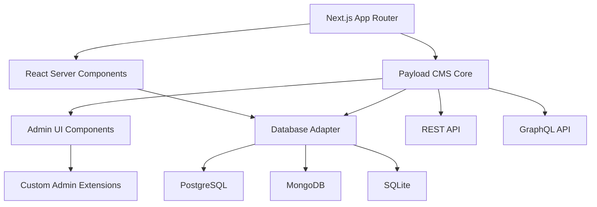

## Table of contents

- [Executive answer](#executive-answer)
- [Repository health and maintenance signals](#repository-health-and-maintenance-signals)
- [Architecture and integration model](#architecture-and-integration-model)
- [Feature set and intended users](#feature-set-and-intended-users)
- [Evidence-based strengths](#evidence-based-strengths)
- [Limitations and trade-offs](#limitations-and-trade-offs)
- [Decision checklist for Payload CMS adoption](#decision-checklist-for-payload-cms-adoption)
- [Responsible adoption path](#responsible-adoption-path)
- [Evidence, assumptions, and limitations](#evidence-assumptions-and-limitations)
- [FAQ](#faq)
- [Sources](#sources)

## Executive answer

The [Payload CMS repository](https://github.com/payloadcms/payload) is a TypeScript-based headless content management system that integrates directly into Next.js applications. With 44,069 GitHub stars and a recent push date of August 10, 2026, the project demonstrates active development velocity and community interest. Payload positions itself as both an application framework and CMS, capable of installing into an existing Next.js `/app` directory rather than requiring a separate backend service. The repository is licensed under MIT and supports PostgreSQL, MongoDB, and SQLite database adapters.

Payload targets teams seeking full control over their content infrastructure without SaaS vendor lock-in. The architecture differs from traditional headless CMSs by running within the same Next.js process, enabling direct database queries in React Server Components and eliminating round-trip HTTP calls for content. The repository includes 1,002 open issues as of August 10, 2026, a count that reflects both active usage and the complexity of maintaining a full-stack CMS framework. Teams evaluating Payload should assess their tolerance for self-hosted infrastructure, TypeScript fluency, and willingness to engage with a rapidly evolving codebase.

## Repository health and maintenance signals

Payload's maintenance profile indicates sustained investment. The default branch received its most recent commit on August 10, 2026, aligning with the data retrieval date. The [latest release (v3.87.1)](https://github.com/payloadcms/payload/releases/tag/v3.87.1) shipped on August 6, 2026, containing bug fixes for HMR endpoints, dependency security patches (mongoose, undici, @modelcontextprotocol/sdk), and template updates.

### Maintenance metrics (as of August 10, 2026)

| Metric | Value | Interpretation |
|--------|-------|----------------|
| Stars | 44,069 | High visibility and interest |
| Forks | 4,024 | Active community experimentation |
| Open issues | 1,002 | Large backlog; may indicate fast feature growth or support volume |
| Contributors | Not specified | Repository acknowledges multiple contributors via badge |
| License | MIT | Permissive commercial use |
| Latest release | v3.87.1 (Aug 6, 2026) | Regular patch cadence |
| Last push | Aug 10, 2026 | Active development |

The repository advertises a migration guide from v2 to v3, suggesting a major version transition occurred relatively recently. Teams adopting Payload should anticipate breaking changes between major versions and budget for migration efforts.

> [!NOTE]
> The 1,002 open issues do not represent 1,002 defects. This count includes feature requests, questions, documentation tasks, and duplicate reports. High issue counts often correlate with popular projects that attract broad usage.

## Architecture and integration model

Payload's defining characteristic is its Next.js-native architecture. Unlike traditional headless CMSs that operate as separate services, Payload installs as a dependency within a Next.js project. This architectural choice, inferred from the repository description and README, enables several capabilities:

The architecture suggests that Payload runs in the same Node.js process as the Next.js application, enabling:

- **Direct database queries**: Server components can query the database without HTTP requests
- **Shared type definitions**: TypeScript types are automatically generated from Payload configuration
- **Unified deployment**: A single deployment artifact contains both frontend and CMS
- **Custom admin extensions**: React Server Components can extend the admin panel

> [!WARNING]
> The "Next.js native" architecture means Payload inherits Next.js runtime constraints. Teams must deploy to environments that support Next.js server-side features (Node.js runtime, serverless functions with sufficient execution time). Static export is not a viable deployment target for the CMS functionality.

Payload provides database adapters for PostgreSQL, MongoDB, and SQLite. The repository topics and README mention both Postgres and MongoDB explicitly, indicating these are first-class supported databases. The choice of database adapter affects query capabilities, transaction semantics, and deployment infrastructure.

## Feature set and intended users

Payload markets itself to teams transitioning away from WordPress or seeking alternatives to SaaS headless CMSs (Contentful, Sanity, Strapi Cloud). The repository README lists a comprehensive feature set:

### Core CMS capabilities

- Authentication with built-in user management
- Versions and draft/publish workflows
- Localization for multi-language content
- Block-based layout builder for flexible page composition
- Lexical rich text editor (modern alternative to Slate)
- Conditional field logic for dynamic forms
- Granular access control at document and field levels
- Document and field-level hooks for business logic

### Developer experience features

- Automatic TypeScript type generation
- Customizable React admin panel
- REST and GraphQL APIs
- HTTP-only cookies and CSRF protection
- Serverless deployment support (Vercel, Cloudflare Workers)

The repository includes production-ready templates for websites, ecommerce stores, blogs, and portfolios. These templates use React Server Components and Tailwind CSS, indicating Payload expects adopters to be comfortable with modern React patterns.

### Intended user profile

Based on features and documentation links, Payload targets:

- **Full-stack TypeScript teams** building Next.js applications
- **Agencies and consultancies** delivering client projects with content management requirements
- **Product teams** requiring content infrastructure without SaaS costs or data residency concerns
- **Engineering leaders** prioritizing code extensibility over no-code administration

> [!TIP]
> Payload's architecture favors teams with strong TypeScript skills and Next.js experience. If your team lacks comfort with React Server Components or monorepo tooling (the repository suggests pnpm workspaces), budget additional learning time or consider more opinionated alternatives.

## Evidence-based strengths

### 1. MIT license eliminates commercial restrictions

Payload uses the MIT license, permitting commercial use, modification, and redistribution without royalties. Teams can fork the codebase, remove features, or embed Payload in proprietary products.

### 2. Active release cadence with security patching

The v3.87.1 release notes (August 6, 2026) document security patches for mongoose (GHSA-664h-wqgq-64gw), undici, and @modelcontextprotocol/sdk (GHSA-frvp-7c67-39w9). This indicates the maintainers monitor dependency vulnerabilities and ship patches promptly.

### 3. Serverless deployment options reduce infrastructure burden

The repository provides one-click deployment buttons for Vercel and Cloudflare. The Cloudflare option integrates Workers, R2 (object storage), and D1 (distributed database), offering a fully managed serverless stack. The Vercel option pairs Next.js with Neon (PostgreSQL) and Vercel Blob.

### 4. Monorepo structure with official templates

Payload maintains templates within the repository (`/templates` directory), ensuring templates stay synchronized with core changes. The website and ecommerce templates are described as "production-ready, end-to-end solutions," providing reference implementations for common use cases.

### 5. Extensibility through hooks and React components

Document and field-level hooks enable custom validation, data transformation, and side effects without modifying Payload core. The admin panel accepts custom React components, allowing teams to inject domain-specific UI without forking.

## Limitations and trade-offs

### 1. 1,002 open issues signal support and complexity challenges

As of August 10, 2026, the repository has 1,002 open issues. While this is not a defect count, it suggests:

- High support volume requiring community or self-service troubleshooting
- Potential delays in bug fixes or feature requests
- Complexity in triaging and prioritizing contributions

Teams adopting Payload should plan to rely on documentation, Discord, and GitHub Discussions rather than expecting rapid issue responses.

### 2. Next.js coupling limits architectural flexibility

Payload's Next.js-native design is a strength for Next.js teams but a constraint for others. Teams using Remix, SvelteKit, Astro, or non-JavaScript frontends must deploy Payload as a separate service, negating the "same `/app` folder" advantage. The architecture also ties Payload's evolution to Next.js release cycles and breaking changes.

### 3. v2 to v3 migration indicates breaking changes

The README mentions a [3.0 Migration Guide](https://github.com/payloadcms/payload/blob/main/docs/migration-guide/overview.mdx), signaling that major version upgrades require code changes. Teams should evaluate Payload's version stability and their tolerance for migration work before committing to production use.

### 4. Self-hosted infrastructure responsibility

Unlike SaaS CMSs (Contentful, Sanity), Payload requires teams to manage:

- Database hosting and backups
- Application server uptime and scaling
- Security patches and dependency updates
- Media storage (unless using Vercel Blob or R2)

Teams without DevOps capacity may find SaaS alternatives more cost-effective despite higher subscription fees.

### 5. Database adapter choice constrains query patterns

Payload's multi-database support is a flexibility feature, but adapter choice affects:

- Transaction semantics (PostgreSQL supports ACID transactions; MongoDB has limited multi-document transactions)
- Query performance for complex relationships
- Deployment infrastructure (MongoDB Atlas vs. managed PostgreSQL vs. SQLite on disk)

Teams should prototype with their intended database before committing to Payload.

> [!WARNING]
> The repository's 44K stars reflect interest, not production adoption or market share. Star counts are easily inflated by "awesome lists," newsletter features, or viral social media posts. Do not use stars as a proxy for stability or long-term viability.

## Decision checklist for Payload CMS adoption

Use this checklist to determine whether Payload aligns with your project requirements:

- [ ] **TypeScript proficiency**: Does your team write TypeScript daily and maintain type-safe codebases?
- [ ] **Next.js experience**: Have you shipped production Next.js applications with App Router?
- [ ] **Self-hosting capacity**: Can your team deploy, monitor, and maintain Node.js applications and databases?
- [ ] **Security patching process**: Do you have a process to update dependencies within days of vulnerability disclosure?
- [ ] **Content model complexity**: Have you mapped your content types, relationships, and access control rules?
- [ ] **Database choice validation**: Have you selected PostgreSQL, MongoDB, or SQLite based on query patterns and deployment constraints?
- [ ] **Migration budget**: If Payload releases v4, can your team allocate engineering time for migration?
- [ ] **Community support tolerance**: Are you comfortable troubleshooting via GitHub Discussions and Discord rather than guaranteed SLA support?
- [ ] **Vendor lock-in tolerance**: Have you evaluated the cost of migrating content and code away from Payload if requirements change?
- [ ] **Template evaluation**: Have you run the website or ecommerce templates locally to assess fit?

## Responsible adoption path

### Phase 1: Local proof-of-concept (1–2 weeks)

1. Install Payload using `pnpx create-payload-app@latest -t website`
2. Deploy the website template locally with your chosen database adapter
3. Customize one collection (e.g., "Posts") with fields matching your content model
4. Implement one custom access control rule and one hook
5. Test the admin panel with non-technical stakeholders
6. Query content from a React Server Component without using the REST API

### Phase 2: Staging deployment (2–4 weeks)

1. Deploy to Vercel or Cloudflare using the one-click buttons
2. Configure production database (Neon, MongoDB Atlas, or D1)
3. Set up media storage (Vercel Blob, R2, or S3-compatible service)
4. Migrate sample content and test localization workflows
5. Implement custom admin components for domain-specific needs
6. Load test content queries under expected traffic patterns
7. Review security posture (authentication, CSRF, access control)

### Phase 3: Production rollout (4–8 weeks)

1. Document custom code, hooks, and access control rules
2. Establish dependency update process (monitor GitHub releases and security advisories)
3. Configure monitoring for API response times, database query performance, and error rates
4. Train content editors on admin panel workflows
5. Implement backup and disaster recovery procedures
6. Plan for Next.js and Payload version upgrades (budget quarterly review)

## Evidence, assumptions, and limitations

### Evidence sources

All factual claims derive from:

- [Payload CMS canonical repository](https://github.com/payloadcms/payload) metadata (stars, forks, issues, topics, license)
- Repository README content (features, templates, deployment options)
- [Latest GitHub release notes (v3.87.1)](https://github.com/payloadcms/payload/releases/tag/v3.87.1)
- Data retrieval timestamp: August 10, 2026

### Architectural inferences

The following conclusions are inferred from the README and repository structure, not independently verified:

- Payload runs within the Next.js server process
- React Server Components can query the database directly
- Database adapters abstract query differences between PostgreSQL, MongoDB, and SQLite
- The admin panel is a React application

### Data limitations

- **No performance benchmarks**: The repository does not publish query latency, throughput, or scalability data
- **No adoption metrics**: Star count does not indicate production usage or customer count
- **No security audit results**: While the repository mentions security features, no third-party audit reports are cited
- **No LTS commitment**: The repository does not specify long-term support windows for major versions

## FAQ

### Can Payload replace WordPress for existing sites?

Payload and WordPress target different use cases. WordPress is a mature, PHP-based CMS with a massive plugin ecosystem and non-technical user workflows. Payload is a TypeScript framework requiring Next.js and developer configuration. Migration from WordPress to Payload requires rebuilding the site in Next.js and migrating content via custom scripts. Payload is better suited for new projects or teams already committed to Next.js, not like-for-like WordPress replacement.

### Does Payload work without Next.js?

Yes, but with reduced benefits. Payload's core CMS functionality (database, admin panel, REST/GraphQL APIs) can run as a standalone service. However, the primary value proposition—installing into a Next.js `/app` folder and querying from React Server Components—requires Next.js. Teams using other frameworks (Remix, SvelteKit, Astro) would deploy Payload separately and consume its REST or GraphQL API, similar to traditional headless CMSs.

### How does Payload compare to Strapi?

Both are open-source, self-hosted headless CMSs with TypeScript support and customizable admin panels. Payload integrates natively with Next.js and emphasizes React Server Component queries, while Strapi is framework-agnostic and uses a traditional REST/GraphQL API architecture. Strapi has a longer history (founded 2015 vs. Payload's 2021) and larger community, but Payload offers tighter Next.js integration. Teams should evaluate based on framework choice and preference for monolithic vs. decoupled architecture.

### What database should I choose for Payload?

PostgreSQL is the recommended default for most teams due to ACID transactions, mature managed hosting options (Neon, Supabase, AWS RDS), and strong relational data support. MongoDB suits projects with highly variable document schemas or existing MongoDB infrastructure. SQLite works for small projects, development environments, or edge deployments with limited write concurrency. Prototype with your chosen database to validate query performance and operational complexity.

### Is Payload production-ready?

Payload has reached v3.87.1, indicating maturity beyond early-stage development. The repository includes production templates and one-click deployment options. However, "production-ready" depends on your team's capabilities. Teams with Next.js expertise, self-hosting infrastructure, and tolerance for rapid version evolution can confidently use Payload in production. Teams lacking these attributes should budget additional risk mitigation (staging environments, rollback plans, support contracts if available).

### How do I get support for Payload issues?

Payload is community-supported via [GitHub Discussions](https://github.com/payloadcms/payload/discussions), [Discord](https://discord.gg/payload), and [GitHub Issues](https://github.com/payloadcms/payload/issues). The repository does not advertise commercial support contracts. Teams requiring guaranteed response times should evaluate whether community support meets their SLA requirements or consider SaaS alternatives with paid support tiers.

### Can I use Payload with databases other than PostgreSQL, MongoDB, and SQLite?

No official adapters exist for MySQL, MariaDB, or other databases as of August 2026. Payload's adapter architecture theoretically allows custom database adapters, but building one requires deep familiarity with Payload internals and ongoing maintenance as Payload evolves. Teams requiring unsupported databases should either contribute an adapter upstream or select a different CMS.

## Sources

- [Payload CMS canonical repository](https://github.com/payloadcms/payload)
- [Payload CMS latest GitHub release](https://github.com/payloadcms/payload/releases/tag/v3.87.1)
