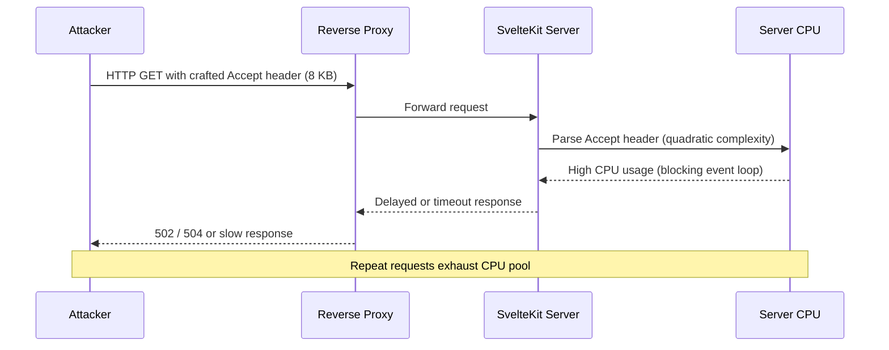

## Table of contents

- [Executive answer](#executive-answer)
- [Vulnerability overview](#vulnerability-overview)
- [Technical details](#technical-details)
- [Affected versions and patch status](#affected-versions-and-patch-status)
- [Is your application affected?](#is-your-application-affected)
- [Remediation steps](#remediation-steps)
- [Incident response checklist](#incident-response-checklist)
- [Attack flow and exploitation timeline](#attack-flow-and-exploitation-timeline)
- [Evidence, assumptions, and limitations](#evidence-assumptions-and-limitations)
- [Additional hardening recommendations](#additional-hardening-recommendations)
- [FAQ](#faq)
- [Sources](#sources)

## Executive answer

SvelteKit versions through 2.70.1 contain a Regular Expression Denial of Service (ReDoS) vulnerability in the framework's content negotiation logic. [GitHub Security Advisory GHSA-29g2-3rmr-qm68](https://github.com/advisories/GHSA-29g2-3rmr-qm68) and CVE-2026-66062 document an O(n²) quadratic backtracking issue triggered by specially crafted `Accept` HTTP headers. An unauthenticated attacker can exhaust server CPU resources, leading to denial of service. The vulnerability is rated **medium severity** because most production platforms impose default header-length limits that reduce exploitability, but environments with raised or absent limits face significant risk.

The SvelteKit maintainers released version 2.70.2 on July 29, 2026, which eliminates the quadratic behavior in Accept header parsing. All SvelteKit applications running versions ≤2.70.1 should upgrade immediately. No workaround exists beyond applying platform-level header size restrictions, which only mitigate—rather than eliminate—the attack surface.

> [!WARNING]
> **Immediate action required**  
> If your SvelteKit application is exposed to untrusted HTTP traffic and runs version 2.70.1 or earlier, upgrade to `@sveltejs/kit@2.70.2` today. Exploitation requires no authentication and can degrade service availability.

## Vulnerability overview

| **Attribute**          | **Detail**                                                                 |
|------------------------|----------------------------------------------------------------------------|
| **CVE identifier**     | CVE-2026-66062                                                             |
| **GHSA identifier**    | GHSA-29g2-3rmr-qm68                                                        |
| **Severity**           | Medium                                                                     |
| **Attack vector**      | Network (unauthenticated HTTP requests)                                    |
| **Attack complexity**  | Low (requires crafted `Accept` header)                                     |
| **Affected package**   | `@sveltejs/kit`                                                            |
| **Vulnerable versions**| ≤ 2.70.1                                                                   |
| **Patched version**    | 2.70.2                                                                     |
| **Published**          | August 7, 2026                                                             |
| **Patch released**     | July 29, 2026                                                              |

The vulnerability resides in SvelteKit's internal content negotiation routine, which parses the `Accept` header to select the appropriate response format (HTML, JSON, etc.). A regex or parsing algorithm with quadratic time complexity allows an attacker to construct headers that force the server to perform an exponentially increasing number of operations relative to header length.

## Technical details

### Root cause: quadratic backtracking

ReDoS vulnerabilities arise when a regular expression engine encounters patterns that trigger catastrophic backtracking. In this case, the [SvelteKit 2.70.2 release notes](https://github.com/sveltejs/kit/releases/tag/%40sveltejs/kit%402.70.2) explicitly state the fix "prevent[s] quadratic backtracking in `Accept` header content negotiation." The original implementation likely used a regex or parsing loop that re-scanned portions of the input string multiple times when processing comma-separated media types, quality parameters (`q=`), or wildcard patterns.

A typical malicious `Accept` header might resemble:

```
Accept: text/html,text/html,text/html,...,text/html,*/*
```

with hundreds or thousands of repeated entries. Each additional token increases parse time quadratically, consuming CPU cycles and blocking the event loop (in Node.js) or worker thread (in edge runtimes).

### Attack prerequisites

- **No authentication required**: any client capable of sending HTTP requests can exploit the flaw.  
- **No special privileges**: the attacker does not need an account, session, or API key.  
- **Standard HTTP**: the attack uses a normal request header; no protocol violations or malformed packets are necessary.  
- **Platform dependency**: exploitation severity depends on whether the hosting environment enforces header size limits.

### Mitigating factors

Most production HTTP servers and reverse proxies impose default maximum header sizes (commonly 8 KB to 16 KB). These limits constrain the attacker's ability to send arbitrarily long `Accept` headers, reducing the practical impact. However:

- Custom server configurations may raise or remove limits.  
- Edge and serverless platforms vary in their default policies.  
- Even within default limits, carefully constructed payloads can still cause measurable CPU spikes or latency increases under load.

The advisory characterizes the impact as mitigated but not eliminated, justifying the medium severity rating.

## Affected versions and patch status

| **Version range**       | **Status**       | **Action required**                      |
|-------------------------|------------------|------------------------------------------|
| `@sveltejs/kit` < 2.70.2 | **Vulnerable**   | Upgrade to 2.70.2 or later immediately   |
| `@sveltejs/kit` ≥ 2.70.2 | Patched          | No action required                       |

The [official release](https://github.com/sveltejs/kit/releases/tag/%40sveltejs/kit%402.70.2) on July 29, 2026, contains the fix. The advisory was published on August 7, 2026, approximately nine days after the patched version became available, giving early adopters a window to upgrade before public disclosure.


## Is your application affected?

SvelteKit is **directly affected** by this vulnerability. Any application that:

1. Uses `@sveltejs/kit` version 2.70.1 or earlier, and  
2. Accepts HTTP requests from untrusted clients (public internet, third-party APIs, or any source outside your trust boundary)

is at risk.

### Dependency chain considerations

If your project depends on a library or monorepo package that itself depends on SvelteKit, you are transitively vulnerable. Check your full dependency tree:

```bash
npm list @sveltejs/kit
```

or

```bash
pnpm list @sveltejs/kit
```

Ensure that no transitive dependency pins a vulnerable version.

### Adapters and deployment targets

The vulnerability exists in the core `@sveltejs/kit` package, which all SvelteKit adapters rely upon. Whether you deploy to Node.js, Cloudflare Workers, Vercel, Netlify, or any other platform, the content negotiation code path is shared. Adapter choice does not affect exposure; only the SvelteKit version matters.

> [!NOTE]
> **Edge runtime considerations**  
> Edge platforms like Cloudflare Workers and Vercel Edge Functions often impose strict header size limits (commonly 8 KB). These constraints reduce—but do not eliminate—the window for exploitation. Do not rely solely on platform limits; upgrade to 2.70.2.

## Remediation steps

### 1. Verify your current version

Inspect `package.json` or `pnpm-lock.yaml` / `package-lock.json`:

```json
{
  "dependencies": {
    "@sveltejs/kit": "^2.70.1"
  }
}
```

If the resolved version is ≤ 2.70.1, you are vulnerable.

### 2. Upgrade to 2.70.2

Update your package manifest:

```bash
npm install @sveltejs/kit@2.70.2
```

or with pnpm:

```bash
pnpm update @sveltejs/kit@2.70.2
```

Commit the updated lockfile to version control.

### 3. Rebuild and redeploy

Regenerate your production build:

```bash
npm run build
```

Deploy the new build to all environments (staging, production, preview branches).

### 4. Validate the patch

After deployment, confirm the running version by checking your lockfile or server logs. No runtime verification command is necessary; the fix is embedded in the framework logic.

### 5. Monitor for abnormal CPU usage

Review application performance metrics (CPU utilization, request latency) for anomalies that may indicate prior exploitation. If you observe unexplained spikes around the advisory publication date, investigate request logs for suspicious `Accept` headers.

## Incident response checklist

- [ ] **Identify** all projects and environments running SvelteKit ≤ 2.70.1.  
- [ ] **Upgrade** `@sveltejs/kit` to 2.70.2 in each project.  
- [ ] **Rebuild** production assets with the patched version.  
- [ ] **Deploy** updated builds to staging and production.  
- [ ] **Audit** dependency trees for transitive SvelteKit dependencies.  
- [ ] **Review** recent server logs for unusual `Accept` headers or CPU spikes.  
- [ ] **Verify** that reverse proxies enforce reasonable header size limits (≤16 KB recommended).  
- [ ] **Document** the incident and upgrade in your security log.  
- [ ] **Communicate** the patch to your team and downstream consumers if you distribute a library.

> [!TIP]
> **Automate vulnerability scanning**  
> Integrate `npm audit`, Dependabot, or Snyk into your CI/CD pipeline to receive alerts when new advisories affect your dependencies.

## Attack flow and exploitation timeline



1. **Reconnaissance**: Attacker identifies a SvelteKit application (version disclosure via headers, framework fingerprinting).  
2. **Payload construction**: Craft an `Accept` header with repetitive or nested media types.  
3. **Request flood**: Send concurrent requests to maximize CPU saturation.  
4. **Service degradation**: Legitimate users experience timeouts, 502/504 errors, or extreme latency.  
5. **Detection**: Monitoring tools flag CPU spikes; operators investigate and discover the vulnerability.

## Evidence, assumptions, and limitations

### Evidence

- The [official GitHub Security Advisory GHSA-29g2-3rmr-qm68](https://github.com/advisories/GHSA-29g2-3rmr-qm68) confirms the vulnerability and assigns medium severity.  
- The [SvelteKit 2.70.2 release](https://github.com/sveltejs/kit/releases/tag/%40sveltejs/kit%402.70.2) includes a patch change explicitly addressing "quadratic backtracking in `Accept` header content negotiation."  
- CVE-2026-66062 was issued for this issue, providing a canonical identifier for tracking.

### Assumptions

- We assume the advisory's characterization of "mitigated by default header length limits" reflects common production configurations but acknowledge that custom setups may differ.  
- We infer that the vulnerability affects all SvelteKit deployments regardless of adapter, based on the advisory naming only `@sveltejs/kit` without adapter-specific caveats.

### Limitations

- The advisory does not publish a proof-of-concept (PoC) exploit, so the exact payload structure remains undisclosed.  
- No CVSSv3 score is provided; "medium" severity is qualitative.  
- The advisory does not specify whether SvelteKit version 1.x or version 3.x (default branch `version-3` as of August 2026) is affected. The vulnerable range "<= 2.70.1" and patched version "2.70.2" indicate only the 2.x series is explicitly documented as vulnerable.  
- This analysis is based on data retrieved August 10, 2026. Subsequent updates to the advisory or additional patches may supersede these findings.

## Additional hardening recommendations

1. **Enforce header size limits**: Configure your reverse proxy (nginx, Caddy, Cloudflare) to reject requests with headers exceeding 8 KB.  
2. **Rate limiting**: Apply per-IP or per-session rate limits to reduce the effectiveness of request floods.  
3. **Web Application Firewall (WAF)**: Use a WAF to detect and block anomalous `Accept` headers.  
4. **Monitoring**: Set alerts for sustained CPU usage above baseline thresholds.  
5. **Least privilege**: Run your SvelteKit process under a dedicated user account with minimal permissions to limit blast radius.

## FAQ

### Does this vulnerability affect SvelteKit 1.x or version 3.x?

The advisory specifies the vulnerable range as `<= 2.70.1` and the patched version as `2.70.2`, both in the 2.x series. No mention is made of versions 1.x or 3.x. The [SvelteKit repository](https://github.com/sveltejs/kit) default branch is `version-3` as of August 2026, suggesting active development on 3.x, but the advisory does not document exposure in that branch. If you run 1.x or 3.x, consult the project's security policy or open an issue to confirm status.

### Can I work around this without upgrading?

No effective workaround exists within SvelteKit itself. You can reduce risk by enforcing strict header size limits at the reverse proxy or load balancer, but this only mitigates the attack—it does not close the vulnerability. Upgrading to 2.70.2 is the only complete remediation.

### How do I know if my application was exploited before I patched?

Review HTTP access logs for requests with unusually large or repetitive `Accept` headers. Correlate timestamps with CPU usage spikes in your monitoring dashboards. If you lack detailed logging, consider this a blind spot and implement enhanced request logging going forward.

### Is this vulnerability exploitable in client-side Svelte applications?

No. Client-side Svelte applications do not run SvelteKit's server-side content negotiation logic. Only server-rendered SvelteKit apps—those using adapters like `adapter-node`, `adapter-vercel`, or `adapter-cloudflare`—are affected.

### Do I need to upgrade my Svelte package as well?

No. The vulnerability resides in `@sveltejs/kit`, not the `svelte` compiler package. If your project uses both, only `@sveltejs/kit` requires an update for this advisory.

### What if I use a different framework (Next.js, Remix, Nuxt)?

This vulnerability is specific to SvelteKit's content negotiation implementation. Other frameworks are not affected by CVE-2026-66062, though they may have their own security issues. Always review framework-specific advisories.

### Will automatic dependency updates (Dependabot, Renovate) catch this?

Yes, if you have configured Dependabot or Renovate to monitor `@sveltejs/kit` and have enabled security updates. Check your pull requests or issues for automated upgrade proposals. If none appeared, verify your tool configuration and permissions.

## Sources

- [SvelteKit canonical repository](https://github.com/sveltejs/kit)  
- [SvelteKit latest GitHub release](https://github.com/sveltejs/kit/releases/tag/%40sveltejs/kit%402.70.2)  
- [GitHub Security Advisory GHSA-29g2-3rmr-qm68](https://github.com/advisories/GHSA-29g2-3rmr-qm68)
