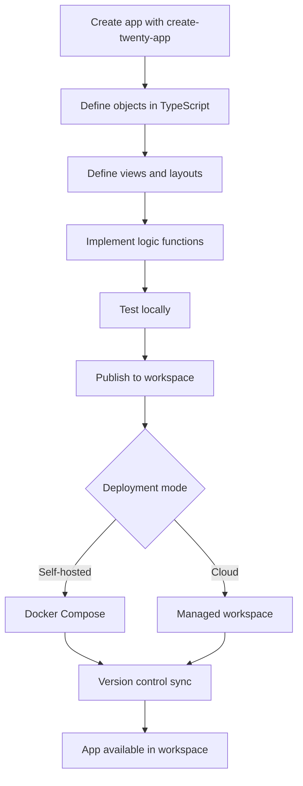

## Table of contents

- [Executive answer](#executive-answer)
- [Repository structure and organization](#repository-structure-and-organization)
- [Core project categories](#core-project-categories)
- [Integration patterns](#integration-patterns)
- [Evaluation criteria](#evaluation-criteria)
- [Discovery workflow](#discovery-workflow)
- [Decision checklist](#decision-checklist)
- [Evidence, assumptions, and limitations](#evidence-assumptions-and-limitations)
- [FAQ](#faq)
- [Sources](#sources)

## Executive answer

Twenty is an open-source CRM platform that positions itself as "the open alternative to Salesforce, designed for AI." The [core repository](https://github.com/twentyhq/twenty) (54,653 stars as of August 2026) provides a TypeScript-based monorepo built on NestJS, React, and PostgreSQL. Its ecosystem centers on a CLI-driven app development workflow where teams define objects, fields, views, workflows, and AI agents as code, then publish them to cloud or self-hosted workspaces. The repository structure indicates a comprehensive platform: frontend components in React with Jotai for state management, a GraphQL API layer, background job processing via BullMQ, and a version-controlled schema system.

The Twenty ecosystem supports three deployment modes—managed cloud (twenty.com), self-hosted Docker Compose, and local development—and three extension patterns: creating apps with the Twenty SDK, customizing layouts through the UI, and integrating with external systems via OAuth connections. The repository's 8,443 forks and 150 open issues (as of August 10, 2026) signal active community engagement. Licensing is listed as "NOASSERTION" in the GitHub API response, requiring manual verification before commercial use. This guide maps project categories, integration patterns, maintenance signals, and a practical discovery workflow for teams evaluating Twenty as a customizable CRM foundation.

## Repository structure and organization

The [twentyhq/twenty repository](https://github.com/twentyhq/twenty) uses an Nx monorepo structure, as indicated by the stack section of the README. Based on standard Nx conventions and the repository topics ("monorepo", "react", "nestjs", "typescript"), the architecture likely separates:

- **Frontend packages**: React-based UI using Jotai for state, Linaria for styling, and Lingui for internationalization
- **Backend packages**: NestJS server with GraphQL endpoints, BullMQ job queues, PostgreSQL persistence, and Redis caching
- **Shared packages**: TypeScript definitions, SDK utilities, and common types
- **Documentation site**: The homepage at twenty.com and docs at docs.twenty.com

The README references `npx create-twenty-app my-app` for scaffolding and `npx twenty app:publish --private` for deployment, indicating a CLI toolchain distributed via npm. The repository's default branch is `main`, with continuous releases (v2.27.0 published August 4, 2026).

> [!NOTE]
> The repository structure described here is inferred from README content and standard Nx monorepo patterns. The actual package organization may differ; refer to the repository root for the definitive layout.

## Core project categories

Twenty's ecosystem comprises three primary categories of work:

| Category | Scope | Distribution Model | Versioning |
|----------|-------|-------------------|------------|
| **Core Platform** | Monorepo containing server, frontend, CLI, and SDK | Self-hosted (Docker) or managed cloud | Semantic versioning (v2.27.0 as of Aug 2026) |
| **Apps** | Custom objects, fields, views, workflows, agents defined in TypeScript | Published to workspace via CLI | Per-app versioning, tracked in workspace |
| **Connections** | OAuth integrations (Slack, Microsoft, Google, Fireflies, Recall noted in release notes) | Built-in providers with lifecycle hooks | Coupled to core platform version |

### Core platform capabilities

The platform provides:

- **Object modeling**: Define custom objects with field types (TEXT, CURRENCY, DATE_TIME, and others)
- **View system**: Index views (list/table), board views (Kanban), and chart views with stable color palettes (per release notes)
- **Workflow engine**: Multi-step workflows with variable pickers, filters, and If/Else branching
- **AI chat agents**: Role-aware agents with standard skills and tool integration
- **Authentication**: OAuth 2.0 flows, TOTP two-factor, httpOnly cookie sessions (migrated from localStorage in v2.27.0)
- **API access**: GraphQL endpoints with real-time subscriptions (SSE events for favorites, per release notes)

### App development primitives

The SDK exposes:

- **`defineObject`**: Declare nameSingular, namePlural, labelSingular, labelPlural, and fields array
- **Field types**: FieldType enum covering TEXT, CURRENCY, DATE_TIME, and relation types
- **View definitions**: Layout modes (vertical list, grid) and field visibility
- **Logic functions**: Server-side code for custom business logic
- **Agents**: AI chat components with skill injection

The README shows a code example defining a "deal" object with name, amount, and closeDate fields, demonstrating a declarative schema-as-code pattern.

## Integration patterns

Twenty supports three integration patterns:

### 1. OAuth connection providers

Release notes for v2.27.0 reference:
- **Slack**: Channel welcome messages, connection lifecycle hooks
- **Microsoft**: Documented in integration guides
- **Google**: Calendar field pickers and webhook renewals
- **Fireflies**: Call synchronization with NOT_RECORDED classification
- **Recall**: Bot capture status handling

Connection providers implement an `onDisconnect` lifecycle hook (added in PR #23538). Webhook renewals filter out accounts with failed authentication errors, and lifecycle metrics are tracked (PR #23710).

### 2. GraphQL API and SDK

The platform exposes:
- **Query and mutation APIs**: Standard CRUD operations for objects
- **Real-time subscriptions**: Server-sent events scoped to user permissions (favorites SSE fix in PR #23712)
- **Role-based access control**: Applications bound by user role and their own role (PR #23680)
- **Rate limiting**: Throttling on application job enqueues (catch logic in PR #23684)

### 3. App publishing workflow

The CLI workflow:

Apps are published privately (per-workspace) by default. The platform enforces per-user OAuth application authorizations (added in PR #23678).

> [!TIP]
> The README emphasizes "version control" as a first-class feature. Apps published to a workspace track schema changes, allowing rollback and diffing—useful for auditing CRM customizations over time.

## Evaluation criteria

Teams evaluating Twenty should assess:

### Technical fit

| Criterion | Considerations |
|-----------|----------------|
| **Stack familiarity** | TypeScript/React frontend, NestJS/PostgreSQL backend; requires Nx monorepo knowledge for contributions |
| **Deployment model** | Managed cloud (twenty.com), self-hosted Docker Compose, or hybrid (app dev local, deploy to cloud) |
| **Customization depth** | Full schema-as-code; no low-code UI builder—customization requires TypeScript proficiency |
| **AI requirements** | Built-in agents with LLM integration; model catalog synced from models.dev (per release notes) |
| **Scalability** | PostgreSQL + Redis + BullMQ stack; cursor-paginated backfills for large record sets (PR #23582) |

### Maintenance signals

As of August 10, 2026:

- **Release cadence**: v2.27.0 on August 4, 2026; semantic versioning with detailed changelogs
- **Issue velocity**: 150 open issues; release notes show 77 PRs merged in v2.27.0 (5 weeks)
- **Community activity**: 54,653 stars, 8,443 forks, 214 watchers; Discord and GitHub Discussions active
- **Breaking changes**: Migration from localStorage to httpOnly cookies (PR #23642) indicates API stability is not guaranteed pre-v3.0
- **Security posture**: TOTP tolerance window fix (PR #23632), OAuth error classification (PR #23705), role-based app authorization (PR #23678)

> [!WARNING]
> The repository license field returns "NOASSERTION" in the GitHub API. You must manually review the LICENSE file in the repository before using Twenty commercially. The README does not specify a license, which is atypical for open-source projects.

### Licensing considerations

The GitHub API reports `"license": "NOASSERTION"` for the twentyhq/twenty repository. This is unusual and requires direct verification:

1. Check the repository root for a LICENSE or COPYING file
2. Review the README footer and documentation site for license terms
3. Consult the project maintainers (Discord, GitHub Discussions) if unclear
4. Assume proprietary restrictions apply until confirmed otherwise

The README mentions "open-source" and "open alternative to Salesforce" but does not cite a specific license (MIT, Apache 2.0, AGPL, etc.). This ambiguity is a blocker for commercial adoption without clarification.

## Discovery workflow

A practical approach to evaluating Twenty:

### Phase 1: Verify licensing and feasibility (1–2 hours)

- [ ] Clone the [repository](https://github.com/twentyhq/twenty) and locate the LICENSE file
- [ ] Read the [documentation](https://docs.twenty.com) introduction and architecture overview
- [ ] Review the [latest release notes](https://github.com/twentyhq/twenty/releases/tag/twenty/v2.27.0) for recent breaking changes
- [ ] Check the [roadmap](https://github.com/orgs/twentyhq/projects/1) for planned features relevant to your use case

### Phase 2: Hands-on prototype (1–2 days)

- [ ] Sign up for a cloud workspace at twenty.com (fastest path)
- [ ] Scaffold a test app: `npx create-twenty-app demo-crm`
- [ ] Define a simple object (e.g., "Project" with name, status, dueDate)
- [ ] Publish the app: `npx twenty app:publish --private`
- [ ] Test CRUD operations, filtering, and view customization in the UI
- [ ] Explore the GraphQL API via the built-in playground (if exposed)

### Phase 3: Integration and workflow testing (1 week)

- [ ] Connect an OAuth provider (Slack, Google, Microsoft) and test sync
- [ ] Build a workflow with conditional logic (If/Else steps, variable pickers)
- [ ] Implement a logic function for custom business rules
- [ ] Test role-based access control with multiple user roles
- [ ] Benchmark query performance with realistic data volume (1K–10K records)

### Phase 4: Production readiness assessment (2–4 weeks)

- [ ] Set up self-hosted deployment with Docker Compose (if required)
- [ ] Configure backup and recovery for PostgreSQL data
- [ ] Test app versioning: publish an update, roll back, diff schemas
- [ ] Integrate monitoring (Sentry is used by the Twenty team per README)
- [ ] Document customizations and train team on the CLI workflow
- [ ] Review security: TOTP, role permissions, OAuth scopes

> [!NOTE]
> The README credits Greptile for code review, Sentry for error tracking, and Crowdin for translations. Teams adopting Twenty may benefit from these same tools for app development and maintenance.

## Decision checklist

Use this checklist to determine if Twenty fits your CRM needs:

### Green flags (proceed)

- ✅ You need full control over CRM schema and business logic
- ✅ Your team has TypeScript and React expertise
- ✅ You value version-controlled schema changes over click-based configuration
- ✅ You require AI agent integration for CRM automation
- ✅ You can deploy to Docker Compose or use a managed cloud service
- ✅ You operate in a domain where off-the-shelf CRM fields are insufficient (e.g., manufacturing, creative services, research)

### Yellow flags (evaluate carefully)

- ⚠️ The license is unclear; verify before commercial use
- ⚠️ The platform is pre-v3.0; expect breaking changes
- ⚠️ No low-code UI builder; all customization is code-first
- ⚠️ Self-hosting requires managing PostgreSQL, Redis, and NestJS infrastructure
- ⚠️ OAuth connection providers are built-in; extending to new providers requires platform contributions or workarounds

### Red flags (consider alternatives)

- ❌ You need a plug-and-play CRM with zero code
- ❌ Your team lacks TypeScript or monorepo development experience
- ❌ You require on-premises deployment but cannot manage Docker/Kubernetes
- ❌ You need enterprise SLA guarantees (managed cloud tier details unclear)
- ❌ You require deep integrations with SAP, Oracle, or legacy ERP systems not listed in connection providers

## Evidence, assumptions, and limitations

This guide is based on:

- **Primary evidence**: GitHub API data retrieved August 10, 2026; README content from the main branch; release notes for v2.27.0 (August 4, 2026)
- **Inferred architecture**: Repository structure and package organization are inferred from Nx monorepo conventions and README references; actual layout may differ
- **Licensing gap**: The GitHub API returns "NOASSERTION" for the license field; the README does not specify a license. This is a critical verification task before adoption
- **Feature completeness**: Capabilities described (objects, views, workflows, agents) are confirmed in the README and release notes; detailed API coverage and field type support require documentation review
- **Performance claims**: No benchmarks are provided; scalability assertions (cursor pagination, job throttling) are based on implementation details in release notes, not load testing data
- **Adoption metrics**: GitHub stars (54,653) reflect community interest, not production usage or market share. No customer count or deployment statistics are available
- **Maintenance trajectory**: Release cadence and PR velocity are current as of August 2026; future maintenance depends on community and commercial backing

> [!WARNING]
> The absence of a clear license in the GitHub metadata is unusual for a project claiming to be "open-source." Do not assume permissive licensing; verify the LICENSE file in the repository before integrating Twenty into commercial products or services.

## FAQ

### What is the difference between Twenty's cloud service and self-hosting?

The cloud service at twenty.com provides managed infrastructure, automatic updates, and zero DevOps overhead; you sign up and start building apps immediately. Self-hosting (via Docker Compose) requires you to manage PostgreSQL databases, Redis caching, NestJS server processes, and BullMQ job queues. Self-hosting offers data sovereignty and full control over the deployment environment but increases operational complexity. Both modes use the same app publishing workflow: you define objects and workflows as code, then publish to your workspace (cloud or self-hosted).

### Can I build apps without learning TypeScript?

No. The Twenty SDK and CLI require TypeScript for defining objects, fields, views, and logic functions. The platform does not offer a no-code or low-code UI builder for schema creation. You can customize layouts, views, and permissions through the web UI, but core data modeling and business logic require code. Teams without TypeScript expertise should budget time for training or consider a traditional CRM with visual configuration tools.

### How does Twenty compare to Salesforce or HubSpot?

Twenty positions itself as "the open alternative to Salesforce." Unlike Salesforce's proprietary Apex language and point-and-click customization, Twenty uses standard TypeScript and version-controlled schemas. HubSpot is a marketing-focused CRM with limited customization; Twenty is a developer platform for building domain-specific CRMs. Trade-offs: Salesforce and HubSpot offer deeper out-of-the-box sales and marketing features, mature ecosystems, and enterprise support. Twenty offers full schema control, modern stack (React/NestJS), and no vendor lock-in but requires development resources.

### What OAuth providers are supported for CRM integrations?

Release notes for v2.27.0 confirm built-in providers for Slack (channel messages, connection hooks), Microsoft (documented integration), Google (calendar sync, webhook renewals), Fireflies (call transcription sync), and Recall (bot capture). The platform includes an `onDisconnect` lifecycle hook for custom provider behavior. To integrate with providers not on this list (e.g., Zoom, Trello, Stripe), you would need to contribute a new connection provider to the core repository or implement a workaround via webhooks and the GraphQL API.

### Is Twenty production-ready as of v2.27.0?

Twenty is under active development with frequent releases (v2.27.0 in August 2026). The platform is functional for building and deploying custom CRM apps, as evidenced by the release notes showing 77 merged PRs with feature additions, bug fixes, and security improvements. However, the pre-v3.0 version number and ongoing breaking changes (e.g., auth migration from localStorage to httpOnly cookies) suggest the API surface is not yet stable. Production readiness depends on your tolerance for version upgrades and schema migrations. The 54,653 GitHub stars indicate strong community interest, but no public customer case studies or uptime guarantees are documented.

### What is the app version control feature and why does it matter?

Twenty's version control lets you track schema changes (objects, fields, views, workflows) over time, similar to database migration tools like Alembic or Flyway. When you publish an app update, the platform stores a version snapshot. You can diff schemas between versions, roll back to previous states, and audit who changed what and when. This matters for regulated industries (finance, healthcare) where CRM schema changes must be auditable, and for teams that need to test schema changes in staging before production. The feature is emphasized in the README's visual content but lacks detailed API documentation in the provided sources.

### What are the infrastructure requirements for self-hosting Twenty?

The [Docker Compose setup guide](https://docs.twenty.com/developers/self-host/capabilities/docker-compose) is the authoritative source. At minimum, you need Docker and Docker Compose installed, plus resources for:

- **PostgreSQL**: Persistent storage for CRM data
- **Redis**: Cache and session storage
- **NestJS server**: Node.js runtime for the API
- **BullMQ**: Job queue for background tasks (email sync, webhooks, backfills)
- **React frontend**: Static assets served via NGINX or similar

The repository README references local setup for contributors but does not specify minimum CPU/RAM. For production self-hosting, start with at least 4 GB RAM and 2 CPU cores, scaling based on user count and data volume. Backup and monitoring (e.g., Sentry, as used by the Twenty team) are not included in the base Docker Compose configuration.

## Sources

- [Twenty canonical repository](https://github.com/twentyhq/twenty)
- [Twenty latest GitHub release](https://github.com/twentyhq/twenty/releases/tag/twenty/v2.27.0)
