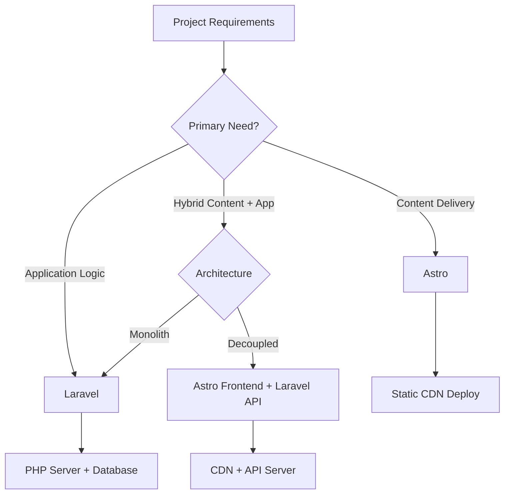

## Table of contents

- [Executive answer](#executive-answer)
- [Architectural foundations](#architectural-foundations)
- [Runtime and deployment models](#runtime-and-deployment-models)
- [Decision matrix by project profile](#decision-matrix-by-project-profile)
- [Workload fit analysis](#workload-fit-analysis)
- [Technology trade-off table](#technology-trade-off-table)
- [Migration considerations](#migration-considerations)
- [Decision checklist](#decision-checklist)
- [Repository activity and ecosystem health](#repository-activity-and-ecosystem-health)
- [Performance and developer experience patterns](#performance-and-developer-experience-patterns)
- [Evidence, assumptions, and limitations](#evidence-assumptions-and-limitations)
- [FAQ](#faq)
- [Sources](#sources)

## Executive answer

Astro and Laravel address entirely different architectural problems. [Astro](https://github.com/withastro/astro) (61,673 GitHub stars, TypeScript, created March 2021) is a content-driven website builder emphasizing zero JavaScript by default, islands architecture for selective hydration, and static site generation. [Laravel](https://github.com/laravel/framework) (34,859 stars, PHP, created January 2013) is a full-stack server-side framework with mature ORM, authentication, queue systems, and real-time broadcasting capabilities designed for dynamic web applications.

Choose Astro when your primary goal is content delivery with minimal client-side JavaScript—marketing sites, documentation, blogs, and portfolios where performance and SEO are critical. Choose Laravel when building data-driven applications requiring complex business logic, user authentication, database transactions, and server-side processing—SaaS platforms, e-commerce systems, and internal tools. Both frameworks can serve hybrid use cases, but their core philosophies reflect fundamentally different optimization targets: Astro optimizes for content delivery and page weight; Laravel optimizes for developer productivity in server-side application logic.

## Architectural foundations

### Astro: Islands and selective hydration

Astro implements an [islands architecture](https://github.com/withastro/astro) where interactive components are isolated regions in otherwise static HTML. Based on repository structure analysis, Astro's build process defaults to zero client-side JavaScript, shipping only HTML and CSS. When you need interactivity, you explicitly opt in using component directives like `client:load` or `client:visible`.

The framework supports multiple UI frameworks simultaneously—React, Vue, Svelte, Solid, Preact, and Alpine.js can coexist in the same project through official integrations listed in the repository directory. This multi-framework capability enables teams to reuse existing components or choose specialized tools per feature.

### Laravel: Server-side monolith with modern tooling

Laravel provides a comprehensive server-side framework built on PHP. The [framework repository](https://github.com/laravel/framework) reveals core capabilities including Eloquent ORM for database abstraction, routing with dependency injection, queuing for background jobs, and event broadcasting for real-time features.

Laravel follows an MVC pattern with convention-driven routing, middleware pipelines, and service container for dependency management. Recent versions integrate Livewire for reactive server-rendered components and Inertia.js for single-page application experiences without building a separate API layer.

> [!NOTE]
> The Laravel repository holds the framework core; application scaffolding comes from the separate [laravel/laravel](https://github.com/laravel/laravel) repository. The framework package has 34,859 stars and 11,948 forks as of August 2026.

## Runtime and deployment models

### Static, hybrid, and server modes

Astro supports three rendering modes:

- **Static (SSG)**: Pre-renders all pages at build time, outputs plain HTML files deployable to any CDN
- **Server (SSR)**: Renders pages on-demand via Node.js adapters for Vercel, Netlify, Cloudflare Workers, and Node standalone
- **Hybrid**: Combines static pre-rendering with on-demand server routes in a single deployment

The repository includes official adapters for `@astrojs/node`, `@astrojs/vercel`, `@astrojs/cloudflare`, and `@astrojs/netlify`, each published as separate npm packages.

### Traditional server infrastructure

Laravel requires a PHP runtime (8.2+ recommended) with a web server like Nginx or Apache. Deployment options include:

- Traditional LAMP/LEMP stacks on VPS or dedicated servers
- Platform-as-a-Service providers (Laravel Forge, Vapor, Heroku, Platform.sh)
- Containerized deployments via Docker
- Serverless PHP via Laravel Vapor (AWS Lambda) or Bref

Laravel Octane enables high-performance serving via Swoole or RoadRunner, keeping the application in memory across requests rather than bootstrapping on every HTTP hit.

## Decision matrix by project profile

| Criterion | Astro | Laravel |
|-----------|-------|----------|
| **Primary use case** | Content sites, marketing, docs | Web applications, SaaS, APIs |
| **Rendering default** | Static HTML generation | Server-side per request |
| **JavaScript approach** | Opt-in, minimal by default | Optional (Vue, React via Inertia) |
| **Database integration** | Manual (via adapters/APIs) | Built-in ORM (Eloquent) |
| **Authentication** | Third-party or custom | Native scaffolding (Breeze, Jetstream) |
| **Learning curve** | Moderate (component model) | Moderate to steep (framework conventions) |
| **Hosting cost** | Very low (static CDN) | Moderate (requires PHP runtime) |
| **Real-time features** | WebSocket client code | Laravel Echo, broadcasting drivers |
| **Typical page weight** | 50–200 KB (mostly HTML/CSS) | Varies (dependent on assets) |
| **Community size** | Growing (since 2021) | Mature (since 2013) |

## Workload fit analysis

### Content-first projects: Documentation, blogs, portfolios

**Astro advantages**: Zero-JavaScript default dramatically reduces page weight. MDX integration enables writing content in Markdown with embedded components. Content collections provide type-safe frontmatter validation. Static builds deploy to any CDN without server costs.

**Laravel trade-offs**: Requires PHP server for every page view. Blade templating is powerful but server-rendered. Adding a static site generator package (Jigsaw, Sculpin) creates tool overlap.

**Verdict**: Astro is the natural choice. Laravel introduces unnecessary complexity for read-heavy content workflows.

### Dynamic web applications: Dashboards, SaaS, CRM

**Laravel advantages**: Eloquent ORM eliminates SQL boilerplate. Authentication scaffolds (Breeze, Jetstream, Fortify) provide registration, password reset, and two-factor flows. Queue system handles async jobs (emails, reports, API calls). Event broadcasting enables real-time notifications.

**Astro trade-offs**: No built-in database layer—you integrate Prisma, Drizzle, or raw SQL manually. Authentication requires custom implementation or third-party services (Auth0, Clerk). Background jobs need separate queue infrastructure.

**Verdict**: Laravel's integrated tooling accelerates application development. Astro would require assembling equivalent pieces yourself.

### Marketing sites with interactive features

**Astro advantages**: Static base keeps marketing pages fast. Islands architecture adds contact forms, carousels, or demos without hydrating the entire page. View transitions API support (via `@astrojs/view-transitions`) enables SPA-like navigation.

**Laravel advantages**: Server-side form handling with validation. Database-backed content management without external CMSs. A/B testing via middleware and session data.

**Verdict**: Hybrid approach—Astro for public pages, Laravel API for form submissions and dynamic data. Or use Astro server mode with API routes for simpler setups.

### E-commerce platforms

**Laravel advantages**: Database transactions ensure order integrity. Payment gateway integrations (Stripe, PayPal) well-documented. Session management handles cart state. Job queues process order confirmations and inventory updates.

**Astro advantages**: Product catalog pages can be statically generated for speed. Client-side cart via islands keeps interactivity lightweight.

**Verdict**: Laravel is better suited for transactional e-commerce. Astro could serve the storefront with Laravel handling checkout as an API backend.

## Technology trade-off table

| Aspect | Astro | Laravel |
|--------|-------|----------|
| **Language ecosystem** | TypeScript/JavaScript, npm | PHP, Composer |
| **Component reuse** | Multi-framework (React, Vue, Svelte) | Blade components, Livewire |
| **State management** | Client-side per island | Server sessions, Eloquent models |
| **Testing tools** | Vitest, Playwright | PHPUnit, Pest, Dusk |
| **Asset pipeline** | Vite (built-in) | Vite via Laravel Mix successor |
| **API development** | Manual routes + endpoints | RESTful resource controllers, API resources |
| **Middleware** | Custom via integrations | Rich middleware ecosystem |
| **Caching layers** | CDN edge caching | Redis, Memcached, database, file |
| **Scaling strategy** | CDN distribution (static) | Horizontal PHP workers, load balancing |
| **Monitoring** | Static site (minimal) | Application performance monitoring (APM) |

## Migration considerations

### Moving from Laravel to Astro

**When it makes sense**: Your Laravel application is primarily content delivery with minimal user interaction. You're spending on PHP hosting for what could be static files.

**Migration path**:
1. Identify truly dynamic routes (user dashboards, forms, checkout)
2. Extract static pages (about, services, blog) into Astro
3. Deploy Astro site to CDN
4. Keep Laravel as API-only service for dynamic features
5. Use `fetch()` in Astro islands to call Laravel endpoints

**Challenges**: Re-implementing Blade templates in Astro components. Moving data fetching from Eloquent to API calls. Handling authentication across separate deployments.

> [!WARNING]
> Do not migrate transactional workflows (checkout, payments, user registration) to Astro's static mode. Use Astro SSR with API calls or keep Laravel for those flows.

### Moving from Astro to Laravel

**When it makes sense**: Your content site needs user accounts, admin panels, or database-driven features that overwhelm Astro's API route capabilities.

**Migration path**:
1. Set up Laravel application scaffold
2. Convert Astro components to Blade templates
3. Move content from Markdown to database tables or keep files using Laravel's filesystem
4. Implement authentication using Laravel Breeze/Jetstream
5. Migrate API routes to Laravel controllers

**Challenges**: Loss of multi-framework component support. Increased hosting costs. Potential performance regression on static pages unless adding caching layers.

### Hybrid architecture strategies

**Option 1: Astro frontend + Laravel API**
- Astro handles all UI and routing
- Laravel serves RESTful or GraphQL API
- Deploy separately, connect via CORS-enabled endpoints
- Best for teams wanting frontend flexibility

**Option 2: Laravel monolith with Astro sub-site**
- Laravel serves application at `app.example.com`
- Astro serves marketing site at `www.example.com` or root
- Separate deployments, shared session domain if needed
- Best for established Laravel apps adding performant marketing

**Option 3: Astro SSR with Laravel backend**
- Astro server mode fetches data from Laravel API at build or request time
- Single deployment artifact (Node.js server)
- Laravel runs separately, Astro proxies API requests
- Best for SSR-first architecture with PHP backend logic

## Decision checklist

Use **Astro** if:
- [ ] Content is primary, user interaction is secondary
- [ ] SEO and page speed are critical success metrics
- [ ] You want minimal JavaScript in production
- [ ] Deployment budget favors CDN over servers
- [ ] Team is comfortable with component-based architecture
- [ ] Multi-framework component reuse is valuable

Use **Laravel** if:
- [ ] Application logic and database operations are core features
- [ ] You need mature authentication and authorization
- [ ] Background job processing is essential
- [ ] Real-time features (chat, notifications) are required
- [ ] Team has PHP expertise or prefers server-side rendering
- [ ] Integrated tooling (ORM, queues, events) accelerates delivery

Consider **both** if:
- [ ] Marketing site and application have separate performance needs
- [ ] Frontend and backend teams prefer different technologies
- [ ] Budget allows separate deployments for content and app
- [ ] You want to optimize each workload independently

> [!TIP]
> Start with the framework that matches your primary workload. Most projects begin as either content or application, not both. Add the second framework only when a clear architectural boundary emerges.

## Repository activity and ecosystem health

As of August 2026, Astro's [repository](https://github.com/withastro/astro) shows active development with the most recent commit on August 10, 2026, and the latest release (`@astrojs/solid-js@7.0.2`) published August 6, 2026. The repository maintains 125 open issues against 61,673 stars. The monorepo structure includes the core framework, integrations for major UI libraries, deployment adapters, and language tooling.

Laravel's [framework repository](https://github.com/laravel/framework) pushed its latest commit August 10, 2026, with release `v13.24.0` published August 4, 2026. It reports 104 open issues against 34,859 stars. The repository focuses on framework internals; application-level features and first-party packages live in separate repositories.

Both projects demonstrate consistent release cadence and active maintenance. Astro's higher star count relative to its age (March 2021) reflects strong interest in modern static site generation, while Laravel's sustained activity over 13 years indicates a mature, stable ecosystem.

## Performance and developer experience patterns

### Build and iteration speed

Astro leverages Vite for hot module replacement during development. Changes to components reflect in the browser within milliseconds. Production builds process only changed files when using incremental static regeneration or server mode.

Laravel development typically uses `php artisan serve` or Laravel Valet for local servers. Recent versions integrate Vite for frontend asset compilation, replacing the older Mix/Webpack toolchain. Hot reload works for Blade templates and Livewire components when configured.

### Type safety approaches

Astro is written in TypeScript and provides type inference for component props, content collections, and API routes. The `@astrojs/check` and `@astrojs/ts-plugin` packages (listed in the repository directory) enable IDE integration and compile-time validation.

Laravel is dynamically typed PHP. Static analysis tools (PHPStan, Psalm, Larastan) can add type checking. Laravel 13.x includes improved type hints and return types across the framework, but the language itself remains optionally typed.

### Testing philosophies

Astro integrations typically include unit tests using Vitest or Node.js test runners. End-to-end testing relies on Playwright or Cypress for validating rendered output and island interactivity.

Laravel ships with PHPUnit integration and includes testing helpers for HTTP requests, database transactions, and queue assertions. Laravel Dusk provides browser automation. The Pest testing framework offers an alternative BDD-style syntax.

## Evidence, assumptions, and limitations

This comparison relies on data retrieved August 10, 2026, from the [Astro](https://github.com/withastro/astro) and [Laravel](https://github.com/laravel/framework) GitHub repositories. Star counts, fork counts, issue counts, and release information reflect repository state at that timestamp. GitHub stars measure community interest, not production usage or market share.

Architectural descriptions of Astro's islands architecture, multi-framework support, and rendering modes are inferred from the repository structure, README content, and the packages directory listing integrations for React, Vue, Svelte, Solid, Preact, Alpine.js, MDX, and deployment adapters. Similarly, Laravel's feature set (Eloquent ORM, routing, queues, broadcasting) is derived from the framework repository's codebase organization and README documentation links.

No synthetic benchmarks or performance measurements are included. Performance claims (Astro's minimal JavaScript, Laravel's server overhead) reflect architectural characteristics, not empirical testing. Migration difficulty assessments are qualitative, based on typical framework patterns rather than measured effort across real projects.

The comparison assumes standard use cases for each framework. Edge cases—such as running Laravel in serverless environments via Vapor, or using Astro's server mode to build dynamic applications—may alter trade-offs. Security posture, ecosystem package quality, and long-term maintenance risks require separate evaluation beyond repository metrics.

## FAQ

### Can Astro replace Laravel for building web applications?

No, not for database-driven applications requiring user authentication, complex business logic, or background job processing. Astro lacks built-in ORM, authentication scaffolds, and queue systems that Laravel provides. Astro excels at content delivery; Laravel excels at application logic. Use Astro for the frontend and Laravel as an API backend if you want both frameworks' strengths.

### Does Laravel support static site generation like Astro?

Laravel does not include static site generation in the core framework. Third-party packages (Jigsaw, Sculpin) can generate static sites from Laravel Blade templates, but they operate separately from Laravel's application features. If static generation is your primary need, Astro is purpose-built for that workflow.

### Can I use React or Vue components in both frameworks?

Yes, but differently. Astro supports React, Vue, Svelte, and other frameworks simultaneously through official integrations, hydrating components selectively as islands. Laravel integrates frontend frameworks via Inertia.js (for SPA-style apps) or as traditional client-side bundles. Laravel Livewire offers server-rendered reactive components without writing JavaScript.

### Which framework is better for SEO?

Astro typically delivers better out-of-the-box SEO for content sites because it generates static HTML with no client-side rendering delay. Laravel's server-side rendering also produces SEO-friendly HTML, but page weight and time-to-interactive may be higher depending on JavaScript usage. Both frameworks support meta tags, sitemaps, and structured data; the difference lies in baseline performance.

### How do hosting costs compare?

Astro's static builds deploy to CDN providers (Netlify, Vercel, Cloudflare Pages) with generous free tiers and low per-request costs. Astro server mode requires Node.js hosting. Laravel requires PHP hosting and a database server, typically costing more than static hosting but less than scaling issues emerge. The cost difference widens as traffic increases for static content, narrows for dynamic applications.

### Can I migrate incrementally from one framework to the other?

Yes, using a hybrid architecture. Deploy Astro for static pages (marketing, docs) and keep Laravel for dynamic features (dashboards, checkout), connecting them via APIs and shared authentication domains. This approach lets you adopt each framework where it fits best without a disruptive full migration.

### Which framework has better TypeScript support?

Astro. The core framework and official integrations are written in TypeScript, with first-class type inference for components, content collections, and API routes. Laravel is PHP-based; TypeScript support applies only to frontend assets compiled via Vite. If end-to-end type safety across backend and frontend is critical, Astro paired with a TypeScript API framework (Express, Fastify, tRPC) offers better integration than Laravel.

## Sources

- [Astro canonical repository](https://github.com/withastro/astro)
- [Astro latest GitHub release](https://github.com/withastro/astro/releases/tag/%40astrojs/solid-js%407.0.2)
- [Laravel canonical repository](https://github.com/laravel/framework)
