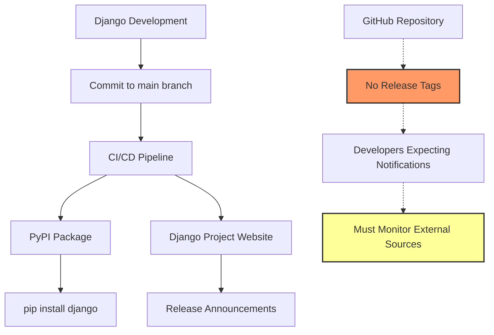

## Table of contents

- [Executive answer](#executive-answer)
- [Repository health and activity](#repository-health-and-activity)
- [The missing release mechanism](#the-missing-release-mechanism)
- [Where Django actually publishes releases](#where-django-actually-publishes-releases)
- [Version identification strategy](#version-identification-strategy)
- [Upgrade risk and planning](#upgrade-risk-and-planning)
- [Test plan for Django upgrades](#test-plan-for-django-upgrades)
- [Rollback plan](#rollback-plan)
- [Decision checklist](#decision-checklist)
- [Questions left unanswered](#questions-left-unanswered)
- [Evidence, assumptions, and limitations](#evidence-assumptions-and-limitations)
- [Sources](#sources)
- [FAQ](#faq)

## Executive answer

The [Django canonical repository](https://github.com/django/django) contains no GitHub release entries as of August 10, 2026, despite showing active development with the most recent push on August 7, 2026. The repository maintains 88,404 stars, 34,128 forks, and 457 open issues, indicating substantial community interest and ongoing maintenance. Django's development team publishes releases through PyPI and the Django Project website rather than using GitHub's formal release mechanism, creating a disconnect between the repository's visibility and standard dependency-management workflows.

This release-publication model affects teams that rely on GitHub's release API, Dependabot alerts, or repository watch notifications for version tracking. Engineers planning Django upgrades must consult PyPI directly or subscribe to Django Project announcements rather than monitoring the GitHub repository for release tags. The last repository push occurred three days before this analysis (August 7, 2026), confirming that the codebase remains under active development even without tagged GitHub releases.

## Repository health and activity

The Django repository demonstrates vigorous activity across multiple dimensions. Created on April 28, 2012, the repository has accumulated significant community engagement over its 14-year history:

| Metric | Value | Interpretation |
|--------|-------|----------------|
| Stars | 88,404 | Substantial developer interest |
| Forks | 34,128 | Active community contribution |
| Watchers | 2,281 | Core follower base monitoring changes |
| Open issues | 457 | Managed backlog |
| Primary language | Python | |
| License | BSD-3-Clause | Permissive open-source license |

The repository's topics—apps, django, framework, models, orm, python, templates, views, web—accurately reflect Django's scope as a full-stack web framework. The repository is not archived, and the default branch remains "main," indicating active maintenance.


> [!NOTE]
> The repository's 88,404 stars represent developer interest signals rather than deployment counts or market-share measurements. Similarly, the 457 open issues reflect the public backlog rather than a defect count.

## The missing release mechanism

GitHub provides a formal release system that allows maintainers to create tagged versions, attach release notes, and distribute compiled artifacts. The Django repository contains no entries in this system. This absence creates specific challenges:

### Impact on dependency tracking

Many dependency-management tools parse GitHub releases to identify available versions. Teams using these tools must configure alternative sources:

- **Dependabot**: Requires explicit PyPI integration
- **Renovate**: Must query PyPI rather than GitHub releases
- **GitHub Actions**: Cannot trigger workflows on Django release events
- **Security scanners**: Miss version metadata unless configured for PyPI

### Communication gaps

Developers who "watch" the repository for releases receive no notifications when Django ships new versions. The repository's 2,281 watchers likely expect release alerts that never arrive through GitHub's native notification system.



## Where Django actually publishes releases

Django's release process centers on two primary channels:

1. **PyPI (Python Package Index)**: The canonical source for versioned Django packages. Developers install Django via `pip install django`, which queries PyPI for available versions.

2. **Django Project website**: The official [djangoproject.com](https://www.djangoproject.com/) publishes release notes, security advisories, and download links.

This dual-channel approach aligns with Python ecosystem conventions, where PyPI serves as the authoritative package registry. However, it diverges from the multi-language GitHub ecosystem, where repositories frequently serve as both code hosts and release distribution points.

> [!TIP]
> To track Django releases effectively, subscribe to the django-announce mailing list or monitor the PyPI RSS feed for the Django package. GitHub repository watching will not generate release notifications.

## Version identification strategy

Without GitHub release tags, teams must adopt alternative strategies to identify Django versions:

### PyPI-based tracking

Query PyPI directly using its JSON API:

```
GET https://pypi.org/pypi/django/json
```

This endpoint returns the latest version and a complete version history. Automated systems can poll this endpoint or subscribe to PyPI's webhook service.

### Source code version markers

Django embeds version information in `django/__init__.py` within the repository. Teams cloning the repository can parse this file to determine the in-development version. However, this version reflects the next release under development rather than the most recent stable release.

### Commit-based tracking

The repository's `pushed_at` timestamp (August 7, 2026) confirms recent activity. Teams concerned about maintenance status can monitor commit frequency rather than release cadence. The three-day gap between the last push and this analysis (August 10, 2026) suggests active development.

## Upgrade risk and planning

Django's release approach affects upgrade planning in specific ways:

| Risk Factor | Impact | Mitigation |
|-------------|--------|------------|
| No GitHub release notes | Cannot review changes via GitHub | Consult djangoproject.com release notes directly |
| No release artifacts | Cannot download versioned source archives from GitHub | Use PyPI sdist or wheel packages |
| No release checksums in GitHub | Cannot verify integrity using GitHub-provided hashes | Use PyPI checksums and GPG signatures |
| No GitHub release API integration | Automation tools cannot trigger on release events | Poll PyPI or subscribe to django-announce |
| Version discovery lag | Third-party sites may show stale version info if they only check GitHub | Verify versions against PyPI before planning upgrades |

> [!WARNING]
> Teams that automated Django version checks against the GitHub Releases API will receive no results. Ensure your tooling queries PyPI or parses the official Django Project website.

## Test plan for Django upgrades

Regardless of where you discover a new Django version, follow this test sequence:

1. **Review official release notes**: Visit djangoproject.com to identify breaking changes, deprecations, and new features.

2. **Check compatibility**: Verify that your Python version and third-party Django apps support the target Django version.

3. **Isolate the upgrade**: Create a dedicated branch and test environment.

4. **Run existing tests**: Execute your full test suite against the new version before making code changes.

5. **Address deprecation warnings**: Enable `PYTHONWARNINGS='default'` to surface Django deprecation warnings, then resolve them.

6. **Test critical paths**: Manually verify authentication, form submission, database queries, and any custom middleware.

7. **Performance baseline**: Measure response times for representative endpoints to detect performance regressions.

8. **Security review**: Check for removed security settings or changed defaults that might weaken your security posture.

## Rollback plan

If the upgrade introduces issues in production:

1. **Pin the previous version**: Your `requirements.txt` or `pyproject.toml` should specify exact versions (e.g., `Django==4.2.5`) rather than ranges.

2. **Redeploy the previous application package**: If you build container images or deployment packages, revert to the last known-good artifact.

3. **Database migrations**: Django migrations are generally forward-compatible, but if you ran migrations during the upgrade, you may need to restore a database backup if those migrations are not reversible.

4. **Cache invalidation**: Clear application caches to remove any version-specific cached data.

5. **Monitor error rates**: Track exception rates and response times for 24 hours after rollback to confirm stability.

## Decision checklist

Use this checklist to evaluate whether your Django monitoring and upgrade processes account for the framework's release model:

- [ ] Dependency-management tools query PyPI rather than GitHub Releases
- [ ] CI/CD pipelines do not depend on GitHub release webhooks for Django
- [ ] Team members subscribe to django-announce mailing list
- [ ] Security scanning tools check PyPI metadata or official Django security advisories
- [ ] Documentation references djangoproject.com for version-specific information
- [ ] Upgrade procedures include reviewing official release notes before installation
- [ ] Requirements files pin exact Django versions rather than using loose constraints
- [ ] Rollback procedures include database migration reversal steps

## Questions left unanswered

Several aspects of Django's release process remain unclear from repository analysis alone:

1. **Release cadence**: The repository provides no direct evidence of Django's release schedule. Consult the Django Project roadmap for planned release dates.

2. **Long-term support (LTS) versions**: GitHub repository data does not distinguish LTS releases from feature releases. The Django Project website maintains this information.

3. **Security patch process**: While the repository shows active development, the timeline for security patches and how they are communicated is not evident from repository metadata.

4. **Beta and release candidate availability**: Pre-release versions may be published to PyPI with specific version suffixes, but this is not visible in the GitHub repository structure.

5. **Backport policy**: Which bug fixes and features are backported to older versions cannot be determined from repository inspection alone.

## Evidence, assumptions, and limitations

This analysis is based on GitHub repository metadata retrieved on August 10, 2026. The following limitations apply:

- **No release object found**: The GitHub API returned no release entries for the django/django repository. This analysis cannot describe release contents, breaking changes, or upgrade impacts for a specific version.

- **Inferred release process**: The conclusion that Django publishes via PyPI and the Django Project website is inferred from common Python ecosystem practices and the repository README, which references djangoproject.com documentation.

- **Commit activity vs. release activity**: Recent push activity (August 7, 2026) confirms ongoing development but does not indicate whether a release is imminent or recent.

- **Open issue count**: The 457 open issues represent the public backlog visible on GitHub and should not be interpreted as a defect count or stability indicator.

- **Stars as interest signal**: The 88,404 stars reflect developer interest and repository visibility rather than production usage, deployment counts, or market share.

## Sources

- [Django canonical repository](https://github.com/django/django)

## FAQ

### Why doesn't Django use GitHub Releases?

Django predates GitHub's release feature and follows Python ecosystem conventions where PyPI serves as the canonical package registry. The Django development team publishes releases to PyPI and announces them through the Django Project website and mailing lists. This approach aligns with Python's packaging infrastructure, where `pip` queries PyPI rather than GitHub.

### How do I find the latest Django version?

Check PyPI directly at https://pypi.org/project/django/ or run `pip index versions django` from the command line. The Django Project website at https://www.djangoproject.com/ also lists current versions and release notes. GitHub repository tags may exist for version tracking but are not exposed through the Releases interface.

### Will Dependabot alert me to new Django versions?

Yes, Dependabot monitors PyPI for Python packages, so you will receive alerts for new Django versions even though the GitHub repository has no release entries. Ensure your repository includes a `requirements.txt`, `Pipfile`, or `pyproject.toml` file that Dependabot can parse.

### Is the Django repository still maintained?

Yes, the repository shows active maintenance with the most recent push on August 7, 2026—three days before this analysis. The repository is not archived, maintains an active issue backlog, and receives regular commits. The absence of GitHub releases does not indicate abandonment.

### What risks does this release model create?

The primary risk is monitoring gaps. Teams that rely exclusively on GitHub for dependency tracking may miss Django releases or security patches. Tools configured to trigger on GitHub release events will not activate for Django updates. Mitigation requires explicitly configuring PyPI as the version source in all tooling.

### How do I automate Django version checks?

Use the PyPI JSON API (https://pypi.org/pypi/django/json) to query available versions programmatically. Many dependency-management tools, including pip-audit, safety, and Renovate, support PyPI as a native source. Alternatively, subscribe to the django-announce mailing list or monitor the Django Project RSS feed for release announcements.

### Where are Django's security advisories published?

Django publishes security advisories through the Django Project website at https://www.djangoproject.com/weblog/. The National Vulnerability Database (NVD) also catalogs Django CVEs. GitHub's security advisory database may include Django vulnerabilities, but the authoritative source is the Django Project. Subscribe to the django-announce mailing list to receive security notifications.
