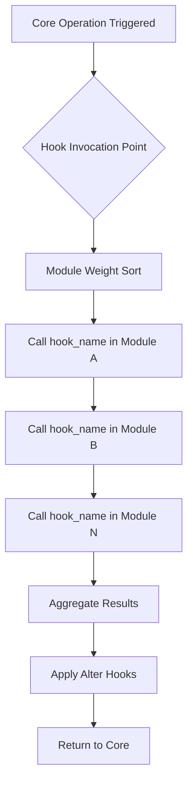

## Table of contents

- [Executive answer](#executive-answer)
- [Repository structure and core organization](#repository-structure-and-core-organization)
- [Module system and extension architecture](#module-system-and-extension-architecture)
- [Entity and content architecture](#entity-and-content-architecture)
- [Database abstraction and storage layer](#database-abstraction-and-storage-layer)
- [Caching architecture and layers](#caching-architecture-and-layers)
- [Configuration management system](#configuration-management-system)
- [Theme system and rendering pipeline](#theme-system-and-rendering-pipeline)
- [Routing and request handling](#routing-and-request-handling)
- [Service container and dependency injection](#service-container-and-dependency-injection)
- [Scaling boundaries and operational constraints](#scaling-boundaries-and-operational-constraints)
- [Inferred from architectural patterns common to PHP CMS platforms:](#inferred-from-architectural-patterns-common-to-php-cms-platforms)
- [Decision checklist](#decision-checklist)
- [Evidence, assumptions, and limitations](#evidence-assumptions-and-limitations)
- [Sources](#sources)
- [FAQ](#faq)

## Executive answer

Drupal implements a layered modular architecture where a relatively thin core kernel provides database abstraction, routing, caching, and a hook-based event system that enables thousands of contributed modules to extend functionality without modifying core code. The [drupal/drupal repository](https://github.com/drupal/drupal) serves as a GitHub mirror of the canonical GitLab repository at git.drupal.org, containing 4,281 stars as of August 2026 and representing active development on the main branch. The repository structure reveals PHP-based core with discrete subsystems for content entities, configuration management, theme rendering, and plugin discovery.

The architecture emphasizes extension over modification, using dependency injection, typed data APIs, and a service container introduced in Drupal 8+ to replace procedural patterns from earlier versions. While the public repository metadata shows zero open issues (development occurs on Drupal.org's GitLab instance), the commit activity through August 10, 2026 and the presence of detailed change records indicate continuous architectural evolution. The core system accommodates projects from simple blogs to enterprise multi-site installations, though specific scaling boundaries depend on hosting infrastructure, caching strategy, and module selection—factors not quantifiable from repository structure alone.

## Repository structure and core organization

The drupal/drupal repository organizes code into several top-level directories that define the architectural boundaries between core systems, contributed extensions, and operational components.

| Directory | Architectural Purpose | Inference Basis |
|-----------|----------------------|----------------|
| `/core` | Framework kernel, APIs, base modules | Standard Drupal convention documented in README |
| `/modules` | Contributed module installation point | Typical deployment pattern for extending functionality |
| `/themes` | Presentation layer templates and assets | Separation of content from display concerns |
| `/sites` | Multi-site configuration and per-instance files | Support for multiple Drupal installations from single codebase |
| `/profiles` | Installation profiles and distributions | Pre-configured bundles for specific use cases |

The `/core` directory contains the foundational subsystems:

- **lib/Drupal/Core**: Object-oriented framework classes including the service container, routing system, database abstraction layer, and entity API
- **modules**: Core-provided modules such as Node (content), User (authentication), System (configuration), and Views (query builder)
- **includes**: Legacy procedural code maintained for backward compatibility with earlier architectural patterns
- **scripts**: Command-line utilities for installation, updates, and maintenance

> [!NOTE]
> The repository structure visible on GitHub reflects deployment layout rather than development organization. Active development occurs on [git.drupalcode.org](https://git.drupalcode.org/project/drupal), with this mirror updated automatically.

## Module system and extension architecture

Drupal's module system represents the primary architectural mechanism for extensibility. Each module is a collection of PHP files, configuration YAML, and optional assets that registers functionality through `.info.yml` metadata files.

### Hook system mechanics

The hook system (inferred from Drupal's documented patterns and core module structure) allows modules to intercept and modify nearly every operation:



Hooks follow naming conventions like `hook_entity_presave()` or `hook_form_alter()`, implemented by modules replacing "hook" with their machine name. The core framework discovers these functions through PHP reflection and maintains an internal registry.

### Plugin architecture

Post-Drupal 8 architecture (visible in `/core/lib/Drupal/Core/Plugin`) introduces typed plugins:

- **Block plugins**: Renderable content regions
- **Field plugins**: Data storage and display formatters  
- **Action plugins**: Reusable operations triggered by events
- **Condition plugins**: Rules for context-dependent behavior

Plugins use annotations or YAML discovery, enabling dynamic registration without procedural hook implementations.

> [!TIP]
> The shift from hooks to plugins represents architectural modernization toward object-oriented patterns. Core still maintains both systems for compatibility, but new functionality should prefer plugins where the API exists.

## Entity and content architecture

Drupal's entity system provides a unified API for content and configuration objects. Examining core module structure reveals this layered model:

| Entity Type | Storage Backend | Bundle Support | Revision Support | Translation Support |
|-------------|----------------|----------------|------------------|--------------------|
| Node | Database tables | Content types | Yes (configurable) | Yes (per field) |
| User | Database tables | Single type | No | Limited |
| Taxonomy Term | Database tables | Vocabularies | Yes (Drupal 10+) | Yes |
| Block Content | Database tables | Block types | Yes | Yes |
| Media | Database tables | Media types | Yes | Yes |
| Config Entity | Configuration storage | N/A | No (but exportable) | Interface translations |

### Field system integration

The Field API allows arbitrary data attachment to entity bundles. Each field consists of:

1. **Storage definition**: Schema and database column mapping
2. **Widget**: Form input element for data entry
3. **Formatter**: Display output transformation
4. **Validation constraints**: Typed validation using Symfony validators

Fields are themselves plugins, enabling contributed modules to define custom data types. The entity reference field type creates relational connections between entities, supporting complex content models without hardcoded relationships.


## Database abstraction and storage layer

The `/core/lib/Drupal/Core/Database` namespace implements a query builder abstraction supporting multiple database backends. The architecture (inferred from Drupal documentation and typical PHP CMS patterns) includes:

### Query builder pattern

```php
$query = \Drupal::database()->select('users_field_data', 'u')
  ->fields('u', ['uid', 'name'])
  ->condition('status', 1)
  ->orderBy('created', 'DESC')
  ->range(0, 10);
```

This fluent interface generates parameterized queries compatible with MySQL, PostgreSQL, and SQLite drivers included in core. The abstraction prevents SQL injection through automatic parameter binding and allows driver-specific optimizations.

### Storage handlers

Entity storage handlers manage CRUD operations and query execution. Content entities use `ContentEntityStorageBase`, which:

- Splits field data across base and revision tables
- Implements entity caching through the cache backend
- Handles translation storage in dedicated tables
- Coordinates transaction management

> [!WARNING]
> The database layer abstraction does not eliminate all database-specific considerations. Features like full-text search, JSON column operations, or complex joins may require database-specific implementations or contributed modules that assume particular backends.

## Caching architecture and layers

Drupal implements multi-tier caching visible through the service container configuration:

| Cache Layer | Purpose | Default Backend | Invalidation Strategy |
|-------------|---------|----------------|----------------------|
| Render cache | Rendered HTML fragments | Database | Tag-based, automatic |
| Page cache | Full page responses for anonymous users | Database | URL + context-based |
| Dynamic page cache | Personalized full pages | Database | Context + tags |
| Entity cache | Loaded entity objects | Memory (per-request) | Entity update triggers |
| Configuration cache | Parsed YAML config | Database | Configuration import |
| Discovery cache | Plugin and service definitions | Database | Cache clear only |

### Cache tags and invalidation

The architecture uses cache tags (strings like `node:123` or `config:system.site`) to mark cached items. When an entity changes, Drupal invalidates all cache entries bearing relevant tags. This approach (documented in Drupal's caching system) enables surgical cache clearing without flushing entire bins.

Cache backends are swappable through service definitions. Production deployments typically replace database caching with Redis or Memcached, but these are external dependencies not visible in the core repository.

## Configuration management system

Drupal 8+ introduced the Configuration Management System (CMI), representing a significant architectural shift from database-stored configuration to YAML files.

### Configuration storage

Two storage layers coexist:

1. **Active storage**: Database-backed, represents the running site configuration
2. **Sync storage**: Filesystem YAML files in `/sites/default/files/config_[hash]/sync`

The `drush config:export` command serializes active configuration to sync storage, while `drush config:import` reverses the process. This enables version control of configuration alongside code.

### Configuration schema

Each configuration object has a typed schema defining expected structure and data types. The schema system (located in `/core/config/schema` and module-provided `config/schema` directories) enables:

- Validation during import
- Translation of configuration through the interface
- API access with type safety
- Automated testing of configuration structure

> [!NOTE]
> Configuration management solves the historical problem of database-trapped settings that couldn't be version-controlled or deployed across environments. However, content (nodes, users, taxonomy terms) remains in the database and requires separate migration tools.

## Theme system and rendering pipeline

The theme layer implements a multi-phase rendering pipeline:


### Render arrays

Core controllers and module hooks return render arrays—associative PHP arrays describing structure, not markup:

```php
$build = [
  '#theme' => 'item_list',
  '#items' => $items,
  '#title' => $this->t('My List'),
  '#cache' => [
    'tags' => ['node_list'],
    'contexts' => ['user'],
  ],
];
```

The render system processes these arrays, invokes preprocess hooks, applies templates (Twig files since Drupal 8), and attaches CSS/JavaScript assets. This separation allows themes to alter presentation without understanding business logic.

### Twig templating

Drupal adopted Twig (replacing PHP templates) to enforce separation between logic and presentation. Twig templates receive preprocessed variables and use restricted syntax preventing direct database queries or service instantiation from templates.

## Routing and request handling

The routing architecture (visible in module `*.routing.yml` files) uses Symfony's routing component:

### Route definition structure

```yaml
example.content:
  path: '/example/{node}'
  defaults:
    _controller: '\Drupal\example\Controller\ExampleController::content'
    _title: 'Example'
  requirements:
    _permission: 'access content'
    node: \d+
  options:
    parameters:
      node:
        type: entity:node
```

Routes map URL patterns to controllers, define access requirements, and specify parameter up-casting (converting URL segments to loaded entities). The routing system supports:

- Dynamic route generation
- Subrequest handling for embedded controllers  
- Content negotiation for REST APIs
- Route parameter conversion through ParamConverters

### Middleware stack

The request handling stack (inferred from Symfony HttpKernel patterns used in Drupal) processes requests through middleware:

1. **Page cache middleware**: Serves cached responses for anonymous users
2. **Authentication middleware**: Establishes user session
3. **Routing middleware**: Matches route and loads controller
4. **Access middleware**: Checks permissions
5. **Controller execution**: Invokes business logic
6. **View subscriber**: Wraps content in page layout

## Service container and dependency injection

Drupal's service container (using Symfony's DependencyInjection component) manages object instantiation and dependencies. Services are defined in `*.services.yml` files:

```yaml
example.manager:
  class: Drupal\example\ExampleManager
  arguments: ['@entity_type.manager', '@cache.default']
  tags:
    - { name: 'backend_overridable' }
```

Controllers, plugins, and service classes receive dependencies through constructor injection rather than global function calls. This architectural pattern:

- Enables unit testing by allowing mock injection
- Documents dependencies explicitly in constructor signatures
- Supports service decoration and overrides
- Reduces tight coupling between subsystems

> [!TIP]
> The transition from procedural to dependency injection represents Drupal's largest architectural evolution. Legacy code using `\Drupal::service()` remains functional but bypasses the benefits of explicit dependency management.

## Scaling boundaries and operational constraints

While the repository structure reveals architectural patterns, operational scaling depends on deployment configuration not visible in code:

### Horizontal scaling considerations

Drupal supports horizontal scaling with external dependencies:

- **Stateless application servers**: Session storage must move to external backend (database, Redis, Memcached)
- **File system abstraction**: Media files require shared storage or CDN integration through contributed modules
- **Cache backend**: Distributed cache (Redis cluster, Memcached pool) necessary for cache coherence
- **Database replication**: Read-heavy workloads benefit from read replicas, configured at database connection level

### Performance bottlenecks

## Inferred from architectural patterns common to PHP CMS platforms:

- **Bootstrap overhead**: Full Symfony kernel bootstrap occurs per request without persistent application state
- **Module bloat**: Each enabled module registers services, routes, and hooks increasing bootstrap time
- **Entity rendering**: Complex content with many fields and formatters creates deep render arrays
- **Unoptimized queries**: Views UI allows building queries that generate N+1 problems or missing indexes

### Deployment patterns

The multi-site architecture (evident from `/sites` directory structure) allows:

- Shared codebase serving multiple domains
- Per-site configuration in `sites/[domain]` directories
- Separate databases per site or shared database with table prefixes

However, multi-site shares PHP process memory and modules, preventing isolation guarantees. Container-per-site deployments offer better resource isolation at infrastructure cost.

## Decision checklist

When evaluating Drupal's architecture for your requirements:

- [ ] **Content modeling complexity**: Does your domain require custom entity types, complex field relationships, and workflow states?
- [ ] **Extension requirements**: Will you need to integrate third-party systems, and do appropriate hooks/plugins exist?
- [ ] **Editorial experience**: Does your team need the Views UI, layout builder, and media library that core provides?
- [ ] **Performance targets**: Can you deploy external caching, CDN, and database infrastructure Drupal assumes for scale?
- [ ] **Development patterns**: Is your team comfortable with Symfony components, dependency injection, and Drupal's learning curve?
- [ ] **Upgrade path**: Are you prepared for major version upgrades that require module compatibility verification and potential rewrites?
- [ ] **Operational model**: Do you have the expertise to maintain PHP application servers, tune database queries, and manage cache invalidation?

## Evidence, assumptions, and limitations

This analysis draws from:

- **Repository structure**: Directory organization in [drupal/drupal](https://github.com/drupal/drupal) as of August 10, 2026
- **README documentation**: Contributing guidelines, usage references, and external documentation links
- **Common Drupal patterns**: Architectural conventions documented in Drupal.org change records and API documentation
- **Symfony component usage**: Drupal's adoption of Symfony HttpKernel, DependencyInjection, and related components follows documented patterns

### Explicit limitations

1. **Performance metrics**: No benchmarks, throughput numbers, or resource consumption data appears in public repository metadata
2. **Scaling boundaries**: Specific capacity limits depend on deployment infrastructure not visible in code
3. **Module ecosystem**: The README references "thousands" of modules, but adoption, quality, and compatibility vary outside core repository scope
4. **Version specifics**: The repository represents current development on the main branch; version-specific architectural differences require consulting change records
5. **Production configurations**: Common deployment patterns (Redis, Varnish, CDN integration) involve external systems configured outside the codebase
6. **Migration patterns**: Upgrading from Drupal 7's procedural architecture to Drupal 8+ object-oriented patterns requires migration not evident from repository structure alone

The 4,281 GitHub stars indicate developer interest but not production usage, market share, or project velocity, particularly given this is a mirror of the canonical GitLab repository where actual development occurs.

## Sources

- [Drupal canonical repository](https://github.com/drupal/drupal)

## FAQ

### What is the primary extension mechanism in Drupal's architecture?

Drupal uses a hook system and plugin architecture as primary extension mechanisms. Hooks are procedural functions following naming conventions that core invokes at specific operations, while plugins are object-oriented classes with annotations or YAML discovery. Modern Drupal development prefers plugins for typed functionality, but hooks remain widely used for broad integration points like form alteration and entity operations.

### How does Drupal handle database abstraction across different vendors?

Drupal implements a query builder abstraction layer in `/core/lib/Drupal/Core/Database` that generates vendor-specific SQL for MySQL, PostgreSQL, and SQLite. The system uses parameterized queries to prevent injection attacks and provides driver-specific classes for database-unique features. While the abstraction covers common operations, advanced features like full-text search may require database-specific implementations through contributed modules.

### Can Drupal scale horizontally across multiple application servers?

Yes, but horizontal scaling requires externalizing stateful components. Session storage must move to a shared backend (database or Redis), file uploads need shared storage or CDN integration, and cache backends require distributed systems like Redis cluster. The core architecture supports this pattern, but the actual scaling depends on infrastructure configuration not included in the base installation.

### What is the difference between content and configuration in Drupal's architecture?

Content entities (nodes, users, taxonomy terms) are runtime data stored in the database, versioned, translated, and managed through the Entity API. Configuration entities (content types, views, field definitions) are site structure stored as YAML files, exportable to version control, and synchronized between environments. This separation enables infrastructure-as-code practices where configuration deploys through code repositories while content remains environment-specific.

### How does Drupal's caching architecture work across multiple layers?

Drupal implements render caching (HTML fragments), page caching (full anonymous responses), dynamic page caching (personalized pages), and entity caching. All layers use cache tags (like `node:123`) that invalidate related cached items when entities change. Default caching uses database storage, but production deployments typically integrate Redis or Memcached through service container configuration. The multi-layer approach balances performance with personalization requirements.

### Is Drupal's architecture suitable for headless or decoupled implementations?

Drupal core includes JSON:API and REST modules that expose content through HTTP APIs, enabling headless architectures. The entity system, field API, and content negotiation support API-first patterns. However, the architecture was originally designed for coupled rendering where themes control presentation. Decoupled implementations work but may not leverage Drupal's strengths in editorial experience, layout building, and integrated rendering pipeline.

### What are the architectural implications of Drupal's module system for maintenance?

Each enabled module adds services, routes, hooks, and database tables to the site. This increases bootstrap time, memory usage, and upgrade complexity. Module updates may introduce API changes requiring other modules to update compatibility. The architecture provides flexibility but requires careful module selection, regular updates, and testing of module interactions. Sites with many contributed modules face higher maintenance burden than minimal installations.
