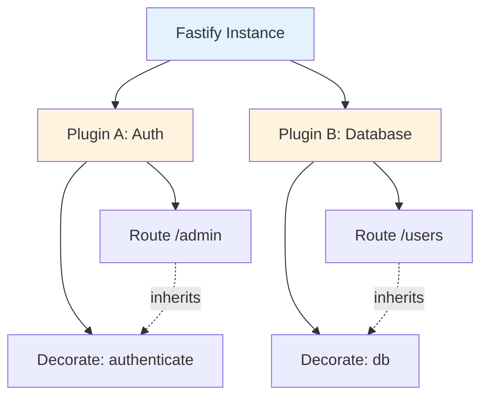

## Table of contents

- [Executive answer](#executive-answer)
- [Repository purpose and design philosophy](#repository-purpose-and-design-philosophy)
- [Maintenance and repository health signals](#maintenance-and-repository-health-signals)
- [Plugin ecosystem and extensibility model](#plugin-ecosystem-and-extensibility-model)
- [Benchmark claims and performance context](#benchmark-claims-and-performance-context)
- [Intended users and use cases](#intended-users-and-use-cases)
- [Evidence-backed strengths](#evidence-backed-strengths)
- [Known limitations and adoption friction](#known-limitations-and-adoption-friction)
- [Decision checklist](#decision-checklist)
- [Responsible adoption path](#responsible-adoption-path)
- [Governance and sustainability](#governance-and-sustainability)
- [Community engagement signals](#community-engagement-signals)
- [Evidence, assumptions, and limitations](#evidence-assumptions-and-limitations)
- [Comparison table: Fastify vs. alternative frameworks](#comparison-table-fastify-vs-alternative-frameworks)
- [FAQ](#faq)
- [Sources](#sources)

## Executive answer

[Fastify](https://github.com/fastify/fastify) is an MIT-licensed Node.js web framework emphasizing low overhead, developer experience, and extensibility through a plugin-based architecture. Created in September 2016, the repository exhibits strong maintenance signals: the default branch (`main`) was pushed to on August 10, 2026, the latest release (v5.11.3) shipped August 8, 2026, and 36,994 stars reflect sustained community interest as of August 10, 2026. The framework positions itself as a high-performance alternative to Express and Hapi, with internal benchmarks indicating ~77,000 requests/second for synthetic workloads on controlled hardware—though real-world performance depends on application complexity and infrastructure.

The repository serves backend engineers building latency-sensitive APIs, microservices, or event-driven architectures on Node.js. Fastify's distinguishing features include JSON Schema–based request validation and response serialization (compiled to optimized functions), built-in [Pino](https://github.com/pinojs/pino) logging integration, and an encapsulation model that isolates plugin state. The framework targets teams already invested in Node.js who require measurable throughput improvements, strict type safety via TypeScript definitions, or modular composition without monolithic dependencies. Adopters should expect a steeper learning curve than Express due to plugin encapsulation rules and lifecycle hooks, and should verify compatibility within their existing toolchain.

## Repository purpose and design philosophy

Fastify addresses three engineering concerns: request-handling efficiency, predictable application structure, and safe extensibility. The README explicitly frames performance as a consequence of efficient resource utilization—higher throughput per server instance translates to lower infrastructure costs and improved responsiveness under load.

### Core architectural choices

The framework's design reflects several explicit trade-offs:

- **Schema-first validation:** Fastify recommends (but does not mandate) JSON Schema for input validation and output serialization. Schemas are compiled at startup into optimized validation functions, amortizing parsing overhead across the application lifecycle.
- **Plugin-based composition:** All framework features—from authentication to database connectors—are delivered as plugins that register during the server bootstrap phase. Plugins inherit or create isolated scopes through Fastify's encapsulation system.
- **Lifecycle hooks:** Fastify exposes request/response hooks (e.g., `onRequest`, `preHandler`, `onSend`) that permit crosscutting concerns like logging, authentication, and error handling without middleware chains.
- **Built-in logging:** The framework ships with Pino integration, a structured logger optimized for minimal serialization cost.

> [!NOTE]
> The architectural conclusions above are inferred from the repository README, documentation structure visible in the repository file tree, and the explicit feature list. Fastify's emphasis on schema compilation and hook-based extensibility distinguishes it from middleware-centric frameworks like Express.

## Maintenance and repository health signals

As of the data retrieval date (August 10, 2026), multiple indicators suggest active maintenance:

| Metric | Value | Interpretation |
|--------|-------|----------------|
| **Last push to `main`** | August 10, 2026, 09:27:54 UTC | Daily-level activity |
| **Latest release** | v5.11.3, August 8, 2026 | Regular patch cadence |
| **Open issues** | 130 | Accumulation indicator, not defect count |
| **Forks** | 2,974 | Downstream experimentation signal |
| **Watchers** | 369 | Active monitoring by developers |
| **Stars** | 36,994 | Community interest, not usage proxy |

### Release and versioning behavior

The repository currently tracks **version 5.x** on the `main` branch. The [latest release notes](https://github.com/fastify/fastify/releases/tag/v5.11.3) document bug fixes and documentation improvements:

- Trailer state management fixes
- Decorator property recognition improvements
- Content-type parser RegExp handling
- Documentation clarifications on route parameters and error handling

The 130 open issues represent a backlog of feature requests, questions, and potential bugs—not a measure of critical defects. The project maintains a [CII Best Practices badge](https://www.bestpractices.dev/en/projects/7585/passing), indicating adherence to security and quality standards.

> [!TIP]
> Version 3 and earlier are end-of-life and receive no security patches. HeroDevs offers commercial support for unsupported versions. Review the [Long Term Support documentation](https://fastify.dev/docs/latest/Reference/LTS/) for the current support matrix before adopting older releases.


## Plugin ecosystem and extensibility model

Fastify's functionality is intentionally minimal in core; most capabilities arrive via plugins. The README distinguishes between **core plugins** (maintained by the Fastify team) and **community plugins** (third-party contributions).

### Plugin architecture

Plugins register using the `fastify.register()` API. Each plugin receives its own encapsulated context, inheriting decorators and configuration from parent scopes but isolating state mutations:



This encapsulation model prevents global state pollution but requires deliberate context management. Developers accustomed to Express middleware may encounter learning friction.

### Ecosystem maturity

The README links to [ecosystem documentation](./docs/Guides/Ecosystem.md) enumerating core and community plugins. Representative categories include:

- **Authentication:** `@fastify/jwt`, `@fastify/oauth2`, `@fastify/passport`
- **Data validation:** `@fastify/env`, `fluent-json-schema`
- **Database connectors:** `@fastify/postgres`, `@fastify/mongodb`
- **Templating:** `@fastify/view` (supports Handlebars, EJS, Pug)
- **Static file serving:** `@fastify/static`

The [Fastify organization on GitHub](https://github.com/fastify) hosts 100+ repositories, reflecting broad ecosystem investment.

## Benchmark claims and performance context

The README presents synthetic benchmark results comparing Fastify to Express, Hapi, Koa, and Restify:

| Framework | Requests/sec |
|-----------|-------------:|
| Express 4.17.3 | 14,200 |
| Hapi 20.2.1 | 42,284 |
| Restify 8.6.1 | 50,363 |
| Koa 2.13.0 | 54,272 |
| **Fastify 4.0.0** | **77,193** |
| Node.js `http.Server` | 74,513 |

**Test conditions:** Intel Core i7 4GHz, 64GB RAM, autocannon load generator (100 connections, 40-second duration, 10 pipelined requests).

> [!WARNING]
> These are "hello world" benchmarks measuring framework overhead on controlled hardware. Production performance depends on application logic, database latency, network topology, and concurrent load patterns. Always benchmark your specific workload before making architectural decisions based on synthetic results.

## Intended users and use cases

Fastify targets several engineering profiles:

1. **Backend teams building RESTful APIs** requiring predictable throughput and structured validation.
2. **Microservices architects** seeking lightweight, composable frameworks with clear encapsulation boundaries.
3. **Platform engineers** optimizing infrastructure costs through higher per-instance throughput.
4. **TypeScript adopters** needing first-class type definitions and schema-driven type generation.
5. **Teams migrating from Express or Hapi** who prioritize performance without rewriting business logic.

The framework is **not optimized for**:

- Server-side rendering workloads requiring frequent template composition (consider Next.js or Remix).
- WebSocket-heavy applications (though `@fastify/websocket` exists).
- Teams without Node.js expertise or existing runtime constraints.

## Evidence-backed strengths

Based on repository structure, documentation, and community signals:

### Structured validation and serialization

JSON Schema compilation reduces runtime validation cost. The [Validation and Serialization documentation](./docs/Reference/Validation-and-Serialization.md) demonstrates schema attachment to routes:

```javascript
fastify.post('/user', {
  schema: {
    body: {
      type: 'object',
      properties: {
        email: { type: 'string', format: 'email' },
        age: { type: 'integer', minimum: 18 }
      },
      required: ['email']
    },
    response: {
      200: {
        type: 'object',
        properties: {
          id: { type: 'string' },
          email: { type: 'string' }
        }
      }
    }
  }
}, async (request, reply) => {
  // request.body is validated and typed
})
```

### Comprehensive documentation

The repository includes 20+ documentation files covering server setup, routing, lifecycle hooks, testing, and deployment. The presence of a [Testing guide](./docs/Guides/Testing.md) and [Benchmarking guide](./docs/Guides/Benchmarking.md) indicates maturity.

### Active governance

Fastify is an [OpenJS Foundation At-Large Project](https://openjsf.org/projects), providing neutral governance. The README lists five lead maintainers and a 20-member core team, reducing single-maintainer risk.

### TypeScript support

The repository ships TypeScript definitions. The [TypeScript documentation](./docs/Reference/TypeScript.md) addresses type inference from schemas, plugin typing, and decorator augmentation.

## Known limitations and adoption friction

### Encapsulation learning curve

Fastify's plugin encapsulation model differs fundamentally from Express middleware. Decorators and hooks scoped incorrectly can cause "decorator not found" errors. The [Encapsulation documentation](./docs/Reference/Encapsulation.md) is essential reading but represents upfront investment.

### Middleware compatibility

Express middleware cannot be directly registered; teams must use `@fastify/express` or rewrite middleware as Fastify plugins. The [Middleware documentation](./docs/Reference/Middleware.md) outlines the adapter approach.

### Benchmark representativeness

The 77,193 req/sec figure applies to a trivial "hello world" handler. Real applications with database queries, template rendering, or third-party API calls will see different throughput characteristics. The README acknowledges this: "You should __always__ benchmark if performance matters to you."

### Ecosystem fragmentation

While the core plugin set is well-maintained, community plugins vary in quality and update frequency. Teams should audit dependencies for maintenance signals before adoption.

## Decision checklist

Use this checklist to evaluate Fastify for your project:

- [ ] **Runtime constraint:** Is Node.js 16+ (inferred from v5 release timing) acceptable?
- [ ] **Performance requirement:** Have you identified latency or throughput bottlenecks that justify framework optimization?
- [ ] **Team expertise:** Does the team have Node.js and async/await proficiency?
- [ ] **Schema availability:** Can you define JSON Schemas for API contracts, or are you willing to adopt schema-first design?
- [ ] **Plugin needs:** Do core or community plugins cover your authentication, database, and observability requirements?
- [ ] **Migration cost:** If replacing Express, have you budgeted for middleware adaptation and testing?
- [ ] **TypeScript usage:** Do you need compile-time type safety, or is runtime validation sufficient?
- [ ] **Support model:** Is community-driven support via Discord and GitHub acceptable, or do you require commercial SLAs?
- [ ] **Dependency audit:** Have you reviewed the dependency tree for security advisories and maintenance status?
- [ ] **Benchmark validation:** Have you run representative load tests on your infrastructure?

## Responsible adoption path

### Phase 1: Prototype and validate (1–2 weeks)

1. Initialize a test project using `npm init fastify` and implement a representative endpoint (authentication + database query + validation).
2. Integrate required plugins (`@fastify/jwt`, `@fastify/postgres`, etc.) and verify compatibility.
3. Run load tests using [autocannon](https://github.com/mcollina/autocannon) or your existing tooling, comparing baseline (Express/current framework) vs. Fastify.
4. Evaluate developer experience: schema authoring, plugin registration, error messages.

### Phase 2: Incremental migration (4–8 weeks)

1. Identify low-risk, performance-critical endpoints for conversion.
2. Deploy Fastify service behind existing load balancer, routing subset of traffic.
3. Monitor error rates, latency percentiles (p50, p95, p99), and resource utilization.
4. Iterate on schema definitions and plugin configuration based on production feedback.

### Phase 3: Expand and standardize (ongoing)

1. Document internal patterns: plugin registration order, decorator naming, error handling.
2. Contribute improvements to community plugins or open internal plugins.
3. Establish monitoring for dependency updates and security advisories.

> [!TIP]
> The [official demo repository](https://github.com/fastify/demo) provides working examples of authentication, database integration, and testing. Clone and experiment locally before committing to architectural changes.

## Governance and sustainability

Fastify operates under the OpenJS Foundation, providing:

- **Neutral governance:** No single corporate sponsor controls the project direction.
- **Trademark protection:** The Fastify name and logo are foundation assets.
- **Security disclosure process:** The repository includes a [SECURITY.md](https://github.com/fastify/fastify/blob/main/SECURITY.md) with responsible disclosure guidelines.

### Sponsorship and funding

The project accepts financial contributions via [Open Collective](https://opencollective.com/fastify). Sponsors listed in the README include NearForm and Platformatic, both of which employ core maintainers. This dual-funding model (corporate sponsorship + open collective) suggests financial sustainability.

### Long-term support

The README explicitly states that v3 and earlier are end-of-life with no security patches. [HeroDevs](https://www.herodevs.com/support/fastify-nes) offers commercial extended support for unsupported versions, providing an exit strategy for teams unable to upgrade immediately.

## Community engagement signals

Beyond GitHub metrics, the project maintains:

- **Discord server:** Listed in README with invite link.
- **Live examples repository:** [fastify/example](https://github.com/fastify/example) demonstrates real-world integration patterns.
- **Hacktoberfest participation:** Repository topics include `hacktoberfest`, indicating openness to new contributors.

The [CONTRIBUTING.md](./CONTRIBUTING.md) document (referenced in README) outlines pull request guidelines and code style expectations, lowering barriers to contribution.

## Evidence, assumptions, and limitations

This profile is constructed from:

1. **Primary source:** The [Fastify canonical repository](https://github.com/fastify/fastify) README, file structure, and [latest release notes](https://github.com/fastify/fastify/releases/tag/v5.11.3).
2. **Metrics timestamp:** Repository data retrieved August 10, 2026, 11:57:11 UTC.
3. **Inferred architecture:** Plugin encapsulation, hook lifecycle, and schema compilation are described in the README; internal implementation details are not verified.

### Assumptions

- Benchmark hardware specifications (Intel i7, 64GB RAM) are representative of the project's test environment but not independently verified.
- Community plugin quality varies; the profile assumes teams will audit dependencies individually.
- TypeScript support claims are based on documentation references, not hands-on type-checking validation.

### Limitations

- No production usage data (e.g., download counts, enterprise adoption) is included—GitHub stars measure interest, not deployment scale.
- Security advisory history is not analyzed; teams should review [npm advisories](https://www.npmjs.com/advisories) independently.
- Compatibility with Node.js 16+ is inferred from v5 release timing but not explicitly stated in the README.

## Comparison table: Fastify vs. alternative frameworks

| Dimension | Fastify | Express | Hapi |
|-----------|---------|---------|------|
| **Validation** | JSON Schema, compiled | Manual or middleware | Joi, runtime |
| **Plugin model** | Encapsulated scopes | Global middleware | Plugin system |
| **Logging** | Pino built-in | Manual integration | Good built-in |
| **TypeScript** | First-class definitions | Community types | First-class definitions |
| **Benchmark (synthetic)** | 77k req/s | 14k req/s | 42k req/s |
| **Learning curve** | Moderate-high | Low | Moderate |
| **Ecosystem size** | 100+ plugins | 5,000+ middleware | 100+ plugins |
| **License** | MIT | MIT | BSD-3-Clause |

## FAQ

### What is the Fastify repository's primary purpose?

The Fastify repository hosts a Node.js web framework optimized for low overhead, developer experience, and extensibility. It targets teams building high-throughput APIs, microservices, or latency-sensitive applications who require schema-based validation and a plugin-driven architecture.

### How does Fastify's performance compare to Express in production?

The repository's synthetic benchmarks show Fastify serving ~77,000 requests/second compared to Express's ~14,200 under controlled conditions. Real-world performance depends on application logic, I/O patterns, and infrastructure. Teams should run representative load tests with their specific workload—database queries, authentication, third-party API calls—before expecting similar improvements.

### Is the Fastify repository actively maintained?

Yes. As of August 10, 2026, the `main` branch received a push within 24 hours, the latest release (v5.11.3) shipped August 8, 2026, and the project maintains a 20-member core team under OpenJS Foundation governance. The 130 open issues represent a backlog of requests and discussions, not critical defects.

### Can I use Express middleware with Fastify?

Not directly. Express middleware relies on a different request/response signature. The `@fastify/express` plugin provides a compatibility layer, but teams should expect to rewrite or adapt middleware as Fastify plugins for optimal integration. The [Middleware documentation](./docs/Reference/Middleware.md) details the adapter approach and limitations.

### What are the main risks of adopting Fastify?

Key risks include: (1) steeper learning curve due to plugin encapsulation and lifecycle hooks, (2) middleware incompatibility requiring adaptation work, (3) ecosystem fragmentation—community plugins vary in maintenance quality, (4) benchmark results may not reflect your application's performance profile. Mitigate by running proof-of-concept projects, auditing plugin dependencies, and load-testing with production-like workloads.

### Does Fastify require TypeScript?

No. Fastify is written in JavaScript and supports both CommonJS and ESM. However, the repository ships first-class TypeScript definitions, and schema-first design pairs well with type generation. Teams can adopt Fastify with vanilla JavaScript and add TypeScript incrementally.

### Where should I go for Fastify support?

The project maintains a [fastify/help](https://github.com/fastify/help) repository for prior issues and questions, a [Discord server](https://discord.com/invite/D3FZYPy) for real-time discussion, and comprehensive [documentation](https://www.fastify.dev). Commercial support for end-of-life versions is available through HeroDevs.

## Sources

- [Fastify canonical repository](https://github.com/fastify/fastify)
- [Fastify latest GitHub release](https://github.com/fastify/fastify/releases/tag/v5.11.3)
