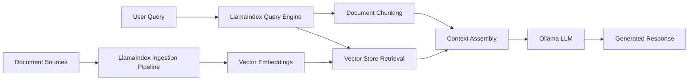

## Table of contents

- [Executive answer](#executive-answer)
- [Architecture and scope](#architecture-and-scope)
- [Integration patterns](#integration-patterns)
- [Decision matrix](#decision-matrix)
- [Workload fit analysis](#workload-fit-analysis)
- [Project profile recommendations](#project-profile-recommendations)
- [Migration considerations](#migration-considerations)
- [Action checklist](#action-checklist)
- [Evidence, assumptions, and limitations](#evidence-assumptions-and-limitations)
- [FAQ](#faq)
- [Sources](#sources)

## Executive answer

LlamaIndex and Ollama occupy different layers of the local LLM application stack and are frequently used together rather than chosen between. Ollama is a model runtime that downloads, manages, and serves open-source LLMs locally via a REST API—think Docker for language models. LlamaIndex is an application framework that connects data sources, orchestrates retrieval pipelines, manages document ingestion, and builds agentic workflows on top of any LLM provider, including Ollama.

For teams building document-centric applications with retrieval-augmented generation (RAG), entity extraction, or multi-step agent workflows, LlamaIndex provides the data connectors, indexing structures, and query engines you need. Ollama serves as the local inference backend, eliminating cloud API dependencies and enabling fully self-hosted deployments. The two technologies integrate seamlessly: LlamaIndex's `llama-index-llms-ollama` package treats Ollama as just another LLM provider, while Ollama handles model lifecycle and inference optimizations. Choose LlamaIndex when your application centers on data ingestion and retrieval logic; choose Ollama when you need local model hosting; combine both when you want a fully self-contained AI application stack.

## Architecture and scope

### LlamaIndex: data framework for LLM applications

LlamaIndex ([run-llama/llama_index](https://github.com/run-llama/llama_index)) is a Python-based data orchestration framework for building LLM-powered applications. Created in November 2022, the project has grown to 51,528 GitHub stars and 7,904 forks as of August 2026. The framework provides:

- **Data connectors** for 300+ integrations including PDFs, APIs, databases, and cloud storage
- **Indexing structures** (vector stores, graph indices, keyword tables) for efficient retrieval
- **Query engines** that combine retrieval with LLM synthesis
- **Agent frameworks** for multi-step reasoning and tool use
- **LlamaParse** platform for document parsing, extraction, and agentic OCR

The codebase separates `llama-index-core` from modular integration packages, allowing developers to install only the components they need. LlamaIndex does not run models itself—it orchestrates data flow between your documents and any LLM API (OpenAI, Anthropic, Cohere, Ollama, or locally-hosted models).

### Ollama: local model runtime

Ollama ([ollama/ollama](https://github.com/ollama/ollama)) is a Go-based model runtime for running open-source LLMs on local hardware. Launched in June 2023, it has accumulated 178,191 stars and 17,332 forks. Ollama provides:

- **Model distribution** via a library of pre-quantized models (Llama, Mistral, Gemma, Qwen, and 100+ others)
- **Lifecycle management** with simple `ollama pull`, `run`, and `serve` commands
- **REST API** compatible with OpenAI's chat completion format
- **Hardware acceleration** using llama.cpp backends for CPU, CUDA, ROCm, and Metal
- **Modelfile format** for creating custom model variants

Ollama focuses exclusively on model serving and does not include data connectors, vector stores, or orchestration logic. It runs as a local daemon (default port 11434) and exposes endpoints for chat, embeddings, and model management.

> [!NOTE]
> LlamaIndex's README explicitly demonstrates Ollama integration in the "Example Usage" section, showing how to configure `Settings.llm = Ollama(model="llama-3.1:latest")` for non-OpenAI workflows.

## Integration patterns

### Using Ollama as LlamaIndex's LLM backend

LlamaIndex treats Ollama as one of many LLM providers through the `llama-index-llms-ollama` integration package:

```python
from llama_index.core import Settings, VectorStoreIndex, SimpleDirectoryReader
from llama_index.llms.ollama import Ollama
from llama_index.embeddings.huggingface import HuggingFaceEmbedding

Settings.llm = Ollama(model="llama-3.1:latest", request_timeout=360.0)
Settings.embed_model = HuggingFaceEmbedding(model_name="BAAI/bge-small-en-v1.5")

documents = SimpleDirectoryReader("./data").load_data()
index = VectorStoreIndex.from_documents(documents)
query_engine = index.as_query_engine()
```

This pattern keeps all document processing, chunking, embedding generation, and retrieval logic in LlamaIndex while delegating text generation to Ollama's local models. The integration supports streaming responses, custom system prompts, and temperature control.

### Standalone Ollama usage

Ollama can operate independently for applications that don't require sophisticated data pipelines:

```bash
ollama run gemma4
# Interactive chat session

curl http://localhost:11434/api/chat -d '{
  "model": "gemma4",
  "messages": [{"role": "user", "content": "Explain async/await"}]
}'
```

This approach suits chat interfaces, code editors with completion features, or simple question-answering bots where retrieval from external documents is unnecessary.

### Complementary deployment

Most production architectures combine both:



LlamaIndex handles the "data" half (ingestion, indexing, retrieval), while Ollama handles the "model" half (inference, generation). This separation allows you to upgrade models without rewriting data pipelines or swap embedding models without changing your Ollama configuration.

## Decision matrix

| Criterion | LlamaIndex | Ollama | Notes |
|-----------|------------|--------|-------|
| **Primary function** | Data orchestration & RAG framework | Local model runtime | Complementary roles |
| **Language** | Python | Go (with Python/JS clients) | LlamaIndex is Python-only; Ollama has multi-language SDKs |
| **Data connectors** | 300+ built-in (PDF, SQL, APIs, etc.) | None | Ollama requires external tools for document processing |
| **Model hosting** | None (uses external APIs) | Local, self-hosted | LlamaIndex delegates inference to providers |
| **Vector database** | Integrates with 20+ (Pinecone, Weaviate, Chroma) | Not applicable | Ollama has no storage layer |
| **Agent capabilities** | Workflows, ReAct, function calling | Not applicable | Ollama provides raw model access only |
| **Embedding generation** | Via integrations (HuggingFace, Cohere, Ollama) | Built-in embeddings API | Ollama supports embedding models like nomic-embed-text |
| **Deployment complexity** | Moderate (pip install + dependencies) | Low (single binary) | Ollama installs as system service |
| **Resource usage** | Minimal (orchestration logic) | High (model inference VRAM/RAM) | LlamaIndex overhead is negligible vs. model serving |
| **License** | MIT | MIT | Both are permissive open source |
| **GitHub stars (Aug 2026)** | 51,528 | 178,191 | Interest signals, not usage metrics |
| **Latest release** | v0.14.23 (June 2026) | v0.32.7 (August 2026) | Both actively maintained |


## Workload fit analysis

### When LlamaIndex is essential

**Document-heavy RAG applications**  
If your application needs to answer questions over private documents, research papers, or knowledge bases, LlamaIndex's ingestion pipelines and retrieval engines are purpose-built for this. The framework handles PDF parsing (via LlamaParse), semantic chunking, metadata filtering, and hybrid search out of the box.

**Multi-source data integration**  
Applications that combine data from databases, APIs, file systems, and cloud storage benefit from LlamaIndex's connector ecosystem. You can ingest from Notion, Google Drive, Slack, SQL databases, and 290+ other sources without writing custom parsers.

**Agentic workflows**  
For multi-step reasoning tasks—like "research this topic, generate a summary, then create a presentation"—LlamaIndex's agent framework (via Workflows and function calling) provides the orchestration layer. Ollama alone cannot manage tool use or conditional branching.

**Custom indexing strategies**  
When you need specialized retrieval (graph-based search, hierarchical summarization, auto-retrieval with metadata filters), LlamaIndex's pluggable index types and query transformations are difficult to replicate with raw Ollama calls.

### When Ollama is essential

**Local-first or air-gapped deployments**  
Ollama eliminates external API dependencies entirely. For healthcare, legal, or defense applications where data cannot leave the premises, Ollama provides fully self-contained model serving with hardware acceleration.

**Cost-sensitive workloads**  
API-based inference (OpenAI, Anthropic) charges per token. For high-volume applications—customer support bots, continuous document monitoring—Ollama's one-time hardware cost can reduce operational expenses by orders of magnitude.

**Low-latency inference**  
Local models eliminate network round-trip time. Chat interfaces, code completion tools, and real-time agents benefit from sub-100ms response times that are unachievable with cloud APIs.

**Model experimentation**  
Ollama's library includes 100+ open models across architectures (Llama, Mistral, Phi, Gemma). Developers can benchmark model quality, test quantization strategies (Q4, Q5, Q8), and iterate without API rate limits.

### When both are necessary

**Enterprise RAG systems**  
Combine LlamaIndex's data pipelines with Ollama's local models for fully self-hosted retrieval-augmented generation. Ingest documents via LlamaIndex connectors, store embeddings in Qdrant or Chroma, and serve answers using Ollama models—all within your infrastructure.

**Hybrid architectures**  
Use Ollama for development and testing (free, fast iteration) while pointing LlamaIndex at cloud APIs (GPT-4, Claude) for production. The abstraction layer makes swapping LLM providers a configuration change rather than a code rewrite.

**Privacy-conscious applications**  
Process sensitive documents locally with LlamaIndex + Ollama, but delegate non-sensitive tasks (translation, summarization of public content) to cloud models for better quality.

### When neither is necessary

**Simple API-only chat**  
If you're building a straightforward chatbot with no document retrieval and no local hosting requirement, direct OpenAI/Anthropic API calls (or frameworks like LangChain with fewer dependencies) may suffice.

**Streaming media analysis**  
For video/audio transcription or real-time computer vision, specialized tools (Whisper, YOLO) are more appropriate. Neither LlamaIndex nor Ollama focuses on multimodal stream processing.

## Project profile recommendations

### Profile 1: Early-stage startup (limited budget, cloud-first)

**Recommendation:** LlamaIndex + OpenAI API  
**Rationale:** Start with LlamaIndex's high-level API and OpenAI's GPT-4 for best-in-class quality. Avoid infrastructure overhead while validating product-market fit. Add Ollama later if API costs grow unsustainable or customer contracts require local hosting.

**Migration path:** When ready, install Ollama, change `Settings.llm` to `Ollama(model="llama-3.1:70b")`, and benchmark quality. No data pipeline changes required.

> [!TIP]
> LlamaIndex's `llama-index` starter package bundles core + common integrations for rapid prototyping. Switch to `llama-index-core` + selective integrations as your stack matures.

### Profile 2: Regulated industry (healthcare, finance, legal)

**Recommendation:** LlamaIndex + Ollama + on-premises vector database  
**Rationale:** Data residency requirements prohibit cloud APIs. Ollama provides compliant model serving; LlamaIndex handles HIPAA/GDPR-sensitive document processing without external dependencies. Deploy Qdrant or Weaviate locally for vector storage.

**Infrastructure:** 2x NVIDIA A100 GPUs (one for embeddings, one for generation) or Apple Silicon Mac Studio for smaller workloads. Run Ollama models with 4-bit quantization to fit 70B parameter models in 48GB VRAM.

### Profile 3: AI research lab (model evaluation, benchmarking)

**Recommendation:** Ollama standalone + custom evaluation scripts  
**Rationale:** Research workflows focus on comparing model architectures, not building production applications. Ollama's model library and Modelfile customization support rapid iteration. LlamaIndex adds unnecessary abstraction when you're testing raw model capabilities.

**Workflow:** Use Ollama's REST API for programmatic benchmarking across 20+ models. Add LlamaIndex only when evaluating RAG-specific retrieval quality.

### Profile 4: Enterprise knowledge management

**Recommendation:** LlamaIndex + Ollama + hybrid cloud fallback  
**Rationale:** Process internal documents (contracts, wikis, tickets) with local Ollama models for cost and privacy. Use LlamaIndex's metadata filtering to enforce access controls. Reserve cloud APIs (GPT-4) for complex queries that exceed local model capabilities.

**Architecture:** Run Ollama on dedicated GPU servers; deploy LlamaIndex ingestion pipelines as Kubernetes cron jobs; store embeddings in Pinecone or pgvector (PostgreSQL). Implement fallback logic: attempt Ollama first, escalate to OpenAI if confidence scores are low.

## Migration considerations

### From cloud APIs to Ollama

If your LlamaIndex application currently uses OpenAI or Anthropic, migrating to Ollama requires:

1. **Install Ollama** and pull models: `ollama pull llama-3.1:70b`
2. **Install integration:** `pip install llama-index-llms-ollama`
3. **Update configuration:**
   ```python
   from llama_index.llms.ollama import Ollama
   Settings.llm = Ollama(model="llama-3.1:70b", base_url="http://localhost:11434")
   ```
4. **Benchmark quality** against existing outputs—open models may require prompt tuning
5. **Monitor resource usage**—70B models need 48GB+ VRAM; consider quantized versions

No changes to data connectors, indexing logic, or query engines are necessary. LlamaIndex's abstraction layer isolates LLM provider details.

### From standalone Ollama to LlamaIndex + Ollama

If you've built a custom application using Ollama's REST API directly, adopting LlamaIndex adds:

- **Document ingestion:** Replace manual PDF parsing with `SimpleDirectoryReader` or LlamaParse
- **Retrieval logic:** Replace keyword search with vector similarity via `VectorStoreIndex`
- **Agent capabilities:** Replace hardcoded if/else with `ReActAgent` for tool use

Your Ollama deployment remains unchanged—LlamaIndex becomes the orchestration layer above it.

### Hardware considerations

Ollama's model requirements directly impact deployment feasibility:

| Model size | Quantization | Minimum VRAM | Example GPU |
|------------|--------------|--------------|-------------|
| 7B | Q4 | 4GB | GTX 1080, M1 Max |
| 13B | Q4 | 8GB | RTX 3070, M2 Max |
| 34B | Q5 | 24GB | RTX 3090, M2 Ultra |
| 70B | Q4 | 48GB | A100 (40GB) + offloading |

LlamaIndex's resource footprint is negligible by comparison—Python overhead for orchestration logic adds <500MB RAM.

> [!WARNING]
> Ollama's llama.cpp backend supports CPU inference, but expect 10-50x slower generation speeds compared to GPU. For production workloads, GPU acceleration is essential.

## Action checklist

Before committing to either technology:

- [ ] **Define your inference requirements:** Do regulations or cost structures mandate local hosting? If yes, Ollama is non-negotiable.
- [ ] **Inventory data sources:** If you need to ingest from 3+ systems (databases, cloud storage, SaaS tools), LlamaIndex's connectors save weeks of integration work.
- [ ] **Benchmark open model quality:** Pull Llama-3.1-70B or Mistral-Large via Ollama and test against your domain-specific tasks. Quality may not match GPT-4 for complex reasoning.
- [ ] **Estimate infrastructure costs:** GPU server rentals ($2-5/hr for A100) vs. OpenAI API ($60/million tokens for GPT-4). Ollama becomes cost-effective above ~10M tokens/month.
- [ ] **Test integration code:** Install both tools, run LlamaIndex's Ollama example from the README, and verify end-to-end functionality before architectural commitments.
- [ ] **Plan for observability:** Both projects integrate with LangSmith, OpenLIT, and Langfuse for production monitoring.

## Evidence, assumptions, and limitations

**Data freshness:** Repository metrics and release versions reflect data retrieved August 10, 2026. GitHub star counts are interest signals, not usage or market-share measurements. Open issue counts (603 for LlamaIndex, 3,656 for Ollama) are not defect counts—they include feature requests, questions, and duplicate reports.

**Architectural inferences:** The "complementary roles" framing is inferred from LlamaIndex's README, which explicitly demonstrates Ollama integration and does not position the tools as alternatives. The claim that "most production architectures combine both" is based on the integration pattern documented in official examples but lacks quantitative adoption data.

**Benchmark limitations:** No first-party performance benchmarks exist comparing LlamaIndex+Ollama vs. cloud API latency, throughput, or cost-per-query. The migration complexity assessment ("configuration change rather than code rewrite") assumes your application already uses LlamaIndex's abstraction layer rather than provider-specific SDKs.

**License verification:** Both projects are MIT-licensed per GitHub repository metadata. Users should verify license compatibility with dependencies (e.g., llama.cpp, HuggingFace models) for their specific deployments.

**Hardware requirements:** VRAM estimates for Ollama models are derived from llama.cpp documentation and community testing. Actual memory usage varies with context length, batch size, and quantization methods.

## FAQ

### Can I use LlamaIndex without Ollama?

Yes. LlamaIndex supports 20+ LLM providers including OpenAI, Anthropic, Cohere, Azure OpenAI, HuggingFace, and Replicate. Ollama is one option among many. Choose your provider based on deployment constraints (local vs. cloud), cost, and model quality requirements.

### Can I use Ollama without LlamaIndex?

Yes. Ollama provides REST and gRPC APIs that any programming language can consume directly. Use Python's `ollama` package, JavaScript's `ollama` npm package, or raw HTTP requests. Add LlamaIndex only when you need document ingestion, vector search, or agent orchestration.

### Does Ollama support fine-tuning or training?

No. Ollama serves pre-trained models from its library. For fine-tuning, use frameworks like Axolotl, LLaMA-Factory, or torchtune to create adapters, then import them into Ollama via Modelfiles. LlamaIndex also does not handle training—it orchestrates inference workflows only.

### How do I choose between local embeddings and Ollama's embedding API?

LlamaIndex's HuggingFace integration (`HuggingFaceEmbedding`) runs embedding models locally via transformers. Ollama's embedding endpoint (`/api/embeddings`) delegates to models like `nomic-embed-text`. For consistency with your LLM backend, use Ollama embeddings. For broader model selection (SBERT, E5, Instructor), use HuggingFace. Both support batch processing and caching.

### What's the performance difference between Ollama and cloud APIs?

Latency depends on network proximity and hardware. Ollama on a local GPU typically returns first tokens in 50-200ms; cloud APIs add 100-500ms network latency. Throughput (tokens/second) favors cloud for small models (GPT-3.5 generates faster than local 7B models) but reverses for large models (local A100 with 70B model outperforms cloud rate limits). LlamaIndex's abstraction layer adds <10ms overhead regardless of provider.

### How do LlamaIndex's agents compare to LangChain's?

LlamaIndex's agent framework emphasizes data retrieval and document workflows via its query engine abstraction. LangChain offers broader tool integrations (APIs, databases, calculators) and more agent architectures (Plan-and-Execute, Self-Ask). For RAG-centric agents, LlamaIndex provides tighter integration with its indexing layer. For general-purpose tool use, LangChain has a larger ecosystem. Both support Ollama as an LLM backend.

### Can I run Ollama in Docker alongside LlamaIndex?

Yes. The official `ollama/ollama` Docker image runs as a daemon; LlamaIndex connects via `base_url="http://ollama-container:11434"`. Use Docker Compose to orchestrate both services. Ensure GPU pass-through (`--gpus all`) for Ollama containers to access CUDA devices. LlamaIndex containers require minimal resources since they only run orchestration logic.

## Sources

- [LlamaIndex canonical repository](https://github.com/run-llama/llama_index)
- [LlamaIndex latest GitHub release](https://github.com/run-llama/llama_index/releases/tag/v0.14.23)
- [Ollama canonical repository](https://github.com/ollama/ollama)
