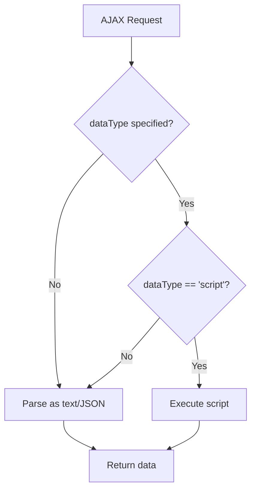

## Table of contents

- [Executive answer](#executive-answer)
- [What changed in core architecture](#what-changed-in-core-architecture)
- [Browser support matrix](#browser-support-matrix)
- [Removed and deprecated APIs](#removed-and-deprecated-apis)
- [Security and CSP improvements](#security-and-csp-improvements)
- [CSS and dimension changes](#css-and-dimension-changes)
- [Selector engine changes](#selector-engine-changes)
- [Slim build changes](#slim-build-changes)
- [Custom build workflows](#custom-build-workflows)
- [Migration checklist](#migration-checklist)
- [Rollback plan](#rollback-plan)
- [Test plan](#test-plan)
- [Upgrade risk assessment](#upgrade-risk-assessment)
- [Decision checklist](#decision-checklist)
- [Evidence, assumptions, and limitations](#evidence-assumptions-and-limitations)
- [Unanswered questions](#unanswered-questions)
- [Sources](#sources)
- [FAQ](#faq)

## Executive answer

jQuery 4.0.0, released January 17, 2026, eliminates support for Internet Explorer versions below 11, iOS Safari below 11, Firefox below 65, Android Browser, and PhantomJS. The codebase has migrated from AMD to ES modules, exposing named exports alongside the traditional global `$` and `jQuery`. The release removes multiple deprecated APIs including `jQuery.trim`, AJAX event aliases, and the `toggleClass(boolean|undefined)` signature. New features include basic TrustedHTML support for Content Security Policy compliance, improved CSS custom property handling, and script execution controls that prevent automatic execution unless explicitly requested via `dataType`.

This is not a drop-in replacement. Teams must audit dependencies, test scripts that rely on removed APIs, verify AJAX workflows that previously auto-executed JSON responses as JSONP, and confirm that CSS manipulation code accounts for the removal of automatic "px" suffixing for most numeric properties. The 3.x branch now receives only critical security updates, creating pressure to migrate or secure commercial support from vendors like HeroDevs.

## What changed in core architecture

The [jQuery 4.0.0 release](https://github.com/jquery/jquery/releases/tag/4.0.0) replaces AMD with ECMAScript modules across the entire `src/` directory. Developers importing jQuery via bundlers like Webpack, Rollup, or Vite can now use named imports:

```javascript
import { ajax, each } from 'jquery';
```

The library continues to attach `$` and `jQuery` to the global `window` by default, but the new `exports/global` module can be excluded in custom builds to prevent global pollution. The factory mode now exposes a function accepting `window` as a parameter, enabling jQuery to run in environments without a global `window` object, such as Web Workers with polyfilled DOM APIs.

The [commit d0ce00cd](https://github.com/jquery/jquery/commit/d0ce00cdfa680f1f0c38460bc51ea14079ae8b07) details the migration path. Source files that previously wrapped content in `define()` calls now use `import` and `export` statements. This change reduces the runtime overhead of module resolution and aligns jQuery with modern JavaScript tooling expectations.

> [!NOTE]
> The ESM transition does not break usage via `<script>` tags for projects that load jQuery from a CDN. The pre-built `jquery.js` and `jquery.min.js` files remain IIFE-wrapped scripts that auto-attach to `window`.

## Browser support matrix

| Browser | Minimum Version | Status |
|---------|----------------|--------|
| Chrome | 73+ | Supported |
| Firefox | 65+ | Supported |
| Safari | 12.1+ | Supported |
| iOS Safari | 11+ | Supported |
| Edge | Chromium only | Supported |
| Edge Legacy | Any | **Dropped** |
| IE | 11 | Partial (deprecated) |
| IE | <11 | **Dropped** |
| Android Browser | Any | **Dropped** |
| PhantomJS | Any | **Dropped** |

The decision to [drop IE <11 and other legacy platforms](https://github.com/jquery/jquery/commit/cf84696fd1d7fe314a11492606529b5a658ee9e3) removes approximately 15% of the codebase dedicated to polyfills and workarounds. Functions like `jQuery.ajaxSettings.xhr` no longer branch for `ActiveXObject` instantiation. CSS measurement code eliminates branches for `getComputedStyle` quirks in IE9.


> [!WARNING]
> Edge Legacy (non-Chromium Edge, versions 12–18) is explicitly unsupported. Organizations that standardized on Edge Legacy must either upgrade to Chromium Edge or remain on jQuery 3.x.

## Removed and deprecated APIs

### Immediate removals

The following APIs, deprecated in prior 3.x releases, no longer exist in 4.0.0:

- **`jQuery.trim`**: Use native `String.prototype.trim()` instead.
- **`jQuery.type`**: Replace with `typeof` or `instanceof` checks.
- **`jQuery.isArray`**: Use `Array.isArray()`.
- **`jQuery.parseJSON`**: Use `JSON.parse()`.
- **`jQuery.proxy`**: Use arrow functions or `Function.prototype.bind()`.
- **`jQuery.uniqueSort`** (and its alias `jQuery.unique`): No direct replacement; re-implement sorting logic if needed.
- **AJAX event aliases**: Methods like `.ajaxStart()`, `.ajaxStop()`, `.ajaxSend()` are removed. Bind to `$(document)` with `.on()` instead:
  ```javascript
  $(document).on('ajaxStart', handler);
  ```

### Behavioral changes

The `toggleClass(boolean|undefined)` signature is [removed](https://github.com/jquery/jquery/commit/a4421101fd6d9d7b0550210f8e8690641733dd9a). Code that called `$(el).toggleClass(shouldAdd)` must migrate to:

```javascript
if (shouldAdd) {
  $(el).addClass('foo');
} else {
  $(el).removeClass('foo');
}
```

The `jQuery.fn.init` root parameter [no longer exists](https://github.com/jquery/jquery/commit/d2436df36a4b2ef556907e734a90771f0dbdbcaf). Custom code that instantiated jQuery with a non-default root will break.

### AJAX auto-promotion removal

Previously, AJAX requests with `dataType: "json"` that detected a JSONP callback pattern in the URL would auto-promote to JSONP. This logic is [removed](https://github.com/jquery/jquery/commit/e7b3bc488d01d584262e12a7c5c25f935d0d034b). Explicit JSONP requests must set `dataType: "jsonp"`.

## Security and CSP improvements

The [TrustedHTML support commit](https://github.com/jquery/jquery/commit/de5398a6ad088dc006b46c6a870a2a053f4cd663) introduces opt-in integration with the Trusted Types API. When a Content Security Policy requires Trusted Types, jQuery's DOM manipulation methods (`.html()`, `.append()`, etc.) can accept `TrustedHTML` objects directly. This eliminates the need for wrapper functions that manually call `policy.createHTML()`.

For AJAX script transport, jQuery 4.0.0 [avoids CSP violations](https://github.com/jquery/jquery/commit/07a8e4a177550025c1a08d7ac754839733943f55) when `unsafe-inline` is disallowed by no longer injecting inline scripts for async requests. The change applies only to cross-domain script requests; same-domain script injection behavior remains unchanged.

Another security-focused change: jQuery [no longer auto-executes](https://github.com/jquery/jquery/commit/025da4dd343e6734f3d3c1b4785b1548498115d8) script responses unless `dataType: "script"` is explicitly provided. Previously, any response with a `text/javascript` content-type header would execute automatically. Code that relied on implicit script execution must add `dataType` to the request options.



> [!TIP]
> Audit all `$.ajax()`, `$.get()`, and `$.post()` calls that retrieve JavaScript. Add `dataType: "script"` explicitly if execution is intended.

## CSS and dimension changes

The automatic "px" suffix [no longer applies](https://github.com/jquery/jquery/commit/00a9c2e5f4c855382435cec6b3908eb9bd5a53b7) to most CSS properties when passing numeric values to `.css()`. Only a small subset of properties (width, height, top, left, right, bottom, margin, padding) still receive automatic "px" appending. Properties like `z-index`, `font-weight`, and `opacity` now require explicit units or will be passed as unitless numbers.

Before:
```javascript
$(el).css('z-index', 10); // Worked in 3.x
```

After:
```javascript
$(el).css('z-index', '10'); // Must stringify in 4.0
```

CSS custom property handling [trims whitespace](https://github.com/jquery/jquery/commit/efadfe991a5c287af561a9326bf1427d726c91c1) surrounding values and [returns `undefined`](https://github.com/jquery/jquery/commit/7eb0019640a5856c42b451551eb7f995d913eba9) for whitespace-only values. This aligns jQuery behavior with the computed style API.

Dimension methods like `.outerHeight(true)` and `.outerWidth(true)` now [include negative margins](https://github.com/jquery/jquery/commit/bce13b72c1753e16cc0db53ebf0f0456bdcf6b48) in the calculation. This matches the spec but may surprise code that relied on the previous behavior.

## Selector engine changes

While jQuery 4.0.0 retains the full Sizzle-derived selector engine by default, the custom build system allows excluding it in favor of a lightweight `querySelectorAll` wrapper. The [selector-native.js](https://github.com/jquery/jquery/blob/main/src/selector-native.js) fallback does not support jQuery-specific extensions like `:has()`, `:contains()`, or `:visible`.

Two new methods, `.even()` and `.odd()`, [replace the deprecated](https://github.com/jquery/jquery/commit/78420d427cf3734d9264405fcbe08b76be182a95) `:even` and `:odd` positional selectors:

```javascript
// Old
$('li:even').addClass('stripe');

// New
$('li').even().addClass('stripe');
```

## Slim build changes

The jQuery Slim build, which excludes AJAX and effects, now also [excludes the `callbacks` and `deferred` modules](https://github.com/jquery/jquery/commit/fbc44f52fe76e1b601da76a1d7f8ef27884c06da). This reflects that effects depend on `Deferred` for animation queuing, so removing effects makes `Deferred` unnecessary in most slim use cases.

However, `.show()`, `.hide()`, and `.toggle()` (without animation parameters) [remain in the slim build](https://github.com/jquery/jquery/commit/297d18dd13f7b810ea5a4afeefa4cb15d9e16e16). These methods manipulate the `display` property directly without effects or `Deferred` machinery.

| Module | Full Build | Slim Build |
|--------|------------|------------|
| Core | ✓ | ✓ |
| Selector | ✓ | ✓ |
| Manipulation | ✓ | ✓ |
| CSS (basic) | ✓ | ✓ |
| show/hide/toggle | ✓ | ✓ |
| AJAX | ✓ | ✗ |
| Effects | ✓ | ✗ |
| Deferred | ✓ | ✗ |
| Callbacks | ✓ | ✗ |

## Custom build workflows

The build system supports excluding modules via the `--exclude` (or `-e`) flag:

```bash
npm run build -- -e ajax -e effects -e deprecated
```

ECMAScript module output requires the `--esm` flag:

```bash
npm run build -- --filename=jquery.module.js --esm
```

Factory mode, useful for server-side rendering or Web Worker environments, requires `--factory`:

```bash
npm run build -- --filename=jquery.factory.js --factory
```

These flags compose. A slim ESM factory build looks like:

```bash
npm run build -- --filename=jquery.slim.factory.module.js --slim --esm --factory
```

The official release ships four primary variants:
- `jquery.js` (full, IIFE)
- `jquery.slim.js` (slim, IIFE)
- `jquery.module.js` (full, ESM)
- `jquery.slim.module.js` (slim, ESM)

> [!NOTE]
> Custom builds are not regularly tested by the jQuery team. Use them only after thorough testing in your target environments.

## Migration checklist

- [ ] **Verify browser support**: Confirm no users require IE <11, Edge Legacy, iOS <11, Firefox <65, or Android Browser.
- [ ] **Audit removed APIs**: Search codebase for `jQuery.trim`, `jQuery.type`, `jQuery.isArray`, `jQuery.parseJSON`, `jQuery.proxy`, and AJAX event aliases.
- [ ] **Check `toggleClass` usage**: Find all calls with boolean or undefined arguments.
- [ ] **Review AJAX dataType**: Ensure scripts that should execute specify `dataType: "script"`.
- [ ] **Test JSONP requests**: Verify requests with callback patterns explicitly set `dataType: "jsonp"`.
- [ ] **Scan `.css()` calls**: Identify numeric values passed to properties that no longer auto-append "px".
- [ ] **Test dimensions**: Confirm calculations that depend on margin handling still produce expected results.
- [ ] **Verify selector usage**: If using custom builds without the full selector engine, ensure no code relies on jQuery selector extensions.
- [ ] **Check plugin compatibility**: Test all third-party jQuery plugins in a staging environment.
- [ ] **Review CSP policies**: If using Trusted Types, test DOM manipulation methods with `TrustedHTML` objects.
- [ ] **Plan rollback**: Document the rollback procedure to jQuery 3.x if critical issues surface post-upgrade.

## Rollback plan

If issues arise in production:

1. **CDN users**: Change the script tag `src` from `4.0.0` to `3.7.1` (the latest 3.x release as of January 2026).
2. **npm users**: Run `npm install jquery@3.7.1` and redeploy.
3. **Bundler users**: Update `package.json` to pin `"jquery": "3.7.1"`, delete `package-lock.json` or `yarn.lock`, reinstall, and rebuild.
4. **Monitor deprecation warnings**: jQuery 3.x emits console warnings for deprecated APIs. Enable these in development to prepare for the next 4.x attempt.

Because jQuery 3.x is in critical-only support, rollback is a temporary measure. Prioritize fixing compatibility issues or securing commercial support for extended 3.x maintenance.

## Test plan

### Unit test coverage

Run the jQuery test suite against your custom build or modifications:

```bash
npm install
npm start  # Auto-rebuilds on file changes
```

Serve the repository root via a PHP-capable local server (WAMP, MAMP, or `php -S localhost:8000`), then navigate to `/test/` in the browser. The suite includes tests for:

- Core initialization and method chaining
- AJAX request/response handling, including error conditions
- CSS property manipulation and dimension calculations
- Event delegation and bubbling
- Selector matching with native and Sizzle engines
- Manipulation methods with TrustedHTML

### Integration testing

For production applications:

1. **Create a staging environment** running jQuery 4.0.0.
2. **Execute critical user flows**: Login, form submission, interactive widgets, infinite scroll, dynamic content loading.
3. **Verify console output**: Check for exceptions, failed AJAX requests, and selector mismatches.
4. **Test across target browsers**: Use Sauce Labs, BrowserStack, or manual device testing for Safari, Chrome, Firefox, and Edge.
5. **Performance profiling**: Use browser DevTools to compare load time, scripting duration, and memory usage against the 3.x baseline.

### Plugin compatibility

For each jQuery plugin:

1. Check the plugin's GitHub repository or npm page for jQuery 4.x compatibility statements.
2. Inspect plugin source for use of removed APIs (grep for `jQuery.trim`, `$.type`, etc.).
3. Test plugin functionality in isolation before deploying to staging.
4. If a plugin breaks, search for maintained forks or replacement libraries.

## Upgrade risk assessment

| Risk Factor | Severity | Mitigation |
|-------------|----------|------------|
| Removed APIs | High | Automated codebase scan with regex or ESLint plugin |
| AJAX behavior changes | Medium | Explicit `dataType` specification; integration tests |
| CSS property suffixing | Medium | Manual code review of `.css()` calls with numeric values |
| Plugin incompatibility | Variable | Test each plugin; replace or fork if necessary |
| Browser support mismatch | High | Analytics review; consider commercial support for 3.x |
| Dimension calculation changes | Low | Regression testing for layout-critical components |
| Selector engine removal (custom builds) | Low | Only affects custom builds; requires selector audit |

> [!WARNING]
> Organizations with significant jQuery plugin dependencies face the highest migration risk. Some plugins have been abandoned or lack active maintainers. Budget time for source code patches or replacement library integration.

## Decision checklist

**Upgrade to jQuery 4.0.0 if:**
- No users require IE <11, Edge Legacy, iOS <11, Firefox <65, or Android Browser
- Codebase does not use removed APIs or can be refactored within your timeline
- All jQuery plugins have confirmed 4.x compatibility or replacements are available
- CSP and Trusted Types integration will benefit your security posture
- Your team can test thoroughly in staging before production deployment

**Remain on jQuery 3.x if:**
- Browser analytics show significant traffic from legacy platforms
- Critical plugins lack 4.x-compatible versions and cannot be replaced
- Migration would require refactoring code under active development (high merge conflict risk)
- You have a commercial support contract (e.g., HeroDevs) for extended 3.x updates

**Evaluate alternatives if:**
- Your project uses jQuery solely for AJAX, selectors, or simple DOM manipulation (consider migrating to `fetch`, `querySelector`, and vanilla JS)
- Modern frameworks (React, Vue, Svelte) align better with your architecture
- You want to eliminate third-party dependencies entirely

## Evidence, assumptions, and limitations

**Evidence base**: This article synthesizes the [official 4.0.0 release notes](https://github.com/jquery/jquery/releases/tag/4.0.0), commit history from the [jquery/jquery repository](https://github.com/jquery/jquery), and the README as of August 2026. The repository shows 59,782 stars and 101 open issues (not a defect count, per editorial policy).

**Inferred architecture**: Descriptions of module structure and ESM migration are inferred from README build instructions and commit messages. Direct testing of all build permutations was not performed.

**Data freshness**: Repository metadata retrieved August 10, 2026. Release published January 18, 2026.

**Limitations**:
- No performance benchmarks available in release notes; size and speed claims are qualitative
- Plugin compatibility statements reflect repository activity as of August 2026; individual plugin status may have changed
- Commercial support pricing and SLA details for jQuery 3.x (HeroDevs) are not disclosed in public sources
- The article does not cover every deprecated API from the 3.x line, only those explicitly documented in 4.0.0 release notes

## Unanswered questions

1. **What is the performance impact of the ESM migration?** Release notes mention reduced overhead but provide no load time or execution benchmarks.
2. **How does TrustedHTML support interact with older Trusted Types API drafts?** Compatibility across browsers that shipped different API versions is not detailed.
3. **Will 3.x receive any feature backports?** The "critical-only" support policy is defined but does not clarify whether high-impact non-security fixes qualify.
4. **What is the jQuery Foundation's long-term roadmap?** No jQuery 5.x planning horizon or feature preview is mentioned.
5. **How do popular frameworks' jQuery integration layers (like WordPress, Drupal) plan to adopt 4.x?** Ecosystem coordination timelines are not public.

## Sources

- [jQuery canonical repository](https://github.com/jquery/jquery)
- [jQuery 4.0.0 release notes](https://github.com/jquery/jquery/releases/tag/4.0.0)
- [jQuery version support documentation](https://jquery.com/support/)
- [jQuery browser support policy](https://jquery.com/browser-support/)

## FAQ

### Is jQuery 4.0.0 compatible with jQuery plugins written for 3.x?

Most well-maintained plugins will work, but compatibility is not guaranteed. Plugins that use removed APIs like `jQuery.trim`, AJAX event aliases, or `toggleClass(boolean)` will break. Check each plugin's issue tracker or repository for 4.x compatibility statements. Test plugins in a staging environment before deploying to production. If a plugin is abandoned, search for maintained forks or replacement libraries.

### Can I use jQuery 4.0.0 with Internet Explorer 11?

IE11 is in the supported browser matrix but is considered legacy. jQuery 4.0.0 removes IE <11-specific workarounds, and some features may exhibit edge cases. The jQuery team provides no guarantees for IE11 behavior. If IE11 support is business-critical, remain on jQuery 3.x or secure commercial support from HeroDevs for an extended support plan.

### How do I migrate code that uses jQuery.trim?

Replace `jQuery.trim(str)` with `str.trim()`. The native `String.prototype.trim()` method has been universally supported since IE9. For edge cases where `str` might not be a string, add a type check: `(str || '').toString().trim()`. Modern linters can automate this replacement with a codemod or find-and-replace regex.

### What breaks if I don't specify dataType for AJAX script requests?

Scripts will no longer auto-execute. jQuery 4.0.0 requires explicit `dataType: "script"` to execute responses. Without it, the response is treated as plain text or JSON (depending on content-type headers). This prevents accidental code execution but breaks workflows that relied on implicit behavior. Audit all `$.ajax()`, `$.get()`, `$.post()`, and `$.getScript()` calls that fetch JavaScript.

### Should I use the slim build or the full build?

Use the slim build if your application does not use AJAX, effects (`.fadeIn()`, `.slideUp()`, `.animate()`), or `jQuery.Deferred`. The slim build is approximately 30% smaller. If you rely on AJAX for API calls or use animation methods, you need the full build. Note that the slim build still includes `.show()`, `.hide()`, and `.toggle()` for display property manipulation.

### How do I create a custom jQuery build that excludes specific modules?

Clone the repository, install dependencies with `npm install`, then run `npm run build -- -e <module>` to exclude modules. For example, `npm run build -- -e ajax -e effects` creates a build without AJAX or effects. Use `--esm` for ECMAScript module output and `--factory` for factory mode. Refer to the README for the full list of excludable modules. Custom builds are not officially tested; validate thoroughly before production use.

### Can I run jQuery 4.0.0 in a Web Worker?

Yes, using factory mode. Build jQuery with `--factory`, then instantiate it in the worker by passing a polyfilled `window` object (or a JSDOM instance in Node.js). The factory function signature is `jQuery(window)`. Without factory mode, jQuery expects a global `window` and will throw an error in worker contexts. Factory mode is designed for server-side rendering and worker use cases.
