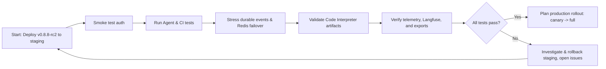

## Table of contents

- [Executive answer](#executive-answer)
- [What changed — headline summary](#what-changed-headline-summary)
- [Detailed breakdown and impact table](#detailed-breakdown-and-impact-table)
- [Who should care — target audiences and concerns](#who-should-care-target-audiences-and-concerns)
- [Upgrade risk assessment](#upgrade-risk-assessment)
- [Test plan (staging) — what to validate before production roll-out](#test-plan-staging-what-to-validate-before-production-roll-out)
- [Rollback plan](#rollback-plan)
- [Action checklist](#action-checklist)
- [Evidence, assumptions, and limitations](#evidence-assumptions-and-limitations)
- [Evidence](#evidence)
- [Assumptions and inferred architecture conclusions](#assumptions-and-inferred-architecture-conclusions)
- [Limitations](#limitations)
- [Sources](#sources)
- [FAQ](#faq)

## Executive answer

LibreChat v0.8.8-rc2 is a feature-rich release candidate that introduces a broad set of agent-focused capabilities (durable agents, subagents, human-in-the-loop flows), significant Code Interpreter extensions, new models, scheduling and project features, and multiple operational hardening improvements such as stronger HTTP headers, SAML binding updates, and Redis/DocumentDB reliability improvements. The release notes and README enumerate many new endpoints and UI features; the canonical source for this analysis is the LibreChat repository and its included v0.8.8-rc2 changelog and README [LibreChat repo](https://github.com/danny-avila/LibreChat). Data in this article was retrieved from the repository content on 2026-09-06 (generated_at: 2026-09-06T01:33:06.285930+00:00).

If you run LibreChat in production or use it as a base for self-hosted AI tooling, this release candidate requires focused validation: agent orchestration and durable event flows touch persistent state, authentication, and tool integration (Code Interpreter, MCP, plugins). The largest upgrade risks are around stateful agent runs, new experimental features (stateful code interpreter sessions, Agent Plugins, scheduled chats), and any environment-specific integrations (SAML, JWT handling, DocumentDB changes). Read the detailed test and rollback plans below before upgrading; treat v0.8.8-rc2 as a release candidate that should first be validated in staging using representative Agent, file, and multi-user flows.

## What changed — headline summary

Key items listed in the v0.8.8-rc2 changelog include:

- Agent run control and activity UI enhancements, human-in-the-loop agent flows, a unified Agent Builder marketplace, and durable agent automation (authenticated events, per-actor mailboxes, batching, detached Actions).
- Deeper Subagent history and improved background tool handling (Code Interpreter, MCP, plugins, and Actions can run while an Agent continues work).
- Code Interpreter workflows enhancements: sandboxed image artifacts, experimental stateful sessions with scoped environments and guarded file/command permissions.
- Experimental Agent Plugins and Scheduled Chats with cron presets and project destinations.
- Memory and context improvements (isolated memory, adaptive context fading, token and cost visibility).
- Editable long pastes and improved file/attachment handling.
- Search and navigation improvements, sharing and artifact exports (Mermaid export, PPT templates, Office downloads), and keenabled web search options with stronger SSRF protection on web-tool egress.
- Operational and security hardening: default HTTP security headers, opt-in nonce CSP, per-user Code Interpreter JWTs, SAML identity binding improvements, live-session OpenID refresh, and retired JWT-secret rejection.
- New models added to provider lists (GPT-5.6 responses controls, Claude Fable 5.1, Opus 5, Sonnet 5, Gemini 3.x Flash variants) and Langfuse observability configuration.
- Streaming, reliability, and scaling improvements: adaptive smoothing, Redis delta batching and failover recovery, automatic generation protocol v2, Agent circuit breakers, live MCP catalog refresh, and DocumentDB support.

All items above are taken from the project's v0.8.8-rc2 changelog and README content [LibreChat repo](https://github.com/danny-avila/LibreChat).

> [!NOTE]
> This article interprets the v0.8.8-rc2 changelog and README text as the canonical release evidence. The release is documented in the repository; there is no separate official blog post or additional release artifacts in the supplied source.

## Detailed breakdown and impact table

The table below maps the major changelog items to short descriptions and immediate operational impact.

| Changelog area | What changed (short) | Immediate impact / why it matters |
|---|---|---|
| Agent run control & activity UI | Interrupt, steer, queue, recover partial work; activity labels and grouped reasoning UI | Changes how long-running multi-step Agents are observed and controlled; impacts UI expectations and operator workflows |
| Human-in-the-loop Agents | Stream multiple related questions, durable pauses for input/approval | Enables manual approvals inside agents; test and policy controls needed for workflows that require human sign-off |
| Unified Agent Builder & Marketplace | One UI to configure Skills, MCP, Code Interpreter, tools, per-tool settings | Simplifies creation but centralizes configuration surface area; impacts permission and catalog management |
| Durable Agent automation | Authenticated events, per-actor mailboxes, detached Actions, batching | Adds durable messaging primitives; requires operational validation for event delivery guarantees and mailbox storage |
| Subagent history & background tools | Branch-aware child turns, load earlier activity, background tool runs while Agent continues | Improves traceability and concurrency; may increase storage and event-read patterns |
| Code Interpreter workflows | Sandboxed image artifacts, experimental stateful sessions, per-message downloads, guarded file/command permissions | Larger attack surface for stateful execution; requires careful JWT and permission testing |
| Agent Plugins (experimental) | Bundle deployment Skills, MCP servers, startup hooks | Experimental extension mechanism — accept as opt-in until hardened |
| Scheduled Chats (experimental) | Cron, time-zone selection, project destinations | New scheduler dependency and workflow semantics to test |
| Memory & context | Optional isolated memory, adaptive fading, token/cost visibility | Operational cost visibility and privacy controls; verify memory isolation behavior |
| Security & authentication | Default headers, nonce CSP opt-in, per-user CI JWTs, SAML fixes, OpenID refresh, retired JWT-secret rejection | Hardening for deployments; may change runtime token behavior and require reconfiguration |
| Models & reasoning | Added several new models (GPT-5.6 responses, Claude Fable 5.1, etc.) | New model endpoints available; validate credentials and pricing with your chosen provider |
| Streaming & reliability | Redis delta batching/failover, DocumentDB support, Agent circuit breakers | Intended to improve scale and resiliency; validate in horizontally scaled staging |

All entries in this table are distilled from the release notes in the project's README and changelog [LibreChat repo](https://github.com/danny-avila/LibreChat).

## Who should care — target audiences and concerns

- Operators of self-hosted LibreChat instances: must validate agent durability, event queues, and storage/backing services (Redis, DocumentDB). Changes to JWT handling, SAML, and OpenID token refresh require re-checking authentication flows.

- Teams using Agents or Code Interpreter in workflows: the Agents, Subagents, background tools, and Code Interpreter changes alter runtime behavior; testing stateful sessions, file outputs, and guarded command permissions is essential.

- Developers building Agent Plugins, Skills, or custom MCP servers: the new unified builder, plugins, and durable agent automation expose new extension points and testing surfaces.

- Security and compliance teams: changes to default HTTP security headers, CSP options, per-user JWTs, and retired-secret behaviors affect hardened deployments and should be validated against organizational policies.

- Platform architects integrating external models or observability: additions of new models and Langfuse support require configuration validation and potential billing or telemetry adjustments.

> [!TIP]
> If you depend on SAML or custom OpenID authentication, provision a test tenant and validate that the live-session OpenID refresh and retired-JWT handling work with your identity provider before you roll v0.8.8-rc2 to production.

## Upgrade risk assessment

This section maps the probable risk areas to recommended mitigations. These are assessment-level recommendations grounded in the release notes; they are not authoritative change logs beyond the repository text.

| Risk area | Risk level | Reason from changelog | Suggested mitigation |
|---|---:|---|---|
| Stateful Code Interpreter sessions | High (experimental) | Release notes describe "highly experimental stateful sessions" and guarded file/command permissions | Do not enable stateful sessions in production; validate in isolated staging; audit per-user JWT behavior |
| Durable Agent automation and events | High | New authenticated events, per-actor mailboxes, detached Actions introduce new persistence semantics | Load-test event delivery; validate idempotency and mailbox lifecycle; snapshot data before upgrade |
| Agent Plugins & scheduled chats | Medium-high (experimental) | Experimental plugins and scheduled chats add new runtime plugin hooks and scheduling | Keep features opt-in; test plugin lifecycle and scheduled job behavior; confirm timezone handling |
| Authentication token changes | Medium | Per-user CI JWTs and retired JWT-secret rejection change token lifecycle | Coordinate with identity providers; perform token rotation drills in staging |
| Redis delta batching / failover | Medium | Changes to streaming reliability and failover | Validate Redis failover scenarios; confirm delta batching behavior for real-time streams |
| DocumentDB support and DB migrations | Medium | New DB backend support could imply schema or config changes | Backup DBs, test migrations in staging, and confirm index/performance impact |
| UI & UX changes (Agent builder) | Low-medium | New unified builder changes configuration flow | Train power users; audit default permissions and marketplace items |

All risk attributions above are based on the release notes in the README/changelog [LibreChat repo](https://github.com/danny-avila/LibreChat).

## Test plan (staging) — what to validate before production roll-out

High-level test objectives:

1. Install or deploy v0.8.8-rc2 in a staging cluster that mirrors production topology (auth, Redis, DocumentDB/DB, object store, MCP endpoints, providers).
2. Verify authentication paths: token exchange, SAML sign-in, OpenID refresh, and per-user Code Interpreter JWT issuance and expiration.
3. Validate Agent flows: simple single-step agents, long-running agents with interrupt/"Keep going" behavior, human-in-the-loop pause/resume, and detached actions.
4. Stress test durable events: create many concurrent agent events, observe mailboxes, event batching, and delivery guarantees.
5. Code Interpreter safety and artifacts: run file uploads, sandboxed image artifacts, per-message downloads, and confirm guarded permissions work.
6. Subagent and background tool concurrency: spawn Subagents, run background tools in parallel, and inspect history/branching behavior.
7. Scheduled chats and cron: run scheduled Agents in multiple time zones and verify project destination routing.
8. Streaming and failover: simulate Redis failures and validate delta batching and smoothing recovery.
9. Observability and telemetry: Langfuse connection, telemetry encryption, session links, and authorized export testing.
10. Export/sharing and file workflows: generate Mermaid exports, PPT, Office downloads, and verify shared link behavior.

Table: Test cases mapped to pass criteria

| Test case | Steps | Pass criteria |
|---|---|---|
| Auth token lifecycle | Sign in via SAML and standard OAuth/OpenID flows; simulate token expiry | Session refresh occurs; retired JWTs are rejected; no orphan sessions remain |
| Agent interrupt & resume | Start long Agent that uses files and tools; interrupt before visible answer; use Keep going/Answer now | Agent returns partial work, resumes deterministically, and files remain accessible |
| Human-in-loop pause | Run an Agent that pauses for approval; approve and observe continuation | Agent halts at pause, resumes after approved input; no data loss |
| Durable events delivery | Emit events to Actor mailboxes under load | No unbounded mailbox growth; events are batched and delivered within expected windows (define windows based on SLA) |
| Stateful Code Interpreter | Enable experimental sessions in isolated environment; run guarded file writes | Sandbox prevents unauthorized writes; image artifacts are produced and viewable |
| Redis failover | Force Redis failover while streaming responses | Smoothing and reconnection preserve or resume streams without inconsistent state |
| Scheduled chats | Schedule jobs across TZs | Jobs run at configured TZ schedule and target Project destinations |

Note: test timings and expected numeric thresholds should be defined by your SLA and are not included here because they are not present in the supplied source material.

> [!WARNING]
> Do not enable "highly experimental" stateful Code Interpreter sessions in production without isolation and a rollback plan. The changelog marks these as experimental and they change execution semantics for code runs.

## Rollback plan

A conservative rollback plan for self-hosted LibreChat instances:

1. Pre-upgrade snapshot: take application and database backups (conversations, agent state, event mailboxes). Export relevant config (env files, SAML/OpenID configs, MCP catalog snapshots).
2. Deploy v0.8.8-rc2 to staging and run the test plan above.
3. For production rollouts prefer canary deployments: deploy to a small subset of users or a single tenant, monitor logs and metrics for errors in agent flows, JWT handling, and streaming.
4. If critical failures occur, the rollback steps are:
   - Repoint traffic away from the canary instance(s).
   - Restore the previous application version (tag or container image) and re-apply the backed-up config if necessary.
   - For database or mailbox schema/persistence changes, restore database snapshot to the pre-upgrade state if the change is incompatible (this requires downtime planning).
5. Re-run smoke tests after rollback to confirm service restoration.

Key rollback cautions:
- If durable Agents or mailboxes have new storage formats that are not backward compatible, simply rolling back the app may not restore agent processing for items already processed. Verify backwards compatibility before enabling durable agent automation in production.
- Token handling changes (retired JWT-secret rejection) can render existing tokens invalid; coordinate secret rotations and validate token refresh prior to full rollout.

## Action checklist

- [ ] Retrieve and review v0.8.8-rc2 changelog and README from the canonical repo [LibreChat repo](https://github.com/danny-avila/LibreChat) (data used in this article retrieved 2026-09-06).
- [ ] Deploy v0.8.8-rc2 to a staging environment that mirrors production services (Redis, DocumentDB/DB, object store, identity provider, MCP endpoints).
- [ ] Run the test plan above focusing on durable events, Code Interpreter, Auth, and Redis failover.
- [ ] Keep experimental features (stateful CI sessions, Agent Plugins, Scheduled Chats) disabled by default in production until validated.
- [ ] Schedule a canary rollout window and automated rollback procedure.
- [ ] Communicate token/secret rotation changes to identity and security teams; run token refresh tests.

## Evidence, assumptions, and limitations

## Evidence
- This analysis is based exclusively on the LibreChat repository README and v0.8.8-rc2 changelog content in the supplied repository copy [LibreChat repo](https://github.com/danny-avila/LibreChat). The repository data used here was retrieved and the article generated on 2026-09-06 (generated_at: 2026-09-06T01:33:06.285930+00:00).

## Assumptions and inferred architecture conclusions
- Inferred architecture conclusion: the "durable Agent automation" features (authenticated Agent Events, per-actor mailboxes, detached Actions) imply a persistent event store and mailbox subsystem backed by the platform's storage (e.g., Redis or DocumentDB). This inference is drawn from the changelog wording and the repository's mentions of Redis and DocumentDB but is not explicitly documented in the supplied source.
- Inferred architecture conclusion: "per-user Code Interpreter JWTs" implies a token issuance flow tied to user identity and a token validation path in the Code Interpreter service. This is inferred from the changelog line but exact token endpoints and flows are not documented in the supplied README.

## Limitations
- Only the repository README and changelog were available as source evidence. There is no separate release binary, migration script, or annotated upgrade guide included in the supplied source. Consequently, any operational detail (e.g., exact migration steps or command-line upgrade commands) is out of scope for this article because it would require additional upstream documentation.
- This article does not include performance numbers, compatibility matrices for all supported providers, nor adoption or usage statistics; those figures are not present in the provided repository content.

## Sources

- LibreChat canonical repository: https://github.com/danny-avila/LibreChat

## FAQ

### What is the authoritative source for v0.8.8-rc2 changes?
The repository README and the v0.8.8-rc2 changelog in the LibreChat GitHub repository are the canonical sources used for this analysis: https://github.com/danny-avila/LibreChat.

### Should I enable experimental features in production?
No — the changelog marks several items as "experimental" (e.g., stateful Code Interpreter sessions, Agent Plugins, Scheduled Chats). The recommended approach is to validate them in isolated staging environments before considering them for production.

### Does this release change authentication behavior?
Yes. The release notes list per-user Code Interpreter JWTs, live-session OpenID token refresh, SAML identity binding improvements, and retired JWT-secret rejection. These changes affect token lifecycle and should be tested with your identity provider in staging.

### Do I need to back up data before upgrading?
Yes. Back up application config, conversations, agent state, and any event/mailbox stores before upgrading, especially since durable agents and mailboxes introduce persistence semantics that could be incompatible with older versions.

### Are there breaking changes I should watch for?
The changelog warns to consult the full changelog for breaking changes. The supplied README advises checking the changelog before updating. Specific breaking-change details are not enumerated in the supplied source beyond the authentication and durable-agent semantics, so review the project's changelog page in the repo for any explicit breaking-change notes.

### How should I validate Code Interpreter changes?
Test file uploads, sandboxed artifact creation (images), guarded file and command permissions, and per-message downloads in an isolated environment. Avoid turning on "stateful sessions" in production until validated.

### Who should I contact for more details?
Use the project's repository, documentation, and community channels listed in the README for further questions: https://github.com/danny-avila/LibreChat.
