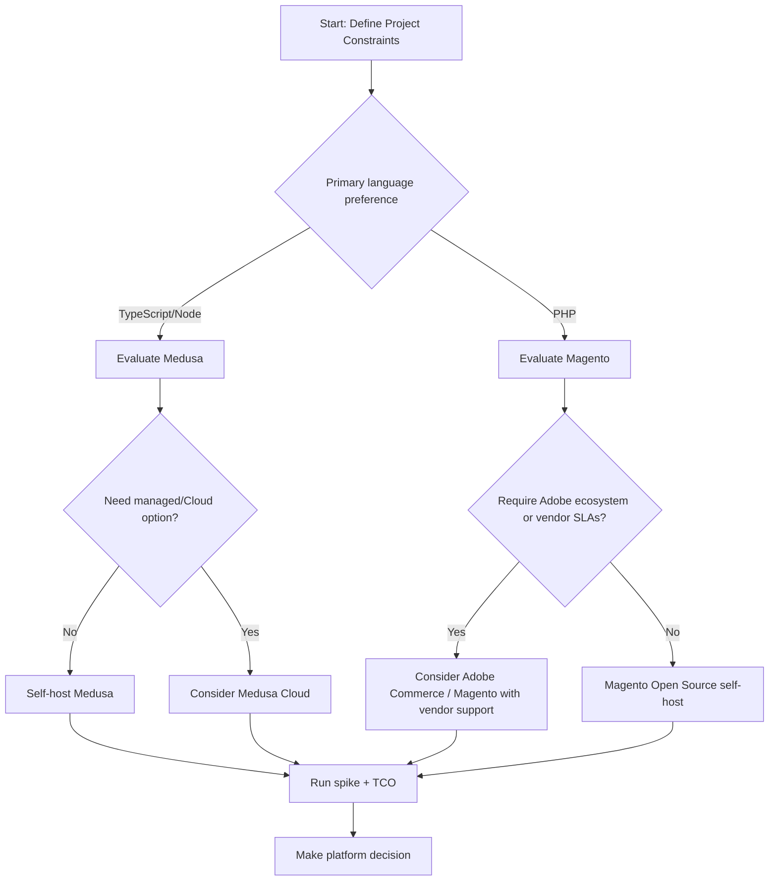

## Table of contents

- [Executive answer](#executive-answer)
- [Quick project snapshot (facts from repositories)](#quick-project-snapshot-facts-from-repositories)
- [Architecture, runtime, and licensing (facts and inferences)](#architecture-runtime-and-licensing-facts-and-inferences)
- [Community & activity (evidence table and visual)](#community-activity-evidence-table-and-visual)
- [Decision matrix (practical comparison for project decisions)](#decision-matrix-practical-comparison-for-project-decisions)
- [Trade-off table: what you trade for what](#trade-off-table-what-you-trade-for-what)
- [Workload-fit analysis and recommendations (4 project profiles)](#workload-fit-analysis-and-recommendations-4-project-profiles)
- [Migration considerations (Magento <-> Medusa)](#migration-considerations-magento-medusa)
- [Decision checklist (Actionable)](#decision-checklist-actionable)
- [Action checklist (Practical next steps)](#action-checklist-practical-next-steps)
- [Evidence, assumptions, and limitations](#evidence-assumptions-and-limitations)
- [Sources](#sources)
- [FAQ](#faq)

## Executive answer

Both Medusa and Magento are viable open-source foundations for commerce projects; choose based on constraints rather than assuming one is universally better. The decision should weigh runtime and language (TypeScript/Node.js for Medusa vs PHP for Magento), licensing and commercial options (Medusa's open-core model plus an Enterprise Edition; Magento Open Source under OSL-3.0 and maintained under Adobe's stewardship), community signals in their repositories, and the expected operational model (managed cloud vs self-host/Adobe ecosystem).

This article uses only repository metadata and README content from the projects to build a decision matrix, trade-offs, a workload fit analysis, migration considerations, and targeted recommendations for four common project profiles. Repository snapshots and release information are cited directly. Data freshness: repository metadata and releases were retrieved and summarized from the supplied sources; the article generation timestamp is 2026-09-06T01:33:06.283436+00:00.

## Quick project snapshot (facts from repositories)

- Medusa (GitHub: medusajs/medusa): language TypeScript; stars: 36,151; forks: 5,189; open_issues: 195; default branch: develop. Homepage: https://medusajs.com. The repository README states Medusa uses an open-core licensing model and mentions an Enterprise Edition identified separately in the repository. Latest listed release (as supplied) is v2.20.1 published 2026-09-03 and its notes include a field-filter security fix. See the canonical repo and release: [Medusa canonical repository](https://github.com/medusajs/medusa), [Medusa latest GitHub release](https://github.com/medusajs/medusa/releases/tag/v2.20.1).

- Magento (GitHub: magento/magento2): language PHP; stars: 12,178; forks: 9,352; open_issues: 2,177; default branch: 2.4-develop. Homepage: http://www.magento.com. The README identifies Magento Open Source and references Adobe Commerce as the full-featured counterpart. Latest listed release (as supplied) is Magento Release 2.4.9 published 2026-05-12. See the repo: [Magento canonical repository](https://github.com/magento/magento2).

> [!NOTE]
> Repository signals (stars, forks, open_issues, languages, releases) are interest-and-activity indicators taken directly from the supplied repositories. They are not usage, market share, defect counts, or performance measures.

## Architecture, runtime, and licensing (facts and inferences)

- Facts from repositories:
  - Medusa repo lists TypeScript as the primary language and includes README text that the project uses an open-core licensing model; the Medusa homepage is medusajs.com. The repository's default branch is develop. Latest release: v2.20.1 (2026-09-03) with a patch addressing a field-filter security gap. See [Medusa canonical repository](https://github.com/medusajs/medusa) and its [latest release](https://github.com/medusajs/medusa/releases/tag/v2.20.1).
  - Magento repo lists PHP as the primary language and states the project is Magento Open Source; it references Adobe Commerce for additional features. Default branch: 2.4-develop. Latest release in the supplied data is 2.4.9 (2026-05-12). See [Magento canonical repository](https://github.com/magento/magento2).

- Inferred from READMEs/repository structure (explicitly labeled):
  - Inferred from READMEs/repo structure: Medusa's TypeScript primary language and README language about Medusa Cloud and an Enterprise Edition implies a modern Node.js/TypeScript architecture with an accompanying managed/cloud offering and optional paid enterprise features (the README explicitly mentions Medusa Cloud and an Enterprise Edition that requires a commercial agreement). This is an inference drawn from README wording and project structure, not an independent runtime benchmark.
  - Inferred from READMEs/repo structure: Magento Open Source's README references Adobe Commerce and system installation guides, implying a mature PHP-based monolithic distribution with a broader commercial product ecosystem maintained by Adobe. This is an inference from README content and project organization.

> [!TIP]
> When your team evaluates platform architecture, map your existing tooling (CI, hosting, language expertise) to the project's primary language and recommended hosting model. The repository language fields are a reliable starting point.

## Community & activity (evidence table and visual)

Below are the repository activity and metadata facts used throughout this article. These are direct readings of the supplied repository data (generation timestamp above).

| Metric | Medusa (medusajs/medusa) | Magento (magento/magento2) |
|---|---:|---:|
| Primary language | TypeScript | PHP |
| Stars | 36,151 | 12,178 |
| Forks | 5,189 | 9,352 |
| Watchers | 197 | 1,208 |
| Open issues (repo) | 195 | 2,177 |
| License (repo) | MIT (open-core model in README) | OSL-3.0 |
| Default branch | develop | 2.4-develop |
| Latest release (supplied) | v2.20.1 — 2026-09-03 | 2.4.9 — 2026-05-12 |
| Homepage referenced | https://medusajs.com | http://www.magento.com |

Sources: [Medusa repo](https://github.com/medusajs/medusa), [Medusa release v2.20.1](https://github.com/medusajs/medusa/releases/tag/v2.20.1), [Magento repo](https://github.com/magento/magento2).

> [!WARNING]
> Open-issue counts are repository activity indicators, not defect tallies. Use issue quality, labels, and release cadence to assess maintenance risk rather than raw open-issue numbers alone.

## Decision matrix (practical comparison for project decisions)

This decision matrix focuses on attributes that materially affect a real project: language/runtime fit, licensing and commercial path, extensibility, community activity, and operational model.

| Decision criterion | Medusa (evidence-based) | Magento (evidence-based) | Practical impact / when it matters |
|---|---|---|---|
| Runtime & language | TypeScript (repo primary language) — Node.js ecosystem implied by TypeScript usage and README references to Medusa Cloud | PHP (repo primary language); README references Adobe Commerce ecosystem | If your engineers prefer Node/TypeScript, Medusa lowers ramp; if you have PHP expertise or existing PHP infrastructure, Magento fits better.
| Licensing model & commercial options | README and repo mention open-core model and separate Enterprise Edition (commercial agreement required). Core repo shows MIT license artifacts and explicit Enterprise references in README. | Magento Open Source is licensed under OSL-3.0 (README). Adobe provides commercial Adobe Commerce for additional features. | Consider procurement and vendor lock-in. Open-core can mix free core with paid enterprise modules; Magento's commercial path routes through Adobe.
| Community signals (stars & forks) | Higher stars (36k) and moderate forks (5.1k) in supplied snapshot. | Lower stars (12k) but higher forks (9.3k) and larger watcher count in supplied snapshot. | High stars can indicate interest; forks and watchers may reflect broader community customization and corporate participation. Evaluate contributor activity, not just counts.
| Issue backlog & release cadence | Open issues: 195; latest release shows recent security-oriented patch (v2.20.1 on 2026-09-03). | Open issues: 2,177; latest listed release 2.4.9 (2026-05-12). | A small open-issue count may indicate focused repo size or active triage; large counts require inspection of labels and response times.
| Extensibility & integrations | README lists integrations and a modular approach; open-core implies modular enterprise features. (Inference from README and repo organization.) | README and project materials point to a large extension ecosystem and formal contributor/maintainer processes under Adobe. (Inference from README and repo organization.) | Projects that require many third-party extensions should evaluate the ecosystem breadth and quality of packaging and docs.
| Operational model | Medusa README explicitly references Medusa Cloud (managed option). | Magento README references Adobe Commerce and cloud/hardening docs — larger vendor ecosystem. | If you want a managed service packaged with the platform, Medusa Cloud or Adobe Commerce options in their respective ecosystems influence TCO and time to market.

## Trade-off table: what you trade for what

| Trade-off | Choose Medusa when... | Choose Magento when... | Notes |
|---|---|---|---|
| Language & recruiting | Your team is Node/TypeScript-first and wants a modern JS stack (Medusa repo primary language: TypeScript). | You have existing PHP/Symfony/Composer expertise or require compatibility with PHP hosting and tooling (Magento repo language: PHP). | Converting staff skillsets costs time and risk; base choice on current team plus hiring pipeline.
| Ecosystem breadth vs focused modern stack | You want a smaller, modern, modular codebase and a cloud-hosted managed option referenced in the README. | You require a mature, widely extended platform with a large ecosystem maintained under Adobe. | Ecosystem breadth doesn't guarantee fit — verify specific extensions and partners you need.
| Licensing & commercial path | You accept an open-core model where advanced features may be separately licensed (README mentions Enterprise Edition). | You prefer a platform with an established commercial vendor (Adobe) and a distinct Open Source vs Commerce product line (README references Adobe Commerce). | Compare actual module licensing for the features you need; open-core can be simpler to start but may incur costs later.
| Release pace & security patches | Medusa's supplied latest release (v2.20.1) shows a recent patch addressing a field-filter security gap (2026-09-03). | Magento's supplied release is 2.4.9 (2026-05-12) and the README highlights formal security channels and advisory workflows. | Both projects provide releases; review security advisories, patch frequency, and responsible-disclosure processes for your compliance needs.

## Workload-fit analysis and recommendations (4 project profiles)

Below are four common project profiles with recommended starting platform(s), justification drawn from repository facts and README inferences, and migration/operational considerations.

Profile A — Small DTC startup (fast time-to-market, modern JS stack)
- Recommendation: Medusa (evidence: TypeScript primary language in repo; README mentions Medusa Cloud as a managed option). Consider starting with Medusa Cloud if you prefer managed hosting.
- Why: Modern TypeScript/Node stack aligns with many frontend JS frameworks and can shorten full-stack developer onboarding.
- Migration/operational notes: Expect to adopt Node-based hosting, build CI for TypeScript runtime, and evaluate open-core upgrade paths if you later need enterprise modules.

Profile B — Mid-market B2B with complex pricing and custom flows (needs extensibility and enterprise integrations)
- Recommendation: Both are plausible; shortlist both and validate extension availability. Magento's long history and Adobe ecosystem may provide more off-the-shelf integrations; Medusa's modular TypeScript architecture may simplify custom development if your team is JS-centric.
- Why: Magento's README points to a mature contributor and extension process under Adobe; Medusa's README highlights modular commerce modules and an Enterprise Edition for advanced needs (inference from README and repo layout).
- Migration/operational notes: If choosing Medusa, plan for custom implementation of advanced B2B features; if choosing Magento, map your required enterprise integrations to available Adobe partners and extensions.

Profile C — Large enterprise with existing PHP investments and on-premise compliance requirements
- Recommendation: Magento (evidence: PHP primary language; README references Adobe Commerce and formal contributor/maintainer infrastructure). Magento is a natural fit where PHP is dominant and where Adobe commercial offerings may help with enterprise SLAs.
- Why: Existing PHP infrastructure and teams reduce migration risk; Adobe's commercial path provides a vendor channel for enterprise support.
- Migration/operational notes: Prepare for a PHP-centric deployment, coordinate with Adobe/partners for managed or enterprise-grade support, and audit extension licensing under OSL-3.0 and any commercial contracts.

Profile D — Headless commerce and custom frontend/library usage (API-driven, multi-channel)
- Recommendation: Medusa (evidence: TypeScript, README emphasis on building blocks and integrations; README references headless patterns implicitly via modularity and cloud links). Medusa's modern JS stack often pairs well with headless frontends.
- Why: A Node/TypeScript backend can reduce impedance mismatch with JavaScript frontends and supports API-first patterns.
- Migration/operational notes: Verify the specific APIs, event models, and integration adapters you need. If migrating from Magento to Medusa, see the migration considerations below.

> [!TIP]
> For any enterprise or B2B project, run a short, practical spike: implement one real-world business flow (checkout + discounts + an integration) with each platform to validate effort and unknowns before committing.

## Migration considerations (Magento <-> Medusa)

All migration guidance below is derived from differences visible in the supplied repository metadata and README material (language, licensing, ecosystem). This section avoids invented migration tools or commands and focuses on high-level tasks and risks.

Key migration tasks and considerations:
- Data model mapping: product catalogs, customers, orders, and promotions will require explicit mapping. Because the primary languages differ (TypeScript vs PHP), expect different canonical data models; plan ETL/transform layers.
- Extension/feature parity: inventory, promotions, tax, payment gateways, and third-party integrations must be enumerated and matched. Some features may be available as community extensions in Magento's ecosystem; Medusa's README indicates modular commerce modules and an Enterprise Edition for advanced features (inferred from repo/readme).
- Hosting and operational model: Medusa references Medusa Cloud (README); Magento references Adobe Commerce and installation/system guides. Migration must account for runtime environment changes (Node vs PHP), CI/CD changes, container images, and hosting costs.
- Security and compliance: review security advisories and release notes (Medusa's supplied release v2.20.1 includes a field-filter security fix) and vendor processes. For PCI, data residency, and compliance, plan for testing and audits independent of platform repo signals.
- Team skills and hiring: migrating to a different runtime may require retraining or hiring; factor this into timelines and budget.
- Extension maintenance and licensing: open-core vs Adobe commercial licensing differences affect procurement. Verify any enterprise features' licensing terms before migrating.

Migration risk checklist (high level):
- Inventory current integrations and extensions.
- Map data schemas and export/import strategy.
- Plan for feature parity tests and acceptance criteria.
- Secure a rollback plan and parallel run window.
- Schedule security and compliance reassessments after migration.

## Decision checklist (Actionable)

- Does your team prefer TypeScript/Node or PHP? (Repo primary languages: Medusa = TypeScript; Magento = PHP.)
- Do you need out-of-the-box integrations from an existing large ecosystem (Magento) or do you prefer a smaller modern stack with a managed cloud option (Medusa)?
- Will licensing (open-core vs OSL-3.0/Adobe commercial) affect procurement or future costs?
- Which platform's release & security process matches your compliance needs? (Medusa release v2.20.1 — 2026-09-03; Magento release 2.4.9 — 2026-05-12.)
- Do a hands-on spike implementing a critical business flow before final selection.

## Action checklist (Practical next steps)

- Run two 2–4 week spikes: implement the team’s most important flow (checkout with custom promotions + one external integration) on both platforms.
- Tally feature gaps and approximate engineering time to parity for each platform.
- Assess operational changes (hosting, monitoring, CI) and produce a TCO estimate for 12–36 months.
- Review licensing and procurement implications for enterprise modules and vendor SLAs.
- Decide using the decision matrix above and document acceptance criteria for go/no-go.

## Evidence, assumptions, and limitations

- Evidence base: This article is grounded solely on the supplied repository metadata and README content listed in the supplied sources. Specifically: [Medusa canonical repository](https://github.com/medusajs/medusa), [Medusa latest GitHub release v2.20.1](https://github.com/medusajs/medusa/releases/tag/v2.20.1), and [Magento canonical repository](https://github.com/magento/magento2).
- Generation timestamp / freshness: The content and repository fields referenced were captured in the supplied payload; the article generation timestamp is 2026-09-06T01:33:06.283436+00:00. Use that timestamp to assess freshness when you read this article.
- Assumptions explicitly stated: Where the README or repository structure suggested architecture, cloud offerings, or enterprise editions, those are labeled as inferences (see the "Architecture, runtime, and licensing" section). These inferences come from README wording and repository organization, not from independent runtime inspection or external documentation.
- Limitations: This article does not include external usage statistics, benchmarks, or security advisories beyond the supplied release notes. It does not invent feature lists, commands, or third-party extension contents. For procurement or compliance, consult vendor/legal teams and the platforms' official documentation.

## Sources

- Medusa canonical repository: https://github.com/medusajs/medusa
- Medusa latest GitHub release (v2.20.1): https://github.com/medusajs/medusa/releases/tag/v2.20.1
- Magento canonical repository: https://github.com/magento/magento2

## FAQ

### Is one of these platforms the "best" for all e-commerce projects?
No. The right choice depends on your team's language expertise, required integrations, licensing constraints, and operational model. Use the decision matrix and run hands-on spikes to determine fit.

### Do the star and fork counts mean one platform has more users?
No. Stars and forks are interest and activity signals from the repositories. They are not direct measures of production usage or market share.

### Does Medusa require a paid license to use the core project?
The Medusa README indicates an open-core model with a separately licensed Enterprise Edition; the supplied repository shows MIT-licensed core artifacts and mentions enterprise features that require commercial agreements. Review the repository and vendor materials for exact licensing details.

### Is Magento maintained by a vendor?
Yes. The Magento repository README references Adobe and distinguishes Magento Open Source from Adobe Commerce. For enterprise-grade support and hosted offerings, Adobe is the vendor route to investigate.

### How should I validate security posture before choosing a platform?
Review recent release notes (the supplied Medusa release v2.20.1 includes a security-related patch), check the project's security reporting and advisory processes, and run your own security assessment as part of the spike. The repository READMEs mention security channels and advisories.

### If I have an existing Magento instance, can I move to Medusa easily?
Migration is possible but requires planning: data model mapping, feature parity assessment, integration and extension mapping, and adjustments to runtime/hosting (PHP to Node). The article lists migration considerations to guide planning; perform a proof-of-concept to quantify effort.

### Where can I find the official docs and installation guides?
Refer to each project's homepage and repository links in the Sources section: [Medusa canonical repository](https://github.com/medusajs/medusa) and [Magento canonical repository](https://github.com/magento/magento2).
