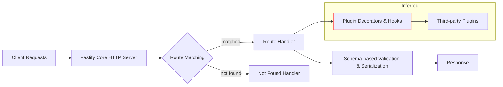

## Table of contents

- [Executive answer](#executive-answer)
- [Repository snapshot](#repository-snapshot)
- [Purpose and intended users](#purpose-and-intended-users)
- [Maintenance and health signals](#maintenance-and-health-signals)
- [Architecture and design (inferred and documented)](#architecture-and-design-inferred-and-documented)
- [Inferred architectural summary (inferred from README and repository structure):](#inferred-architectural-summary-inferred-from-readme-and-repository-structure)
- [Evidence-backed strengths](#evidence-backed-strengths)
- [Limitations and caveats](#limitations-and-caveats)
- [Evaluation checklist (quick gate for technical teams)](#evaluation-checklist-quick-gate-for-technical-teams)
- [Action checklist (step-by-step adoption path)](#action-checklist-step-by-step-adoption-path)
- [Responsible adoption path and governance considerations](#responsible-adoption-path-and-governance-considerations)
- [Evidence, assumptions, and limitations](#evidence-assumptions-and-limitations)
- [Assumptions and how they were handled](#assumptions-and-how-they-were-handled)
- [Limitations](#limitations)
- [Two practical comparison tables](#two-practical-comparison-tables)
- [Sources](#sources)
- [FAQ](#faq)

## Executive answer

Fastify (fastify/fastify) is a JavaScript-based web framework repository focused on low-overhead HTTP servers, a plugin-first architecture, and schema-driven validation and serialization. The project exposes a stable core API, maintains a broad plugin ecosystem, and emphasizes performance and developer ergonomics. Key repository signals that support these claims include an active release history, CI workflows shown in the project README, a recent security-oriented release, and metadata such as stars and forks indicating community interest ([fastify/fastify on GitHub](https://github.com/fastify/fastify)).

This profile synthesizes repository metadata and README documentation into an actionable evaluation: who Fastify is best for, where it shines (performance-sensitive services, plugin-driven teams, JSON Schema-orientated validations), its maintenance posture, and a practical, evidence-based adoption checklist. Data and repository facts in this article were retrieved from the canonical repository and its latest release information on 2026-09-06 (generation date: 2026-09-06T01:35:31Z).

## Repository snapshot

The following table condenses the repository facts used throughout this profile (all values come from the repository metadata and latest release noted in Sources):

| Field | Value |
|---|---:|
| Repository | [fastify/fastify](https://github.com/fastify/fastify) |
| Description | Fast and low overhead web framework, for Node.js |
| Primary language | JavaScript |
| License | MIT |
| Stars (interest signal) | 37,096 |
| Forks | 3,017 |
| Open issues (signal) | 149 |
| Default branch | main |
| Created | 2016-09-28 |
| Last push (metadata) | 2026-09-05T09:42:37Z |
| Last repo update (metadata) | 2026-09-05T08:18:08Z |
| Latest release | v5.12.2 (published 2026-09-04) |

Sources: the repository metadata and the v5.12.2 release notes are available in the project's GitHub pages; see Sources section for links.

> [!NOTE]
> "Stars" are an interest signal only. They indicate community attention, not production usage or market share. The repository metadata used here was retrieved on 2026-09-06.

## Purpose and intended users

Purpose (as described in repository materials): provide a low-overhead, extensible web framework for Node.js that prioritizes developer experience and runtime performance. Supported features and emphases, drawn from the repository README and linked documentation, include:

- Schema-based validation and serialization (JSON Schema recommended by maintainers).
- A plugin architecture intended to encourage encapsulation and reusability.
- Integration with the Pino logging library for low-impact structured logging.
- Guidance and tooling for both development and production usage (dev generators, CLI tools referenced in the README).

Intended users (inferred from the README and documented guides):

- Backend developers building HTTP services in JavaScript or TypeScript who need a structured plugin model and explicit schema validation.
- Teams that require predictable performance characteristics and want to control serialization costs with compiled schemas.
- Contributors and organizations that prefer an active open-source project with CI and governance.

## Maintenance and health signals

This section compiles concrete maintenance signals visible in the repository metadata and README. Each row cites source evidence.

| Signal | Evidence (repository) | Interpretation |
|---|---|---|
| Active releases | Latest release: v5.12.2, published 2026-09-04 ([release notes](https://github.com/fastify/fastify/releases/tag/v5.12.2)) | Recent releases, including security fixes, indicate ongoing maintenance. |
| CI and workflows | README links to CI badges: ci.yml, package-manager-ci.yml, website.yml | Presence of CI workflows implies automated tests and package checks; check actual workflow status when evaluating a checkout. |
| Security policy | README links to SECURITY.md (Responsible Disclosure) | The project documents a security disclosure process. Follow that for reporting issues. |
| Community interest | 37k+ stars, 3k+ forks | Strong attention from the community; useful when assessing ecosystem momentum but not a usage metric. |
| CII Best Practices | README shows CII best-practices badge (link) | Badge indicates attention to maintenance practices, but verify badge status on the CII site. |

> [!TIP]
> When assessing a repository, combine the static metadata above with live checks: current CI status, timestamp of last commits and tags, and the degree to which issues and PRs are actively triaged.

### Release and security notes (evidence)

The repository's most recent public release included a section labeled "Security release" and listed fixes for multiple GitHub security advisories. See the project's release page for v5.12.2 for the specific advisories addressed ([v5.12.2 release](https://github.com/fastify/fastify/releases/tag/v5.12.2)). Do not assume which versions are affected beyond what the release and advisories explicitly specify; consult the release and the repository's SECURITY.md for scope.

## Architecture and design (inferred and documented)

The repository README and docs repeatedly emphasize a plugin-first design, schema-driven validation, and low-overhead runtime. The following architectural conclusions are inferred from the README structure, documentation titles, and conventional patterns used in the Node.js ecosystem. These are labeled as inferred, per site policy.

## Inferred architectural summary (inferred from README and repository structure):

- Fastify exposes a core server instance with a lifecycle that supports hooks, decorators, and scoped plugins.
- Routes and their validation/serialization are intended to be described with JSON Schema or the project's Fluent Schema helpers.
- The plugin system provides encapsulation boundaries, enabling teams to register behavior (decorators, hooks, routes) without global side effects.

The diagram below sketches a high-level flow and plugin encapsulation model — treat it as interpretation rather than a verbatim spec.

> [!WARNING]
> The diagram reflects conclusions inferred from the README and repository layout, not a formal specification; verify details against the project's official docs before designing systems that rely on internal behaviors.

## Evidence-backed strengths

The repository materials and metadata support the following strengths:

- Performance orientation: the README highlights performance as a primary goal and includes synthetic benchmark results that show low framework overhead for a "hello world" scenario (benchmarks repository referenced in the docs). These are synthetic and should be used only as a comparative indicator, not a production guarantee ([fastify/fastify README](https://github.com/fastify/fastify)).

- Extensible plugin architecture: documentation and multiple guides listed in the README emphasize plugin development, encapsulation, and a plugins team in the project's governance structure.

- Schema-first validation path: the project recommends using JSON Schema to validate inputs and serialize outputs and documents a compilation step intended to reduce per-request costs.

- Active maintenance and governance: evidence of CI workflows, a security disclosure policy, CII Best Practices badge, and a named lead/teams structure indicate institutionalized maintenance practices.

## Limitations and caveats

Limitations below are derived from repository metadata and documentation references; where we infer behavior from textual evidence the statement is labeled.

- JavaScript primary language: the repository lists JavaScript as the primary language. If your team requires native support for other runtime languages, evaluate cross-platform options separately.

- Synthetic benchmarks: the README includes synthetic benchmark numbers (hello-world style); these represent framework overhead in a controlled scenario and do not predict application-level performance in real workloads. Always benchmark your actual application.

- Security scope must be validated per release: the repository shows recent security-related fixes (v5.12.2). When adopting, verify specific advisories and affected versions in the release notes and security advisories referenced by the project rather than relying on summary language.

- Architectural inference: some structural conclusions in this profile (plugin encapsulation, lifecycle hooks) are inferred from README content and documentation indexes; consult the repository's reference documentation for definitive behavior.

## Evaluation checklist (quick gate for technical teams)

Use this checklist to decide whether to consider Fastify for a project. Mark each item with Yes/No and add notes.

| Criterion | Why it matters | Pass? | Notes |
|---|---|:---:|---|
| Does the team use Node.js/JavaScript or TypeScript? | Fastify is JavaScript-first (docs include TypeScript guidance). |  |  |
| Do you need schema-based validation or predictable serialization costs? | Fastify recommends JSON Schema and compiles schemas for serialization. |  |  |
| Will a plugin-first architecture help enforce boundaries? | Fastify emphasizes plugins and encapsulation in docs. |  |  |
| Is low framework overhead a priority? | README highlights performance and includes synthetic benchmarks. |  |  |
| Can the team maintain dependencies and patch releases? | Active releases and CI exist, but you must track security advisories. |  |  |

## Action checklist (step-by-step adoption path)

1. Repository validation
   - Confirm the current release and changelog for any security advisories relevant to your target versions ([v5.12.2 release page](https://github.com/fastify/fastify/releases/tag/v5.12.2)).
   - Inspect CI workflow files and run the test suite locally on your Node.js versions.
2. Prototype and benchmark
   - Build a minimal service using your target routes and data shapes.
   - Implement JSON Schema for request/response shapes and measure serialization/validation costs with realistic payloads.
3. Plugin strategy
   - Map functionality you expect to be shared or isolated into plugins. Use encapsulation patterns from the docs to avoid global state leakage.
4. Observability and logging
   - Confirm logging integration (Pino is referenced in project docs) and adapt structured logging to your observability stack.
5. Security and upgrade plan
   - Subscribe to repository releases and security advisories. Create a patch/upgrade plan for production deployments.
6. Production rollout
   - Stage release behind feature flags and run canaries under production-like load. Monitor latency percentiles and error rates during rollout.

> [!TIP]
> Start with a small, real route set and representative data sizes for benchmarking; hello-world numbers do not reflect real-world serialization and validation costs.

## Responsible adoption path and governance considerations

- Licensing: Fastify is published under an MIT license in its repository metadata — that license permits broad reuse but confirm compatibility with your project's legal constraints.

- Security reporting: the project exposes a SECURITY.md and a "Security Responsible Disclosure" badge in the README. Use the repository's documented process to report vulnerabilities.

- Contributing and support: the project documents contributing guidelines and maintains a "Fastify help" support area. If your organization depends on the framework long-term, consider participating in the ecosystem or sponsoring maintainers, as the project lists sponsor options in the README.

## Evidence, assumptions, and limitations

Evidence used in this profile

- Repository metadata and README content (stars, forks, open issues, language, license, docs list, badges) from the canonical repository ([fastify/fastify](https://github.com/fastify/fastify)).
- Latest release notes (v5.12.2, published 2026-09-04) and the release description mentioning security fixes ([v5.12.2 release](https://github.com/fastify/fastify/releases/tag/v5.12.2)).

## Assumptions and how they were handled

- Inferred architecture: where architectural conclusions are drawn from the README layout, docs indexes, or repository naming, they are explicitly labeled as inferred and should be verified against the project's reference documentation.
- Benchmarks: the README includes synthetic benchmark numbers. This profile treats them as indicators of the project's performance emphasis but advises teams to run application-specific benchmarks.

## Limitations

- No external telemetry: repository stars and forks are interest signals and do not translate directly into adoption numbers or production footprints. We do not claim customer lists or usage patterns beyond repository-provided documentation.
- Temporal snapshot: metadata values (stars, issues, last push) were current as of data retrieval on 2026-09-06. For time-sensitive decisions, re-check repository state and release notes.

## Two practical comparison tables

Table A — metadata and maintenance quick reference

| Item | Value |
|---|---|
| Repo | [fastify/fastify](https://github.com/fastify/fastify) |
| Stars | 37,096 |
| Forks | 3,017 |
| Open issues | 149 |
| Latest release | v5.12.2 (2026-09-04) |
| Language | JavaScript |
| License | MIT |

Table B — docs and ecosystem signals

| Asset | Present (per README) | Why it matters |
|---|---:|---|
| Getting Started guide | Yes | Lowers onboarding cost for new teams |
| Guides & Reference docs | Yes | Indicates investment in documentation |
| Plugin ecosystem & examples | Yes (examples repo referenced) | Facilitates real-world usage patterns |
| CI workflows | Yes (badges: ci.yml, package-manager-ci.yml, website.yml) | Automated checks and releases |
| Security policy | Yes (SECURITY.md) | Provides responsible disclosure path |

## Sources

- Fastify canonical repository: https://github.com/fastify/fastify
- Fastify latest GitHub release (v5.12.2): https://github.com/fastify/fastify/releases/tag/v5.12.2

## FAQ

### What is Fastify best suited for?
Fastify is targeted at Node.js teams that want a low-overhead HTTP framework with a plugin architecture and schema-driven validation. Its documentation and design emphasize performance and encapsulation ([fastify/fastify](https://github.com/fastify/fastify)).

### Is Fastify actively maintained?
Yes. The repository shows active releases and CI workflows in its README. The latest published release in the data used for this article is v5.12.2 (published 2026-09-04) and the repository contained recent pushes as of 2026-09-05; verify live CI and commit activity when you evaluate the project for production use.

### Does Fastify provide security guidance?
The project documents a SECURITY.md and the v5.12.2 release indicates recent security fixes. Follow the project's security disclosure process and review release notes for affected versions ([v5.12.2 release](https://github.com/fastify/fastify/releases/tag/v5.12.2)).

### Are the benchmark numbers representative of real-world performance?
No—benchmark figures in the README are synthetic "hello world" tests meant to compare framework overhead. Use application-specific benchmarks with representative payloads to assess performance impact.

### What language and license does the project use?
The repository's primary language is JavaScript and it is released under the MIT license (repository metadata) — confirm compatibility with your legal requirements.

### How should a team adopt Fastify safely?
Follow the Action checklist: validate releases and advisories, build a prototype with representative payloads, instrument logging/observability, and stage rollouts. Subscribe to repository releases for security updates.

### Where can I get help or contribute?
The README directs users to a Fastify help area and contributing guidelines. The project also maintains a Discord and sponsorship links; use those channels to ask about contribution or support pathways.
