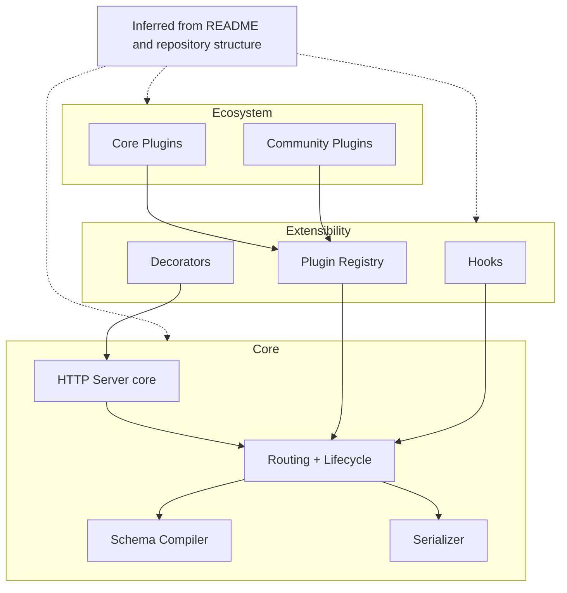

## Table of contents

- [Executive answer](#executive-answer)
- [Purpose and core positioning](#purpose-and-core-positioning)
- [Snapshot — repository facts (evidence)](#snapshot-repository-facts-evidence)
- [Maintenance signals and repository health](#maintenance-signals-and-repository-health)
- [Intended users and typical use cases](#intended-users-and-typical-use-cases)
- [Evidence-backed strengths](#evidence-backed-strengths)
- [Limitations and cautionary points](#limitations-and-cautionary-points)
- [Repository architecture (inferred)](#repository-architecture-inferred)
- [Data snapshot image](#data-snapshot-image)
- [Evaluation checklist (technical due diligence)](#evaluation-checklist-technical-due-diligence)
- [Action checklist — responsible adoption path](#action-checklist-responsible-adoption-path)
- [Evidence, assumptions, and limitations](#evidence-assumptions-and-limitations)
- [Decision checklist (quick go/no-go)](#decision-checklist-quick-go-no-go)
- [Sources](#sources)
- [FAQ](#faq)

## Executive answer

Fastify (fastify/fastify) is a production-ready Node.js web framework focused on low overhead, JSON-schema-driven validation/serialization, and a plugin-first extensibility model. The repository demonstrates active maintenance (frequent pushes, an up-to-date release cadence, and CI badges), a substantial contributor base and governance structure, and clear documentation and support pathways. These signals indicate the project is suitable for teams that need a performant, extensible HTTP framework for Node.js and are comfortable integrating third-party plugins and following repository guidance.

Adoption should be deliberate: use Fastify when you need its combination of performance and a schema-centric approach, validate compatibility with your Node.js versions and plugins, and follow the repository's maintenance practices (CI, security disclosures, LTS docs). The guidance and checklists below are based only on facts and metadata surfaced from the repository and its latest release; the data in this article was retrieved/generated on 2026-09-06 (UTC) and cites the repository and latest release pages for evidence [Fastify canonical repository](https://github.com/fastify/fastify) and [Fastify latest GitHub release](https://github.com/fastify/fastify/releases/tag/v5.12.2).

## Purpose and core positioning

Fastify's stated purpose in repository materials is to provide a fast, low-overhead web framework for Node.js that emphasizes developer experience, extensibility, and performance while encouraging schema-based validation and serialization. It exposes features to developers such as a plugin system, hooks, and an option to use JSON Schema for route validation and response serialization.

Evidence:

- The repository description and documentation linked from the project root identify it as a "Fast and low overhead web framework, for Node.js" and surface plugin/hook/decorator concepts (see repository README and docs) [Fastify canonical repository].

## Snapshot — repository facts (evidence)

| Field | Value |
|---|---:|
| GitHub repository | fastify/fastify ([source])([Fastify canonical repository]) |
| Language | JavaScript |
| License | MIT |
| Stars (interest signal) | 37,096 (GitHub stars listed in repository metadata) |
| Forks | 3,017 |
| Watchers | 375 |
| Open issues | 149 (open issues shown in repository metadata) |
| Default branch | main |
| Created | 2016-09-28T19:10:14Z |
| Last pushed | 2026-09-05T09:42:37Z |
| Latest release | v5.12.2 published 2026-09-04 (security release) ([release])([Fastify latest GitHub release]) |

Notes:
- GitHub stars are an interest signal, not an adoption or market-share measurement. The numbers above are repository metadata captured from the repository pages cited [Fastify canonical repository].

## Maintenance signals and repository health

The repository shows several indicators of active maintenance:

- Frequent commits and a recent push (pushed_at: 2026-09-05T09:42:37Z) and a recent release (v5.12.2 published 2026-09-04T08:20:39Z) that is explicitly a security release addressing multiple advisories ([Fastify latest GitHub release]).
- CI badges and multiple workflow files referenced in the README (CI, package-manager CI, website builds), indicating automated checks are part of PR validation and release flows [Fastify canonical repository].
- A documented Long Term Support (LTS) policy and a support/help repository referenced in documentation that points to a support process for issues and end-of-life versions [Fastify canonical repository].

Table — maintenance signals summary

| Signal | Present in repo? | Source evidence |
|---|---:|---|
| Recent push & release | Yes | pushed_at and latest_release metadata [Fastify canonical repository], [Fastify latest GitHub release] |
| CI workflows | Yes | CI badges and workflow file references in README [Fastify canonical repository] |
| Security disclosure policy | Yes | SECURITY.md link and release notes referencing fixes [Fastify canonical repository], [Fastify latest GitHub release] |
| Governance / team list | Yes | Lead maintainers and core/plugins team listed in README [Fastify canonical repository] |

> [!NOTE]
> "Recent" here is anchored to the repository metadata retrieval date (2026-09-06 UTC). Dates cited are taken from the project metadata; evaluate freshness against your deployment timeline.

## Intended users and typical use cases

Fastify is aimed at backend engineers and teams building HTTP services in Node.js who prioritize:

- Lower framework overhead for microservices or high-traffic endpoints.
- Strong JSON-schema-based request validation and fast serialization of responses.
- Extensibility via plugins to assemble server functionality with clear encapsulation.

Explicit repository materials include quick-start instructions and a project generator for scaffolding apps, which lowers onboarding friction for developers familiar with Node.js package tooling [Fastify canonical repository].

## Evidence-backed strengths

The repository content and release metadata back the following strengths:

1. Performance orientation: the README and linked benchmarks emphasize low overhead and provide a synthethic micro-benchmark used by maintainers. Those benchmarks are explicitly synthetic and intended to evaluate framework overhead rather than real-world app performance [Fastify canonical repository].
2. Plugin-first architecture: documentation and examples emphasize plugins, hooks, and decorators as primary extension mechanisms; the README and docs list plugin guides and a plugin team, implying a strong ecosystem orientation [Fastify canonical repository].
3. Operational care: the repository maintains CI, package-manager checks, website builds, a security disclosure file, and explicit LTS guidance — indicators the maintainers treat operational stability seriously [Fastify canonical repository].
4. Active release management: the presence of a security-focused release (v5.12.2) published 2026-09-04 that enumerates fixes to advisories demonstrates an active response to security reports [Fastify latest GitHub release].

Table — strengths linked to repository evidence

| Strength | Repository evidence |
|---|---|
| Performance focus | README claims and benchmark references; serialization/JSON Schema guidance in docs [Fastify canonical repository] |
| Extensibility via plugins | Dedicated plugin documentation, plugin team, and examples [Fastify canonical repository] |
| CI and release hygiene | CI badges, workflow references, recent release notes [Fastify canonical repository], [Fastify latest GitHub release] |
| Security responsiveness | SECURITY.md in repo and security release notes for v5.12.2 [Fastify canonical repository], [Fastify latest GitHub release] |

## Limitations and cautionary points

1. Scope constraints: Fastify is an HTTP framework for Node.js; it does not provide out-of-the-box solutions for non-HTTP backend needs (e.g., specialised background job systems). The repository and docs focus on server, routes, hooks, plugins, and HTTP features [Fastify canonical repository].
2. Ecosystem integration risk: while the plugin ecosystem is a strength, plugin compatibility and quality can vary. The repository provides core plugins and a community plugin list; evaluate any community plugin individually for maintenance and compatibility before adoption [Fastify canonical repository].
3. Benchmarks are synthetic: benchmark numbers included in repository materials come from synthetic "hello world" tests intended to measure framework overhead. They should not be treated as guaranteed production throughput; teams must benchmark with representative workloads in their environment [Fastify canonical repository].

> [!WARNING]
> Do not treat repository stars or the published synthetic benchmarks as direct indicators of production suitability or expected throughput. Perform your own benchmarking and compatibility testing before deployment.

## Repository architecture (inferred)

The repository structure and documentation emphasize a core server implementation augmented by plugins, hooks, route schemas, and decorators. The diagram below is an architectural inference derived from the README and repository structure (explicitly labeled as inferred):

This diagram is an interpretation of repository documentation and listings of core/plugin teams; it should be treated as an inferred overview rather than a formal architectural map produced by the project.

## Data snapshot image

## Evaluation checklist (technical due diligence)

Use this checklist when evaluating Fastify for a specific project. Each row links the check to repository evidence.

| Check | How to validate | Evidence/source |
|---|---|---|
| Node.js compatibility | Confirm supported Node versions in docs and test matrix; run your app's test suite on target Node versions | Repository docs and CI workflows [Fastify canonical repository] |
| Plugin compatibility | Identify required plugins; check their repos for maintenance, CI, releases | Plugin listings in docs and the plugin team references [Fastify canonical repository] |
| Security posture | Review SECURITY.md, recent releases, and advisories; subscribe to repo security alerts | SECURITY.md and v5.12.2 release notes [Fastify canonical repository], [Fastify latest GitHub release] |
| Performance | Run representative benchmarks (not synthetic hello-world) in your environment | README benchmark notes (synthetic) but run internal tests [Fastify canonical repository] |
| Operational readiness | Verify CI, release, and LTS processes align with your org's maintenance needs | CI badges, LTS docs, and release cadence [Fastify canonical repository] |
| Licensing | Ensure MIT license is compatible with your distribution and contribution policies | LICENSE file & metadata (MIT) [Fastify canonical repository] |

## Action checklist — responsible adoption path

1. Proof-of-concept: scaffold a minimal service using Fastify's official generator or an example project and exercise expected request patterns.
2. Dependencies audit: list the plugins and third-party middleware you plan to use; validate each for maintenance and licenses.
3. Benchmark with representative workloads: use real request shapes, payload sizes, and concurrency expected in production. Treat results as comparative data, not absolute guarantees (repository benchmarks are synthetic) [Fastify canonical repository].
4. Security integration: subscribe to repository security advisories, import the project’s security guidance (SECURITY.md), and schedule dependency scans.
5. Operationalize logging and error handling per repository recommendations (Pino is the logger promoted in repo docs) and integrate existing monitoring tooling.
6. Release and upgrade plan: align your LTS and upgrade cadence with the project's stated LTS guidance and track the main branch vs. release branches for breaking changes [Fastify canonical repository].
7. Contribute back: when you discover bugs, provide minimal reproducible examples and follow the CONTRIBUTING guidelines to help the project and your future self.

> [!TIP]
> For early-stage adoption, pin to a specific released version and run upgrades in a staging environment. Fastify provides LTS documentation and a support/help repo referenced in project docs to plan upgrades [Fastify canonical repository].

## Evidence, assumptions, and limitations

- Evidence used in this profile is limited to the supplied sources: the canonical GitHub repository for fastify/fastify and the v5.12.2 release page. All repository metadata (stars, forks, push dates, release info, badges, team lists, and README content excerpts) are drawn from those sources. See the "Sources" section for direct links.
- Dates and counts (stars, forks, watchers, open issues, pushed_at, updated_at, created_at) are taken from the repository metadata snapshot and are accurate as of the generation timestamp, 2026-09-06T01:42:20.589758+00:00. These values will change over time; treat them as a point-in-time snapshot.
- Where architecture or behavior is described beyond raw metadata (for example, the plugin-first model, serializer and schema compilation, and logger recommendations), those descriptions are paraphrased interpretations of the project's documentation. Per the publication rules, architectural conclusions that rely on repository docs or structure are explicitly labeled as inferred earlier in the architecture section.
- Benchmarks mentioned in the repository (for example, synthetic hello-world numbers) are reported by the project itself; they are synthetic and intended to show framework overhead. They are not guarantees of real-world throughput and should not substitute for application-specific performance testing.
- We did not consult external sources beyond the two supplied links; any community signals outside the repository (e.g., third-party surveys, company usage) are outside the scope of this profile.

## Decision checklist (quick go/no-go)

- Go if:
  - Your team needs a high-performance Node.js HTTP framework with schema-driven validation and a plugin ecosystem and you have resources to evaluate plugin compatibility.
  - You can pin releases and run representative benchmarks and security scans before production rollout.
- Consider alternatives if:
  - Your application requires features outside an HTTP framework (e.g., specialized job processing) and you prefer a single monolithic platform.
  - You cannot tolerate frequent minor breaking changes and rely on older Node versions that Fastify no longer supports; check LTS docs and support life-cycle first.

## Sources

- Fastify canonical repository: https://github.com/fastify/fastify
- Fastify latest GitHub release (v5.12.2): https://github.com/fastify/fastify/releases/tag/v5.12.2

## FAQ

### What is Fastify and who maintains it?
Fastify is a Node.js web framework centered on low overhead, schema-driven validation/serialization, and a plugin-first architecture. The repository lists a group of lead maintainers and core/plugin teams in its README; maintainers and team details are visible in the repository documentation [Fastify canonical repository].

### Is Fastify actively maintained and secure?
Yes — as of the 2026-09-06 snapshot, the repository shows recent pushes and a security-focused release (v5.12.2 published 2026-09-04) that addresses multiple advisories. The project publishes a SECURITY.md and uses CI workflows, indicating active maintenance and security responsiveness [Fastify canonical repository], [Fastify latest GitHub release].

### Are the benchmark numbers in the repository a good guide for my application performance?
No. The repository includes synthetic "hello world" benchmarks to measure framework overhead. These are useful for comparing framework baseline overhead but do not predict production performance for real applications. You should run representative benchmarks in your environment [Fastify canonical repository].

### How should I evaluate third-party plugins for use with Fastify?
Treat each plugin as an independent dependency: check its repository for recent activity, CI, issue triage, compatibility notes, and license. The Fastify repo maintains a list of core and community plugins, but the quality and maintenance of community plugins vary [Fastify canonical repository].

### Does Fastify support TypeScript?
The repository documents a TypeScript and types support guide (listed in docs). Validate that the types and your toolchain align with the Fastify version you plan to use [Fastify canonical repository].

### How do I stay informed about security fixes and releases?
Subscribe to the repository's security advisories and watch the repository for releases. The project provides a SECURITY.md and publishes release notes; v5.12.2 is a recent example of a security release ([Fastify latest GitHub release]).

### What license covers Fastify?
Fastify is distributed under the MIT license; check the LICENSE file in the repository for details [Fastify canonical repository].
