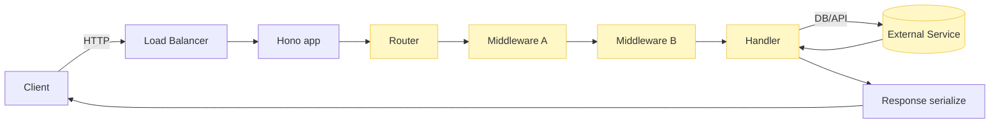

Executive answer

Hono performance tuning is primarily about measuring the right things in representative environments, then iterating on the hot paths (router, middleware, I/O). Build measurement suites that exercise realistic request shapes, instrument server-side endpoints at specific boundaries (router entry, middleware exit, handler start/end, external I/O), and use profiling snapshots to prioritize optimizations. Treat the router and middleware as first-class concerns because Hono advertises lightweight, multi-runtime routing and middleware support (see the repository) and those areas concentrate per-request overhead.

Make performance regressions part of CI with deterministic workloads, stable environments, and clear pass/fail criteria. Beware of common benchmarking traps: microbenchmarks that exclude network or I/O, cold-start-only numbers, and comparing different runtimes or deployment configurations without normalizing resource limits. Use local and production-like measurements, add cache and concurrency experiments, and validate assumptions with sampling profilers and observability traces before changing architecture.

Table of contents

- [Quick facts and evidence](#quick-facts-and-evidence)
- [Measurement design: what to measure and why](#measurement-design-what-to-measure-and-why)
- [Representative workloads and test harness design](#representative-workloads-and-test-harness-design)
- [Profiling: where to instrument Hono apps](#profiling-where-to-instrument-hono-apps)
- [Caching, I/O, and resource boundaries](#caching-io-and-resource-boundaries)
- [Concurrency, multi-runtime, and runtime limits](#concurrency-multi-runtime-and-runtime-limits)
- [Database and network boundaries: isolating remote slowness](#database-and-network-boundaries-isolating-remote-slowness)
- [CI regression checks and performance gates](#ci-regression-checks-and-performance-gates)
- [Misleading benchmark patterns to avoid](#misleading-benchmark-patterns-to-avoid)
- [Decision checklist / Action checklist](#decision-checklist--action-checklist)
- [Evidence, assumptions, and limitations](#evidence-assumptions-and-limitations)
- [Sources](#sources)
- [FAQs](#faqs)

## Table of contents

- [Quick facts and evidence](#quick-facts-and-evidence)
- [Measurement design: what to measure and why](#measurement-design-what-to-measure-and-why)
- [Representative workloads and test harness design](#representative-workloads-and-test-harness-design)
- [Profiling: where to instrument Hono apps](#profiling-where-to-instrument-hono-apps)
- [Caching, I/O, and resource boundaries](#caching-i-o-and-resource-boundaries)
- [Concurrency, multi-runtime, and runtime limits](#concurrency-multi-runtime-and-runtime-limits)
- [Database and network boundaries: isolating remote slowness](#database-and-network-boundaries-isolating-remote-slowness)
- [CI regression checks and performance gates](#ci-regression-checks-and-performance-gates)
- [Misleading benchmark patterns to avoid](#misleading-benchmark-patterns-to-avoid)
- [Decision checklist -- Action checklist](#decision-checklist-action-checklist)
- [Evidence, assumptions, and limitations](#evidence-assumptions-and-limitations)
- [FAQs](#faqs)

## Quick facts and evidence

- Primary repository: [honojs/hono](https://github.com/honojs/hono). The repository metadata (stars, language, license, and timestamps) referenced below was retrieved on 2026-07-13.
- Selected repository metadata (evidence): stars: 31,332; forks: 1,163; open issues: 359; language: TypeScript; license: MIT. Latest published release in the repository metadata is v4.12.30 (published 2026-07-13). See the repository and the release for source details and changelog: [Hono canonical repository](https://github.com/honojs/hono) and [Hono latest GitHub release](https://github.com/honojs/hono/releases/tag/v4.12.30).

> [!NOTE]
> Repository numbers (stars, forks, open issues) are signals of interest and activity; they are not direct measures of production usage or performance. The values above are taken from the repository metadata on 2026-07-13.

> [!TIP]
> When reproducing experiments, include the repository commit/tag and the runtime version used. Hono is promoted as multi-runtime (Cloudflare Workers, Deno, Bun, Node.js, etc.), so runtime differences will affect measurements.

## Measurement design: what to measure and why

A pragmatic measurement design focuses on latency, throughput, and resource efficiency across representative scenarios.

Core metrics to capture

- Latency percentiles (p50, p90, p99) for end-to-end request time, and separate router/middleware/handler timing.
- Throughput (requests per second) under sustained load with controlled concurrency.
- CPU and wall-clock time per request, and allocations if your runtime exposes object allocation metrics.
- Memory consumption per process/worker and resident set size (RSS) behavior under load.
- Cold-start time for serverless environments (if applicable).
- Error rates and timeouts as throughput increases.

Measurement boundaries

- End-to-end: client -> network -> runtime -> Hono app -> external I/O -> response. Useful for production-like validation.
- In-process: router entry -> middleware -> handler -> handler end. Useful for isolating framework overhead.
- I/O boundaries: time spent waiting on external services (DB, upstream APIs, caches).

Table: Metric definitions and why they matter

| Metric | Definition (what to measure) | Why it matters |
|---|---:|---|
| p50/p90/p99 latency | Response latency percentiles measured end-to-end and per-internal stage | Captures typical and tail behavior; guides SLO design |
| Throughput (RPS) | Requests per second sustained under load | Indicates system capacity and saturation points |
| CPU time / allocations | CPU-seconds and allocation rates per request | Highlights CPU-bound vs allocation-heavy paths |
| Memory RSS & GC behavior | Resident memory and GC pauses | Prevents OOM and GC-induced tail latency |
| Cold-start | Time from invocation to first byte served (serverless) | Important for latency-sensitive serverless use cases |

> [!WARNING]
> Measuring only p50 or only average latency hides tail behaviors that affect user experience. Always include p90/p99 in performance budgets.

## Representative workloads and test harness design

Design workloads that mirror production request patterns and failure modes.

Workload categories

- Static content: small payloads served from memory or filesystem; tests router and compression paths.
- JSON API: typical REST endpoints returning small/medium JSON payloads; exercise serialization and middleware.
- Streaming/large responses: responses that exercise streaming APIs, backpressure, or partial content handling.
- CPU-bound handlers: synthetic handlers to exercise CPU work per-request (only for capacity planning, not product logic).
- I/O-bound handlers: simulate DB/API latency to measure concurrency behavior when blocked on external calls.

Representative test harness components (without inventing product-specific commands)

- Client driver: repeatable load generator that supports controlled concurrency, warm-up, and ramp-up phases.
- Environment control: use fixed CPU/memory allocations, pinned runtime versions, and isolated network to reduce variance.
- Warm-up runs: drop initial samples to exclude cold-start noise.
- Reproducible scenario definitions: store payloads, headers, and concurrency profiles in version control.

Table: Workload design checklist

| Workload type | What to include | When to use |
|---|---:|---|
| Static files | Small/medium static payloads, compression toggle | Test router + static middleware overhead |
| JSON endpoints | Typical payloads and auth headers | Measure real API latency and serialization cost |
| Streaming | Large payloads, range requests | Validate streaming, chunking, compression behavior |
| I/O simulated | Introduce timed delays representing DB/API | Evaluate concurrency and resource contention |
| Stress/soak | Long-duration sustained load | Verify stability, memory growth, GC behavior |

> [!TIP]
> Use separate harness configurations for local experiments and CI. CI should run smaller, deterministic workloads; local labs can run longer soak tests.

## Profiling: where to instrument Hono apps

Prioritize these instrumentation points inside the Hono request lifecycle:

- Router entry (time request enters the framework)
- Route lookup / pattern matching (to isolate router cost)
- Middleware start/end boundaries (each middleware layer)
- Handler start/end (business logic)
- Before and after external I/O (DB calls, HTTP requests)
- Response serialization / streaming completion

Because Hono aims to be minimal and fast, the router and middleware are likely to appear frequently in hot paths. (Architectural inference: the repository README and structure reference multiple router implementations such as RegExpRouter; this is an inferred design detail taken from the public project readme and code layout.)

Sampling vs. continuous profiling

- Use sampling profilers to get low-overhead snapshots of CPU and call stacks in production-like load.
- Use allocation and flamegraph profilers in a staging environment to gather heap/alloc information.
- Combine short high-resolution profiles (for hotspots) with longer, low-overhead tracing (for distribution and latency spikes).

Instrumentation data collection

- Correlate profiler outputs with request IDs and trace spans when possible.
- Capture environment and runtime versions with each profile to ensure reproducibility.

Mermaid: simplified request flow with instrumentation points

## Caching, I/O, and resource boundaries

Caching strategies

- Edge caching (where supported by runtime) for cacheable responses. Validate cache-control headers and interaction with Hono-level middleware.
- In-memory caches: appropriate for single-process environments; watch eviction policies and memory pressure.
- Shared caches (Redis, CDN, managed caches): ideal for horizontally scaled Hono workers; measure cache hit/miss rates and tail latency impact.

I/O best practices

- Batch remote calls where possible and appropriate to reduce RTTs.
- Use streaming responses for large payloads to reduce memory pressure and latency spikes.
- Ensure middleware that proxies or transforms bodies respects streaming semantics to avoid unnecessary buffering.

Table: Cache types and trade-offs

| Cache location | Strengths | Limitations |
|---|---:|---|
| Edge/CDN | Very low latency for cached responses; offloads origin | Limited to cacheable content; invalidation can be complex |
| Shared cache (Redis) | Centralized, consistent cache across instances | Network hop adds latency; single point to monitor |
| In-process | Fast access, zero network cost | Not usable for multi-process scaling; memory limited |

> [!WARNING]
> An in-process cache can mask real production contention when your service is later scaled horizontally. Validate any optimizations that rely on in-process state under multi-instance deployments.

## Concurrency, multi-runtime, and runtime limits

Hono is promoted as multi-runtime. Runtime behavior (thread model, event loop, worker isolation) will influence concurrency and latency characteristics. The repository indicates multi-runtime support (Cloudflare Workers, Bun, Deno, Node.js) in its documentation, which informs measurement strategy (architectural inference from README and topics).

Concurrency considerations

- Node.js: event-loop concurrency; CPU-bound handlers block progress unless offloaded (workers or external services).
- Serverless runtimes (Workers, Lambda): instance concurrency and cold-start behavior vary—measure cold-start and steady-state separately.
- Deno/Bun: runtime-specific I/O and scheduling differences can influence allocations and serialization performance.

Capacity planning

- Use load tests to discover where the system saturates: CPU, memory, network, or external services.
- For request-concurrency targets, measure p99 latency while increasing concurrency until latency breaches SLO.

> [!TIP]
> When comparing runtimes, normalize resource constraints (CPU count, memory) and use identical workloads. Record runtime versions and flags with each result.

## Database and network boundaries: isolating remote slowness

Remote services are often the dominant source of latency and tail events. Put in place patterns to isolate and mitigate:

- Timeouts and circuit breakers at client boundaries to prevent cascading failures and unbounded waits.
- Bulkheading (separate connection pools or rate limits per downstream) to prevent one noisy dependency from consuming all resources.
- Retain per-request tracing that includes remote call timings to assign blame to upstreams accurately.

Detecting remote slowness

- Correlate request traces with remote call start/end times; if remote calls dominate latency, optimize caching or parallelize independent calls.
- If remote calls are variable, simulate realistic error and latency profiles in load tests (inject delays and intermittent failures) to validate resilience.

## CI regression checks and performance gates

CI should guard against regressions with deterministic, fast checks and optional periodic longer tests.

Recommended CI tiers

- Quick smoke (on every PR): run unit tests, sanity-run a small set of representative endpoints with fixed inputs, check that median latency and basic success rates are within broad bounds.
- Nightly/regression: run longer, reproducible workload runs with comparison to a baseline run stored in artifact storage. Capture p50/p90/p99 and resource metrics.
- Periodic soak: weekly or nightly long-duration runs to check for memory leaks and resource drift.

Designing CI checks (principles)

- Avoid flaky checks: use stable runtimes and pinned versions; run in isolated environments when possible.
- Accept small natural variance; set thresholds that are meaningful (for example, small percentage-change guards rather than absolute microsecond numbers) unless you have capacity to run deterministic benchmarks on identical hardware.
- Store raw results and metadata (commit hash, runtime version, environment) as artifacts for post-failure triage.

> [!TIP]
> For PR-level checks, prefer fast functional and smoke performance checks. Reserve heavy performance comparisons for scheduled jobs to avoid CI bottlenecks.

## Misleading benchmark patterns to avoid

Table: Misleading patterns, why they're wrong, and what to do instead

| Misleading pattern | Why it misleads | What to do instead |
|---|---:|---|
| Microbenchmarks that exclude I/O | They isolate only framework overhead and do not reflect real user paths | Include representative I/O or clearly label microbenchmarks as synthetic |
| Comparing runtimes without normalizing resources | Different CPU/memory limits, JIT behavior, and GC cause invalid comparisons | Run on identical hardware or container limits, and report runtime versions |
| Using only average/p50 latency | Hides tail latencies that affect user experience | Report p90/p99 and error rates alongside averages |
| Reporting cold-start only | Cold-starts matter for serverless but are not the steady-state picture | Report both cold-start and steady-state metrics with warm-up behavior |
| Single-run results | Single runs show noise; they may not be reproducible | Use multiple runs and report distribution and variance |

> [!WARNING]
> Avoid using repository star counts or issue counts as proxies for performance or production readiness. They are community signals, not technical metrics.

## Decision checklist -- Action checklist

- [ ] Capture baseline end-to-end and in-process metrics for a canonical endpoint.
- [ ] Add instrumentation points: router entry, middleware boundaries, handler start/end, and external I/O timings.
- [ ] Design 3 representative workloads: static, JSON API, and I/O-bound; store payloads in version control.
- [ ] Run sampling profiler under representative sustained load and produce flamegraphs.
- [ ] Evaluate caching strategy (edge vs shared vs in-process) and measure hit/miss impact on latency.
- [ ] Add CI smoke performance checks and schedule nightly regression runs that persist artifacts.
- [ ] Define acceptable regression thresholds and document variance handling procedures.

## Evidence, assumptions, and limitations

Evidence

- Repository facts (stars, forks, language, license, release date) were taken from the [honojs/hono GitHub repository](https://github.com/honojs/hono) and the repository's latest release page on 2026-07-13.

Assumptions (explicit)

- Hono targets multiple runtimes—this is documented in the project materials and informs the recommendation to normalize runtimes during measurement. This architectural conclusion is an inference from the project's README and topics.
- The article assumes teams have access to representative test environments (local or cloud) where resource constraints and versions can be controlled.

Limitations

- This checklist intentionally avoids synthetic numeric benchmarks. Do not expect concrete throughput or latency numbers here; you must measure on your own workloads and environment.
- Runtime-specific tuning (V8 flags, Worker platform internals) is out of scope; treat this as a framework-level checklist focusing on measurement, profiling, and validation patterns.

## Sources

- Hono canonical repository: https://github.com/honojs/hono
- Hono latest GitHub release: https://github.com/honojs/hono/releases/tag/v4.12.30

## FAQs

1. Question: Do I need to test every runtime Hono supports?
Answer: Test the runtimes you plan to deploy to. If you maintain multi-runtime deployments, normalize resource limits and add per-runtime baselines, because scheduling, GC, and I/O semantics differ across runtimes.

2. Question: Should I trust microbenchmark claims labelled “ultrafast”?
Answer: Use microbenchmarks to understand framework overhead but validate with representative workloads that include your serialization, middleware, and external I/O.

3. Question: How do I spot router overhead in traces?
Answer: Instrument router entry and route matching separately from handler execution. If routing accounts for a significant fraction of in-process time, consider reviewing route patterns or middleware ordering.

4. Question: What's an acceptable CI performance delta?
Answer: That depends on your environment and SLOs. Use percentage thresholds (e.g., a few percent at median) and tighter thresholds for tail latency only if tests are sufficiently deterministic.

5. Question: Can in-process caches improve Hono latency?
Answer: Yes for single-process deployments, but they can hide problems when you scale. Prefer shared caches or ensure your tests exercise multi-instance scenarios.

6. Question: How often should I run long-duration soak tests?
Answer: Periodic longer tests (nightly or weekly) are advisable to detect memory leaks and resource drift. CI should also include faster smoke checks on every PR.

7. Question: Where can I find the Hono code and release notes mentioned?
Answer: See the project's repository and releases: [Hono canonical repository](https://github.com/honojs/hono) and [Hono latest GitHub release](https://github.com/honojs/hono/releases/tag/v4.12.30).

## FAQ

### Do I need to test every runtime Hono supports?

Test the runtimes you plan to deploy to. If you maintain multi-runtime deployments, normalize resource limits and add per-runtime baselines; scheduling, GC, and I/O semantics differ across runtimes.

### Should I trust microbenchmark claims labelled “ultrafast”?

Use microbenchmarks to understand framework overhead but validate with representative workloads that include your serialization, middleware, and external I/O.

### How do I spot router overhead in traces?

Instrument router entry and route matching separately from handler execution. If routing accounts for a significant fraction of in-process time, review route patterns and middleware ordering.

### What's an acceptable CI performance delta?

It depends on your environment and SLOs. Use percentage thresholds and tighter limits for tail latency only if tests are deterministic and run on identical environments.

### Can in-process caches improve Hono latency?

Yes for single-process deployments, but they can mask problems when scaling horizontally. Prefer shared caches or validate cache behavior under multi-instance tests.

### How often should I run long-duration soak tests?

Run periodic longer tests (nightly or weekly) to detect memory leaks and resource drift; keep PR-level checks fast and deterministic.

### Where can I find the Hono code and release notes?

See the project's repository and release pages: the Hono GitHub repo and the v4.12.30 release linked in the Sources section.
