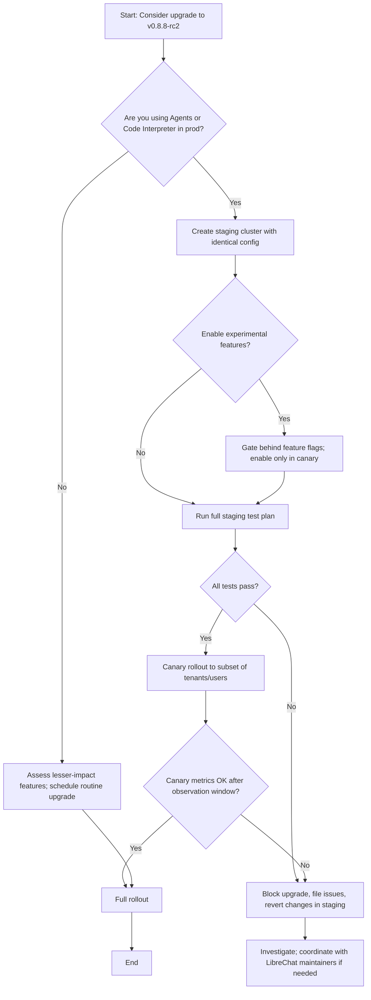

> [!NOTE]
> Repository signals for LibreChat were collected at generation time and should be re-checked before production decisions.

> [!TIP]
> Start with a narrow integration spike, then expand scope only after observability and rollback paths are in place.

> [!WARNING]
> GitHub stars, fork counts, and open-issue totals are weak proxies for security or operational readiness.

## Table of contents

- [Executive answer](#executive-answer)
- [What changed (fact-based summary)](#what-changed-fact-based-summary)
- [Who should care and why](#who-should-care-and-why)
- [Upgrade risk assessment (fact-grounded)](#upgrade-risk-assessment-fact-grounded)
- [Practical test plan (what to validate before upgrading)](#practical-test-plan-what-to-validate-before-upgrading)
- [Rollback plan](#rollback-plan)
- [Deployment recommendations and gating](#deployment-recommendations-and-gating)
- [Evidence, assumptions, and limitations](#evidence-assumptions-and-limitations)
- [Evidence used](#evidence-used)
- [Assumptions and inferences (explicitly labeled)](#assumptions-and-inferences-explicitly-labeled)
- [Limitations](#limitations)
- [Data & repository snapshot](#data-repository-snapshot)
- [Action checklist (Decision checklist)](#action-checklist-decision-checklist)
- [Upgrade decision flow (Mermaid)](#upgrade-decision-flow-mermaid)
- [Remaining questions and gaps in the release notes](#remaining-questions-and-gaps-in-the-release-notes)
- [Sources](#sources)
- [FAQ](#faq)

## Executive answer

LibreChat's v0.8.8-rc2 release introduces a broad set of agent-focused capabilities, durable automation primitives, expanded Code Interpreter workflows, new model additions, and multiple operational hardening features. The release notes (v0.8.8-rc2) enumerate agent run control, unified agent builder improvements, durable Agent Events, background tools, experimental agent plugins, scheduled chats, memory controls, and several reliability and security improvements. These items are documented in the project's public changelog and README material [linked from the repository and changelog](https://github.com/danny-avila/LibreChat) and [v0.8.8-rc2 changelog](https://www.librechat.ai/changelog/v0.8.8-rc2).

For engineering teams that self-host LibreChat for internal assistants, research, or product integrations, the most material changes are the agent orchestration and durable automation features (which affect long-running workflows), the Code Interpreter improvements (file artifacts and experimental stateful sessions), and the security/authentication hardening (default HTTP headers, SAML, JWT handling). Upgrade planning should focus on testing long-run agent scenarios, Code Interpreter sandboxing behavior, and authentication flows. The remainder of this article explains what changed (factually from the public changelog), who should care, practical test and rollback plans, and the open questions left by the release notes. Data in this article was collected from the project's public repo and changelog; generation timestamp: 2026-09-06T01:40:39.407564+00:00.

## What changed (fact-based summary)

Below are the high-level items described in the v0.8.8-rc2 changelog and README content available in the repository. Each item is drawn from the release text and paraphrased — no new functionality is invented here. See the linked changelog for full wording and context: https://www.librechat.ai/changelog/v0.8.8-rc2.

Table: Key features in v0.8.8-rc2

| Area | Core changes (as described in the changelog) |
|---|---|
| Agents & Orchestration | Agent run control (interrupt before answer text, durable follow-ups), agent activity labels, human-in-the-loop streaming questions, unified Agent Builder for Skills/MCP/Tools, subagent history and branch-aware child turns, Agent Plugins (experimental), saved Agent teams as Subagent graphs. |
| Durable Automation & Events | Authenticated Agent Events with bound child actors, expected-action receipts, per-actor mailboxes, event batching, durable human pauses, automatic detached Actions, and support across built-in stream stores. |
| Background & Tools | Background tool execution (Code Interpreter, MCP, Plugins, Actions), automatic delivery for supported completions, and polling controls. |
| Code Interpreter | Sandboxed images as viewable artifacts, experimental stateful sessions (scoped managed/attached/personal environments), per-message file downloads, and guarded file-write/command permissions. |
| Memory & Context | Optional isolated memory for Agents, adaptive context fading preservation, categorized current-window usage, token and optional cost visibility. |
| Scheduling & Projects | Experimental Scheduled Chats (cron, time zones, multi-day cadence), Projects and improved navigation/search for conversation titles and settings. |
| Models & Providers | Added model entries including GPT-5.6 Responses, Claude Fable 5.1, Opus 5, Sonnet 5, and several Gemini variants. Support for many providers and custom endpoints persists. |
| Security & Auth | Default HTTP security headers, opt-in nonce CSP, authenticated local images, per-user Code Interpreter JWTs, stable SAML identity binding, live-session OpenID token refresh, retired JWT-secret rejection. |
| Observability & Admin | Langfuse observability options, tenant Insights, delegated configuration, source-aware content filters, encrypted secrets, expiring violation scores. |
| Streaming & Reliability | Resumable streams, adaptive smoothing, Redis delta batching/failover recovery, automatic generation protocol v2, Agent circuit breakers, DocumentDB support. |

[!NOTE]
This table is a synthesis of the project's published changelog material for v0.8.8-rc2 and the README content in the repository. All items are taken from the project's public release text; consult the full changelog for the canonical phrasing: https://www.librechat.ai/changelog/v0.8.8-rc2.

## Who should care and why

- Operators and SREs running self-hosted LibreChat clusters: the release lists a set of reliability, streaming, and Redis/DocumentDB integration changes that affect production runs and long-lived agent work.
- Security and identity teams: the release adds default HTTP security headers, opt-in nonce CSP, SAML improvements, per-user JWTs for Code Interpreter, and token refresh behavior — all of which change authentication and token lifecycles.
- Product and AI platform engineers building user-facing assistants: new Agent orchestration (human-in-the-loop, agent run control, subagents) and background tool execution change how complex multi-step flows are composed and observed.
- Teams using Code Interpreter or file workflows: the release expands artifacts (images viewable) and describes experimental stateful sessions — these affect file handling and sandboxing expectations.
- Integrators relying on model and provider cataloging: added models and provider controls may enable new routing, but will require configuration and validation.

## Upgrade risk assessment (fact-grounded)

This section maps the factual changes to likely areas of impact. Statements here are analytical and labeled where they are inferred.

Table: Risk map (change → likely impact)

| Change (from changelog) | Potential impact area | Risk level (inferred) | Why this matters (evidence-based rationale) |
|---|---:|---:|---|
| Durable Agent Events & background tools | Long-running workflows, event delivery, queues | Medium–High (inferred) | Durable events and background processing change execution timing and introduce new durable state surfaces; operators must validate mailbox and event batching behavior against production load. (Inferred from the presence of per-actor mailboxes and event batching in the changelog.) |
| Code Interpreter stateful sessions | Sandbox security, disk usage, session isolation | Medium (explicitly labeled experimental) | The changelog marks stateful sessions as highly experimental and describes scoped environments and guarded permissions; test isolation and file-write controls before enabling broadly. |
| Authentication changes (SAML, JWT refresh, retired secrets) | Login flows, token lifetimes, third-party SSO | Medium | SAML identity binding and token refresh behavior affect SSO; retired JWT-secret rejection means deployments using old secrets may need rotation. This is explicitly in the changelog. |
| Resumable streams & Redis delta batching | Client reconnection handling, stream stores | Low–Medium | Streaming changes aim to improve reconnections and batching; validate client behavior and Redis failover configurations. |
| Model additions | Model routing and cost | Low | Adding models is additive, but teams must validate provider credentials and routing rules. |

[!WARNING]
The risk levels above are inferred from the changelog text and the types of changes described (durable state, authentication, sandboxing). They are not drawn from internal test runs. Validate in a staging environment before production updates.

## Practical test plan (what to validate before upgrading)

Use the following test plan as a structured checklist. All tests map to explicit changelog items; where the release marks features as experimental, prioritize gating those behind feature flags.

Table: Test plan mapped to changelog items

| Test area | What to validate | Acceptance criteria |
|---|---|---|
| Agent run control & human-in-the-loop | Interrupts before visible answer text; "Keep going" / "Answer now" flows; streaming up to four related questions | Interrupt and resume operations do not leak state; follow-up queueing persists across reloads in staging. Human pauses resume as expected. |
| Durable Agent Events & mailboxes | Event delivery to bound child actors; event batching and receipts | Events are delivered to intended actor mailboxes; expected-action receipts generated; queued events survive short process restarts (in staging). |
| Background tools & automatic delivery | Tool runs continue while Agents proceed; artifact availability | Background tool outputs are attached/visible to the chat; artifacts delivered when supported. |
| Code Interpreter sandbox | Viewable image artifacts, per-message downloads, file-write permissions, experimental stateful session boundaries | Sandbox prevents writes outside scoped areas in controlled tests; images show as artifacts; stateful sessions (if enabled) are isolated per session type. |
| Authentication & sessions | SAML identity binding, OpenID refresh, per-user Code Interpreter JWTs, retired JWT-secret rejection | SSO login flows continue; OpenID tokens refresh during live sessions; deployments with rotated secrets fail fast with clear errors in logs. |
| Resumable streams & reconnects | Drop and resume streams; delta batching with Redis failover | Clients can reconnect and resume partial responses; Redis delta batching operates under simulated failover. |
| Admin & observability | Langfuse connections, tenant insights, encrypted secrets | Encrypted in-app connection tests produce expected telemetry; tenant Insights show expected data for test tenants. |
| Models & provider routing | Model selection and custom endpoints | Model endpoints accept requests and return expected responses in controlled tests; custom OpenAI-compatible endpoints work per docs. |

[!TIP]
For safety, run tests in an isolated staging cluster with identical configuration (env vars, provider credentials, SSO settings). Feature-flag experimental features (Code Interpreter stateful sessions, Agent Plugins, Scheduled Chats) and enable them progressively.

## Rollback plan

The changelog does not contain explicit upgrade or rollback commands. The rollback plan below is prescriptive guidance derived from typical self-hosted practices and the release's operational surface (services, Redis, stream stores). These are recommendations — confirm against your deployment architecture.

Rollback checklist

- Revert to the previously deployed container/image tags or commits. Keep the prior image and manifest available before starting the upgrade.
- If you use database migrations or schema changes during upgrade, ensure you have a pre-upgrade snapshot and tested migration rollback procedure.
- For event/mailbox stores (Redis, DocumentDB), ensure you can redirect traffic back to the previous store or restore data from backups; durable Agent Events introduce durable state that may not be safely rewound.
- Revoke any experimental features toggled on (stateful sessions, Agent Plugins, Scheduled Chats) and verify that disabling restores prior behavior.
- Rotate any new secrets or JWT keys introduced during the upgrade if necessary, and ensure token lifetimes are consistent with your auth policies.

[!WARNING]
Durable events and mailbox semantics can create irreversible stateful outcomes if not fully understood. If your deployment uses durable automation in production, prefer canary deployment or dark-launching to observe behavior before full cutover.

## Deployment recommendations and gating

- Canary first: enable the release in a small subset of users/tenants or a single region before cluster-wide rollout.
- Feature flags: gate experimental features (Agent Plugins, Code Interpreter stateful sessions, Scheduled Chats). The changelog marks these as experimental; enable them only after validation.
- Backups and snapshots: capture DB and stream-store snapshots immediately before upgrade.
- Monitoring: instrument observability (Langfuse or existing telemetry) to track event delivery rates, agent run durations, and Code Interpreter sandbox errors.

## Evidence, assumptions, and limitations

## Evidence used

- Primary evidence for this article is the LibreChat repository README and the v0.8.8-rc2 changelog text surfaced in the repository material. Links used in the article: the project's canonical repository [danny-avila/LibreChat on GitHub](https://github.com/danny-avila/LibreChat) and the published v0.8.8-rc2 changelog at https://www.librechat.ai/changelog/v0.8.8-rc2. The repo metadata (stars, forks, language, timestamps) is taken from the repository data provided to this article.

## Assumptions and inferences (explicitly labeled)

- Inferred: risk levels and operational impact are inferred from the feature descriptions in the changelog. Example: durable events introducing per-actor mailboxes implies durable state; that inference is logical but not confirmed by internal tests.
- Inferred: recommended test cases map to the features listed in the changelog; they are suggested based on standard practices for event-driven and sandboxed features.

## Limitations

- No internal CI/test results or runtime telemetry for v0.8.8-rc2 were available for this article. The assessment is based on public release notes and repository metadata only.
- The changelog references experimental features; the release notes do not include exact configuration steps, migration commands, or detailed schema changes, so specific rollback commands are not provided here.
- Latest release metadata field in the repository snapshot was null; the changelog and README reference v0.8.8-rc2, and repository push/update timestamps were used to indicate recency. Data generation timestamp: 2026-09-06T01:40:39.407564+00:00.

## Data & repository snapshot

Below is a quick snapshot of repository metadata present in the supplied evidence. This is factual data taken from the repository metadata provided to this article.

| Field | Value |
|---|---|
| Repo | danny-avila/LibreChat |
| Stars | 42846 |
| Forks | 8873 |
| Open issues | 746 |
| Language | TypeScript |
| License | MIT |
| Default branch | main |
| Last pushed (repo metadata) | 2026-09-06T01:32:59Z |

[!TIP]
Open-issue counts are signals of activity only; they are not a defect count. Use issue titles and labels to triage upgrade-blockers rather than raw open-issue numbers.

## Action checklist (Decision checklist)

- [ ] Review the full v0.8.8-rc2 changelog: https://www.librechat.ai/changelog/v0.8.8-rc2
- [ ] Run the test plan in an isolated staging environment with production-like config and credentials
- [ ] Back up databases and stream stores (Redis, DocumentDB) before upgrading
- [ ] Gate experimental features with feature flags and enable incrementally
- [ ] Validate authentication flows (SAML, OpenID token refresh, per-user JWTs) and rotate keys if required
- [ ] Perform a canary rollout and monitor observability signals (agent durations, event delivery, sandbox errors)
- [ ] Prepare rollback artifacts (previous images, configuration, DB snapshots) and a runbook for reverting durable event changes

## Upgrade decision flow (Mermaid)

## Remaining questions and gaps in the release notes

The public changelog lists many new features and improvements, but leaves some practical details unspecified (these are factual gaps, not assumptions):

- Migration details: The changelog does not include explicit migration steps (database schema updates, event-store migrations) that may be required when enabling durable events or background mailboxes.
- Configuration defaults: While default HTTP security headers are mentioned, the exact header set and the impact on embedded clients or reverse proxies are not enumerated in the release notes.
- Resource and capacity guidance: Background tool execution and durable agent work imply additional CPU, memory, and storage needs — the release notes do not quantify resource recommendations.
- Observability semantics: Langfuse integration and telemetry options are mentioned, but the exact events, payloads, and retention policies are not documented in the changelog text.
- Behavior under failure: The notes mention Redis delta batching and failover recovery but do not specify failure modes, backpressure behavior, or recommended Redis topologies.

These gaps mean you'll need to validate assumptions with staged testing and, where necessary, consult the project's maintainers or documentation for operational guidance.

## Sources

- LibreChat canonical repository: https://github.com/danny-avila/LibreChat
- LibreChat v0.8.8-rc2 changelog (referenced from the repo README): https://www.librechat.ai/changelog/v0.8.8-rc2

## FAQ

### What is the single most important change in v0.8.8-rc2?
The release's changelog emphasizes agent orchestration and durable automation features (Agent run control, durable Agent Events, subagents). For teams building multi-step assistants or long-running automation these items are the most impactful.

### Are any features marked experimental and how should I treat them?
Yes. The changelog explicitly marks Agent Plugins, Code Interpreter stateful sessions, and Scheduled Chats as experimental. Treat them as feature-flag-gated and validate in staging before enabling in production.

### Will upgrading automatically change authentication behavior for users?
The release notes list changes affecting authentication (SAML identity binding, OpenID token refresh, per-user Code Interpreter JWTs, and retired JWT-secret rejection). These are substantive changes; test SSO and token flows in staging and plan for secret/key rotation as needed.

### Does the release introduce breaking changes I must plan for?
The changelog warns readers to consult the full changelog for breaking changes but does not enumerate explicit breaking-change commands in the supplied text. Treat durable event handling and JWT-secret retirement as high-impact items to validate during testing.

### Where can I find the canonical changelog and documentation?
The canonical changelog referenced in the release notes is at https://www.librechat.ai/changelog/v0.8.8-rc2 and the repository is https://github.com/danny-avila/LibreChat. Use those links for authoritative upgrade instructions.

### What should I monitor immediately after upgrading?
Monitor agent run durations, event delivery success/failure rates, Code Interpreter sandbox errors or permission rejections, authentication/SSO login errors, and stream reconnection/retry telemetry (resumable streams). These areas map directly to the release's changes.

### How fresh is the data used in this article?
Repository metadata and changelog content used here were taken from the supplied repository snapshot and changelog links. Article data generation timestamp: 2026-09-06T01:40:39.407564+00:00.
