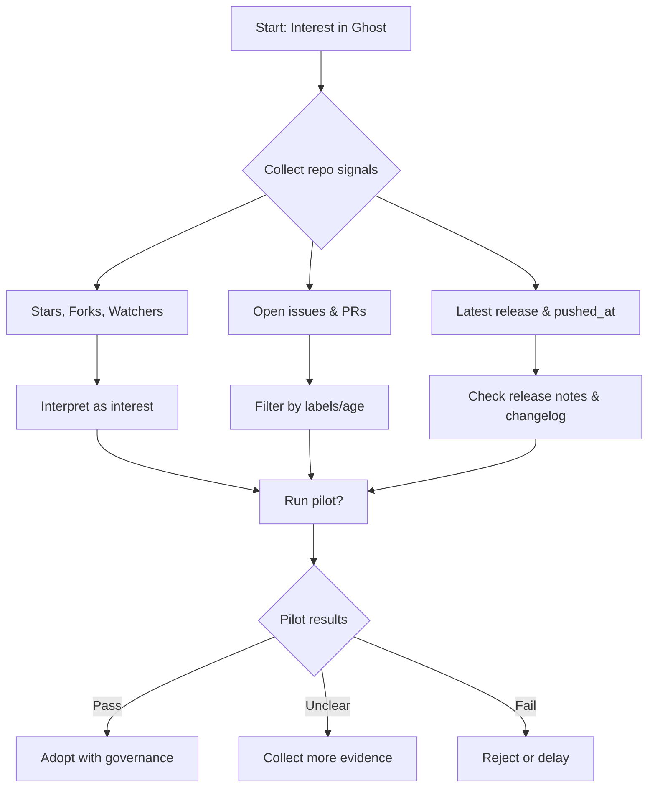

## Table of contents

- [Executive answer](#executive-answer)
- [Repository snapshot (evidence)](#repository-snapshot-evidence)
- [What repository signals mean (and what they don't)](#what-repository-signals-mean-and-what-they-don-t)
- [Selection risks and architectural notes](#selection-risks-and-architectural-notes)
- [Ecosystem signals to gather (what to check next)](#ecosystem-signals-to-gather-what-to-check-next)
- [Practical assessment checklist (short pilot)](#practical-assessment-checklist-short-pilot)
- [Decision checklist (go/no-go)](#decision-checklist-go-no-go)
- [Maintenance and governance recommendations](#maintenance-and-governance-recommendations)
- [Evidence, assumptions, and limitations](#evidence-assumptions-and-limitations)
- [Evidence](#evidence)
- [Assumptions](#assumptions)
- [Limitations](#limitations)
- [FAQ](#faq)
- [Mermaid: adoption decision flow](#mermaid-adoption-decision-flow)
- [Sources](#sources)

## Executive answer

Ghost's canonical repository (TryGhost/Ghost) shows signs of an active, maintained open-source CMS project: at the time this analysis was generated the repo lists 55,179 stars, 11,940 forks, 1,014 watchers, and 155 open issues. The project is licensed MIT, implemented in JavaScript, and the repository has recent activity including a tagged release v6.62.0 published on 2026-09-01 and a recent push on 2026-09-06. These are interest and activity signals that suggest the project is actively worked on and publicly maintained, but they are not direct measures of production usage, reliability, or fit for a specific team.

For teams considering Ghost, treat the repository metrics as a starting point. Prioritize collecting additional operational and compatibility evidence before committing to production: package download and install telemetry, Docker image pulls, third-party hosting marketplace presence, upgrade path testing on representative content, dependency security scan results, and a review of issue and PR histories filtered by label and age. Use the decision checklist below to structure a short pilot and governance plan.

## Repository snapshot (evidence)

This table lists factual repository metadata taken from the canonical TryGhost/Ghost repository at retrieval time. Retrieval/generation date for the data in this article: 2026-09-06T01:42:34.867537+00:00.

| Field | Value |
|---|---:|
| Repository | [TryGhost/Ghost](https://github.com/TryGhost/Ghost) |
| Description | Independent technology for modern publishing, memberships, subscriptions and newsletters. |
| Stars | 55,179 |
| Forks | 11,940 |
| Watchers | 1,014 |
| Open issues | 155 |
| Language | JavaScript |
| License | MIT |
| Topics | blogging, cms, ghost, javascript, journalism, nodejs, publishing, web-application |
| Created at | 2013-05-04T11:09:13Z |
| Updated at | 2026-09-05T23:02:30Z |
| Pushed at | 2026-09-06T01:07:05Z |
| Default branch | main |
| Homepage | https://ghost.org |

### Latest release (factual)

| Field | Value |
|---|---:|
| Latest release | v6.62.0 |
| Tag | v6.62.0 |
| Published at | 2026-09-01T15:33:02Z |
| Release notes URL | https://github.com/TryGhost/Ghost/releases/tag/v6.62.0 |
| Release notes summary | The release notes linked in the tag include bug fixes, UI updates, and theme updates. See the release page for the full changelog. |

Sources for the tables: the repository and release pages linked above ([TryGhost/Ghost repository](https://github.com/TryGhost/Ghost), [v6.62.0 release](https://github.com/TryGhost/Ghost/releases/tag/v6.62.0)).

## What repository signals mean (and what they don't)

- Stars (55,179): a public indicator of interest, discoverability, and social attention. Stars do not equal production deployments, nor do they measure revenue, uptime, or active usage. Treat stars as a directional signal of community awareness only.

> [!NOTE]
> GitHub stars are interest signals, not usage or market-share measurements. Use them only to prioritize further investigation, not as a substitute for operational telemetry.

- Forks (11,940): show developer engagement and the potential for community-driven experimentation. Forks can indicate integrations, packaging efforts, or derivative work—but not necessarily active downstream maintenance.

- Watchers (1,014): indicate people who opted to receive updates. This is a participation slice but again not an operational metric.

- Open issues (155): raw open-issue counts are a snapshot of items that maintainers or community members have flagged. Open-issue counts are not defect counts; they include feature requests, questions, enhancement proposals, and triage items.

> [!WARNING]
> Open-issue counts are not defect counts. Before concluding that the project is buggy, inspect issue labels, creation dates, and maintainer response patterns.

- Latest release / pushed_at timestamps: the repository shows recent push activity (pushed_at 2026-09-06T01:07:05Z) and a release published 2026-09-01. These timestamps indicate current maintenance but do not quantify the pace of change over months or years. If upgrade stability matters to you, verify historical release cadence and semantic versioning practices.

- License (MIT): permissive license that allows commercial use, modification, and redistribution. Confirm legal fit with your organization's IP policy, particularly if you plan to extend Ghost or ship an integrated product.

- Language (JavaScript): indicates runtime and ecosystem dependencies (Node.js, npm). Platform compatibility, hosting, and operational characteristics will follow from the technology stack.

## Selection risks and architectural notes

Architectural conclusions drawn from README or repository structure must be explicit. The project's README references working on "the monorepo" and provides a contributing/codebase documentation link. Architectural inference: the repository appears to be structured as a monorepo (inferred from README text referencing "the monorepo" and the codebase documentation). Treat this as a stated repository organization rather than a runtime architecture claim.

Selection risks to consider (no numbers invented; all are conceptual):

- Upgrade risk: the repository shows active development and releases. Active development can mean frequent changes that require upgrade work for production instances. Teams must measure upgrade smoothness by running representative upgrades in a staging environment.

- Dependency surface: Ghost is implemented in JavaScript and will rely on Node.js and a set of npm dependencies. That expands the dependency attack surface and operational patching needs (see the Evidence checklist below for how to enumerate dependencies).

- Ecosystem coupling: Ghost has an official managed offering (Ghost(Pro)) and documentation links in the README. Using managed hosting can reduce operational risk but introduces vendor coupling and cost considerations.

- Customization and theming: Ghost's README references themes and APIs (docs links). If your use case depends on heavy customization, validate theme/plugin stability and compatibility across releases.

## Ecosystem signals to gather (what to check next)

Table: Additional evidence sources you should collect before selecting Ghost for production.

| Evidence type | Why it matters | How to collect |
|---|---|---|
| Package/download telemetry (npm, Docker Hub) | Shows actual installation/usage trends across package ecosystems | Query npm and Docker Hub dashboards, or use public download APIs and registry stats |
| Hosted offering adoption (Ghost(Pro) customers) | Indicates production-grade usage and a path to managed operations | Review Ghost(Pro) documentation and vendor references; ask vendor for customer references if needed |
| Third-party themes and integrations | Signals maturity of ecosystem for extensions and headless integrations | Inspect marketplaces, theme repos, and third-party integrations on GitHub and npm |
| Issue/PR health over time | Shows maintainer responsiveness and backlog trends | Filter issues/PRs by label, age, and comments; check CI status on main branch and PRs |
| Security advisories and CVEs | Determines historical security posture and responsiveness | Search GitHub Advisory Database, NVD/CVE feeds, and vendor security pages |
| Contributor/maintainer distribution | Single-maintainer projects are higher bus-factor risk | Inspect contributor graphs and sponsor/commit author lists on GitHub |

All of the evidence above should be collected and interpreted in the context of your team’s tolerance for upgrade frequency, customization needs, and operational control.

> [!TIP]
> Automate evidence collection: script queries against npm/Docker registries, GitHub APIs (for issue history), and the GitHub Advisory Database to create repeatable reports for governance reviews.

## Practical assessment checklist (short pilot)

Use this checklist to run a short 2–4 week technical pilot that surfaces the major selection risks.

Action checklist

- Clone a recent tag (e.g., v6.62.0) and run a local staging instance using the recommended documentation from the repository and website. (Note: the repository README links to installation and docs; consult those pages on ghost.org via the repo.)
- Run an in-place upgrade from the previous stable minor release in a staging environment and document migration steps and downtime.
- Exercise content import/export flows representative of your real data (posts, members, subscriptions) and validate data integrity.
- Run dependency scans (SCA) against the repo to enumerate transitive dependencies and known advisories; repeat scans periodically.
- Evaluate third-party themes and integration compatibility for the versions you plan to use.
- Test deployment scenarios: single-instance with managed DB, containerized (Docker), and managed Ghost(Pro) to compare operational effort.
- Measure CI health: inspect main branch status checks and recent PR merge cadence for flakiness or long-lived PRs.
- Request references from the maintainers or vendor for production customers using similar scale or use cases.
- Define an upgrade policy and rollback plan based on pilot findings.

## Decision checklist (go/no-go)

- Go if: pilot shows predictable upgrade path, security scan results align with organizational policy after remediation, CI and release notes show active maintenance, and ecosystem tools (themes, plugins) meet functional needs.
- Hold for more information if: issue history shows long-standing, unresolved security or functional regressions related to your use case, or if dependency risks are high and cannot be mitigated in your timeline.
- No-go if: the legal team objects to license terms (unlikely with MIT), or vendor/maintainer responsiveness is insufficient for SLA or compliance needs.

## Maintenance and governance recommendations

- Establish a weekly or biweekly automated check that records: newest release tag, open-issue counts by label, and failed security alerts. Do not use raw counts as decisions; use trends and labels.
- Subscribe to the project's changelog and release RSS/notifications (the release page for v6.62.0 contains a link to changelog context) and include changelog review as part of your release planning.
- Define responsibility split between vendor/managed service (if using Ghost(Pro)) and your internal team for backups, security patching, and incident response.

## Evidence, assumptions, and limitations

## Evidence

- All repository and release data used in this article come from the TryGhost/Ghost repository and the v6.62.0 release page at the times referenced above: [TryGhost/Ghost](https://github.com/TryGhost/Ghost) and [v6.62.0 release](https://github.com/TryGhost/Ghost/releases/tag/v6.62.0).
- Retrieval/generation timestamp for this article's data: 2026-09-06T01:42:34.867537+00:00.

## Assumptions

- This analysis assumes teams will do a pilot and collect usage and telemetry evidence before making production decisions.
- Architectural inference that the repo is a monorepo is explicitly labeled as being inferred from README wording.

## Limitations

- Repository metrics (stars, forks, watchers, open issues) are public signals; they do not provide direct telemetry about production deployments, uptime, or customer counts. This analysis does not assert any production usage numbers beyond what is present in the repository metadata.
- The release notes summary is a synthesis; readers should consult the full release page for detailed changelog items. The release page URL is cited so readers can inspect the changes directly.

## FAQ

### What do Ghost's GitHub stars tell me about adoption?
Stars indicate interest and discoverability; they are not a reliable measure of production usage, market share, or uptime. Treat stars as a signal to investigate further rather than an adoption metric.

### Is the project actively maintained?
Yes: the repository shows recent activity (pushed_at 2026-09-06) and a recent release (v6.62.0 published 2026-09-01). For longer-term cadence and stability assessment, inspect historical releases and PR merge cadence on the repo.

### Are the 155 open issues a problem?
Open issues are a mix of bugs, feature requests, and questions. An open-issue count alone does not indicate quality. Filter issues by label, age, and maintainer response time to understand backlog health.

### What does the MIT license mean for my company?
MIT is permissive, allowing commercial use and modification. Your legal or compliance team should confirm that MIT meets your IP and redistribution policies.

### How should I evaluate Ghost for customization and integrations?
Run a pilot that exercises theme changes, API integrations, and upgrades. Inspect third-party theme repositories and verify compatibility across the release you intend to run.

### Where can I find the authoritative repository and release pages?
Authoritative links used in this analysis: the repository ([TryGhost/Ghost](https://github.com/TryGhost/Ghost)) and the latest release referenced here ([v6.62.0 release](https://github.com/TryGhost/Ghost/releases/tag/v6.62.0)).

### How do I monitor future changes to the project?
Automate periodic checks against the GitHub API for new releases, new security advisories, and issue/PR health. Subscribe to the project's official changelog and mailing lists linked from the repository.

## Mermaid: adoption decision flow

## Sources

- Ghost canonical repository: https://github.com/TryGhost/Ghost
- Ghost latest GitHub release: https://github.com/TryGhost/Ghost/releases/tag/v6.62.0
