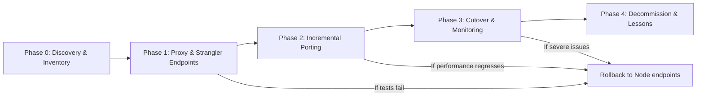
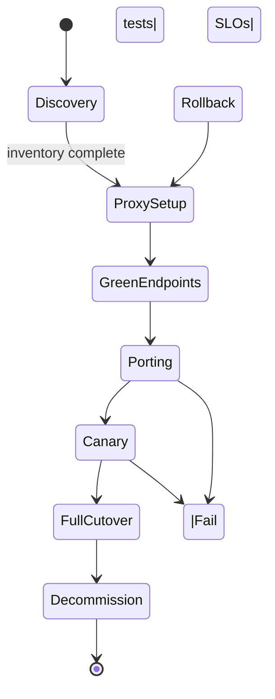

Executive summary

Express and Gin are both minimal web frameworks focused on building HTTP services, but they target different language runtimes: Express is a JavaScript framework running on Node.js, while Gin is a Go framework. The canonical repositories used for this guide are the Express repo [expressjs/express](https://github.com/expressjs/express) and the Gin repo [gin-gonic/gin](https://github.com/gin-gonic/gin). This guide uses those repositories and their published release notes as the evidence base (data retrieved/generated: 2026-07-13T02:29:03Z).

If your primary goals are to reduce per-request CPU/memory overhead, adopt a compiled language, or consolidate services around Go tooling, migration can be justified. If instead your app relies heavily on the Node.js ecosystem (npm modules, dynamic JavaScript middleware) or your team lacks Go expertise and hiring runway, a migration will introduce substantial porting and maintenance cost. The rest of this document gives a decision checklist, a phased execution plan, compatibility risks, test strategy, data/API considerations, rollback gates, and cases where migration is not justified.

Table of contents

- [When to consider migrating](#when-to-consider-migrating)
- [Suitability assessment (quick matrix)](#suitability-assessment-quick-matrix)
- [Inventory and compatibility risks](#inventory-and-compatibility-risks)
  - [Language and runtime differences](#language-and-runtime-differences)
  - [Middleware and ecosystem](#middleware-and-ecosystem)
- [Phased migration plan](#phased-migration-plan)
  - [Phase 0 — Discovery & alignment](#phase-0---discovery--alignment)
  - [Phase 1 — Strangler: proxy + green endpoints](#phase-1---strangler-proxy--green-endpoints)
  - [Phase 2 — Incremental porting & testing](#phase-2---incremental-porting--testing)
  - [Phase 3 — Cutover and monitoring](#phase-3---cutover-and-monitoring)
  - [Phase 4 — Decommission and learn](#phase-4---decommission-and-learn)
- [Test strategy and validation gates](#test-strategy-and-validation-gates)
- [Data, API, and contract concerns](#data-api-and-contract-concerns)
- [Rollback points and gate criteria](#rollback-points-and-gate-criteria)
- [Where migration is not justified](#where-migration-is-not-justified)
- [Decision / Action checklist](#decision--action-checklist)
- [Evidence, assumptions, and limitations](#evidence-assumptions-and-limitations)
- [Mermaid migration flow diagram](#mermaid-migration-flow-diagram)
- [FAQs](#faqs)
- [Sources](#sources)


> [!NOTE]
> Repository signals for Express were collected at generation time and should be re-checked before production decisions.

> [!TIP]
> Start with a narrow integration spike, then expand scope only after observability and rollback paths are in place.

> [!WARNING]
> GitHub stars, fork counts, and open-issue totals are weak proxies for security or operational readiness.

## Table of contents

- [When to consider migrating](#when-to-consider-migrating)
- [Suitability assessment (quick matrix)](#suitability-assessment-quick-matrix)
- [Inventory and compatibility risks](#inventory-and-compatibility-risks)
- [Phased migration plan](#phased-migration-plan)
- [Test strategy and validation gates](#test-strategy-and-validation-gates)
- [Data, API, and contract concerns](#data-api-and-contract-concerns)
- [Rollback points and gate criteria](#rollback-points-and-gate-criteria)
- [Where migration is not justified](#where-migration-is-not-justified)
- [Decision / Action checklist](#decision-action-checklist)
- [Evidence, assumptions, and limitations](#evidence-assumptions-and-limitations)
- [Mermaid migration flow diagram](#mermaid-migration-flow-diagram)
- [Embedded data image](#embedded-data-image)
- [Tables you can copy into your tracker](#tables-you-can-copy-into-your-tracker)
- [FAQs](#faqs)

## When to consider migrating

- Evidence: The Express repository identifies itself as a "Fast, unopinionated, minimalist web framework for Node.js" and documents Node.js 18+ as required for new installs; the README includes install/run patterns and generator tools used in Node projects ([Express repo](https://github.com/expressjs/express)).
- Evidence: The Gin repository describes Gin as a "high-performance HTTP web framework written in Go" with a focus on low allocations and speed; Gin's README also documents Go module usage and shows a simple `go run` example ([Gin repo](https://github.com/gin-gonic/gin)).

Inference (labeled): Because the two frameworks target different runtimes (JavaScript/Node vs Go), migrating will not be a drop-in switch — it is a language-and-runtime migration that requires porting code and re-evaluating libraries.

[!NOTE]
This guide treats repository metadata and release notes from the canonical repositories as the evidence base. Data generation timestamp: 2026-07-13T02:29:03Z.


## Suitability assessment (quick matrix)

This table summarizes where Express and Gin differ in a way that matters for a migration decision. Entries are based on the provided repository metadata and README material.

| Dimension | Express (evidence) | Gin (evidence) | Migration implication (inference) |
|---|---:|---:|---|
| Language/runtime | JavaScript on Node.js; README requires Node.js 18+ ([expressjs/express](https://github.com/expressjs/express)) | Go (Gin README demonstrates `go run`, module imports, Go 1.24+/1.25+ references in releases) ([gin-gonic/gin](https://github.com/gin-gonic/gin)) | Porting across languages; runtime behavior (GC, concurrency model) will differ and needs design adjustments. |
| Performance focus | Minimalist/fast for Node; oriented to web apps and APIs (Express README) | Emphasizes low allocations and high throughput (Gin README, includes claims about performance vs other Go frameworks) | Potential for improved throughput/efficiency in Go but requires benchmarking your workload. |
| Ecosystem & middleware | Large Node/npm ecosystem; many middleware modules integrated into Express apps (Express README & examples) | Go ecosystem with gin-contrib and community middleware (Gin README references gin-contrib) | Middleware and third-party libraries must be re-evaluated and ported or replaced. |
| Team skills | JavaScript/Node proficiency required | Go proficiency required | Team capability is a primary gating factor. |
| Deploy model | Typical Node deployment (npm, Node runtime) | Typical Go deployment (compiled binary) | Operational model changes: build pipelines, container images, observability. |


## Inventory and compatibility risks

Before committing, produce an inventory of the elements to port. Use a tool-assisted scan for package.json and imports, then map to Gin/Go equivalents.

Inventory categories (minimum):

- Public HTTP endpoints and path/parameter patterns.
- Authentication and authorization flows (JWT, session stores).
- Middleware stack (logging, metrics, body parsers, CORS, rate limiting, validation).
- Data access code (ORM, database drivers, custom SQL), connection pooling.
- Background jobs, message queues, and I/O-bound integrations.
- Static assets and templating if used.
- Build, CI/CD, observability (tracing, metrics, logging formats).

Include a lightweight table that you can fill during discovery:

| Component | Express location(s) | Criticality | Porting notes / Go equivalent |
|---|---:|---:|---|
| Example: /api/users GET | routes/users.js | High | Needs route + JSON binding + DB access; map to Gin route with binding and DB driver |


### Language and runtime differences

- Fact: Express is JavaScript on Node.js; Gin is Go ([Express repo](https://github.com/expressjs/express), [Gin repo](https://github.com/gin-gonic/gin)).

Inference (labeled): This implies differences in concurrency model (Node's event loop and async I/O vs Go's goroutines and scheduler), binary distribution (interpreted/VM vs compiled static binaries), and memory/runtime profiling approaches. Expect to revise error handling, request lifecycle, and dependency management.

[!TIP]
During discovery, tag code that relies on dynamic `require` or runtime evaluation — these patterns are common in Node and have no direct equivalent in compiled Go.


### Middleware and ecosystem

- Evidence: Express supports many template engines and HTTP helpers in its README; Gin lists `gin-contrib` and an ecosystem of middleware in its README.

Inference (labeled): You will likely replace middleware with Go-native libraries (for example, logging with zap or logrus + gin middleware) or use gin-contrib equivalents. Some npm packages (session stores, validation libraries) will have different feature sets in Go.

[!WARNING]
Do not assume a 1:1 feature parity for all middleware. Some npm modules may offer behavior not available in existing gin-contrib packages; those will need either custom implementation or different trade-offs.


## Phased migration plan

This phased plan follows a strangler-pattern approach: run old and new in parallel, route incremental traffic to the Go implementation, and remove the Node.js version when feature parity and quality gates are met.




### Phase 0 - Discovery & alignment

Goals:

- Complete the inventory table for all HTTP endpoints, middleware, data flows, and external integrations.
- Decide success criteria: functional parity, performance baselines, error budgets, and observability targets.
- Identify high-risk components that block migration (native Node addons, platform-specific bindings, or binary modules used via npm).

Outputs:

- Component inventory spreadsheet with owner, complexity, and chosen Go alternative.
- Test harness templates for each endpoint (API contract tests).


### Phase 1 - Strangler: proxy + green endpoints

Approach:

- Deploy a reverse proxy (API gateway) that can route specific endpoints to the new Gin service while leaving others on the Express service. This isolates new code paths for validation without full cutover.
- Implement a small number of non-critical endpoints first (examples: health check, a read-only status endpoint).

Validation gates:

- Contract tests pass for endpoints routed to Gin.
- No regressions in latency and error rate above agreed thresholds.


### Phase 2 - Incremental porting & testing

Approach:

- Port remaining endpoints one group at a time (by domain or team ownership).
- For each ported endpoint, implement:
  - Equivalent route and parameter parsing in Gin.
  - JSON binding/validation consistent with contract tests.
  - Logging and metrics matching production formats.
  - Integration with DB or external services using Go drivers.

Testing:

- Unit tests for handler logic.
- Contract (consumer-driven) tests between services.
- Integration tests that exercise DB and third-party integrations.


### Phase 3 - Cutover and monitoring

Approach:

- Gradually increase traffic to the Gin service for ported endpoints (canary or traffic-splitting in the proxy).
- Rely on observability measures (error rate, p95 latency, resource utilization) to validate.

Cutover gate (example, inference-labeled): When 95% of calls for all routes are served by Gin and SLOs are met for a sustained period (e.g., 24–72 hours depending on your SLAs), plan the final switch.


### Phase 4 - Decommission and learn

- Decommission the Express service after final validation and prepare a post-mortem capturing porting issues and operational changes.

[!TIP]
Keep the Express deployment and its logs archived but not active for a cooldown period. This speeds rollback if an unexpected problem appears after decommission.


## Test strategy and validation gates

Tests should be layered and automated in CI:

1. Unit tests that validate pure logic.
2. Handler tests that exercise request binding and response shape.
3. Contract tests (consumer-driven contracts) that guarantee API compatibility with clients.
4. Integration tests against staging instances of external dependencies (databases, queues).
5. Performance and load tests against representative traffic.

A basic gate matrix:

| Gate | Required to pass | Source of truth |
|---|---|---|
| Build & unit tests | All tests pass | Git CI (build logs) |
| Contract tests | No breaking contract diffs | Contract test runner (e.g., Pact-like or custom) |
| Integration tests | Success against staging dependencies | CI integration job |
| Performance gate | No regression beyond agreed threshold | Benchmark/load test results (staging) |


[!WARNING]
Do not skip contract tests. When migrating languages, small differences in JSON field naming, default values, or error response codes are a common source of production incidents.


## Data, API, and contract concerns

- Fact: Both projects’ READMEs demonstrate common patterns for JSON binding and rendering. Gin documents automatic binding/validation features; Express shows examples of route handlers returning strings or responses. Use those documented patterns when porting ([expressjs/express](https://github.com/expressjs/express), [gin-gonic/gin](https://github.com/gin-gonic/gin)).

Porting checklist for APIs:

- Match request and response JSON schema exactly (field names, optional/required).
- Preserve HTTP status codes and error shape (error fields, content-type).
- Maintain header behavior relevant to clients (CORS, caching headers, authentication tokens).
- Confirm any pagination and cursor semantics are identical.

If the Express app uses runtime schema transformations or dynamic fields, mark these as higher risk and document behavior to replicate in Go.


## Rollback points and gate criteria

Plan explicit rollback gates at each phase:

- Phase 1 rollback: If contract tests fail or error rate for newly routed endpoints exceeds threshold for 10 minutes, route that endpoint back to Express.
- Phase 2 rollback: For each ported route group, if integration tests fail or a sustained p95 latency regression occurs under realistic load, stop routing traffic to Gin and revert.
- Phase 3 rollback: For full cutover, retain the old service in passive mode for a rollback window (e.g., 24–72 hours). If SLOs are violated or severity meets incident threshold, flip traffic back.

[!TIP]
Automate traffic routing in your API gateway (labels or feature flags) so rollbacks are configuration changes rather than code deployments.


## Where migration is not justified

The following are decision points (inferences labeled) where migration is likely not justified:

- Team lacks Go expertise and there is no plan to hire/train within an acceptable timeframe — costs and risk of defects increase.
- The application depends on large amounts of JavaScript-specific npm modules with no practical Go counterparts (native bindings, dynamic plugin systems). In such cases porting effort is high and benefit uncertain.
- The primary driver is ‘modernization’ without clear measurable SLO improvements or operational benefits; migration projects that are modernization-for-modernization often overrun.

[!NOTE]
These are inferred decision criteria based on the language/runtime differences between Express and Gin in the canonical repositories. Use your team and business context to evaluate them.


## Decision / Action checklist

- [ ] Inventory all HTTP endpoints, middleware, and external integrations.
- [ ] Identify Go library equivalents for critical middleware (auth, sessions, validation, DB drivers).
- [ ] Create API contract tests for all public endpoints.
- [ ] Establish performance and error-rate baselines for Express endpoints under representative load.
- [ ] Implement proxy/gateway routing to allow per-endpoint toggles between Express and Gin.
- [ ] Port an initial set of safe read-only endpoints and validate in staging.
- [ ] Expand porting in small batches with automation for tests and canary traffic.
- [ ] Define and automate rollback gates at each phase.
- [ ] Schedule decommission window and post-mortem after final cutover.


## Evidence, assumptions, and limitations

- Evidence used in this guide:
  - Express canonical repository: https://github.com/expressjs/express (metadata and README content).
  - Express latest GitHub release: https://github.com/expressjs/express/releases/tag/v5.2.1 (release notes referenced).
  - Gin canonical repository: https://github.com/gin-gonic/gin (metadata and README content).
  - Data generation timestamp: 2026-07-13T02:29:03Z. Where repository activity or release dates matter, that date is the reference for freshness.

- Assumptions and labeled inferences:
  - Any operational or organizational statements (team skills, hiring implications, operational model changes) are inferences made from the fact that the two frameworks target different languages and runtimes. They are explicitly labeled as inferences throughout the article.
  - Performance gains mentioned in the Gin README (e.g., claims of higher speed vs other Go frameworks) are paraphrased from the Gin README and should be validated with workload-specific benchmarks before assuming them for your application.

- Limitations:
  - This guide does not include code-level port examples beyond conceptual patterns because porting requires project-specific code and dependency mapping.
  - Third-party compatibility for every npm package and Go equivalent cannot be exhaustively enumerated within this document; the inventory step is required to surface those specifics.


## Mermaid migration flow diagram




## Embedded data image


## Tables you can copy into your tracker

Table: High-level migration tasks

| Task | Owner | Inputs | Success criteria |
|---|---|---|---|
| Inventory endpoints & middleware | Team lead | Express repo, package.json, runtime config | Spreadsheet completed with risk classification |
| Select Go library equivalents | Platform architect | Inventory spreadsheet | Choosen libraries documented with pros/cons |
| Implement proxy gateway routing | Ops | Gateway config | Per-endpoint routing toggles work in staging |
| Port first endpoints | Service owner | Endpoint contract tests | Contract tests pass; no major functional regressions |
| Performance testing | SRE | Baseline metrics | No unacceptable regression vs baseline |


Table: Common migration risks and mitigations

| Risk | Why it matters | Mitigation |
|---|---|---|
| Incompatible middleware semantics | Different libraries have different defaults | Record behavior in inventory and add adapter code in Go where needed |
| Behavioral differences in JSON binding | Field naming and defaulting differ | Use contract tests and schema validation to lock behavior |
| Operational differences | Build and deploy artifacts change (node runtime vs compiled binary) | Update CI pipelines, container images, and runbooks in Phase 0 |


## FAQs

1. Q: Can I perform an automated transpile from Express JS to Gin?
   A: No canonical transpiler exists in the evidence used for this guide. Because Express is JavaScript running on Node.js and Gin is a Go framework, migration requires manual porting and reimplementation of handlers and middleware.

2. Q: Will Gin always be faster than Express for my app?
   A: Gin's README positions it as a high-performance Go framework; however, any performance gain is workload-dependent. The guide recommends benchmarking your specific workload during Phase 0 and Phase 2 before assuming gains.

3. Q: Should I migrate everything at once or incrementally?
   A: Incremental migration (strangler pattern) is recommended. It reduces blast radius, lets you validate contracts and performance incrementally, and provides clear rollback gates.

4. Q: Do I have to rewrite database access code?
   A: Typically yes. Database drivers and ORMs differ between Node and Go. The inventory step should record database usage and select appropriate Go drivers or ORMs to replace the Node code.

5. Q: How long will the migration take?
   A: Time depends on application size, dependency complexity, and team experience. The guide avoids arbitrary time estimates — perform the inventory to derive a realistic schedule.

6. Q: Can I keep a mixed architecture (some services in Node, some in Go)?
   A: Yes. The strangler approach explicitly supports a hybrid state during migration and beyond. Keep clear ownership boundaries and contract tests to manage the hybrid architecture.


## Sources

- Express canonical repository: https://github.com/expressjs/express
- Express latest GitHub release: https://github.com/expressjs/express/releases/tag/v5.2.1
- Gin canonical repository: https://github.com/gin-gonic/gin


SEO & schema

- Primary keyphrase: express
- Secondary keyphrases: gin, nodejs to go migration, express to gin, http framework migration
- Canonical URL: https://madewithwhat.net/migrate-express-to-gin
- Open Graph title: Migrate from Express to Gin: Decision & Execution Guide
- Open Graph description: A practical decision and execution guide to migrate an HTTP service from Express (Node.js) to Gin (Go), covering suitability, inventory, risks, tests, and rollbacks.

Article schema (JSON-LD):

```json
{
  "@context": "https://schema.org",
  "@type": "TechArticle",
  "headline": "Migrate from Express to Gin: Decision & Execution Guide",
  "datePublished": "2026-07-27",
  "dateModified": "2026-07-13T02:29:03Z",
  "author": {"@type": "Organization", "name": "MadeWithWhat"},
  "publisher": {"@type": "Organization", "name": "MadeWithWhat", "url": "https://madewithwhat.net"},
  "mainEntityOfPage": {"@type": "WebPage", "@id": "https://madewithwhat.net/migrate-express-to-gin"},
  "keywords": "express, gin, migration, nodejs to go migration"
}
```

## FAQ

### Can I perform an automated transpile from Express JS to Gin?

No canonical transpiler is referenced in the evidence used for this guide. Express is JavaScript on Node.js and Gin is Go; migration requires manual porting and reimplementation of handlers and middleware.

### Will Gin always be faster than Express for my app?

Gin's README describes it as a high-performance Go framework, but any performance advantage is workload-dependent. Benchmark your application during discovery and after porting to validate gains.

### Should I migrate everything at once or incrementally?

Incremental migration (strangler pattern) is recommended. It reduces blast radius, enables per-endpoint validation, and provides clear rollback gates.

### Do I have to rewrite database access code?

Typically yes. Database drivers and ORMs differ between Node and Go. Record database usage in the inventory and plan equivalent Go drivers or ORMs for porting.

### How long will the migration take?

Time depends on application size, dependency complexity, and team experience. This guide does not provide arbitrary time estimates — run the inventory to produce a realistic schedule.

### Can I keep a mixed architecture (some services in Node, some in Go)?

Yes. The strangler approach supports a hybrid state during migration and beyond. Maintain clear ownership boundaries and contract tests to manage interoperability.
