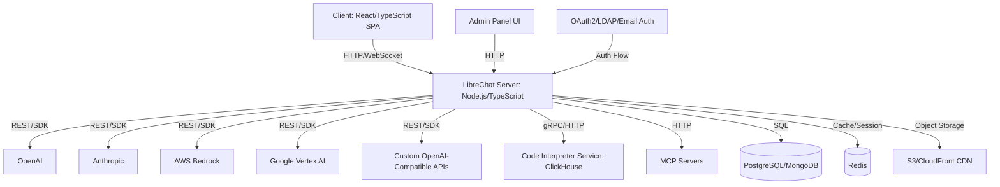

## Executive Summary

[LibreChat](https://github.com/danny-avila/LibreChat) is an MIT-licensed, self-hosted AI chat platform that consolidates access to multiple large language model providers—including OpenAI, Anthropic, AWS Bedrock, Google Vertex AI, and custom OpenAI-compatible endpoints—behind a unified web interface. As of February 2026, the project has accumulated 41,596 GitHub stars and 8,569 forks, with active development reflected in commits pushed as recently as August 3, 2026. The platform is implemented primarily in TypeScript and positions itself as an enhanced, privacy-focused alternative to ChatGPT for teams requiring on-premises or controlled-cloud deployment.

This analysis examines LibreChat's current feature set, architectural patterns inferred from repository structure, deployment considerations, and upgrade/rollback strategies. With 646 open issues, no tagged releases in the supplied metadata, and continuous main-branch development, engineering teams must balance the platform's extensive feature catalog against operational maturity trade-offs. The following sections provide a structured evaluation for architects and technical decision-makers assessing LibreChat for production workloads.

---

## Table of Contents

- [Feature Set and Functional Scope](#feature-set-and-functional-scope)
- [Architecture and Technology Stack](#architecture-and-technology-stack)
- [Deployment Options and Infrastructure Requirements](#deployment-options-and-infrastructure-requirements)
- [Security, Authentication, and Multi-Tenancy](#security-authentication-and-multi-tenancy)
- [Operational Considerations](#operational-considerations)
- [Decision Checklist](#decision-checklist)
- [Evidence, Assumptions, and Limitations](#evidence-assumptions-and-limitations)
- [Frequently Asked Questions](#frequently-asked-questions)
- [Sources](#sources)

---

## Feature Set and Functional Scope

LibreChat's feature portfolio spans conversational AI, content generation, workflow automation, and administrative tooling. The platform's breadth reflects both its maturity and the complexity engineering teams will inherit.

### Core Conversational Capabilities

The platform provides:

- **Multi-provider LLM support**: Direct integration with Anthropic (Claude), AWS Bedrock, OpenAI (including Azure OpenAI), Google Gemini, Vertex AI, and the OpenAI Responses API. Custom endpoints allow connection to any OpenAI-compatible API without intermediary proxies.
- **Mid-conversation model switching**: Users can change AI providers or saved presets within an active conversation thread.
- **Multimodal input**: Image upload and analysis with vision-capable models (Claude 3, GPT-4.5, GPT-4o, o1, Llama-Vision, Gemini). File attachment for document-based chat with compatible endpoints.
- **Conversation branching**: Edit and resubmit prior messages, fork conversations for parallel context exploration.
- **Resumable streams**: Responses automatically reconnect if the client connection drops. Multi-tab and multi-device synchronization supported with Redis-backed state management.

### Extended AI Capabilities

| Feature | Scope | Provider Compatibility |
|---------|-------|------------------------|
| **Agents** | No-code custom assistants with tools, file search, code execution, subagents, and MCP server integration | OpenAI, Azure, Anthropic, AWS Bedrock, Google, Vertex AI, Responses API, Custom Endpoints |
| **Code Interpreter** | Sandboxed execution in Python, Node.js (JS/TS), Go, C/C++, Java, PHP, Rust, Fortran via ClickHouse/code-interpreter | Model-agnostic; requires separate service deployment |
| **Web Search** | Internet search with provider aggregation, content scraping, and Jina reranking | Configurable external providers |
| **Code Artifacts** | Generative UI for React, HTML, and Mermaid diagrams rendered directly in chat | Requires compatible models |
| **Image Generation** | Text-to-image and image-to-image with GPT-Image-1, DALL-E 2/3, Stable Diffusion, Flux, or MCP servers | Model-dependent; local or API-based |

### Model Context Protocol (MCP)

LibreChat is [listed as an official MCP client](https://modelcontextprotocol.io/clients#librechat). MCP support enables integration with standardized tool servers for file systems, databases, APIs, and custom resources. Agents can consume MCP servers as tools, expanding workflow automation without custom code.

### Administrative and Enterprise Features

The [Admin Panel](https://www.librechat.ai/docs/features/admin_panel) provides browser-based management for:

- User, group, and role administration
- Per-role and per-group permission overrides
- Live configuration editing without redeployment
- Bundled with Docker Compose stacks for rapid provisioning

> [!NOTE]
> The Admin Panel is designed for multi-tenant environments where configuration segmentation by user role or organizational unit is required. Single-user deployments may not benefit from this overhead.

---

## Architecture and Technology Stack

### Inferred Architectural Patterns

Based on repository metadata, documentation references, and feature descriptions, LibreChat appears to follow a monolithic-with-services pattern:

**Key architectural characteristics inferred:**

- **Frontend**: Single-page application (SPA) implemented in React with TypeScript. The UI adapts to both technical and non-technical users with customizable dropdowns and interface density.
- **Backend**: Node.js/TypeScript server handling API orchestration, authentication, conversation state, and provider abstraction. WebSocket support for streaming responses.
- **Data layer**: Documentation references suggest PostgreSQL or MongoDB for conversation persistence. Redis is used for session management, caching, and resumable stream state in multi-instance deployments.
- **External services**: Code Interpreter runs as a separate service (ClickHouse-based). MCP servers operate as standalone processes accessed via HTTP/gRPC. Media storage can leverage S3 with CloudFront for CDN distribution and signed cookies.

> [!WARNING]
> The architectural conclusions above are inferred from README content, feature descriptions, and deployment documentation links. The repository structure and detailed design documents were not directly analyzed.

### Technology Stack Summary

| Layer | Technology |
|-------|------------|
| **Primary Language** | TypeScript |
| **Frontend** | React (inferred from SPA references) |
| **Backend Runtime** | Node.js |
| **Database** | PostgreSQL or MongoDB (configurable) |
| **Cache/Session Store** | Redis (optional for multi-instance) |
| **Object Storage** | S3-compatible services, CloudFront CDN |
| **Authentication** | OAuth2, LDAP, Email/Password |
| **Code Execution** | ClickHouse/code-interpreter (separate service) |
| **License** | MIT |

---

## Deployment Options and Infrastructure Requirements

LibreChat supports multiple deployment patterns ranging from single-server Docker Compose stacks to horizontally scaled cloud environments.

### Supported Deployment Platforms

The README references deployment buttons and guides for:

- **Railway**: One-click deployment via [Railway template](https://railway.com/deploy/librechat-official?referralCode=HI9hWz&utm_medium=integration&utm_source=readme&utm_campaign=librechat)
- **Zeabur**: One-click deployment via [Zeabur template](https://zeabur.com/templates/0X2ZY8)
- **Sealos**: Cloud-native deployment on [Sealos platform](https://template.cloud.sealos.io/deploy?templateName=librechat)
- **Docker Compose**: Bundled stacks for local or self-hosted environments
- **Custom infrastructure**: Reverse proxy, load balancer, and container orchestration (Kubernetes assumed but not explicitly documented)

### Infrastructure Considerations

| Requirement | Minimum | Recommended | Notes |
|-------------|---------|-------------|-------|
| **Compute** | 1 vCPU, 2GB RAM | 2+ vCPU, 4GB+ RAM | Scales with concurrent users and model request volume |
| **Database** | PostgreSQL 12+ or MongoDB 4.4+ | Managed DB service with replication | Session and conversation persistence |
| **Redis** | Optional for single-instance | Required for multi-instance, resumable streams | Ensures state consistency across replicas |
| **Object Storage** | Local filesystem | S3-compatible with CDN (CloudFront) | Stable media URLs, signed cookies, edge delivery |
| **Code Interpreter** | External service deployment | Isolated compute with network policy | Sandboxed execution environment |

> [!TIP]
> For production deployments, use managed database and Redis services with automated backups. Configure S3 lifecycle policies to archive or delete old media attachments based on retention requirements.

### Docker Compose Quick Start

The repository includes Docker Compose configurations bundling the application server, database, Redis, and Admin Panel. This approach is suitable for:

- Development and testing environments
- Single-server production deployments with moderate load
- Proof-of-concept evaluations

For horizontally scaled deployments, migrate to Kubernetes or container orchestration platforms with external database and Redis clusters.

---

## Security, Authentication, and Multi-Tenancy

### Authentication and Access Control

LibreChat provides:

- **OAuth2 integration**: Delegate authentication to identity providers (Google, GitHub, Azure AD, Okta, etc.)
- **LDAP/Active Directory**: Enterprise directory service integration
- **Email/password**: Built-in credential management with password reset flows

### Role-Based Access Control (RBAC)

The Admin Panel enables:

- User-to-group assignment
- Role definition with granular permissions
- Per-role and per-group configuration overrides (model access, feature flags, token limits)
- Prompt and agent sharing scoped to specific users or groups

### Moderation and Token Management

Built-in tooling for:

- **Content moderation**: Configurable filters and audit logs (implementation details not specified)
- **Token spend tracking**: Monitor and cap API usage per user or group

> [!WARNING]
> The documentation references moderation and token spend tools but does not specify enforcement mechanisms, rate limiting granularity, or integration with provider billing APIs. Validate these capabilities against your security and cost control requirements.

### Data Privacy and Isolation

Self-hosting ensures:

- Conversation data remains within controlled infrastructure
- No third-party SaaS telemetry (unless explicitly configured)
- Code Interpreter sandboxing isolates execution environments

For multi-tenant deployments, verify database-level isolation, encryption at rest, and network segmentation between user workloads.

---

## Operational Considerations

### Upgrade Strategy

LibreChat development occurs on the `main` branch with continuous commits. The supplied metadata contains no tagged releases or semantic versioning.

**Recommended upgrade workflow:**

1. **Monitor the [Changelog](https://www.librechat.ai/changelog)** for breaking changes and migration guides.
2. **Subscribe to the [Releases page](https://github.com/danny-avila/LibreChat/releases)** for annotated version cuts (if published).
3. **Test upgrades in a staging environment** with a copy of production data and traffic patterns.
4. **Backup database and Redis state** before applying updates.
5. **Review migration scripts** if schema changes are introduced.
6. **Deploy during maintenance windows** with rollback readiness.

> [!WARNING]
> Absence of tagged releases in the metadata suggests continuous deployment from `main`. Engineering teams should fork the repository and maintain internal release branches with controlled merge cadence to avoid unanticipated breaking changes.

### Rollback Plan

| Step | Action | Verification |
|------|--------|-------------|
| 1 | Stop application services (web server, workers) | Confirm no active connections |
| 2 | Restore database snapshot or rollback migration | Validate schema version |
| 3 | Deploy previous container image or codebase commit | Check application logs for startup errors |
| 4 | Flush Redis cache or restore snapshot | Verify session continuity |
| 5 | Restart services and monitor error rates | Compare response times and error logs against baseline |

### Test Plan for New Deployments

**Functional validation:**

- [ ] Authenticate via OAuth2, LDAP, and email/password flows
- [ ] Create conversations with each configured LLM provider
- [ ] Upload image and document files; verify multimodal responses
- [ ] Trigger web search and validate result rendering
- [ ] Execute code via Code Interpreter in at least two languages (Python, Node.js)
- [ ] Create and invoke a custom agent with MCP tool integration
- [ ] Generate a Code Artifact (React component or Mermaid diagram)
- [ ] Test conversation branching, message editing, and forking
- [ ] Validate resumable streams by intentionally disconnecting mid-response
- [ ] Verify multi-tab synchronization with Redis-backed state
- [ ] Export conversations in JSON and Markdown formats
- [ ] Search conversation history by keyword

**Administrative validation:**

- [ ] Access Admin Panel and create test user accounts
- [ ] Assign users to groups with differentiated permissions
- [ ] Override model access per role (restrict GPT-4 to specific groups)
- [ ] Monitor token spend dashboard and validate cost attribution
- [ ] Test prompt and agent sharing to specific users/groups

**Performance and scale testing:**

- [ ] Simulate 10, 50, 100+ concurrent users with realistic workloads
- [ ] Measure P50, P95, P99 response latencies for streaming completions
- [ ] Validate horizontal scaling by adding application replicas
- [ ] Test database connection pool exhaustion and recovery
- [ ] Verify CDN cache hit rates for media assets

### Monitoring and Observability

The repository does not specify built-in telemetry integrations. Engineering teams should instrument:

- **Application logs**: Structured JSON logs with request IDs for distributed tracing
- **Metrics**: Request rate, error rate, latency histograms, database query times, Redis cache hit rates
- **Provider API usage**: Track quota consumption, rate limit breaches, and API error rates per model
- **Infrastructure health**: CPU, memory, disk I/O, network throughput

Integrate with observability platforms (Prometheus + Grafana, Datadog, New Relic, Elastic APM) based on existing tooling.

---

## Decision Checklist

### Strategic Fit

- [ ] **Use case alignment**: Does the feature set match team workflows (conversational AI, agents, code execution, multimodal input)?
- [ ] **Self-hosting requirement**: Is on-premises or controlled-cloud deployment mandatory for compliance, data residency, or cost reasons?
- [ ] **Multi-tenancy**: Does the project require user segmentation, role-based permissions, and group-level configuration?
- [ ] **Provider flexibility**: Do you need to switch between or aggregate multiple LLM providers (OpenAI, Anthropic, AWS, Google, custom APIs)?

### Technical Readiness

- [ ] **TypeScript and Node.js expertise**: Can the team maintain and extend a TypeScript/Node.js codebase?
- [ ] **Infrastructure capacity**: Can you provision and manage PostgreSQL/MongoDB, Redis, S3-compatible storage, and container orchestration?
- [ ] **Operational maturity**: Is there 24/7 on-call coverage for self-hosted services? Are backups, monitoring, and incident response processes established?
- [ ] **Integration requirements**: Can you deploy and secure the Code Interpreter service, MCP servers, and external API dependencies?

### Risk Assessment

- [ ] **Release cadence**: Are you comfortable tracking continuous `main` branch development, or will you fork and maintain internal releases?
- [ ] **Issue volume**: With 646 open issues, can you triage bugs, contribute fixes, or rely on community resolution?
- [ ] **Migration path**: If you outgrow LibreChat or pivot to a managed service, can you export data and migrate workflows?
- [ ] **Security posture**: Have you reviewed authentication, RBAC, sandboxing, and data privacy mechanisms against your threat model?

### Cost and Licensing

- [ ] **MIT license compatibility**: Does the MIT license meet legal and compliance requirements?
- [ ] **Operational cost**: Have you modeled infrastructure, API usage, and staffing costs vs. managed SaaS alternatives?
- [ ] **Vendor lock-in**: Can you replace LibreChat without rewriting integrations or retraining users?

---

## Evidence, Assumptions, and Limitations

### Evidence Sources

This analysis is based on:

- Repository metadata from [danny-avila/LibreChat](https://github.com/danny-avila/LibreChat) as of August 3, 2026
- README content describing features, deployment options, and integrations
- Documentation URLs referenced in the README (https://librechat.ai/docs, https://www.librechat.ai/changelog)
- GitHub repository statistics: 41,596 stars, 8,569 forks, 646 open issues, TypeScript primary language, MIT license

### Assumptions

- **Architecture**: The inferred architectural diagram and technology stack are based on README descriptions, feature capabilities, and deployment guides. Detailed design documents, database schemas, and API contracts were not reviewed.
- **Feature maturity**: Features are described based on documentation claims. Functional completeness, performance characteristics, and edge-case handling were not independently validated.
- **Release process**: No tagged releases were present in the supplied metadata. The assumption of continuous `main` branch development is based on recent push timestamps and the absence of release artifacts.
- **MCP integration**: LibreChat's listing as an official MCP client is based on the external link to https://modelcontextprotocol.io/clients#librechat. Implementation depth and compatibility with all MCP servers were not verified.

### Limitations

- **No release-specific analysis**: This is not a release announcement or changelog review. No specific version number, release date, or upgrade delta is analyzed.
- **No benchmarking**: Performance, latency, throughput, and scale characteristics are not quantified.
- **No security audit**: Authentication, authorization, sandboxing, and data privacy mechanisms are described based on documentation, not penetration testing or code review.
- **No third-party validation**: User testimonials, case studies, adoption metrics, and production deployment reports are not included (per editorial rules, these would be unverifiable).
- **Open issue interpretation**: The 646 open issues are a count, not a categorized defect inventory. Issue severity, duplication, feature requests vs. bugs, and resolution velocity are not assessed.

### Unanswered Questions

- **Which database (PostgreSQL or MongoDB) is recommended** for specific workloads or scale profiles?
- **How does token spend tracking integrate** with OpenAI, Anthropic, AWS Bedrock, and other provider billing APIs?
- **What is the expected response time and throughput** for typical conversational workloads under concurrent load?
- **How are Code Interpreter sandboxes isolated** (cgroups, VMs, Firecracker) and what are the resource limits?
- **What is the release cadence**, and will semantic versioning be adopted?
- **Are there known production deployments** with published scale metrics or architectural reference implementations?

---

## Frequently Asked Questions

### What is LibreChat's primary use case?

LibreChat is a self-hosted AI chat platform for teams requiring unified access to multiple LLM providers (OpenAI, Anthropic, AWS Bedrock, Google, custom APIs) with privacy control, multi-user authentication, and enterprise features like RBAC, agents, code execution, and MCP integration. It is positioned as an alternative to SaaS ChatGPT for organizations needing on-premises or controlled-cloud deployment.

### Does LibreChat have tagged releases or semantic versioning?

The supplied repository metadata contains no tagged releases or version identifiers. Development appears to occur on the `main` branch with continuous commits. The [Changelog](https://www.librechat.ai/changelog) and [Releases page](https://github.com/danny-avila/LibreChat/releases) are recommended for tracking updates, but engineering teams should consider forking the repository and maintaining internal release branches.

### How mature is the Model Context Protocol (MCP) integration?

LibreChat is listed as an [official MCP client](https://modelcontextprotocol.io/clients#librechat). MCP servers can be integrated as agent tools, enabling standardized access to file systems, databases, APIs, and custom resources. Implementation depth, compatibility with all MCP servers, and production readiness are not independently verified in this analysis.

### What infrastructure is required to run LibreChat in production?

Minimum: 1 vCPU, 2GB RAM, PostgreSQL or MongoDB, optional Redis. Recommended: 2+ vCPU, 4GB+ RAM, managed database with replication, Redis for multi-instance deployments, S3-compatible object storage with CDN (CloudFront), and isolated compute for Code Interpreter. Horizontally scaled deployments require container orchestration (Kubernetes assumed) with external database and Redis clusters.

### Can LibreChat replace ChatGPT for enterprise teams?

LibreChat provides comparable conversational AI features plus agents, code execution, MCP tools, multi-provider access, and self-hosting. However, teams must operate database, cache, storage, and application infrastructure, maintain TypeScript/Node.js code, and handle 24/7 incident response. Suitability depends on self-hosting requirements, operational capacity, and tolerance for open-source software without SLA guarantees.

### How do I upgrade LibreChat safely?

Monitor the [Changelog](https://www.librechat.ai/changelog) for breaking changes. Test upgrades in staging with production data snapshots. Backup database and Redis before deployment. Review migration scripts for schema changes. Deploy during maintenance windows with rollback readiness (previous container image, database snapshot). Consider forking the repository and maintaining internal release branches to avoid unanticipated breaking changes from continuous `main` branch development.

### What is the licensing and can I modify the code?

LibreChat is MIT-licensed, permitting commercial use, modification, distribution, and private use. You can fork, customize, and deploy without contributing changes back. Attribution is required per MIT license terms.

---

## Sources

- [LibreChat canonical repository](https://github.com/danny-avila/LibreChat)

---

*Data retrieved: August 3, 2026*
