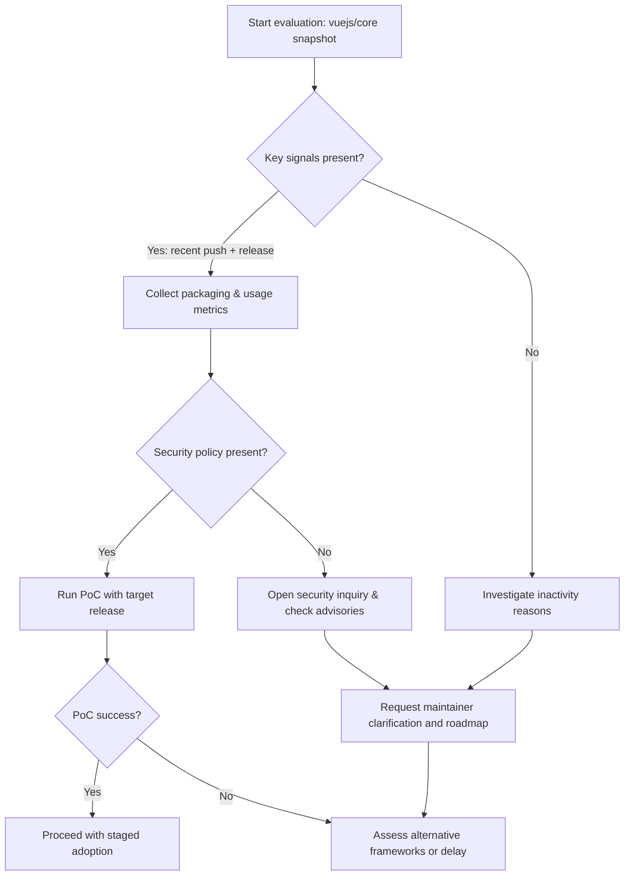

Executive summary

Vue.js (repository: vuejs/core) shows strong surface indicators of an active, maintained open-source frontend framework project: recent pushes and a published stable release in 2026, an MIT license, substantial forks, and a well-maintained README that points users to documentation and community channels. These repository-level facts alone do not prove adoption or suitability for a specific product; they are inputs you should combine with additional evidence (packaging metrics, dependency graphs, security advisories, and direct compatibility testing) before committing to Vue for a new or existing codebase.

For teams evaluating Vue, treat GitHub stars as an interest signal rather than usage or market share. Focus on repository activity and release cadence, maintenance signals (push and release timestamps), issue and pull-request triage patterns, license compatibility (MIT), and ecosystem footprints (packaged distribution and third-party integrations). Below we synthesize the available repository facts, label any architectural inferences that derive from README or repo structure, list selection risks, and provide a practical checklist for the additional evidence your engineering team should collect.

Table of contents

- [Quick repository snapshot](#quick-repository-snapshot)
- [Repository signals: activity, releases, and governance](#repository-signals-activity-releases-and-governance)
- [Issue load, PRs, and maintenance posture](#issue-load-prs-and-maintenance-posture)
- [License, language, and ecosystem footprint](#license-language-and-ecosystem-footprint)
- [Architectural inferences from README/repo structure](#architectural-inferences-from-readmerepo-structure)
- [Selection risks and recommended mitigations](#selection-risks-and-recommended-mitigations)
- [Action checklist: what to collect next](#action-checklist-what-to-collect-next)
- [Decision checklist](#decision-checklist)
- [Evidence, assumptions, and limitations](#evidence-assumptions-and-limitations)
- [Sources](#sources)
- [FAQs](#faqs)

## Table of contents

- [Quick repository snapshot](#quick-repository-snapshot)
- [Repository signals: activity, releases, and governance](#repository-signals-activity-releases-and-governance)
- [Issue load, PRs, and maintenance posture](#issue-load-prs-and-maintenance-posture)
- [License, language, and ecosystem footprint](#license-language-and-ecosystem-footprint)
- [Architectural inferences from README/repo structure](#architectural-inferences-from-readme-repo-structure)
- [Selection risks and recommended mitigations](#selection-risks-and-recommended-mitigations)
- [Action checklist: what to collect next](#action-checklist-what-to-collect-next)
- [Decision checklist](#decision-checklist)
- [Evidence, assumptions, and limitations](#evidence-assumptions-and-limitations)
- [Mermaid: adoption-decision flow](#mermaid-adoption-decision-flow)

## Quick repository snapshot

This table is a concise data snapshot derived from the primary repository metadata (data retrieved/generated on 2026-07-13):

| Field | Value | Source |
|---|---:|---|
| Repository | vuejs/core | [vuejs/core](https://github.com/vuejs/core)
| Description | Progressive, incrementally-adoptable JS framework for building UI | [vuejs/core](https://github.com/vuejs/core)
| Stars | 53,946 | [vuejs/core](https://github.com/vuejs/core)
| Forks | 9,165 | [vuejs/core](https://github.com/vuejs/core)
| Watchers | 749 | [vuejs/core](https://github.com/vuejs/core)
| Open issues | 918 | [vuejs/core](https://github.com/vuejs/core)
| Primary language | TypeScript | [vuejs/core](https://github.com/vuejs/core)
| License | MIT | [vuejs/core](https://github.com/vuejs/core)
| Created at | 2018-06-12T13:49:36Z | [vuejs/core](https://github.com/vuejs/core)
| Last push | 2026-07-13T00:25:23Z | [vuejs/core](https://github.com/vuejs/core)
| Last updated | 2026-07-13T00:19:50Z | [vuejs/core](https://github.com/vuejs/core)
| Latest stable release | v3.5.39 (published 2026-06-25T09:44:02Z) | [release v3.5.39](https://github.com/vuejs/core/releases/tag/v3.5.39)
| Default branch | main | [vuejs/core](https://github.com/vuejs/core)
| Homepage | https://vuejs.org/ | [vuejs/core](https://github.com/vuejs/core)

> [!NOTE]
> The data above were retrieved from the repository metadata included in the editorial data package. The generation timestamp for this analysis is 2026-07-13T02:27:53.698686+00:00.

## Repository signals: activity, releases, and governance

This section focuses on objective signals available from the repository metadata and release metadata.

- Activity: The repository shows a recent push timestamp (pushed_at: 2026-07-13T00:25:23Z) and updated_at in the same timeframe. These are direct signals that contributors are committing and CI is updating the repository as of 2026-07-13. Activity is a maintenance signal but does not by itself indicate responsiveness to security reports or API-stability guarantees.

- Release metadata: The latest stable release recorded in the supplied data is v3.5.39, published 2026-06-25T09:44:02Z ([release source](https://github.com/vuejs/core/releases/tag/v3.5.39)). The presence of a recent stable release combined with recent pushes suggests an active release process; you should inspect the project's CHANGELOG and release notes for breaking-change policies and migration guidance.

- Governance pointers in README: The README instructs users to use the official forum or community chat for support and restricts the issue tracker to bugs and feature requests. The README also points to a contributing guide and sponsors/backers pages. These are governance signals but not a full governance policy—teams should read CONTRIBUTING and governance documents for release policy and security reporting procedures.

Table: Release + activity signals

| Signal | Evidence (from repository metadata) | Practical interpretation |
|---|---|---|
| Recent pushes | pushed_at: 2026-07-13T00:25:23Z | Active development; repository receiving commits close to generation date.
| Recent stable release | v3.5.39 published 2026-06-25 | Releases are occurring in 2026; inspect change history for cadence and breaking-change notes.
| Contributing & issue guidance | README points to contributing guide and issue helper | There is a documented path for contributions and issue triage; read those documents for contribution norms.

> [!TIP]
> Use the repository's CONTRIBUTING guide and the new-issue helper cited in the README to understand how the project prioritizes bug reports vs. feature requests before opening issues on behalf of your team.

## Issue load, PRs, and maintenance posture

Facts from the repository metadata:

- Open issues: 918 (this is the number reported in the repository snapshot) [vuejs/core].

Important clarifications and how to interpret them:

- Open-issue counts are not defect counts. An open-issue can be a feature request, a discussion, a triaged backlog item, or a bug; the raw number alone does not measure code quality or defect density. Use the open-issue count as a triage workload indicator, not a binary quality signal.

- What to inspect next (recommended):
  - Issue triage patterns: how quickly are issues acknowledged and labeled? Are there maintainers triaging incoming reports?
  - Security reporting channels: look for a SECURITY.md, dedicated security contact, or instructions in CONTRIBUTING for reporting vulnerabilities.
  - Pull request merge velocity: how rapidly are user PRs merged or closed? Is there an active CI status on PRs? (These are not provided in the supplied data, so collect them from the live repository.)

Table: Interpreting open-issue counts

| Question | Why it matters | Where to check |
|---|---|---|
| Are issues triaged? | Triage shows maintainers' bandwidth and priorities | Look for labels, triage comments, and issue templates in the repo.
| How many security issues are open? | Security backlog impacts risk and remediation timelines | Search for "security" labels and a SECURITY.md file.
| PR merge/close rate | Indicates how fast contributions are integrated or rejected | Inspect closed PRs over the past 3–6 months on the live repo.

> [!WARNING]
> Raw open-issue counts (918) should not be used to conclude the project is unstable or buggy. They only indicate outstanding tracked items and must be qualified by triage patterns and severity breakdowns.

## License, language, and ecosystem footprint

Facts from the repository metadata:

- License: MIT (per the repository metadata) [vuejs/core].
- Primary language: TypeScript (per the repository metadata) [vuejs/core].
- Forks: 9,165; Watchers: 749; Stars: 53,946 — these are social and collaboration signals, not direct usage metrics [vuejs/core].
- Homepage: https://vuejs.org/ — README points users to official documentation there [vuejs/core].

What these signals mean for selection:

- MIT license is permissive and usually compatible with proprietary products, but legal teams should confirm license compatibility with any third-party dependencies you will add. The repository's MIT license is stated in the metadata and README.

- TypeScript as the primary language suggests the codebase is written in and exposes types. For teams that use TypeScript, this can be a productivity and integration advantage. For strictly plain-JavaScript teams, TypeScript presence does not prevent use, but you should confirm the API surface and type export strategy.

- Ecosystem footprint: forks and social metrics suggest a large community interest and potential for third-party integrations. To confirm ecosystem health, collect package-distribution metrics (npm downloads, package dependents), third-party UI libraries for Vue, and vetted enterprise usage references (not supplied here).

## Architectural inferences from README/repo structure

The editorial rules require that architectural conclusions derived from README contents or repository structure be explicitly labeled.

Architectural inferences (explicitly labeled):

- Inference: The project is presented as a progressive, incrementally-adoptable framework. This is stated in the repository description and README and suggests an architectural goal of supporting partial migrations and component-level adoption. (Inference derived from README/repository description: [vuejs/core](https://github.com/vuejs/core)).

- Inference: The README points to extensive external documentation at vuejs.org and to a contributing guide and issue helper. This implies that the project expects users to rely on external documentation and community channels for onboarding and support. (Inference derived from README: [vuejs/core](https://github.com/vuejs/core)).

These are inferences about intended usage and project structure and must be validated by reviewing the official documentation and migration guides on the project's website.

> [!NOTE]
> Inferences above are drawn from the repository description and README text included in the supplied editorial data. They are not direct measurements of runtime architecture in your application.

## Selection risks and recommended mitigations

Below are selection risks you should consider before adopting Vue in a project, based on repository signals and best-practice evaluative steps. These are not claims about vulnerabilities or specific incompatibilities — they are categories of risk to investigate.

Table: Selection risks and mitigations

| Risk category | Explanation (based on repository signals) | Recommended mitigation / evidence to collect |
|---|---|---|
| API/upgrade risk | Framework releases may include breaking changes; repository shows active development and a recent v3.x release. | Review CHANGELOG and release notes for breaking-change policy; run migration guides against a small prototype.
| Maintenance bandwidth | Open-issue backlog (918) could reflect triage workload or backlog tasks. | Inspect issue and PR triage cadence; check community-maintainer ratios and response times for critical labels.
| Security response process | No SECURITY.md content was supplied; presence/absence of a security policy affects disclosure and patching speed. | Check for SECURITY.md and official security contact; search for published advisories or CVE records (collect from package scanners and advisories databases).
| Ecosystem compatibility | TypeScript language and ecosystem libraries may vary in maturity across integrations. | Verify third-party library support, official adapter stability (e.g., router, state libs), and compatibility matrix for libraries you need.
| Long-term sustainability | Sponsorship and backer references exist in the README, but sustainability depends on funding and governance. | Evaluate sponsorships, core-team structure, corporate backing, and governance docs for long-term stewardship insights.

> [!TIP]
> When possible, prototype a targeted feature or migration path using the exact Vue release you plan to adopt (e.g., v3.5.39) and measure integration complexity, performance, and developer ergonomics before committing.

## Action checklist: what to collect next

This list prioritizes evidence that fills gaps left by the repository snapshot and informs an adoption decision.

1. Packaging and usage metrics
   - npm package name(s) used in production and daily/weekly download statistics.
   - Number of dependent packages and package-dependents via npm or libraries.io.
2. Security and vulnerability history
   - SECURITY.md presence and security contact.
   - Historical advisories and CVEs referencing the project or its direct dependencies.
3. Release and migration policies
   - CHANGELOG and release notes for the last 12–24 months to understand cadence and breaking changes.
   - Upgrade/migration guides and any published deprecation schedules.
4. Issue/PR triage and SLA signals
   - Average time-to-first-response for issues labeled as bug/security/critical.
   - PR merge velocity and test/CI coverage for PRs.
5. Ecosystem compatibility
   - Popular third-party libraries you plan to use (UI frameworks, state management, router, testing tools): verify compatibility with the specific Vue release.
6. Real-world usage references
   - Public case studies, job-posting trends mentioning Vue, or known company projects (collect directly; do not assume from stars).
7. Local testing
   - Create a minimal prototype integrating the exact stack your team will use (build system, SSR/CSR, mobile wrappers, etc.) and exercise the features you rely on.

## Decision checklist

Use this checklist to convert signals into a decision within a fortnightly evaluation cycle:

- [ ] Confirm package names and verify npm download trends for the specific release.
- [ ] Validate the presence and content of SECURITY.md and security contact procedures.
- [ ] Read CHANGELOG for v3.x and the last several minor releases for breaking-change patterns.
- [ ] Run a migration/proof-of-concept for a narrow, representative feature using the targeted Vue release.
- [ ] Tally active maintainers and check community responses for security/bug labels for recent issues.
- [ ] Verify license compatibility with your legal/compliance team (MIT confirmed in repo metadata).
- [ ] Confirm third-party libraries you need declare compatibility with your chosen Vue release.

## Evidence, assumptions, and limitations

Evidence used (explicit):

- Repository metadata fields supplied in the editorial data package, including stars (53,946), forks (9,165), watchers (749), open_issues (918), language (TypeScript), license (MIT), created_at, updated_at, pushed_at, default_branch, and homepage. Source: [Vue.js canonical repository](https://github.com/vuejs/core).
- Latest release metadata: v3.5.39 published 2026-06-25T09:44:02Z. Source: [Vue.js latest GitHub release](https://github.com/vuejs/core/releases/tag/v3.5.39).
- README snippets included in the editorial data (points to vuejs.org documentation, contributing guide, issue helper, sponsors/backers references).

Assumptions and explicit labeling rules:

- I did not invent any numeric benchmark, adoption percentage, or claim about specific companies using Vue. Any such evidence should be gathered from independent sources (npm, dependency graphs, case studies).
- Architectural statements that rely on the README or repository descriptions are explicitly labeled as "inferences" above.
- GitHub stars are treated as interest signals and not equated with usage or market share.
- Open-issue counts are treated as backlog or triage load indicators, not as defect counts.

Limitations:

- This analysis is limited to the repository metadata and release metadata supplied in the editorial data package. It does not include live npm registry metrics, CI logs, issue/PR timelines, or third-party ecosystem analysis that require querying external services.
- The repository snapshot is current as of the generation timestamp (2026-07-13T02:27:53.698686+00:00). Any activity after that timestamp is not reflected here.

## Mermaid: adoption-decision flow

## Sources

- Vue.js canonical repository: https://github.com/vuejs/core
- Vue.js latest GitHub release (v3.5.39): https://github.com/vuejs/core/releases/tag/v3.5.39

## FAQ

Q: Do GitHub stars mean Vue is widely used?  
A: No. GitHub stars are interest signals and should not be interpreted as usage or market share. Use package download metrics and dependent-package counts to measure usage.

Q: Is the project actively maintained?  
A: The supplied repository metadata shows recent pushes (pushed_at: 2026-07-13T00:25:23Z) and a stable release (v3.5.39 published 2026-06-25), which are indicators of activity. Teams should verify issue/PR response patterns for maintenance posture.

Q: Does the repository license allow commercial use?  
A: The repository is licensed under MIT per the supplied metadata. Confirm with your legal team for your organization’s specific compliance needs.

Q: Is the open issue count a sign of poor quality?  
A: No. Open issues (918 in the supplied snapshot) are not defect counts. They include feature requests, backlog items, and discussions. Inspect labels and triage to understand severity distribution.

Q: What additional metrics should I collect before adopting Vue?  
A: Collect npm download statistics for the package version you plan to use, dependency/consumer graphs, change logs for recent releases, security advisories history, and run a representative PoC using the target release.

Q: Where should I look for security reporting procedures?  
A: Check the repository for SECURITY.md, the CONTRIBUTING guide, and project documentation for instructions. If absent, contact maintainers via the channels listed in the README and consult public advisories databases.

Article metadata for SEO and integrations

Search intent: informational

Canonical URL: https://madewithwhat.net/vue-adoption-analysis

Open Graph (for embedding):
- og:title: "Vue.js adoption analysis — signals from vuejs/core"
- og:description: "Evidence-grounded adoption analysis of Vue.js (vuejs/core): repository activity, releases, issues, license, and recommended evidence to collect before adoption."
- og:url: https://madewithwhat.net/vue-adoption-analysis
- og:image: /assets/2026/07/28/adoption-analysis-vue-48-cover.jpg

Article schema (JSON-LD snippet for reference):

{
  "@context": "https://schema.org",
  "@type": "TechArticle",
  "headline": "Vue.js adoption analysis — signals from vuejs/core",
  "description": "Evidence-grounded adoption analysis of Vue.js (vuejs/core): repository activity, releases, issues, license, and recommended evidence to collect before adoption.",
  "author": {"@type": "Organization", "name": "MadeWithWhat"},
  "publisher": {"@type": "Organization", "name": "MadeWithWhat", "url": "https://madewithwhat.net"},
  "mainEntityOfPage": {"@type": "WebPage", "@id": "https://madewithwhat.net/vue-adoption-analysis"},
  "datePublished": "2026-07-28",
  "dateModified": "2026-07-13"
}
