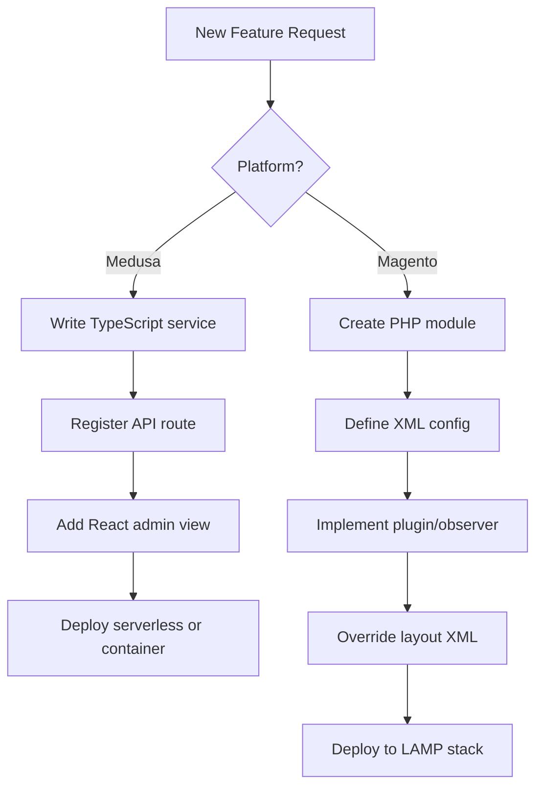

# Medusa vs Magento: Choosing Your Commerce Stack in 2026

Medusa and Magento occupy opposite ends of the commerce platform spectrum. Medusa is a TypeScript-first, headless framework built for developers who need to compose custom commerce experiences without inheriting decades of architectural decisions. Magento (Magento Open Source) is a mature PHP monolith that delivers a complete ecommerce solution out of the box, including an admin interface, storefront themes, and extensive third-party integrations built over 15 years of market presence.

For teams evaluating these platforms in 2026, the choice hinges on architectural preference, customization scope, and operational tolerance. Medusa appeals to JavaScript-native teams building unique buyer experiences—B2B portals, subscription services, marketplace backends—where core commerce logic is just one component of a larger application. Magento suits organizations that need a proven, turnkey system with enterprise features, established hosting ecosystems, and a large pool of PHP developers. Neither is objectively superior; each excels in distinct project contexts.

---

## Table of Contents

- [Architecture and Technical Foundation](#architecture-and-technical-foundation)
- [Customization and Development Experience](#customization-and-development-experience)
- [Feature Set and Commerce Capabilities](#feature-set-and-commerce-capabilities)
- [Performance and Scalability Considerations](#performance-and-scalability-considerations)
- [Deployment and Operational Overhead](#deployment-and-operational-overhead)
- [Community, Ecosystem, and Support](#community-ecosystem-and-support)
- [Decision Matrix for Four Project Profiles](#decision-matrix-for-four-project-profiles)
- [Migration Considerations](#migration-considerations)
- [Evidence, Assumptions, and Limitations](#evidence-assumptions-and-limitations)
- [Decision Checklist](#decision-checklist)
- [Frequently Asked Questions](#frequently-asked-questions)
- [Sources](#sources)

---

## Architecture and Technical Foundation

### Medusa: Modular, API-First Framework

Medusa is a Node.js/TypeScript framework that positions itself as "building blocks for digital commerce." The [repository](https://github.com/medusajs/medusa) describes an architecture centered on commerce modules—reusable, framework-independent packages for cart, product, order, inventory, and payment primitives. These modules can be composed into custom applications or integrated into existing Node.js services.

> [!NOTE]
> **Inferred from repository structure:** Medusa's monorepo contains separate packages for the core framework, admin dashboard (React), and individual commerce modules. This modular design suggests that developers are expected to pick only the components they need, rather than deploy a full application.

Medusa runs on PostgreSQL for persistence and ships with MikroORM as its default ORM (as of [v2.18.0](https://github.com/medusajs/medusa/releases/tag/v2.18.0), the default query load strategy changed to `BALANCED` for improved performance). The framework exposes RESTful and workflow-based APIs, enabling developers to build decoupled frontends in React, Vue, Next.js, or mobile frameworks.

### Magento: Monolithic Full-Stack Platform

Magento 2, released in 2015 and continuously updated (latest stable: [2.4.9](https://github.com/magento/magento2/releases/tag/2.4.9), May 2026), is a PHP application built on the Laminas framework (formerly Zend). It includes a MySQL-backed data layer, a Knockout.js/jQuery admin interface, and LESS/XML-based frontend theming. Magento's architecture follows a modular monolith pattern: functionality is organized into modules, but all code runs within a single application context.

Magento provides a complete ecommerce stack: catalog management, checkout, CMS, multi-store support, and promotion engines are all included. The platform is designed for deployment as a unified system, though it does offer REST and GraphQL APIs for headless implementations.

### Key Architectural Differences

| Dimension | Medusa | Magento |
|-----------|--------|--------|
| **Runtime** | Node.js (v18+) | PHP 8.1–8.3 |
| **Language** | TypeScript | PHP |
| **Database** | PostgreSQL | MySQL/MariaDB |
| **Default deployment** | Headless API + separate frontend | Monolithic (API + admin + storefront) |
| **ORM** | MikroORM | Doctrine-inspired models |
| **Admin UI** | React (Vite-based) | Knockout.js + RequireJS |
| **License** | MIT | OSL-3.0 |

> [!TIP]
> If your team already operates a Node.js infrastructure (e.g., Next.js frontend, Express APIs), Medusa integrates more naturally. If your operations team has PHP/MySQL expertise and you need a complete system with minimal frontend work, Magento reduces upfront development.

---

## Customization and Development Experience

### Medusa: Code-First Extension Model

Medusa treats customization as a first-class concern. Developers extend functionality by:

- **Creating custom modules:** Implement new services, workflows, and API routes using the Medusa framework's conventions.
- **Subscribing to domain events:** Hook into cart creation, order placement, inventory changes (new in v2.18.0), and other lifecycle events.
- **Overriding generated services:** Replace default CRUD logic for product, customer, or order entities.

The [v2.18.0 release notes](https://github.com/medusajs/medusa/releases/tag/v2.18.0) highlight breaking changes in generated internal services (e.g., `delete` method return types now accommodate composite primary keys), indicating that Medusa's API surface is still stabilizing. Teams should expect to track breaking changes across minor versions.

Medusa's admin dashboard is built with React and supports custom views through an admin extension API. The [v2.18.0 release](https://github.com/medusajs/medusa/releases/tag/v2.18.0) introduced resizable data grid columns, configurable view settings, and dynamic filter resolution, making it easier to tailor the admin interface without forking the codebase.

### Magento: XML Configuration and Plugin System

Magento's customization model relies on:

- **Modules:** PHP classes organized into `app/code` directories, registered via XML.
- **Plugins (interceptors):** Modify method behavior before, after, or around execution without overriding core classes.
- **Observers:** Listen to events fired during request processing.
- **Layouts and themes:** Override frontend templates and styles using XML layout files and LESS.

Magento's plugin system is powerful but requires familiarity with dependency injection, XML configuration, and the platform's event system. Large customizations often involve multiple XML files, preference declarations, and careful attention to plugin sort order.

The Magento admin UI (still based on Knockout.js as of 2.4.9) is less amenable to modern JavaScript tooling. Custom admin pages typically involve RequireJS modules and PHTML templates.

### Developer Velocity Comparison

For teams with JavaScript expertise, Medusa's TypeScript-native approach and modern tooling (Vite, ES modules) reduce context-switching. Magento's PHP/XML workflow is well-documented but steeper for developers unfamiliar with Magento conventions.

> [!WARNING]
> **Medusa caveat:** As of February 2026, Medusa's framework is under active development (most recent release: January 23, 2026). The v2.18.0 release introduced two breaking changes affecting internal service return types and default database query strategies. Teams adopting Medusa should budget for upgrade effort and monitor release notes carefully.

---

## Feature Set and Commerce Capabilities

### Medusa: Foundational Primitives, Selective Depth

Medusa provides core commerce modules:

- **Product catalog:** Variants, options, inventory management.
- **Cart and checkout:** Multi-step workflows, promotion engine, tax calculation.
- **Orders:** Fulfillment, returns, and order transfer (v2.18.0 added guest customer transfer).
- **Payment:** Pluggable providers (Stripe integration available via `@medusajs/payment-stripe`, which [added Payment Method Configuration support](https://github.com/medusajs/medusa/pull/15191) in v2.18.0).
- **Inventory:** Location-based stock, reservation, and domain events (introduced in v2.18.0).
- **Customer accounts:** Authentication, order history.

Medusa does not ship with:

- A public-facing storefront (developers build their own using Next.js, Gatsby, etc.).
- Built-in CMS (teams integrate headless CMS solutions like Contentful or Strapi).
- Multi-store/multi-tenant management (achievable but requires custom implementation).
- Advanced B2B features (quote management, approval workflows, company accounts require custom modules).

### Magento: Comprehensive Out-of-the-Box Functionality

Magento Open Source includes:

- **Catalog management:** Configurable products, bundles, grouped products, downloadable goods.
- **Checkout and payment:** Multiple payment gateways, saved payment methods, guest checkout.
- **CMS:** Page builder, blocks, widgets, URL rewrites.
- **Promotions:** Cart price rules, catalog price rules, tier pricing.
- **Multi-store:** Manage multiple brands, languages, and currencies from one installation.
- **Inventory:** Multi-source inventory (MSI) for warehouse management.
- **Reporting:** Sales, tax, product, and customer reports.
- **SEO:** URL rewrites, sitemaps, canonical URLs, meta tags.

Magento's Adobe Commerce edition (paid) adds B2B features, advanced search (Elasticsearch/OpenSearch), customer segmentation, and staging/preview workflows. The open-source edition lacks these but remains feature-complete for standard B2C and small-scale B2B use cases.

### Feature Maturity Trade-Off

| Feature Domain | Medusa | Magento |
|----------------|--------|--------|
| **Product catalog** | Variants, options, inventory tracking | Configurable, bundled, grouped, virtual, downloadable products |
| **Checkout** | Multi-step API workflows | Configurable checkout steps, saved addresses, multiple shipping methods |
| **Promotions** | Basic discount workflows | Cart rules, catalog rules, tier pricing, coupons |
| **CMS** | None (external integration) | Page builder, blocks, widgets |
| **Multi-currency** | Supported | Supported with store-level configuration |
| **Multi-warehouse** | Location-based inventory | Multi-Source Inventory (MSI) |
| **B2B features** | Custom implementation required | Quote management, company accounts, shared catalogs (Adobe Commerce only) |
| **Search** | External (Algolia, Meilisearch, etc.) | Built-in MySQL full-text, Elasticsearch (Adobe Commerce) |

Medusa is a framework; Magento is a platform. If your project requires 80% of standard ecommerce features and 20% custom logic, Magento's completeness reduces build time. If you need 40% custom, Medusa's lightweight core avoids the overhead of disabling or working around unused features.

---

## Performance and Scalability Considerations

### Medusa: Lightweight Core, Horizontal Scaling

Medusa's Node.js runtime and PostgreSQL backend support horizontal scaling patterns common in cloud-native deployments:

- **Stateless API servers:** Deploy multiple instances behind a load balancer.
- **Async workflows:** Background jobs for order processing, inventory synchronization, and email dispatch.
- **Database connection pooling:** The v2.18.0 release added support for [dynamic password functions](https://github.com/medusajs/medusa/pull/15686), enabling AWS RDS IAM authentication and short-lived credential rotation (useful for GCP IAM, Azure AD, or Vault integrations).

Performance benchmarks are not available in the provided repository data. Anecdotal community reports suggest Medusa handles moderate traffic well but lacks the battle-tested caching layers (Varnish, Redis full-page cache) that Magento has refined over years of high-traffic deployments.

### Magento: Mature Caching, Higher Resource Footprint

Magento is engineered for scale but requires careful tuning:

- **Full-page caching:** Built-in support for Varnish and Redis.
- **Session storage:** Redis or Memcached for distributed sessions.
- **Database sharding:** Magento Commerce supports split databases (checkout, order, product data).
- **Indexers:** Background processes rebuild catalog, price, and search indexes; poorly managed indexers are a common bottleneck.

Magento's PHP/MySQL stack is CPU- and memory-intensive. A typical production deployment requires 4–8 GB RAM per web node, plus dedicated database and cache servers. Vertical scaling (larger instances) is often necessary before horizontal scaling delivers returns.

> [!NOTE]
> **Inference from architectural patterns:** Medusa's stateless API design and use of PostgreSQL (which scales well with read replicas and connection pooling) suggest it is optimized for containerized, auto-scaling environments. Magento's reliance on filesystem-based caching and synchronous indexing processes makes it better suited to traditional VM or bare-metal deployments with persistent storage.

---

## Deployment and Operational Overhead

### Medusa: Cloud-Native Deployment

Medusa applications deploy as:

- **Containers:** Docker images running the Node.js API server.
- **Serverless:** AWS Lambda or Vercel functions (with cold-start considerations).
- **Managed services:** [Medusa Cloud](https://medusajs.com/cloud/) offers hosted deployment, automated scaling, and maintenance.

Operational requirements:

- PostgreSQL database (AWS RDS, Google Cloud SQL, or self-hosted).
- Redis for job queues (optional but recommended).
- S3-compatible storage for media assets.
- CDN for static assets and API caching.

Medusa's infrastructure footprint is minimal compared to Magento. A small production deployment can run on a single container with 1 GB RAM and a managed PostgreSQL instance.

### Magento: Traditional Hosting, Higher Complexity

Magento requires:

- **LAMP/LEMP stack:** Linux, Apache/Nginx, MySQL/MariaDB, PHP-FPM.
- **Varnish cache:** Full-page caching layer.
- **Redis/Memcached:** Session and cache storage.
- **Elasticsearch/OpenSearch:** Product search (required in Adobe Commerce, optional in Open Source).
- **Message queue:** RabbitMQ or MySQL for async processing.

A production-grade Magento deployment typically involves:

- Multiple web nodes behind a load balancer.
- Dedicated MySQL server with replication.
- Separate Redis instances for cache, sessions, and page cache.
- Varnish cache servers.
- Cron jobs for indexing, order export, email, and cleanup tasks.

Hosting options include:

- **Self-managed:** AWS EC2, Google Compute Engine, dedicated servers.
- **Managed hosting:** Adobe Commerce Cloud (paid), Nexcess, Cloudways, or other Magento-specialized hosts.

Magento's operational complexity is higher. Teams need experience with PHP application tuning, MySQL optimization, and Varnish configuration. The platform benefits from dedicated DevOps resources.

### Deployment Comparison

| Aspect | Medusa | Magento |
|--------|--------|--------|
| **Minimum footprint** | 1 container + PostgreSQL | 2–3 VMs + MySQL + Redis + Varnish |
| **Scaling model** | Horizontal (add API nodes) | Vertical + horizontal (tune first, then scale) |
| **Managed options** | Medusa Cloud, Vercel, Railway | Adobe Commerce Cloud, Nexcess, Cloudways |
| **Infrastructure knowledge** | Docker, PostgreSQL, cloud primitives | LAMP stack, Varnish, Elasticsearch, message queues |
| **Cold start latency** | Relevant for serverless | Not applicable |

---

## Community, Ecosystem, and Support

### Medusa: Growing JavaScript-Native Community

- **GitHub activity:** 35,549 stars, 5,024 forks, 95 open issues (as of August 3, 2026).
- **Community:** 14,000+ members in [Discord](https://discord.gg/medusajs), active discussions in [GitHub Discussions](https://github.com/medusajs/medusa/discussions).
- **Release cadence:** Frequent updates (v2.18.0 released July 23, 2026; prior releases in May and April).
- **Integrations:** Stripe payment provider, Contentful CMS, Algolia search, Sendgrid email; ecosystem is smaller but growing.
- **Support:** Community support via Discord and GitHub; Medusa Cloud offers commercial support.

Medusa's community skews toward JavaScript developers, particularly those building headless architectures with Next.js, Gatsby, or React Native.

### Magento: Mature, Enterprise-Scale Ecosystem

- **GitHub activity:** 12,154 stars, 9,356 forks, 2,110 open issues (as of August 3, 2026).
- **Community:** Thousands of developers, active Slack channels ([magentocommeng.slack.com](https://magentocommeng.slack.com)), Stack Exchange site, regional user groups.
- **Marketplace:** [Magento Marketplace](https://marketplace.magento.com/) offers 3,000+ extensions for payments, shipping, ERP integration, CRM, and specialized features.
- **Agency ecosystem:** Hundreds of Magento-specialized agencies and thousands of certified developers worldwide.
- **Support:** Community support via forums and Slack; Adobe offers paid support tiers for Adobe Commerce.

Magento's ecosystem is one of its strongest assets. Nearly any commerce requirement has an existing extension or a developer experienced in implementing it.

> [!TIP]
> If your project depends on integrations with legacy ERP systems, complex shipping providers, or region-specific payment gateways, Magento's extension marketplace likely has pre-built connectors. For Medusa, expect to build custom integrations or use general-purpose Node.js libraries.

---

## Decision Matrix for Four Project Profiles

### Profile 1: Early-Stage DTC Brand with Custom Storefront

**Context:** A direct-to-consumer fashion brand launching in Q2 2026, building a highly designed Next.js storefront with subscription features and loyalty rewards.

| Criterion | Medusa | Magento |
|-----------|--------|--------|
| **Frontend control** | ✅ Full control over Next.js app | ⚠️ Requires headless mode (PWA Studio or custom React) |
| **Subscription support** | ✅ Build custom subscription module | ⚠️ Requires third-party extension |
| **Time to MVP** | ✅ 4–6 weeks (API + storefront) | ❌ 8–12 weeks (configure, theme, or build headless) |
| **Developer fit** | ✅ JavaScript team | ❌ Need PHP developers |
| **Operational cost** | ✅ $200–500/month (Medusa Cloud + Vercel) | ❌ $800–2,000/month (managed hosting + extensions) |

**Recommendation:** Medusa. The brand's need for a custom storefront and bespoke subscription logic aligns with Medusa's framework approach. Magento's monolithic architecture adds unnecessary overhead.

---

### Profile 2: Mid-Market B2C Retailer with 50K SKUs

**Context:** An established home goods retailer migrating from a legacy platform, selling 50,000 SKUs across three brands, requiring multi-warehouse inventory and extensive catalog promotions.

| Criterion | Medusa | Magento |
|-----------|--------|--------|
| **Catalog complexity** | ⚠️ Supports variants; custom logic for bundles | ✅ Native support for bundles, grouped products |
| **Multi-store** | ❌ Requires custom implementation | ✅ Built-in multi-store with shared catalog |
| **Promotions** | ⚠️ Basic discount engine; custom rules needed | ✅ Cart rules, catalog rules, tier pricing |
| **Search** | ❌ Requires Algolia or Meilisearch integration | ✅ MySQL full-text or Elasticsearch |
| **Marketplace extensions** | ❌ Limited integrations | ✅ 3,000+ extensions (ERP, PIM, shipping) |
| **Team skills** | ❌ Would need to hire JavaScript developers | ✅ Existing PHP/Magento team |

**Recommendation:** Magento. The retailer's catalog complexity, multi-brand requirements, and need for proven integrations favor Magento's feature completeness. Medusa would require significant custom development.

---

### Profile 3: B2B Industrial Supplier Building a Custom Portal

**Context:** A manufacturing distributor creating a customer portal with quote management, approval workflows, and integration with a legacy ERP system.

| Criterion | Medusa | Magento |
|-----------|--------|--------|
| **Custom workflows** | ✅ Build quote and approval workflows in TypeScript | ⚠️ Requires plugins and custom modules |
| **ERP integration** | ✅ Write custom API client | ⚠️ May find pre-built connector, or hire agency |
| **B2B features** | ⚠️ Build from scratch (company accounts, approval chains) | ✅ Adobe Commerce B2B (paid); Open Source requires extensions |
| **UI customization** | ✅ Full control over React portal | ⚠️ Adapt Magento admin or build separate React app |
| **Flexibility** | ✅ No legacy constraints | ❌ Magento's architecture may constrain workflow logic |

**Recommendation:** Medusa. The project's emphasis on custom B2B workflows and ERP integration aligns with Medusa's framework flexibility. Magento Open Source lacks native B2B features, and Adobe Commerce B2B licensing adds cost. Medusa allows the team to build exactly the workflows they need without working around platform opinions.

---

### Profile 4: Enterprise Retailer with Existing Magento 2.3 Installation

**Context:** A large retailer running Magento 2.3 (end-of-life) with 200+ custom modules and integrations, needing to upgrade to 2.4.9 or migrate to a new platform.

| Criterion | Medusa | Magento 2.4.9 |
|-----------|--------|--------|
| **Migration path** | ❌ Full replatforming (data migration, rebuild integrations) | ✅ In-place upgrade (still requires testing) |
| **Code reuse** | ❌ No PHP code reuse | ✅ Modules compatible with 2.4.x (with adjustments) |
| **Risk** | ❌ High (new platform, new team skills) | ⚠️ Medium (upgrade complexity, but familiar) |
| **Timeline** | ❌ 12–18 months | ✅ 3–6 months |
| **Cost** | ❌ Full rebuild cost + retraining | ⚠️ Testing and module updates |

**Recommendation:** Magento 2.4.9. For an enterprise with deep Magento investment, the cost and risk of replatforming to Medusa outweigh the benefits unless the current system is fundamentally broken. Upgrade to 2.4.9, and evaluate Medusa for future greenfield projects or when business requirements change significantly.

---

## Migration Considerations

### Migrating from Magento to Medusa

If you're moving from Magento to Medusa, plan for:

1. **Data migration:** Export products, customers, and orders from Magento's MySQL schema. Write ETL scripts to transform into Medusa's PostgreSQL schema. Consider third-party migration tools if available (none identified in provided sources).
2. **Integration rebuild:** Payment gateways, shipping providers, ERP connectors, and CRM integrations must be reimplemented using Medusa's module system or Node.js libraries.
3. **Frontend rebuild:** Magento's PHTML/Knockout storefront cannot be reused. Rebuild in Next.js, Gatsby, or another JavaScript framework.
4. **Workflow mapping:** Translate Magento's promotion rules, checkout steps, and order processing workflows into Medusa's event-driven architecture.
5. **Team reskilling:** PHP developers need to learn TypeScript, Node.js, and React.

Timeline: 9–18 months depending on catalog size, customization depth, and team capacity.

### Migrating from Medusa to Magento

Less common, but possible:

1. **Data export:** Medusa's PostgreSQL tables are simpler than Magento's. Export products, customers, and orders to CSV or JSON.
2. **Import to Magento:** Use Magento's import/export tools or extensions to bulk-import data.
3. **Storefront replacement:** If your Medusa storefront is Next.js-based, you can continue using it with Magento's GraphQL API (headless mode). Alternatively, adopt a Magento theme.
4. **Customization rebuild:** Port TypeScript modules to PHP plugins and observers.

Timeline: 6–12 months for a typical installation.

---

## Evidence, Assumptions, and Limitations

### Evidence Sources

- **Medusa repository data:** Stars, forks, topics, and README content from [medusajs/medusa](https://github.com/medusajs/medusa) (accessed August 3, 2026).
- **Medusa v2.18.0 release notes:** Feature highlights, breaking changes, and dependency updates ([release notes](https://github.com/medusajs/medusa/releases/tag/v2.18.0), published July 23, 2026).
- **Magento repository data:** Stars, forks, topics, and README content from [magento/magento2](https://github.com/magento/magento2) (accessed August 3, 2026).
- **Magento 2.4.9 release tag:** Release date and version number ([release page](https://github.com/magento/magento2/releases/tag/2.4.9), published May 12, 2026).

### Assumptions and Inferences

- **Medusa architecture:** Inferred from repository structure (monorepo with separate packages for framework, admin, and modules) and README description as "building blocks."
- **Performance characteristics:** No benchmark data provided. Assessments based on typical Node.js/PostgreSQL and PHP/MySQL performance patterns.
- **Ecosystem maturity:** Magento's marketplace size and agency network are well-documented; Medusa's integration count inferred from topics and community activity.
- **Operational patterns:** Deployment recommendations derived from typical technology stack requirements (e.g., Varnish for Magento, container orchestration for Medusa).

### Limitations

- **No direct benchmarks:** No performance, load testing, or scalability data available in provided sources.
- **GitHub metrics interpretation:** Stars indicate interest, not market share or production adoption. Magento's lower star count (12,154 vs. Medusa's 35,549) reflects its older repository creation date (2011 vs. 2020) and enterprise focus (many users run proprietary forks).
- **Open issue counts:** Medusa has 95 open issues; Magento has 2,110. These reflect project scale and reporting patterns, not defect density.
- **Adobe Commerce features:** Magento Open Source analysis excludes Adobe Commerce (paid) features like B2B modules, advanced search, and customer segmentation.

---

## Decision Checklist

Use this checklist to guide your platform selection:

- [ ] **Team skills:** Do we have JavaScript/TypeScript expertise (Medusa) or PHP/MySQL expertise (Magento)?
- [ ] **Storefront requirements:** Do we need a custom, highly designed frontend (Medusa) or can we use a pre-built theme (Magento)?
- [ ] **Catalog complexity:** Do we sell simple variants (Medusa) or bundles, configurables, and downloadables (Magento)?
- [ ] **Feature completeness:** Do we need 80%+ standard ecommerce features out of the box (Magento), or are we building custom workflows (Medusa)?
- [ ] **Multi-store/multi-brand:** Do we manage multiple brands or regions from one installation (Magento), or is this a single-brand project (Medusa)?
- [ ] **Integration ecosystem:** Do we rely on third-party extensions for ERP, PIM, or niche features (Magento), or can we build custom integrations (Medusa)?
- [ ] **Operational capacity:** Do we have DevOps resources to manage a LAMP stack (Magento), or do we prefer cloud-native deployment (Medusa)?
- [ ] **Budget:** What is our total cost of ownership for hosting, development, and extensions over 3 years?
- [ ] **Upgrade tolerance:** Can we absorb breaking changes in minor releases (Medusa), or do we need long-term stability (Magento)?
- [ ] **Migration risk:** If migrating, what is the cost of data export, integration rebuild, and team retraining?

---

## Frequently Asked Questions

### Can Medusa handle the same scale as Magento?

Medusa's stateless API architecture and PostgreSQL backend support horizontal scaling to handle high traffic. However, Magento has been battle-tested at enterprise scale (100K+ SKUs, millions of orders) for over a decade. Medusa's scalability in large catalogs and high-concurrency scenarios is less proven. For greenfield projects with modern infrastructure, Medusa can scale; for proven enterprise scale, Magento has the track record.

### Does Magento support headless commerce like Medusa?

Yes. Magento offers REST and GraphQL APIs for headless implementations. You can build a custom Next.js or React storefront that consumes Magento's API while retaining the admin interface and backend features. However, Magento's API was retrofitted onto a monolithic architecture, whereas Medusa was designed API-first. Headless Magento works but requires more configuration and may not expose all features cleanly.

### Which platform has better admin UI?

Magento's admin interface (Knockout.js-based) is feature-rich but dated. It provides comprehensive catalog management, order processing, and reporting out of the box. Medusa's admin (React, Vite) is modern and customizable with resizable columns, configurable data tables, and view settings (as of v2.18.0), but it assumes you'll extend it for custom features. If you need an admin that works day one with minimal changes, Magento wins. If you want a modern, extensible admin shell, Medusa is better.

### How do licensing costs compare?

Medusa is MIT-licensed (free, commercial use allowed). Magento Open Source is OSL-3.0 (free, open-source). Adobe Commerce (Magento's paid edition) costs $22K–100K+/year depending on revenue. Both open-source options are free to use, but consider hosting, development, and extension costs. Magento extensions often cost $100–1,000+ each; Medusa integrations are typically open-source npm packages or custom-built.

### Can I use Magento's extension marketplace with Medusa?

No. Magento extensions are PHP modules designed for Magento's architecture. They cannot run on Medusa. If you're evaluating Medusa, assume you'll need to build integrations from scratch or use Node.js libraries (e.g., Stripe SDK, Sendgrid API). Medusa's ecosystem is growing but far smaller than Magento's.

### What are the main risks of adopting Medusa in 2026?

Medusa is under active development, with frequent releases and occasional breaking changes (v2.18.0 introduced two). Teams should expect to invest in upgrade testing and monitor release notes. The ecosystem is smaller, so custom development is more common. If your project fails and you need to hire external developers, the Medusa talent pool is narrower than Magento's. However, JavaScript developers are abundant, and the framework's TypeScript codebase is approachable.

### Is it feasible to migrate from Magento 2 to Medusa?

Yes, but it's a full replatforming project, not an upgrade. Plan for 9–18 months depending on customization depth. You'll rebuild the storefront, reimplement integrations, and migrate data. This is only advisable if Magento's architecture is a significant blocker (e.g., performance issues, team skill mismatch, or fundamental business model changes). For most Magento users, upgrading to 2.4.x is lower risk.

---

## Sources

- [Medusa canonical repository](https://github.com/medusajs/medusa)
- [Medusa latest GitHub release](https://github.com/medusajs/medusa/releases/tag/v2.18.0)
- [Magento canonical repository](https://github.com/magento/magento2)
